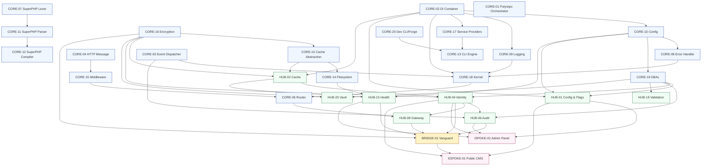

# 01 — Master Index & Governance

**Status:** Canonical
**Supersedes:** `docs/evaluation/BLUEPRINT_RANKINGS.md`, `docs/evaluation/EVALUATION_SUMMARY.md`, `docs/hub-taxonomy/hub-blueprint-taxonomy.md` (for ID→component mapping only; the taxonomy's classification schema remains useful)
**Last verified against `main`:** 2026-08-04

This document is the **single source of truth** for the DGLab Sovereign Stack architecture. If any other document in the repository disagrees with this index on an ID→component mapping, tier count, or cross-reference, **this index is correct and the other document is stale** (per Governance Rule 1).

---

## §1. Single-Source-of-Truth Declaration

### Canonical (active development)

| Path | Contents |
|---|---|
| `docs/blueprints/Core/CORE-01..20` | 20 Core-tier blueprints |
| `docs/blueprints/Hub/HUB-01..30` | 30 Hub-tier blueprints |
| `docs/blueprints/Spoke/Internal/ISPOKE-01..25` | 25 Internal Spoke blueprints (10 are placeholders per Finding 13) |
| `docs/blueprints/Spoke/External/ESPOKE-01..15` | 15 External Spoke blueprints |
| `docs/blueprints/Spoke/Bridge/BRIDGE-01` | 1 Bridge blueprint |
| `docs/blueprints/Deploy/DEPLOY-00..04` | 5 Deploy blueprints (4 are new per §6) |
| `docs/decisions/ADR-001..010` | 10 Architecture Decision Records (new — see Finding 19) |
| `orchestrator/` | CORE-01 reference implementation (real, tested) |
| `packages/core/event-dispatcher/` | CORE-03 reference implementation (real, tested) |
| `packages/core/container/` | CORE-02 reference implementation (stub only — see Finding 8; full spec in `blueprints/Core/CORE-02-di-container.md`) |

### Archived (Vision A — monolith rebuild; do not add new work)

| Path | Reason |
|---|---|
| `docs/architecture/origin/**` | Vision A monolith docs; contradicts Vision B (Finding 1, 5, 6, 7) |
| `docs/architecture/origin/Mobile_Optimized/**` | Byte-duplicate of `Sovereign_Stack_Blueprint/` (Finding 5) |
| `Legacy/**` | Superseded code |
| `docs/evaluation/BLUEPRINT_RANKINGS.md` | Scores a version of Core that no longer exists (Finding 2) |
| `docs/evaluation/EVALUATION_SUMMARY.md` | Derived from the stale rankings (Finding 2) |
| `docs/evaluation/SOLUTIONS_TO_WEAKNESSES.md` | Solutions never merged into blueprints (Finding 11); delete once merged |

### Replaced (root-level artifacts)

| Path | Replacement |
|---|---|
| Root `Dockerfile` | Serves legacy docs (Finding 18); replaced by `blueprints/Deploy/DEPLOY-01-core-hub.md` image spec |
| Root `render.yaml` | Free-tier docs hosting; replaced by DEPLOY-00 (docs) + DEPLOY-01 (app) |
| Root `docker-compose.yml` | Empty (Finding 17); replaced by DEPLOY-01 dev-environment compose file |

---

## §2. Corrected Core-Tier Map

| ID | Component | Namespace | Real implementation | Build status |
|---|---|---|---|---|
| CORE-01 | Polyrepo Orchestrator ("Loom") | `SovereignStack\Orchestrator` | `orchestrator/` | ✅ Implemented + tested |
| CORE-02 | Dependency Injection Container | `SovereignStack\Core\Container` | `packages/core/container/` | ❌ **Stub only (`.gitkeep`) — blocking** |
| CORE-03 | PSR-14 Event Dispatcher | `SovereignStack\Core\EventDispatcher` | `packages/core/event-dispatcher/` | ✅ Implemented + tested |
| CORE-04 | PSR-7 HTTP Message & Factory | `SovereignStack\Core\Http` | — | 📝 Not started |
| CORE-05 | PSR-15 Middleware & Request Handler | `SovereignStack\Core\Http` | — | 📝 Not started |
| CORE-06 | Attribute-Based Router | `SovereignStack\Core\Router` | — | 📝 Not started |
| CORE-07 | SuperPHP Lexer | `SovereignStack\Core\SuperPHP\Lexer` | — | 📝 Not started |
| CORE-08 | Global Error & Exception Handler | `SovereignStack\Core\Error` | — | 📝 Not started |
| CORE-09 | PSR-3 Logging Service | `SovereignStack\Core\Logging` | — | 📝 Not started |
| CORE-10 | Configuration & Environment Loader | `SovereignStack\Core\Config` | — | 📝 Not started |
| CORE-11 | SuperPHP Parser | `SovereignStack\Core\SuperPHP\Parser` | — | 📝 Not started |
| CORE-12 | SuperPHP Compiler | `SovereignStack\Core\SuperPHP\Compiler` | — | 📝 Not started |
| CORE-13 | CLI Engine (Console) | `SovereignStack\Core\Console` | — | 📝 Not started |
| CORE-14 | Filesystem Abstraction | `SovereignStack\Core\Filesystem` | — | 📝 Not started |
| CORE-15 | Cache Abstraction (PSR-6/16) | `SovereignStack\Core\Cache` | — | 📝 Not started |
| CORE-16 | Binary Encryption Envelope | `SovereignStack\Core\Crypto` | — | 📝 Not started |
| CORE-17 | Service Provider System | `SovereignStack\Core\Providers` | — | 📝 Not started |
| CORE-18 | Core Kernel & Lifecycle | `SovereignStack\Core\Kernel` | — | 📝 Not started |
| CORE-19 | Database Abstraction Layer | `SovereignStack\Core\Database` | — | 📝 Not started |
| CORE-20 | Developer CLI Toolchain ("Sovereign Forge") | `SovereignStack\Forge` | — | 📝 Not started |

**Evaluation-layer mapping (stale, do not use):** CORE-01="Bootstrapper & Kernel", CORE-02="Lifecycle Hooks", CORE-03="Service Container", CORE-04="Encryption Primitives", CORE-05="Router & Dispatch", CORE-07="Middleware Pipeline", CORE-09="Error Handling", CORE-11="ORM & Query Builder", CORE-14="Caching Layer", CORE-15="Validation Engine", CORE-16="Logging & Observability", CORE-18="Event System", CORE-19="Service Locator". All wrong (see Finding 2).

---

## §3. Cross-Reference Corrections

Every cross-reference in the approved blueprint set was re-verified against §2. The following were wrong and are corrected:

| Source file | Wrong reference | Correct reference | Finding |
|---|---|---|---|
| `BRIDGE-01.md` | `CORE-09: Cryptography & Hashing (Payload Verification)` | `CORE-16: Binary Encryption Envelope` | 3 |
| `BRIDGE-01.md` | `CORE-01: Polyrepo Orchestrator (Enforcement Logic)` | (remove — CORE-01 is the release tool, not an enforcement component) | 3 |
| `BRIDGE-01.md` | `CORE-06: Router (Gateway Routing)` | `HUB-08: Sovereign Gateway` (already listed; CORE-06 is the attribute router, not the gateway) | 3 |
| `CORE-03.md` | "referencing CORE-08" for listener exception logging | `CORE-09: PSR-3 Logging Service` (CORE-08 is the Error Handler; logging is CORE-09) | 20 |
| `CORE-03.md` | "Reference: /thephpleague/event" | (remove — `thephpleague/event` is not a dependency; only `psr/event-dispatcher` is) | 20 |
| `hub-blueprint-taxonomy.md` | "Medium \| 6" (lists 5) | "Medium \| 5" | 14 |
| `hub-blueprint-taxonomy.md` | Total "31" | Total "30" | 14 |
| `EVALUATION_SUMMARY.md` | "Approved Blueprints: 81" | "Approved Blueprints: 82" (rises to 92 with ISPOKE-16–25, 97 with DEPLOY-02–04) | 16 |

---

## §4. Corrected Tier Inventory

| Tier | Documented (approved files) | Placeholder-only | New (this bundle) | **True total** |
|---|---|---|---|---|
| Core | 20 | 0 | 0 | **20** |
| Hub | 30 | 0 | 0 | **30** |
| Internal Spoke | 15 | 10 (ISPOKE-16–25) | 0 | **25** |
| External Spoke | 15 | 0 | 0 | **15** |
| Bridge | 1 | 0 | 0 | **1** |
| Deploy | 1 | 0 | 4 (DEPLOY-00, 02, 03, 04) | **5** |
| **Total** | **82** | **10** | **4** | **96** |

**Criticality distribution (Hub tier, corrected from Finding 14):**

| Criticality | Count | Blueprints |
|---|---|---|
| Critical | 10 | HUB-01, 02, 04, 05, 08, 09, 10, 19, 20, 21 |
| High | 15 | HUB-03, 06, 07, 11, 12, 14, 15, 17, 22, 24, 25, 26, 27, 29, 30 |
| Medium | 5 | HUB-13, 16, 18, 23, 28 |
| **Total** | **30** | |

---

## §5. Tier Dependency DAG & Build Sequence

### Dependency DAG (Mermaid)

### Revised Build Sequence (11 Steps)

The evaluation's sequence (`CORE-01 → CORE-02 → CORE-03 → CORE-05 → CORE-06 → CORE-07 → CORE-10`) is wrong (Finding 2). The correct sequence, derived from the DAG above:

| Step | Work items | Entry criteria | Exit criteria | Est. effort |
|---|---|---|---|---|
| 1 | **CORE-02** (DI Container) | None — foundational leaf | Container compiles, autowires, detects cycles, passes PSR-11 suite | 1 week |
| 2 | **CORE-10, CORE-09, CORE-08** (Config, Logging, Error Handler) — parallelizable | Step 1 lands | All three pass their CI suites; Config loads `.env` and JSON; Logging writes structured JSON; Error Handler converts all PHP errors to exceptions | 2 weeks |
| 3 | **CORE-18** (Kernel) | Steps 1–2 land | Kernel boots, runs boot-phase events via CORE-03, terminates cleanly | 1 week |
| 4 | **CORE-04 → CORE-05 → CORE-06** (HTTP Message → Middleware → Router) — sequential | Step 3 lands | A "Hello World" request completes the full pipeline (Kernel → Middleware → Router → Controller → Response) | 2 weeks |
| 5 | **CORE-19, CORE-15, CORE-14, CORE-16** (DBAL, Cache, Filesystem, Encryption) — parallelizable | Step 1 lands (do not need Kernel) | Each passes its CI suite; DBAL supports PostgreSQL; Cache supports PSR-6/16; Filesystem abstracts local + S3; Encryption uses AES-256-GCM | 3 weeks |
| 6 | **CORE-07 → CORE-11 → CORE-12** (SuperPHP Lexer → Parser → Compiler) — sequential | None (independent of HTTP pipeline) | SuperPHP can render a template with variables and conditionals | 3 weeks |
| 7 | **CORE-13, CORE-17, CORE-20** (CLI, Service Providers, Dev Toolchain) — parallelizable | Steps 1–3 land | CLI can run commands; Service Providers can register bindings; Forge can scaffold a new Hub service | 2 weeks |
| 8 | **Hub tier** (30 blueprints) in `hub-dependency-graph.md` order | Steps 1–7 land | All 30 Hub blueprints pass CI; HUB-15 reports all Hub services healthy | 12 weeks |
| 9 | **BRIDGE-01** (Vanguard) | Step 8 lands (at minimum HUB-04, HUB-06, HUB-08, HUB-15) | Bridge enforces default-deny; DTO transformation works; zero-exposure test passes | 2 weeks |
| 10 | **Internal Spokes 01–15**, then **16–25** | Step 9 lands | All 25 Internal Spokes pass CI; admin panel operational | 12 weeks |
| 11 | **External Spokes 01–15** | Step 9 lands (parallel with Step 10 if Bridge is stable) | All 15 External Spokes pass CI; public CMS serves traffic through Bridge | 8 weeks |

**Minimum critical path:** Steps 1 → 2 → 3 → 4 → 8 → 9 → 11 = **1 + 2 + 1 + 2 + 12 + 2 + 8 = 28 weeks** of sequential work, plus Steps 5, 6, 7 overlapping with Step 4, and Step 10 overlapping with Step 11. **Realistic end-to-end with a 3-person team: 40–48 weeks** (per Finding 15).

---

## §6. Deploy Tier — Expanded Scope

The current `DEPLOY-01` deploys only Markdown documentation (Finding 9) and serves the *legacy* documentation at that (Finding 18). The Deploy tier is expanded to 5 blueprints:

| ID | Component | Replaces / new | Description |
|---|---|---|---|
| DEPLOY-00 | Documentation Site | New (renamed from current DEPLOY-01) | Free-tier Render web service serving `docs/blueprints/` (the canonical tree, not `docs/architecture/origin/`) |
| DEPLOY-01 | Core & Hub Service Deployment | New (replaces docs-only DEPLOY-01) | Containerized deployment of Core + Hub tiers; OCI image per Hub service; health checks wired to HUB-15 |
| DEPLOY-02 | Datastore Provisioning | New | PostgreSQL, Redis, and queue broker provisioning; connection-secret management via Vault or sealed-secrets; backup/restore |
| DEPLOY-03 | Bridge & External Spoke Deployment | New | Public-facing tier; CDN/edge caching; network isolation rules for Bridge "Zero-Exposure Test"; 3-replica Vanguard |
| DEPLOY-04 | Multi-Environment & Promotion Pipeline | New | dev → staging → production across 50+ repos; ties into CORE-01 (Loom) for version-bump automation; immutable image digest promotion |

Full spec for DEPLOY-01 is in `blueprints/Deploy/DEPLOY-01-core-hub.md`. DEPLOY-00, 02, 03, 04 are scoped here and will be written in a follow-up pass.

---

## §7. Governance Rules

These rules are binding on all future contributions to the DGLab repository. CI must enforce them.

### Rule 1 — One Numbering Authority
This file (§2, §4) is the only place Core/Hub/Spoke/Bridge/Deploy IDs are defined. A blueprint and this index disagreeing is a **broken build** — CI must fail if a blueprint file's ID→component mapping does not match §2.

### Rule 2 — No Performance Target Without a Method
Every performance target in every blueprint must name:
1. **Harness** — the benchmark tool (e.g., PHPUnit `--group performance`, `wrk`, `k6`)
2. **Baseline** — hardware/runtime (e.g., GitHub Actions `ubuntu-latest`, PHP 8.3, opcache enabled, no Xdebug)
3. **Load model** — concurrency, request mix, dataset size

If a target cannot meet this bar, it must be marked **"provisional, unverified"** explicitly. Bare millisecond claims (e.g., "< 1ms") are forbidden without a measurement plan. This resolves Finding 10.

### Rule 3 — Evaluation Docs Are Dated Snapshots
`docs/evaluation/` documents must carry a header: `Valid as of commit <sha>. Do not use for planning without re-verification.` The current evaluation is valid as of an unknown commit prior to the Core-tier renumbering; it is stale and must not be used. This resolves Finding 2.

### Rule 4 — Rejections Need a Real Reason
Each file in `docs/blueprints/disapproved/` must have a `REASON.md` (or front-matter `reason:` field) stating specifically what was rejected and why. The single boilerplate file *"Reason: Varying from the original blueprints"* is insufficient and is deleted. This resolves Finding 12.

### Rule 5 — Solutions Must Land in the Artifact, Not Beside It
A weakness write-up in `SOLUTIONS_TO_WEAKNESSES.md` (or any equivalent) is **not resolved** until the referenced blueprint file is edited. The solutions document is a TODO list, not a fix. Once all items are merged into blueprints, the solutions document is deleted. This resolves Finding 11.

### Rule 6 — Duplicate Directories Require a Diff Check Before Merge
CI must verify that `*_Optimized`, `*_v2`, `*_mobile`, etc. are not byte-identical (or near-identical within a 5% size delta) to their source. If they are, the duplicate is deleted. This resolves Findings 5 and 18.

### Rule 7 — Blueprint Fidelity Bar
Every approved blueprint must include, at minimum:
- Real PHP 8.3 interface contracts (not prose-only descriptions)
- At least one complete, compilable class implementation
- SQL DDL if the component persists state
- At least one Mermaid sequence diagram for the primary flow
- Explicit dependency lists cross-referenced to canonical IDs in §2
- Benchmark methodology per Rule 2
- CI verification criteria (branch coverage, static analysis, security tests)
- Security properties (explicit invariants)
- SemVer impact

A blueprint that fails this bar is rejected at PR review. This resolves Finding 4.

### Rule 8 — ADRs Are Required for Non-Obvious Decisions
Any architectural decision that has a viable alternative must be recorded as an ADR in `docs/decisions/` before the corresponding blueprint is merged. The 10 ADRs in `02_ADR/` are the initial set; future decisions must follow the same Nygard format. This resolves Finding 19.

---

## §8. Fidelity Bar (Enforced)

Every blueprint in this bundle (`blueprints/**`) meets the following bar. If any file falls short, file it as a defect.

| Element | Requirement | Resolves |
|---|---|---|
| Interface contracts | Real PHP 8.3 interfaces with full docblocks, parameter types, return types, `@throws` | Finding 4 |
| Reference implementation | At least one complete, compilable class per blueprint | Finding 4 |
| SQL DDL | Required for any component that persists state; includes indexes, constraints, engine selection | Finding 4 |
| Diagrams | At least one Mermaid sequence diagram; state diagrams where lifecycle is non-trivial | Finding 4 |
| Dependency status | Explicit upward/downward/runtime lists, cross-referenced to §2 | Findings 2, 3 |
| Benchmark methodology | Named harness, baseline, load model; bare ms forbidden | Finding 10 |
| CI verification criteria | Branch coverage, static analysis, security tests, integration scenarios | Finding 4 |
| Security properties | Explicit invariants (e.g., "tenant A can never read tenant B's cache keys") | Finding 11 |
| Migration notes | How to land without breaking downstream; rollback procedure | Finding 4 |
| SemVer impact | Major / minor / patch with justification | Finding 4 |
| Resolves | Which finding(s) from `00_CRITIQUE.md` this blueprint addresses | — |

---

## §9. Change Log

| Date | Change | Author |
|---|---|---|
| 2026-08-04 | Initial canonical declaration; supersedes stale evaluation layer | Independent re-analysis |
