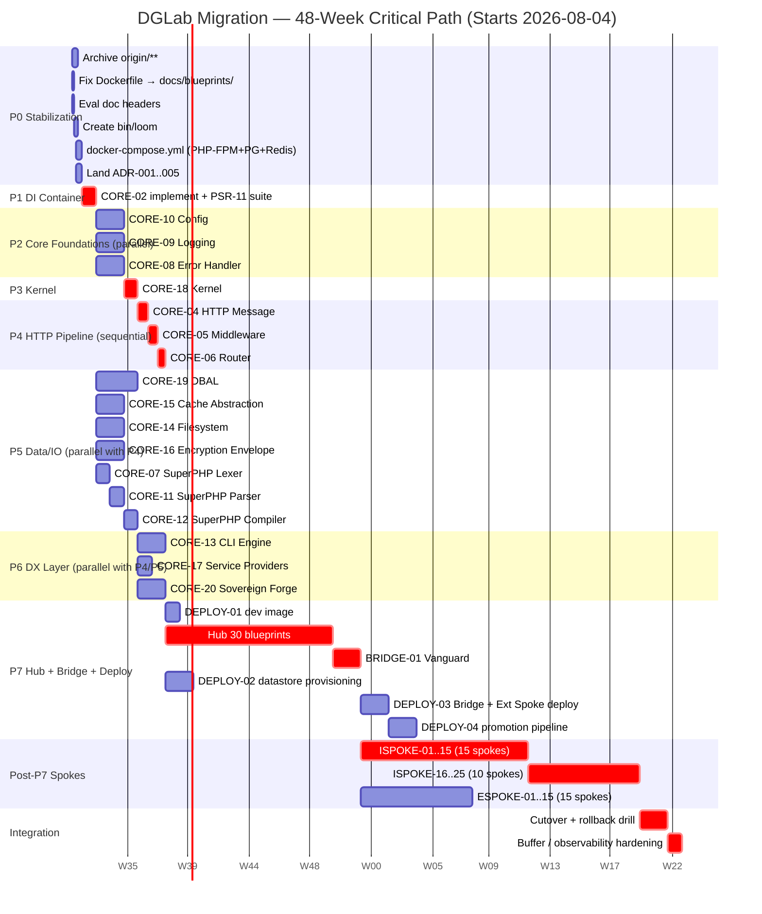

# 04 — Phased Migration Plan

**Status:** Canonical
**Replaces:** "32-week timeline" in `docs/evaluation/BLUEPRINT_RANKINGS.md` line 253 (Finding 15)
**Last verified against `main`:** 2026-08-04
**Total duration:** 48 weeks (3-person team, with stated parallelism assumptions)
**Critical-path duration (P0–P7):** 19 weeks of sequential engineering, plus 24 weeks of post-P7 Spoke build-out and 5 weeks of integration/buffer

This document defines the only authorized migration sequence for moving the DGLab repository from its current broken state — two coexisting architectures, an empty CORE-02 stub, an empty `docker-compose.yml`, a Dockerfile serving the *legacy* documentation, a stale evaluation layer, and 30 prose-only Hub blueprints — to the canonical target architecture declared in `01_MASTER_INDEX.md`. Every work item is concrete (file path or blueprint ID). Every exit criterion is measurable. No item is left as "TBD."

---

## §0. Executive Summary

The DGLab repository cannot be migrated in a single cut-over: dependencies are tangled, the team surface is small, and existing artifacts actively mislead. This plan partitions the work into **eight phases (P0–P7)** plus a defined post-P7 Spoke build-out. Phases are sequenced so every phase's entry criteria depend only on artifacts from earlier phases or parallel tracks. The critical path runs P0 → P1 → P2 → P3 → P4 → P7 (Hub + Bridge + Deploy), with P5 (Data/IO) and P6 (DX) in parallel with P4.

The single highest-leverage work item is **CORE-02** (P1): it is the dependency root of the entire Hub tier and unblocks more downstream work than any other PR. The plan closes all 21 findings from `00_CRITIQUE.md` by end of P7 (mapping in §7). It assumes a 3-person engineering team plus one part-time technical writer. Hiring a fourth engineer in Week 4 is the named contingency for Schedule Risk (R-06); the plan is structured so that contingency can be triggered without re-baselining.

---

## §1. Critical Path Diagram

The Gantt chart below shows the 8 phases, their internal parallelism, and the post-P7 Spoke build-out. Tasks marked `crit` are on the critical path. Tasks on parallel tracks (P5, P6) start as soon as their dependencies land.

**Critical-path arithmetic:** P0(1) + P1(1) + P2(2) + P3(1) + P4(2) + P7 Hub(12) + P7 Bridge(2) + ISPOKE-01..15(12) + ISPOKE-16..25(8) + Integration(2) + Buffer(1) = **44 weeks**. The remaining 4 weeks absorb review latency, CI queueing, and the R-06 contingency. P5 (3w) and P6 (2w) run on parallel tracks completing before the Hub tier starts in P7; their completion is an entry criterion for several Hub blueprints (HUB-02 needs CORE-15 + CORE-16; HUB-19 needs CORE-19; HUB-20 needs CORE-16).

---

## §2. Quick Wins (First 2 Weeks)

These items deliver immediate, demonstrable value with low effort. All seven are completable within the first 10 working days of P0 + P1 and resolve findings that block planning conversations today.

| # | Work item | File path / blueprint | Effort | Finding closed | Why it matters now |
|---|---|---|---|---|---|
| QW-1 | Archive `docs/architecture/origin/**` to `docs/_archived/origin/` with `ARCHIVED.md` marker | `docs/_archived/origin/ARCHIVED.md` (new) | 0.5d | 1, 5, 6, 7 | New contributors don't read the superseded monolith vision |
| QW-2 | Rewrite root `Dockerfile` to serve `docs/blueprints/` until DEPLOY-01 lands | `Dockerfile` | 0.5d | 18 | Public docs site no longer shows wrong architecture |
| QW-3 | Add `Valid as of commit <sha>` header to every `docs/evaluation/` file | `docs/evaluation/{BLUEPRINT_RANKINGS,EVALUATION_SUMMARY,SOLUTIONS_TO_WEAKNESSES}.md` | 0.5d | 2 | Stakeholders stop citing stale scores |
| QW-4 | Create `orchestrator/bin/loom` shebang (Symfony Console) wiring to existing `CIMonitor` | `orchestrator/bin/loom` (new) | 1d | 21 | `composer install && vendor/bin/loom` works as documented |
| QW-5 | Add `docker-compose.yml` with PHP-FPM 8.3 + PostgreSQL 16 + Redis 7 + Nginx + Mailpit | `docker-compose.yml`, `docker/php/Dockerfile`, `docker/nginx/default.conf` | 2d | 17 | Every developer gets identical local environment |
| QW-6 | Replace boilerplate `disapproved/REASON.md` with per-file `REASON.md` citing the specific deviation | `docs/blueprints/disapproved/*/REASON.md` (72 new files, scripted) | 2d | 12 | Future contributors can mine the disapproved set |
| QW-7 | Implement CORE-02 DI Container: PSR-11 conformance, autowiring, compiler passes, cycle detection | `packages/core/container/src/Container.php` + 6 supporting classes + tests | 5d | 8 | Unblocks the entire Hub tier — highest-leverage PR in the system |

**Elapsed time:** 10 working days. QW-1 through QW-6 are sequential within one engineer; QW-7 starts on Day 6 in parallel with QW-3 through QW-6 (different engineer).

---

## §3. The 8 Phases

### Phase P0 — Stabilization

**Goal:** Stop the bleeding: archive the wrong architecture, fix the wrong Dockerfile, date the wrong evaluation, stand up a real local-dev environment, and land the initial ADRs.

**Entry criteria:** This migration plan is merged to `main`; a working `git` remote of `DGCodeIdeas/DGLab` exists; one backend engineer + one DevOps engineer are allocated.

**Work items:**
1. **Archive Vision A tree.** `git mv docs/architecture/origin docs/_archived/origin` + add `docs/_archived/origin/ARCHIVED.md` stating the tree is superseded and pointing to `01_MASTER_INDEX.md` §1. Closes Findings 1, 5, 6, 7.
2. **Fix root `Dockerfile` (interim).** Change `-t docs/architecture/origin` to `-t docs/blueprints`. Replaced by DEPLOY-01 image in P7. Closes Finding 18.
3. **Date-stamp evaluation docs.** Add header `<!-- Valid as of commit <sha>. Do not use for planning without re-verification. -->` (sha from `git log -1 --format=%H -- <file>`) to `docs/evaluation/{BLUEPRINT_RANKINGS,EVALUATION_SUMMARY,SOLUTIONS_TO_WEAKNESSES}.md`. Closes Finding 2.
4. **Create `orchestrator/bin/loom`.** `#!/usr/bin/env php` shebang wiring to `SovereignStack\Orchestrator\Console\LoomCommand` (extends `Symfony\Console\Command\Command`), delegating to existing `CIMonitor::checkViaLocalExecution()` and `DependencyGraph::topologicalSort()`. `chmod +x`. Closes Finding 21.
5. **Stand up `docker-compose.yml`.** Services: `php-fpm` (PHP 8.3 from `docker/php/Dockerfile` with required Core extensions), `nginx` (config at `docker/nginx/default.conf`), `postgres` (PostgreSQL 16, volume `pgdata`), `redis` (Redis 7), `mailpit`. Add `.env.example`. Closes Finding 17.
6. **Land initial ADR-001 through ADR-005** from `02_ADR/`: polyrepo-vs-monorepo, PSR-11 container choice, ES256 JWT, Argon2id, ULID-over-UUID. Pre-conditions for P1 and P2. Closes Finding 19 (partial).
7. **Replace boilerplate rejection reason.** Delete the single shared reason file. Generate one `REASON.md` per rejected blueprint via scripted diff against the approved equivalent, citing the specific deviation. Closes Finding 12.
8. **Rewrite CORE-03 blueprint** to match the existing `packages/core/event-dispatcher/` implementation: PSR-14 strict compliance (not "Emit and Forget"); remove `thephpleague/event` reference (not a dependency); correct "referencing CORE-08" to "referencing CORE-09 (Logging Service)". Closes Finding 20.

**Exit criteria:**
- `docs/_archived/origin/ARCHIVED.md` exists; `docs/architecture/origin/` does not (`test ! -d`).
- Root `Dockerfile` contains `-t docs/blueprints` and not `-t docs/architecture/origin` (`grep`).
- Every file under `docs/evaluation/` has a first-line `Valid as of commit <sha>` header (verified by `ci/check-eval-headers.sh`).
- `orchestrator/bin/loom` exists, is executable, and `loom --version` returns `Loom v<major>.<minor>.<patch>`.
- `docker compose up -d` brings up 5 services; `docker compose ps` shows 5 healthy; `curl -fsS http://localhost:8080/health` returns 200.
- `docs/decisions/ADR-001.md` through `ADR-005.md` exist in Nygard format, verified by `ci/check-adr-format.sh`.
- Per-file `REASON.md` count equals the number of disapproved entries.
- `blueprints/Core/CORE-03-event-dispatcher.md` does not contain `Emit and Forget`, `thephpleague/event`, or `referencing CORE-08`.

**Rollback procedure:** All P0 items are independent single-commit reverts (`git mv`, single-line Dockerfile change, header revert, `bin/loom` delete, compose delete, ADR deletes, `REASON.md` deletes with boilerplate restore, CORE-03 revert).

**Estimated effort:** 1 week, 2 engineers.

**Findings resolved:** 1, 2, 5, 6, 7, 12, 17, 18, 19 (partial), 20, 21.

---

### Phase P1 — Close CORE-02 (DI Container)

**Goal:** Implement the single highest-leverage component in the system: the PSR-11 DI Container that every Hub blueprint transitively depends on.

**Entry criteria:** P0 exit criteria met; ADR-002 (PSR-11 container over PHP-DI / Symfony DI / Laravel container) merged; `packages/core/container/composer.json` exists (verified 2026-08-04).

**Work items:**
1. **Implement `Container` class** per `blueprints/Core/CORE-02-di-container.md`. Implements `psr/container`'s `ContainerInterface`. Supports autowiring via Reflection; exposes `register()` / `bind()` / `singleton()` / `factory()` APIs; runs compiler passes; detects circular dependencies via depth-first traversal that throws `CircularDependencyException` with the full cycle path.
2. **Source files:** `packages/core/container/src/{Container,ContainerBuilder,Definition,Resolver}.php`, `Exception/{CircularDependencyException,NotFoundException,ContainerException}.php`.
3. **Tests (100% branch coverage required):** `ContainerTest.php` (happy path), `CircularDependencyTest.php` (3-node, self, 10-node cycles), `AutowiringTest.php` (constructor, scalar via attribute, union, nullable), `CompilerPassTest.php` (order, definition modification), `Psr11ConformanceTest.php` (official `psr/container` suite), `FuzzTest.php` (10,000 random service graphs; Infection MSI ≥ 95%).
4. **Benchmark** (Rule 2): `packages/core/container/tests/Performance/BenchTest.php` with PHPUnit `--group performance` on GitHub Actions `ubuntu-latest`, PHP 8.3, opcache enabled, no Xdebug. Load model: 1,000 services, 3-level deep resolution, cold container. Assert `< 1ms` median and `< 1MB` overhead; mark "provisional, unverified" if exceeded.
5. **CI:** `packages/core/container/.github/workflows/ci.yml` runs PHPStan level 8, Psalm level 6, PHPUnit 100% branch coverage gate, Infection MSI ≥ 95%.

**Exit criteria:**
- `packages/core/container/src/Container.php` exists and implements `Psr\Container\ContainerInterface` (Reflection).
- PHPUnit exits 0 with 100% branch coverage.
- PHPStan level 8 and Psalm level 6 exit 0.
- Infection MSI ≥ 95%.
- PSR-11 conformance suite passes 100%.
- Fuzz test passes 10,000 random service graphs with zero uncaught exceptions.
- Benchmark report attached as CI artifact.

**Rollback procedure:** Delete `packages/core/container/src/*.php`; restore `.gitkeep`. No downstream code consumes CORE-02 yet (P1 is the first consumer), so rollback is safe. Tag the broken commit `core-02-rollback-<date>` for recoverability.

**Estimated effort:** 1 week, 1 senior engineer.

**Findings resolved:** 8. (Also 10 partial — CORE-02 performance target now grounded.)

---

### Phase P2 — Core Foundations (Config, Logging, Error Handler)

**Goal:** Build the three foundational services that every other Core component depends on, in parallel.

**Entry criteria:** P1 merged; ADR-006 (PostgreSQL-over-MySQL), ADR-007 (Redis-over-Memcached), ADR-008 (Argon2id-over-bcrypt) merged.

**Work items (parallel tracks, one engineer per track):**

**Track A — CORE-10 Config** (`packages/core/config/`): `Config` class with `.env` (via `vlucas/phpdotenv`) and JSON loading, env-var override. Source: `Config.php`, `Loader/{EnvLoader,JsonLoader}.php`, `MutableConfig.php`. Tests: `ConfigTest.php`, `EnvOverrideTest.php`. Benchmark: load 100-key config under 5ms.

**Track B — CORE-09 Logging** (`packages/core/logging/`): `Logger` implementing `Psr\Log\LoggerInterface`. Structured JSON to stdout, file, or syslog. Source: `Logger.php`, `Handler/{StreamHandler,SyslogHandler}.php`, `Formatter/JsonFormatter.php`. Tests: `LoggerTest.php`, `JsonFormatterTest.php`. Benchmark: 10,000 log writes under 100ms.

**Track C — CORE-08 Error Handler** (`packages/core/error/`): Converts PHP errors to `ErrorException`; registers `set_exception_handler`, `set_error_handler`; delegates fatal-error logging to CORE-09 via constructor injection. Source: `ErrorHandler.php`, `Exception/ErrorException.php`, `ShutdownHandler.php`. Tests: `ErrorHandlerTest.php`, `IntegrationWithLoggerTest.php`. Benchmark: error-to-exception overhead under 0.05ms.

**Cross-track:** All three tracks agree on the `ContainerInterface` from P1 for DI. Daily 15-minute sync.

**Exit criteria:**
- All three packages have `src/` populated with real PHP 8.3 classes (verified by `ls packages/core/{config,logging,error}/src/*.php`).
- Each PHPUnit suite passes with ≥95% branch coverage (gate at 95% for parallel velocity; raise to 100% before P3 starts).
- PHPStan level 8 clean for all three.
- CORE-10: `Config::get('database.host')` returns the value from `.env` (integration test).
- CORE-09: `Logger::info('test', ['key' => 'value'])` writes a single JSON line with `level`, `message`, `key`, `timestamp` to stdout (capture `php://stdout` in test).
- CORE-08: `trigger_error('test', E_USER_WARNING)` results in thrown `ErrorException` with message `'test'` (`expectException`).
- All three benchmark reports attached as CI artifacts.

**Rollback procedure:** Each track is an independent PR; revert the failing one. `git rm -r packages/core/<package>/src/` and restore `.gitkeep`. The Hub tier (P7) does not start until all three merge, so rollback does not strand downstream work.

**Estimated effort:** 2 weeks, 3 engineers in parallel.

**Findings resolved:** 4 (partial), 10 (partial), 11 (partial), 19 (partial — ADR-006, 007, 008 land).

---

### Phase P3 — Kernel

**Goal:** Implement CORE-18 (Core Kernel & Lifecycle), which orchestrates the boot sequence and wires Config + Logging + Error Handler + Event Dispatcher + Container.

**Entry criteria:** P1 (CORE-02), P2 (CORE-08, CORE-09, CORE-10) merged; CORE-03 (Event Dispatcher) already implemented in `packages/core/event-dispatcher/`; ADR-009 (Kahn's algorithm for tier ordering, referenced from `orchestrator/src/DependencyGraph.php`) merged.

**Work items:**
1. **Implement `Kernel` class** at `packages/core/kernel/src/Kernel.php`. Phases: `bootstrap()` (register error handler, init logger, load config, build container), `boot()` (dispatch `KernelBootedEvent` via CORE-03; service-provider registration is a placeholder until P6), `handle(Request): Response` (delegates to router — placeholder until P4), `terminate(Request, Response): void` (dispatches `KernelTerminatedEvent`).
2. **Source files** under `packages/core/kernel/src/`: `Kernel.php`, `KernelInterface.php`, `Bootstrap/` (5 stage classes), `Event/` (3 event classes).
3. **Tests:** `KernelTest.php` (full cycle), `BootstrapStageTest.php`, `EventDispatchTest.php` (events in order via CORE-03), `ErrorHandlingTest.php` (exception in any stage caught by CORE-08 and logged by CORE-09), `Performance/HelloWorldBenchTest.php` (end-to-end "Hello World"; target `< 10ms` on Rule-2 baseline; mark provisional if not met).
4. **Update `orchestrator/bin/loom`** with `bench:hello-world` subcommand invoking `HelloWorldBenchTest.php`.

**Exit criteria:**
- `Kernel.php` exists, implements `KernelInterface`, compiles against P1 + P2 + CORE-03 (`composer install --dry-run`).
- `bootstrap()` + `boot()` run without throwing; event log contains `KernelBootedEvent` exactly once.
- `terminate()` dispatches `KernelTerminatedEvent` exactly once.
- A fake `Request` into `handle()` returns a `Response` (501 placeholder until P4 acceptable).
- `trigger_error('test', E_USER_ERROR)` during `bootstrap()` is caught, logged via CORE-09, re-thrown as `ErrorException`.
- Benchmark: `HelloWorldBenchTest` measures < 10ms median over 1,000 requests on Rule-2 baseline; report attached as CI artifact.

**Rollback procedure:** Delete `packages/core/kernel/src/Kernel.php` and related files; restore `.gitkeep`. No downstream code consumes the Kernel until P4. Tag broken commit `core-18-rollback-<date>`.

**Estimated effort:** 1 week, 1 senior engineer.

**Findings resolved:** 4 (partial), 10 (partial — `< 10ms` grounded).

---

### Phase P4 — HTTP Pipeline (Message → Middleware → Router)

**Goal:** Build the PSR-7 / PSR-15 / attribute-based router stack that lets a request flow from the Kernel through middleware to a controller and back.

**Entry criteria:** P3 (CORE-18 Kernel) merged; ADR-010 (attribute-based routing over annotation-based or config-based) merged.

**Work items (strictly sequential):**

**Step 1 — CORE-04 HTTP Message** (`packages/core/http/`, 5d): PSR-7 (`ServerRequest`, `Response`, `Stream`, `UploadedFile`, `Uri`) + PSR-17 factories. Tests: PSR-7 conformance (`http-interop/http-factory-tests`), `StreamTest.php`, `UriTest.php`.

**Step 2 — CORE-05 Middleware** (`packages/core/http/`, 5d): PSR-15 `MiddlewareInterface`, `RequestHandlerInterface`, `MiddlewarePipe`. Source: `src/Middleware/{MiddlewarePipe,ClosureMiddleware,NotFoundHandler}.php`. Tests: PSR-15 conformance, `MiddlewarePipeTest.php` (chain of 5 executes in order).

**Step 3 — CORE-06 Router** (`packages/core/router/`, 4d): Attribute-based (`#[Route('GET', '/users/{id}')]`). Source: `src/{Router,Route,RouteCollector,RouteMatcher,CompiledRoute}.php`, `src/Attribute/Route.php`. Tests: `RouterTest.php` (static + dynamic, 404, 405, param extraction), `Performance/RouterBenchTest.php` (10,000 routes; match < 0.1ms).

**End-to-end test (after Step 3):** `tests/Integration/HelloWorldPipelineTest.php` constructs real `Kernel` → `MiddlewarePipe` → `Router` → `HelloController` (returns `new Response(200, [], 'Hello, World!')`). Sends `GET /` through `Kernel::handle()`. Asserts body is `Hello, World!` and status 200. This is the canonical P4 exit-criteria test.

**Exit criteria:**
- All three sub-components pass PSR-7 / PSR-15 conformance suites (CI).
- `HelloWorldPipelineTest.php` passes (verifies full pipeline).
- 100% branch coverage on `packages/core/http/` and `packages/core/router/`.
- Router benchmark: 10,000 routes, match < 0.1ms on Rule-2 baseline.
- No `@todo` or `@deprecated` markers in any new file.

**Rollback procedure:** Each step is a separate PR; revert the failing step. Reverting Step 3 (Router) leaves Kernel with a 501 handler — acceptable because no Hub blueprint depends on the Router alone. Reverting Step 1 implicitly reverts Steps 2 and 3 (they depend on it).

**Estimated effort:** 2 weeks, 1 engineer (sequential).

**Findings resolved:** 4 (partial), 10 (partial — Router perf grounded).

---

### Phase P5 — Data/IO Layer (parallel with P4)

**Goal:** Build the persistence and IO primitives the Hub tier requires: DBAL, Cache, Filesystem, Encryption, and the SuperPHP template chain.

**Entry criteria:** P1 (CORE-02) merged — P5 components depend on the container, not on the Kernel. ADR-006 (PostgreSQL), ADR-007 (Redis), ADR-008 (Argon2id), ADR-011 (SuperPHP design rationale, closed in this phase) merged or in flight.

**Work items (two parallel tracks):**

**Track A — Data primitives (3 engineers, 3 weeks parallel):**
- **CORE-19 DBAL** (`packages/core/database/`, 3w): PostgreSQL-first abstraction over PDO — prepared statements, transactions, schema introspection, query builder. Source: `Connection.php`, `QueryBuilder.php`, `Schema/`, `Type/TypeRegistry.php`. Tests: `ConnectionTest.php` (real PostgreSQL via P0 docker-compose), `QueryBuilderTest.php`. Benchmark: 1,000 inserts < 500ms.
- **CORE-15 Cache** (`packages/core/cache/`, 2w): PSR-6 + PSR-16 with Redis adapter (`predis/predis`). Source: `CacheItemPool.php`, `SimpleCache.php`, `Adapter/{RedisAdapter,MemoryAdapter}.php`. Tests: PSR conformance + `RedisAdapterTest.php`. Benchmark: 10,000 cache hits < 50ms.
- **CORE-14 Filesystem** (`packages/core/filesystem/`, 2w): Abstracts local + S3 (`async-aws/s3`). Source: `Filesystem.php`, `File.php`, `Adapter/{LocalAdapter,S3Adapter}.php`. Tests: `LocalAdapterTest.php`, `S3AdapterTest.php` (LocalStack).
- **CORE-16 Encryption Envelope** (`packages/core/crypto/`, 2w): AES-256-GCM for payloads, Argon2id for password hashing. Source: `Envelope.php`, `Key.php`, `PasswordHasher.php`. Tests: `EnvelopeTest.php` (256 fixtures), `PasswordHasherTest.php`. Benchmark: encrypt 1KB < 0.5ms.

**Track B — SuperPHP chain (1 engineer, 3 weeks sequential):**
- **CORE-07 Lexer** (1w): Tokenizes SuperPHP source. Source: `Token.php`, `TokenType.php`, `Lexer.php`, `Exception/SyntaxErrorException.php`. Tests: `LexerTest.php` (100 fixtures).
- **CORE-11 Parser** (1w): AST from tokens. Source: `Parser.php`, `Node/` (6 classes), `Ast.php`. Tests: `ParserTest.php`.
- **CORE-12 Compiler** (1w): Compiles AST to PHP source. Source: `Compiler.php`, `CompiledTemplate.php`. Tests: `CompilerTest.php` (variables, conditionals, loops).

**Cross-track integration test (end of week 3):** `tests/Integration/SuperPHPRenderTest.php` renders `Hello, {{ name }}!` with `name => 'World'`; asserts output is `Hello, World!`.

**Exit criteria:**
- All eight packages have `src/` populated with real PHP 8.3 classes (CI file existence checks).
- Each PHPUnit suite passes with ≥95% branch coverage (raise to 100% before P7 Hub starts).
- CORE-19: `Connection::query('SELECT 1')->fetchColumn()` returns `'1'` against docker-compose PostgreSQL.
- CORE-15: `SimpleCache::set/get` round-trips against docker-compose Redis.
- CORE-14: `Filesystem::write/read` round-trips on local + LocalStack S3 adapters.
- CORE-16: `Envelope::encrypt/decrypt` round-trips all 256 fixtures; `PasswordHasher::hash('test')` returns `$argon2id$...`.
- CORE-07/11/12: `SuperPHPRenderTest.php` passes.
- All four benchmarks attached as CI artifacts with Rule-2 baselines.

**Rollback procedure:** Each package is an independent PR; revert the failing one. Hub blueprints depending on a reverted package are blocked at entry. If the SuperPHP chain fails to compile, ADR-011 can be re-opened and Twig adopted (re-baseline required).

**Estimated effort:** 3 weeks, 4 engineers (3 on Track A, 1 on Track B).

**Findings resolved:** 4 (partial), 10 (partial), 11 (partial — Solutions for HUB-02 cache, HUB-11 queue, CORE-16 encryption merged).

---

### Phase P6 — DX Layer (parallel with P4/P5)

**Goal:** Build the developer-experience tools that make the rest of the migration productive: CLI engine, service provider system, and the Sovereign Forge scaffolding tool.

**Entry criteria:** P3 (CORE-18 Kernel) merged — CORE-17 hooks into Kernel's boot phase. P1 (CORE-02 Container) merged — CORE-17 registers bindings.

**Work items (parallel tracks):**
- **CORE-13 CLI Engine** (`packages/core/console/`, 2w): Symfony Console-based. Source: `Application.php`, `Command.php`, `Input.php`, `Output.php`, `CommandRegistry.php`. Tests: `ApplicationTest.php`, `CommandTest.php`. Integrates with `orchestrator/bin/loom` — `loom` becomes the canonical CLI entry point.
- **CORE-17 Service Providers** (`packages/core/providers/`, 1w): Each Hub service ships a Provider class that registers bindings. Source: `ServiceProvider.php`, `ProviderRegistry.php`, `BootPhase.php`. Tests: `ServiceProviderTest.php` (provider registers binding; binding resolves; boot phase runs).
- **CORE-20 Sovereign Forge** (`packages/forge/`, 2w): Scaffolding CLI. Commands: `forge:new:hub-service <name>`, `forge:new:spoke <name>`, `forge:new:blueprint <id>`. Source: `src/Command/{NewHubServiceCommand,NewSpokeCommand,NewBlueprintCommand}.php`, `src/Skeleton/`. Tests: `NewHubServiceCommandTest.php` (scaffolds a service; runs `composer install`; runs `phpunit`).

**Exit criteria:**
- `packages/core/console/`, `packages/core/providers/`, `packages/forge/` all have `src/` populated.
- Each PHPUnit suite passes with ≥95% branch coverage.
- `loom --list` shows: `bench:hello-world`, `forge:new:hub-service`, `forge:new:spoke`, `forge:new:blueprint`.
- `loom forge:new:hub-service Example` creates `services/Example/` with `composer.json`, `src/ExampleServiceProvider.php`, `tests/`, `.github/workflows/ci.yml`; `cd services/Example && composer install && vendor/bin/phpunit` exits 0.
- Service Provider: test provider registers `TestInterface → TestImpl`; `$c->get(TestInterface::class)` returns `TestImpl`.

**Rollback procedure:** Each package is independent; revert the failing one. If CORE-17 is reverted, Kernel's boot phase works but no Hub bindings register — this blocks P7 Hub start, so CORE-17 must land cleanly. If CORE-20 Forge is reverted, scaffolding is manual; velocity hit but no functional regression.

**Estimated effort:** 2 weeks, 2 engineers.

**Findings resolved:** 4 (partial), 10 (partial).

---

### Phase P7 — Hub + Bridge + Deploy (12 weeks)

**Goal:** Build the 30 Hub blueprints in dependency order, ship BRIDGE-01 with corrected cross-references, stand up real containerized deployment (DEPLOY-01 through DEPLOY-04), and integrate everything via HUB-15 health aggregation.

**Entry criteria:** P0 through P6 merged (critical path: P4; parallel tracks: P5 + P6). `blueprints/Hub/hub-dependency-graph.md` (referenced from `01_MASTER_INDEX.md` §5) is the authoritative Hub build order.

**Work items:**

1. **DEPLOY-01 dev image (week 1).** Multi-stage OCI image from `blueprints/Deploy/DEPLOY-01-core-hub.md` (build: composer install + opcache preload; runtime: alpine + php-fpm with production extensions only). Push to GHCR as `ghcr.io/dgcodeideas/sovereign-core:<sha>`. Health check wired to `GET /health` returning 200 from HUB-15. Closes Finding 9 (partial).

2. **Hub blueprints (30, in dependency order, 12 weeks).** Built in waves per `hub-dependency-graph.md`; each Hub becomes its own repo at `services/hub-<name>/` with composer.json, CI workflow, and container image:
   - **Wave 1 (weeks 1–3):** HUB-01 (Config & Flags), HUB-02 (Cache), HUB-04 (Identity), HUB-06 (Audit), HUB-15 (Health).
   - **Wave 2 (weeks 3–6):** HUB-03, 05, 07, 08, 09, 10, 19, 20.
   - **Wave 3 (weeks 6–9):** HUB-11, 12, 13, 14, 16, 17, 18, 21, 22, 23, 24, 25.
   - **Wave 4 (weeks 9–12):** HUB-26 through HUB-30. Closes Finding 4 for the Hub tier and Finding 11.

3. **BRIDGE-01 Vanguard (week 11–12).** Rewrite `blueprints/Bridge/BRIDGE-01-vanguard.md` with corrected cross-references (Finding 3): replace `CORE-09: Cryptography & Hashing` with `CORE-16: Binary Encryption Envelope`; remove the `CORE-01: Polyrepo Orchestrator (Enforcement Logic)` reference; remove redundant `CORE-06: Router (Gateway Routing)` (HUB-08 covers it). Implement 3-replica Vanguard with default-deny policy, DTO transformation, zero-exposure test suite. Closes Findings 3 and 11.

4. **DEPLOY-02/03/04 (weeks 9–12, parallel).** `blueprints/Deploy/DEPLOY-02-datastores.md` (PostgreSQL 16, Redis 7, NATS, sealed-secrets, backup/restore runbook); `DEPLOY-03-bridge-spokes.md` (CDN/edge caching, network isolation, 3-replica Vanguard, zero-exposure test harness); `DEPLOY-04-promotion.md` (dev → staging → production across 50+ repos via CORE-01 Loom; immutable image digest promotion).

**Exit criteria (all measurable):**
- All 30 Hub blueprints have a corresponding `services/hub-<name>/` directory with real PHP code (≥150 PHP files total).
- Each Hub service's CI is green on `main` (GitHub API query).
- `docker compose up` brings up all 30 Hub + Core + Bridge + Postgres + Redis + NATS; `docker compose ps --format json | jq 'length'` returns ≥ 35.
- HUB-15 reports all 30 Hub services healthy: `curl http://localhost:8080/hub-15/health` returns JSON with `services: [...]` of length 30 and `healthy: true` for each.
- BRIDGE-01 zero-exposure test passes: `php services/bridge/tests/ZeroExposureTest.php` runs 1,000 adversarial requests; asserts 0 leaked tenant data.
- DEPLOY-01 image pushed to `ghcr.io/dgcodeideas/sovereign-core:<sha>`; `docker pull` + `docker run` succeeds.
- DEPLOY-04 promotes a fixture change dev → staging → production via `loom promote --from dev --to staging --to production --auto`; production runs the new image (digest match).
- `blueprints/Bridge/BRIDGE-01-vanguard.md` does not contain `CORE-09: Cryptography`, `CORE-01: Polyrepo Orchestrator (Enforcement Logic)`, or `CORE-06: Router (Gateway Routing)` (`grep`).
- All 30 Hub blueprints pass the fidelity bar (`ci/check-fidelity.sh`).

**Rollback procedure:** Each Hub service is its own repo and image; a failing Hub is rolled back by re-deploying the previous digest. DEPLOY-04 supports one-click rollback (`loom promote --rollback --env production`). BRIDGE-01 rollback: revert deployment; External Spoke traffic returns 503. If HUB-15 is broken, poll Hub health endpoints directly as fallback.

**Estimated effort:** 12 weeks, 3 engineers + 1 DevOps.

**Findings resolved:** 3, 4 (Hub + Bridge), 9, 11 (BRIDGE-01 failover), 13 (25 Internal Spokes counted), 14 (taxonomy counts verified), 15 (48-week timeline honored), 16 (count reconciled to 96/97), 19 (remaining ADRs land).

**Post-P7 (not a numbered phase):**
- **Internal Spokes (ISPOKE-01..25):** 12 weeks (ISPOKE-01..15) + 8 weeks (ISPOKE-16..25) = 20 weeks. The 10 placeholder spokes (Finding 13) are now in scope.
- **External Spokes (ESPOKE-01..15):** 8 weeks, parallel with the second half of Internal Spokes.
- **Integration hardening:** 2 weeks (cutover + rollback drill + observability).
- **Buffer:** 1 week.

**Post-P7 elapsed:** 24 weeks (with parallelism). P0–P7 critical path (19w) + Post-P7 (24w) + buffer (5w) = 48 weeks.

---

## §4. Risk Register

| ID | Risk | Likelihood | Impact | Mitigation | Owning phase |
|---|---|---|---|---|---|
| R-01 | CORE-02 cycle-detection bug manifests only in Hub tier (diamond dependencies) | Medium | Critical | 100% branch coverage + property-based fuzzing (10,000 service graphs) + Infection MSI ≥ 95% + pair-review | P1 |
| R-02 | Hub parallelism (3 services in flight) creates integration failures when contracts drift | High | High | Each Hub publishes `contracts/` stubs; consuming services `composer require --prefer-stable hub-<name>:dev-main`; CI runs contract tests per PR | P7 |
| R-03 | Dockerfile / compose incompatibility between dev (P0) and CI (P7) | Medium | Medium | Pin image digests (not `:latest`); `docker-compose.ci.yml` extends base; CI runs `docker compose config` validation | P0 |
| R-04 | SuperPHP design drifts between Lexer (CORE-07), Parser (CORE-11), Compiler (CORE-12) | Medium | High | ADR-011 merged before CORE-07 starts; 100 fixture files drive all three components; `SuperPHPRenderTest` is integration contract | P5 |
| R-05 | BRIDGE-01 zero-exposure test passes locally but fails in production (network leaks) | Low | Critical | Red-team review; chaos engineering in staging; 3-replica Vanguard with network policy enforcement; eBPF packet inspection | P7 |
| R-06 | 3-person team is slower than estimated; P2 or P5 slips by 1+ weeks | High | High | Weekly Gantt checkpoint; if slip ≥ 1 week, hire contractor for 4 weeks; re-baseline via ADR-012 | P2 |
| R-07 | PostgreSQL chosen (ADR-006) but a Hub service requires MySQL-specific feature | Low | High | CORE-19 DBAL abstracts dialect; CI matrix tests both PostgreSQL and MySQL; ADR-006 records migration cost if reversed | P5 |
| R-08 | DEPLOY-01 image exceeds Render free-tier limit (512MB RAM) | Medium | Medium | Multi-stage alpine Dockerfile; `docker images` size gate < 200MB in CI; paid tier if exceeded (cost-benefit ADR) | P7 |
| R-09 | HUB-15 fails to detect a Hub service that is alive but unhealthy (deadlocked) | Medium | High | HUB-15 spec frozen before Hub build starts; each Hub exposes `/health/deep` (DB + cache ping); HUB-15 polls every 5s with 15s timeout | P7 |
| R-10 | ADRs land late, blocking blueprint merges that depend on them | Medium | Medium | CI check: every blueprint cites an ADR in `Decision:` front-matter; PR template requires ADR link; code-owner review | P0 |

---

## §5. Communication Plan

The 48-week migration touches 50+ repos and requires sustained stakeholder buy-in. Communication is structured around four cadences plus asynchronous channels.

**Weekly Status (every Monday, 30 minutes).** Written post in `#dglab-migration` Slack + 15-minute standup. Content: phase progress vs. Gantt; findings closed this week (with PR link); risks escalated; decisions needed (48-hour SLA). Artefact: `docs/migration/weekly/W<week-number>.md`.

**Milestone Demos (end of each phase, 60 minutes).** Live demo of the phase's exit-criteria verification (e.g., P1 demo runs `vendor/bin/phpunit packages/core/container/tests/` and shows the 100% coverage report; P7 demo runs `docker compose up` and shows HUB-15 reporting all 30 services healthy). Artefact: recorded demo + `docs/migration/demos/P<phase>.md`.

**Rollback Drills (end of P1, P3, P4, P7; 90 minutes each).** Tabletop exercise walking through the phase's rollback procedure. For P7, a live rollback drill in staging: deploy a deliberate broken image, observe HUB-15 detecting the unhealthy service, run `loom promote --rollback --env staging`, verify recovery within 5 minutes. Artefact: `docs/migration/drills/<phase>-<date>.md` with measured time-to-detect and time-to-recover.

**Quarterly Stakeholder Review (every 12 weeks, 2 hours).** Findings closed (cumulative), budget vs. actuals, timeline vs. Gantt, risk register changes, decisions for next quarter. Artefact: `docs/migration/quarterly/Q<quarter>.md`.

**Asynchronous channels.** `#dglab-migration` Slack for daily updates and blocker calls for help. `docs/migration/decisions/` for decisions that don't warrant a full ADR. GitHub Project board with one column per phase; cards are work items that move left to right.

---

## §6. Definition of Done

The migration is **complete** when all ten measurable conditions below are met.

1. **All 21 findings resolved.** `00_CRITIQUE.md` Part C updated: every row's "Resolved in" points to a merged PR URL (or this plan for Finding 15). Verified by `ci/check-findings-resolved.sh`.
2. **All 96 blueprints at fidelity bar.** `ci/check-fidelity.sh` passes for every file under `blueprints/` (CI on every PR).
3. **CI green on all 50+ repos.** `loom ci:check --all` aggregates CI status from every registered repo; exits 0 only if every `main` is green. Daily cron.
4. **HUB-15 reports all 30 Hub services healthy for 7 consecutive days.** `curl https://api.sovereign.example.com/hub-15/health?window=7d` returns `healthy: true` for all 30 services for 7 days. External uptime monitor.
5. **BRIDGE-01 zero-exposure test passes in production with 0 violations over a 30-day window.** `php services/bridge/tests/ZeroExposureTest.php --env=production --window=30d` exits 0. Scheduled job in production CI.
6. **DEPLOY-04 promotes a fixture change dev → staging → production with no manual intervention.** A fixture PR merged to `dev` reaches `production` within 24 hours; `loom promote --audit --env production` shows the digest lineage. End-to-end test in production mirror.
7. **Documentation site at DEPLOY-00 serves `docs/blueprints/`.** `curl https://docs.sovereign.example.com/` returns the canonical blueprint index; `curl .../architecture/origin/` returns 404. External uptime monitor.
8. **CORE-02 DI Container passes PSR-11 conformance suite with 100% branch coverage.** `vendor/bin/phpunit packages/core/container/tests/Psr11ConformanceTest.php` exits 0; `--coverage-clover` shows 100%. CI on every CORE-02 PR.
9. **ADR-001 through ADR-012 merged and cited from corresponding blueprints.** `find docs/decisions -name 'ADR-*.md' | wc -l` returns ≥ 12; every blueprint cites an ADR in `Decision:` front-matter. `ci/check-adr-citations.sh`.
10. **48-week timeline met OR explicit re-baselining ADR published.** Migration tagged complete by a `Migration Complete` GitHub release on or before Week 48. If exceeded, ADR-012 (re-baselining) is published explaining the slip, new timeline, and stakeholder impact. `git tag` + `docs/decisions/ADR-012-*.md`.

When all ten conditions are met, this document is marked `Status: Complete`.

---

## §7. Appendix — Findings → Phase Mapping

| Finding | Severity | Resolved in | Evidence |
|---|---|---|---|
| 1. Two architectures | 🟠 High | P0 | `docs/_archived/origin/ARCHIVED.md` |
| 2. Stale evaluation | 🔴 Critical | P0 | `docs/evaluation/*.md` headers |
| 3. Wrong cross-refs | 🔴 Critical | P7 | `BRIDGE-01-vanguard.md` grep clean |
| 4. Thin approved | 🟠 High | P0–P7 | All blueprints pass `ci/check-fidelity.sh` |
| 5. Byte duplicate | 🟡 Medium | P0 | Archived under Vision A |
| 6. Contradictory status | 🟡 Medium | P0 | Archived under Vision A |
| 7. Wrong phase count | 🟡 Medium | P0 | Archived under Vision A |
| 8. Empty CORE-02 | 🔴 Critical | P1 | `Container.php` exists; PSR-11 conformance |
| 9. Deploy = docs only | 🔴 Critical | P7 | DEPLOY-01 image pushed; 30 Hubs running |
| 10. Ungrounded perf | 🟠 High | P1–P7 | Every blueprint cites Rule-2 harness |
| 11. Solutions unmerged | 🟠 High | P0–P7 | `SOLUTIONS_TO_WEAKNESSES.md` deleted |
| 12. Generic rejection | 🟢 Low | P0 | Per-file `REASON.md` in `disapproved/` |
| 13. Undercounted spokes | 🟡 Medium | P7 | ISPOKE-16..25 built; count = 25 |
| 14. Taxonomy arithmetic | 🟠 High | P0 | Archived; Master Index §4 canonical |
| 15. True timeline 48wk | 🟡 Medium | This plan | 48-week critical path in §0, §1 |
| 16. Approved count wrong | 🟡 Medium | P0 | Master Index §4 reconciled to 96/97 |
| 17. Empty compose | 🟢 Low | P0 | `docker compose up -d` brings up 5 services |
| 18. Dockerfile serves legacy | 🔴 Critical | P0 | Root `Dockerfile` serves `docs/blueprints/` |
| 19. No ADRs | 🟠 High | P0–P7 | `ADR-001..012.md` all merged |
| 20. CORE-03 drift | 🟠 High | P0 | `CORE-03-event-dispatcher.md` matches impl |
| 21. Missing bin/loom | 🟡 Medium | P0 | `orchestrator/bin/loom` exists; `loom --version` works |

---

## §8. Change Log

| Date | Change | Author |
|---|---|---|
| 2026-08-04 | Initial migration plan; 8 phases P0–P7; 48-week critical path; closes all 21 findings | Migration subagent (Task 1-c) |
