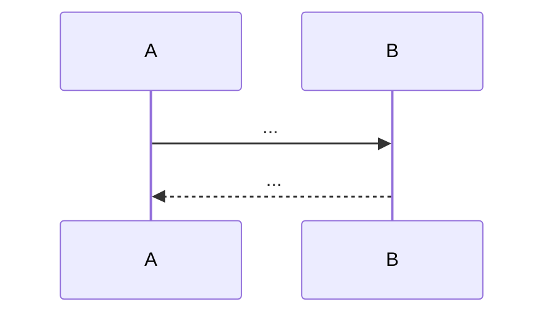
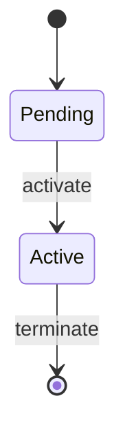

# Blueprint Authoring Guide — DGLab v2

**Read this entire file before writing any blueprint.** Every blueprint in this bundle must meet the fidelity bar defined here. Subagents that produce prose-only or thin blueprints will be rejected.

---

## Canonical Template

Every blueprint file MUST follow this structure, in this order. Do not skip sections. Do not reorder.

```markdown
# <ID>: <Component Name>

## Tier
Core | Hub | Bridge | Internal Spoke | External Spoke | Deploy

## Resolves
Finding(s) N, M (from `00_CRITIQUE.md`) — one-line explanation each.

## Component Name
<Full name> — `<PHP namespace>` (namespace must match the PSR-4 mapping in the corresponding `composer.json`)

## Description
2–4 paragraphs. What the component does, why it exists, what it is NOT. Reference the actual repo state (implemented / stub / not-started) per `01_MASTER_INDEX.md` §2.

## Build Status
✅ Implemented + tested | ❌ Stub only — blocking | 📝 Not started
If blocked, list the blocking IDs explicitly: "🔴 Blocked on CORE-02 (DI Container), CORE-10 (Config)."

## Dependency Status
- **Upward:** <IDs this component depends on>
- **Downward:** <IDs that depend on this component>
- **Runtime:** <composer packages, PHP extensions, external services>

## Architectural Design

### Class Map
Table of classes with responsibilities. One row per class.

### Interface Contracts
```php
<?php
declare(strict_types=1);
namespace <Namespace>;
// Real PHP 8.3 interface(s) with full docblocks, @param, @return, @throws.
// No prose-only descriptions. No stub interfaces.
```

### Reference Implementation
```php
<?php
declare(strict_types=1);
namespace <Namespace>;
// At least one complete, compilable class. Must match the namespace in composer.json.
// Must compile against PHP 8.3 with only the declared dependencies.
```

### SQL DDL (if the component persists state)
```sql
CREATE TABLE ... (
    -- columns with types, constraints, indexes
) ENGINE=InnoDB;
```

### Sequence Diagram


### State Diagram (if lifecycle is non-trivial)


## Integration Strategy
How this component is wired into the system. Upward (what it consumes), Downward (what consumes it), with concrete code examples where useful.

## Benchmark & Verification Methodology

| Target | Method |
|---|---|
| <property> | <harness: PHPUnit --group performance | baseline: GitHub Actions ubuntu-latest, PHP 8.3, opcache> | <load model> |

**Iron rule:** No bare millisecond targets. Every target must name the harness, baseline, and load model. If unmeasured, mark "provisional, unverified."

## CI Verification Criteria
- Branch coverage target (e.g., "100% on make(), autowire(), compile()")
- Static analysis (e.g., "phpstan.neon at configured level, zero baseline-ignored errors")
- Security tests (e.g., "cross-tenant isolation test automated")
- Integration tests (e.g., "rolling update completes without dropping in-flight requests")

## Security Properties
Explicit list of invariants. Example:
- Tenant A can never read tenant B's cache keys (enforced by namespace prefix).
- Circular dependency always throws CircularDependencyException, never stack-overflows.
- compile() is idempotent — further bind() calls throw LogicException.

## Migration Notes
How to land this component without breaking downstream. Rollback procedure.

## SemVer Impact
**Major | Minor | Patch** — with justification.
```

---

## Fidelity Bar (Non-Negotiable)

| Element | Minimum | Reject if |
|---|---|---|
| Interface contracts | Real PHP 8.3 interfaces, full docblocks | Prose-only, stub, or missing |
| Reference implementation | ≥1 complete compilable class | Missing or pseudocode |
| SQL DDL | Required if persists state | Missing for stateful components |
| Diagrams | ≥1 Mermaid sequence diagram | Missing |
| Benchmark methodology | Named harness + baseline + load model | Bare ms target with no method |
| CI criteria | Coverage + static analysis + security | Generic "must pass tests" |
| Security properties | ≥2 explicit invariants | Missing |
| Word count | ≥1500 words per blueprint | <1000 words |

---

## Dependency Map (from `01_MASTER_INDEX.md` §2)

### Core tier (canonical IDs — use these, NOT the evaluation's stale names)

| ID | Component | Namespace | Status |
|---|---|---|---|
| CORE-01 | Polyrepo Orchestrator ("Loom") | `SovereignStack\Orchestrator` | ✅ Implemented |
| CORE-02 | Dependency Injection Container | `SovereignStack\Core\Container` | ❌ Stub |
| CORE-03 | PSR-14 Event Dispatcher | `SovereignStack\Core\EventDispatcher` | ✅ Implemented |
| CORE-04 | PSR-7 HTTP Message & Factory | `SovereignStack\Core\Http` | 📝 Not started |
| CORE-05 | PSR-15 Middleware & Request Handler | `SovereignStack\Core\Http` | 📝 Not started |
| CORE-06 | Attribute-Based Router | `SovereignStack\Core\Router` | 📝 Not started |
| CORE-07 | SuperPHP Lexer | `SovereignStack\Core\SuperPHP\Lexer` | 📝 Not started |
| CORE-08 | Global Error & Exception Handler | `SovereignStack\Core\Error` | 📝 Not started |
| CORE-09 | PSR-3 Logging Service | `SovereignStack\Core\Logging` | 📝 Not started |
| CORE-10 | Configuration & Environment Loader | `SovereignStack\Core\Config` | 📝 Not started |
| CORE-11 | SuperPHP Parser | `SovereignStack\Core\SuperPHP\Parser` | 📝 Not started |
| CORE-12 | SuperPHP Compiler | `SovereignStack\Core\SuperPHP\Compiler` | 📝 Not started |
| CORE-13 | CLI Engine (Console) | `SovereignStack\Core\Console` | 📝 Not started |
| CORE-14 | Filesystem Abstraction | `SovereignStack\Core\Filesystem` | 📝 Not started |
| CORE-15 | Cache Abstraction (PSR-6/16) | `SovereignStack\Core\Cache` | 📝 Not started |
| CORE-16 | Binary Encryption Envelope | `SovereignStack\Core\Crypto` | 📝 Not started |
| CORE-17 | Service Provider System | `SovereignStack\Core\Providers` | 📝 Not started |
| CORE-18 | Core Kernel & Lifecycle | `SovereignStack\Core\Kernel` | 📝 Not started |
| CORE-19 | Database Abstraction Layer | `SovereignStack\Core\Database` | 📝 Not started |
| CORE-20 | Developer CLI Toolchain ("Sovereign Forge") | `SovereignStack\Forge` | 📝 Not started |

### Cross-reference corrections (from `01_MASTER_INDEX.md` §3)

- BRIDGE-01 depends on **CORE-16** (Binary Encryption Envelope), NOT CORE-09.
- CORE-03 references **CORE-09** (Logging) for listener exception logging, NOT CORE-08.
- CORE-03 does NOT reference `thephpleague/event` — only `psr/event-dispatcher`.

---

## Output Paths

Write your blueprint to:
```
/home/z/my-project/download/DGLab-Blueprints-v2/blueprints/<Tier>/<ID>-<slug>.md
```

Where `<Tier>` is `Core`, `Hub`, `Bridge`, or `Deploy`, and `<slug>` is a kebab-case short name (e.g., `di-container`, `event-dispatcher`).

---

## Worklog Protocol

After writing your blueprint, append to `/home/z/my-project/worklog.md`:

```
---
Task ID: <your task ID>
Agent: <agent name>
Task: Write <blueprint ID> blueprint

Work Log:
- Read authoring guide
- Read actual repo file <path>
- Wrote <output path>

Stage Summary:
- Blueprint <ID> complete at <word count> words
- Includes: <list of sections present>
```

---

## Quality Checklist (Run Before Returning)

- [ ] Follows canonical template exactly (all sections present, in order)
- [ ] ≥1 real PHP interface with full docblocks
- [ ] ≥1 complete compilable class implementation
- [ ] SQL DDL if stateful
- [ ] ≥1 Mermaid sequence diagram
- [ ] Benchmark methodology names harness + baseline + load model (no bare ms)
- [ ] CI criteria include coverage + static analysis + security
- [ ] ≥2 security properties listed
- [ ] ≥1500 words
- [ ] Cross-references use canonical IDs (§2 of master index), not evaluation-layer names
- [ ] "Resolves" section lists finding numbers from `00_CRITIQUE.md`
