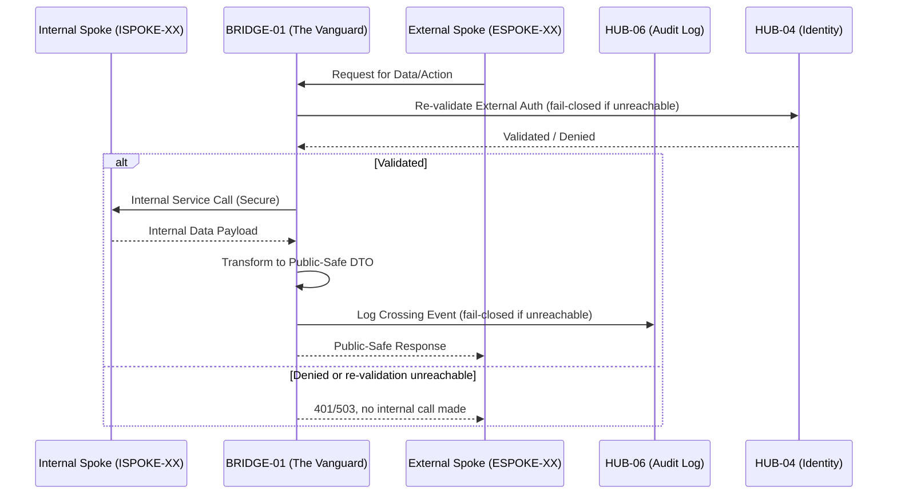
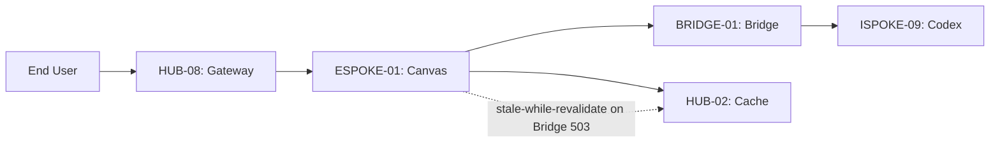
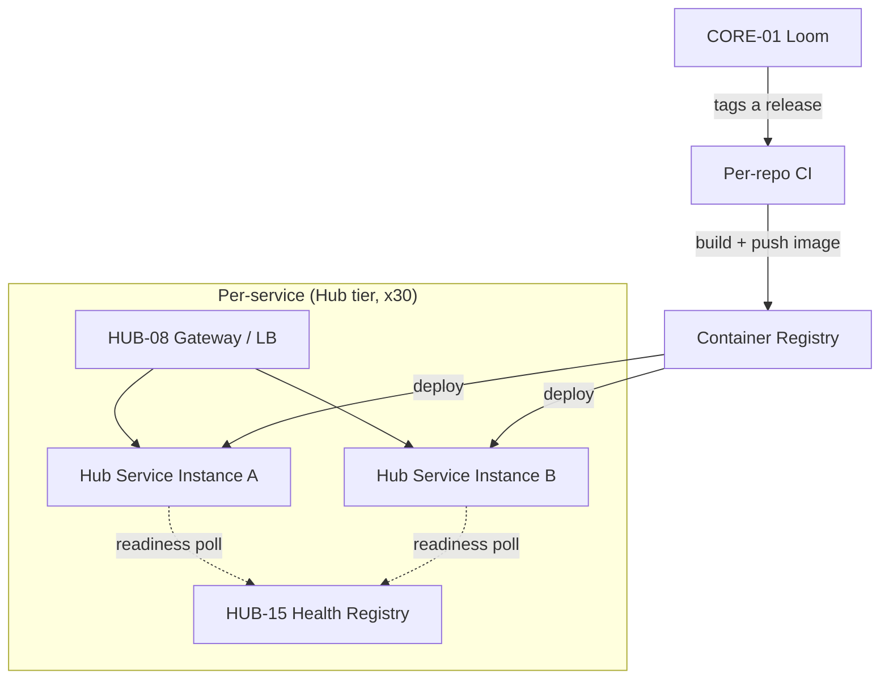

## BRIDGE-01.md

# PHASE BRIDGE-01: The Handoff Bridge

## Tier
Bridge (Architectural Enforcement Layer)

## Resolves
`00_CRITIQUE.md` Finding 3 (the Core dependency citation is corrected from `CORE-09` to `CORE-16`)
and the Bridge single-point-of-failure weakness already identified in
`docs/evaluation/SOLUTIONS_TO_WEAKNESSES.md` (External Spokes, Weakness 1) but never merged into this
file until now — per Governance Rule 5 in `01_MASTER_INDEX.md`, that merge happens here.

## Component Name
Sovereign Bridge (The "Vanguard")

## Description
BRIDGE-01 is not an application; it is the formal architectural contract and enforcement layer
governing all communication between the Internal Spoke sub-tier and the External Spoke sub-tier. It
guarantees that no internal implementation detail, staff-only service, or raw internal data structure
is ever exposed to the public-facing ecosystem.

## Build Status
🔴 **Blocked**, transitively, on the full Core tier and on `HUB-04`, `HUB-06`, `HUB-08`, `HUB-15`,
`HUB-16` (all Hub-tier, none yet implemented per `01_MASTER_INDEX.md` §2/§4). Design work and interface
contracts (this document) can and should proceed ahead of that — implementation cannot.

## Dependency Status — corrected

### Direct Hub Dependencies
- `HUB-08`: API Gateway & Public Surface
- `HUB-15`: Health Check & Service Discovery
- `HUB-16`: Hub-level Orchestration Hooks
- `HUB-06`: Audit Log & Activity Tracker
- `HUB-04`: Global Identity & Authentication

### Transitive Core Dependencies — **corrected**
- `CORE-01`: Polyrepo Orchestrator (Enforcement Logic — release gating on Bridge test suite)
- `CORE-18`: Core Kernel & Lifecycle
- ~~`CORE-09`: Cryptography & Hashing~~ → **`CORE-16`: Binary Encryption Envelope (Payload
  Verification)**. `CORE-09` is the PSR-3 Logging Service; it has no role in payload verification.
  This was a live citation bug in the previously-approved version of this document (Finding 3) —
  logging is *also* relevant here (every crossing event is audited via `HUB-06`, which itself depends
  on `CORE-09`), but as a downstream Hub dependency, not a direct Bridge-to-Core one.
- `CORE-06`: Attribute-Based Router (Gateway Routing)

## Sequencing Rationale
Acts as the transition point between the completed Internal Spoke sub-tier and the upcoming External
Spoke sub-tier. Must be established — and its own test suite must be green — before any External Spoke
is built, so boundary compliance exists from the first day an external-facing endpoint does.

## Architectural Design: The Strict Boundary Policy

The Bridge enforces a default-deny posture for all cross-tier interactions.

### 1. Data Transformation Rule
No Internal Spoke service or database contract may be directly exposed. All data crossing from
Internal to External is transformed into a "Public-Safe" DTO at the Bridge — never passed through.

### 2. Authentication Re-validation
Any authentication context established in the Internal sub-tier is re-validated at the Bridge before
being honored externally. Internal "Staff" sessions carry zero authority in the External tier.

### 3. Audit Mandate
Every crossing event, payload, or service call is logged through `HUB-06` with a "Tier-Crossing"
metadata flag.

### 4. Permitted Contract Allowlist
The Bridge maintains a strict registry of permitted crossing contracts. Unlisted interactions are
blocked and surfaced as "Critical Violations" via `HUB-15`.

### 5. Availability & Failover (new — closes the SPOF weakness)
Because every External Spoke request that touches internal data must pass through the Bridge, a single
Bridge instance is a hard availability ceiling for the entire public surface. This blueprint now
specifies:
- **Statelessness by construction:** the Bridge holds no in-process session or contract-registry state
  that isn't reloadable from `HUB-01` (config) and `HUB-04` (identity) on cold start — this is what
  makes horizontal scaling behind `HUB-08`'s gateway possible at all, rather than a later retrofit.
- **N+1 deployment minimum:** at least two Bridge instances behind the `HUB-08` gateway's load
  balancing, in different failure domains (see `DEPLOY-03` in `01_MASTER_INDEX.md` §6).
- **Fail-closed, not fail-open:** if a Bridge instance cannot reach `HUB-04` (identity re-validation)
  or `HUB-06` (audit log) within a defined timeout, it must return `503`, not silently skip
  re-validation or logging and let the request through. A Bridge that degrades to "no security check"
  under load is worse than one that's simply down.
- **Circuit breaker on the Internal call leg:** if Internal Spoke services are unhealthy, the Bridge
  should fail the *External*-facing request cleanly (documented error contract) rather than hold
  connections open and cascade the internal outage into new external-facing failures.

### Boundary Flow Diagram



## Interface Contracts

```php
namespace SovereignStack\Bridge\Contracts;

interface BoundaryContractInterface
{
    /** Define a permitted crossing contract. */
    public function registerContract(string $contractId, DTOTransformerInterface $transformer): void;

    /** Enforce the boundary for an incoming request. Fail-closed on dependency unavailability. */
    public function enforce(RequestInterface $request): ResponseInterface;
}

interface DTOTransformerInterface
{
    /** Transform an internal domain object into its public-safe representation. Never pass-through. */
    public function transform(object $internal): array;
}

/** Thrown when enforce() cannot reach HUB-04 or HUB-06 within the configured timeout. */
final class DependencyUnavailableException extends \RuntimeException {}
```

## Integration Strategy (Formal Policy)
- **Runtime Enforcement:** `HUB-08` middleware intercepts all cross-tier traffic and routes it through
  the Bridge.
- **Service Discovery:** consumes `HUB-15` to identify legitimate Internal endpoints while hiding them
  from External visibility.
- **Orchestration:** integrated with `HUB-16` to block all boundary-crossing traffic during "Critical
  Maintenance" windows.
- **Reporting:** any attempted boundary violation (e.g., a direct DB access attempt from an ESPOKE)
  triggers an immediate P0 alert via `HUB-15`.

## Benchmark & Verification Methodology
| Target | Method |
|---|---|
| No PHP class in `SovereignStack\External` imports any class from `SovereignStack\Internal` | Static analysis rule (PHPStan custom rule or a dedicated `composer check:boundary` script scanning `use` statements) run in CI on every PR touching either namespace. |
| DTO transformation + audit logging latency budget | Measure on a reference environment (state PHP version, opcache status, and whether `HUB-06`'s write is sync or queued) before citing a millisecond figure — do not restate "no more than 2ms" until this is actually measured; the original figure was asserted with no method attached (Finding 10). |
| Unregistered contract calls are rejected quickly and safely | Integration test: call `enforce()` with an unregistered `contractId`; assert `403` and assert no Internal Spoke call was attempted (verifiable via a call-count assertion on a mocked Internal client). |
| Fail-closed behavior under dependency outage | Integration test: mock `HUB-04` and `HUB-06` clients to throw/timeout; assert `enforce()` returns `503` (or a documented equivalent) and makes no Internal Spoke call. |

## CI Verification Criteria
- Zero-Exposure Test (static analysis, as above) — blocking on every PR.
- Fail-closed test (as above) — blocking; this is the test that operationalizes §5 above and turns
  "no single point of failure" from a design intent into a checked property.
- Transformation latency — measured and documented per the Benchmark table, not asserted.
- Violation response — `403` for unregistered contracts, tested against both a valid and a
  deliberately-malformed `contractId`.

## SemVer Impact
**Major.** Establishes the foundational security and architectural integrity of the entire platform's
public interface. Any change to the fail-closed behavior in §5 is itself a major-impact change and
must be called out explicitly in the changelog, since it directly affects the platform's security
posture under partial outage — a class of change easy to under-classify as "ops config" rather than
"architecture."


---

## ISPOKE-01.md

# PHASE ISPOKE-01: Administration Panel and Control Centre

## Tier
Internal Spoke (Staff-only Application)

## Resolves
Merges the self-identified but never-integrated weakness from
`docs/evaluation/SOLUTIONS_TO_WEAKNESSES.md` ("CRUD Engine (ISPOKE-01) Could Be Over-Generalized") into
this file directly, per Governance Rule 5, and corrects the tier inventory context per
`00_CRITIQUE.md` Finding 13 (this is spoke 1 of a true 25, not of 15).

## Component Name
Sovereign Command Center

## Description
The primary administrative interface for the Sovereign Stack: a centralized UI for managing Users,
Roles, Tenants, and global System Settings, built on the Shared UI Component Library
(`HUB-26`). This is the first of **25** planned Internal Spokes (`ISPOKE-01`–`25`; see
`01_MASTER_INDEX.md` §4 — 10 of those 25 exist only as placeholder stubs today, not yet at this level
of detail).

## Build Status
🔴 **Blocked** on `HUB-04`, `HUB-05`, `HUB-21`, `HUB-26`, `HUB-08`, `HUB-15`, `HUB-16` (all Hub-tier,
none implemented) and transitively on the full Core tier. Design work may proceed; implementation
cannot start meaningfully before at least `HUB-04` (Identity) and `HUB-05` (RBAC) land, since this
Spoke's core CI criterion (permission-leak prevention, below) is meaningless without them.

## Dependency Status

### Direct Hub Dependencies
- `HUB-04`: Global Identity & Authentication
- `HUB-05`: RBAC & Permission Engine
- `HUB-21`: Multi-tenancy Coordination Layer
- `HUB-26`: Shared UI Component Library
- `HUB-08`: API Gateway
- `HUB-15`: Health Check & Service Discovery
- `HUB-16`: Hub-level Orchestration Hooks

### Transitive Core Dependencies
- `CORE-11`: SuperPHP Parser
- `CORE-12`: SuperPHP Compiler
- `CORE-18`: Core Kernel & Lifecycle
- `CORE-19`: DBAL
- `CORE-06`: Router

(Cross-checked against `docs/hub-taxonomy/hub-blueprint-taxonomy.md` — all IDs above match current
Hub blueprint titles; no drift found in this direction, unlike the Core-tier renumbering in Finding 2.)

## Architectural Design

### Components
- **AdminShell** — master layout from `HUB-26` providing sidebar and top navigation.
- **EntityCrudEngine** — generates standardized management interfaces for DBAL entities.
- **TenantSwitcher** — UI component for switching active tenant context (`HUB-21`).
- **AuditViewer** — integrated view of `HUB-06` audit logs.

### EntityCrudEngine — scoping correction

The original blueprint left `EntityCrudEngine` fully generic ("generates standardized interfaces for
managing DBAL entities"), which is exactly the over-generalization risk `SOLUTIONS_TO_WEAKNESSES.md`
flagged: a single generic CRUD generator tends to accumulate special-casing for every entity that
doesn't fit the default form/table/filter shape, until it's no longer generic in practice. This
blueprint narrows the contract:

```php
namespace SovereignStack\Internal\CommandCenter\Contracts;

/**
 * A resource description the CrudEngine can render generically.
 * Entities that need custom behavior (e.g., a wizard-style multi-step
 * creation flow) implement CustomResourceInterface instead and opt OUT
 * of the generic engine entirely for that one action — not a partial
 * override of it.
 */
interface CrudResourceInterface
{
    public static function label(): string;

    /** @return array<string, FieldDefinition> keyed by DBAL column name */
    public static function fields(): array;

    /** Fields visible in the list/table view — a subset of fields(). */
    public static function listColumns(): array;

    /** RBAC permission string required to view this resource at all. */
    public static function viewPermission(): string;

    /** RBAC permission string required to create/edit/delete. */
    public static function managePermission(): string;
}

/**
 * Opt-out escape hatch: a resource implementing this instead of
 * CrudResourceInterface is rendered by its own controller, not the
 * generic engine. Prevents the generic engine from growing
 * entity-specific conditionals over time.
 */
interface CustomResourceInterface
{
    public static function controller(): string; // FQCN of a dedicated controller
}
```

**Rule:** `EntityCrudEngine` only ever implements `CrudResourceInterface`'s contract. Any entity that
needs behavior outside that contract implements `CustomResourceInterface` and gets its own controller
— it does not get a special case bolted onto the generic engine. This is the concrete mechanism that
keeps the engine from becoming "generic in name only."

## Integration Strategy
- **Bootstrapping:** boots via the `CORE-18` Kernel; registers with `HUB-15` for health monitoring.
- **UI Rendering:** exclusively consumes `HUB-26` components — no local CSS or custom primitives.
- **Orchestration:** hooks into `HUB-16` for specialized administrative maintenance modes.
- **Health Reporting:** reports its own health and its Hub-connection health via `HUB-15`.

## Benchmark & Verification Methodology
| Target | Method |
|---|---|
| 100% of rendered tags originate from `HUB-26` namespaces | Automated DOM/template scan in CI over every rendered page fixture; fails the build on any non-`HUB-26` tag. |
| A non-super-admin staff user cannot access Tenant Management | Integration test authenticated as a fixture user with a restricted role (via `HUB-05`); assert `403` on the Tenant Management route. |
| Admin Dashboard server response time | State the reference environment (PHP version, DB proximity, cache state) before citing "< 50ms" — measure via a load-testing tool (e.g., `k6` or `siege`) against a seeded fixture dataset of realistic size, not an empty database, since CRUD list-view performance is dataset-size-sensitive. |

## CI Verification Criteria
- UI consistency scan (above), blocking.
- Permission-leak test (above), blocking — this is a security property, treat failures as release
  blockers, not warnings.
- Response time measured against a seeded, realistic-size fixture dataset, with the seed size stated
  in the test itself so the number is reproducible.
- Any `CrudResourceInterface` implementation attempting to bypass `managePermission()` via a
  non-standard action route fails CI (guards against the exact over-generalization failure mode this
  blueprint's scoping correction is meant to prevent).

## SemVer Impact
**Major.** Provides the human interface for the entire Sovereign platform.


---

## ESPOKE-01.md

# PHASE ESPOKE-01: Public CMS and Content Delivery Layer

## Tier
External Spoke (Public-facing Application)

## Resolves
Merges the self-identified weakness from `docs/evaluation/SOLUTIONS_TO_WEAKNESSES.md`
("SEO Optimization Relies on Perfect Markup") into this file per Governance Rule 5, and aligns this
Spoke's Bridge-dependency behavior with `BRIDGE-01`'s corrected fail-closed contract.

## Component Name
Sovereign Canvas (CMS)

## Description
The public-facing CMS and delivery engine. Renders high-performance, SEO-optimized pages for
end-users, consuming content from the Internal Knowledge Base (`ISPOKE-09`) exclusively via the
`BRIDGE-01` transformation layer — never directly.

## Build Status
🔴 **Blocked** on `HUB-03`, `HUB-02`, `HUB-26`, `HUB-08`, `HUB-15` (Hub-tier, none implemented),
`BRIDGE-01` (design-complete per this delivery, implementation blocked on its own dependencies), and
`ISPOKE-09` (Internal Spoke, not yet documented at all — outside the 15 currently detailed and outside
the 10 placeholder stubs in `docs/internal-spokes/placeholder-blueprints.md`; this is itself a gap
worth flagging: `ISPOKE-09` is referenced as a live dependency by `ESPOKE-01` but has no blueprint file
and no placeholder entry under the current `ISPOKE-01..25` numbering — confirm during Hub/Spoke
consolidation whether it was renumbered along with the Core tier's drift in Finding 2, or whether it's
a genuine, undocumented gap).

## Dependency Status

### Direct Hub Dependencies
- `HUB-03`: Unified Asset Pipeline & Bundler
- `HUB-02`: Distributed Cache (Redis)
- `HUB-26`: Shared UI Component Library (Public Theme)
- `HUB-08`: API Gateway & Public Surface
- `HUB-15`: Health Check & Service Discovery

### Transitive Core Dependencies
- `CORE-11`: SuperPHP Parser
- `CORE-12`: SuperPHP Compiler
- `CORE-18`: Core Kernel & Lifecycle
- `CORE-06`: Router
- `CORE-14`: Filesystem Abstraction

## Architectural Design
- **PageRenderer** — SuperPHP engine rendering public pages via `HUB-26` (Public Theme).
- **ContentConsumer** — talks to `BRIDGE-01` for public-safe content DTOs. Must implement the
  fail-closed contract from `BRIDGE-01` §5: if the Bridge returns `503`, `ContentConsumer` serves a
  cached last-known-good page (via `HUB-02`) with a `stale` marker, rather than a raw 5xx to the end
  user, wherever a cached copy exists — and a proper error page only when it doesn't.
- **EdgeCacheManager** — integrates with `HUB-02` for sub-5ms-target response times on cached content
  (target, not yet measured — see Benchmark table).
- **SEOEngine** — generates sitemaps, meta tags, and Schema.org markup.

### SEOEngine — scoping correction
The original CI criterion ("every page must score > 90 on Lighthouse SEO/Performance") is a good
target but, as `SOLUTIONS_TO_WEAKNESSES.md` correctly notes, depends on every content author producing
well-formed markup — a single fact this blueprint didn't previously account for. Concrete mitigation:

- `SEOEngine` validates generated markup against required fields (title length, meta description
  presence/length, canonical URL, structured-data schema validity) **at publish time**, in
  `ISPOKE-09`'s content-authoring workflow — not only at render time in `ESPOKE-01`. A content author
  should see a validation failure before publishing, not discover a Lighthouse regression after.
- `ESPOKE-01`'s render path additionally defends against missing/malformed data from upstream (Bridge
  payload) with explicit fallbacks (e.g., a missing meta description falls back to a truncated content
  excerpt, never an empty tag), so a single bad content record can't silently drop the whole page's
  Lighthouse SEO score.

### Content Delivery Diagram


## Interface Contracts

```php
namespace SovereignStack\External\Canvas\Contracts;

interface ContentDeliveryInterface
{
    /** Render a page by its public slug. */
    public function renderPage(string $slug): ResponseInterface;

    /** Clear the public cache for a specific content item. */
    public function purgeCache(string $slug): void;
}

interface SeoValidationInterface
{
    /**
     * Validate content metadata at publish time, before it reaches ESPOKE-01's render path.
     * Called from ISPOKE-09's content workflow, not from ESPOKE-01 itself.
     *
     * @return array<int, string> Validation errors; empty array means valid.
     */
    public function validate(ContentMetadata $metadata): array;
}
```

## Integration Strategy
- **Bridge Compliance:** never queries the internal content database directly; all requests route
  through `BRIDGE-01`'s DTO transformation layer, including the fail-closed/stale-cache fallback above.
- **UI Rendering:** "Public Theme" variants of `HUB-26` components, compiled via `HUB-03`.
- **Caching:** stale-while-revalidate via `HUB-02`, now explicitly also the fallback path for Bridge
  unavailability, not just normal cache expiry.
- **Health:** reports page load times and cache hit/miss ratios to `HUB-15`.

## Benchmark & Verification Methodology
| Target | Method |
|---|---|
| Lighthouse SEO/Performance > 90 | Run against a fixture set that includes at least one deliberately minimal/edge-case content record (short title, no meta description) to verify the fallback behavior above actually holds the score, not just well-authored happy-path content. |
| Bridge Enforcement — internal-only content returns 404 externally | Automated test requesting a fixture "draft SOP" slug through `ESPOKE-01`; assert `404`, and assert (via a spy/mock on the Bridge client) that no unregistered contract was attempted. |
| 100% of public assets served via `HUB-03` CDN layer | Static scan of rendered page output for any asset URL not matching the `HUB-03` CDN host pattern. |
| Cache hit response time | State reference environment and measurement tool (e.g., `k6`) before citing "sub-5ms" — this is currently a target, not a measured result (Finding 10 in `00_CRITIQUE.md`). |

## CI Verification Criteria
- SEO/Performance Lighthouse gate, including the edge-case fixture above.
- Bridge Enforcement test, blocking.
- Asset-origin scan, blocking.
- Stale-while-revalidate-on-503 path has explicit test coverage (new — closes the gap where Bridge
  unavailability previously had no defined `ESPOKE-01`-side behavior at all).

## SemVer Impact
**Major.** Establishes the public web presence and the pattern for Bridge-based consumption.


---

## DEPLOY-01.md

# PHASE DEPLOY-01: Core & Hub Service Deployment

## Tier
Infrastructure (Deployment & Hosting)

## Resolves
`00_CRITIQUE.md` Finding 9 — the only previously-existing Deploy blueprint (now renamed `DEPLOY-00:
Documentation Site`, kept as-is; see `01_MASTER_INDEX.md` §6) deploys the Markdown documentation over
Render's free tier via PHP's built-in dev server. It says nothing about deploying the Core services,
the ~30 Hub services, the Spokes, or any datastore. This blueprint is that missing piece for the
Core/Hub tier specifically; `DEPLOY-02` (datastores), `DEPLOY-03` (Bridge/External), and `DEPLOY-04`
(promotion pipeline) are sequenced separately per `01_MASTER_INDEX.md` §6 and are not duplicated here.

## Component Name
Sovereign Core/Hub Runtime Deployment

## Description
Containerized deployment strategy for the Core and Hub tiers: one deployable image family (PHP 8.3-FPM
+ Nginx) per Hub service, wired to `HUB-15` for health checks, with an explicit non-goal of covering
the documentation site (`DEPLOY-00`), the public-facing Bridge/External tier (`DEPLOY-03`), or
datastore provisioning (`DEPLOY-02`) — those are separately scoped so this blueprint doesn't repeat the
original scope-collapse mistake in the other direction (one blueprint quietly trying to cover
everything).

## Build Status
🔴 **Blocked** on the Core tier being real (nothing to containerize yet — see
`01_MASTER_INDEX.md` §2) and on `HUB-15` (Health Check & Service Discovery) existing, since the health
check contract this blueprint specifies depends on it. This document specifies the target shape now so
it's ready the moment those land, rather than being designed reactively after the fact.

## Dependency Status
- **Upward:** `CORE-01` (Polyrepo Orchestrator — release tagging/gating drives what gets deployed),
  `CORE-18` (Kernel — defines the app's actual boot/shutdown signals that the container entrypoint
  must respect), `HUB-15` (Health Check contract), `HUB-01` (Config — environment-specific settings
  injected at deploy time, not baked into the image).
- **Downward:** every Hub service; every Internal Spoke (which, per the Hub-and-Spoke tier model,
  should share this same deployment pattern rather than invent its own).

## Architectural Design

### One image family, many services
A single base image (`php:8.3-fpm-alpine` + Nginx sidecar or a compiled FrankenPHP-style single
binary — decision deferred to an ADR, not baked into this blueprint) parameterized by which service's
`composer.json`/entrypoint it boots, rather than a bespoke Dockerfile per Hub service. This keeps 30+
Hub services from becoming 30+ independently-drifting deployment configurations.

```dockerfile
# Illustrative shape, not a final artifact — the actual Dockerfile belongs in
# each package's repo (per the polyrepo model CORE-01 enforces), inheriting
# from a shared base published by this blueprint's implementation.
FROM sovereignstack/php-runtime-base:8.3 AS runtime
ARG SERVICE_NAME
COPY --from=build /app/${SERVICE_NAME} /app
WORKDIR /app
ENTRYPOINT ["/app/entrypoint.sh"]
```

### Health check contract (drives readiness/liveness probes)

```php
namespace SovereignStack\Deploy\Contracts;

interface HealthCheckInterface
{
    /**
     * Liveness: is the process fundamentally able to serve traffic at all?
     * Must not check downstream dependencies — a slow DB should fail
     * readiness, not liveness (which would trigger an unnecessary restart).
     */
    public function liveness(): bool;

    /**
     * Readiness: can this instance serve traffic right now?
     * Checks its own direct dependencies (DB connection pool, cache
     * connection) — this is what HUB-15 polls.
     *
     * @return array{ready: bool, checks: array<string, bool>}
     */
    public function readiness(): array;
}
```

Every Hub service and Spoke deployed under this blueprint must implement `HealthCheckInterface` and
expose it at a standard path (`/healthz/live`, `/healthz/ready`) — this is the concrete mechanism that
makes `HUB-15`'s "service discovery" meaningful rather than aspirational.

### Deployment topology



- **Minimum N+1 per service**, matching the Bridge's own availability requirement (`BRIDGE-01` §5) —
  no Hub service should be a single point of failure any more than the Bridge should be.
- **Config injected at deploy time** via `HUB-01`, never baked into the image — the same image artifact
  should be promotable from staging to production unchanged (this is the property `DEPLOY-04`'s
  promotion pipeline depends on).

## Integration Strategy
- `CORE-01` (Loom) is the trigger: a green, tagged release in a given repo is what this blueprint's
  pipeline deploys — deployment is not a manual, separate step from the release process it's built on
  top of.
- `HUB-15` polls `readiness()` on a defined interval and removes unready instances from `HUB-08`'s
  routing pool — this closes the loop between "the Bridge/Gateway assumes it can discover healthy
  Internal endpoints" (stated in `BRIDGE-01`) and an actual mechanism that keeps that assumption true.

## Benchmark & Verification Methodology
| Target | Method |
|---|---|
| A service with a failing readiness check is removed from the routing pool within a bounded window | Integration test: force a fixture service's `readiness()` to return `ready: false`; assert `HUB-08` stops routing to it within N polling intervals (N and the interval length must be stated together — a bare "removed quickly" claim repeats Finding 10). |
| Image is environment-portable (same artifact, staging → production) | CI check: build once, deploy the identical image digest to a staging environment, run the full integration suite, then promote the same digest (not a rebuild) to production. |
| N+1 minimum enforced | Deployment manifest lint rule rejecting any service definition with `replicas: 1` outside of an explicitly documented single-instance exception (e.g., `DEPLOY-00`'s doc site, which has no such requirement). |

## CI Verification Criteria
- Every deployable service implements `HealthCheckInterface` — enforced via a static check in the
  shared base image's build step (fails the image build if the interface isn't implemented, rather
  than failing at runtime).
- No service manifest may hardcode environment-specific config values (scanned against a denylist
  pattern for common secrets/hostnames) — config must come from `HUB-01` at deploy time.
- Deployment pipeline itself is gated by `CORE-01`'s tier-ordering (Core tier's own deploy must succeed
  before any Hub service redeploys against it in the same release train).

## SemVer Impact
**Major**, for the deployment tooling/manifests themselves. Does not change any Hub/Spoke service's own
SemVer — deployment topology is orthogonal to a service's API contract.
