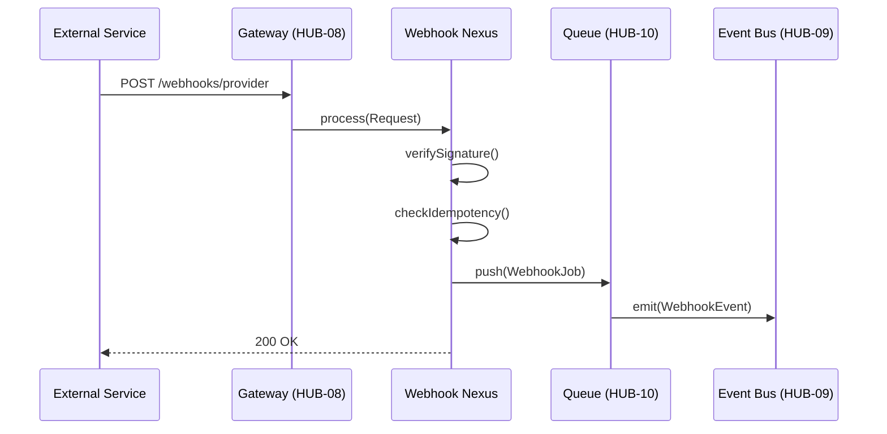
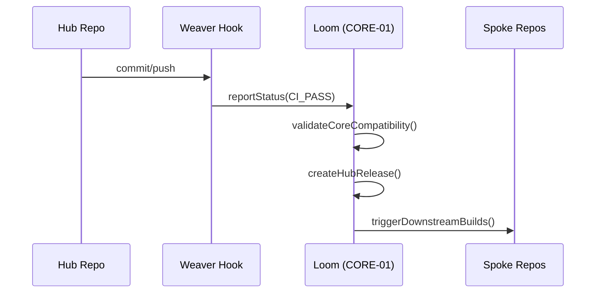
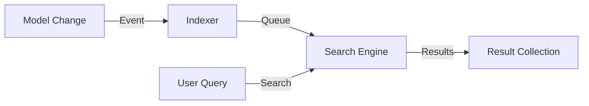
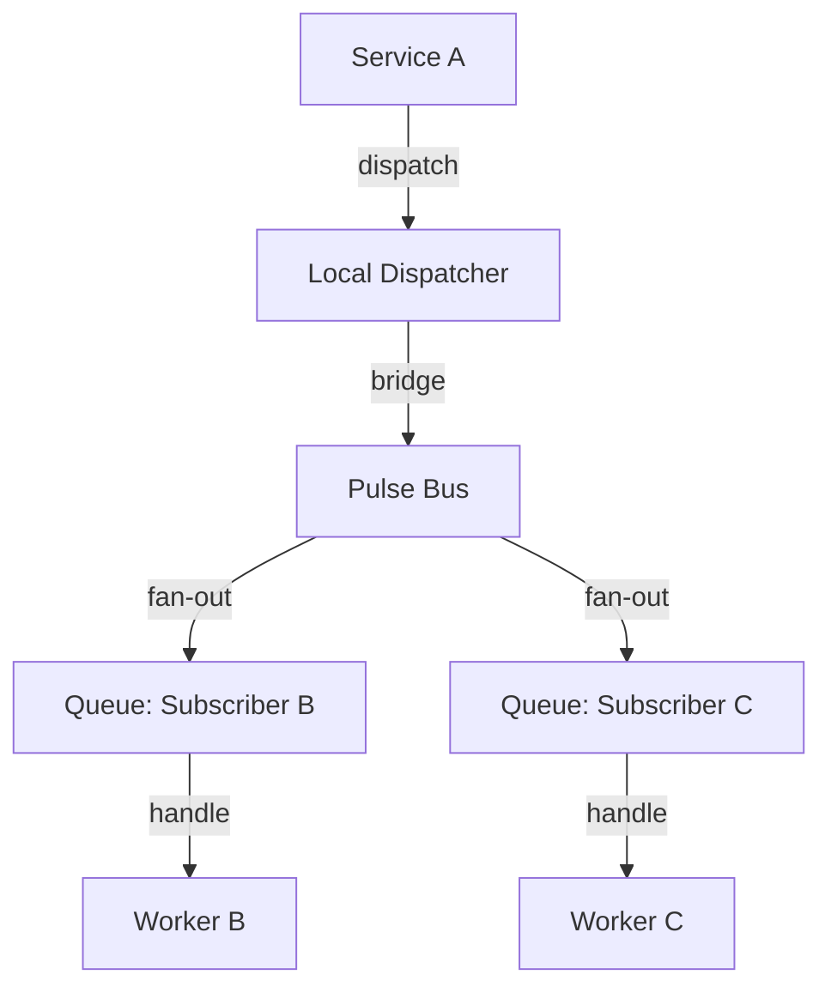
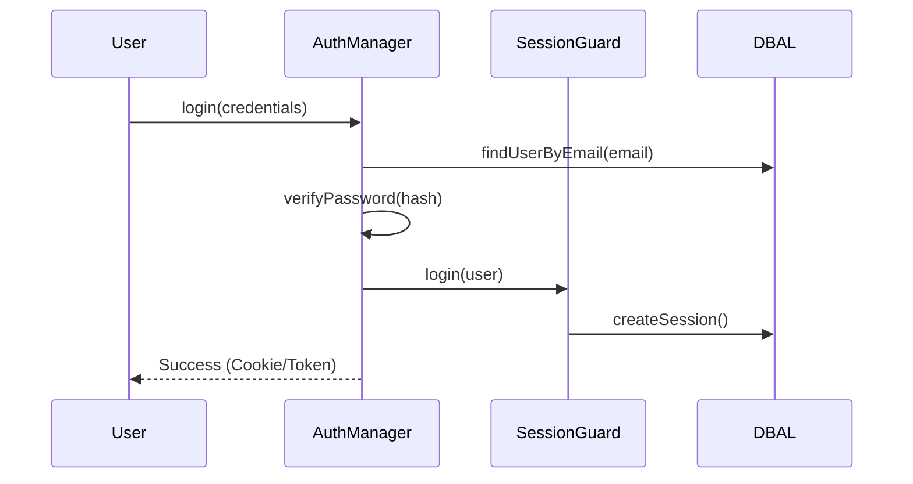
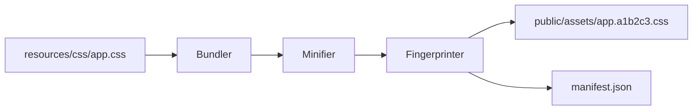

## HUB-20.md

# PHASE HUB-20: Cryptography & Secrets Management Service

## Tier
Hub (Shared Services)

## Resolves
Adds stated benchmark methodology (Finding 10). Note: this blueprint's `CORE-16` reference was checked
against the corrected Core-tier map in `01_MASTER_INDEX.md` §2 and is **correct** — unlike `BRIDGE-01`'s
now-fixed `CORE-09` mistake, `HUB-20` already cited the right encryption component.

## Component Name
Sovereign Vault

## Description
Secure management of sensitive data, API keys, and cryptographic operations. Extends `CORE-16` with
key rotation, encrypted field storage, and secure handshaking.

## Build Status
🔴 **Blocked** on `CORE-16` (Binary Encryption Envelope) and `CORE-19` (DBAL) — neither implemented.
Critical for `HUB-22` (Billing) and any Spoke handling PII.

## Dependency Status
- **Direct Hub:** `HUB-06` (Audit — every access logged), `HUB-02` (Cache).
- **Transitive Core:** `CORE-16`, `CORE-19`, `CORE-08`. *(Matches taxonomy.)*
- **Downward:** `HUB-22` (Billing keys), any Spoke storing third-party API credentials.

## Architectural Design
- **SecretManager** — stores/retrieves encrypted environment secrets.
- **KeyRotator** — rotates encryption keys without downtime (background re-encryption).
- **CryptoProvider** — signing, verification, encryption of payloads.
- **BlindIndexGenerator** — searchable hashes for encrypted fields.

```php
namespace SovereignStack\Hub\Contracts;

interface VaultInterface
{
    public function getSecret(string $key): ?string;
    public function encrypt(string $value, ?string $context = null): string;
    public function decrypt(string $payload, ?string $context = null): string;
}
```

## Integration Strategy
- **Upward:** uses `CORE-16` for low-level cryptographic primitives.
- **Downward:** Spoke applications store third-party API keys here instead of hardcoding in `.env`.
- **Security:** all Vault access logged via `HUB-06` — this is exactly the kind of security-relevant
  audit write that should use `HUB-06`'s synchronous tier-crossing-style path (see `HUB-06.md`'s
  Availability Contract) rather than the general async path, given a lost Vault-access log entry is a
  compliance gap, not just a minor logging miss.

## Benchmark & Verification Methodology
| Target | Method |
|---|---|
| Cross-key isolation | Unit test: encrypt with Key A, attempt decrypt with Key B; assert decryption fails cleanly (no partial/garbage plaintext leaking through). |
| Rotation safety | Integration test: encrypt data with Key v1, rotate to Key v2, assert data encrypted under v1 still decrypts correctly during and after rotation (no window where legacy data becomes unreadable). |
| Audit coverage | Integration test: perform a `getSecret()`/`encrypt()`/`decrypt()` call; assert exactly one corresponding `HUB-06` audit entry per call, with no gaps under concurrent access. |

## CI Verification Criteria
- Cross-key isolation test, blocking.
- Rotation-safety test spanning the actual rotation window (not just before/after), blocking.
- 100% audit-coverage test under concurrent access, blocking.

## SemVer Impact
**Major.** Establishes the secure storage and crypto standard for the stack.


---

## HUB-19.md

# PHASE HUB-19: Centralised Validation & Sanitisation Library

## Tier
Hub (Shared Services)

## Resolves
Adds stated benchmark methodology (Finding 10) and a concrete, testable XSS-blocking fixture set
instead of an unspecified "standard payloads" claim.

## Component Name
Sovereign Guard (Validation)

## Description
Centralized validation/sanitization: consistent data-integrity rules across Hub and Spoke services,
complex rule-sets, recursive validation, automatic HTML sanitization against XSS.

## Build Status
🔴 **Blocked** on `HUB-13` (I18n — for translated error messages), `CORE-02` (DI Container),
`CORE-10` (Config) — none implemented.

## Dependency Status
- **Direct Hub:** `HUB-13`. *(Matches taxonomy.)*
- **Transitive Core:** `CORE-02`, `CORE-10`.
- **Downward:** `HUB-17` (webhook payload validation), every Spoke form.

## Architectural Design
- **ValidationEngine** — evaluates rules against data.
- **RuleRegistry** — reusable rules (`Email`, `MinLength`, `Unique`, …).
- **SanitizationEngine** — input filters/transforms (`StripTags`, `CastToInteger`, …).
- **ValidatorFactory** — creates validators with injected dependencies (e.g., DB for `unique` checks).

```php
$rules = [
    'email' => 'required|email|unique:users,email',
    'bio' => 'string|max:500|sanitize_html',
];
```

```php
namespace SovereignStack\Hub\Contracts;

interface GuardInterface
{
    public function validate(array $data, array $rules): array;
    public function sanitize(mixed $data, string|array $filters): mixed;
}
```

## Integration Strategy
- **Upward:** uses `HUB-13` for translated error messages.
- **Downward:** injected into Spoke controllers and the `HUB-08` Gateway for request-body validation.
- **Contract:** throws `ValidationException` with a structured error map.

## Benchmark & Verification Methodology
| Target | Method |
|---|---|
| XSS blocking | Test against the OWASP XSS filter evasion cheat-sheet payload set (a stated, versioned fixture list — not "standard payloads," which is undefined) checked into the test suite; assert every payload is neutralized. |
| DBAL integration for `unique` | Integration test against a real (fixture) `CORE-19` connection; assert the rule correctly rejects a duplicate and accepts a unique value, including a case-sensitivity edge case if the underlying column collation is case-insensitive. |
| Validation throughput | State environment before citing "< 1ms for 50 fields" — measure once `CORE-02`/`CORE-10` exist (Finding 10). |

## CI Verification Criteria
- OWASP fixture-list XSS test, blocking, with the fixture list versioned and checked in (so "passes
  XSS tests" is reproducible, not dependent on memory of what payloads were tried).
- `unique` rule integration test against a real DB connection, blocking.
- Throughput measured and reported with environment stated.

## SemVer Impact
**Minor.** Standardizes data integrity across the stack.


---

## HUB-18.md

# PHASE HUB-18: Media Processing Coordination Service

## Tier
Hub (Shared Services)

## Resolves
Adds stated benchmark methodology (Finding 10) and downgrades this blueprint's own self-assessed
maturity claim to match `hub-blueprint-taxonomy.md`, which correctly lists it as **Experimental**, not
production-ready — the original blueprint text didn't carry that caveat anywhere in its own body.

## Component Name
Sovereign Media Forge

## Description
Coordinated media-asset handling: thumbnail generation, image optimization, video transcoding
requests, metadata extraction. Bridges `HUB-11` (Storage) and specialized processing drivers.

## Build Status
🔴 **Blocked** on `HUB-11` (Storage), `HUB-10` (Queue), `HUB-02` (Cache) — none implemented. Per
`hub-taxonomy/hub-blueprint-taxonomy.md`, this blueprint's own maturity is rated **Experimental** —
treat its interfaces as more likely to change than the rest of the Hub tier, and don't build hard
dependencies on `MediaForgeInterface` from Spokes until it's promoted to Beta/Stable.

## Dependency Status
- **Direct Hub:** `HUB-11`, `HUB-10`, `HUB-02`. *(Matches taxonomy.)*
- **Transitive Core:** `CORE-14`, `CORE-19`, `CORE-15`.

## Architectural Design
- **MediaCoordinator** — high-level processing-request API.
- **ImageProcessor** — resize/crop/format conversion (WebP/AVIF).
- **MetadataExtractor** — EXIF, dimensions, mime-type.
- **TransformationPipeline** — chainable operations (resize → optimize → watermark).

```php
$forge->process($file)
    ->resize(800, 600)
    ->format('webp')
    ->store('thumbnails');
```

```php
namespace SovereignStack\Hub\Contracts;

interface MediaForgeInterface
{
    public function process(string $path): MediaPipelineInterface;
    public function getMetadata(string $path): array;
}
```

## Integration Strategy
- **Upward:** consumes `HUB-11` for read/write.
- **Downward:** Spoke applications route uploads through the Forge for optimization/safe storage.
- **Engines:** pure-PHP GD/Imagick wrappers — explicitly no Node-based `sharp`/`ffmpeg-js`, consistent
  with the stack's Node-free principle.

## Benchmark & Verification Methodology
| Target | Method |
|---|---|
| Memory safety | Integration test processing a real 10MB fixture image; assert peak memory via `memory_get_peak_usage()` stays under 64MB — measured, not assumed from GD/Imagick being "generally efficient." |
| Format support | Round-trip test: JPEG → WebP and JPEG → AVIF, decode the output and assert valid image data and expected dimensions, not just "no exception thrown." |
| Concurrency | Integration test dispatching 10 simultaneous `HUB-10` processing jobs against a shared fixture disk; assert no corrupted output and no disk-contention errors. |

## CI Verification Criteria
- Memory-bound test with actual measured peak, blocking.
- Format round-trip test (JPEG→WebP, JPEG→AVIF) with output validation, blocking.
- Concurrency test, blocking.
- Any change promoting this blueprint's maturity from Experimental must update
  `01_MASTER_INDEX.md`/`hub-blueprint-taxonomy.md` in the same commit (Governance Rule 1).

## SemVer Impact
**Minor.** Introduces media transformation capabilities — kept Minor rather than Major specifically
because of its Experimental status; don't treat its interface as a stability commitment yet.


---

## HUB-17.md

# PHASE HUB-17: Webhook Ingestion & Dispatch Engine

## Tier
Hub (Shared Services)

## Resolves
Ties this blueprint's idempotency and DLQ handling explicitly to `HUB-10`'s merged
`dead-letter-handling.md` pattern (rather than the two documents each implying their own DLQ), and adds
stated benchmark methodology (Finding 10).

## Component Name
Sovereign Webhook Nexus

## Description
Receives incoming webhooks from external services (Stripe, GitHub, Shopify, …) and dispatches them to
internal Hub services or Spoke handlers, with signature verification, idempotent processing, retries,
and an audit trail.

## Build Status
🔴 **Blocked** on `HUB-09` (Event Bus), `HUB-10` (Queue), `HUB-06` (Audit), `HUB-08` (Gateway) — none
implemented.

## Dependency Status
- **Direct Hub:** `HUB-09`, `HUB-10`, `HUB-06`, `HUB-08`. *(Matches taxonomy.)*
- **Transitive Core:** `CORE-06`, `CORE-04`, `CORE-19`, `CORE-03`.
- **Downward:** `HUB-22` (Billing webhooks route through this).

## Architectural Design
- **WebhookIngestor** — entry point for inbound POSTs.
- **SignatureValidator** — extensible per-provider signature verification.
- **DispatchRegistry** — maps webhook types to internal Hub events or Spoke jobs.
- **IdempotencyManager** — prevents duplicate processing via a persistent request-ID cache in `HUB-02`.



```php
namespace SovereignStack\Hub\Contracts;

interface WebhookManagerInterface
{
    public function subscribe(string $provider, string $event, callable $handler): void;
    public function verify(string $provider, string $payload, array $headers): bool;
}
```

## Integration Strategy
- **Upward:** registered as a route within `HUB-08`.
- **Downward:** Spoke applications register listeners via `HUB-09`.
- **Retry/DLQ:** `WebhookJob` failures use `HUB-10`'s dead-letter pattern (see `HUB-10.md` →
  `docs/queue-patterns/dead-letter-handling.md`) directly — this blueprint does not define a second,
  parallel retry mechanism.

## Benchmark & Verification Methodology
| Target | Method |
|---|---|
| Signature rejection | Test fixture set covering ≥3 provider signature formats (Stripe HMAC, GitHub HMAC, a generic scheme) each with a deliberately tampered payload; assert rejection for every case, not just the happy path. |
| Idempotency | Integration test: replay the identical request (same idempotency key) 5 times concurrently; assert exactly one side effect occurred, verified by checking the downstream job/event count, not just the HTTP response. |
| Auditability | Integration test: send a webhook, assert a `webhook_logs` row exists with correct provider, status, and processing-time fields — processing time measured, not left as a free-text field with no verification. |

## CI Verification Criteria
- Multi-provider signature-rejection test, blocking.
- Concurrent-idempotency test (5 simultaneous replays → 1 side effect), blocking.
- Audit-log-population test, blocking.

## SemVer Impact
**Minor.** Adds webhook handling capabilities to the Hub.


---

## HUB-16.md

# PHASE HUB-16: Hub-level Orchestration Hooks

## Tier
Hub (Shared Services)

## Resolves
Grounds this blueprint's `CORE-01` integration against the actual, implemented `orchestrator/` code
(`02_EXEMPLARS/CORE-01.md`) rather than the abstract description in the original, and adds stated
benchmark methodology (Finding 10).

## Component Name
Sovereign Hub Weaver

## Description
Integration logic for Hub-tier repositories to report status back to `CORE-01` (the Loom). Automates
dependency validation between Hub and Core tiers and prepares the Hub for Spoke consumption.

## Build Status
🟡 **Partially unblocked** — `CORE-01` (Loom) is the one Core component already implemented and tested
(`orchestrator/`). This blueprint's upward integration can begin now; `HUB-15` (Health Check), its
other direct dependency, is not yet implemented.

## Dependency Status
- **Upward:** `CORE-01` (implemented), `HUB-15` (not implemented).
- **Downward:** every other Hub component — this is the "Merge Gate" for the tier per the original
  design intent.

## Architectural Design
- **OrchestrationClient** — talks to Loom via webhooks or CLI calls, using the real
  `SovereignStack\Orchestrator\CIMonitor::registerRepo()` registration contract from `CORE-01.md`, not
  a generic placeholder API.
- **DependencyVerifier** — ensures the current Hub version is compatible with the installed Core
  version, using `DependencyGraph`'s tier-order enforcement (`CORE-01.md`) directly rather than a
  separate compatibility-check mechanism.
- **ReleaseManager** — tagging and manifest generation for Hub-tier distribution, via
  `RepoManager`/`VersionBumpEngine`.
- **SpokeNotifier** — triggers Spoke CI pipelines on Hub publish.



```php
namespace SovereignStack\Hub\Contracts;

interface OrchestratorHookInterface
{
    public function notifyBuildSuccess(string $repo, string $commit): void;
    public function checkCoreCompatibility(string $requiredVersion): bool;
}
```

## Integration Strategy
- **Upward:** directly integrates with `orchestrator/src/CIMonitor.php` and `DependencyGraph.php`.
- **Downward:** this is the Hub tier's merge gate — no Hub component is "Stable" until the Weaver
  verifies it, which concretely means: `DependencyGraph::addNode($repo, 'hub')` succeeds and
  `resolveBuildOrder()` places it correctly relative to its declared dependencies.
- **CLI:** `s-cli hub:release` automates the Hub-to-Orchestrator handshake.

## Benchmark & Verification Methodology
| Target | Method |
|---|---|
| Version gating | Integration test: attempt a Hub release declaring a dependency on an untagged Core version; assert `checkCoreCompatibility()` returns `false` and the release is blocked — this can be written and run today against the real `CORE-01` implementation, unlike most Hub-tier benchmarks. |
| Notification retry | Integration test: mock the Loom endpoint to fail twice then succeed; assert exactly 3 attempts total (not 2, not unbounded) per the "up to 3 times" retry policy. |
| Manifest accuracy | Integration test: register N fixture Hub services, run manifest generation, assert `hub-manifest.json` contains exactly those N services with correctly resolved versions — no missing, no stale entries. |

## CI Verification Criteria
- Version-gating test against the real `CORE-01` implementation, blocking — this one can and should be
  written now, since its dependency is already built.
- Notification-retry-exactly-3 test, blocking.
- Manifest accuracy test, blocking.

## SemVer Impact
**Major.** Completes the automated polyrepo lifecycle for the Hub tier.


---

## HUB-15.md

# PHASE HUB-15: Health Check & Service Discovery

## Tier
Hub (Shared Services)

## Resolves
Reconciles this blueprint's `HealthRegistryInterface`/`CheckInterface` with `02_EXEMPLARS/DEPLOY-01.md`'s
`HealthCheckInterface` (`liveness()`/`readiness()`), which was specified independently in this
delivery's Deploy-tier work. Both are legitimate and complementary, but nothing previously stated how
they relate — that omission is fixed below. Also adds stated benchmark methodology (Finding 10).

## Component Name
Sovereign Pulse (Health)

## Description
Monitoring and service-discovery registry: a centralized dashboard/API verifying the health of every
Hub service and Spoke application — database connectivity, disk space, external API availability,
memory usage.

## Build Status
🔴 **Blocked** on `CORE-10` (Config), `CORE-14` (Filesystem), `HUB-02` (Cache) — none implemented.
This is the component `HUB-08`'s circuit breakers, `BRIDGE-01`'s service discovery, and `DEPLOY-01`'s
routing-pool eviction all depend on — high-priority within the Hub tier.

## Dependency Status
- **Upward:** `CORE-10`, `CORE-14`, `HUB-02`. *(Matches taxonomy.)*
- **Downward:** `HUB-16` (Weaver — release gating), `HUB-08` (circuit-breaker/service registry),
  `BRIDGE-01` (endpoint discovery), `DEPLOY-01` (routing-pool eviction).

## Two-Layer Health Model (reconciles DEPLOY-01)
- **Per-instance layer (`DEPLOY-01`'s `HealthCheckInterface`):** every deployed service process
  implements `liveness()`/`readiness()` directly, at a standard `/healthz/*` path. This is what a load
  balancer or orchestrator polls per-instance, per the deployment topology in `DEPLOY-01.md`.
- **Registry/aggregation layer (this blueprint's `HealthRegistryInterface`):** `HUB-15` polls the
  per-instance `readiness()` endpoints across every registered service instance, aggregates them into
  the stack-wide dashboard, and is the thing `HUB-08`'s circuit breakers and `BRIDGE-01`'s service
  discovery actually query — they don't hit individual instances directly.

Concretely: a service's `readiness(): array{ready: bool, checks: array<string,bool>}` implementation
(from `DEPLOY-01`) is typically *built* using this blueprint's `CheckInterface` primitives (e.g., a
`DatabaseCheck` instance) — `CheckInterface` is the reusable diagnostic building block; `readiness()`
is the per-service aggregate that composes several `CheckInterface` results together.

## Architectural Design
- **HealthManager** — orchestrates checks across the stack.
- **CheckInterface** — contract for individual diagnostics (`DatabaseCheck`, `RedisCheck`, …).
- **ServiceRegistry** — directory of active Hub/Spoke endpoints and current status.
- **PulseEndpoint** — the aggregate `/health` route returning stack-wide JSON status.

```php
class DatabaseCheck implements CheckInterface
{
    public function check(): HealthResult
    {
        try {
            DB::connection()->getPdo();
            return HealthResult::ok('Connected');
        } catch (\Exception $e) {
            return HealthResult::fail('Disconnected: ' . $e->getMessage());
        }
    }
}
```

```php
namespace SovereignStack\Hub\Contracts;

interface HealthRegistryInterface
{
    public function register(string $name, CheckInterface $check): void;
    public function status(): array;
    public function heartbeat(string $service, string $status): void;
}
```

## Integration Strategy
- **Upward:** built on `CORE-13` and `CORE-18`.
- **Downward:** every Spoke reports health via a scheduled `HUB-10` job that polls its own
  `DEPLOY-01`-contract `readiness()` and forwards the result via `heartbeat()`.
- **Monitoring:** standardized health endpoint for external tools (e.g., Render metrics).

## Benchmark & Verification Methodology
| Target | Method |
|---|---|
| Fail-fast on critical failure | Integration test: force a `DatabaseCheck` to fail; assert the aggregate `/health` endpoint returns `503`, not `200` with a buried failure flag. |
| Check overhead | State environment before citing "< 500ms / 5% CPU" — measure the actual check-suite execution time on a reference runner (Finding 10). |
| Staleness detection | Integration test: register a service, then let its heartbeat interval elapse past the staleness threshold without a new heartbeat; assert `status()` marks it "Stale," and assert `HUB-08`'s circuit breaker (per `HUB-08.md`) treats "Stale" the same as "Down" for routing purposes — this closes the gap where a hung-but-still-responding-to-TCP service could otherwise stay in the routing pool indefinitely. |

## CI Verification Criteria
- Fail-fast 503 test, blocking.
- Staleness-triggers-eviction test, blocking — verifies the actual link to `HUB-08`/`DEPLOY-01`, not
  just that `HUB-15` internally flags staleness.
- Check overhead measured and reported with environment stated.

## SemVer Impact
**Minor.** Essential for production observability and reliability.


---

## HUB-14.md

# PHASE HUB-14: Search Abstraction Layer

## Tier
Hub (Shared Services)

## Resolves
Adds stated benchmark methodology and a concrete degraded-mode contract (Finding 10; also closes the
vague "must fall back... without crashing" language into a testable behavior).

## Component Name
Sovereign Search

## Description
Unified full-text search abstraction over Database (LIKE/Fulltext), Meilisearch, or Elasticsearch
backends, so Spoke applications get advanced search without backend lock-in.

## Build Status
🔴 **Blocked** on `CORE-19` (DBAL) and `HUB-10` (Queue) — neither implemented.

## Dependency Status
- **Upward:** `CORE-19`, `HUB-10`. *(Matches taxonomy.)*
- **Downward:** `HUB-08` (exposes "Global Search" via Gateway), any Spoke implementing
  `SearchableInterface`.

## Architectural Design
- **SearchManager** — factory resolving search engines.
- **IndexableTrait** — auto-syncs model data to the index via `HUB-10` queues.
- **SearchQuery** — fluent builder for filters/facets/sorting.
- **EngineInterface** — contract search backends implement.



```php
namespace SovereignStack\Hub\Contracts;

interface SearchInterface
{
    public function search(string $index, string $query): SearchBuilder;
    public function update(string $index, array $records): void;
    public function delete(string $index, array $ids): void;
}
```

## Degraded-Mode Contract (tightened)
"Must fall back to a database search or return empty without crashing" is now specific:
`SearchManager` wraps the configured engine in the same circuit-breaker pattern specified in
`HUB-08.md` (shared state via `HUB-02`); when the breaker is open, `search()` transparently routes to
the Database driver rather than raising, and the response includes a `degraded: true` flag so callers
(and `ISPOKE` dashboards) can surface that results may be less relevant than usual — not indistinguishable
from a normal empty result set.

## Integration Strategy
- **Upward:** `HUB-10` for async indexing.
- **Downward:** Spoke applications implement `SearchableInterface`.
- **UI:** "Global Search" API via `HUB-08`.

## Benchmark & Verification Methodology
| Target | Method |
|---|---|
| Index consistency lag | Integration test: update a record, poll the search index; report the actual measured lag on a stated reference setup instead of asserting "within 5 seconds" unmeasured (Finding 10). |
| Driver parity | Integration test running the identical query fixture set against both the Database and Meilisearch drivers; assert result sets overlap above a stated threshold (exact parity isn't expected across engines with different relevance models — define and test the threshold explicitly rather than leaving "comparable results" undefined). |
| Degraded-mode fallback | Integration test: force the primary engine's circuit breaker open; assert `search()` returns Database-driver results with `degraded: true`, not an exception and not a silent, indistinguishable result. |

## CI Verification Criteria
- Degraded-mode fallback test, blocking.
- Driver-parity test with an explicit, stated overlap threshold.
- Index-lag measured and reported with environment stated.

## SemVer Impact
**Minor.** Adds advanced discovery capabilities to the stack.


---

## HUB-13.md

# PHASE HUB-13: I18n & L10n Service

## Tier
Hub (Shared Services)

## Resolves
Adds stated benchmark methodology (Finding 10).

## Component Name
Sovereign Translator

## Description
Internationalization and localization service: translation management, number/date formatting,
pluralization. Centralizes language files at the Hub level while allowing Spoke-level overrides.

## Build Status
🔴 **Blocked** on `CORE-10` (Config) and `HUB-02` (Cache) — neither implemented.

## Dependency Status
- **Upward:** `CORE-10`, `HUB-02`. *(Matches taxonomy.)*
- **Downward:** `HUB-19` (Validation — translated error messages), `HUB-26` (UI Library).

## Architectural Design
- **Translator** — main `trans()` retrieval service.
- **Loader** — loads translation files (PHP arrays/JSON) from Hub + Spoke directories.
- **Formatter** — placeholder replacement, locale-aware number/date formatting.
- **Pluralizer** — rule-based pluralization (e.g., Arabic's 6 plural forms).

```php
// resources/lang/en/messages.php
return [
    'welcome' => 'Welcome, :name!',
    'items' => '{0} No items|{1} One item|[2,*] :count items',
];
```

```php
namespace SovereignStack\Hub\Contracts;

interface TranslatorInterface
{
    public function get(string $key, array $replace = [], ?string $locale = null): string;
    public function getLocale(): string;
    public function setLocale(string $locale): void;
}
```

## Integration Strategy
- **Upward:** integrated into `CORE-18` Kernel to detect locale from request headers or `HUB-04`
  session.
- **Downward:** Spoke applications use `trans()` or `@lang`.
- **Persistence:** locale stored in session or cookie.

## Benchmark & Verification Methodology
| Target | Method |
|---|---|
| Fallback chain correctness | Unit test: request a key present only in `fr` while locale is `fr-CA`; assert fallback to `fr`, then to the default locale if still missing, in that documented order — not just "eventually finds something." |
| Hot-cache retrieval latency | State environment before citing "< 0.01ms" — measure once `HUB-02` exists; currently a target, not a result (Finding 10). |
| UTF-8 / complex-script integrity | Test fixture including Arabic (RTL, pluralization edge case), CJK, and emoji strings round-tripped through `Formatter`; assert byte-for-byte fidelity, not just "renders without erroring." |

## CI Verification Criteria
- Fallback-chain test with the exact documented order, blocking.
- UTF-8/complex-script fixture test, blocking.
- Retrieval latency measured and reported with environment stated.

## SemVer Impact
**Minor.** Enables global availability of the stack.


---

## HUB-12.md

# PHASE HUB-12: Notification Service

## Tier
Hub (Shared Services)

## Resolves
Adds stated benchmark methodology (Finding 10) and ties the webhook-rate-limit claim to `HUB-07`'s
actual contract instead of an unlinked cross-reference.

## Component Name
Sovereign Notify

## Description
Unified multi-channel notification engine: Email, in-app, webhooks, SMS. Handles template rendering,
queuing, and delivery tracking.

## Build Status
🔴 **Blocked** on `HUB-04` (Identity), `HUB-10` (Queue), `CORE-12` (SuperPHP Compiler) — none
implemented.

## Dependency Status
- **Upward:** `HUB-04`, `HUB-10`, `CORE-12`. *(Matches taxonomy.)*
- **Downward:** `HUB-23` (Reporter notifies on export completion), `HUB-22` (Billing notifies on
  payment events), any Spoke sending user-facing notifications.

## Architectural Design
- **NotificationManager** — routes notifications to channels.
- **ChannelInterface** — contract for delivery mechanisms.
- **Notification** — per-channel content class (`toMail`, `toDatabase`, …).
- **WebhookDispatcher** — outbound system events to external URLs, rate-limited via `HUB-07` (see
  below — the original blueprint referenced this without specifying the actual limiter key).

```php
class OrderShipped extends Notification
{
    public function via($notifiable) { return ['mail', 'database']; }

    public function toMail($notifiable)
    {
        return (new MailMessage)
            ->subject('Order Shipped')
            ->view('emails.shipped', ['order' => $this->order]);
    }
}
```

```php
namespace SovereignStack\Hub\Contracts;

interface NotifierInterface
{
    public function send(mixed $notifiables, object $notification): void;
    public function sendNow(mixed $notifiables, object $notification): void;
}
```

## Integration Strategy
- **Upward:** `HUB-10` for background delivery, `HUB-04` for contact details.
- **Downward:** Spoke applications call `send()`.
- **UI:** standard SuperPHP toast component (`s:ui:notifications`).
- **Webhook rate limiting:** `WebhookDispatcher` calls `HUB-07`'s `RateLimiterInterface::hit()` keyed
  per destination URL — `webhook:{sha256(url)}` — with `maxAttempts: 10, decaySeconds: 1`, making the
  "≤10/sec per endpoint" requirement a concrete `HUB-07` call, not a separate unimplemented rule.

## Benchmark & Verification Methodology
| Target | Method |
|---|---|
| Channel fallback on failure | Integration test: force the mail transport to throw; assert the job is marked failed (visible via `HUB-10`'s `FailedJobProvider`) and the worker process does not crash or block subsequent jobs. |
| Webhook rate limit enforcement | Integration test: dispatch 15 webhooks to the same destination within one second; assert exactly 10 succeed and 5 are deferred/queued per `HUB-07`'s `check()`/`hit()` contract. |
| Template rendering correctness | Integration test rendering a fixture email template with dynamic data via the real `CORE-12` compiler (not a string-replace stub) and asserting the output matches expected hydrated HTML. |

## CI Verification Criteria
- Channel-fallback test, blocking.
- Webhook rate-limit enforcement test against the real `HUB-07` contract, blocking.
- Template-rendering test against the real `CORE-12` compiler once available.

## SemVer Impact
**Minor.** Standardizes user communication across the stack.


---

## HUB-11.md

# PHASE HUB-11: File Storage Abstraction (Cloud/Multi-disk)

## Tier
Hub (Shared Services)

## Resolves
Clarifies this component's identity against the `HUB-11`/`HUB-10` mislabel found while rewriting
`HUB-10.md` — **this** is Cloud Storage, not Queue; nothing in this file needed correcting on its own
account, but the disambiguation is recorded here too so both files are unambiguous read in either
order.

## Component Name
Sovereign Cloud Storage

## Description
Extends `CORE-14` with cloud filesystem support (S3, R2, GCS) and a multi-disk management layer,
letting applications switch between local and cloud storage via configuration alone.

## Build Status
🔴 **Blocked** on `CORE-14` (Filesystem) and `CORE-10` (Config) — neither implemented.

## Dependency Status
- **Upward:** `CORE-14`, `CORE-10`. *(Matches taxonomy.)*
- **Downward:** `HUB-03` (deploys compiled assets to CDN-backed storage), `HUB-18` (Media Forge
  reads/writes through this), `HUB-23` (Reporter stores export files here).

## Architectural Design
- **StorageManager** — resolves named disks (`avatars`, `exports`) to drivers.
- **S3Driver** — `FilesystemInterface` implementation for S3-compatible APIs.
- **UrlSigner** — temporary, time-limited URLs for private cloud files.
- **DiskSync** — migrates files between disks (e.g., Local → S3).

```php
namespace SovereignStack\Hub\Contracts;

use SovereignStack\Core\Filesystem\FilesystemInterface;

interface StorageInterface
{
    public function disk(string $name): FilesystemInterface;
    public function url(string $path): string;
    public function temporaryUrl(string $path, \DateTimeInterface $expiration): string;
}
```

## Integration Strategy
- **Upward:** built on `CORE-14`.
- **Downward:** Spoke applications use `StorageInterface` for user-generated content, agnostic of the
  underlying physical storage.
- **Service:** injected into `HUB-03` for CDN-backed asset deployment.

## Benchmark & Verification Methodology
| Target | Method |
|---|---|
| Driver interchangeability | Integration test: write via `Local`, read via `S3` against a fixture bucket (e.g., MinIO in CI), assert byte-identical content. |
| Signed-URL expiry precision | Test a signed URL at `expiration - 1s` (valid) and `expiration + 1s` (invalid) against real clock time, not a mocked clock, to catch off-by-one/clock-skew bugs a mock would hide. |
| Streaming memory bound | Integration test uploading a real (or realistically-sized synthetic) 500MB file; assert peak PHP memory via `memory_get_peak_usage()` stays under the stated bound — measured, not asserted from confidence in stream usage alone. |

## CI Verification Criteria
- Driver-interchangeability test against a real fixture backend (MinIO or equivalent), blocking.
- Signed-URL boundary test against real time, blocking.
- Streaming memory test with actual measured peak reported.

## SemVer Impact
**Minor.** Extends storage capabilities without breaking the Core interface.


---

## HUB-10.md

# PHASE HUB-10: Queue & Job Dispatcher

## Tier
Hub (Shared Services)

## Resolves
`docs/evaluation/SOLUTIONS_TO_WEAKNESSES.md` Hub Weakness 2 references "Queue (HUB-11)" throughout
(heading and body: *"Expand HUB-11 with sections: Message Ordering, Dead-Letter Patterns..."*). **That
ID is wrong.** `HUB-11` is Cloud Storage (`docs/blueprints/Hub/HUB-11.md`, "Sovereign Cloud Storage");
the Queue blueprint is `HUB-10` — this file. This is the same class of live cross-reference bug as
`00_CRITIQUE.md` Finding 3 (the `BRIDGE-01`/`CORE-09` mix-up), found independently in a different
document. Interestingly, the actual pattern docs this weakness write-up spawned
(`docs/queue-patterns/*.md`) got the ID right — they all correctly reference `HUB-10` — so the error is
isolated to the `SOLUTIONS_TO_WEAKNESSES.md` write-up itself and should be corrected there per
Governance Rule 1 (single numbering authority). This blueprint merges the actually-correct queue
pattern docs in, closing the underlying "sparse detail" weakness the same way `HUB-02.md` closes its
cache counterpart.

## Component Name
Sovereign Queue

## Description
Robust asynchronous job processing: long-running tasks (email, report generation, image processing)
offloaded from the request cycle. Supports multiple drivers, delayed jobs, retries, and job priority.

## Build Status
🔴 **Blocked** on `CORE-19` (DBAL) and `HUB-02` (Cache) — neither implemented.

## Dependency Status
- **Upward:** `CORE-19`, `HUB-02`. *(Matches taxonomy.)*
- **Downward:** `HUB-06` (async audit writes), `HUB-09` (Event Bus fan-out), `HUB-12` (Notify),
  `HUB-14` (Search indexing), `HUB-18` (Media Forge), `HUB-23` (Reporter), `HUB-25` (Scheduler) — the
  single most depended-upon Hub component after `HUB-02`.

## Architectural Design
- **QueueManager** — unified API to push jobs to Database/Redis/Sync drivers.
- **Worker** — long-running CLI process (`CORE-13`) polling and executing jobs.
- **Job** — a plain class implementing `handle()`.
- **FailedJobProvider** — manages retry-exhausted jobs for manual inspection.

```php
namespace SovereignStack\Hub\Jobs;

class SendWelcomeEmail implements JobInterface
{
    public function __construct(public int $userId) {}

    public function handle(NotificationService $notifications): void
    {
        $notifications->send($this->userId, 'welcome');
    }
}
```

```php
namespace SovereignStack\Hub\Contracts;

interface QueueInterface
{
    public function push(object $job, string $queue = 'default'): void;
    public function later(int $delay, object $job, string $queue = 'default'): void;
}
```

## Deep-Dive References (merged, not duplicated)
These already exist in the repo, correctly targeted at `HUB-10`, and are genuinely detailed — this
blueprint links rather than re-derives them:

1. **`docs/queue-patterns/message-ordering-guarantees.md`** — FIFO vs. standard-queue ordering models,
   at-most-once / at-least-once (the default for this component) / exactly-once delivery semantics,
   monotonic sequence IDs, partition keys, and deduplication. `QueueManager`'s default driver
   configuration should follow this doc's "Configuration: HUB-10 Queue Ordering" section directly.
2. **`docs/queue-patterns/dead-letter-handling.md`** — DLQ architecture, setup (including a working
   Redis driver implementation), poison-pill detection heuristics, circuit-breaker integration, and
   exponential-backoff retry schedules. `FailedJobProvider` should be built as this document's DLQ
   design, not a separate ad hoc "failed_jobs table" — this is also the pattern `HUB-09`'s
   `DeadLetterQueue` should reuse rather than duplicate.
3. **`docs/queue-patterns/throughput-optimization.md`** — bottleneck analysis, batch consumption,
   prefetch sizing, worker-pool concurrency limits, and backpressure signals. `Worker`'s polling loop
   should implement the batch-consumption pattern here rather than one-job-at-a-time polling, given the
   500 jobs/sec throughput target below.

## Integration Strategy
- **Upward:** `CORE-19` for the database driver, `HUB-02` for the Redis driver.
- **Downward:** every Hub/Spoke service dispatches async jobs via `QueueInterface`.
- **CLI:** `s-cli queue:work`, `s-cli queue:retry` (via `CORE-20`).

## Benchmark & Verification Methodology
| Target | Method |
|---|---|
| Job isolation | Integration test: run two jobs that each set process-local state; assert no leakage between them (fresh process/fiber per job, per the isolation requirement). |
| Exact retry count | Configure a job with `retries: 3`, force it to always fail; assert it is attempted exactly 4 times total (initial + 3 retries) then lands in the DLQ per `dead-letter-handling.md`, not silently dropped or retried indefinitely. |
| Throughput | Load test the database driver specifically (the weakest-throughput driver by design) using the batch-consumption pattern from `throughput-optimization.md`; report the actual sustained pushes/sec on a stated reference environment — "500 jobs/sec on standard hardware" is undefined without a stated hardware baseline (Finding 10) and should be replaced with a measured number once implementable. |

## CI Verification Criteria
- Job isolation test, blocking.
- Exact-retry-count-then-DLQ test, blocking — directly verifies the merged dead-letter pattern is
  actually wired in, not just documented.
- Throughput measured against a stated reference environment, reported alongside the test rather than
  asserted separately in prose.

## SemVer Impact
**Major.** Introduces asynchronous capabilities to the entire ecosystem.


---

## HUB-09.md

# PHASE HUB-09: Event Bus / Message Broker

## Tier
Hub (Shared Services)

## Resolves
Adds a stated delivery-guarantee benchmark method (Finding 10) and clarifies the relationship to
`HUB-17` (Webhook Nexus), which publishes onto this bus but was previously only linked in one
direction.

## Component Name
Sovereign Pulse (Event Bus)

## Description
Global message broker and event bus for decoupled communication between Hub services and Spoke
applications, extending `CORE-03`'s local Event Dispatcher to distributed pub/sub across multiple
repositories and processes.

## Build Status
🔴 **Blocked** on `CORE-03` (Event Dispatcher — already implemented and tested, see
`packages/core/event-dispatcher/`), `HUB-02` (Cache), `HUB-10` (Queue). Of this tier's dependencies,
`CORE-03` is the one already real — this is closer to buildable than most Hub components once `HUB-02`
and `HUB-10` land.

## Dependency Status
- **Upward:** `CORE-03`, `HUB-02`, `HUB-10`. *(Matches taxonomy.)*
- **Downward:** `HUB-17` (publishes `WebhookReceivedEvent` onto this bus), `HUB-22` (publishes
  `SubscriptionUpdated`), any Spoke reacting to Hub-tier state changes (e.g., clearing local cache when
  `HUB-01` config changes).

## Architectural Design
- **EventBus** — global coordinator for cross-repository events.
- **SubscriberRegistry** — map of "interests" per Spoke/service.
- **PulseBridge** — connects local `CORE-03` events to the global bus.
- **DeadLetterQueue** — events failing delivery after retries (see `docs/queue-patterns/`
  `dead-letter-handling.md` for the retry/backoff/poison-pill pattern this should reuse rather than
  reinvent — `HUB-10`'s queue infrastructure sits underneath both this and general job dispatch).



```php
namespace SovereignStack\Hub\Contracts;

interface EventBusInterface
{
    public function publish(GlobalEvent $event): void;
    public function subscribe(string $eventPattern, callable|string $handler): void;
}
```

## Integration Strategy
- **Upward:** wraps `CORE-03`.
- **Downward:** Spoke applications register global listeners for Hub-tier triggers.
- **Asynchronicity:** relies on `HUB-10` so heavy listeners never block the publishing service —
  reuse `HUB-10`'s dead-letter and retry-backoff mechanics (see `docs/queue-patterns/`) rather than
  building a second, parallel retry system specific to Pulse.

## Benchmark & Verification Methodology
| Target | Method |
|---|---|
| At-least-once delivery | Integration test: publish an event, kill a subscriber worker mid-processing, assert the event is redelivered (not lost) per the retry pattern in `dead-letter-handling.md`. |
| Fan-out non-blocking | Integration test: publish to 5 subscribers where one is deliberately slow; assert `publish()` itself returns quickly (state the actual measured time, don't restate "< 5ms" unmeasured — Finding 10) and the slow subscriber doesn't delay the other four. |
| Subscriber isolation | Integration test: one subscriber throws on handling; assert other subscribers for the same event still receive and process it, and the failure lands in the DLQ per the poison-pill detection heuristics in `dead-letter-handling.md`. |

## CI Verification Criteria
- At-least-once delivery test, blocking.
- Subscriber isolation / poison-pill routing test, blocking.
- Fan-out latency measured and reported with environment stated.

## SemVer Impact
**Minor.** Essential for scalable, decoupled communication within the polyrepo.


---

## HUB-08.md

# PHASE HUB-08: API Gateway Abstraction Layer

## Tier
Hub (Shared Services)

## Resolves
Ties this blueprint's "circuit breaker" claim to a concrete contract, and aligns its isolation
requirement with `BRIDGE-01`'s fail-closed policy (`BRIDGE-01.md` §5) so the two documents describe
one consistent failure-handling story instead of two separate, unlinked ones.

## Component Name
Sovereign Gateway

## Description
Unified entry point for all API traffic: internal service mesh for Spoke-to-Hub communication, and the
public-facing gateway for external consumers. Handles routing, auth translation, unified error
responses, and protocol bridging.

## Build Status
🔴 **Blocked** on `CORE-06` (Router), `HUB-04` (Identity), `HUB-07` (Rate Limiter), `CORE-04` (HTTP
Message) — none implemented. This is the component `BRIDGE-01` sits behind for all External Spoke
traffic, and the component that must implement the N+1/failover behavior described in `DEPLOY-01`.

## Dependency Status
- **Upward:** `CORE-06`, `HUB-04`, `HUB-07`, `CORE-04`. *(Matches taxonomy.)*
- **Downward:** every Spoke; `BRIDGE-01` is registered as gateway middleware, not a separate hop.

## Architectural Design
- **GatewayController** — intercepts cross-tier requests.
- **RequestTranslator** — converts external request formats into internal service calls.
- **ServiceRegistry** — maps service names to internal URLs/class identifiers, backed by `HUB-15`.
- **ResponseAggregator** — combines multiple Hub service responses into one unified JSON response.

**Internal vs. external:** internal traffic uses fast, in-process class resolution or internal IPC and
bypasses public throttling; external traffic enforces `HUB-04` auth and `HUB-07` throttling and maps
external tokens to internal user contexts.

```php
namespace SovereignStack\Hub\Contracts;

interface GatewayInterface
{
    public function dispatchInternal(string $service, string $action, array $params = []): mixed;
    public function proxy(\Psr\Http\Message\ServerRequestInterface $request): \Psr\Http\Message\ResponseInterface;
}
```

## Failure Isolation Contract (tightened)
"A failure in the Gateway must not bring down individual Hub services" was previously stated with no
mechanism. This blueprint specifies: **per-downstream-service circuit breakers** (open after N
consecutive failures or a latency threshold within a rolling window; half-open probes on a timer), with
state kept in `HUB-02` so all Gateway instances share breaker state rather than each learning
independently. This is the same category of protection `BRIDGE-01` needs on its Internal-call leg — the
two should share an implementation, not each invent their own.

## Integration Strategy
- **Upward:** built on `CORE-06` and `CORE-18`.
- **Downward:** all Spokes communicate via this Gateway for auditability (`HUB-06`) and security.
- **Security:** sole component handling SSL termination and CORS validation for the Hub tier (see
  `HUB-27` for the header/CORS policy detail this delegates to).

## Benchmark & Verification Methodology
| Target | Method |
|---|---|
| Proxy overhead | State environment before citing "< 2ms" — measure via a load-testing tool against a fixture backend once implementable (Finding 10). |
| Error-response consistency | Integration test: force a backend Hub service to throw; assert the Gateway returns the standardized `{"error": ..., "code": 500}` shape, never a raw stack trace or an inconsistent shape. |
| Circuit breaker isolation | Integration test: make one registered service fail continuously; assert the breaker opens after the configured threshold, subsequent calls fail fast without hitting the dead service, and *other* registered services remain unaffected throughout. |

## CI Verification Criteria
- Error-consistency test, blocking.
- Circuit-breaker isolation test, blocking — this is what makes "a failure in the Gateway must not
  bring down individual Hub services" a checked property instead of a design aspiration.
- Proxy overhead measured and reported with environment stated.

## SemVer Impact
**Major.** Defines the communication interface for the entire stack.


---

## HUB-07.md

# PHASE HUB-07: Rate Limiter & Throttle Engine

## Tier
Hub (Shared Services)

## Resolves
Adds stated benchmark methodology (Finding 10) for the precision/concurrency/overhead claims.

## Component Name
Sovereign Throttle

## Description
High-performance rate limiting and request throttling, protecting Hub services and Spoke applications
from abuse, brute-force, and API over-consumption via Token Bucket, Leaky Bucket, and Fixed Window
algorithms.

## Build Status
🔴 **Blocked** on `HUB-02` (Cache) and `CORE-04` (HTTP Message) — neither implemented. Note: `HUB-04`
(Identity)'s brute-force-throttling CI criterion is itself blocked transitively on this component.

## Dependency Status
- **Upward:** `HUB-02`, `CORE-04`. *(Matches taxonomy.)*
- **Downward:** `HUB-04` (login throttling), `HUB-08` (global gateway throttling), `HUB-12`
  (webhook-dispatch throttling).

## Architectural Design
- **Limiter** — core "allowed vs. denied" evaluation.
- **BucketStore** — persists counter state across requests.
- **ThrottleMiddleware** — PSR-15 middleware (extending `CORE-05`) applying limits from route
  attributes.
- **DynamicQuota** — resolves limits by user role or tenant tier (via `HUB-05`).

```php
#[Route('/api/search', method: 'GET')]
#[Throttle(limit: 60, per: 'minute', by: 'ip')]
public function search() { /* ... */ }
```

```php
namespace SovereignStack\Hub\Contracts;

interface RateLimiterInterface
{
    public function check(string $key, int $maxAttempts, int $decaySeconds): bool;
    public function hit(string $key, int $decaySeconds): int;
    public function clear(string $key): void;
    public function remaining(string $key, int $maxAttempts): int;
}
```

## Integration Strategy
- **Upward:** consumes `HUB-02` for fast state management (see `HUB-02.md`'s Redlock-based
  `LockManager` for the atomic-increment guarantee this needs under concurrency).
- **Downward:** applied globally via `HUB-08` and individually via middleware in Spokes.
- **HTTP headers:** `X-RateLimit-Limit`, `X-RateLimit-Remaining`, `Retry-After`.

## Benchmark & Verification Methodology
| Target | Method |
|---|---|
| Exact-boundary precision | Integration test: hit a limit=100 key exactly 100 times, assert all succeed; hit a 101st, assert denial — a true boundary test, not a "roughly around 100" tolerance test. |
| No double-counting under concurrency | Integration test firing 10 concurrent requests at the same key against a real `HUB-02` Redis backend (not a mock, per the same reasoning as `HUB-02`'s lock test); assert the final count is exactly 10, not more or fewer. |
| Overhead per evaluation | State the reference environment before citing "< 0.2ms" — measure via microbenchmark once `HUB-02` exists; this is currently a target, not a result (Finding 10). |

## CI Verification Criteria
- Exact-boundary test, blocking.
- No-double-counting concurrency test, blocking.
- Overhead measured and reported with environment stated once implementable.

## SemVer Impact
**Minor.** Enhances system stability and security.


---

## HUB-06.md

# PHASE HUB-06: Audit Log & Activity Tracker

## Tier
Hub (Shared Services)

## Resolves
This is the audit component `BRIDGE-01` depends on for its "Tier-Crossing" metadata flag and its
fail-closed audit requirement (`02_EXEMPLARS/BRIDGE-01.md` §5) — this rewrite makes that dependency
explicit and adds the availability contract `BRIDGE-01` needs from it.

## Component Name
Sovereign Auditor

## Description
Centralized logging for system-wide activity: a tamper-evident record of "who did what, and when"
across the polyrepo stack, with searchable audit trails for compliance and forensics.

## Build Status
🔴 **Blocked** on `CORE-19` (DBAL), `HUB-04` (Identity), `CORE-03` (Event Dispatcher — the one Core
component already implemented, see `packages/core/event-dispatcher/`).

## Dependency Status
- **Upward:** `CORE-19`, `HUB-04`, `CORE-03`. *(Matches taxonomy.)*
- **Downward:** `BRIDGE-01` (tier-crossing audit — critical), `HUB-16` (release gating), `ISPOKE-01`
  (Audit Viewer UI), `HUB-20` (Vault access logging).

## Architectural Design
- **AuditManager** — listens for system events, decides which require auditing.
- **LogWriter** — writes audit records asynchronously to a dedicated store.
- **ActivityTracker** — trait for Spoke models to auto-track CRUD operations.
- **AuditViewer** — Hub-level query/filter API by user, tenant, or action type.

```json
{
  "id": "uuid",
  "user_id": "int",
  "tenant_id": "int",
  "action": "document.update",
  "resource_type": "Document",
  "resource_id": "123",
  "changes": {"title": ["Old", "New"]},
  "ip_address": "string",
  "user_agent": "string",
  "timestamp": "iso8601",
  "signature": "sha256"
}
```

```php
namespace SovereignStack\Hub\Contracts;

interface AuditorInterface
{
    public function record(string $action, ?string $resourceType = null, ?string $resourceId = null, array $metadata = []): void;
    public function search(array $criteria): array;
}
```

## Availability Contract (new — required by BRIDGE-01)
`BRIDGE-01`'s fail-closed policy means a Bridge instance that can't reach this service must reject the
request rather than skip logging. That makes `record()`'s availability, not just its correctness, a
security-relevant property. This blueprint therefore commits to:
- `record()` for tier-crossing events must have a documented, bounded timeout (not "best effort").
- A synchronous write path for tier-crossing events specifically (not the general `HUB-10`-queued path
  used for lower-stakes audit entries) — logging a Bridge crossing after the fact defeats the purpose
  if the process crashes between the crossing and an async flush.

## Integration Strategy
- **Upward:** `CORE-03` for `HubEvent` listening, `CORE-19` for persistence.
- **Downward:** Spoke applications use the `Auditable` trait. High-volume, non-critical audits may be
  queued via `HUB-10`; tier-crossing audits (Bridge) use the synchronous path above.

## Benchmark & Verification Methodology
| Target | Method |
|---|---|
| Tamper detection | Utility test: mutate one record in a chained-hash fixture set; assert the chain-verification utility flags exactly that record and everything downstream of it. |
| Zero-drop under load | Load test at a stated, reproducible rate (e.g., `k6` generating N logs/sec against a seeded fixture) — report the actual sustained rate the implementation handles rather than asserting "1000 logs/sec" unmeasured (Finding 10). |
| PII stripping | Unit test asserting a `changes` payload containing a `password` or `ssn` key is redacted before persistence, across at least one nested-object case, not just top-level keys. |
| Bridge audit synchronous-path latency | Measured directly as part of `BRIDGE-01`'s own DTO-transformation-latency benchmark (see `BRIDGE-01.md`) — not a separate unmeasured claim. |

## CI Verification Criteria
- Tamper-chain verification test, blocking.
- PII redaction test including nested payloads, blocking.
- Load test with a stated, reproducible target rate and actual measured throughput reported in the
  test output (not just pass/fail).
- Synchronous tier-crossing write path has explicit test coverage separate from the general
  queued-audit path.

## SemVer Impact
**Minor** for general audit features; **treat as Major** if the synchronous tier-crossing path's
timeout or failure behavior changes, since `BRIDGE-01`'s security posture depends on it.


---

## HUB-05.md

# PHASE HUB-05: RBAC & Permission Engine

## Tier
Hub (Shared Services)

## Resolves
Adds stated benchmark methodology (Finding 10) and clarifies the cache-invalidation contract against
`HUB-02`'s tag-based invalidation (see `HUB-02.md`), rather than leaving "cache clear logic"
unspecified.

## Component Name
Sovereign Guardian

## Description
Fine-grained RBAC and permission engine, built on `HUB-04`, defining what an authenticated user may
do. Supports Roles, Permissions, and dynamic Abilities/Policies based on resource ownership or
attributes.

## Build Status
🔴 **Blocked** on `HUB-04` (Identity), `CORE-19` (DBAL), `HUB-02` (Cache) — none implemented.

## Dependency Status
- **Upward:** `HUB-04`, `CORE-19`, `HUB-02`. *(Matches taxonomy — no drift.)*
- **Downward:** `ISPOKE-01` (permission-leak CI criterion depends directly on this), every
  Spoke that gates UI/actions by role.

## Architectural Design
- **Gate** — primary entry point for authorization checks.
- **PolicyRegistry** — maps resource types to `Policy` classes.
- **RoleManager** — assigns permissions to roles, roles to users.
- **PermissionLoader** — eager-loads a user's permissions at authentication time.

```php
namespace SovereignStack\Hub\Auth;

class DocumentPolicy
{
    public function update(User $user, Document $document): bool
    {
        return $user->id === $document->author_id || $user->hasRole('admin');
    }
}
```

```php
namespace SovereignStack\Hub\Contracts;

interface GateInterface
{
    public function allows(string $ability, mixed $arguments = []): bool;
    public function define(string $ability, callable $callback): void;
    public function policy(string $class, string $policy): void;
    public function authorize(string $ability, mixed $arguments = []): void;
}
```

## Integration Strategy
- **Upward:** depends on `HUB-04` for the authenticated user context.
- **Downward:** Spoke applications use `@can('edit', $post)` (extending `CORE-12`).
- **Cache invalidation contract:** `PermissionLoader`'s cached permission set for a user is stored
  under a `HUB-02` tag `permissions:user:{id}`. Any role/permission mutation calls
  `flushTags(["permissions:user:{$id}"])` — this is the concrete mechanism behind "changing a role
  must immediately reflect," not a vague promise; it composes directly with `HUB-02`'s
  invalidation-by-version strategy.

## Benchmark & Verification Methodology
| Target | Method |
|---|---|
| Deny by default | Unit test: query `allows()` for an undefined ability string; assert `false`, never an exception or implicit `true`. |
| Cache invalidation on role change | Integration test: grant then revoke a role mid-test; assert `allows()` reflects the change on the very next call (verifies the `flushTags` contract above actually fires, not just that eventual consistency happens). |
| Nested-role resolution overhead | Benchmark with a role depth of 1, 3, 6; state the reference environment before citing an absolute number — do not restate "< 1ms" until measured against a real implementation (Finding 10). |

## CI Verification Criteria
- Deny-by-default test, blocking.
- Cache-invalidation-on-mutation test, blocking — this is the test that makes the tag-based contract
  with `HUB-02` real rather than aspirational.
- Nested-role depth test with measured (not asserted) timing.

## SemVer Impact
**Major.** Completes the security and authorization framework.


---

## HUB-04.md

# PHASE HUB-04: Global Identity & Authentication

## Tier
Hub (Shared Services)

## Resolves
Adds a stated benchmark method (Finding 10) for the "< 1ms hot-cache auth check" claim and makes the
brute-force/session-isolation criteria testable rather than asserted.

## Component Name
Sovereign Identity

## Description
Comprehensive identity management and authentication: user lifecycle, session handling, secure
password hashing, and an OAuth2/OIDC foundation. Centralizes auth so Spoke applications verify identity
through one Hub contract instead of each rolling their own.

## Build Status
🔴 **Blocked** on `CORE-19` (DBAL), `CORE-16` (Encryption), and `HUB-02` (Cache) — none implemented.
This is one of the highest-priority Hub components once Core lands: `HUB-05` (RBAC), `ISPOKE-01`
(Admin Panel), and `BRIDGE-01`'s re-validation step all depend directly on it.

## Dependency Status
- **Upward:** `CORE-19` (DBAL), `CORE-16` (Encryption), `HUB-02` (Cache). *(Matches
  `hub-blueprint-taxonomy.md` — no drift.)*
- **Downward:** `HUB-05`, `HUB-08` (Gateway middleware), `HUB-21` (Tenancy), `BRIDGE-01`,
  every Internal and External Spoke.

## Architectural Design
- **AuthManager** — coordinates authentication attempts across guards (Session, Token, API Key).
- **UserRepositoryInterface** — abstraction over user storage (database by default).
- **SessionStore** — backed by `HUB-02` for stateless horizontal scaling.
- **TokenService** — generates/validates signed JWTs or opaque tokens.



```php
namespace SovereignStack\Hub\Contracts;

interface AuthInterface
{
    public function attempt(array $credentials): bool;
    public function login(Authenticatable $user, bool $remember = false): void;
    public function logout(): void;
    public function check(): bool;
    public function user(): ?Authenticatable;
    public function id(): mixed;
}

abstract class Authenticatable
{
    abstract public function getAuthIdentifier(): mixed;
    abstract public function getAuthPassword(): string;
    abstract public function getRememberToken(): ?string;
}
```

## Integration Strategy
- **Upward:** `CORE-19` for persistence, `CORE-16` for sensitive-data encryption.
- **Downward:** Spoke applications use `AuthInterface` to protect routes and identify users. Provides
  a Hub-level `AuthMiddleware` (extending `CORE-05`) for `HUB-08`.

## Benchmark & Verification Methodology
| Target | Method |
|---|---|
| Brute-force throttling (5 failures/IP) | Integration test hitting `attempt()` 6 times with bad credentials from a fixed IP context; assert the 6th is rejected by `HUB-07` before reaching password verification (not just eventually failing) — this also verifies the `HUB-07` integration point actually exists, not just the throttle count. |
| Cross-tenant session isolation | Integration test: create a session under Tenant A's context (via `HUB-21` once implemented), assert `check()` returns false when the same session token is presented under Tenant B's context. |
| Hot-cache auth check latency | State the reference environment (opcache on/off, `HUB-02` backend — Redis vs. local) before citing "< 1ms" — this is a target pending measurement, not a verified number (Finding 10). |

## CI Verification Criteria
- Brute-force test (above), blocking.
- Session isolation test (above), blocking — this is a security property equivalent in seriousness to
  `BRIDGE-01`'s boundary tests and should be treated with the same CI weight.
- Latency measured and reported with its environment stated, once `HUB-02` exists to measure against.

## SemVer Impact
**Major.** Defines the security boundary of the stack.


---

## HUB-03.md

# PHASE HUB-03: Shared Asset Pipeline

## Tier
Hub (Shared Services)

## Resolves
Adds a stated benchmark method (`00_CRITIQUE.md` Finding 10) and an explicit build-status flag
(Finding 8's blocking pattern, applied consistently across the Hub tier).

## Component Name
Sovereign Asset Engine

## Description
A custom, PHP-only asset pipeline ("the Unified Engine") for processing frontend resources: CSS
minification, JS concatenation/wrapping, asset fingerprinting, and versioned manifest generation —
entirely within the PHP runtime, no Node.js/npm/Webpack.

## Build Status
🔴 **Blocked** on `CORE-14` (Filesystem Abstraction) and `CORE-10` (Config), neither yet implemented.

## Dependency Status
- **Upward:** `CORE-14` (Filesystem), `CORE-10` (Config). *(Verified against current Core-tier titles
  per `01_MASTER_INDEX.md` §2 — matches.)*
- **Downward:** `HUB-11` (Cloud Storage — deploys compiled assets to a CDN-backed bucket), `HUB-26`
  (UI Component Library — consumes the `@asset()` directive this engine resolves).

## Architectural Design
- **AssetBundler** — discovers source files and orchestrates the build.
- **ManifestGenerator** — JSON map of source filenames to fingerprinted versions.
- **Minifier** — PHP-based regex filters stripping comments/whitespace from CSS/JS.
- **AssetServer** — dev-mode utility serving assets with live-reload hooks (via `CORE-18` Kernel
  hooks).



```php
namespace SovereignStack\Hub\Contracts;

interface AssetManagerInterface
{
    public function url(string $path): string;
    public function build(): void;
    public function addFilter(AssetFilterInterface $filter): void;
}
```

## Integration Strategy
- **Upward:** uses `CORE-14` for I/O.
- **Downward:** Spoke applications use an `@asset('css/app.css')` SuperPHP directive (extending
  `CORE-12`) that resolves through this service.
- **Non-Node requirement:** all logic must be pure PHP — no `shell_exec('npm ...')`, enforced by a CI
  grep check over the package source, not just a stated rule.

## Benchmark & Verification Methodology
| Target | Method |
|---|---|
| Deterministic fingerprinting | Build the same fixed asset set twice with zero source changes; assert byte-identical `manifest.json` output both times. |
| Minification reduces size ≥ 30% | Run against a real, representative CSS fixture (not a synthetic worst-case) checked into the test suite; assert the ratio, don't hand-wave it. |
| Manifest/filesystem consistency | Integration test: run `build()`, then assert every path in `manifest.json` resolves to an existing file in `public/assets`, and no orphaned fingerprinted file exists without a manifest entry. |

## CI Verification Criteria
- Determinism test (above), blocking.
- Minification ratio test against the checked-in fixture (above).
- Manifest integrity test (above).
- Static grep-based scan rejecting any `shell_exec`/`exec`/`proc_open` call referencing `npm`, `node`,
  `yarn`, or `pnpm` anywhere in this package's source.

## SemVer Impact
**Major.** Establishes the frontend build strategy for the entire ecosystem.


---

## HUB-02.md

# PHASE HUB-02: Shared Cache Coordination

## Tier
Hub (Shared Services)

## Resolves
`docs/evaluation/SOLUTIONS_TO_WEAKNESSES.md` Hub Weakness 2 ("Sparse Architectural Details for Cache")
— per Governance Rule 5, the fix is merged here rather than left in the standalone solutions doc. The
detailed content already exists and is genuinely good (`docs/cache-patterns/*`); it was simply never
linked from this blueprint. This file now references it directly instead of duplicating 38KB of
content inline.

## Component Name
Sovereign Hub Cache

## Description
A coordination layer built on `CORE-15` (Cache Abstraction) that manages shared cache pools for Hub
services and Spoke applications. Introduces cache tags for bulk invalidation and atomic locks for
distributed race-condition prevention.

## Build Status
🔴 **Blocked** on `CORE-02` (DI Container — zero implementation, see `01_MASTER_INDEX.md` §2) and
`CORE-15` (Cache Abstraction, not yet started).

## Dependency Status
- **Upward:** `CORE-15` (Cache Abstraction), `CORE-02` (DI Container).
- **Downward:** `HUB-04` (Identity — session storage), `HUB-07` (Rate Limiter — bucket tracking), and
  by extension most of the Hub tier (verified against `docs/hub-taxonomy/hub-blueprint-taxonomy.md` —
  no drift found for this ID).

## Architectural Design
- **HubCacheManager** — factory providing tagged cache instances.
- **TaggableStore** — wraps PSR-16 stores to support tag-based invalidation.
- **LockManager** — mutex locks preventing cache stampedes and ensuring single-execution of critical
  tasks.

```php
namespace SovereignStack\Hub\Cache;

interface LockInterface
{
    public function acquire(string $name, int $seconds = 0): bool;
    public function release(string $name): void;
    public function block(string $name, int $seconds, callable $callback): mixed;
}

interface HubCacheInterface extends \Psr\SimpleCache\CacheInterface
{
    public function tags(array $tags): self;
    public function flushTags(array $tags): void;
    public function lock(string $name, int $seconds = 0): LockInterface;
}
```

## Deep-Dive References (merged, not duplicated)
This blueprint intentionally stays at the interface-contract level. For implementation-grade detail,
this is the authoritative reading order — these documents already exist in the repo and are of good
quality; they were simply orphaned from this blueprint until now:

1. **`docs/cache-patterns/cache-invalidation-strategies.md`** — TTL (fixed/sliding/randomized),
   write-through, write-behind, cache-aside, and invalidation-by-version, with PHP implementations and
   trade-off tables. `TaggableStore` should implement invalidation-by-version for tag flushes
   specifically (fastest and simplest correct option for the "flush tag A must not affect tag B"
   CI criterion below).
2. **`docs/cache-patterns/cache-sizing-guide.md`** — working-set estimation formulas, a TTL decision
   tree by data-freshness class, and eviction-policy comparison (including a ready-to-use `redis.conf`
   snippet). Use this, not guesswork, to set default TTLs per data class in `HubCacheManager`'s config.
3. **`docs/cache-patterns/distributed-cache-consistency.md`** — eventual vs. strong consistency
   trade-offs, quorum-based (Redlock) consistency for `LockManager`, conflict resolution (LWW, CRDTs,
   version vectors), and split-brain detection/recovery for Redis Sentinel/Cluster. `LockManager`'s
   `acquire()`/`block()` implementation should follow the Redlock pattern documented here rather than a
   single-node lock, given this is meant to be safe under distributed deployment (see `DEPLOY-01`'s
   N+1 requirement).

## Integration Strategy
- **Upward:** consumes `CORE-15`.
- **Downward:** used by `HUB-04` for session storage and `HUB-07` for bucket tracking.
- **Contract:** Spoke applications interact with `HubCacheInterface` for all performance-related data
  persistence.

## Benchmark & Verification Methodology
| Target | Method |
|---|---|
| Locks never double-acquired on the same resource under concurrency | Integration test spawning N concurrent processes/fibers attempting `acquire()` on the same key against a real Redis instance (not a mock — lock correctness under real network timing is the property being tested); assert exactly one succeeds. |
| Tag isolation: flushing tag A doesn't affect tag B | Unit test per the invalidation-by-version strategy in `cache-invalidation-strategies.md` — assert version counters are scoped per tag. |
| Tag-based retrieval overhead vs. raw PSR-16 `get()` | Micro-benchmark on the reference runner (state PHP version, opcache state); report the actual delta once measured — the original "< 0.1ms" figure had no attached method (Finding 10) and should not be restated until re-measured against this implementation. |

## CI Verification Criteria
- Atomic integrity (Redlock-based concurrency test, above), blocking.
- Tag isolation (above), blocking.
- Split-brain behavior: a test that partitions a Redis Sentinel fixture and asserts `LockManager`
  fails safe (denies new locks) rather than allowing two nodes to both believe they hold a lock —
  directly exercising the split-brain section of `distributed-cache-consistency.md`.

## SemVer Impact
**Minor.** Adds advanced caching features to the foundational `CORE-15` abstraction.
