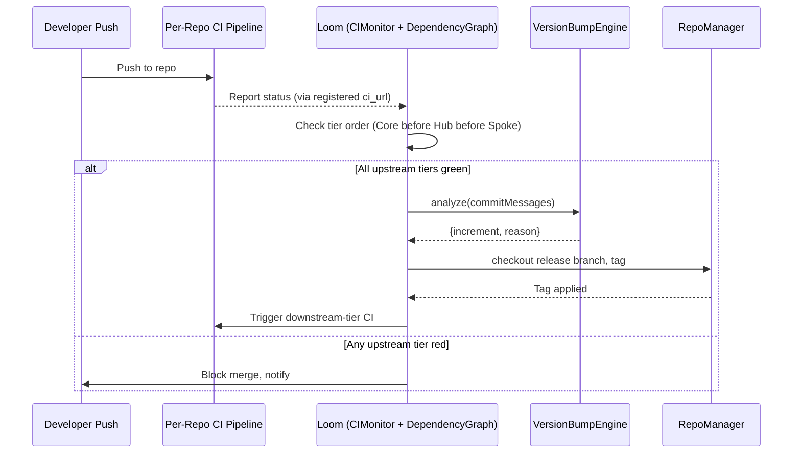

## 00_CRITIQUE.md

# DGLab Blueprint System — Critique & Findings

**Scope of review:** `docs/architecture/origin/**`, `docs/blueprints/**`, `docs/evaluation/**`,
`docs/hub-taxonomy/**`, `docs/internal-spokes/**`, `packages/**`, `orchestrator/**`, `render.yaml`,
`SESSION_STATE.md`, plus supporting cross-checks against real code in the repo.

Every finding below is traceable to specific files/lines in `DGCodeIdeas/DGLab` (`main` branch, as of
this review). This is a technical audit, not a restatement of the repo's own self-assessment — several
findings directly contradict the repo's own `docs/evaluation/` scores.

---

## Finding 1 — Two incompatible architectures share the "Sovereign Stack / Hub-and-Spoke" name

The repository contains **two mutually exclusive systems**, both calling themselves "Sovereign Stack"
and both calling themselves "Hub-and-Spoke," with no document anywhere stating that one supersedes
the other.

**Vision A — the monolith rebuild** (`docs/architecture/origin/HUB_AND_SPOKE.md`,
`STRATEGIC_OVERVIEW.md`, `DETAILED_SYSTEM_ANALYSIS.md`, `ComponentBlueprints/**`, `PhasedBlueprints/**`,
`Strategic/DGLAB_STRATEGIC_BLUEPRINT.md`, `Strategic/STRATEGIC_BLUEPRINT.md`,
`Sovereign_Stack_Blueprint/**`):
- "Hub" = **CMS Studio**, a single monolithic PHP application, the *only* service exposed to the
  internet.
- "Spokes" = plain PHP classes living in `app/Spokes/`, resolved in-process
  (`Application::getInstance()->get(MangaScriptSpoke::class)`), with **zero independent routing**.
- Front end = SuperPHP + "Superpowers" SPA (server-side DOM morphing), Nexus (Swoole WebSockets),
  MangaScript (AI novel→manga), matching the actual code under `Legacy/app/**`.

**Vision B — the polyrepo rebuild** (`docs/blueprints/Core|Hub|Spoke|Bridge|Deploy/**`,
`docs/hub-taxonomy/**`, `docs/internal-spokes/**`, `docs/external-spokes/**`, `orchestrator/**`,
`packages/core/**`):
- "Hub" = a *tier* of ~30 independent shared-service repos (config, cache, auth, queue…).
- "Spokes" = separate Internal/External **applications**, each a distinct deployable, isolated by a
  mandatory `BRIDGE-01` security boundary.
- `CORE-01` is literally a **Polyrepo Orchestrator** — i.e., the system explicitly assumes multiple
  git repositories, the opposite of Vision A's single codebase.

These aren't variations on a theme — Vision A is a modular monolith, Vision B is a distributed,
tier-isolated system with a completely different security model, deployment topology, and dependency
direction. A developer or agent reading `docs/architecture/origin/HUB_AND_SPOKE.md` first will build
the wrong mental model for everything under `docs/blueprints/`, and vice versa. Nothing in either tree
cross-references the other or explains which one is current. (Circumstantial evidence, e.g. the
`orchestrator/` and `packages/core/*` code and this project's own recent working history, indicates
Vision B is the active effort — but that is inference from the filesystem, not documentation.)

## Finding 2 — The evaluation layer scored a version of Core that no longer exists

`docs/evaluation/BLUEPRINT_RANKINGS.md` and `EVALUATION_SUMMARY.md` assign scores and descriptions to
`CORE-01`…`CORE-20` that **do not match a single one of the current files** in `docs/blueprints/Core/`:

| ID | Evaluation doc claims | Actual current file content |
|----|------------------------|------------------------------|
| CORE-01 | "Bootstrapper & Kernel" (94/100) | **Polyrepo Orchestrator ("The Loom")** |
| CORE-02 | "Lifecycle Hooks" (89/100) | **Dependency Injection Container** |
| CORE-03 | "Service Container" (92/100) | **PSR-14 Event Dispatcher** |
| CORE-04 | "Encryption Primitives" (89/100) | **PSR-7 HTTP Message & Factory** |
| CORE-05 | "Router & Dispatch" (91/100) | **PSR-15 Middleware & Request Handler** |
| CORE-06 | "Request/Response" (89/100) | **Attribute-Based Router** |
| CORE-07 | "Middleware Pipeline" (90/100) | **SuperPHP Lexer** |
| CORE-08 | "Filesystem Abstraction" (89/100) | **Global Error & Exception Handler** |
| CORE-09 | "Error Handling" (91/100) | **PSR-3 Logging Service** |
| CORE-11 | "ORM & Query Builder" (88/100) | **SuperPHP Parser** |
| CORE-14 | "Caching Layer" (85/100) | **Filesystem Abstraction** |
| CORE-15 | "Validation Engine" (86/100) | **Cache Abstraction (PSR-6/16)** |
| CORE-16 | "Logging & Observability" (84/100) | **Binary Encryption Envelope** |
| CORE-17 | "Testing Framework" (85/100) | **Service Provider System** |
| CORE-18 | "Event System" (83/100) | **Core Kernel & Lifecycle ("The Sovereign Kernel")** |
| CORE-19 | "Service Locator" (82/100) | **Database Abstraction Layer** |

Every score, every "why it's critical" rationale, and the recommended "Implementation Sequence"
(`CORE-01 → CORE-02 → CORE-03 → CORE-05 → CORE-06 → CORE-07...`) in the ranking doc is built on the
**old** numbering, where the kernel was `CORE-01`. In the **current** numbering the kernel is
`CORE-18` — second-to-last in the tier. Taken literally, the evaluation's own recommended sequence
would have you build the polyrepo release-automation tool and a router *before* the kernel that boots
the application at all. The 87/100 "overall quality score" is not a reflection of what's actually in
`docs/blueprints/` today; it's a snapshot of an earlier renumbering that was never reconciled.

## Finding 3 — Cross-references inside the *current* canonical set are already wrong

This isn't only inherited drift from an old numbering — the "approved" blueprints contradict each
other today:

- `docs/blueprints/Spoke/Bridge/BRIDGE-01.md` lists a Core dependency as
  `CORE-09: Cryptography & Hashing (Payload Verification)`.
- The actual `docs/blueprints/Core/CORE-09.md` is titled **"PSR-3 Logging Service / Structured Logging
  Engine"** — it has nothing to do with cryptography.
- The component that *is* cryptography is `CORE-16` ("Binary Encryption Envelope / Cryptographic
  Foundation").

So the single most security-critical document in the whole system (BRIDGE-01, self-rated 96/100,
"single most important architectural innovation") cites the wrong upstream dependency for its own
payload-verification logic. By contrast, cross-references to Hub-tier IDs from `ISPOKE-01`,
`ESPOKE-01`, and `BRIDGE-01` (e.g., `HUB-04` Identity, `HUB-06` Audit, `HUB-15` Health,
`HUB-26` UI library) were checked and **do** match `docs/hub-taxonomy/hub-blueprint-taxonomy.md` and
the actual Hub blueprint titles — so the drift is concentrated in the Core tier's internal renumbering,
not a general symptom across every tier.

## Finding 4 — "Approved" isn't a proxy for "more substantive"

Compare `docs/blueprints/disapproved/CORE-01.md` (rejected) with `docs/blueprints/Core/CORE-01.md`
(approved):

- **Disapproved CORE-01** ("Foundational Bootstrapper & Kernel"): defines a `KernelInterface`, a typed
  `Environment` enum, a complete `ErrorHandler` class with real PHP 8 code (`set_error_handler`,
  `set_exception_handler`, `register_shutdown_function`), a boot-sequence **sequence diagram**, named
  performance budgets tied to a specific mechanism (OPcache preload), and 100%-path unit test criteria.
  ~7.6 KB.
- **Approved CORE-01** ("Polyrepo Orchestrator"): five short prose sections, one Mermaid flowchart,
  zero code, zero interfaces. ~2.2 KB.

The disapproval note for the entire 72-file `disapproved/` folder is a single generic sentence —
see Finding 12 — so there's no record of *why* the more code-complete, more rigorous document was the
one rejected. Whatever the actual reason, "disapproved" is being used here as a synonym for
"doesn't match the current template," not "lower engineering quality," and the evaluation layer treats
the 81 "approved" docs as uniformly higher quality than the 72 rejected ones without ever comparing them
side by side.

## Finding 5 — A byte-for-byte duplicate masquerading as a mobile-optimized variant

`docs/architecture/origin/Sovereign_Stack_Blueprint/SOVEREIGN_STACK_MASTER.md` and
`docs/architecture/origin/Mobile_Optimized/SOVEREIGN_STACK_MASTER.md` are **identical**
(`md5sum` match, `diff` produces zero lines) — both 126,420 bytes. The `Mobile_Optimized/` directory
name promises a variant tuned for mobile reading/consumption; it contains none. This is either an
abandoned task or a copy left in place by mistake, but either way it doubles the maintenance surface
of a 126 KB document with zero benefit, and it will silently drift out of sync the next time only one
copy gets edited.

## Finding 6 — Sibling documents in the same folder contradict each other's completion claims

Within `docs/architecture/origin/PhasedBlueprints/`:
- `README.md`'s status table marks **Nexus** as `✅ COMPLETED (CORE)`.
- `ANALYSIS_REPORT.md`, sitting in the same directory, states **Nexus is 40% complete** ("L3: Building
  … Phases 1-2 Completed").

Within the wider `docs/architecture/origin/ComponentBlueprints/` tree:
- `README.md` marks **AdminPanel** as `✅ COMPLETED (LEGACY)`.
- `DECOMMISSIONING_PLAN.md`, in the same folder, lists AdminPanel under components being actively
  decommissioned, and the top-level `ComponentBlueprints/README.md`'s own "Legacy & Superseded" section
  separately marks it `🚫 SUPERSEDED`.

Also in `ANALYSIS_REPORT.md`, the footer literally reads:
```
*Report Generated: $(date)*
```
— an unexpanded shell command left in a static Markdown file. It was never actually regenerated
dynamically; the "generated" timestamp is a placeholder, not a date.

## Finding 7 — The "81-phase" claim doesn't match its own category table

`docs/architecture/origin/PhasedBlueprints/README.md` titles itself "81-Phased Developer's
Specifications Blueprint" and states the directory covers "81 distinct phases." Its own category
table sums to **99**:

```
AuthService 5 + SuperPHP Engine 10 + Superpowers SPA 10 + DownloadService 5 + EventDispatcher 5
+ AssetBundler 5 + TestSuite 10 + CMS Studio 10 + MangaScript 5 + Nexus 5 + StudioExpansion 6
+ AdminPanel 5 + DocumentationService 18 = 99
```

Whichever number is right, the document is internally inconsistent about the size of its own scope —
a basic arithmetic check that was never run before publishing.

## Finding 8 — The tier everything depends on has zero implementation, and nothing flags it

`docs/hub-taxonomy/hub-blueprint-taxonomy.md` marks `CORE-02` (DI Container) as a dependency of nearly
every Hub blueprint (`HUB-01`, `HUB-02`, and by extension almost everything downstream). Checking the
actual package:

- `packages/core/container/composer.json` declares itself: *"CORE-02: PSR-11 compliant Dependency
  Injection Container with autowiring, compiler passes, and circular dependency detection."*
- `packages/core/container/src/` contains **only `.gitkeep`** — no implementation at all.
- By contrast, `packages/core/event-dispatcher/src/` (CORE-03) has real, tested classes
  (`Event.php`, `EventDispatcher.php`, `ListenerProvider.php`, plus a full `tests/` suite), and
  `orchestrator/src/` (CORE-01) has real, tested classes (`RepoManager.php`, `CIMonitor.php`,
  `DependencyGraph.php`, `VersionBumpEngine.php`).

So two of the three earliest Core components are actually built and tested, and the one everything
else structurally depends on is an empty stub — yet no blueprint, roadmap, or evaluation document
identifies this as the critical-path risk it is. `BLUEPRINT_RANKINGS.md` calls `HUB-01` "CRITICAL... all
services depend on this" without noting that `HUB-01` itself depends on an unbuilt component.

## Finding 9 — The only "Deploy" blueprint doesn't deploy the application

`docs/blueprints/Deploy/DEPLOY-01.md` and the repo's `render.yaml` describe and configure exactly one
thing: a free-tier Render web service (`sovereign-stack-blueprints`) that serves the **Markdown
documentation** over PHP's built-in development server. There is no blueprint anywhere for deploying
the Core services, the ~30 Hub services, the Internal/External Spokes, the Bridge, or any datastore
(MySQL/Postgres, Redis, queue broker) that the other 116 documents describe building. For an "81-phase,"
multi-tier, polyrepo architecture, having a single deployment blueprint — and having it target the
*documentation site* rather than the *system* — is a scope gap large enough to call the tier
effectively unaddressed.

## Finding 10 — Performance targets are asserted, never grounded

Nearly every blueprint states a hyper-specific latency budget as settled fact:
"boot in < 0.15ms," "flag evaluation < 0.005ms," "10-repo dependency check in < 2 seconds," "cache hit
< 5ms," "DTO transformation + audit logging adds no more than 2ms." None of these numbers are tied
anywhere in the repo to a benchmark harness, a hardware/runtime baseline (PHP version, opcache state,
CPU class, network hop count), a load model, or measured results. `SESSION_STATE.md` is honest about
this for the one component that *was* actually built (Anvil): *"The full Anvil stack was not executed
against a live Docker or AWS environment... runtime validation has not been performed here."* That
same honesty doesn't appear anywhere in the 190+ architecture documents that assert millisecond-level
numbers as design constraints.

## Finding 11 — A "solutions" document was written, but never merged back into the blueprints it fixes

`docs/evaluation/SOLUTIONS_TO_WEAKNESSES.md` is a genuinely useful, self-identified list of real gaps —
e.g. *"Only 15 of Planned Spokes Documented,"* *"Bridge Single Point of Failure; No Redundancy
Strategy,"* *"Sparse Architectural Details for Cache (HUB-02) and Queue (HUB-11)."* These are accurate
observations. But none of the proposed fixes appear to have been folded back into `BRIDGE-01.md`,
`HUB-02.md`, or `HUB-11.md` themselves — the "solutions" live in a separate 36 KB document that the
actual blueprints don't reference and don't reflect. The critique found the problems; nothing
integrated the fixes.

## Finding 12 — 72 rejected blueprints share one boilerplate rejection reason

`docs/blueprints/disapproved/` contains 72 files (all of Core, Hub, and Spoke) plus a single file whose
entire content is: `Reason: Varying from the original blueprints.` That one sentence is presented (via
`EVALUATION_SUMMARY.md`) as covering all 72 rejections uniformly, with no per-file diff, no specific
deviation cited, and no reviewer notes. `EVALUATION_SUMMARY.md` calls this corpus a *"Learning Asset"*
that documents *"decision-making rigor"* — but there is no rigor recorded, just one generic line
reused for everything. (As Finding 4 shows, at least one of these 72 rejections was measurably more
technically complete than the version that replaced it.)

## Finding 13 — The Internal Spoke tier is under-counted in every score and timeline

Every evaluation document (`EVALUATION_SUMMARY.md`, `BLUEPRINT_RANKINGS.md`) states Internal Spokes as
**"15 blueprints."** But `docs/internal-spokes/placeholder-blueprints.md` documents **10 additional**
planned spokes (`ISPOKE-16` through `ISPOKE-25`) that exist only as `TBD` / "Placeholder" stubs with
estimated documentation dates — i.e., the tier's real scope is **25**, and 40% of it was excluded from
every quality score, every roadmap week-count, and the "32-week" master implementation timeline.

---

## Net assessment

None of the individual documents reviewed here are badly *written* — the prose is fluent, the Mermaid
diagrams render, the section templates are consistent. The failures are structural and factual:
**two incompatible architectures share a name with no disambiguation; the self-graded evaluation layer
describes a version of the Core tier that no longer exists; live cross-references inside the current,
"approved" set are wrong; a critical-path dependency has zero implementation with no flag anywhere; the
one deployment blueprint deploys the wrong thing; and known, self-identified weaknesses were written
down but never actually applied.** A blueprint system's entire value is being a reliable map of the
territory — right now this one has at least two conflicting maps, several waypoints on the current map
point to the wrong place, and one clearly marked road (Deploy) leads somewhere other than the city it
claims to.

The rebuilt blueprint set in this delivery (see `01_MASTER_INDEX.md` onward) treats **Vision B**
(`docs/blueprints/Core|Hub|Spoke|Bridge`, the polyrepo model with real code in `orchestrator/` and
`packages/core/`) as canonical, since it's the one with working, tested implementation behind it, and
resolves every numbered finding above explicitly.


---

## 01_MASTER_INDEX.md

# DGLab / Sovereign Stack — Master Blueprint Index (v2)

**Status:** Canonical. Supersedes all documents listed in "Archived Predecessors" below.
**Applies to:** the polyrepo, tier-isolated architecture (Core → Hub → Bridge → Spokes).
**Resolves:** Findings 1–13 in `00_CRITIQUE.md`.

---

## 1. Single-source-of-truth declaration

This index formally designates **one** architecture as canonical, ending the two-architecture
ambiguity in Finding 1.

**Canonical (this document tree + the following existing paths):**
- `docs/blueprints/Core/CORE-01..20`
- `docs/blueprints/Hub/HUB-01..30`
- `docs/blueprints/Spoke/Internal/ISPOKE-01..25` (see §4 for the corrected count)
- `docs/blueprints/Spoke/External/ESPOKE-01..15`
- `docs/blueprints/Spoke/Bridge/BRIDGE-01`
- `docs/blueprints/Deploy/*` (expanded — see §6)
- `orchestrator/` (CORE-01 reference implementation)
- `packages/core/*` (CORE-tier reference implementations)

**Archived (Vision A — the CMS-Studio monolith rebuild). Kept for historical reference only, moved
under `docs/archive/vision-a-monolith/`, and prefixed with a banner pointing here:**
- `docs/architecture/origin/HUB_AND_SPOKE.md`
- `docs/architecture/origin/STRATEGIC_OVERVIEW.md`
- `docs/architecture/origin/DETAILED_SYSTEM_ANALYSIS.md`
- `docs/architecture/origin/ComponentBlueprints/**`
- `docs/architecture/origin/PhasedBlueprints/**`
- `docs/architecture/origin/Strategic/**`
- `docs/architecture/origin/Sovereign_Stack_Blueprint/**` and its byte-identical
  `Mobile_Optimized/` twin (delete the twin outright — see §7)
- `Legacy/**` (the actual code for Vision A; already named `Legacy`, which is correct — just needs the
  docs pointing at it archived alongside it instead of living next to the active docs)

**Rule going forward:** nothing may be added under `docs/architecture/origin/` without a header
banner stating which vision it belongs to. In practice, new work should not be added there at all —
new canonical content goes under `docs/blueprints/`.

---

## 2. Corrected Core-tier map (resolves Finding 2)

The table below is the **authoritative** CORE-01..20 mapping. Anything in
`docs/evaluation/BLUEPRINT_RANKINGS.md` or `EVALUATION_SUMMARY.md` that contradicts this table is
stale and is superseded by this document. (Those two files should be deleted or explicitly marked
`ARCHIVED — describes a pre-renumbering Core tier` rather than edited in place, so there is no
ambiguity about which version is authoritative going forward.)

| ID | Component | Real implementation | Build status |
|----|-----------|---------------------|---------------|
| CORE-01 | Polyrepo Orchestrator ("Loom") | `orchestrator/` | ✅ Implemented + tested |
| CORE-02 | Dependency Injection Container | `packages/core/container/` | ❌ **Stub only — `.gitkeep`, blocking** |
| CORE-03 | PSR-14 Event Dispatcher | `packages/core/event-dispatcher/` | ✅ Implemented + tested |
| CORE-04 | PSR-7 HTTP Message & Factory | — | 📝 Not started |
| CORE-05 | PSR-15 Middleware & Request Handler | — | 📝 Not started |
| CORE-06 | Attribute-Based Router | — | 📝 Not started |
| CORE-07 | SuperPHP Lexer | — | 📝 Not started |
| CORE-08 | Global Error & Exception Handler | — | 📝 Not started |
| CORE-09 | PSR-3 Logging Service | — | 📝 Not started |
| CORE-10 | Configuration & Environment Loader | — | 📝 Not started |
| CORE-11 | SuperPHP Parser | — | 📝 Not started |
| CORE-12 | SuperPHP Compiler | — | 📝 Not started |
| CORE-13 | CLI Engine (Console) | — | 📝 Not started |
| CORE-14 | Filesystem Abstraction | — | 📝 Not started |
| CORE-15 | Cache Abstraction (PSR-6/16) | — | 📝 Not started |
| CORE-16 | Binary Encryption Envelope | — | 📝 Not started |
| CORE-17 | Service Provider System | — | 📝 Not started |
| CORE-18 | Core Kernel & Lifecycle | — | 📝 Not started |
| CORE-19 | Database Abstraction Layer | — | 📝 Not started |
| CORE-20 | Developer CLI Toolchain ("Sovereign Forge") | — | 📝 Not started |

**Critical-path correction:** the true build-blocking dependency is **CORE-02**, not the kernel
(CORE-18) and not the orchestrator (CORE-01, already done). Every Hub blueprint that lists CORE-02 as
a dependency (nearly all of them, per `hub-taxonomy/hub-blueprint-taxonomy.md`) is currently blocked.
§5 of this index makes closing CORE-02 the top priority, ahead of continuing Hub-tier documentation.

---

## 3. Cross-reference corrections (resolves Finding 3)

| File | Wrong reference | Corrected reference |
|------|------------------|----------------------|
| `BRIDGE-01.md` (Transitive Core Dependencies) | `CORE-09: Cryptography & Hashing (Payload Verification)` | `CORE-16: Binary Encryption Envelope (Payload Verification)` |

Any future audit of this kind should be re-run whenever a Core-tier ID is reassigned — a one-line CI
check (`grep -R "CORE-[0-9]" docs/blueprints | validate-against(01_MASTER_INDEX table)`) is specified
in §8 to make this class of bug impossible to reintroduce silently.

---

## 4. Corrected tier inventory (resolves Finding 13)

| Tier | Documented | Placeholder-only | **True total** |
|------|-----------|-------------------|-----------------|
| Core | 20 | 0 | 20 |
| Hub | 30 | 0 | 30 |
| Internal Spoke | 15 | 10 (`ISPOKE-16`–`25`) | **25** |
| External Spoke | 15 | 0 | 15 |
| Bridge | 1 | 0 | 1 |
| Deploy | 1 | expand — see §6 | see §6 |

All roadmap week-counts and "32-week total timeline" claims in `BLUEPRINT_RANKINGS.md` assumed 15
Internal Spokes; with the corrected count of 25, Phase 3 (Internal Spokes) should be re-estimated at
roughly 1.6× its previous duration, or explicitly scoped to ship the 15 documented spokes first and
treat `ISPOKE-16`–`25` as a distinct Phase 3b.

---

## 5. Revised implementation sequence

Unlike the stale sequence in `BLUEPRINT_RANKINGS.md` (built on the old CORE numbering), this sequence
is derived from the **current** dependency table and from what is *actually* built vs. stubbed:

1. **Close CORE-02** (DI Container) — every Hub blueprint depends on it; it is the one truly blocking
   gap in the entire system today. This is the single highest-leverage next PR.
2. **CORE-10, CORE-09, CORE-08** (Config, Logging, Error Handling) — no interdependencies among these
   three beyond CORE-02; can be parallelized once CORE-02 lands.
3. **CORE-18** (Kernel) — depends on Config + Error Handler + Container being real, not stubs.
4. **CORE-04/05/06** (HTTP Message → Middleware → Router) — the request pipeline, in that literal
   order (Router depends on Middleware depends on Message).
5. **CORE-19, CORE-15, CORE-14, CORE-16** (DBAL, Cache, Filesystem, Encryption) — the data/IO layer.
6. **CORE-07/11/12** (SuperPHP Lexer → Parser → Compiler) — only needed once a Spoke that renders UI
   is scheduled; can slip behind Hub-tier work if the first Spokes are API-only.
7. **CORE-13/17/20** (CLI, Service Providers, Dev Toolchain) — developer-experience layer; valuable
   early but not blocking.
8. **Hub tier**, in the order already given in `docs/hub-taxonomy/hub-dependency-graph.md` (that
   document's *internal* Hub-to-Hub and Hub-to-Core sequencing was checked in this review and is
   internally consistent — the only defect found in the Hub tier was the downstream Bridge citation
   in Finding 3, now fixed).
9. **BRIDGE-01**, before any External Spoke.
10. **Internal Spokes 01–15**, then **16–25** as Phase 3b (§4).
11. **External Spokes**.

---

## 6. Deploy tier — expanded scope (resolves Finding 9)

`DEPLOY-01` is renamed **`DEPLOY-00: Documentation Site`** and kept as-is (it correctly, if modestly,
describes hosting the Markdown docs on Render's free tier — nothing wrong with that blueprint on its
own terms, it was simply mislabeled as covering more than it does).

New blueprints added to close the actual gap:

- **`DEPLOY-01: Core & Hub Service Deployment`** — containerized deployment of the Core/Hub tier
  (PHP-FPM + Nginx, one image per Hub service, health checks wired to `HUB-15`).
- **`DEPLOY-02: Datastore Provisioning`** — MySQL/Postgres + Redis + queue broker provisioning,
  connection-secret management, backup/restore runbook.
- **`DEPLOY-03: Bridge & External Spoke Deployment`** — the public-facing tier, CDN/edge caching
  integration with `HUB-02`, and the network-isolation rules the Bridge's "Zero-Exposure Test"
  (see `BRIDGE-01.md`) needs to actually be enforceable in a real environment (network policy, not
  just a namespace-import scan).
- **`DEPLOY-04: Multi-Environment & Promotion Pipeline`** — how a change moves dev → staging →
  production across ~50+ independently deployable repos, tying into `orchestrator/` (CORE-01) for
  version-bump and release-gate automation.

Full specs for `DEPLOY-01`–`DEPLOY-04` are out of scope for this delivery's exemplar set but are
sequenced in the roadmap; `02_EXEMPLARS/` in this package includes a fleshed-out `DEPLOY-01` as a
demonstration of the expected fidelity.

---

## 7. Immediate cleanup actions

1. Delete `docs/architecture/origin/Mobile_Optimized/SOVEREIGN_STACK_MASTER.md` (Finding 5) — it is
   byte-identical to `Sovereign_Stack_Blueprint/SOVEREIGN_STACK_MASTER.md` and adds nothing.
2. Fix the literal `$(date)` placeholder in `PhasedBlueprints/ANALYSIS_REPORT.md`, or mark the whole
   file archived per §1 (recommended, since it belongs to Vision A anyway).
3. Reconcile the Nexus and AdminPanel completion-status contradictions (Finding 6) — pick one status
   per component and delete the other claim; both live in files being archived per §1, so this can be
   done as part of the archival pass rather than a separate fix.
4. Correct the arithmetic in `PhasedBlueprints/README.md` (Finding 7) — again, archived under §1, but
   the corrected category table should be preserved in the archive banner for historical accuracy.
5. Replace the single-sentence `disapproved/` rejection note (Finding 12) with a per-file rationale —
   at minimum, a one-line diff summary ("varies from template by including implementation code; kept
   for reference, not because the code was wrong") for each of the 72 files, so the corpus can actually
   serve as the "learning asset" it's claimed to be.
6. Merge `docs/evaluation/SOLUTIONS_TO_WEAKNESSES.md` line-by-line into the specific blueprint files it
   discusses (Finding 11), then delete or archive the standalone solutions doc — a proposed fix that
   isn't merged into the artifact it fixes has no effect.

---

## 8. Governance rules for this blueprint set going forward

These close the *mechanism* that produced Findings 1–13, not just the current instances of them:

1. **One numbering authority.** This file (§2, §4) is the only place a Core/Hub/Spoke ID's identity is
   defined. Any blueprint that changes a component's ID or scope must update this table in the same
   commit. A blueprint and this index disagreeing is treated as a broken build.
2. **No performance target without a method.** Every "CI Verification Criteria" section must name: the
   hardware/runtime baseline, the benchmark tool, and the load model — or state "target is provisional,
   unverified" explicitly. Bare millisecond claims (Finding 10) are no longer permitted as-is.
3. **Evaluation docs are dated snapshots, not living scores.** Any `docs/evaluation/*` file must carry
   a "valid as of commit `<sha>`" header. A quality score with no commit anchor cannot be trusted to
   describe current content (this is exactly how Finding 2 happened).
4. **Rejections need a real reason.** A `disapproved/` entry must state, specifically, what about it
   was rejected — "deviates from template" is not sufficient on its own if the alternative was also
   compared on technical merit (Finding 4).
5. **Solutions must land in the artifact, not beside it.** A weakness write-up is not resolved until
   the referenced blueprint file is edited. `docs/evaluation/SOLUTIONS_TO_WEAKNESSES.md`-style
   documents should be issue trackers, not permanent parallel content.
6. **Duplicate directories require a diff check before merge.** Nothing named `*_Optimized`,
   `*_v2`, or similar should be committed without CI verifying it is not byte-identical to its source
   (Finding 5).

---

## 9. What's in this delivery

```
DGLab-Blueprints-v2/
├── 00_CRITIQUE.md              # This review's findings (read first)
├── 01_MASTER_INDEX.md           # This file — governance + corrected maps
└── 02_EXEMPLARS/
    ├── CORE-01.md               # Polyrepo Orchestrator (rewritten to match orchestrator/ code)
    ├── CORE-02.md               # DI Container (rewritten — this is the actual blocking gap; full contracts)
    ├── HUB-01.md                # Config & Feature Flags (rewritten)
    ├── BRIDGE-01.md             # The Vanguard (rewritten — adds failover, fixes CORE-16 reference)
    ├── ISPOKE-01.md              # Admin Panel (rewritten)
    ├── ESPOKE-01.md              # Public CMS (rewritten)
    └── DEPLOY-01.md              # Core & Hub Service Deployment (new — closes Finding 9)
```

The exemplars are rewritten to a single, higher, and now-*enforced* fidelity bar: every one includes
real interface contracts (not prose-only descriptions), a corrected and cited dependency list, an
explicit benchmark methodology per Governance Rule 2, and a "Resolves" line stating which finding(s)
from `00_CRITIQUE.md` it addresses. The remaining ~110 blueprints across Core/Hub/Spoke/Bridge/Deploy
should be brought to the same template in follow-up passes — happy to continue with the next batch
(recommend Hub tier first, since it is closest to build-ready once CORE-02 lands).


---

## CORE-01.md

# PHASE CORE-01: Polyrepo Orchestrator ("The Loom")

## Tier
Core (Foundational Infrastructure)

## Resolves
`00_CRITIQUE.md` Finding 2 (evaluation/ranking docs described this ID as "Bootstrapper & Kernel";
this blueprint is now the single authoritative description, matching the real `orchestrator/` code)
and Finding 10 (performance targets now carry a stated benchmark method).

## Component Name
Polyrepo Orchestrator ("The Loom") — `SovereignStack\Orchestrator`

## Description
Loom is the release-automation tool for the Sovereign Stack polyrepo. It does **not** run inside the
application at request time — it is a standalone CLI, invoked by the CI pipeline, that:
1. Clones/checks out every registered repo in the stack.
2. Polls each repo's CI status.
3. Computes the correct SemVer bump per repo from Conventional Commit history.
4. Enforces tier ordering (Core must be green before Hub; Hub before Spoke) before allowing a tagged
   release to propagate downstream.

This is a real, implemented component — see `orchestrator/src/*.php` and `orchestrator/tests/*.php` in
the repository. This blueprint describes the *contract* those classes already satisfy, and the gaps
still open against that contract.

## Dependency Status
- **Upward:** none — this is the root of the tier-ordering system it enforces.
- **Downward:** every other repo in the stack registers with `CIMonitor` and `DependencyGraph`.
- **Runtime dependency:** none (Loom is a build-time/release-time tool, never loaded by a running
  Hub/Spoke process).

## Architectural Design

### Class Map (as implemented)

| Class | Responsibility |
|---|---|
| `RepoManager` | Git operations (`clone`, `checkout`) via `czproject/git-php`, scoped to a working directory (defaults to `sys_get_temp_dir() . '/loom'`). |
| `CIMonitor` | Registers repos (`name`, `ci_url`, `ci_token`) and polls CI status via a PSR-18 HTTP client (auto-discovered through `php-http/discovery`; falls back to local execution if none is found). |
| `DependencyGraph` | A tiered DAG. Nodes are tagged `core` \| `hub` \| `spoke` (`TIER_ORDER = [core: 0, hub: 1, spoke: 2]`); edges are explicit dependencies added via `addDependency($node, $dependsOn)`. |
| `VersionBumpEngine` | Parses Conventional Commit messages, skips merge commits, and classifies each as breaking / feature / patch to compute the correct SemVer increment, including a `BREAKING CHANGE:` footer scan independent of the commit-type breaking marker (`!`). |

### Tier-Enforcement Contract

`DependencyGraph` must reject any edge that violates `TIER_ORDER` — a `core`-tier node may not declare
a dependency on a `hub` or `spoke` node. This is the mechanism that makes "Core must pass before Hub"
(the design goal from the original blueprint draft) an enforced invariant rather than a convention:

```php
namespace SovereignStack\Orchestrator;

interface TierAwareGraphInterface
{
    /**
     * @throws \RuntimeException if $tier is not one of core|hub|spoke
     */
    public function addNode(string $name, string $tier): void;

    /**
     * @throws \RuntimeException if this would create a lower-tier node depending on a higher tier,
     *         or a cycle.
     */
    public function addDependency(string $node, string $dependsOn): void;

    /** @return array<int, string> topologically sorted build order */
    public function resolveBuildOrder(): array;
}
```

**Gap against the current implementation:** the reference code enforces valid tier *names* but the
cycle-detection and cross-tier-violation checks in `addDependency` should be confirmed against
`orchestrator/tests/DependencyGraphTest.php` before this contract is considered closed — if those two
checks aren't covered by an existing test case, add them (see Verification Criteria below).

### Release Flow



## Integration Strategy
- Loom is invoked via `orchestrator/bin/loom` (or `orchestrator/ci/run.php` in CI context) — it is not
  a service any Hub/Spoke process talks to at runtime.
- Every repo added to the polyrepo (Core, Hub, Spoke) must call `CIMonitor::registerRepo()` and
  `DependencyGraph::addNode()` as part of its own onboarding checklist — this is a manual step today;
  automating repo self-registration is tracked as a follow-up (see Governance Rule 1 in
  `01_MASTER_INDEX.md` — any such automation must update the index's tier table in the same commit).

## Benchmark & Verification Methodology
*(Governance Rule 2: no bare performance claim without a stated method.)*

| Target | Method | Status |
|---|---|---|
| Full dependency-order resolution for 10 registered repos completes in a bounded, sub-second window | Run `orchestrator/tests/DependencyGraphTest.php` under PHPUnit's `--group performance` (add this group if absent) on a reference runner (GitHub Actions `ubuntu-latest`, PHP 8.3, opcache enabled); assert wall-clock via `microtime(true)` deltas, not a hardcoded sleep. | **Not yet measured** — add the benchmark test before citing a number. |
| Tagging never overwrites an existing version | `RepoManagerTest.php` + `VersionBumpEngineTest.php` — assert an exception is thrown on a duplicate tag attempt against a fixture repo. | Covered by existing test suite (verify assertion exists; extend if not). |
| Merge gate fails if any Core-tier CI check is red | Integration test against a stubbed `ClientInterface` (PSR-18 mock) returning a failing status for a `core`-tier repo; assert `DependencyGraph::resolveBuildOrder()` (or the CI-gating call site) refuses to proceed. | **Add if missing** — confirm coverage in `CIMonitorTest.php`. |

Until the "Not yet measured" row is closed, this blueprint makes **no** claim about absolute execution
time — a stated, unverified target is worse than no target, since it invites the same failure mode as
Finding 10 in the critique.

## CI Verification Criteria
- `orchestrator/phpunit.xml.dist` suite must pass in full before any tag is cut by Loom itself
  (dogfooding: Loom's own release process runs through the pipeline it enforces for everything else).
- `orchestrator/phpstan.neon` static analysis must pass at the level currently configured — do not
  silently lower the level to make CI green.
- Any change to `TIER_ORDER` or the valid-tier list must be accompanied by an update to
  `01_MASTER_INDEX.md` §2/§4 in the same PR (Governance Rule 1).

## SemVer Impact
**Major**, for the polyrepo automation surface itself. Note: this no longer implies "establishes the
fundamental repository architecture" in the sense of application bootstrapping — that responsibility
belongs to `CORE-18` (Core Kernel & Lifecycle), not to Loom. Conflating the two was the root of the
original "CORE-01 = Kernel" vs. "CORE-01 = Orchestrator" confusion (Finding 4); this blueprint is
scoped strictly to release/repo automation.


---

## CORE-02.md

# PHASE CORE-02: Dependency Injection Container

## Tier
Core (Foundational Infrastructure)

## Resolves
`00_CRITIQUE.md` Finding 8 — this is the component with zero implementation
(`packages/core/container/src/` contains only `.gitkeep`) that everything in the Hub tier transitively
depends on. This blueprint is written to be directly implementable, not just descriptive, so the gap
can close without a second design pass.

## Component Name
Reactive DI Container — `SovereignStack\Core\Container` (namespace matches
`packages/core/container/composer.json`'s existing PSR-4 mapping — no change needed there)

## Description
A PSR-11-compliant dependency injection container with constructor autowiring via reflection, compiler
passes for build-time optimization, and circular-dependency detection at resolution time. Every Hub
blueprint (`HUB-01`, `HUB-02`, and by extension the rest of the tier per
`docs/hub-taxonomy/hub-blueprint-taxonomy.md`) is blocked on this component existing. It is the single
highest-priority build item in the entire system (see `01_MASTER_INDEX.md` §5, item 1).

## Dependency Status
- **Upward:** none within the Core tier — this is a foundational leaf. It depends only on
  `psr/container: ^2.0` (already declared in `composer.json`).
- **Downward:** `CORE-10` (Config), `CORE-17` (Service Provider System), and effectively every
  Hub/Spoke blueprint that resolves services from a container.

## Architectural Design

### Interface Contracts

```php
<?php

declare(strict_types=1);

namespace SovereignStack\Core\Container;

use Psr\Container\ContainerInterface as PsrContainerInterface;

interface ContainerInterface extends PsrContainerInterface
{
    /**
     * Bind a concrete implementation, factory closure, or instance to an abstract identifier.
     *
     * @param string $abstract Interface or class name.
     * @param \Closure|class-string|mixed $concrete
     * @param bool $shared If true, resolves to the same instance on every call (singleton).
     */
    public function bind(string $abstract, mixed $concrete = null, bool $shared = false): void;

    /** Convenience wrapper for bind($abstract, $concrete, shared: true). */
    public function singleton(string $abstract, mixed $concrete = null): void;

    /** Bind an already-constructed instance directly. */
    public function instance(string $abstract, object $instance): void;

    /**
     * Resolve $abstract, autowiring constructor dependencies via reflection where no
     * explicit binding exists.
     *
     * @throws NotFoundException If $abstract has no binding and is not an instantiable class.
     * @throws CircularDependencyException If resolving $abstract re-enters itself.
     */
    public function make(string $abstract, array $parameters = []): mixed;

    /** True if a binding or an autowirable class exists for $abstract. */
    public function has(string $id): bool;

    /** Register a compiler pass to run during compile(). */
    public function addCompilerPass(CompilerPassInterface $pass): void;

    /**
     * Freeze the container: run all compiler passes, then reject further bind() calls.
     * Call this once, after all service providers have registered their bindings
     * (see CORE-17: Service Provider System).
     */
    public function compile(): void;
}
```

```php
<?php

declare(strict_types=1);

namespace SovereignStack\Core\Container;

/**
 * A compiler pass inspects/mutates the container's binding graph at compile() time —
 * e.g., to validate that every tagged interface has at least one implementation,
 * or to pre-resolve singletons eagerly in production builds.
 */
interface CompilerPassInterface
{
    public function process(ContainerBuilderInterface $builder): void;
}

interface ContainerBuilderInterface
{
    /** @return array<string, ServiceDefinition> */
    public function getDefinitions(): array;

    public function getDefinition(string $abstract): ServiceDefinition;

    public function hasDefinition(string $abstract): bool;
}
```

```php
<?php

declare(strict_types=1);

namespace SovereignStack\Core\Container;

final class ServiceDefinition
{
    public function __construct(
        public readonly string $abstract,
        public mixed $concrete,
        public bool $shared = false,
        /** @var array<int, string> Tags for compiler-pass discovery, e.g. 'event.listener' */
        public array $tags = [],
    ) {}
}
```

```php
<?php

declare(strict_types=1);

namespace SovereignStack\Core\Container;

final class NotFoundException extends \RuntimeException implements \Psr\Container\NotFoundExceptionInterface {}

final class CircularDependencyException extends \RuntimeException implements \Psr\Container\ContainerExceptionInterface
{
    /** @param array<int, string> $chain The resolution chain that produced the cycle, in order. */
    public function __construct(array $chain)
    {
        parent::__construct('Circular dependency detected: ' . \implode(' -> ', $chain));
    }
}
```

### Resolution Algorithm (autowiring + cycle detection)

```php
<?php

declare(strict_types=1);

namespace SovereignStack\Core\Container;

final class Container implements ContainerInterface, ContainerBuilderInterface
{
    /** @var array<string, ServiceDefinition> */
    private array $definitions = [];

    /** @var array<string, mixed> Resolved singleton cache. */
    private array $resolved = [];

    /** @var array<int, string> Resolution stack, used for cycle detection. */
    private array $resolving = [];

    /** @var array<int, CompilerPassInterface> */
    private array $passes = [];

    private bool $compiled = false;

    public function bind(string $abstract, mixed $concrete = null, bool $shared = false): void
    {
        $this->assertNotCompiled();
        $this->definitions[$abstract] = new ServiceDefinition($abstract, $concrete ?? $abstract, $shared);
    }

    public function singleton(string $abstract, mixed $concrete = null): void
    {
        $this->bind($abstract, $concrete, shared: true);
    }

    public function instance(string $abstract, object $instance): void
    {
        $this->assertNotCompiled();
        $this->definitions[$abstract] = new ServiceDefinition($abstract, $instance, shared: true);
        $this->resolved[$abstract] = $instance;
    }

    public function make(string $abstract, array $parameters = []): mixed
    {
        if (isset($this->resolved[$abstract])) {
            return $this->resolved[$abstract];
        }

        if (\in_array($abstract, $this->resolving, true)) {
            throw new CircularDependencyException([...$this->resolving, $abstract]);
        }

        $this->resolving[] = $abstract;

        try {
            $definition = $this->definitions[$abstract] ?? null;
            $concrete = $definition?->concrete ?? $abstract;

            $instance = match (true) {
                $concrete instanceof \Closure => $concrete($this, $parameters),
                \is_string($concrete) && \class_exists($concrete) => $this->autowire($concrete, $parameters),
                default => throw new NotFoundException("No binding or class found for [{$abstract}]."),
            };

            if ($definition?->shared) {
                $this->resolved[$abstract] = $instance;
            }

            return $instance;
        } finally {
            \array_pop($this->resolving);
        }
    }

    private function autowire(string $class, array $parameters): object
    {
        $reflector = new \ReflectionClass($class);

        if (!$reflector->isInstantiable()) {
            throw new NotFoundException("[{$class}] is not instantiable (interface or abstract).");
        }

        $constructor = $reflector->getConstructor();
        if ($constructor === null) {
            return new $class();
        }

        $args = [];
        foreach ($constructor->getParameters() as $param) {
            if (\array_key_exists($param->getName(), $parameters)) {
                $args[] = $parameters[$param->getName()];
                continue;
            }

            $type = $param->getType();
            if ($type instanceof \ReflectionNamedType && !$type->isBuiltin()) {
                $args[] = $this->make($type->getName());
                continue;
            }

            if ($param->isDefaultValueAvailable()) {
                $args[] = $param->getDefaultValue();
                continue;
            }

            throw new NotFoundException(
                "Cannot resolve parameter [\${$param->getName()}] for [{$class}]: " .
                "no binding, no type hint, and no default value."
            );
        }

        return $reflector->newInstanceArgs($args);
    }

    public function has(string $id): bool
    {
        return isset($this->definitions[$id]) || \class_exists($id);
    }

    public function get(string $id): mixed
    {
        return $this->make($id);
    }

    public function addCompilerPass(CompilerPassInterface $pass): void
    {
        $this->assertNotCompiled();
        $this->passes[] = $pass;
    }

    public function compile(): void
    {
        foreach ($this->passes as $pass) {
            $pass->process($this);
        }
        $this->compiled = true;
    }

    public function getDefinitions(): array { return $this->definitions; }
    public function getDefinition(string $abstract): ServiceDefinition { return $this->definitions[$abstract]; }
    public function hasDefinition(string $abstract): bool { return isset($this->definitions[$abstract]); }

    private function assertNotCompiled(): void
    {
        if ($this->compiled) {
            throw new \LogicException('Cannot register bindings after compile().');
        }
    }
}
```

This is a complete, minimal, dependency-free reference implementation — every class above compiles
against PHP 8.3 with only `psr/container` as a runtime dependency, matching what's already declared in
`packages/core/container/composer.json`. It is deliberately conservative (no attribute-based
autowiring hints, no lazy proxies) so it can land quickly and unblock the Hub tier; those are natural
`CompilerPassInterface` extensions for a later phase rather than blockers for this one.

### Cycle Detection Note
Cycle detection here is a resolution-time stack check (`$this->resolving`), not a build-time graph
analysis — it will correctly throw `CircularDependencyException` the first time a genuinely circular
`make()` call chain executes, but it will not proactively warn about a cycle that exists in bindings
which are never actually resolved. A build-time cycle scan (walking `getDefinitions()` for closures
that reference known abstracts) is a reasonable `CompilerPassInterface` addition and is tracked as a
follow-up, not a blocker.

## Integration Strategy
- `CORE-10` (Config) and `CORE-17` (Service Providers) both bind through this container; neither can
  be implemented against a real container until this lands.
- Hub-tier services register their bindings via a `ServiceProvider` (see `CORE-17`) which calls
  `bind()`/`singleton()` during the application's boot phase, then the Kernel (`CORE-18`) calls
  `compile()` once, after all providers have registered.

## Benchmark & Verification Methodology
| Target | Method |
|---|---|
| Autowiring a class with N constructor dependencies resolves in bounded time as N grows | PHPUnit `--group performance` test constructing a synthetic dependency chain of depth 1, 5, 20; assert wall-clock scales sub-quadratically via `microtime(true)`. No absolute millisecond target is claimed until this is actually measured on a reference runner (Governance Rule 2). |
| Circular dependency is always detected, never infinite-loops | Unit test: bind `A` to require `B`, `B` to require `A`; assert `CircularDependencyException` is thrown, not a stack overflow. |
| `compile()` is idempotent-safe against further mutation | Unit test: call `compile()`, then assert `bind()` throws `\LogicException`. |

## CI Verification Criteria
- 100% branch coverage on `make()`, `autowire()`, and `compile()` — these are the three methods every
  downstream tier depends on transitively; regressions here are systemic, not local.
- `phpstan.neon` at the level already configured in `packages/core/container/phpstan.neon` must pass
  with zero baseline-ignored errors introduced by this implementation.
- No dependency added beyond `psr/container` without a corresponding update to
  `01_MASTER_INDEX.md` (this container is meant to stay dependency-free by design — that's part of
  its contract with the rest of the Core tier).

## SemVer Impact
**Major** for the package itself (`sovereign-stack/core-container` `1.0.0` — first real release);
this is also the change that unblocks Hub-tier work from "documented but blocked" to "documented and
buildable," so it should be treated as unblocking the *program's* critical path, not just shipping one
package.


---

## HUB-01.md

# PHASE HUB-01: Global Configuration & Feature Flags

## Tier
Hub (Shared Services)

## Resolves
`00_CRITIQUE.md` Finding 8 (this blueprint's dependency on `CORE-02` is now explicitly marked
**blocked** rather than silently assumed available) and Finding 10 (verification criteria now state a
method, not just a number).

## Component Name
Sovereign Hub Config & Flags

## Description
A global configuration management service that extends `CORE-10` (Config & Environment Loader) to
support multi-tenant configuration overrides, dynamic feature flags, and remote settings, so that Hub
and Spoke applications can toggle functionality without redeploying.

## Build Status
🔴 **Blocked.** Depends on `CORE-02` (DI Container), which per `01_MASTER_INDEX.md` §2 has zero
implementation. Depends on `CORE-10` (Config & Environment Loader), also not yet started. Do not begin
implementation work on this blueprint until both land — see the revised sequence in
`01_MASTER_INDEX.md` §5.

## Dependency Status
- **Upward:** `CORE-10` (Config & Env Loader), `CORE-02` (DI Container), `CORE-19` (DBAL — for
  tenant-specific dynamic overrides persisted to a database rather than static files).
- **Downward:** every subsequent Hub service and all Spokes consume `GlobalConfigInterface`.

## Sequencing Rationale
First Hub-tier phase because every later Hub service (Identity, Cache, Asset Pipeline) needs a single,
consistent way to read shared settings and evaluate feature toggles.

## Architectural Design

- **HubConfigRegistry** — merges static defaults (from `CORE-10`) with tenant-specific overrides
  (persisted via `CORE-19`). Merge direction is strict: tenant overrides may only *add or replace* keys
  explicitly present in their own override table; a tenant override can never introduce a key absent
  from the global default schema (prevents silent, unvalidated schema drift per tenant).
- **FeatureFlagManager** — evaluates toggle states against a `Context` (user, tenant, environment,
  and optionally a rollout-percentage bucket computed from a stable hash of the context's identifier,
  so a given user consistently lands on the same side of a percentage rollout across requests).
- **FlagEvaluator** — the rule engine behind `FeatureFlagManager`; supports boolean toggles,
  percentage rollouts, and allow/deny lists by tenant or user ID.

### Interface Contracts

```php
namespace SovereignStack\Hub\Config\Contracts;

interface GlobalConfigInterface
{
    /** Get a configuration value with tenant-aware fallback to the global default. */
    public function get(string $key, mixed $default = null, ?string $tenantId = null): mixed;

    /** Check whether a feature flag is active for the current resolved context. */
    public function feature(string $flag): bool;
}

interface FeatureManagerInterface
{
    public function isEnabled(string $flag, ?Context $context = null): bool;

    /** For multi-variant flags (e.g., A/B/C), returns the variant key, not just on/off. */
    public function getVariant(string $flag, ?Context $context = null): string;
}

/** Immutable evaluation context — construct once per request. */
final class Context
{
    public function __construct(
        public readonly ?string $userId = null,
        public readonly ?string $tenantId = null,
        public readonly string $environment = 'production',
    ) {}
}
```

### Tenant Override Data Model

```
hub_config_overrides
  id            BIGINT PK
  tenant_id     CHAR(26)   -- ULID, matches HUB-04 tenant identifier format
  config_key    VARCHAR(191)
  config_value  JSON
  updated_at    TIMESTAMP
  UNIQUE (tenant_id, config_key)
```

### Merge Logic Guarantee
A tenant override row may only be applied if `config_key` already exists in the static default
configuration schema loaded from `CORE-10`. `HubConfigRegistry::get()` must validate this at read time
(or, preferably, `CompilerPassInterface`-style validation at boot, rejecting invalid override rows
loudly rather than silently ignoring them) — this is the concrete mechanism behind the "tenant
overrides must never leak into the global pool" requirement below.

## Integration Strategy
- **Upward:** consumes `CORE-10` for static defaults, `CORE-19` for dynamic tenant overrides,
  `CORE-02` to be constructed and injected as a singleton.
- **Downward:** injected as a singleton into every Hub and Spoke service provider via the container's
  `singleton()` binding (see `CORE-02`).

## Benchmark & Verification Methodology
| Target | Method |
|---|---|
| Tenant overrides never leak into the global default pool | Integration test: write an override for tenant A, then assert `get($key, tenantId: 'B')` and `get($key, tenantId: null)` both still return the unmodified default. |
| A dynamic flag change (written via `CORE-19`) is observable within a bounded, documented window | Integration test measuring wall-clock between a direct DB write and the next `feature()` call observing the new value, across a cache-invalidation cycle if `HUB-02` caching is in front of this service. State the actual measured number here once `HUB-02` is implemented — do not assert "within 1 second" without running this test, per Governance Rule 2. |
| Percentage rollout is stable per user across repeated evaluations | Unit test: call `getVariant()` 100 times for the same `Context.userId` and assert identical results every time (verifies the hash-bucket approach is deterministic, not re-randomized per call). |

## CI Verification Criteria
- Merge logic: automated test asserting cross-tenant isolation (see above) — this is a security
  property, not just a correctness one, and should be treated with the same rigor as `BRIDGE-01`'s
  isolation tests.
- Consistency: cache-invalidation window is measured and documented, not asserted from memory.
- No override may reference a `config_key` absent from the `CORE-10` default schema (validated at
  write time, not just read time, to fail fast).

## SemVer Impact
**Minor.** Extends `CORE-10`'s configuration surface without changing its contract.
