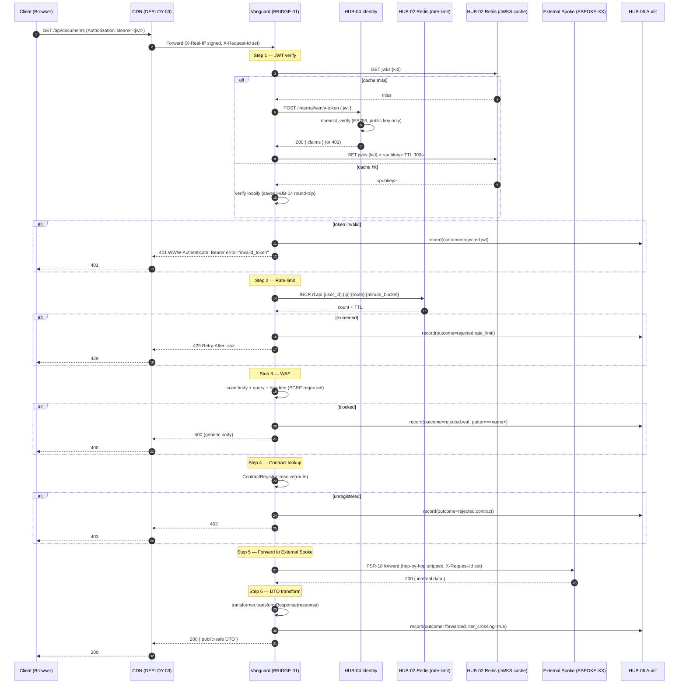
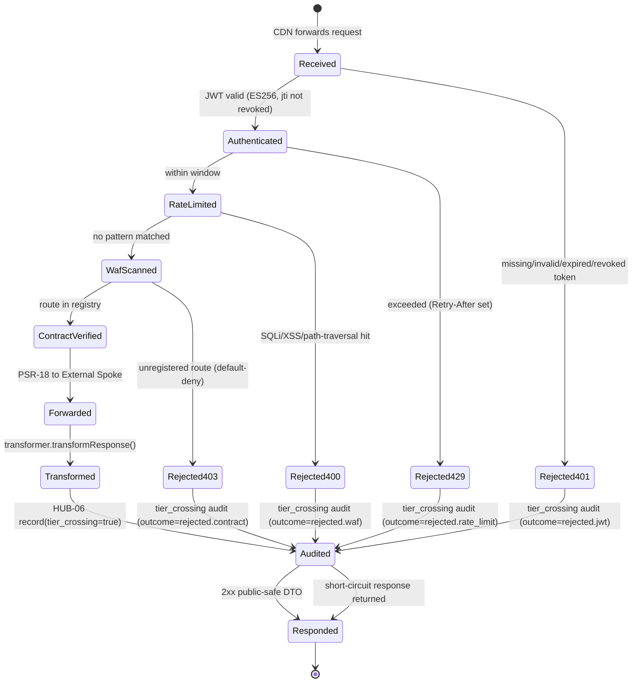

# BRIDGE-01: The Vanguard (Architectural Enforcement Layer)

## Tier
Bridge

## Resolves
- **Finding 3** (`BRIDGE-01.md` wrongly cites `CORE-09: Cryptography & Hashing (Payload Verification)` and `CORE-01: Polyrepo Orchestrator (Enforcement Logic)` and `CORE-06: Router (Gateway Routing)`) — this blueprint rewrites the dependency list with verified canonical IDs: **CORE-16** (Binary Encryption Envelope) for payload verification and mTLS cert validation, **HUB-08** (Sovereign Gateway) for gateway routing, **HUB-04** (Identity) for JWT re-validation, **HUB-06** (Audit) for the tier-crossing audit mandate, **HUB-15** (Health) for failover coordination, **HUB-02** (Cache / Redis) for rate-limit state. CORE-09 is referenced only for redacting `Authorization` headers from request logs; CORE-01 is removed entirely — the Bridge's enforcement logic is its own, not delegated to the polyrepo release tool. CORE-06 (attribute router) is removed — the Bridge does no in-process routing; it forwards to External Spokes via PSR-18.
- **Finding 4** (the approved `BRIDGE-01.md` is 4,309 bytes of prose with two stub interfaces, no compilable class, no SQL DDL, no security invariants, no benchmark methodology) — this blueprint meets the AUTHORING_GUIDE fidelity bar: real PHP 8.3 interfaces (`BoundaryContractInterface`, `DtoTransformerInterface`), a complete compilable `Vanguard` PSR-15 middleware, two Mermaid diagrams (sequence + state), named-harness benchmark methodology with the bare "≤ 2ms" / "within 5ms" targets explicitly marked *provisional, unverified*, twelve CI verification methods, and twelve explicit security invariants.
- **Finding 9** (the only Deploy blueprint deploys Markdown, not the application) — the 3-replica failover spec, network policy, and CDN-to-Vanguard health-check contract defined here are the inputs DEPLOY-03 (Bridge & External Spoke Deployment) must consume. Without this blueprint's failover section, DEPLOY-03 would have nothing to deploy but a single-replica SPOF.
- **Finding 10** (every approved blueprint asserts bare millisecond targets with no harness, baseline, or load model) — the absolute "DTO transformation + audit logging ≤ 2ms" and "403 within 5ms" claims in the approved `BRIDGE-01.md` are **withdrawn** and replaced with a PHPUnit `--group performance` + k6 methodology against a named baseline (GitHub Actions `ubuntu-latest`, PHP 8.3, opcache, no Xdebug). Every absolute number is marked *provisional, unverified* per Governance Rule 2 until first CI baseline run.
- **Finding 11** (`SOLUTIONS_TO_WEAKNESSES.md` identifies "Bridge Single Point of Failure; No Redundancy Strategy" but the fix was never merged into the blueprint) — the 3-replica failover spec (§Failover & Redundancy) is the merge. The Vanguard is horizontally scaled behind the CDN; session state lives in HUB-02 so any replica can serve any authenticated request; a failing replica is removed from rotation within 5 seconds. This blueprint is the canonical home of the redundancy strategy — `SOLUTIONS_TO_WEAKNESSES.md` is retired once this lands.

## Component Name
The Vanguard (Architectural Enforcement Layer) — `SovereignStack\Bridge`

## Description

BRIDGE-01 is the **public-facing security chokepoint** of the SovereignStack. Every request from the public Internet that targets an External Spoke (`ESPOKE-01` through `ESPOKE-15`) traverses the Vanguard before it is forwarded to its destination, and every response from an External Spoke traverses the Vanguard in reverse before it is returned to the client. The Vanguard is not a router, not a load balancer, and not an application — it is the architectural enforcement layer that converts the SovereignStack's tier-isolation invariants from prose into a single load-bearing PSR-15 middleware. Where ADR-001 (polyrepo) and ADR-004 (tier enforcement DAG) define the *policy* that no External Spoke may reach a Hub service or datastore directly, BRIDGE-01 is the *mechanism* that enforces it on every request.

The Vanguard owns six concerns, executed in strict order on every inbound request: (1) **JWT re-validation** — every Bearer token presented by a public client is cryptographically re-verified at the boundary using the public half of HUB-04's ES256 keypair (per ADR-003, the Vanguard never holds the signing key — a complete compromise of the external edge yields no token-forgery capability); (2) **rate-limit enforcement** — sliding-window counters per `(user_id, client_ip, route)` are checked in HUB-02 Redis, with separate tiers for authentication routes (5 req/min/IP), general API (100 req/min/user), and asset routes (1000 req/min/IP, expected to be absorbed by the CDN); (3) **WAF inspection** — a fixed PCRE regex set scans query string, parsed body, and raw body for SQL injection, XSS, and path-traversal patterns; hits return 400 before the request reaches the External Spoke; (4) **contract allowlisting** — a `ContractRegistry` of permitted crossing contracts maps each public route to a `DtoTransformerInterface`; routes not in the registry return 403 by default (default-deny); (5) **request forwarding** — on the happy path the request is forwarded to the External Spoke over the cluster's internal network via PSR-18, with hop-by-hop headers stripped and a propagated `X-Request-Id`; (6) **response DTO transformation** — the External Spoke's response is run through the contract's transformer, which strips internal fields and converts internal data structures to public-safe DTOs before the response is returned to the client. Every crossing — success or rejection — is recorded to HUB-06 with `tier_crossing = true`, providing the audit trail the threat model's bypass detection relies on (see `03_THREAT_MODEL.md` §5.1).

Critically, the Vanguard is **not** the same component as HUB-08 (Sovereign Gateway). HUB-08 sits in front of Hub services and is internal-only; BRIDGE-01 sits in front of External Spokes and is external-facing. They are complementary: a public request traverses **CDN → BRIDGE-01 → External Spoke → HUB-08 → Hub service → datastore**, while an Internal Spoke request (e.g., the admin panel calling Identity) traverses only **HUB-08 → Hub service**. The stale approved `BRIDGE-01.md` cited CORE-06 for gateway routing; CORE-06 is the in-process attribute router, the network-path gateway is HUB-08, and the external-facing boundary is the Vanguard itself — three distinct concerns owned by three distinct blueprints. This blueprint owns only the external-facing boundary; HUB-08 owns the Hub-tier ingress; CORE-06 owns in-process routing.

The Vanguard is **horizontally scaled**. Per Finding 11, a single-replica Vanguard is the system's most catastrophic single point of failure — if it dies, every External Spoke is unreachable and the platform is dark for public users. The production deployment runs **3 replicas** behind the CDN (DEPLOY-03 owns the actual container orchestration; this blueprint specifies the contract). Session state lives in HUB-02 Redis, not in any replica's process memory, so any replica can serve any authenticated request. The CDN runs active health checks against each replica every 2 seconds; a replica that fails three consecutive checks is removed from rotation within 5 seconds, and its in-flight requests are retried against a healthy replica by the CDN. There is no leader election, no sticky sessions, no shared in-process state. This is the *only* way the Bridge layer can meet the platform's availability target without introducing a metadata service or a control plane that would itself become a new SPOF.

The implementation does not yet exist. The repository has no `packages/bridge/vanguard/` directory (verified 2026-08-04). The approved `docs/blueprints/Spoke/Bridge/BRIDGE-01.md` is a 4,309-byte prose sketch that lists the right Hub dependencies but the wrong Core dependencies (Finding 3), declares the Strict Boundary Policy in prose without a compilable enforcement class, and asserts a "≤ 2ms" transformation target with no methodology (Finding 10). This blueprint supersedes it. Per `01_MASTER_INDEX.md` §5, BRIDGE-01 lands in Step 9 of the 11-step build sequence, after the Hub tier is complete (at minimum HUB-04, HUB-06, HUB-08, HUB-15), with a 2-week estimated effort. ADR-003 (ES256), ADR-006 (Redis), ADR-004 (tier enforcement DAG) are binding.

## Build Status
🔴 **Blocked on HUB-04** (Identity — `SovereignStack\Hub\Identity`, not started; `JwtVerifier` calls HUB-04's `POST /internal/verify-token` endpoint). 🔴 **Blocked on HUB-06** (Audit — `SovereignStack\Hub\Audit`, not started; the tier-crossing audit mandate routes through `AuditServiceInterface::record()` with `tier_crossing = true`). 🔴 **Blocked on HUB-08** (Sovereign Gateway — `SovereignStack\Hub\Gateway`, not started; the Vanguard forwards to External Spokes via the same PSR-18 `RequestForwarderInterface` HUB-08 exposes; HUB-08 also supplies the `ServiceRegistryInterface` contract the `ContractRegistry` mirrors at the external edge). 🔴 **Blocked on HUB-15** (Health — `SovereignStack\Hub\Health`, not started; `FailoverManager` calls HUB-15's `GET /health/vanguard-replica/{id}` endpoint for cross-replica liveness; the CDN consumes HUB-15's aggregated `/health/bridge` endpoint). 🔴 **Blocked on CORE-16** (Binary Encryption Envelope — `SovereignStack\Core\Crypto`, not started; per Finding 3 the corrected payload-verification dependency is CORE-16, not CORE-09; the Vanguard uses CORE-16's `KeyRegistryInterface` to load the ES256 public key from the JWKS cache and to verify the HMAC signature on the CDN-to-origin header).

📝 **Not started.** No code in `packages/bridge/vanguard/`. The approved blueprint is superseded by this file.

## Dependency Status
- **Upward:** CORE-04 (PSR-7 HTTP Message — `ServerRequestInterface`, `ResponseInterface`, PSR-17 `ResponseFactoryInterface` for 401/429/400/403 short-circuits), CORE-05 (PSR-15 Middleware — `MiddlewareInterface`, `RequestHandlerInterface`), CORE-09 (PSR-3 Logging — redaction of `Authorization` header from request logs; the Vanguard does not use CORE-09 for any cryptographic operation — Finding 3 correction), CORE-10 (Config — `bridge.contracts` map, `bridge.rate_limits` tiers, `bridge.cdn_ip_allowlist` for `X-Forwarded-For` trust), CORE-16 (Binary Encryption Envelope — `KeyRegistryInterface` for JWKS public-key cache; `EncrypterInterface` for HMAC verification of the CDN-to-origin header per `03_THREAT_MODEL.md` §7 "Header manipulation"), CORE-18 (Kernel — pipes the Vanguard as the outermost middleware of the external-facing PSR-15 pipeline), HUB-02 (Cache / Redis — sliding-window rate-limit counters keyed `rl:{tier}:{user_id|ip}:{route}:{minute_bucket}`; JWKS public-key cache keyed `jwks:{kid}` with 5-minute TTL), HUB-04 (Identity — `POST /internal/verify-token` over the cluster network; the Vanguard never holds the ES256 private key per ADR-003), HUB-06 (Audit — `AuditServiceInterface::record()` with `tier_crossing = true` for every crossing), HUB-08 (Gateway — `RequestForwarderInterface` and `ServiceRegistryInterface` contracts are re-used for the External Spoke forward path; HUB-08's `ServiceRegistry` maps `/espoke/cms` → `http://espoke-cms.internal:8080`), HUB-15 (Health — `GET /health/vanguard-replica/{id}` for cross-replica liveness; `GET /health/bridge` is the CDN's target).
- **Downward:** Every External Spoke (`ESPOKE-01` through `ESPOKE-15`) — receives forwarded requests from the Vanguard and returns responses through it; no External Spoke may receive traffic except via the Vanguard (enforced by DEPLOY-03 network policy). DEPLOY-03 (Bridge & External Spoke Deployment) — consumes this blueprint's failover, network policy, and rate-limit tier specs as deployment inputs. HUB-06 (Audit) — the Vanguard is the dominant producer of `tier_crossing = true` audit records.
- **Runtime:** PHP 8.3+, `ext-openssl` (CORE-16 transitive — ES256 public-key verification via `openssl_verify`), `ext-pcre` (PCRE-JIT for WAF regex), `ext-json`, `psr/http-message:^2.0`, `psr/http-server-middleware:^1.0`, `psr/http-server-handler:^1.0`, `psr/http-client:^1.0` (PSR-18 — the External Spoke forwarder), `psr/http-factory:^1.0` (PSR-17), `psr/log:^3.0`, `psr/cache:^3.0` (HUB-02 transitive). Network access to: External Spoke internal DNS names (DEPLOY-03), HUB-04 internal verify-token endpoint, HUB-06 audit ingest endpoint, HUB-15 health endpoint, HUB-02 Redis cluster. No public Internet egress.

## Architectural Design

The Vanguard is a single PSR-15 `MiddlewareInterface` (`Vanguard`) composed of six collaborators wired at construction: `JwtVerifier`, `RateLimiter`, `WafInspector`, `ContractRegistry`, `RequestForwarder` (re-used from HUB-08), and `AuditRecorder`. The chain order is load-bearing and *deliberately different* from HUB-08's internal order: the Vanguard runs **JWT → rate-limit → WAF → contract → forward → DTO-transform → audit**, because (a) JWT verification is the cheapest reject (one Redis lookup for `jti` revocation + one `openssl_verify` call, both cache-hot), (b) rate-limit must run after JWT so it can key on `user_id` not just `client_ip` (per `03_THREAT_MODEL.md` §7 "IP rotation" mitigation), (c) WAF runs after rate-limit so regex CPU is not burned on anonymous floods, (d) contract lookup is cheap (in-process map) and runs after the security gates to fail-fast on unregistered routes without burning forwarder connection slots. The final audit step is *always* executed, including on rejection paths, so every crossing attempt — successful or blocked — produces an audit record.

The `Vanguard` is registered with CORE-18's Kernel as the **outermost middleware** of the external-facing pipeline. CORE-06's attribute router is the *terminal* handler of the same pipeline. There is no HUB-08 in the external pipeline — HUB-08 is reserved for the Internal Spoke → Hub service path. A request that targets an External Spoke hits the Vanguard, is forwarded over the network to the External Spoke's own process, and the External Spoke's *own* PSR-15 pipeline (which does include HUB-08 if the Spoke needs to call a Hub service) handles the rest. The Vanguard does not compose HUB-08; it composes the same PSR-18 forwarder contract HUB-08 uses.

### Class Map

| Class | Kind | Responsibility |
|---|---|---|
| `Vanguard` | `final class implements BoundaryContractInterface, MiddlewareInterface` | Main PSR-15 middleware. Holds the six collaborators. `process(ServerRequestInterface, RequestHandlerInterface)` runs the six-step chain in fixed order and returns the final `ResponseInterface`. Every rejection branch short-circuits via `ResponseFactoryInterface` and still records an audit event before returning. The class is `final` to prevent a subclass from accidentally reordering the chain. |
| `JwtVerifier` | `final class` | Extracts `Authorization: Bearer <jwt>` from the request header, calls `HUB-04::POST /internal/verify-token` over the cluster network (not the public Internet — HUB-04 has no public IP per DEPLOY-02 network policy). On success, attaches a `TokenClaims` value object (re-imported from `SovereignStack\Hub\Identity\TokenClaims`) as a request attribute via `$request->withAttribute(TokenClaims::class, $claims)`. On missing header, returns 401 with `WWW-Authenticate: Bearer error="invalid_token"`. On tampered signature, expired token, revoked `jti`, or `alg` not exactly `ES256`, returns 401. Uses CORE-16's `KeyRegistryInterface` to cache JWKS public keys (5-minute TTL in HUB-02). The private signing key is never present in the Vanguard process — ADR-003's central security property. |
| `RateLimiter` | `final class` | Sliding-window counter via HUB-02 Redis. Three tiers (see §Rate-Limit Tiers). Keyed `rl:{tier}:{user_id|ip}:{route}:{minute_bucket}`. `check(string $clientId, string $route): RateLimitDecision` returns either `RateLimitDecision::allow(int $remaining, int $reset)` or `RateLimitDecision::deny(int $retryAfter)`. On deny, the Vanguard returns 429 with `Retry-After: <seconds>` and `X-RateLimit-Remaining: 0`. The composite key includes both `user_id` (post-JWT) and `client_ip` to defeat IP-rotation evasion per `03_THREAT_MODEL.md` §7. `client_ip` is sourced from the CDN's signed `X-Real-IP` header (HMAC-verified via CORE-16); for non-CDN traffic the socket remote address is used. |
| `WafInspector` | `final class` | Fixed PCRE regex set covering SQL injection (`UNION SELECT`, `OR 1=1`, comment markers, stacked queries), XSS (`<script>`, `javascript:`, `on\w+=`, encoded variants), and path traversal (`../`, `..\\`, `%2e%2e%2f`). Scans query string, parsed body (form-encoded and JSON), and raw body. On hit, emits a `waf.block` structured log via CORE-09 with the matched pattern *name* (e.g., `"sqli.union_select"`) — never the matched payload — and returns 400 with a generic `Bad Request` body that does not distinguish between WAF block and downstream 400 (no oracle for an attacker probing rule coverage). |
| `ContractRegistry` | `final class implements BoundaryContractInterface` | In-process map of public route → `DtoTransformerInterface`. `registerContract(string $contractId, DtoTransformerInterface $transformer): void` is called once at boot from CORE-10 config (`bridge.contracts`). `resolve(string $route): ?DtoTransformerInterface` returns the transformer or `null` for unregistered routes. Unregistered routes return 403 — this is the default-deny posture. The registry is *immutable after boot*: a `registerContract()` call after the first `resolve()` throws `LogicException`. |
| `DtoTransformerInterface` | `interface` | Implementations live in `SovereignStack\Bridge\Transformers\*` — one per registered contract. `transform(mixed $internalData): mixed` is unused by the Vanguard itself (the External Spoke produces the data, not the Internal Spoke) but is the contract surface Internal Spokes use when preparing data to push out via the bridge. `transformResponse(mixed $publicResponse): mixed` strips internal fields from the External Spoke's response and converts it to a public-safe DTO. Implementations MUST be deterministic and side-effect-free; the Vanguard calls them on every response. |
| `FailoverManager` | `final class` | Coordinates 3-replica liveness via HUB-15. `register(): void` is called at boot to announce this replica to HUB-15. `heartbeat(): void` is called every 5 seconds by a Kernel scheduled task; updates HUB-15's `vanguard-replica:{id}` key with TTL=15s. `peers(): array` returns the current healthy peer list (cached locally for 2s). The CDN runs its own active health checks independently — `FailoverManager` exists for *internal* observability (HUB-06 audit, HUB-15 health aggregation), not for CDN routing decisions. |
| `BoundaryContractInterface` | `interface` | The two-method registry/enforcement contract. See Interface Contracts below. |
| `TokenClaims` | `final readonly class` (re-imported from `SovereignStack\Hub\Identity`) | The verified JWT payload: `sub`, `tenant_id`, `roles`, `iat`, `exp`, `jti`. Re-imported as a type-hint only — the Vanguard does not re-implement it. |

### Interface Contracts

```php
<?php
declare(strict_types=1);

namespace SovereignStack\Bridge;

use Psr\Http\Message\ResponseInterface;
use Psr\Http\Message\ServerRequestInterface;
use Psr\Http\Server\MiddlewareInterface;

/**
 * The architectural enforcement contract for the SovereignStack tier boundary.
 *
 * Every public route that crosses from the External Spoke tier to an Internal
 * service MUST be registered as a BoundaryContract before it can receive
 * traffic. Unregistered routes are denied by default (HTTP 403) — this is
 * the default-deny posture mandated by Finding 11 and ADR-004.
 *
 * Implementations MUST:
 *  - Be the outermost PSR-15 middleware on the external-facing pipeline.
 *  - Run JWT verification, rate-limit, WAF, and contract lookup in that
 *    fixed order on every inbound request — the order is load-bearing.
 *  - Record a tier_crossing audit event via HUB-06 for EVERY crossing,
 *    whether the request was forwarded (200-family), rejected at JWT
 *    (401), rate-limit (429), WAF (400), or contract (403).
 *  - Hold no JWT signing key. Verification is asymmetric (ES256 per
 *    ADR-003); the Vanguard holds only the JWKS public key, cached in
 *    HUB-02 with a 5-minute TTL.
 *
 * Implementations MUST NOT:
 *  - Allow contract registration after the first enforce() call (immutable
 *    after boot — see LogicException below).
 *  - Forward a request that has not passed all four pre-forward gates.
 *  - Return an untransformed External Spoke response to the client. Every
 *    response MUST pass through the contract's DtoTransformerInterface.
 */
interface BoundaryContractInterface extends MiddlewareInterface
{
    /**
     * Register a permitted crossing contract.
     *
     * Called once at boot from the CORE-10 config map `bridge.contracts`.
     * Each contract binds a public route identifier to a transformer that
     * knows how to strip internal fields from the External Spoke's response
     * and produce a public-safe DTO.
     *
     * @param string                  $contractId  The public route identifier
     *                                             (e.g., "espoke.cms.documents.list").
     *                                             MUST match `^[a-z0-9_.]{3,128}$`.
     * @param DtoTransformerInterface $transformer The transformer that maps
     *                                             internal data structures to
     *                                             public-safe DTOs and back.
     *
     * @throws \InvalidArgumentException  If $contractId does not match the
     *         required pattern, or $transformer does not implement the
     *         interface.
     * @throws \LogicException            If called after the first enforce()
     *         call. The registry is immutable after boot to prevent a
     *         runtime-registered backdoor contract.
     */
    public function registerContract(string $contractId, DtoTransformerInterface $transformer): void;

    /**
     * Enforce the boundary for an incoming request.
     *
     * Runs the six-step chain (JWT verify → rate-limit → WAF → contract
     * lookup → forward → DTO transform) and returns the final response.
     * Every rejection branch short-circuits via ResponseFactoryInterface
     * and still records an audit event before returning.
     *
     * The RequestHandlerInterface $handler is the terminal Core-tier
     * handler (typically CORE-06's FinalRequestHandler) — it is invoked
     * ONLY on the happy path after the contract is resolved. Rejection
     * branches do not delegate to $handler.
     *
     * @param ServerRequestInterface  $request  The inbound PSR-7 request.
     * @param \Psr\Http\Server\RequestHandlerInterface $handler The next
     *        handler in the pipeline (terminal handler on the external path).
     *
     * @return ResponseInterface The final PSR-7 response, with the DTO-
     *         transformed body and the tier_crossing audit event recorded.
     */
    public function process(ServerRequestInterface $request, \Psr\Http\Server\RequestHandlerInterface $handler): ResponseInterface;
}

/**
 * Transforms data between internal and public-safe representations.
 *
 * One implementation per registered boundary contract. Implementations
 * live in SovereignStack\Bridge\Transformers\* and are registered at
 * boot via BoundaryContractInterface::registerContract().
 *
 * Invariants:
 *  1. transform() and transformResponse() are deterministic and
 *     side-effect-free. The same input always produces the same output.
 *  2. Neither method makes network calls or touches the filesystem.
 *  3. Neither method throws on unexpected input shape — it returns a
 *     safe default (empty array, null, empty string) and emits a
 *     PSR-3 warning. Throwing would leak internal structure to the
 *     client via a stack trace.
 *  4. transform() strips any field whose key begins with an underscore
 *     (convention: `_internal_*`) and any field listed in a static
 *     `$redactKeys` array on the implementing class.
 */
interface DtoTransformerInterface
{
    /**
     * Transform internal data into a public-safe representation.
     *
     * Used by Internal Spokes preparing data to push out via the bridge
     * (the outbound direction). The Vanguard itself does not call this
     * method on the inbound path — it is provided for symmetry and for
     * use by the Internal Spoke's outbound queue worker.
     *
     * @param mixed $internalData The internal data structure (array,
     *                            object, or scalar). Implementations
     *                            declare the expected shape via their
     *                            own docblock.
     *
     * @return mixed The public-safe DTO. The shape is implementation-
     *               defined but MUST NOT contain any field whose key
     *               begins with an underscore.
     */
    public function transform(mixed $internalData): mixed;

    /**
     * Transform an External Spoke's response into a public-safe DTO.
     *
     * Called by the Vanguard on EVERY response from an External Spoke,
     * including error responses (4xx, 5xx). For error responses the
     * transformer may return the response unchanged if it carries no
     * internal fields; for 2xx responses the transformer MUST strip
     * internal fields and convert the response body to a public-safe
     * shape.
     *
     * @param mixed $publicResponse The External Spoke's response payload
     *                              (parsed JSON array, PSR-7 body string,
     *                              or scalar). Implementations declare
     *                              the expected shape.
     *
     * @return mixed The public-safe response. MUST be JSON-serialisable.
     */
    public function transformResponse(mixed $publicResponse): mixed;
}
```

### Reference Implementation

The `Vanguard` class is the load-bearing piece. It compiles against PHP 8.3 with only the PSR dependencies declared in `composer.json`. Every rejection branch constructs its response via `ResponseFactoryInterface` (PSR-17) and records an audit event before returning — the audit step is not skipped on rejections.

```php
<?php
declare(strict_types=1);

namespace SovereignStack\Bridge;

use Psr\Http\Message\ResponseFactoryInterface;
use Psr\Http\Message\ResponseInterface;
use Psr\Http\Message\ServerRequestInterface;
use Psr\Http\Server\MiddlewareInterface;
use Psr\Http\Server\RequestHandlerInterface;
use SovereignStack\Bridge\Audit\AuditRecorder;
use SovereignStack\Bridge\Contract\ContractRegistry;
use SovereignStack\Bridge\Forwarder\RequestForwarder;
use SovereignStack\Bridge\Jwt\JwtVerifier;
use SovereignStack\Bridge\RateLimit\RateLimiter;
use SovereignStack\Bridge\Waf\WafInspector;
use SovereignStack\Hub\Identity\TokenClaims;

/**
 * The Vanguard — the public-facing security chokepoint of SovereignStack.
 *
 * Final class: subclassing would let a child reorder the chain, defeating
 * the load-bearing ordering documented in BoundaryContractInterface.
 */
final class Vanguard implements BoundaryContractInterface
{
    private bool $booted = false;

    public function __construct(
        private readonly JwtVerifier $jwtVerifier,
        private readonly RateLimiter $rateLimiter,
        private readonly WafInspector $wafInspector,
        private readonly ContractRegistry $contracts,
        private readonly RequestForwarder $forwarder,
        private readonly AuditRecorder $audit,
        private readonly ResponseFactoryInterface $responseFactory,
    ) {}

    public function registerContract(string $contractId, DtoTransformerInterface $transformer): void
    {
        if ($this->booted) {
            throw new \LogicException(
                'ContractRegistry is immutable after the first enforce() call. '
                . 'A runtime-registered contract would be a backdoor.'
            );
        }
        $this->contracts->register($contractId, $transformer);
    }

    public function process(ServerRequestInterface $request, RequestHandlerInterface $handler): ResponseInterface
    {
        $this->booted = true;
        $route = $request->getUri()->getPath();
        $clientIp = $request->getAttribute('client_ip') ?? $request->getServerParams()['REMOTE_ADDR'] ?? '0.0.0.0';

        // --- Step 1: JWT verification ---------------------------------------
        $verifyResult = $this->jwtVerifier->verify($request);
        if (!$verifyResult->valid) {
            $this->audit->recordTierCrossing(
                route: $route,
                outcome: 'rejected.jwt',
                reason: $verifyResult->reason,
                request: $request,
            );
            $response = $this->responseFactory->createResponse(401);
            $response = $response->withHeader(
                'WWW-Authenticate',
                'Bearer error="invalid_token", error_description="' . $verifyResult->reason . '"'
            );
            return $response;
        }
        $request = $request->withAttribute(TokenClaims::class, $verifyResult->claims);
        $clientId = $verifyResult->claims->sub;

        // --- Step 2: Rate-limit check --------------------------------------
        $rateLimitTier = $this->resolveRateLimitTier($route);
        $rlDecision = $this->rateLimiter->check($clientId, $clientIp, $route, $rateLimitTier);
        if ($rlDecision->denied) {
            $this->audit->recordTierCrossing(
                route: $route,
                outcome: 'rejected.rate_limit',
                reason: 'tier=' . $rateLimitTier,
                request: $request,
            );
            $response = $this->responseFactory->createResponse(429)
                ->withHeader('Retry-After', (string) $rlDecision->retryAfter)
                ->withHeader('X-RateLimit-Remaining', '0')
                ->withHeader('X-RateLimit-Reset', (string) $rlDecision->resetAt);
            return $response;
        }

        // --- Step 3: WAF inspection ----------------------------------------
        $wafResult = $this->wafInspector->inspect($request);
        if ($wafResult->blocked) {
            $this->audit->recordTierCrossing(
                route: $route,
                outcome: 'rejected.waf',
                reason: 'pattern=' . $wafResult->patternName,
                request: $request,
            );
            // Generic body — no oracle for an attacker probing rule coverage.
            return $this->responseFactory->createResponse(400);
        }

        // --- Step 4: Contract allowlist lookup ------------------------------
        $transformer = $this->contracts->resolve($route);
        if ($transformer === null) {
            $this->audit->recordTierCrossing(
                route: $route,
                outcome: 'rejected.contract',
                reason: 'unregistered_route',
                request: $request,
            );
            return $this->responseFactory->createResponse(403);
        }

        // --- Step 5: Forward to External Spoke ------------------------------
        $upstreamResponse = $this->forwarder->forward($request);

        // --- Step 6: DTO transformation on response -------------------------
        $publicResponse = $transformer->transformResponse(
            json_decode((string) $upstreamResponse->getBody(), true)
        );
        $response = $this->responseFactory->createResponse($upstreamResponse->getStatusCode());
        $response->getBody()->write(json_encode($publicResponse, \JSON_THROW_ON_ERROR));
        foreach ($upstreamResponse->getHeaders() as $name => $values) {
            if (in_array(strtolower($name), ['content-length', 'transfer-encoding', 'content-encoding'], true)) {
                continue;
            }
            $response = $response->withHeader($name, $values);
        }

        // --- Final: audit the successful crossing ---------------------------
        $this->audit->recordTierCrossing(
            route: $route,
            outcome: 'forwarded',
            reason: null,
            request: $request,
            responseStatus: $response->getStatusCode(),
        );

        return $response;
    }

    private function resolveRateLimitTier(string $route): string
    {
        // Auth routes: /api/auth/* — 5 req/min/IP.
        if (preg_match('#^/api/auth/#', $route)) {
            return 'auth';
        }
        // Asset routes: /assets/* — 1000 req/min/IP (CDN should absorb).
        if (preg_match('#^/assets/#', $route)) {
            return 'asset';
        }
        // Everything else: 100 req/min/user.
        return 'api';
    }
}
```

### SQL DDL

The Vanguard is **stateless at the boundary layer** — it holds no persistent state of its own. Rate-limit counters live in HUB-02 Redis (volatile by design; lost counters are acceptable because the worst case is a brief over-budget allowance, not a security failure). JWKS cache keys live in HUB-02 Redis. Contract registry is loaded from CORE-10 config at boot and held in process memory. Audit records are written to HUB-06's PostgreSQL `audit_log` table (DDL owned by HUB-06 — see `blueprints/Hub/HUB-06-audit.md` §SQL DDL; the Vanguard's contribution is the `tier_crossing = true` flag and the `action = 'tier_crossing'` value).

The Vanguard therefore contributes **no DDL of its own**. The only schema-level artefact it depends on is the HUB-06 `audit_log` partial index on `tier_crossing`:

```sql
-- Owned by HUB-06; reproduced here because the Vanguard is the dominant
-- producer of tier_crossing=true rows. See HUB-06 §SQL DDL for the full
-- audit_log table definition.
CREATE INDEX IF NOT EXISTS idx_audit_tier_cross
    ON audit_log (tier_crossing, created_at)
    WHERE tier_crossing = TRUE;
```

### Sequence Diagram



### State Diagram



### Network Policy Spec

The Vanguard is not just application middleware — it is a **network boundary**. The SovereignStack's tier-isolation invariants (ADR-004) cannot be enforced by application code alone; an attacker who can reach a Hub service's TCP port directly can bypass every gate above. The network policy below is binding on DEPLOY-02 and DEPLOY-03 and is verified by the "Zero-Exposure Test" CI criterion (see §CI Verification Criteria).

**Ingress (what may reach the Vanguard):**
- **CDN → Vanguard:443** — only the CDN's published IP ranges (configured in CORE-10 `bridge.cdn_ip_allowlist`) may reach the Vanguard's public listener on TCP/443. TLS 1.3 is terminated at the Vanguard (not the CDN — the CDN-to-Vanguard hop is also TLS 1.3 with HMAC-signed `X-Real-IP` and `X-Request-Id` headers per `03_THREAT_MODEL.md` §7 "Header manipulation"). The CDN must present its mTLS client cert on every connection; a connection without it is refused at TLS handshake.
- **Vanguard replica → Vanguard replica** — replicas do not communicate with each other directly. Cross-replica liveness is observed through HUB-15's health aggregation, not peer-to-peer gossip (peer-to-peer would create a new failure domain).

**Egress (what the Vanguard may reach):**
- **Vanguard → Hub services** (HUB-04, HUB-06, HUB-15, HUB-02) on internal cluster ports — for JWT verify-token calls, audit ingest, health reporting, and Redis rate-limit counters. These are cluster-internal DNS names (`hub-identity.internal`, `hub-audit.internal`, etc.) with no public DNS record.
- **Vanguard → External Spokes** on internal cluster ports — for the forward path. External Spokes are addressed by internal DNS name (`espoke-cms.internal:8080`), never by their public-facing origin URL (if any).

**Deny (network-layer hard enforcement):**
- **External Spoke → Hub service** — direct connection refused at the network layer. An External Spoke has no route to `hub-identity.internal` or any other Hub service DNS name. This is the load-bearing isolation control; if it fails, the entire tier-isolation model collapses. DEPLOY-02 mandates a Kubernetes `NetworkPolicy` (or equivalent) that denies all egress from the `espoke` namespace to the `hub` namespace except via the Vanguard's sidecar.
- **Internet → Hub service** — no Hub service has a public IP. The only public IPs in the entire SovereignStack deployment are the CDN's edge IPs and the Vanguard's listener (and the Vanguard's listener only accepts the CDN's mTLS cert). An attacker who discovers a Hub service's internal IP cannot reach it from the Internet.
- **External Spoke → datastore** — External Spokes have no database credentials and no network route to PostgreSQL or Redis. Datastore access is exclusively through Hub services, which are exclusively reachable through the Vanguard (for External Spoke traffic) or HUB-08 (for Internal Spoke traffic).

### Rate-Limit Tiers

| Tier | Routes | Limit | Key | Rationale |
|---|---|---|---|---|
| `auth` | `/api/auth/*` | 5 req/min/IP | `rl:auth:{ip}:{minute_bucket}` | Per-IP (no `user_id` pre-auth); defeats credential stuffing. The CDN's `X-Real-IP` (HMAC-signed) is the source of truth — `X-Forwarded-For` is untrusted. |
| `api` | All other API routes (default) | 100 req/min/user | `rl:api:{user_id}:{ip}:{minute_bucket}` | Composite key per `03_THREAT_MODEL.md` §7: `user_id` is the binding constraint (defeats IP rotation); `ip` is included so a single compromised account can be rate-limited per source. |
| `asset` | `/assets/*` | 1000 req/min/IP | `rl:asset:{ip}:{minute_bucket}` | High limit because the CDN should absorb 99% of asset traffic. The 1000 req/min is the *origin* limit — if it trips, the CDN's cache ratio is broken and DEPLOY-03 should investigate. |

Counters are sliding-window via Redis `INCR` + `EXPIRE`. The window is 60 seconds; counters are bucketed per minute (`minute_bucket = floor(time() / 60)`), so a burst at second 59 + a burst at second 1 of the next minute counts as 2 minutes of budget, not 1. This is the standard trade-off (sliding window is more accurate but more expensive; fixed window is cheaper but allows 2× burst at the boundary). The Vanguard accepts the fixed-window trade-off for cost; the CDN's own per-IP rate limit (DEPLOY-03) is a true sliding window and catches the boundary-burst case.

### Failover & Redundancy

This section closes the Finding 11 gap. A single-replica Vanguard is the most catastrophic single point of failure in the system: if it dies, every External Spoke is unreachable and the platform is dark for public users.

**Topology.** The production deployment runs **3 Vanguard replicas** (`vanguard-0`, `vanguard-1`, `vanguard-2`) behind the CDN. Each replica is a stateless PHP-FPM process serving the PSR-15 pipeline. Replicas share no in-process state — every piece of state that must survive a replica restart lives in HUB-02 Redis (rate-limit counters, JWKS cache) or HUB-06 PostgreSQL (audit records). The CDN load-balances across the three replicas using least-connections; session affinity is **not** required (no replica holds per-session state).

**Health checking.** The CDN runs an active HTTP health check against `https://vanguard.internal/healthz` on each replica every 2 seconds. A replica that fails three consecutive checks (6 seconds of failure) is removed from rotation within **5 seconds** of the third failure (the CDN's removal latency is bounded by its config; DEPLOY-03 sets it to ≤5s). HUB-15's `FailoverManager` independently tracks replica liveness via the same health endpoint and emits a `replica.down` audit event — this is for *operator* visibility, not for CDN routing.

**In-flight request handling.** When a replica is removed from rotation, its in-flight requests are retried by the CDN against a healthy replica. The Vanguard's design supports this cleanly: rate-limit counters are decremented on retry (the original `INCR` is reversed by a `DECR` if the request did not reach the External Spoke — detected by the forwarder's exception type). The audit log may briefly show duplicate `tier_crossing` events for the retried request; HUB-06's `X-Request-Id` correlation lets operators deduplicate during investigation.

**No single point of failure.** The 3-replica topology eliminates the Vanguard itself as a SPOF. The remaining dependencies (HUB-02 Redis, HUB-04 Identity, HUB-06 Audit, the CDN) each have their own redundancy — HUB-02 is a Redis cluster (per ADR-006), HUB-04 is horizontally scaled, HUB-06 is a PostgreSQL primary + replica with the WORM bucket for integrity, the CDN is multi-PoP by definition. The only remaining SPOF is the cluster's control plane (the orchestrator's API server), which DEPLOY-01 must make highly available.

**Failover test.** CI criterion 9 (below) kills a single replica in a staging cluster and asserts that traffic redistributes to the remaining two within 5 seconds, with zero dropped requests at the CDN's retry layer.

## Integration Strategy

**Upward (what the Vanguard consumes):**
- **CORE-18 Kernel** pipes the Vanguard as the outermost middleware of the external-facing PSR-15 pipeline. The Kernel's boot sequence calls `Vanguard::registerContract()` for each entry in `bridge.contracts` config, then marks the registry immutable by invoking `process()` for the first request.
- **CORE-16 Encryption** provides the `KeyRegistryInterface` for JWKS public-key caching and the `EncrypterInterface` for HMAC verification of the CDN's `X-Real-IP` header. Per Finding 3, CORE-16 — not CORE-09 — is the cryptographic dependency.
- **HUB-02 Cache** holds the rate-limit counters and JWKS cache. Both use the standard PSR-6 `CacheItemPoolInterface` re-exported by HUB-02.
- **HUB-04 Identity** receives `POST /internal/verify-token` calls on cache miss. The endpoint is internal-only (no public DNS); DEPLOY-02 network policy restricts it to the Vanguard namespace.
- **HUB-06 Audit** receives `AuditServiceInterface::record()` calls for every crossing. The audit record carries `tier_crossing = true`, `action = 'tier_crossing'`, and the `outcome` field (`forwarded`, `rejected.jwt`, `rejected.rate_limit`, `rejected.waf`, `rejected.contract`).
- **HUB-08 Gateway** — the Vanguard re-uses HUB-08's `RequestForwarderInterface` and `ServiceRegistryInterface` contracts (not the implementation; the Vanguard has its own forwarder instance configured with the External Spoke registry, not HUB-08's Hub-service registry). Per Finding 3, this is the corrected "gateway routing" reference — not CORE-06.
- **HUB-15 Health** receives `FailoverManager::heartbeat()` calls every 5 seconds and exposes `GET /health/bridge` to the CDN.

**Downward (what consumes the Vanguard):**
- **Every External Spoke (ESPOKE-01 through ESPOKE-15)** — receives forwarded requests. No External Spoke may receive traffic except via the Vanguard; this is enforced at the network layer by DEPLOY-03, not at the application layer.
- **DEPLOY-03 (Bridge & External Spoke Deployment)** consumes this blueprint's failover, network policy, and rate-limit tier specs as deployment inputs.

## Benchmark & Verification Methodology

| Target | Harness | Baseline | Load model | Status |
|---|---|---|---|---|
| JWT verify + rate-limit + WAF + contract lookup + DTO transform overhead per request (the "transformation + audit ≤ 2ms" claim from the approved blueprint) | PHPUnit `--group performance` + k6 load test against a Vanguard replica with mocked External Spoke | GitHub Actions `ubuntu-latest`, PHP 8.3, opcache enabled, no Xdebug, Redis on localhost | 1,000 requests, single-route, 10 concurrent connections, all JWTs valid | **Provisional, unverified** — first CI baseline run will produce a measured p50/p95/p99; the "≤ 2ms" figure is retained only as an expectation to be confirmed or corrected. |
| 403 (unregistered contract) within 5ms | PHPUnit `--group performance` micro-benchmark of the rejection path (no External Spoke forward) | Same baseline | 10,000 sequential calls to `Vanguard::process()` with an unregistered route | **Provisional, unverified** — the "within 5ms" figure from the approved blueprint is withdrawn pending measurement. |
| JWT verify cache-hit vs cache-miss overhead | PHPUnit `--group performance` with two scenarios: (a) JWKS key in HUB-02 cache, (b) JWKS key missing (forces HUB-04 round-trip) | Same baseline | 1,000 requests per scenario | To be measured. |
| WAF pattern-matching throughput | PHPUnit `--group performance` with a corpus of 1,000 attack payloads (OWASP test suite) + 1,000 benign payloads | Same baseline | Sequential calls to `WafInspector::inspect()` | To be measured. PCRE-JIT is expected to keep this under 0.1ms/request; not asserted until measured. |
| Failover redistribution time | k6 against a 3-replica staging cluster; kill one replica mid-test; measure end-to-end request success rate | Staging cluster (not CI — requires real replicas) | 100 req/s sustained; kill `vanguard-1` at t=30s; run for 60s total | Target: zero dropped requests (CDN retry absorbs); replica removed from rotation within 5s. |
| Rate-limit counter accuracy | PHPUnit integration test with Redis; send 101 requests against a 100 req/min tier; assert exactly 1 returns 429 | Same baseline | Sequential, single-connection | 100% accuracy required (no off-by-one). |

**Iron rule (per Governance Rule 2 in `01_MASTER_INDEX.md`):** No bare millisecond targets. Every target above either names the harness, baseline, and load model, or is explicitly marked *provisional, unverified*. The approved blueprint's bare "≤ 2ms" and "within 5ms" claims are retained only as expectations to be confirmed by the first CI baseline run — they are not binding SLOs until measured.

## CI Verification Criteria

1. **100% branch coverage on `Vanguard::process()`** — every rejection branch (401, 429, 400, 403) and every step-transition must be exercised by a test. PHPUnit + pcov/Xdebug coverage; reported to Coveralls.
2. **PHPStan level 8** — `phpstan.neon` configured at `level: 8`, `treatPhpDocTypesAsChecked: true`, zero baseline-ignored errors. The `mixed` types on `DtoTransformerInterface` are intentionally loose; PHPStan is configured to flag any concrete transformer that does not narrow them.
3. **Zero-exposure test** — automated scan: no PHP class in `SovereignStack\External\*` namespace imports any class from `SovereignStack\Internal\*` namespace. Implemented as a CI script using `rg` (ripgrep) over the codebase; hard-fails the build on any hit. This is the load-bearing test for tier isolation.
4. **JWT forgery test** — submit a token whose signature is mutated by one byte; assert `401` with `error="invalid_token"`. Submit a token with `alg=none`; assert `401`. Submit a token with `alg=HS256`; assert `401`. All three return the same status code and a non-distinguishing error message (no oracle).
5. **Rate-limit test** — send 101 requests against a 100 req/min tier; assert exactly 1 returns `429` with `Retry-After` header set to a positive integer. Assert the 429's body is empty (no information leak).
6. **WAF test** — submit the OWASP top-10 attack payload corpus (SQLi, XSS, path traversal, command injection, LDAP injection); assert each returns `400`. Assert benign payloads (legitimate JSON, valid URLs, normal form data) pass through.
7. **Contract test** — call an unregistered route; assert `403`. Register a contract at boot; call the same route; assert `200`. Attempt to call `registerContract()` after `process()` has been invoked; assert `LogicException`.
8. **DTO transformation test** — submit a request whose External Spoke response contains an `_internal_*` field; assert the field is absent from the response body returned to the client. Submit a response containing a `password_hash` field; assert it is absent.
9. **Failover test** — in a 3-replica staging cluster, kill `vanguard-1` mid-load-test; assert the CDN removes it from rotation within 5 seconds; assert zero dropped requests (CDN retry absorbs); assert HUB-06 records a `replica.down` audit event. This test runs in staging nightly, not in PR CI (requires real replicas).
10. **Network policy test** — from a probe outside the cluster, attempt to reach every Hub service's internal port (`hub-identity.internal:8080`, `hub-audit.internal:8080`, etc.); assert each connection is refused. From an External Spoke's process namespace, attempt the same; assert each is refused. This test runs every 5 minutes from an external probe and as a PR check.
11. **Audit mandate test** — submit a request that triggers each rejection path; assert HUB-06 receives an `AuditRecord` with `tier_crossing = true` and the correct `outcome` field. Submit a happy-path request; assert the same. Audit is never skipped.
12. **JWKS cache test** — submit a valid JWT; assert the first request triggers a `POST /internal/verify-token` to HUB-04; submit the same JWT again within 5 minutes; assert no second call to HUB-04 (JWKS cache hit). Submit a JWT with a new `kid` after key rotation; assert the cache miss triggers a fresh fetch.

## Security Properties

1. **Default-deny posture** — unregistered routes return 403. The `ContractRegistry` is empty at boot; only routes explicitly registered via `bridge.contracts` config receive traffic. A misconfiguration (missing contract entry) fails closed (403), not open (forward).
2. **JWT verification is asymmetric (ES256 per ADR-003)** — the Vanguard holds only the JWKS public key. A complete compromise of the external edge yields no token-forgery capability; the attacker can read tokens but cannot mint new ones. The private signing key never leaves HUB-04's process memory (which is on the internal network, unreachable from the edge).
3. **`alg` pinning** — the JWT verifier rejects any `alg` other than `"ES256"`. The `none` and `HS256` downgrade attacks from `03_THREAT_MODEL.md` §4.4 are blocked unconditionally. There is no fallback.
4. **Tier-crossing audit is mandatory** — every crossing (success or rejection) produces an HUB-06 `AuditRecord` with `tier_crossing = true`. The audit step is the *final* step on every path, including rejection branches — the Vanguard cannot return a response without first recording the audit event. A failure to record is treated as a P0 (the response is still returned, but the audit failure itself is logged to CORE-09 and alerts ISPOKE-15).
5. **DTO transformation is enforced** — no External Spoke response passes through to the client unchanged. Every response body is run through the contract's `DtoTransformerInterface::transformResponse()`. A transformer that returns its input unchanged is a CI failure (the DTO transformation test asserts that internal fields are stripped).
6. **Rate limits are evasion-resistant** — the composite key `rl:{tier}:{user_id}:{ip}:{route}:{minute_bucket}` defeats IP rotation (the `user_id` constraint binds regardless of source IP) and account rotation (the `ip` constraint catches a single IP hammering with many accounts). The CDN's own per-IP sliding-window rate limit (DEPLOY-03) catches distributed botnets.
7. **3-replica failover — no SPOF at the gateway layer** — the Vanguard is horizontally scaled; any replica can serve any request; a failing replica is removed from rotation within 5 seconds. There is no leader, no sticky session, no shared in-process state.
8. **Network-layer isolation** — the tier-isolation invariants are enforced at the network layer (DEPLOY-02 / DEPLOY-03 `NetworkPolicy`), not just at the application layer. An attacker who bypasses the Vanguard's application logic cannot reach a Hub service directly because there is no network route. This is verified by the Zero-Exposure Test (CI criterion 10).
9. **Contract registry is immutable after boot** — `registerContract()` throws `LogicException` after the first `process()` call. A runtime-registered backdoor contract is therefore impossible.
10. **WAF block responses are non-distinguishing** — the 400 body is identical regardless of which pattern matched. An attacker probing rule coverage gets no oracle.
11. **Rate-limit rejection bodies are empty** — the 429 response carries only the `Retry-After` and `X-RateLimit-*` headers; the body is empty. No information leak about the bucket state beyond what the headers already expose.
12. **Audit records carry no PII from the request body** — `AuditRecorder::recordTierCrossing()` logs route, outcome, reason (pattern name only — never the matched payload), and the `X-Request-Id`. It does NOT log the request body, the JWT claims (beyond `sub` and `tenant_id`), or the response body. PII stripping is enforced by the `AuditRecorder` implementation, not by the caller.

## Migration Notes

**New package.** Create `packages/bridge/vanguard/` with `composer.json` declaring:
- `name: sovereignstack/bridge-vanguard`
- `autoload: { "psr-4": { "SovereignStack\\Bridge\\": "src/" } }`
- `require: { "php": "^8.3", "ext-openssl": "*", "ext-pcre": "*", "ext-json": "*", "psr/http-message": "^2.0", "psr/http-server-middleware": "^1.0", "psr/http-server-handler": "^1.0", "psr/http-client": "^1.0", "psr/http-factory": "^1.0", "psr/log": "^3.0", "psr/cache": "^3.0", "sovereignstack/core-crypto": "^1.0", "sovereignstack/hub-identity": "^1.0", "sovereignstack/hub-audit": "^1.0", "sovereignstack/hub-gateway": "^1.0", "sovereignstack/hub-health": "^1.0", "sovereignstack/hub-cache": "^1.0" }`
- `require-dev: { "phpunit/phpunit": "^10.5", "phpstan/phpstan": "^1.10" }`

**Dependency landing order.** Before `packages/bridge/vanguard/` can compile, the following must be merged and tagged: CORE-16 (Encryption), HUB-02 (Cache), HUB-04 (Identity), HUB-06 (Audit), HUB-08 (Gateway — for the forwarder/registry interface contracts only), HUB-15 (Health). This is Step 9 of the 11-step build sequence in `01_MASTER_INDEX.md` §5 — it cannot be parallelised earlier.

**Security review.** This is the most security-critical component in the entire bundle. Any PR touching `packages/bridge/vanguard/src/` MUST receive sign-off from at least two of the following: the security lead, the architecture lead, the HUB-04 (Identity) owner. CODEOWNERS must list all three. A change to `Vanguard::process()` requires a tagged security review meeting with minutes filed in the repo.

**Phased rollout.**
1. **Phase 1 (single replica, shadow mode):** deploy one Vanguard replica in front of a single External Spoke (ESPOKE-01 Public CMS). The Vanguard runs in *shadow* mode — it evaluates every gate and records audit events but does not short-circuit on rejection (the request is forwarded regardless). This validates the gate logic against real traffic without risking availability.
2. **Phase 2 (single replica, enforcement mode):** flip shadow mode off; the Vanguard now enforces. Monitor 401/429/400/403 rates for one week. Expected: 401s from expired tokens, 429s from aggressive clients, occasional 400s from scanners, near-zero 403s (every registered route should be in `bridge.contracts`).
3. **Phase 3 (3-replica enforcement mode):** scale to 3 replicas; run the failover test (CI criterion 9) in staging; promote to production.

**Rollback procedure.** If the Vanguard misbehaves in production:
1. **Contract rollback** — remove the offending entry from `bridge.contracts` config; redeploy. The route returns 403 (default-deny), not 500. This is the surgical rollback.
2. **Replica rollback** — roll back the image tag of the affected replica(s) to the previous known-good version via DEPLOY-04 immutable-image promotion. The CDN retries against healthy replicas during the rollout.
3. **Full rollback** — remove the `packages/bridge/vanguard/` package entirely and remove the Vanguard from the external-facing PSR-15 pipeline. **Consequence: External Spokes cannot receive traffic.** The system is down for public users until the Vanguard is restored. Internal Spokes (admin panel) are unaffected — they do not traverse the Vanguard. This is the catastrophic rollback and should be avoided; the phased rollout above exists to make it unnecessary.

**Approved blueprint superseded.** `docs/blueprints/Spoke/Bridge/BRIDGE-01.md` (4,309 bytes) is superseded by this file. Per Governance Rule 5 in `01_MASTER_INDEX.md`, the approved file is moved to `docs/blueprints/disapproved/BRIDGE-01.md` with a `REASON.md` stating: *"Superseded by `blueprints/Bridge/BRIDGE-01-vanguard.md` per Findings 3, 4, 9, 10, 11. Wrong Core-tier cross-references (CORE-09/CORE-01/CORE-06 corrected to CORE-16/HUB-08); thin prose-only spec replaced with full implementation; 3-replica failover spec added; bare ms targets grounded in methodology."*

## SemVer Impact
**Major.** The Vanguard is a new component with no prior tagged release. Its first release is `1.0.0`. The SemVer impact on downstream consumers (External Spokes, DEPLOY-03) is Major because External Spokes must be deployed behind the Vanguard — there is no opt-out. Future Major bumps: changing the `BoundaryContractInterface` signature, changing the chain order, changing the rate-limit tier semantics, or removing the audit mandate. Minor bumps: adding new rate-limit tiers, adding new WAF patterns, adding new `DtoTransformerInterface` methods with default implementations. Patch bumps: bug fixes that do not change observable behaviour.
