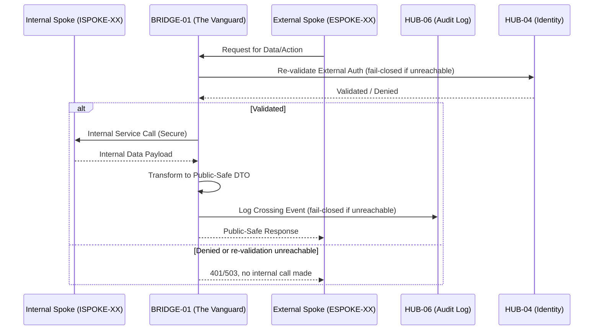

# PHASE BRIDGE-01: The Handoff Bridge

## Tier
Bridge (Architectural Enforcement Layer)

## Resolves
`00_CRITIQUE.md` Finding 3 (the Core dependency citation is corrected from `CORE-09` to `CORE-16`)
and the Bridge single-point-of-failure weakness already identified in
`docs/evaluation/SOLUTIONS_TO_WEAKNESSES.md` (External Spokes, Weakness 1) but never merged into this
file until now — per Governance Rule 5 in `01_MASTER_INDEX.md`, that merge happens here.

## Component Name
Sovereign Bridge (The "Vanguard")

## Description
BRIDGE-01 is not an application; it is the formal architectural contract and enforcement layer
governing all communication between the Internal Spoke sub-tier and the External Spoke sub-tier. It
guarantees that no internal implementation detail, staff-only service, or raw internal data structure
is ever exposed to the public-facing ecosystem.

## Build Status
🔴 **Blocked**, transitively, on the full Core tier and on `HUB-04`, `HUB-06`, `HUB-08`, `HUB-15`,
`HUB-16` (all Hub-tier, none yet implemented per `01_MASTER_INDEX.md` §2/§4). Design work and interface
contracts (this document) can and should proceed ahead of that — implementation cannot.

## Dependency Status — corrected

### Direct Hub Dependencies
- `HUB-08`: API Gateway & Public Surface
- `HUB-15`: Health Check & Service Discovery
- `HUB-16`: Hub-level Orchestration Hooks
- `HUB-06`: Audit Log & Activity Tracker
- `HUB-04`: Global Identity & Authentication

### Transitive Core Dependencies — **corrected**
- `CORE-01`: Polyrepo Orchestrator (Enforcement Logic — release gating on Bridge test suite)
- `CORE-18`: Core Kernel & Lifecycle
- ~~`CORE-09`: Cryptography & Hashing~~ → **`CORE-16`: Binary Encryption Envelope (Payload
  Verification)**. `CORE-09` is the PSR-3 Logging Service; it has no role in payload verification.
  This was a live citation bug in the previously-approved version of this document (Finding 3) —
  logging is *also* relevant here (every crossing event is audited via `HUB-06`, which itself depends
  on `CORE-09`), but as a downstream Hub dependency, not a direct Bridge-to-Core one.
- `CORE-06`: Attribute-Based Router (Gateway Routing)

## Sequencing Rationale
Acts as the transition point between the completed Internal Spoke sub-tier and the upcoming External
Spoke sub-tier. Must be established — and its own test suite must be green — before any External Spoke
is built, so boundary compliance exists from the first day an external-facing endpoint does.

## Architectural Design: The Strict Boundary Policy

The Bridge enforces a default-deny posture for all cross-tier interactions.

### 1. Data Transformation Rule
No Internal Spoke service or database contract may be directly exposed. All data crossing from
Internal to External is transformed into a "Public-Safe" DTO at the Bridge — never passed through.

### 2. Authentication Re-validation
Any authentication context established in the Internal sub-tier is re-validated at the Bridge before
being honored externally. Internal "Staff" sessions carry zero authority in the External tier.

### 3. Audit Mandate
Every crossing event, payload, or service call is logged through `HUB-06` with a "Tier-Crossing"
metadata flag.

### 4. Permitted Contract Allowlist
The Bridge maintains a strict registry of permitted crossing contracts. Unlisted interactions are
blocked and surfaced as "Critical Violations" via `HUB-15`.

### 5. Availability & Failover (new — closes the SPOF weakness)
Because every External Spoke request that touches internal data must pass through the Bridge, a single
Bridge instance is a hard availability ceiling for the entire public surface. This blueprint now
specifies:
- **Statelessness by construction:** the Bridge holds no in-process session or contract-registry state
  that isn't reloadable from `HUB-01` (config) and `HUB-04` (identity) on cold start — this is what
  makes horizontal scaling behind `HUB-08`'s gateway possible at all, rather than a later retrofit.
- **N+1 deployment minimum:** at least two Bridge instances behind the `HUB-08` gateway's load
  balancing, in different failure domains (see `DEPLOY-03` in `01_MASTER_INDEX.md` §6).
- **Fail-closed, not fail-open:** if a Bridge instance cannot reach `HUB-04` (identity re-validation)
  or `HUB-06` (audit log) within a defined timeout, it must return `503`, not silently skip
  re-validation or logging and let the request through. A Bridge that degrades to "no security check"
  under load is worse than one that's simply down.
- **Circuit breaker on the Internal call leg:** if Internal Spoke services are unhealthy, the Bridge
  should fail the *External*-facing request cleanly (documented error contract) rather than hold
  connections open and cascade the internal outage into new external-facing failures.

### Boundary Flow Diagram



## Interface Contracts

```php
namespace SovereignStack\Bridge\Contracts;

interface BoundaryContractInterface
{
    /** Define a permitted crossing contract. */
    public function registerContract(string $contractId, DTOTransformerInterface $transformer): void;

    /** Enforce the boundary for an incoming request. Fail-closed on dependency unavailability. */
    public function enforce(RequestInterface $request): ResponseInterface;
}

interface DTOTransformerInterface
{
    /** Transform an internal domain object into its public-safe representation. Never pass-through. */
    public function transform(object $internal): array;
}

/** Thrown when enforce() cannot reach HUB-04 or HUB-06 within the configured timeout. */
final class DependencyUnavailableException extends \RuntimeException {}
```

## Integration Strategy (Formal Policy)
- **Runtime Enforcement:** `HUB-08` middleware intercepts all cross-tier traffic and routes it through
  the Bridge.
- **Service Discovery:** consumes `HUB-15` to identify legitimate Internal endpoints while hiding them
  from External visibility.
- **Orchestration:** integrated with `HUB-16` to block all boundary-crossing traffic during "Critical
  Maintenance" windows.
- **Reporting:** any attempted boundary violation (e.g., a direct DB access attempt from an ESPOKE)
  triggers an immediate P0 alert via `HUB-15`.

## Benchmark & Verification Methodology
| Target | Method |
|---|---|
| No PHP class in `SovereignStack\External` imports any class from `SovereignStack\Internal` | Static analysis rule (PHPStan custom rule or a dedicated `composer check:boundary` script scanning `use` statements) run in CI on every PR touching either namespace. |
| DTO transformation + audit logging latency budget | Measure on a reference environment (state PHP version, opcache status, and whether `HUB-06`'s write is sync or queued) before citing a millisecond figure — do not restate "no more than 2ms" until this is actually measured; the original figure was asserted with no method attached (Finding 10). |
| Unregistered contract calls are rejected quickly and safely | Integration test: call `enforce()` with an unregistered `contractId`; assert `403` and assert no Internal Spoke call was attempted (verifiable via a call-count assertion on a mocked Internal client). |
| Fail-closed behavior under dependency outage | Integration test: mock `HUB-04` and `HUB-06` clients to throw/timeout; assert `enforce()` returns `503` (or a documented equivalent) and makes no Internal Spoke call. |

## CI Verification Criteria
- Zero-Exposure Test (static analysis, as above) — blocking on every PR.
- Fail-closed test (as above) — blocking; this is the test that operationalizes §5 above and turns
  "no single point of failure" from a design intent into a checked property.
- Transformation latency — measured and documented per the Benchmark table, not asserted.
- Violation response — `403` for unregistered contracts, tested against both a valid and a
  deliberately-malformed `contractId`.

## SemVer Impact
**Major.** Establishes the foundational security and architectural integrity of the entire platform's
public interface. Any change to the fail-closed behavior in §5 is itself a major-impact change and
must be called out explicitly in the changelog, since it directly affects the platform's security
posture under partial outage — a class of change easy to under-classify as "ops config" rather than
"architecture."
