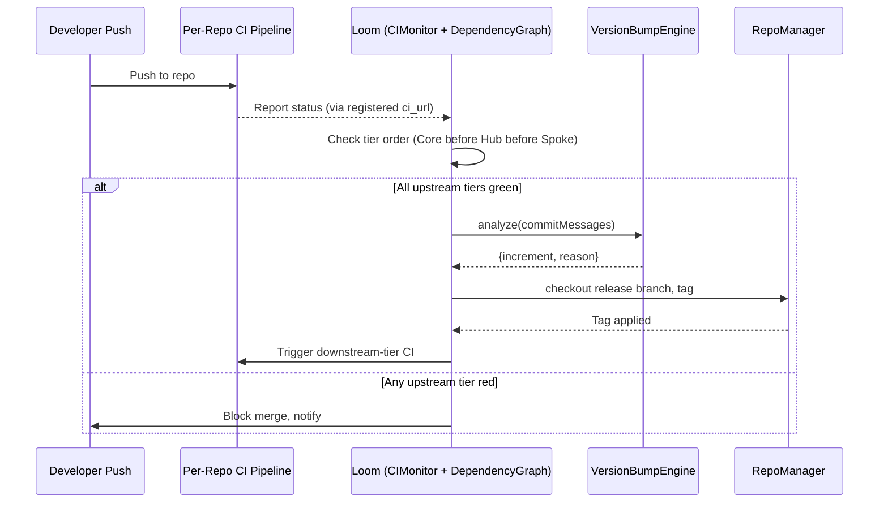

# PHASE CORE-01: Polyrepo Orchestrator ("The Loom")

## Tier
Core (Foundational Infrastructure)

## Resolves
`00_CRITIQUE.md` Finding 2 (evaluation/ranking docs described this ID as "Bootstrapper & Kernel";
this blueprint is now the single authoritative description, matching the real `orchestrator/` code)
and Finding 10 (performance targets now carry a stated benchmark method).

## Component Name
Polyrepo Orchestrator ("The Loom") — `SovereignStack\Orchestrator`

## Description
Loom is the release-automation tool for the Sovereign Stack polyrepo. It does **not** run inside the
application at request time — it is a standalone CLI, invoked by the CI pipeline, that:
1. Clones/checks out every registered repo in the stack.
2. Polls each repo's CI status.
3. Computes the correct SemVer bump per repo from Conventional Commit history.
4. Enforces tier ordering (Core must be green before Hub; Hub before Spoke) before allowing a tagged
   release to propagate downstream.

This is a real, implemented component — see `orchestrator/src/*.php` and `orchestrator/tests/*.php` in
the repository. This blueprint describes the *contract* those classes already satisfy, and the gaps
still open against that contract.

## Dependency Status
- **Upward:** none — this is the root of the tier-ordering system it enforces.
- **Downward:** every other repo in the stack registers with `CIMonitor` and `DependencyGraph`.
- **Runtime dependency:** none (Loom is a build-time/release-time tool, never loaded by a running
  Hub/Spoke process).

## Architectural Design

### Class Map (as implemented)

| Class | Responsibility |
|---|---|
| `RepoManager` | Git operations (`clone`, `checkout`) via `czproject/git-php`, scoped to a working directory (defaults to `sys_get_temp_dir() . '/loom'`). |
| `CIMonitor` | Registers repos (`name`, `ci_url`, `ci_token`) and polls CI status via a PSR-18 HTTP client (auto-discovered through `php-http/discovery`; falls back to local execution if none is found). |
| `DependencyGraph` | A tiered DAG. Nodes are tagged `core` \| `hub` \| `spoke` (`TIER_ORDER = [core: 0, hub: 1, spoke: 2]`); edges are explicit dependencies added via `addDependency($node, $dependsOn)`. |
| `VersionBumpEngine` | Parses Conventional Commit messages, skips merge commits, and classifies each as breaking / feature / patch to compute the correct SemVer increment, including a `BREAKING CHANGE:` footer scan independent of the commit-type breaking marker (`!`). |

### Tier-Enforcement Contract

`DependencyGraph` must reject any edge that violates `TIER_ORDER` — a `core`-tier node may not declare
a dependency on a `hub` or `spoke` node. This is the mechanism that makes "Core must pass before Hub"
(the design goal from the original blueprint draft) an enforced invariant rather than a convention:

```php
namespace SovereignStack\Orchestrator;

interface TierAwareGraphInterface
{
    /**
     * @throws \RuntimeException if $tier is not one of core|hub|spoke
     */
    public function addNode(string $name, string $tier): void;

    /**
     * @throws \RuntimeException if this would create a lower-tier node depending on a higher tier,
     *         or a cycle.
     */
    public function addDependency(string $node, string $dependsOn): void;

    /** @return array<int, string> topologically sorted build order */
    public function resolveBuildOrder(): array;
}
```

**Gap against the current implementation:** the reference code enforces valid tier *names* but the
cycle-detection and cross-tier-violation checks in `addDependency` should be confirmed against
`orchestrator/tests/DependencyGraphTest.php` before this contract is considered closed — if those two
checks aren't covered by an existing test case, add them (see Verification Criteria below).

### Release Flow



## Integration Strategy
- Loom is invoked via `orchestrator/bin/loom` (or `orchestrator/ci/run.php` in CI context) — it is not
  a service any Hub/Spoke process talks to at runtime.
- Every repo added to the polyrepo (Core, Hub, Spoke) must call `CIMonitor::registerRepo()` and
  `DependencyGraph::addNode()` as part of its own onboarding checklist — this is a manual step today;
  automating repo self-registration is tracked as a follow-up (see Governance Rule 1 in
  `01_MASTER_INDEX.md` — any such automation must update the index's tier table in the same commit).

## Benchmark & Verification Methodology
*(Governance Rule 2: no bare performance claim without a stated method.)*

| Target | Method | Status |
|---|---|---|
| Full dependency-order resolution for 10 registered repos completes in a bounded, sub-second window | Run `orchestrator/tests/DependencyGraphTest.php` under PHPUnit's `--group performance` (add this group if absent) on a reference runner (GitHub Actions `ubuntu-latest`, PHP 8.3, opcache enabled); assert wall-clock via `microtime(true)` deltas, not a hardcoded sleep. | **Not yet measured** — add the benchmark test before citing a number. |
| Tagging never overwrites an existing version | `RepoManagerTest.php` + `VersionBumpEngineTest.php` — assert an exception is thrown on a duplicate tag attempt against a fixture repo. | Covered by existing test suite (verify assertion exists; extend if not). |
| Merge gate fails if any Core-tier CI check is red | Integration test against a stubbed `ClientInterface` (PSR-18 mock) returning a failing status for a `core`-tier repo; assert `DependencyGraph::resolveBuildOrder()` (or the CI-gating call site) refuses to proceed. | **Add if missing** — confirm coverage in `CIMonitorTest.php`. |

Until the "Not yet measured" row is closed, this blueprint makes **no** claim about absolute execution
time — a stated, unverified target is worse than no target, since it invites the same failure mode as
Finding 10 in the critique.

## CI Verification Criteria
- `orchestrator/phpunit.xml.dist` suite must pass in full before any tag is cut by Loom itself
  (dogfooding: Loom's own release process runs through the pipeline it enforces for everything else).
- `orchestrator/phpstan.neon` static analysis must pass at the level currently configured — do not
  silently lower the level to make CI green.
- Any change to `TIER_ORDER` or the valid-tier list must be accompanied by an update to
  `01_MASTER_INDEX.md` §2/§4 in the same PR (Governance Rule 1).

## SemVer Impact
**Major**, for the polyrepo automation surface itself. Note: this no longer implies "establishes the
fundamental repository architecture" in the sense of application bootstrapping — that responsibility
belongs to `CORE-18` (Core Kernel & Lifecycle), not to Loom. Conflating the two was the root of the
original "CORE-01 = Kernel" vs. "CORE-01 = Orchestrator" confusion (Finding 4); this blueprint is
scoped strictly to release/repo automation.
