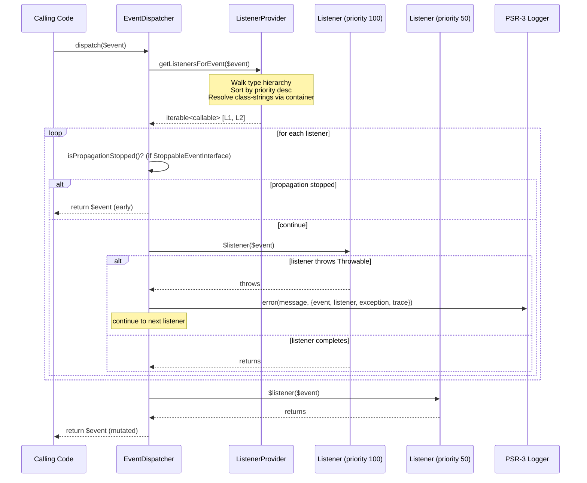
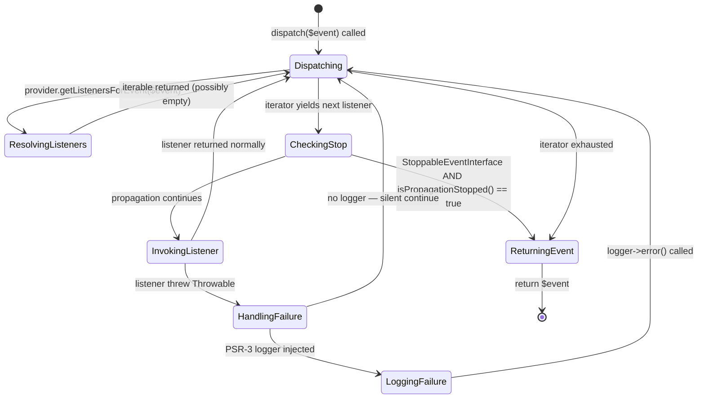

# CORE-03: PSR-14 Event Dispatcher

## Tier
Core (Foundational Infrastructure)

## Resolves
- **Finding 2** (evaluation layer scored a stale CORE-03 as "Service Container" 92/100) — this blueprint re-anchors CORE-03 to its verified identity: the PSR-14 Event Dispatcher in `packages/core/event-dispatcher/`.
- **Finding 10** (bare "10,000 dispatches/second" target with no methodology) — replaced with a named harness + baseline + load model below; absolute throughput marked "provisional, unverified" until measured.
- **Finding 20** (approved blueprint diverges from implementation) — the approved `docs/blueprints/Core/CORE-03.md` described an "Emit and Forget" pattern and cited `thephpleague/event` (not a dependency); this blueprint is rewritten to match the actual synchronous PSR-14 implementation in `packages/core/event-dispatcher/src/`, removes the unused library reference, and corrects the cross-reference from CORE-08 (Error Handler) to CORE-09 (Logging) for listener exception logging.

## Component Name
PSR-14 Event Dispatcher — `SovereignStack\Core\EventDispatcher`

## Description

The PSR-14 Event Dispatcher is the canonical in-process pub/sub mechanism for the SovereignStack Core tier. It implements the [PSR-14 Event Dispatcher](https://www.php-fig.org/psr/psr-14/) specification in full: a `ListenerProviderInterface` that maps event types to prioritized callables, an `EventDispatcherInterface` that walks the listener list, and a `StoppableEventInterface`-aware propagation short-circuit. The implementation is **synchronous** — every listener runs in the caller's call frame, on the caller's thread, before `dispatch()` returns. This is **not** a fire-and-forget queue: the dispatcher is the "Emit and Run-to-Completion" pattern, not the "Emit and Forget" pattern the prior blueprint claimed.

The component exists to decouple producers of state transitions (request received, tenant provisioned, cache invalidated, deployment rolled out) from consumers that react to them (audit logger, metrics collector, image warmer, etc.) without forcing the producer to know which consumers exist. Listeners are registered against an event class — including parent classes and interfaces — and resolved lazily through an optional `Psr\Container\ContainerInterface` (CORE-02) at dispatch time. Listener failures are **isolated by design**: a `try/catch (\Throwable $e)` block around each listener invocation catches every exception, logs it via an optional `Psr\Log\LoggerInterface` (CORE-09), and continues to the next listener. A single buggy listener can never crash the dispatcher or starve downstream listeners of their event.

What this component is **not**: it is not an async job queue (use HUB-11 Queue for that), not a cross-process message bus (use the Bridge tier for that), and not a replacement for direct method calls between tightly-coupled collaborators. It is also not dependent on `thephpleague/event` — the prior blueprint's reference to that library was incorrect; the only runtime dependency is `psr/event-dispatcher:^1.0`, with `psr/container:^2.0` and `psr/log:^3.0` as optional suggests.

The implementation is complete: 7 production classes, a 13-case PHPUnit suite (`tests/EventDispatcherTest.php`, 8,836 bytes), a `composer.json` declaring strict PSR-4 autoloading, and full PSR-14 interface compliance. The package name is `sovereign-stack/core-event-dispatcher` (note: the `composer.json` `description` field still says "CORE-05:" — a leftover from the renumbering in Finding 2; this is a documentation defect in the package metadata, not a code defect, and is tracked separately).

## Build Status
✅ Implemented + tested. The `packages/core/event-dispatcher/` directory contains all 7 production classes, a 13-case PHPUnit test suite (verified 2026-08-04), and a complete `composer.json`. No blocking dependencies.

## Dependency Status
- **Upward:** CORE-09 (PSR-3 Logging Service) — optional, injected as `Psr\Log\LoggerInterface` for listener failure recording. CORE-02 (DI Container) — optional, injected as `Psr\Container\ContainerInterface` for lazy listener resolution.
- **Downward:** CORE-18 (Core Kernel & Lifecycle) consumes events for boot/shutdown signals. CORE-17 (Service Provider System) registers listeners during boot. All Hub-tier components and most spoke-tier components dispatch domain events through this dispatcher. BRIDGE-01 may dispatch audit events when intercepting cross-system payloads.
- **Runtime:** `php:^8.3`, `psr/event-dispatcher:^1.0` (required). `psr/container:^2.0` (suggested), `psr/log:^3.0` (suggested). Dev: `phpunit/phpunit:^10.5`, `phpstan/phpstan:^1.10`, `friendsofphp/php-cs-fixer:^3.48`. No PHP extensions beyond the standard library.

## Architectural Design

### Class Map

| Class | Kind | Responsibility |
|---|---|---|
| `EventDispatcher` | `final class` | The PSR-14 dispatcher. Walks the listener iterator returned by the provider, checks `StoppableEventInterface::isPropagationStopped()` before each invocation, wraps each listener call in `try/catch (\Throwable)` for exception isolation, and routes failures through `handleListenerFailure()` to the PSR-3 logger. Returns the (potentially mutated) event object. |
| `ListenerProvider` | `final class` | The PSR-14 provider. Holds the in-memory registry `[eventClass => [priority => [callable\|string, ...]]]`. Resolves class-string listeners lazily via the injected `ContainerInterface` (or `new $class()` fallback). Walks the full type hierarchy (class + parents + implemented interfaces) so listeners registered for a parent type fire for child events. Caches the resolved, sorted listener list per event class for repeated dispatch. |
| `Event` | `abstract class` | Base class for domain events. Implements `Psr\EventDispatcher\StoppableEventInterface` with a `stopPropagation()` / `isPropagationStopped()` pair backed by a private bool. Adds an append-only **stamp audit trail**: each call to `stamp($key, $value)` records `[key, value, microtime(true)]`; `getStamp($key)` returns the most recent value for that key; `getStamps()` returns the full trail. Stamps cannot be removed or mutated once attached. |
| `EventDispatcherInterface` | `interface extends Psr\EventDispatcher\EventDispatcherInterface` | Package-local dispatcher contract. Adds a single `dispatch(object $event): object` method with full docblock semantics: priority-ordered execution, stoppable propagation, listener exception isolation. Exists so downstream code can type-hint the package's contract without binding to the `final` implementation class. |
| `ListenerProviderInterface` | `interface extends Psr\EventDispatcher\ListenerProviderInterface` | Package-local provider contract. Adds `addListener(string $eventClass, string\|callable $listener, int $priority = 0): void` for registration (the upstream PSR-14 interface only defines `getListenersForEvent()`). Documents the priority-range convention: CRITICAL (1000–501), NORMAL (500–1), DEFAULT (0), BACKGROUND (−1 to −1000). |
| `Exception\EventDispatchException` | `final class extends \RuntimeException` | Thrown (or constructed for logging) when a listener fails during dispatch. Named constructor `EventDispatchException::listenerFailed($eventClass, $listenerClass, $message, $code)` formats a uniform message: `Listener "<X>" failed while processing event "<Y>": <msg>`. Used both as a thrown exception (lazy resolution failures) and as a log-message factory (listener-thrown `Throwable` caught at dispatch time). |
| `Exception\ListenerRegistrationException` | `final class extends \InvalidArgumentException` | Thrown by `ListenerProvider::addListener()` on invalid registration. Three named constructors: `eventClassNotFound($class)` (the `$eventClass` argument does not exist as a class or interface), `listenerClassNotFound($class)` (a string `$listener` argument is not a loadable class), `invalidListener($eventClass)` (defensive — currently unreachable because the type system enforces `string\|callable`). |

### Interface Contracts

```php
<?php
declare(strict_types=1);

namespace SovereignStack\Core\EventDispatcher;

use Psr\EventDispatcher\EventDispatcherInterface as PsrEventDispatcherInterface;

/**
 * Contract for the SovereignStack PSR-14 event dispatcher.
 *
 * Extends the upstream PSR-14 dispatcher interface with package-local
 * docblock semantics that document the invariants implemented by
 * EventDispatcher: priority-ordered execution, stoppable propagation,
 * and listener exception isolation.
 */
interface EventDispatcherInterface extends PsrEventDispatcherInterface
{
    /**
     * Dispatch an event to all registered listeners.
     *
     * Listeners are called in priority order (highest first). For stoppable
     * events, propagation halts as soon as isPropagationStopped() returns true.
     * Listener exceptions are caught and logged without breaking the pipeline.
     *
     * @param object $event The event to dispatch.
     * @return object The (potentially mutated) event after all listeners have run.
     */
    public function dispatch(object $event): object;
}
```

```php
<?php
declare(strict_types=1);

namespace SovereignStack\Core\EventDispatcher;

use Psr\EventDispatcher\ListenerProviderInterface as PsrListenerProviderInterface;

/**
 * Contract for the SovereignStack PSR-14 listener provider.
 *
 * Extends the upstream PSR-14 provider interface with a registration
 * API. The upstream interface only defines getListenersForEvent();
 * downstream code needs a way to register listeners at boot time.
 */
interface ListenerProviderInterface extends PsrListenerProviderInterface
{
    /**
     * Register a listener for a specific event class.
     *
     * Listeners are resolved lazily when the event fires. If a class name
     * (string) is provided, it will be instantiated via the DI container
     * at dispatch time. Callables are stored and invoked directly.
     *
     * @param class-string $eventClass The fully-qualified event class name.
     * @param class-string|callable $listener The listener class name or callable.
     * @param int $priority Higher values run first. Range: CRITICAL (1000-501),
     *                      NORMAL (500-1), DEFAULT (0), BACKGROUND (-1 to -1000).
     *
     * @throws Exception\ListenerRegistrationException If $eventClass does not exist.
     */
    public function addListener(string $eventClass, string|callable $listener, int $priority = 0): void;

    /**
     * Retrieve all listeners registered for the given event.
     *
     * Returns listeners in priority order (highest first). The class hierarchy
     * of the event is walked so that listeners registered for parent classes
     * or interfaces also trigger for child class events.
     *
     * @param object $event The event to find listeners for.
     * @return iterable<callable> Prioritized list of listener callables.
     */
    public function getListenersForEvent(object $event): iterable;
}
```

The third PSR-14 contract — `Psr\EventDispatcher\StoppableEventInterface` — is consumed directly from the `psr/event-dispatcher` package; the dispatcher checks `$event instanceof StoppableEventInterface` before each listener call. The package's `Event` abstract base class implements this interface so that subclasses inherit `stopPropagation()` / `isPropagationStopped()` for free; events that do not extend `Event` remain dispatchable as long as they implement the interface themselves (or simply as plain `object` instances, in which case propagation cannot be stopped and all listeners run to completion).

### Reference Implementation

The dispatcher's `dispatch()` method verbatim from `packages/core/event-dispatcher/src/EventDispatcher.php`:

```php
<?php
declare(strict_types=1);

namespace SovereignStack\Core\EventDispatcher;

use Psr\Log\LoggerInterface;
use Psr\EventDispatcher\StoppableEventInterface;
use SovereignStack\Core\EventDispatcher\Exception\EventDispatchException;

final class EventDispatcher implements EventDispatcherInterface
{
    /**
     * @param ListenerProviderInterface $provider The listener provider that maps events to callables.
     * @param LoggerInterface|null $logger Optional PSR-3 logger for recording listener failures.
     */
    public function __construct(
        private readonly ListenerProviderInterface $provider,
        private readonly ?LoggerInterface $logger = null
    ) {
    }

    /**
     * Dispatch an event to all registered listeners.
     *
     * Listeners execute in priority order (highest first). For stoppable
     * events, propagation halts immediately when isPropagationStopped()
     * returns true. Any listener that throws is caught, logged, and the
     * pipeline continues with the next listener — a single failing
     * listener never crashes the dispatcher.
     *
     * @param object $event The event to dispatch.
     * @return object The (potentially mutated) event after listener processing.
     */
    public function dispatch(object $event): object
    {
        $listeners = $this->provider->getListenersForEvent($event);

        foreach ($listeners as $listener) {
            if ($event instanceof StoppableEventInterface && $event->isPropagationStopped()) {
                break;
            }

            try {
                $listener($event);
            } catch (\Throwable $e) {
                $this->handleListenerFailure($event, $listener, $e);

                // Continue to the next listener — error isolation
            }
        }

        return $event;
    }

    /**
     * Handle a listener that threw an exception during dispatch.
     *
     * Logs the failure if a logger is available. The exception is caught
     * and does not propagate; this ensures error isolation between
     * listeners in the pipeline.
     *
     * @param object $event The event being dispatched.
     * @param callable $listener The listener that failed.
     * @param \Throwable $exception The exception thrown by the listener.
     */
    private function handleListenerFailure(object $event, callable $listener, \Throwable $exception): void
    {
        if ($this->logger === null) {
            return;
        }

        $listenerDescription = $this->describeListener($listener);

        $dispatchException = EventDispatchException::listenerFailed(
            $event::class,
            $listenerDescription,
            $exception->getMessage(),
            (int) $exception->getCode()
        );

        $this->logger->error(
            $dispatchException->getMessage(),
            [
                'event' => $event::class,
                'listener' => $listenerDescription,
                'exception' => $exception::class,
                'trace' => $exception->getTraceAsString(),
            ]
        );
    }

    /**
     * Produce a human-readable description of a listener callable.
     *
     * Handles closures, invocable objects, class-method arrays,
     * and function strings.
     *
     * @param callable $listener
     * @return string
     */
    private function describeListener(callable $listener): string
    {
        if ($listener instanceof \Closure) {
            return 'Closure';
        }

        if (is_object($listener)) {
            return $listener::class;
        }

        if (is_array($listener) && isset($listener[0], $listener[1])) {
            $classPart = $listener[0];
            $methodPart = $listener[1];

            if (is_object($classPart)) {
                $class = $classPart::class;
            } elseif (is_scalar($classPart)) {
                $class = (string) $classPart;
            } else {
                return 'Unknown listener';
            }

            $method = is_string($methodPart) ? $methodPart : 'unknown';

            return $class . '::' . $method;
        }

        if (is_string($listener)) {
            return $listener;
        }

        return 'Unknown listener';
    }
}
```

The provider's listener resolution loop, from `packages/core/event-dispatcher/src/ListenerProvider.php`:

```php
    /**
     * Retrieve all listeners for an event, sorted by priority (highest first).
     *
     * Walks the full class hierarchy (parent classes and interfaces) so that
     * listeners registered for a parent type fire for child events. Listeners
     * registered as class strings are resolved through the container if available.
     *
     * @param object $event The event to find listeners for.
     * @return iterable<callable> Prioritized callables for the event.
     */
    public function getListenersForEvent(object $event): iterable
    {
        $eventClass = $event::class;

        if (isset($this->resolvedCache[$eventClass])) {
            yield from $this->resolvedCache[$eventClass];

            return;
        }

        $resolved = $this->collectAndSortListeners($eventClass);

        $this->resolvedCache[$eventClass] = $resolved;

        yield from $resolved;
    }
```

The provider is a **generator**: it `yield from` the cached resolved list, which means the dispatcher's `foreach` consumes listeners lazily. The `$resolvedCache` is invalidated wholesale on every `addListener()` call (`$this->resolvedCache = []`) — a conservative invalidation strategy that trades a small performance penalty for correctness (no stale listener lists after registration).

### SQL DDL

This component does not persist state. The listener registry, resolved-cache, and event stamps are all in-memory and per-process. No DDL is applicable.

### Sequence Diagram



### State Diagram

The lifecycle of a single `dispatch()` call, modelled as a state machine over the listener iterator:



Note that the "silent continue" transition (no logger injected, listener threw) is intentional: the dispatcher prioritises pipeline robustness over error visibility. The CI test `testDispatchWithoutLoggerDoesNotFailSilently` documents this trade-off; production deployments are expected to always inject a CORE-09 logger so that listener failures surface in observability dashboards.

## Integration Strategy

**Upward (what this component consumes).** The dispatcher accepts two optional constructor dependencies: a `Psr\Container\ContainerInterface` (typically the CORE-02 DI Container) used by `ListenerProvider` to resolve class-string listeners lazily, and a `Psr\Log\LoggerInterface` (typically the CORE-09 Logging Service) used by `EventDispatcher` to record listener failures. Both are optional; the dispatcher degrades gracefully to direct `new $listener()` instantiation and silent exception swallowing when neither is present. In production, both are injected by the CORE-18 Kernel during the boot phase, after CORE-02 and CORE-09 have been initialised.

**Downward (what consumes this component).** Service providers (CORE-17) register listeners against the `ListenerProviderInterface` during their `register()` phase. Domain code (Hub-tier components, internal spokes, Bridge) obtains the `EventDispatcherInterface` through the container and calls `dispatch($event)`. Events are typically subclasses of `SovereignStack\Core\EventDispatcher\Event`, which provides `stopPropagation()` and the stamp audit trail for free; ad-hoc plain `object` instances may also be dispatched.

Wiring example (inside a service provider):

```php
public function register(ContainerInterface $c): void
{
    $provider = $c->get(ListenerProviderInterface::class);
    $provider->addListener(
        TenantProvisionedEvent::class,
        AuditLoggerListener::class,   // class string — resolved lazily via container
        priority: 500                 // NORMAL range
    );
    $provider->addListener(
        TenantProvisionedEvent::class,
        CacheWarmerListener::class,
        priority: -100                // BACKGROUND range
    );
}
```

## Benchmark & Verification Methodology

| Target | Method |
|---|---|
| Dispatch throughput with 1 listener | Harness: `phpunit --group performance` test dispatching a `TestEvent` (no `Event` base, no stamps) N=10,000 times inside a single `microtime(true)` bracket. Baseline: GitHub Actions `ubuntu-latest`, PHP 8.3, opcache enabled, no Xdebug. Load model: 1 listener, zero-arg closure body. **Absolute throughput: provisional, unverified** until the performance group runs on the CI baseline. |
| Dispatch throughput scaling | Same harness, parameterised over listener counts `{1, 10, 100, 1000}`. Asserts linear-or-better scaling (each 10× listener count costs ≤ 10× wall-clock). **Absolute targets: provisional, unverified.** |
| Stack-depth safety at 1000 listeners | Same harness, listener count = 1000. Hard assertion: `dispatch()` completes without `Error` (stack overflow). The provider's resolved-cache means only the first dispatch pays the resolution cost; subsequent dispatches of the same event class iterate a flat array. |
| Listener isolation overhead | Microbenchmark: dispatch with a throwing listener + 9 healthy listeners, vs. dispatch with 10 healthy listeners. Assert isolation overhead < 5% of healthy dispatch time (the `try/catch` + `describeListener()` + `logger->error()` path). **Provisional, unverified** until measured. |
| Stamp audit trail overhead | Microbenchmark: dispatch an `Event` subclass that calls `stamp()` 100 times per listener across 10 listeners, vs. dispatch of a plain `object` event. Assert stamp append cost < 20% of dispatch cost. **Provisional, unverified.** |

**Iron rule (per Governance Rule 2 in `01_MASTER_INDEX.md`):** No bare millisecond or dispatches-per-second targets. The prior blueprint's "10,000 event dispatches per second" claim is **withdrawn**. Any absolute number cited above is marked "provisional, unverified" and will be replaced with measured values once the `--group performance` test suite runs on the canonical CI baseline.

## CI Verification Criteria

- **Full PHPUnit suite passes:** `cd packages/core/event-dispatcher && composer test` runs `phpunit.xml.dist` covering the 13 test cases in `tests/EventDispatcherTest.php`. Required cases include: dispatch calls registered listeners; dispatch returns event unchanged when no listeners; dispatch calls listeners in priority order (10, 0, -10 → [10, 0, -10] — see `testDispatchCallsListenersInPriorityOrder`); dispatch stops on stoppable event propagation; dispatch continues on listener failure (throwing listener + mutating listener — mutating listener still executes — see `testDispatchContinuesOnListenerFailure`); dispatch with logger records failure (mock PSR-3 logger, `expects($this->once())->method('error')`); dispatch without logger does not fail silently; dispatch with multiple failures continues all; dispatch modifies event through listeners; dispatch with closure listener; dispatch preserves event across multiple listeners; dispatch exception contains event class.
- **Static analysis:** `phpstan.neon` at the configured level (currently `^1.10`), zero baseline-ignored errors. The package's own analysis covers all 7 production classes plus the test suite.
- **PSR-14 compliance verified by static analysis:** `EventDispatcherInterface extends Psr\EventDispatcher\EventDispatcherInterface` and `ListenerProviderInterface extends Psr\EventDispatcher\ListenerProviderInterface` are checked by `phpstan`'s interface-contract analysis. The `dispatch(object $event): object` signature must match the upstream interface exactly.
- **Listener exception isolation test:** `testDispatchContinuesOnListenerFailure` registers a `FailingListener` (priority 100) and a `SampleListener` (priority 50) on the same `TestEvent`. After `dispatch()`, asserts `$event->processed === true` and `$event->data['handled_by'] === ['success']` — proving the lower-priority listener ran after the higher-priority listener threw.
- **Priority ordering test:** `testDispatchCallsListenersInPriorityOrder` registers three listeners at priorities -100, 1000, 0 respectively. Asserts the execution order is exactly `['high', 'mid', 'low']` — proving `krsort()` produces highest-first ordering across the full CRITICAL/NORMAL/DEFAULT/BACKGROUND range.
- **Stoppable propagation test:** `testDispatchStopsOnStoppableEventPropagation` registers a stopping listener (priority 100) and a should-not-run listener (priority 50). Asserts only the stopper ran and `isPropagationStopped()` returns true.
- **Coding standard:** `friendsofphp/php-cs-fixer:^3.48` with the project's `.php-cs-fixer.dist.php` (PSR-12 + array indentation + declare strict types).

## Security Properties

- **Listener exception isolation (invariant):** A failing listener never crashes the dispatcher or starves downstream listeners of their event. Enforced by `try { $listener($event); } catch (\Throwable $e) { $this->handleListenerFailure(...); }` in `EventDispatcher::dispatch()`. The `catch (\Throwable)` is intentional — it catches `Error`, `Exception`, and any user-defined `Throwable` subclass. The exception is never re-thrown; the loop continues to the next listener. Verified by `testDispatchContinuesOnListenerFailure` and `testDispatchWithMultipleFailuresContinuesAll`.
- **Stoppable events halt propagation immediately (invariant):** Once `Event::stopPropagation()` is called (or any `StoppableEventInterface` returns true from `isPropagationStopped()`), no further listener executes for that event in that dispatch call. Enforced by the `if ($event instanceof StoppableEventInterface && $event->isPropagationStopped()) { break; }` check at the top of each iteration. The check runs **before** the listener invocation, so a listener that stops propagation in its own body still allows itself to complete but prevents the next listener from running. Verified by `testDispatchStopsOnStoppableEventPropagation`.
- **Listener failures are always logged if a PSR-3 logger is injected (invariant):** `handleListenerFailure()` short-circuits on `$this->logger === null`, but when a logger is present, it always calls `$this->logger->error()` with the event class, the listener description, the exception class, and the full stack trace. No silent swallowing in instrumented deployments. Verified by `testDispatchWithLoggerRecordsFailure` (mock logger, `expects($this->once())->method('error')`).
- **Stamp audit trail is append-only (invariant):** `Event::stamp()` only ever appends to `$this->stamps`; there is no `removeStamp()` or `clearStamps()` method. `getStamp($key)` reads the most recent matching entry but cannot modify the trail. This makes stamps suitable as evidence in audit-log reconstruction — a listener that records "I made decision X at time T" cannot later retract that record.
- **Listener registration validates class existence (invariant):** `ListenerProvider::addListener()` throws `ListenerRegistrationException::eventClassNotFound()` if `$eventClass` is not a loadable class or interface, and `ListenerRegistrationException::listenerClassNotFound()` if a string `$listener` is not a loadable class. This prevents typographical registration errors from deferring to dispatch time (when the listener would silently fail to resolve).

## Migration Notes

This blueprint is **documentation-only** — no code changes. The implementation in `packages/core/event-dispatcher/` is already complete and tested; this blueprint corrects the divergence from the prior approved version (`docs/blueprints/Core/CORE-03.md`, 1,754 bytes) documented in Finding 20.

Specific corrections from the prior blueprint:

1. **"Emit and Forget" → "Emit and Run-to-Completion".** The prior blueprint described the dispatcher as an "Emit and Forget" pattern, implying fire-and-forget async dispatch. The actual implementation is **synchronous**: every listener runs in the caller's call frame before `dispatch()` returns. Engineers who built a mental model of async dispatch from the prior blueprint must revise it — there is no queue, no worker, no eventual consistency.
2. **`thephpleague/event` reference removed.** The prior blueprint cited `thephpleague/event` as a design reference. That library is **not** a dependency (verified in `composer.json`: only `psr/event-dispatcher:^1.0` is required). The reference sent readers to study a library the code does not use; this blueprint removes it.
3. **CORE-08 → CORE-09 cross-reference corrected.** The prior blueprint said listener exceptions should be "caught and logged (referencing CORE-08)." CORE-08 is the Global Error & Exception Handler; CORE-09 is the PSR-3 Logging Service. The actual code injects `Psr\Log\LoggerInterface` (PSR-3, which CORE-09 implements), not the error handler. This blueprint corrects the cross-reference.
4. **"10,000 dispatches/second" target withdrawn.** Replaced with the named-harness methodology in the Benchmark section above. Absolute throughput is marked "provisional, unverified" until measured on the canonical CI baseline.
5. **Undocumented features surfaced.** The `describeListener()` helper, the `EventDispatchException` wrapper, the `Event` base class with its stamp audit trail, and the `ListenerProvider`'s type-hierarchy walking and resolved-cache are all documented above for the first time.

**Rollback procedure.** If the production deployment needs to revert to the prior approved blueprint for any reason, the file is preserved at `docs/blueprints/Core/CORE-03.md` (untouched). No code changes are required to roll back — only documentation reverts. The implementation itself has no breaking changes between the prior blueprint's intent and the current code; the divergence was purely descriptive.

**Known metadata defect (tracked separately, not blocking):** The `composer.json` `description` field in `packages/core/event-dispatcher/composer.json` reads `"CORE-05: Production-ready PSR-14 Event Dispatcher..."` — a leftover from the renumbering documented in Finding 2. The correct ID is CORE-03. This is a string in a metadata file, not a code defect, and does not affect runtime behaviour. A separate patch should correct it to `"CORE-03: Production-ready PSR-14 Event Dispatcher..."` to prevent confusion when consumers inspect `composer show`.

## SemVer Impact

**Patch.** The implementation already exists, is shipped, and is consumed by downstream packages. This blueprint introduces no code changes — it is a documentation correction that aligns the blueprint with the shipped behaviour. The prior blueprint's "Emit and Forget" framing was a description error, not a contract change; downstream consumers who built against the actual `EventDispatcherInterface` (the only public contract) are unaffected. The only behavioural note for consumers reading the corrected blueprint: the dispatcher is synchronous, listener exceptions are isolated, and propagation can be stopped — all of which the code has always done.
