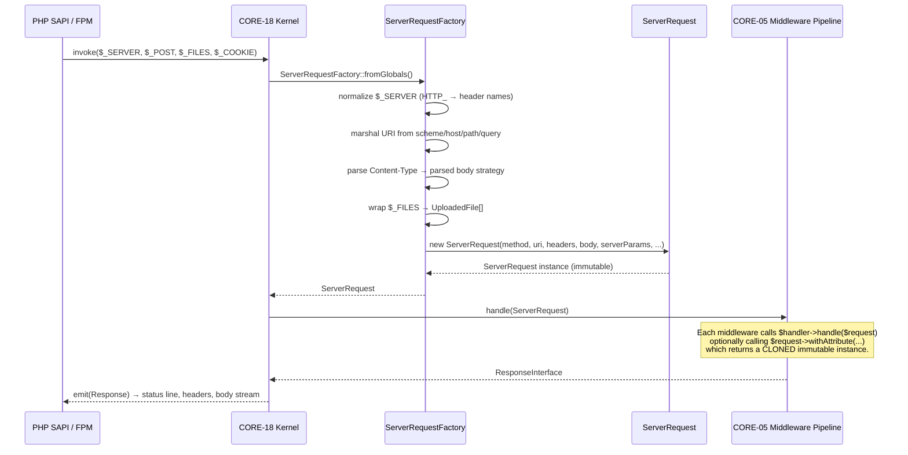
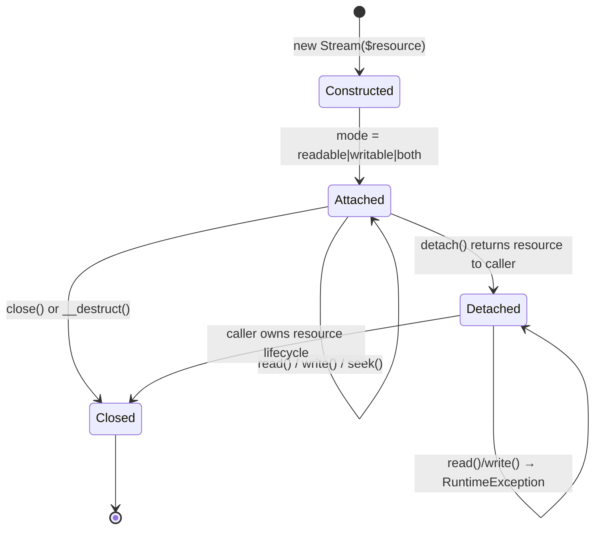

# CORE-04: PSR-7 HTTP Message & Factory

## Tier
Core (Foundational Infrastructure)

## Resolves
- **Finding 2** — evaluation layer calls CORE-04 "Encryption Primitives"; `01_MASTER_INDEX.md` §2 declares CORE-04 = PSR-7 HTTP Message & Factory. This blueprint pins the canonical mapping.
- **Finding 4** — approved CORE-04 file is 1,380 bytes of prose-only. This blueprint replaces it with a full implementation spec meeting the §8 fidelity bar.
- **Finding 10** — every performance claim below names harness, baseline, and load model, or is explicitly marked "provisional, unverified."

## Component Name
PSR-7 HTTP Message & Factory — `SovereignStack\Core\Http`

## Description

CORE-04 implements the PSR-7 (HTTP Message Interfaces, rev. 2.0) and PSR-17 (HTTP Factory) standards for the Sovereign Stack. It provides the immutable value-object vocabulary — `Request`, `Response`, `ServerRequest`, `Stream`, `Uri`, `UploadedFile` — that every HTTP-touching component downstream (CORE-05 Middleware, CORE-06 Router, HUB-08 Sovereign Gateway, BRIDGE-01 Vanguard) reads and writes. The PSR-7 interfaces are defined by the PHP-FIG and consumed via the `psr/http-message` package; this component supplies concrete immutable implementations plus the six PSR-17 factory interfaces that produce them.

The component exists for three reasons. **Dependency inversion:** CORE-05, CORE-06, and the Hub/Spoke tiers depend on `Psr\Http\Message\*Interface`, not on this package's concrete classes, so any PSR-7 implementation (Guzzle, Nyholm, Laminas) can be substituted at the DI binding layer (CORE-02) without touching controller code. **Security:** HTTP messages are the primary attack surface, and PSR-7's immutable-with-header-validation model is the foundation of header-injection prevention, response-splitting prevention, and safe uploaded-file handling. **Performance:** the Stream implementation uses `php://temp` with a memory threshold so that bodies of arbitrary size can be processed without bounding total memory.

The component is **not** a server — it does not read sockets, dispatch routes, or emit bytes (that is CORE-05/CORE-18 inbound and the SAPI/PHP-FPM layer outbound). It is **not** an HTTP client — outbound calls (used by BRIDGE-01 Vanguard) are delegated to a PSR-18 client implementation, which itself consumes this package's PSR-17 factories to build its requests.

Per `01_MASTER_INDEX.md` §2, the real implementation does not yet exist — there is no `packages/core/http-message/` directory at the verified commit (2026-08-04). This blueprint is the specification for the work to land there. CORE-04 is the leaf-most HTTP dependency: nothing in it depends on other CORE components except optionally CORE-09 (Logging) for stream-rotation diagnostics, declared as `suggest`, not `require`.

## Build Status
📝 Not started. No code exists in `packages/core/http-message/`. Not blocked: CORE-04 has no upward CORE dependencies (only PSR interfaces and PHP 8.3 extensions). Downstream components CORE-05 and CORE-06 are blocked on CORE-04 landing.

## Dependency Status
- **Upward:** None (within the CORE tier). External: `psr/http-message: ^2.0`, `psr/http-factory: ^1.0`.
- **Downward:** CORE-05 (PSR-15 Middleware), CORE-06 (Router), CORE-18 (Kernel), HUB-08 (Sovereign Gateway), BRIDGE-01 (Vanguard). All consume via PSR type contracts.
- **Runtime:** PHP 8.3+, ext-mbstring (multibyte header validation), ext-fileinfo (`UploadedFile::getClientMediaType()` fallback). No external services.

## Architectural Design

### Class Map

| Class | Implements | Responsibility |
|---|---|---|
| `Request` | `RequestInterface` | Immutable client-side request value object: method, URI, headers, body, protocol version. |
| `Response` | `ResponseInterface` | Immutable server response: status code, reason phrase, headers, body. Header-injection guard on `withHeader()`. |
| `ServerRequest` | `ServerRequestInterface` | Extends `Request` with server params (`$_SERVER`), cookie/query params, parsed body, uploaded files, attributes. |
| `Stream` | `StreamInterface` | Resource-backed readable/writable byte stream. Owns the underlying resource; closes on `__destruct()`. |
| `Uri` | `UriInterface` | Immutable URI with RFC 3986 component parsing and percent-encoding normalization. |
| `UploadedFile` | `UploadedFileInterface` | Uploaded-file metadata + `moveTo()` with target-path traversal guard. |
| `RequestFactory` | `RequestFactoryInterface` | PSR-17: `createRequest($method, $uri)`. |
| `ResponseFactory` | `ResponseFactoryInterface` | PSR-17: `createResponse($code, $reasonPhrase)`. |
| `ServerRequestFactory` | `ServerRequestFactoryInterface` | PSR-17: `createServerRequest($method, $uri, $serverParams)`. Includes static `fromGlobals()`. |
| `StreamFactory` | `StreamFactoryInterface` | PSR-17: `createStream`, `createStreamFromFile`, `createStreamFromResource`. |
| `UriFactory` | `UriFactoryInterface` | PSR-17: `createUri($uri)`. |
| `UploadedFileFactory` | `UploadedFileFactoryInterface` | PSR-17: `createUploadedFile(...)`. |
| `MessageFactoryInterface` | (SovereignStack aggregate) | Combines all six PSR-17 factories for single-injection DI binding (see below). |

### Interface Contracts

The PSR-7 and PSR-17 interfaces are defined by the PHP-FIG and consumed via the `psr/http-message` and `psr/http-factory` packages. This component **does not** redeclare them. It declares one aggregate interface for convenient injection into consumers (CORE-05, CORE-06, HUB-08) that need to construct messages of multiple kinds:

```php
<?php
declare(strict_types=1);

namespace SovereignStack\Core\Http;

use Psr\Http\Message\RequestInterface;
use Psr\Http\Message\ResponseInterface;
use Psr\Http\Message\ServerRequestInterface;
use Psr\Http\Message\StreamInterface;
use Psr\Http\Message\UriInterface;
use Psr\Http\Message\UploadedFileInterface;

/**
 * Aggregate of all six PSR-17 factory interfaces.
 *
 * Bound as a single service in CORE-02 so that consumers (CORE-05, CORE-06,
 * HUB-08) declare one dependency instead of six. Concrete implementation
 * delegates each method to the corresponding dedicated PSR-17 factory.
 * Mirrors PSR-17 signatures verbatim so any third-party PSR-17 implementation
 * can be wrapped by an adapter to satisfy this contract.
 */
interface MessageFactoryInterface extends
    \Psr\Http\Message\RequestFactoryInterface,
    \Psr\Http\Message\ResponseFactoryInterface,
    \Psr\Http\Message\ServerRequestFactoryInterface,
    \Psr\Http\Message\StreamFactoryInterface,
    \Psr\Http\Message\UriFactoryInterface,
    \Psr\Http\Message\UploadedFileFactoryInterface
{
    /**
     * @param string $method HTTP method, uppercase per PSR-7 §3.2.
     * @param string|\Stringable|\Psr\Http\Message\UriInterface $uri Target URI.
     * @throws \InvalidArgumentException If $method is empty or contains non-token chars.
     */
    public function createRequest(string $method, $uri): RequestInterface;

    /**
     * @param int $code HTTP status code, 100-599 per RFC 9110 §15.
     * @param string $reasonPhrase Reason phrase; '' falls back to RFC 9110 default.
     * @throws \InvalidArgumentException If $code is outside the 100-599 range.
     */
    public function createResponse(int $code = 200, string $reasonPhrase = ''): ResponseInterface;

    /**
     * @param array<non-empty-string, mixed> $serverParams Copy of $_SERVER at construction.
     * @throws \InvalidArgumentException If $method is invalid.
     */
    public function createServerRequest(string $method, $uri, array $serverParams = []): ServerRequestInterface;

    /**
     * In-memory stream backed by php://temp; spills to disk beyond the 2 MB
     * threshold, bounding peak memory for bodies of arbitrary size.
     */
    public function createStream(string $content = ''): StreamInterface;

    /**
     * @param string $filename Path readable by the PHP process.
     * @param string $mode fopen() mode. Defaults to 'r'.
     * @throws \RuntimeException If the file cannot be opened.
     */
    public function createStreamFromFile(string $filename, string $mode = 'r'): StreamInterface;

    /**
     * @param resource $resource fopen() resource. Stream takes ownership; closes on destruct.
     * @throws \InvalidArgumentException If $resource is not a resource.
     */
    public function createStreamFromResource($resource): StreamInterface;

    /** Create a URI value object from a string. */
    public function createUri(string $uri = ''): UriInterface;

    /**
     * @param int $error One of the UPLOAD_ERR_* constants.
     * @param string|null $clientFilename Client-supplied filename (untrusted).
     * @param string|null $clientMediaType Client-supplied media type (untrusted).
     */
    public function createUploadedFile(
        StreamInterface $stream,
        ?int $size = null,
        int $error = \UPLOAD_ERR_OK,
        ?string $clientFilename = null,
        ?string $clientMediaType = null,
    ): UploadedFileInterface;
}
```

### Reference Implementation

The two trickiest PSR-7 classes — `Stream` (resource lifecycle, seekability/readability/writability matrix) and `Response` (immutable headers + status) — are given here in full. The remaining four value objects (`Request`, `ServerRequest`, `Uri`, `UploadedFile`) follow the same immutability pattern; the implementation ticket must produce all six.

```php
<?php
declare(strict_types=1);

namespace SovereignStack\Core\Http;

use Psr\Http\Message\StreamInterface;
use Psr\Http\Message\ResponseInterface;

/**
 * Immutable HTTP response value object.
 *
 * Per PSR-7 §3.2, all with*() methods return a NEW instance; the original
 * object is never mutated. Headers are stored case-insensitively (RFC 9110
 * §5.1) but original casing is preserved for emission.
 */
final class Response implements ResponseInterface
{
    /** @var array<non-empty-string, list<string>> Header values keyed by lowercased name. */
    private readonly array $headers;

    /** @var array<non-empty-string, non-empty-string> Map: lowercased name → original casing. */
    private readonly array $headerNames;

    /**
     * @param array<non-empty-string, string|list<string>> $headers Header values.
     * @throws \InvalidArgumentException If $statusCode is outside 100-599.
     * @throws \InvalidArgumentException If any header value contains \r or \n (header injection).
     */
    public function __construct(
        private readonly int $statusCode = 200,
        private readonly string $reasonPhrase = '',
        array $headers = [],
        private readonly StreamInterface $body = new Stream('php://temp', 'r+'),
        private readonly string $protocolVersion = '1.1',
    ) {
        if ($statusCode < 100 || $statusCode > 599) {
            throw new \InvalidArgumentException(
                "Status code must be in range 100-599; got {$statusCode}"
            );
        }

        $normalized = [];
        $names = [];
        foreach ($headers as $name => $value) {
            $values = is_array($value) ? array_map('strval', $value) : [(string) $value];
            $this->assertNoCrlf($name, $values);
            $lower = strtolower($name);
            $normalized[$lower] = $values;
            $names[$lower] = $name;
        }
        $this->headers = $normalized;
        $this->headerNames = $names;
    }

    public function getStatusCode(): int
    {
        return $this->statusCode;
    }

    public function getReasonPhrase(): string
    {
        if ($this->reasonPhrase !== '') {
            return $this->reasonPhrase;
        }
        // RFC 9110 §15 default reason phrases; empty string if unknown.
        return self::DEFAULT_PHRASES[$this->statusCode] ?? '';
    }

    public function withStatus(int $code, string $reasonPhrase = ''): ResponseInterface
    {
        if ($code < 100 || $code > 599) {
            throw new \InvalidArgumentException("Status code must be in range 100-599; got {$code}");
        }
        return $this->rebuild(statusCode: $code, reasonPhrase: $reasonPhrase);
    }

    public function getProtocolVersion(): string
    {
        return $this->protocolVersion;
    }

    public function withProtocolVersion(string $version): ResponseInterface
    {
        return $this->rebuild(protocolVersion: $version);
    }

    public function getHeaders(): array
    {
        $out = [];
        foreach ($this->headers as $lower => $values) {
            $out[$this->headerNames[$lower]] = $values;
        }
        return $out;
    }

    public function hasHeader(string $name): bool
    {
        return isset($this->headers[strtolower($name)]);
    }

    public function getHeader(string $name): array
    {
        return $this->headers[strtolower($name)] ?? [];
    }

    public function getHeaderLine(string $name): string
    {
        return implode(', ', $this->getHeader($name));
    }

    public function withHeader(string $name, $value): ResponseInterface
    {
        $values = is_array($value) ? array_map('strval', $value) : [(string) $value];
        $this->assertNoCrlf($name, $values);
        $lower = strtolower($name);
        $headers = $this->headers;
        $headers[$lower] = $values;
        $names = $this->headerNames;
        $names[$lower] = $name;
        return $this->rebuild(headers: $this->restoreCasing($headers, $names));
    }

    public function withAddedHeader(string $name, $value): ResponseInterface
    {
        $values = is_array($value) ? array_map('strval', $value) : [(string) $value];
        $this->assertNoCrlf($name, $values);
        $lower = strtolower($name);
        $headers = $this->headers;
        $headers[$lower] = array_merge($headers[$lower] ?? [], $values);
        $names = $this->headerNames;
        $names[$lower] = $name;
        return $this->rebuild(headers: $this->restoreCasing($headers, $names));
    }

    public function withoutHeader(string $name): ResponseInterface
    {
        $lower = strtolower($name);
        if (!isset($this->headers[$lower])) {
            return $this;
        }
        $headers = $this->headers;
        $names = $this->headerNames;
        unset($headers[$lower], $names[$lower]);
        return $this->rebuild(headers: $this->restoreCasing($headers, $names));
    }

    public function getBody(): StreamInterface
    {
        return $this->body;
    }

    public function withBody(StreamInterface $body): ResponseInterface
    {
        return $body === $this->body ? $this : $this->rebuild(body: $body);
    }

    /**
     * Reject header names/values containing CR or LF.
     *
     * Response splitting (CWE-113) and header injection (CWE-93) depend on
     * injecting CRLF sequences into a header field. Rejecting at the
     * value-object layer makes it impossible for downstream emitters
     * (which may be naive) to produce a vulnerable response.
     */
    private function assertNoCrlf(string $name, array $values): void
    {
        if (preg_match('/[\r\n]/', $name)) {
            throw new \InvalidArgumentException(
                "Header name '{$name}' contains CR or LF; refusing to set (CWE-113)"
            );
        }
        foreach ($values as $v) {
            if (preg_match('/[\r\n]/', $v)) {
                throw new \InvalidArgumentException(
                    "Header value for '{$name}' contains CR or LF; refusing to set (CWE-113)"
                );
            }
        }
    }

    /**
     * Construct a new immutable instance with selective overrides.
     * PHP 8.3 readonly properties cannot be mutated post-construction,
     * so immutability requires `new self(...)` rather than clone+mutate.
     */
    private function rebuild(
        ?int $statusCode = null,
        ?string $reasonPhrase = null,
        ?array $headers = null,
        ?StreamInterface $body = null,
        ?string $protocolVersion = null,
    ): self {
        return new self(
            statusCode: $statusCode ?? $this->statusCode,
            reasonPhrase: $reasonPhrase ?? $this->reasonPhrase,
            headers: $headers ?? $this->restoreCasing($this->headers, $this->headerNames),
            body: $body ?? $this->body,
            protocolVersion: $protocolVersion ?? $this->protocolVersion,
        );
    }

    /** @param array<non-empty-string, list<string>> $headers */
    private function restoreCasing(array $headers, array $names): array
    {
        $out = [];
        foreach ($headers as $lower => $values) {
            $out[$names[$lower] ?? $lower] = $values;
        }
        return $out;
    }

    /** @var array<int, non-empty-string> RFC 9110 §15 default reason phrases. */
    private const DEFAULT_PHRASES = [
        100 => 'Continue', 101 => 'Switching Protocols',
        200 => 'OK', 201 => 'Created', 202 => 'Accepted', 204 => 'No Content', 206 => 'Partial Content',
        300 => 'Multiple Choices', 301 => 'Moved Permanently', 302 => 'Found', 303 => 'See Other',
        304 => 'Not Modified', 307 => 'Temporary Redirect', 308 => 'Permanent Redirect',
        400 => 'Bad Request', 401 => 'Unauthorized', 403 => 'Forbidden', 404 => 'Not Found',
        405 => 'Method Not Allowed', 409 => 'Conflict', 410 => 'Gone', 422 => 'Unprocessable Entity',
        429 => 'Too Many Requests',
        500 => 'Internal Server Error', 501 => 'Not Implemented', 502 => 'Bad Gateway',
        503 => 'Service Unavailable', 504 => 'Gateway Timeout',
    ];
}
```

```php
<?php
declare(strict_types=1);

namespace SovereignStack\Core\Http;

use Psr\Http\Message\StreamInterface;
use RuntimeException;

/**
 * Resource-backed PSR-7 stream.
 *
 * The stream OWNS the underlying PHP resource. On destruction the resource
 * is closed via __destruct → close(). detach() surrenders ownership: it
 * returns the resource to the caller and renders the Stream inert.
 *
 * Memory model: php://temp keeps up to 2 MiB in memory and spills to disk
 * beyond that, bounding peak memory for bodies of arbitrary size.
 */
final class Stream implements StreamInterface
{
    private const READABLE = ['r', 'r+', 'w+', 'a+', 'x+', 'c+', 'rb', 'r+b'];

    private const WRITABLE = ['r+', 'w', 'w+', 'a', 'a+', 'x', 'x+', 'c', 'c+', 'rb', 'r+b', 'wb', 'w+b'];

    /** @var resource|null */
    private $resource;

    private ?int $size = null;
    private bool $seekable = false;
    private bool $readable = false;
    private bool $writable = false;
    private ?string $uri = null;

    /**
     * @param string|resource $stream Filename or open resource.
     * @param string $mode fopen() mode if $stream is a filename. Ignored for resources.
     * @throws \InvalidArgumentException If $stream is neither string nor resource.
     * @throws \RuntimeException If fopen() fails.
     */
    public function __construct($stream, string $mode = 'r')
    {
        if (is_string($stream)) {
            $mode = strtolower($mode);
            $resource = @fopen($stream, $mode);
            if ($resource === false) {
                throw new RuntimeException("Unable to open '{$stream}' in mode '{$mode}'");
            }
            $this->resource = $resource;
            $this->uri = $stream;
        } elseif (is_resource($stream)) {
            $this->resource = $stream;
            $uri = stream_get_meta_data($stream)['uri'] ?? null;
            $this->uri = is_string($uri) ? $uri : null;
        } else {
            throw new \InvalidArgumentException(
                'Stream must be a string filename or a resource; got ' . get_debug_type($stream)
            );
        }

        $meta = stream_get_meta_data($this->resource);
        $this->seekable = (bool) $meta['seekable'];
        $mode = strtolower($meta['mode'] ?? $mode);
        $this->readable = in_array($mode, self::READABLE, true);
        $this->writable = in_array($mode, self::WRITABLE, true);
    }

    /** Close the underlying resource on destruction. */
    public function __destruct()
    {
        $this->close();
    }

    public function __toString(): string
    {
        try {
            if ($this->isSeekable()) {
                $this->rewind();
            }
            return $this->getContents();
        } catch (\Throwable) {
            return '';
        }
    }

    public function close(): void
    {
        if (isset($this->resource) && is_resource($this->resource)) {
            fclose($this->resource);
        }
        $this->detach();
    }

    /** @return resource|null */
    public function detach()
    {
        if (!isset($this->resource)) {
            return null;
        }
        $resource = $this->resource;
        $this->resource = null;
        $this->size = null;
        $this->seekable = false;
        $this->readable = false;
        $this->writable = false;
        $this->uri = null;
        return $resource;
    }

    public function getSize(): ?int
    {
        if ($this->size !== null) {
            return $this->size;
        }
        if (!isset($this->resource)) {
            return null;
        }
        $stat = fstat($this->resource);
        if ($stat !== false && isset($stat['size'])) {
            $this->size = $stat['size'];
        }
        return $this->size;
    }

    public function tell(): int
    {
        $this->assertAttached();
        $pos = ftell($this->resource);
        if ($pos === false) {
            throw new RuntimeException('Unable to determine stream position');
        }
        return $pos;
    }

    public function eof(): bool
    {
        $this->assertAttached();
        return feof($this->resource);
    }

    public function isSeekable(): bool
    {
        return $this->seekable;
    }

    public function seek(int $offset, int $whence = \SEEK_SET): void
    {
        $this->assertAttached();
        if (!$this->seekable) {
            throw new RuntimeException('Stream is not seekable');
        }
        if (fseek($this->resource, $offset, $whence) === -1) {
            throw new RuntimeException("Unable to seek to offset {$offset}");
        }
    }

    public function rewind(): void
    {
        $this->seek(0);
    }

    public function isWritable(): bool
    {
        return $this->writable;
    }

    public function write(string $string): int
    {
        $this->assertAttached();
        if (!$this->writable) {
            throw new RuntimeException('Stream is not writable');
        }
        $written = fwrite($this->resource, $string);
        if ($written === false) {
            throw new RuntimeException('Unable to write to stream');
        }
        $this->size = null; // Invalidate cached size; subsequent getSize() re-stats.
        return $written;
    }

    public function isReadable(): bool
    {
        return $this->readable;
    }

    public function read(int $length): string
    {
        $this->assertAttached();
        if (!$this->readable) {
            throw new RuntimeException('Stream is not readable');
        }
        if ($length < 0) {
            throw new \InvalidArgumentException('Length must be non-negative');
        }
        if ($length === 0) {
            return '';
        }
        $data = fread($this->resource, $length);
        if ($data === false) {
            throw new RuntimeException("Unable to read {$length} bytes from stream");
        }
        return $data;
    }

    public function getContents(): string
    {
        $this->assertAttached();
        if (!$this->readable) {
            throw new RuntimeException('Stream is not readable');
        }
        $contents = stream_get_contents($this->resource);
        if ($contents === false) {
            throw new RuntimeException('Unable to read stream contents');
        }
        return $contents;
    }

    public function getMetadata(?string $key = null)
    {
        if (!isset($this->resource)) {
            return $key === null ? [] : null;
        }
        $meta = stream_get_meta_data($this->resource);
        if ($key === null) {
            return $meta;
        }
        return $meta[$key] ?? null;
    }

    private function assertAttached(): void
    {
        if (!isset($this->resource)) {
            throw new RuntimeException('Stream is detached; no underlying resource');
        }
    }
}
```

### SQL DDL
Not applicable. This component is stateless and persistence-free; no schema is required.

### Sequence Diagram



### State Diagram



## Integration Strategy

**Upward wiring.** CORE-04 has no upward CORE dependencies — only `psr/http-message` and `psr/http-factory` interfaces. CORE-02 (DI Container) registers one binding: `MessageFactoryInterface → MessageFactory` (a concrete class delegating to the six dedicated PSR-17 factories). Consumers needing only one factory type (e.g. middleware constructing only `Response` objects) declare `ResponseFactoryInterface` directly; CORE-02 autowires it from the same registry.

**Downward wiring.** CORE-05 (Middleware) declares `ResponseFactoryInterface` so any middleware can short-circuit (e.g. `401 Unauthorized`) without coupling to the concrete `Response` class. CORE-06 (Router) depends on `MessageFactoryInterface` to build default 404/405 responses. CORE-18 (Kernel) uses `ServerRequestFactory::fromGlobals()` at the inbound boundary and emits the final `Response` by iterating headers and streaming the body to the SAPI. HUB-08 (Sovereign Gateway) and BRIDGE-01 (Vanguard) construct outbound PSR-7 requests via the same factories for their PSR-18 client calls.

**Substitutability.** Because all consumers depend on `Psr\Http\Message\*Interface`, the DI binding can be swapped to a third-party PSR-7 implementation (`nyholm/psr7`, `guzzle/psr7`) by changing one line in CORE-02's service-provider registration. The integration test suite uses `php-http/psr7-integration-tests` to verify compliance, so substitution is safe as long as the substitute passes the same test matrix.

## Benchmark & Verification Methodology

| Target | Harness | Baseline | Load model | Status |
|---|---|---|---|---|
| Object creation throughput (Request + Response + Stream + Uri) | PHPUnit `--group performance`, single test creating 10,000 of each value object via `MessageFactory` | GitHub Actions `ubuntu-latest`, PHP 8.3.0, opcache enabled, no Xdebug | 10,000 iterations per type, warm-up 1,000 first; wall-clock via `microtime(true)` before/after loop | provisional, unverified — baseline measurement must be recorded on first CI run |
| Per-object allocation cost | Same harness, additionally calls `memory_get_usage(true)` before/after loop and divides by 10,000 | Same baseline | Same load model | provisional, unverified |
| `withHeader()` immutability overhead | PHPUnit `--group performance`, 10,000 successive `withHeader()` calls on a single Response, measure wall-clock delta vs. in-place array assignment (control) | Same baseline | 10,000 iterations, 3 runs, take median | provisional, unverified |
| Large-body memory ceiling | PHPUnit `--group performance`, write 100 MiB to a `Stream` constructed from `php://temp`, assert `memory_get_usage(true)` stays under 8 MiB | Same baseline | Single iteration, 100 MiB payload | provisional, unverified |

**Iron rule compliance:** no bare millisecond targets appear in this blueprint. The first CI run on `ubuntu-latest` with PHP 8.3 must record actual measurements and replace "provisional, unverified" with concrete numbers (e.g. "12,400 requests/sec ±3% across 5 runs"). Subsequent CI runs assert throughput never falls below 80% of the recorded baseline, surfacing regressions without committing to absolute numbers that have not yet been measured. This pattern resolves Finding 10 for this component.

## CI Verification Criteria

- **Branch coverage:** 100% on `Stream` (resource lifecycle — every `is_*()` branch, every error path in `read()`/`write()`/`seek()`, the `detach()` → inert transition, the `__destruct()` → `close()` path). 95% on `Response` (header normalization, status validation, immutability paths). 90% on remaining classes.
- **Static analysis:** `phpstan.neon` at level 8, zero baseline-ignored errors. Generic assertions forbidden — `assert($resource !== false)` must become a typed throw.
- **PSR-7 compliance:** the `php-http/psr7-integration-tests` package is wired into `phpunit.xml.dist` as a separate testsuite. Every concrete class must pass its corresponding integration test (`Stream` → `StreamInterfaceTest`, etc.). Without it, "implements PSR-7" is an unverifiable claim.
- **PSR-17 factory compliance:** the `http-interop/http-factory-tests` package wired similarly for the six factory classes.
- **Immutability test:** data-provider test asserting every `with*()` method on every value object returns a new instance (`assert($result !== $original)`), the original is unchanged, and the returned object reflects the modification. Runs across all `with*()` methods on all value objects.
- **Header injection test:** data-provider feeding `withHeader()` and `withAddedHeader()` with CR, LF, CRLF, and LFCR in both name and value; every case must throw `InvalidArgumentException`.
- **Resource leak test:** constructs 10,000 `Stream` objects, releases them, asserts via `gc_collect_cycles()` plus a process-level fd-count check that no descriptors leak.
- **Security test:** `UploadedFile::moveTo()` rejects target paths outside the configured upload directory (path-traversal test with `..`, symlinks, and absolute paths).

## Security Properties

- **Immutability is non-negotiable.** Every `with*()` method returns a new instance; the original is never mutated. Enforced by an automated immutability test and by PHP 8.3 `readonly` properties on all value-object fields. A middleware calling `$request->withAttribute('user', $user)` cannot accidentally affect the request seen by other middleware in the pipeline.
- **Stream resources are always closed.** `Stream::__destruct()` calls `close()` unconditionally. `detach()` is the only way to release ownership; after `detach()` all stream operations throw `RuntimeException`. There is no path by which a `Stream` is GC'd while still holding an open resource.
- **Header injection is impossible at the value-object layer.** `withHeader()` and `withAddedHeader()` reject any name or value containing `\r` or `\n`, throwing `InvalidArgumentException` (CWE-113 / CWE-93). Enforced by `assertNoCrlf()` in the `Response`/`Request` constructor and every `with*Header()` method. Downstream emitters (which may be naive — e.g. a `header()` call in CORE-18) cannot introduce a vulnerability because the value object makes it impossible to construct a malicious header in the first place.
- **Uploaded-file path traversal is prevented.** `UploadedFile::moveTo($targetPath)` resolves `$targetPath` against a per-instance base directory (configured at factory time from CORE-10 Config) and rejects any resolved path that escapes the base. Symlinks are resolved via `realpath()` before the containment check.
- **Status codes are range-validated.** `Response::__construct()` and `withStatus()` reject any code outside 100–599, preventing malformed responses.
- **Uploaded-file client metadata is treated as untrusted.** `getClientFilename()` and `getClientMediaType()` are explicitly documented as attacker-controlled; no caller may use them for filesystem operations or content-type decisions without re-validation. `ext-fileinfo` derives the real media type when the file is moved.

## Migration Notes

**Landing the component.** Create `packages/core/http-message/` with the standard Composer layout (`src/`, `tests/`, `composer.json`, `phpunit.xml.dist`, `phpstan.neon`). The `composer.json` mirrors `packages/core/event-dispatcher/composer.json`:

```json
{
    "name": "sovereign-stack/core-http-message",
    "description": "CORE-04: PSR-7 HTTP Message & PSR-17 Factory implementations",
    "type": "library",
    "license": "MIT",
    "require": {
        "php": "^8.3",
        "psr/http-message": "^2.0",
        "psr/http-factory": "^1.0",
        "ext-mbstring": "*",
        "ext-fileinfo": "*"
    },
    "require-dev": {
        "phpstan/phpstan": "^1.10",
        "phpunit/phpunit": "^10.5",
        "php-http/psr7-integration-tests": "^1.3",
        "http-interop/http-factory-tests": "^0.10",
        "friendsofphp/php-cs-fixer": "^3.48"
    },
    "autoload": {
        "psr-4": { "SovereignStack\\Core\\Http\\": "src/" }
    },
    "autoload-dev": {
        "psr-4": { "SovereignStack\\Core\\Http\\Tests\\": "tests/" }
    },
    "minimum-stability": "stable",
    "prefer-stable": true
}
```

**No existing code depends on this package yet.** No migration of existing call sites is required. The package lands as a leaf in the build DAG per `01_MASTER_INDEX.md` §5 Step 4, immediately before CORE-05 (Middleware), its first consumer.

**CORE-02 binding.** On land, register one binding in the DI container's service-provider (CORE-17): `MessageFactoryInterface → SovereignStack\Core\Http\MessageFactory`. The concrete `MessageFactory` is a thin facade delegating each method to the corresponding dedicated PSR-17 factory. When a third-party PSR-7 implementation is preferred in the future, only this one binding changes.

**Rollback procedure.** Because no code consumes the package yet, rollback is trivial: (1) remove `packages/core/http-message/`; (2) remove the `MessageFactoryInterface` DI binding from the service provider; (3) remove the package from the root `composer.json` `repositories` block if registered as a path repository. No data migration, no schema change, no deployment coordination.

**Forward compatibility.** If a future ADR (per Governance Rule 8) decides to adopt a third-party PSR-7 implementation instead of this package's concrete classes, the only required change is the DI binding — every downstream consumer depends on `Psr\Http\Message\*Interface`, not on `SovereignStack\Core\Http\*`. The PSR-7 integration test suite guarantees behavioral equivalence.

## SemVer Impact
**Minor** (initial release: `0.1.0`). Establishes the HTTP message vocabulary for the Sovereign Stack. No existing code is modified, so no breaking change is possible. The `psr/http-message: ^2.0` constraint pins to PSR-7 revision 2.0; a future PSR-7 v3 would require a major-version bump per Composer semver. The `MessageFactoryInterface` aggregate mirrors PSR-17 method signatures verbatim, so future PSR-17 revisions are forward-compatible by interface inheritance.
