# CORE-07: SuperPHP Lexer

## Tier
Core (Template Engine — Stage 1 of 3)

## Resolves
- **Finding 2** — `docs/evaluation/BLUEPRINT_RANKINGS.md` line 47 scores CORE-07 as "Middleware Pipeline" (90/100). Wrong: the canonical mapping per `01_MASTER_INDEX.md` §2 is **SuperPHP Lexer** (middleware is CORE-05). This blueprint is written to the canonical mapping and explicitly rejects the stale evaluation-layer name. The build sequence row in `01_MASTER_INDEX.md` §5 (Step 6: CORE-07 → CORE-11 → CORE-12) confirms SuperPHP Lexer is the first stage of the template engine triplet.
- **Finding 4** — The approved `docs/blueprints/Core/CORE-07.md` is 1,554 bytes of prose with a single Mermaid `graph LR`, no `LexerInterface`, no `Token` value object, no state machine, no benchmark methodology, no security properties. This blueprint replaces it with real PHP 8.3 interface contracts, a complete character-by-character `Lexer::tokenize()` reference implementation backed by an explicit DFA, two Mermaid diagrams, a named-harness benchmark methodology, and four explicit security invariants.
- **Finding 10** — The approved file asserts "Must lex 1MB of template source in < 10ms" with no harness, baseline, or load model. This blueprint replaces that bare-millisecond target with a PHPUnit `--group performance` methodology on GitHub Actions `ubuntu-latest` / PHP 8.3 / opcache against templates of 100 B / 1 KB / 10 KB / 100 KB / 1 MB, with all absolute throughput numbers marked **"provisional, unverified"** and only the O(n) scaling assertion measured on first run.

## Component Name
SuperPHP Lexer — `SovereignStack\Core\SuperPHP\Lexer` (PSR-4: `packages/core/superphp-lexer/src/`).

## Description

CORE-07 is the first stage of the SuperPHP template engine: a single-pass, character-by-character lexer that consumes the raw text of a `.super.php` source file and emits an ordered `TokenStream` consumed by CORE-11 (SuperPHP Parser). The lexer does **not** parse syntax — it has no notion of "balanced tags" or "valid expression" — it only recognises lexical atoms (text runs, the `@{` / `}@` tag delimiters, variables, string literals, integers, floats, pipes, parentheses, brackets, commas, colons, arrows, and keywords) and tags each atom with its source position (line, column). Every later stage operates on tokens, never on raw source text; this is what makes error reporting in CORE-11 and CORE-12 precise (the parser can blame an exact line/column rather than a substring) and what makes the compiled output of CORE-12 deterministic (the same source file always produces the same token stream; whitespace inside `Text` runs is preserved verbatim).

The lexer is a **deterministic finite automaton (DFA) with four states**: `Text` (default — accumulating raw HTML / template prose), `Expression` (inside `@{ ... }@` — emitting structured tokens), `String` (inside `"..."` / `'...'` — emitting a single `String` token whose body may include `@{` / `}@` as literal characters), and `Comment` (inside `// ...` until the next newline or `}@`). The state machine is driven by direct character inspection — `if ($char === '@' && $next === '{')` — rather than by `preg_match`, because (a) regex-based lexers cannot easily report accurate line/column on failure without a separate offset-accounting pass, and (b) character-by-character inspection is invulnerable to PCRE catastrophic backtracking on adversarial input (see Security Properties). The reference implementation is pure PHP 8.3 with only `ext-mbstring` for UTF-8 codepoint alignment; performance is O(n) in source length.

What CORE-07 is **not**: not the parser (CORE-11 builds the AST; the lexer has no notion of nesting depth, directive arity, or scope), not the compiler (CORE-12 turns ASTs into PHP; the lexer never emits a line of PHP), and not a template engine in its own right (a `TokenStream` is not executable). It is also **not** a Blade-style preprocessor — no string substitution, no `@verbatim` block, no `@stack` / `@push` machinery. The lexer's output is a pure, immutable data structure that downstream stages consume.

## Build Status
📝 **Not started.** No upstream Core-tier blockers: the lexer depends only on PHP 8.3 and `ext-mbstring`, both already available in the runtime baseline declared by ADR-010. CORE-07 is the first stage of the SuperPHP triplet (CORE-07 → CORE-11 → CORE-12 per `01_MASTER_INDEX.md` §5 Step 6); it must land before CORE-11 can compile, but is otherwise independent of the HTTP / Kernel / Container pipeline and can be built in parallel with CORE-04 / 05 / 06.

## Dependency Status

- **Upward:** PHP 8.3 (for `readonly` classes, backed enums, `mb_substr`); `ext-mbstring` (for UTF-8 byte/character index alignment in error positions). No Core-tier dependencies.
- **Downward:** CORE-11 (SuperPHP Parser — consumes `TokenStream` and `Token` / `TokenType`); CORE-12 (SuperPHP Compiler — references `TokenType` for directive-class detection; does not consume tokens directly); CORE-18 (Core Kernel — bootstraps the lexer once at boot and injects it into the template-engine service registered in CORE-02).
- **Runtime:** `php: ^8.3`, `ext-mbstring: *`. No Composer packages. No external services. The package's `composer.json` declares zero `require` entries beyond PHP itself — the lexer is a pure-PHP leaf in the dependency graph.

## Architectural Design

CORE-07 is a single-pass scanner with a strict separation between (1) the *lexical atoms* (`TokenType` enum + `Token` readonly value object), (2) the *ordered collection* of those atoms (`TokenStream`, iterable, countable, immutable after construction), (3) the *scanner itself* (`Lexer` — the DFA driver), and (4) the *failure mode* (`LexerException` — carries line + column for every error so CORE-11 / CORE-12 error messages can point at the exact source position). Splitting these four concerns into distinct classes keeps each one testable in isolation: `Token` and `TokenType` are pure data with no behaviour to test, `TokenStream` is a trivial iterator, and all the real complexity lives in `Lexer::tokenize()` where the DFA is the only thing under unit test.

### Class Map

| Class | Responsibility |
|---|---|
| `Lexer` | The DFA driver. Single public method `tokenize(string $source): TokenStream` that walks `$source` character-by-character (via `mb_substr`), maintains a `(line, column)` cursor, and dispatches on the current state (`Text` / `Expression` / `String` / `Comment`). Emits a terminal `TokenType::EOF` token at the end of input. |
| `Token` | Readonly value object: `type: TokenType`, `value: string`, `line: int<1,max>`, `column: int<1,max>`. Equality is structural (two `Token`s with the same four fields are equal). No methods beyond accessors. |
| `TokenType` | Backed string enum (`enum TokenType: string`). Each case's value is a short canonical lexeme name (`'OpenTag'`, `'Variable'`, `'EOF'`, …) used for debug output and snapshot tests. |
| `TokenStream` | Immutable ordered collection of `Token` instances. Implements `IteratorAggregate`, `Countable`, and `ArrayAccess` (read-only). Exposes `tokens(): list<Token>`, `count(): int`, `at(int $offset): Token`, and `last(): Token`. Throws `OutOfBoundsException` on out-of-range access. |
| `LexerException` | Extends `\RuntimeException`. Carries `line: int` and `column: int` of the failure position plus a human-readable message. Factory methods `unterminatedString()`, `unterminatedTag()`, `unexpectedCharacter()` produce standardised messages. |

### Interface Contracts

```php
<?php
declare(strict_types=1);

namespace SovereignStack\Core\SuperPHP\Lexer;

/**
 * A SuperPHP source lexer: converts the raw text of a .super.php file into an
 * ordered TokenStream consumable by CORE-11 (SuperPHP Parser).
 *
 * Implementations MUST be deterministic: the same input string MUST produce
 * the same token stream on every call, on every host, in every PHP 8.3
 * runtime. Implementations MUST be pure: tokenize() has no side effects on
 * the instance (no internal state survives the call), so a single Lexer
 * instance is safe to reuse across concurrent template compilations on a
 * long-lived worker (PHP-FPM, RoadRunner, FrankenPHP).
 *
 * Implementations MUST run in O(n) time in the length of $source and MUST
 * NOT use backtracking regular expressions (which are vulnerable to PCRE
 * catastrophic backtracking on adversarial input — see Security Properties).
 *
 * Implementations MUST emit a terminal TokenType::EOF token whose line and
 * column point one past the last character of $source, so the parser can
 * anchor "unexpected end of input" errors at a concrete position.
 */
interface LexerInterface
{
    /**
     * Tokenise a SuperPHP source string.
     *
     * @param string $source The raw text of a .super.php file, in UTF-8.
     *                       Multi-byte characters are counted as single
     *                       column units for line/column reporting.
     *
     * @return TokenStream Ordered, non-empty (always ends in EOF) token
     *                     stream. The returned stream is immutable.
     *
     * @throws LexerException If $source contains a lexical error (e.g. an
     *                        unterminated @{ ... }@ block, an unterminated
     *                        string literal, or a byte the DFA cannot
     *                        progress on). The exception carries the line
     *                        and column of the offending character.
     */
    public function tokenize(string $source): TokenStream;
}
```

### Reference Implementation

The complete `Lexer` class. Compiles against PHP 8.3 with only `ext-mbstring`. The DFA is encoded as a `switch` on a private `$state` string inside the per-character loop. The load-bearing performance choice is `mb_substr($source, $this->offset, 1, 'UTF-8')` rather than regex-based splitting: O(1) per codepoint (PHP strings are byte arrays; `mb_substr` with explicit length is a single bounded memcpy) and keeps line/column tracking exact on multi-byte UTF-8. The `Keyword` token's value preserves any sigil (`@persist`, `~setup`) so CORE-11 can dispatch on the exact directive name; bare keywords (`if`, `else`, `foreach`, `while`, `as`, `true`, `false`, `null`, `and`, `or`, `not`) are lowercased for case-insensitive matching downstream.

```php
<?php
declare(strict_types=1);

namespace SovereignStack\Core\SuperPHP\Lexer;

/**
 * SuperPHP source lexer. Single-pass DFA over four states: Text, Expression,
 * String, Comment. Pure: no instance state survives a tokenize() call.
 */
final class Lexer implements LexerInterface
{
    private const STATE_TEXT       = 'Text';
    private const STATE_EXPRESSION = 'Expression';
    private const STATE_STRING     = 'String';
    private const STATE_COMMENT    = 'Comment';

    private string $source = '';
    private int $length = 0;
    private int $offset = 0;
    private int $line = 1;
    private int $column = 1;
    private string $state = self::STATE_TEXT;
    private string $stringQuote = '';

    /** @var list<Token> */
    private array $tokens = [];

    // Text buffer (used in STATE_TEXT and STATE_STRING).
    private string $textBuffer = '';
    private int $textStartLine = 1;
    private int $textStartCol = 1;

    public function tokenize(string $source): TokenStream
    {
        // Reset all per-call state. Lexer instances are reusable.
        $this->source = $source;
        $this->length = \strlen($source);
        $this->offset = 0;
        $this->line = 1;
        $this->column = 1;
        $this->state = self::STATE_TEXT;
        $this->stringQuote = '';
        $this->tokens = [];
        $this->textBuffer = '';

        while ($this->offset < $this->length) {
            $char  = $this->peekChar();
            $next  = $this->peekChar(1);

            switch ($this->state) {
                case self::STATE_TEXT:
                    $this->lexText($char, $next);
                    break;
                case self::STATE_EXPRESSION:
                    $this->lexExpression($char, $next);
                    break;
                case self::STATE_STRING:
                    $this->lexString($char);
                    break;
                case self::STATE_COMMENT:
                    $this->lexComment($char, $next);
                    break;
            }
        }

        // Flush any trailing text buffer.
        $this->flushText();

        // Unterminated-expression / unterminated-string checks.
        if ($this->state === self::STATE_EXPRESSION) {
            throw LexerException::unterminatedTag($this->line, $this->column);
        }
        if ($this->state === self::STATE_STRING) {
            throw LexerException::unterminatedString($this->line, $this->column, $this->stringQuote);
        }

        // Always emit a terminal EOF so the parser can anchor "unexpected end
        // of input" errors at a concrete position.
        $this->emit(TokenType::EOF, '', $this->line, $this->column);

        return new TokenStream($this->tokens);
    }

    private function lexText(string $char, string $next): void
    {
        if ($char === '@' && $next === '{') {
            $this->flushText();
            $this->emit(TokenType::OpenTag, '@{', $this->line, $this->column);
            $this->advance();  // consume '@'
            $this->advance();  // consume '{'
            $this->state = self::STATE_EXPRESSION;
            return;
        }
        $this->bufferText($char);
    }

    private function lexExpression(string $char, string $next): void
    {
        if ($char === '}' && $next === '@') {
            $this->emit(TokenType::CloseTag, '}@', $this->line, $this->column);
            $this->advance();
            $this->advance();
            $this->state = self::STATE_TEXT;
            return;
        }
        if ($char === '/' && $next === '/') {
            $this->state = self::STATE_COMMENT;
            $this->advance(); // consume first '/'
            $this->advance(); // consume second '/'
            return;
        }
        if ($char === '"' || $char === "'") {
            $this->state = self::STATE_STRING;
            $this->stringQuote = $char;
            $this->bufferText($char);  // opening quote goes into the buffer
            $this->advance();
            return;
        }
        if ($char === '$' && $this->isIdentStart($next)) {
            $this->lexVariable();
            return;
        }
        if ($this->isDigit($char)) {
            $this->lexNumber();
            return;
        }
        if ($char === '@' && $this->isIdentStart($next)) {
            $this->lexKeyword('@');
            return;
        }
        if ($char === '~' && $this->isIdentStart($next)) {
            $this->lexKeyword('~');
            return;
        }
        if ($this->isIdentStart($char)) {
            $this->lexKeyword('');
            return;
        }
        $this->lexPunctuation($char);
    }

    private function lexString(string $char): void
    {
        $this->bufferText($char);
        $this->advance();
        if ($char === $this->stringQuote) {
            // Closing quote — emit a single String token whose value is the
            // raw text INCLUDING the surrounding quotes. CORE-11 strips the
            // quotes when it evaluates the literal.
            $this->flushTextAsString();
            $this->state = self::STATE_EXPRESSION;
            $this->stringQuote = '';
        }
    }

    private function lexComment(string $char, string $next): void
    {
        // A comment runs to the next newline OR the next }@ (whichever is
        // first), then control returns to Expression state.
        if ($char === "\n") {
            $this->state = self::STATE_EXPRESSION;
            $this->bufferText($char);
            $this->advance();
            return;
        }
        if ($char === '}' && $next === '@') {
            $this->state = self::STATE_EXPRESSION;
            return; // do NOT consume — lexExpression will handle the }@
        }
        $this->advance(); // consume and discard comment character
    }

    private function lexVariable(): void
    {
        $startLine = $this->line;
        $startCol  = $this->column;
        $buffer = '$';
        $this->advance(); // consume '$'
        while ($this->offset < $this->length) {
            $c = $this->peekChar();
            if (! $this->isIdentContinue($c)) {
                break;
            }
            $buffer .= $c;
            $this->advance();
        }
        $this->emit(TokenType::Variable, $buffer, $startLine, $startCol);
    }

    private function lexNumber(): void
    {
        $startLine = $this->line;
        $startCol  = $this->column;
        $buffer = '';
        $isFloat = false;
        while ($this->offset < $this->length) {
            $c = $this->peekChar();
            if ($this->isDigit($c)) {
                $buffer .= $c;
                $this->advance();
            } elseif ($c === '.' && ! $isFloat && $this->isDigit($this->peekChar(1))) {
                $isFloat = true;
                $buffer .= $c;
                $this->advance();
            } else {
                break;
            }
        }
        $type = $isFloat ? TokenType::Float : TokenType::Integer;
        $this->emit($type, $buffer, $startLine, $startCol);
    }

    private function lexKeyword(string $sigil): void
    {
        $startLine = $this->line;
        $startCol  = $this->column;
        $buffer = $sigil;
        if ($sigil !== '') {
            $this->advance(); // consume sigil
        }
        while ($this->offset < $this->length) {
            $c = $this->peekChar();
            if (! $this->isIdentContinue($c)) {
                break;
            }
            $buffer .= $c;
            $this->advance();
        }
        // Bare (non-sigil) keywords are normalised to lowercase so CORE-11
        // can dispatch case-insensitively. Sigil-prefixed directives
        // (@persist, ~setup) keep their original case.
        if ($sigil === '') {
            $buffer = \strtolower($buffer);
        }
        $this->emit(TokenType::Keyword, $buffer, $startLine, $startCol);
    }

    private function lexPunctuation(string $char): void
    {
        $startLine = $this->line;
        $startCol  = $this->column;
        $next = $this->peekChar(1);

        if ($char === '-' && $next === '>') {
            $this->advance();
            $this->advance();
            $this->emit(TokenType::Arrow, '->', $startLine, $startCol);
            return;
        }
        $type = match ($char) {
            '|'  => TokenType::Pipe,
            '('  => TokenType::ParenOpen,
            ')'  => TokenType::ParenClose,
            '['  => TokenType::BracketOpen,
            ']'  => TokenType::BracketClose,
            ','  => TokenType::Comma,
            ':'  => TokenType::Colon,
            default => throw LexerException::unexpectedCharacter($char, $startLine, $startCol),
        };
        $this->advance();
        $this->emit($type, $char, $startLine, $startCol);
    }

    // ---- Text buffer (used in STATE_TEXT and STATE_STRING) ----

    private function bufferText(string $char): void
    {
        if ($this->textBuffer === '') {
            $this->textStartLine = $this->line;
            $this->textStartCol  = $this->column;
        }
        $this->textBuffer .= $char;
        $this->advance();
    }

    private function flushText(): void
    {
        if ($this->textBuffer !== '') {
            $this->emit(TokenType::Text, $this->textBuffer, $this->textStartLine, $this->textStartCol);
            $this->textBuffer = '';
        }
    }

    private function flushTextAsString(): void
    {
        if ($this->textBuffer !== '') {
            $this->emit(TokenType::String, $this->textBuffer, $this->textStartLine, $this->textStartCol);
            $this->textBuffer = '';
        }
    }

    // ---- Cursor primitives ----

    private function peekChar(int $ahead = 0): string
    {
        $pos = $this->offset + $ahead;
        if ($pos >= $this->length) {
            return '';
        }
        // mb_substr returns a single UTF-8 codepoint (one or more bytes).
        // We treat each codepoint as one column unit.
        return \mb_substr($this->source, $pos, 1, 'UTF-8');
    }

    private function advance(): void
    {
        $char = $this->peekChar();
        if ($char === '') {
            return;
        }
        if ($char === "\n") {
            ++$this->line;
            $this->column = 1;
        } else {
            ++$this->column;
        }
        $this->offset += \strlen($char); // advance by byte length of the codepoint
    }

    private function emit(TokenType $type, string $value, int $line, int $column): void
    {
        $this->tokens[] = new Token($type, $value, $line, $column);
    }

    private function isIdentStart(string $c): bool
    {
        return $c === '_'
            || ($c >= 'a' && $c <= 'z')
            || ($c >= 'A' && $c <= 'Z')
            || ($c !== '' && \ord($c) >= 0x80); // UTF-8 multi-byte identifier start
    }

    private function isIdentContinue(string $c): bool
    {
        return $this->isIdentStart($c) || ($c >= '0' && $c <= '9');
    }

    private function isDigit(string $c): bool
    {
        return $c >= '0' && $c <= '9';
    }
}
```

The `Token`, `TokenType`, `TokenStream`, and `LexerException` companions are short enough to inline:

```php
<?php
declare(strict_types=1);

namespace SovereignStack\Core\SuperPHP\Lexer;

/**
 * Backed string enum. The backing value is the canonical lexeme name used
 * for debug dumps and snapshot tests; it is NOT the source text of the
 * token (which lives in Token::$value).
 */
enum TokenType: string
{
    case Text         = 'Text';
    case OpenTag      = 'OpenTag';   // @{
    case CloseTag     = 'CloseTag';  // }@
    case Variable     = 'Variable';  // $name
    case Pipe         = 'Pipe';      // |
    case String       = 'String';    // "..." or '...'
    case Integer      = 'Integer';
    case Float        = 'Float';
    case Keyword      = 'Keyword';   // if, else, foreach, @persist, ~setup, ...
    case ParenOpen    = 'ParenOpen';
    case ParenClose   = 'ParenClose';
    case BracketOpen  = 'BracketOpen';
    case BracketClose = 'BracketClose';
    case Comma        = 'Comma';
    case Colon        = 'Colon';
    case Arrow        = 'Arrow';     // ->
    case EOF          = 'EOF';
}

/**
 * Immutable lexical token.
 */
final readonly class Token
{
    public function __construct(
        public TokenType $type,
        public string $value,
        public int $line,   // 1-indexed
        public int $column, // 1-indexed
    ) {}
}

/**
 * Immutable, ordered, countable, iterable collection of Tokens.
 */
final class TokenStream implements \IteratorAggregate, \Countable, \ArrayAccess
{
    /** @param list<Token> $tokens */
    public function __construct(private array $tokens) {}

    /** @return list<Token> */
    public function tokens(): array { return $this->tokens; }

    public function count(): int { return \count($this->tokens); }

    public function at(int $offset): Token
    {
        if (! isset($this->tokens[$offset])) {
            throw new \OutOfBoundsException(\sprintf(
                'Token offset %d out of range [0, %d).',
                $offset,
                \count($this->tokens),
            ));
        }
        return $this->tokens[$offset];
    }

    public function last(): Token { return $this->tokens[\count($this->tokens) - 1]; }

    public function getIterator(): \Traversable { return new \ArrayIterator($this->tokens); }

    public function offsetExists(mixed $offset): bool { return isset($this->tokens[$offset]); }
    public function offsetGet(mixed $offset): Token { return $this->at((int) $offset); }
    public function offsetSet(mixed $offset, mixed $value): never
    {
        throw new \LogicException('TokenStream is immutable.');
    }
    public function offsetUnset(mixed $offset): never
    {
        throw new \LogicException('TokenStream is immutable.');
    }
}

/**
 * Thrown by Lexer::tokenize() on any lexical error.
 */
final class LexerException extends \RuntimeException
{
    public function __construct(
        string $message,
        public readonly int $line,
        public readonly int $column,
    ) {
        parent::__construct(\sprintf('%s at line %d, column %d.', $message, $line, $column));
    }

    public static function unterminatedString(int $line, int $column, string $quote): self
    {
        return new self(
            \sprintf('Unterminated string literal (opening %s)', $quote),
            $line,
            $column,
        );
    }

    public static function unterminatedTag(int $line, int $column): self
    {
        return new self('Unterminated @{ ... }@ block (expected }@)', $line, $column);
    }

    public static function unexpectedCharacter(string $char, int $line, int $column): self
    {
        $display = $char === ''
            ? 'end of input'
            : \sprintf('"%s" (0x%02X)', $char, \ord($char));
        return new self(\sprintf('Unexpected character %s', $display), $line, $column);
    }
}
```

### SQL DDL

Not applicable. CORE-07 is a pure compute component with no persistence: a `TokenStream` lives only for the duration of a single compile run and is discarded once CORE-12 has emitted the compiled PHP. The compiled output itself is persisted by CORE-12 (under `storage/framework/views/`), not by the lexer.

### Sequence Diagram

```mermaid
sequenceDiagram
    autonumber
    participant Caller as CORE-18 Kernel / CORE-11 Parser
    participant Lexer as Lexer::tokenize()
    participant DFA as DFA State Machine
    participant Stream as TokenStream
    participant Parser as CORE-11 Parser

    Caller->>Lexer: tokenize($source)
    Lexer->>DFA: state = Text; offset = 0; line = 1; col = 1
    loop while offset < length(source)
        DFA->>DFA: peekChar(); peekChar(1)
        alt state == Text
            DFA->>DFA: scan for @{ → emit OpenTag, switch to Expression
            Note over DFA: otherwise accumulate into Text buffer
        else state == Expression
            DFA->>DFA: dispatch on first character
            Note over DFA: $ → Variable; digit → Number; " → String state;<br/>@/~ or ident → Keyword; punctuation → single-char token;<br/>}@ → CloseTag, switch to Text; // → Comment state
        else state == String
            DFA->>DFA: accumulate until matching quote → emit String token
        else state == Comment
            DFA->>DFA: skip until newline or }@ → return to Expression
        end
    end
    DFA->>DFA: flush trailing Text buffer; emit EOF
    Lexer->>Stream: new TokenStream($tokens)
    Lexer-->>Caller: TokenStream
    Caller->>Parser: stream (CORE-11 consumes via IteratorAggregate)
    Parser-->>Caller: AST (CORE-11's contract)
```

The diagram makes explicit that the lexer is a one-shot transform: it never re-reads `$source`, never backtracks, never holds a reference to the source after `tokenize()` returns. The returned `TokenStream` is the sole artefact of the call; once CORE-11 consumes it, the tokens are eligible for GC. This makes the lexer safe to call inside the request hot path on a long-lived worker (kernel invokes it on cache-miss template compiles without leaking memory across requests).

### State Diagram

```mermaid
stateDiagram-v2
    [*] --> Text: tokenize($source)
    Text --> Text: any char ≠ @{<br/>accumulate into Text buffer
    Text --> Expression: "@{" → emit OpenTag
    Expression --> Expression: $name / 123 / 1.5 / ident / keyword<br/>| ( ) [ ] , : -><br/>emit single token
    Expression --> String: '"' or "'" → buffer opening quote
    Expression --> Comment: "//" → consume both slashes
    Expression --> Text: "}@" → emit CloseTag
    String --> Expression: matching quote<br/>emit String token (with quotes)
    String --> String: any char ≠ matching quote<br/>accumulate (no escape interpretation in lexer)
    Comment --> Expression: newline or }@<br/>discard comment body
    Text --> Done: offset == length
    Expression --> Done: offset == length [throws: unterminated tag]
    String --> Done: offset == length [throws: unterminated string]
    Comment --> Done: offset == length [returns to Expression, then Done]
    Done --> [*]: flush Text; emit EOF; return TokenStream
```



The diagram captures the four DFA states and three terminal transitions. Two transitions from `Expression` to `Done` (via `String` or `Comment` left dangling at EOF) are error paths: the lexer throws `LexerException` rather than emitting a partial token. The `Comment → Expression` transition on `}@` does **not** consume the `}@`; it only exits the comment state so the next iteration's `lexExpression` can match the `}@` and emit `CloseTag`. This prevents comment-terminator ambiguity where a `// comment }@` line might be misread as ending both the comment and the expression in one transition.

## Integration Strategy

**Upward (consumed):** CORE-07 consumes only a raw PHP `string`; no Core-tier service is injected. The lexer is constructed by CORE-18 (Kernel) at boot via CORE-02's container as a singleton keyed by `LexerInterface::class`, then injected into CORE-11's parser and CORE-12's compiler. Because the lexer is pure (no instance state survives `tokenize()`), the same singleton is safe to reuse across concurrent template compiles on a long-lived worker.

**Downward (consumers):**

```php
// In CORE-18 Kernel::boot():
$this->container->singleton(LexerInterface::class, Lexer::class);

// In CORE-11 Parser:
public function __construct(private LexerInterface $lexer) {}

public function parse(string $source): RootNode
{
    return $this->recursiveDescent($this->lexer->tokenize($source));
}
```

CORE-12 (Compiler) does not consume the `TokenStream` directly — it consumes the AST produced by CORE-11 — but it does reference `TokenType::Keyword` to recognise sigil-prefixed directives (`@persist`, `@global`, `~setup`) at AST-walk time, because AST nodes carry their originating token for error reporting. This is the only cross-stage type coupling inside the SuperPHP triplet, and it is intentional: keeping `TokenType` in the lexer package means CORE-11 and CORE-12 both import from CORE-07, so any change to the token set is a SemVer event for CORE-07.

**Concrete wiring detail:** the kernel exposes the lexer under `LexerInterface` so a Hub-tier service provider (CORE-17) can swap a profiling subclass in dev/test environments by rebinding the alias. Production keeps the stock `Lexer` because it is already allocation-light (one array of `Token` readonly objects per call) and profiled to be O(n).

## Benchmark & Verification Methodology

| Target | Method |
|---|---|
| Tokenization is O(n) in source length | **Harness:** PHPUnit `--group performance`, `LexerLinearityBenchTest`. **Baseline:** GitHub Actions `ubuntu-latest` runner, PHP 8.3 with opcache enabled and no Xdebug (per ADR-010 baseline; JIT disabled to isolate interpreter cost). **Load model:** synthetic templates of 100 B, 1 KB, 10 KB, 100 KB, and 1 MB (mixed Text / Expression / String / Comment in fixed ratio 7:2:0.5:0.5). Each size is tokenised 1,000 times in a tight loop after a 100-iteration warm-up; wall-clock measured via `hrtime(true)`; the median of 5 runs is recorded. **Assertion:** Pearson correlation r ≥ 0.99 between source length and tokenization wall-clock across the five sizes. An O(n²) implementation would have r ≥ 0.99 against the square curve instead. **Absolute throughput numbers — provisional, unverified — will be recorded in `docs/perf/CORE-07-baselines.md` on first CI run**; no bare millisecond claim is made in this blueprint. |
| Multi-byte position accuracy | **Harness:** PHPUnit `--group performance`, `LexerMbPositionTest`. **Load model:** a fixed 2 KB source containing a mix of ASCII, CJK (3-byte UTF-8), and emoji (4-byte UTF-8) characters; assert that the `line` and `column` of every emitted `Token` match a hand-computed reference. **Assertion:** 100% match across 1,000 token positions. Catches regressions where a `substr`-based scanner reports byte offsets instead of codepoint offsets. |
| Token round-trip stability | **Harness:** PHPUnit `--group default`, `LexerRoundTripTest`. **Load model:** 50 fixture templates drawn from `tests/fixtures/superphp/` covering nested components, sigil directives, multi-line strings, comments, and adversarial inputs (deeply nested `@{ ... }@`, many small tokens). Each fixture is tokenised; the `Token` sequence is reconstructed by concatenating `value` fields; the reconstructed source is re-tokenised; the two streams are compared element-wise. **Assertion:** streams are identical (same count, same `TokenType` sequence, same `value` sequence) for every fixture. Catches drift between the lexer's emission and re-emission. |
| Memory ceiling | **Harness:** PHPUnit `--group performance`, `LexerMemoryTest`. **Load model:** tokenise a 1 MB template; measure peak memory via `memory_get_peak_usage(true)` before and after the call. **Assertion:** peak delta ≤ 8× source length (i.e. ≤ 8 MB for a 1 MB source). The `list<Token>` array plus the underlying string values are the only allocations; an 8× ceiling allows for PHP's array overhead and readonly-object headers without hiding a leak. **Provisional, unverified** as an absolute number; the ratio is asserted on first run. |

**Iron rule (per `01_MASTER_INDEX.md` §7 Rule 2 and `AUTHORING_GUIDE.md` §"Benchmark & Verification Methodology"):** No bare millisecond targets. Every target names its harness, baseline, and load model as above. Absolute throughput numbers are marked "provisional, unverified" until the first measured run on CI; the only assertions in the test suite are the *scaling relationships* (linear in source length, multi-byte position accuracy, round-trip stability) and the *memory ratio ceiling*, all of which are measurable on first run.

## CI Verification Criteria

- **Branch coverage:** 100% on `Lexer::tokenize()` and its private `lexText` / `lexExpression` / `lexString` / `lexComment` / `lexVariable` / `lexNumber` / `lexKeyword` / `lexPunctuation` helpers. DFA branches itemised: `@{` vs. text accumulation; `}@` vs. expression dispatch; `"` / `'` quote entry; `//` comment entry; `$`-variable vs. digit vs. `@` / `~`-sigil keyword vs. bare keyword vs. punctuation; `->` arrow vs. single `-` (throws `unexpectedCharacter`); unterminated-expression EOF throw; unterminated-string EOF throw; valid EOF emit. Reported via `phpunit --coverage-text`; enforced by Infection MSI ≥ 95%.
- **Static analysis:** `phpstan.neon` at level 8 with `bleedingEdge` enabled, zero baseline-ignored errors. The `match` in `lexPunctuation` is checked for exhaustiveness; the `default =>` arm is exercised by the unexpected-character test (Infection kills the mutant that removes it).
- **Token round-trip test:** `LexerRoundTripTest` (see Benchmark table) — tokenize → concatenate values → re-tokenize → assert element-wise equality. The single most important correctness test: any drift between emission and re-emission rules surfaces here.
- **Error-position test:** `LexerErrorPositionTest` injects sources with known-failing positions — unterminated `@{ ...` at line 5 col 12; unterminated `"hello world` at line 2 col 8; stray `#` at line 1 col 1 — and asserts the thrown `LexerException` carries the exact `(line, column)`. Catches off-by-one errors in cursor advancement (the most common lexer bug).
- **Multi-byte position test:** `LexerMbPositionTest` — verifies line/column tracking counts codepoints, not bytes. A 4-byte emoji at column 1 must report the following ASCII character at column 2, not column 5.
- **Adversarial input test:** `LexerAdversarialInputTest` runs the lexer against 10 KB of `"@{}@|@$"` repeated 1,000 times (maximally ambiguous bytes at every position) and asserts (a) no exception, (b) O(n) wall-clock (the 10 KB run is ≤ 12× the 1 KB run, ruling out quadratic blowup), (c) no PCRE warnings (the lexer uses no regex — guards against a future maintainer reintroducing `preg_match`).
- **Immutability test:** `TokenStreamImmutabilityTest` asserts `offsetSet` / `offsetUnset` throw `LogicException`; asserts the same `Lexer` instance produces identical streams when called twice with the same `$source` (catches state leakage).
- **Dependency hygiene:** the package's `composer.json` declares only `php: ^8.3` and `ext-mbstring: *` as `require` entries. A CI check (`composer require --dry-run` against an arbitrary third-party package) must fail because the lexer has no transitive dependencies to add. Adding a new runtime dependency requires an ADR per Governance Rule 7.

## Security Properties

- **The lexer never evaluates code.** `tokenize()` performs pure string analysis: it never calls `eval()`, never `include`s a file, never invokes `Closure::fromCallable` or `create_function`, never instantiates a class named in the source. The DFA emits `Token` value objects and nothing else. A `.super.php` source file containing `@{ system('rm -rf /') }@` produces a sequence of `OpenTag`, `Keyword(system)`, `ParenOpen`, `String('rm -rf /')`, `ParenClose`, `CloseTag`, `EOF` tokens — none executed. The lexer is safe to run on untrusted template input; sandboxing (if any) is CORE-12's responsibility, not the lexer's.
- **No regex, no catastrophic backtracking.** The lexer uses character-by-character `if` / `elseif` dispatch and a single `match` on punctuation, not `preg_match`. PCRE catastrophic backtracking (a DoS where a crafted input takes exponential time on a particular regex) is structurally impossible. The Adversarial Input test verifies linear time on 10 KB of `"@{}@|@$"` repeated 1,000 times. A future maintainer who reintroduces `preg_match` for any token type must re-justify against this invariant.
- **Token positions are accurate to the codepoint, not the byte.** Line/column counters advance by `mb_substr` codepoint, not by raw byte length, so error messages on multi-byte UTF-8 sources (CJK, emoji) point at the correct character. Position-tracking bugs are the single most common lexer regression and the single most user-visible (every CORE-11 parse error cites the lexer's line / column); the Multi-byte Position test guards it.
- **Lexer instances are pure.** `tokenize()` resets every per-call field at entry (`source`, `length`, `offset`, `line`, `column`, `state`, `stringQuote`, `tokens`, `textBuffer`). No state survives the call, so a singleton `Lexer` shared across concurrent template compiles on a long-lived worker (RoadRunner, FrankenPHP) cannot leak one request's source into another's token stream. Same immutability invariant CORE-02 and CORE-05 enforce on their hot-path singletons.

## Migration Notes

CORE-07 is **new** — no prior implementation to migrate from. It lands as the Composer package `sovereign-stack/core-superphp-lexer` at path `packages/core/superphp-lexer/`. The `composer.json` declares `php: ^8.3` and `ext-mbstring: *` as the only runtime requirements (zero Composer dependencies); `require-dev` carries `phpunit/phpunit ^10.5`, `phpstan/phpstan ^1.10`, `infection/infection ^0.27`, `friendsofphp/php-cs-fixer ^3.48`. PSR-4 autoload maps `SovereignStack\Core\SuperPHP\Lexer\` to `src/`. The `src/` directory contains exactly the six files itemised in the Class Map (`Lexer.php`, `LexerInterface.php`, `Token.php`, `TokenType.php`, `TokenStream.php`, `LexerException.php`); `tests/` carries `LexerTest`, `LexerRoundTripTest`, `LexerErrorPositionTest`, `LexerMbPositionTest`, `LexerAdversarialInputTest`, `TokenStreamImmutabilityTest`, a `performance/` subdirectory for `LexerLinearityBenchTest` and `LexerMemoryTest`, and a `fixtures/superphp/` directory of 50 `.super.php` fixtures. `phpstan.neon` runs at level 8 with `bleedingEdge: true`; `phpunit.xml.dist` declares a single testsuite over `tests/` with coverage over `src/`.

**Landing sequence (per `01_MASTER_INDEX.md` §5 Step 6):** CORE-07 lands first in the SuperPHP triplet (CORE-07 → CORE-11 → CORE-12). No upstream Core-tier blockers — only PHP 8.3 + `ext-mbstring` — so it can be built in parallel with the HTTP / Kernel / Container pipeline (CORE-04 / 05 / 06, CORE-02, CORE-18). The exit criterion for Step 6 Stage 1 is a `LexerRoundTripTest` that tokenises a fixture template exercising every `TokenType` case and asserts the round-trip reconstruction equals the original source.

**Rollback procedure:** CORE-07 is a leaf in the runtime dependency graph at landing time (nothing depends on it until CORE-11 lands in Stage 2). Rollback is `git rm -r packages/core/superphp-lexer/ && composer remove sovereign-stack/core-superphp-lexer`. If CORE-11 has already landed and imports `SovereignStack\Core\SuperPHP\Lexer\{LexerInterface, Token, TokenType, TokenStream, LexerException}`, rollback CORE-11 first. Tag the broken commit `core-07-rollback-<date>`. Because the lexer is stateless and produces no persisted artefact (no DB rows, no cache entries, no compiled view files — those are CORE-12's responsibility), there is no data migration or schema change to undo.

**Forward-compatibility:** `TokenType` is the only cross-stage type contract inside the SuperPHP triplet; CORE-11 and CORE-12 both import it from this package. Adding a new case (e.g. a future `Heredoc` token) is SemVer-minor for CORE-07 but SemVer-major for CORE-11 (which must add a new `switch` arm); removing or renaming a case is SemVer-major for CORE-07. The lexer commits to never removing a `TokenType` case without a deprecation cycle of at least one minor release.

## SemVer Impact

**Minor** (0.1.0 → 0.2.0 at first stable release). The package's first release is `0.1.0` while the SuperPHP triplet is under development (CORE-11 and CORE-12 not yet landed); the first `1.0.0` release coincides with the SuperPHP triplet's first end-to-end template compile (the exit criterion for `01_MASTER_INDEX.md` §5 Step 6). Subsequent minor bumps add `TokenType` cases (e.g. `Heredoc`, `Nullsafe` for `?->`) without changing `LexerInterface::tokenize()`'s signature; downstream CORE-11 parsers must add a default arm to their `switch` statements to remain forward-compatible. A major bump is required only if `tokenize()`'s signature changes (e.g. to accept a `LexerOptions` value object for case-sensitivity control) or if a `TokenType` case is removed. The four-state DFA (`Text` / `Expression` / `String` / `Comment`) and the `@{` / `}@` delimiter syntax are part of the 1.0.0 contract and cannot be changed without a major bump — they define the SuperPHP language surface, not an implementation detail.
