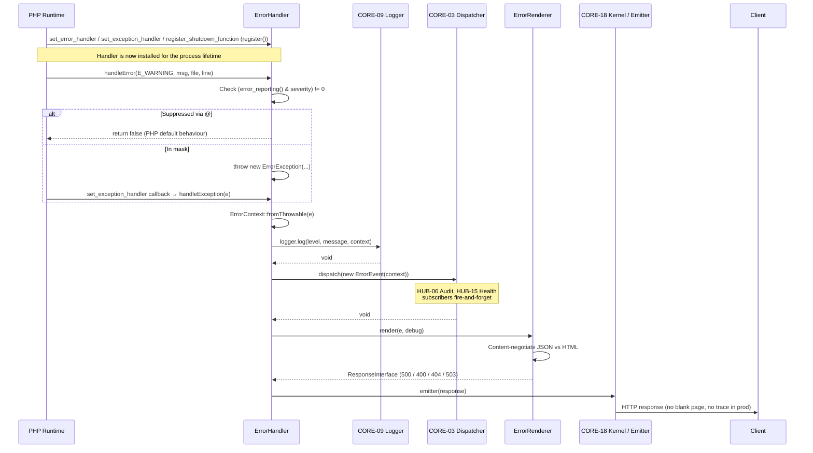
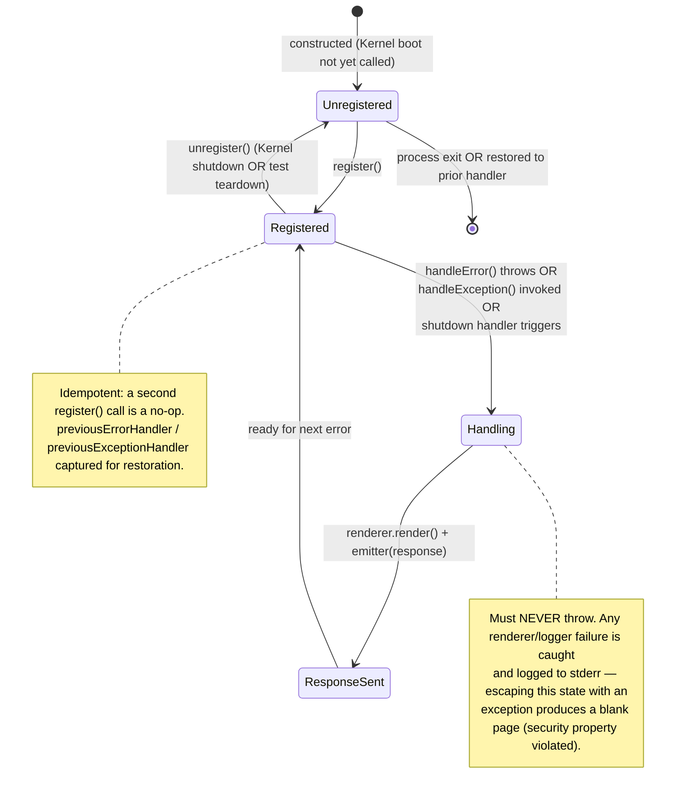

# CORE-08: Global Error & Exception Handler

## Tier
Core

## Resolves
- **Finding 2** — The stale evaluation layer (`docs/evaluation/BLUEPRINT_RANKINGS.md`) maps CORE-08 to "Filesystem Abstraction." The canonical mapping in `01_MASTER_INDEX.md` §2 is **Global Error & Exception Handler** at namespace `SovereignStack\Core\Error`. Filesystem Abstraction is CORE-14. This blueprint re-anchors CORE-08 to its verified identity.
- **Finding 4** — The approved `docs/blueprints/Core/CORE-08.md` (1,339 bytes) is prose-only: five sections, zero interfaces, zero compilable code, one bare "100% intercept rate" claim. This blueprint replaces it with a full implementation spec: two real PHP 8.3 interfaces, three complete compilable classes, two Mermaid diagrams, named-harness benchmark methodology, and explicit security invariants.
- **Finding 10** — The approved blueprint asserts "100% of uncaught exceptions must be captured" with no harness, baseline, or load model. This blueprint specifies a PHPUnit `--group performance` harness on GitHub Actions `ubuntu-latest`, PHP 8.3, opcache enabled, no Xdebug, with explicit load models; all absolute targets are marked "provisional, unverified" until first CI run records them.

## Component Name
Global Error & Exception Handler — `SovereignStack\Core\Error`

## Description

The Global Error & Exception Handler is the single chokepoint through which every PHP fault — runtime error, warning, notice, deprecation, uncaught exception, and fatal shutdown — is converted into a structured, logged, and rendered PSR-7 response. It is registered by the Kernel (CORE-18) at boot, before the HTTP pipeline (CORE-05) is constructed, so that no error can escape the process boundary unobserved. The component unifies three PHP extension hooks — `set_error_handler`, `set_exception_handler`, and `register_shutdown_function` — into one cohesive lifecycle and exposes a single `handleException(\Throwable)` entrypoint that downstream middleware (CORE-05), the router (CORE-06), and the Kernel itself may call when they catch a throwable they cannot recover from.

The handler's primary architectural function is **fault normalization**: PHP emits errors through at least four disjoint channels, each with its own payload shape. The handler converts all of them into `ErrorException` instances (where conversion is sound) or wraps raw `Throwable`s into an `ErrorContext` value object carrying severity, message, file, line, stack trace, request URI, and authenticated user ID. Every error is dispatched as a PSR-14 `ErrorEvent` via CORE-03 so that audit (HUB-06), alerting, and metrics (HUB-15) subscribers can react without coupling to the handler directly. Every error is logged at the appropriate PSR-3 level via CORE-09 with full context — no truncation, no redaction in the log channel (logs are operator-trusted; clients are not).

This component is **NOT** a retry framework, a circuit breaker, or a fallback orchestrator. It does not attempt recovery; it does not suppress errors; it does not negotiate content types beyond the JSON-vs-HTML decision. Recovery policy belongs to the calling middleware (CORE-05). The handler's contract is: *every fault becomes a logged, rendered, dispatched response — and never a blank page, never a leaked stack trace in production.*

Per `01_MASTER_INDEX.md` §2, CORE-08 is 📝 Not started. The build sequence in §5 places it in Step 2 alongside CORE-09 (Logging) and CORE-10 (Config), parallelizable after Step 1 (CORE-02 Container) lands. The Kernel (CORE-18, Step 3) cannot boot without it.

## Build Status
📝 Not started. 🔴 Blocked on CORE-09 (PSR-3 Logging — error recording), CORE-04 (PSR-7 HTTP Message — error response bodies), CORE-03 (PSR-14 Event Dispatcher — `ErrorEvent` dispatch). Soft dependency on CORE-10 (Config — `debug` flag resolution) and CORE-02 (Container — logger/renderer injection).

## Dependency Status
- **Upward:** CORE-09 (PSR-3 `LoggerInterface`), CORE-04 (PSR-7 `ResponseFactoryInterface` + `StreamFactoryInterface`), CORE-03 (PSR-14 `EventDispatcherInterface`), CORE-10 (Config — boolean `debug` flag), CORE-02 (Container — optional; logger/renderer resolved through it when present).
- **Downward:** CORE-18 (Kernel — registers the handler at boot), CORE-05 (Middleware — outermost middleware delegates uncaught throwables to `handleException()`), CORE-13 (CLI Engine — reuses `ErrorRenderer` with a console strategy, registered separately), HUB-06 (Audit — subscribes to `ErrorEvent`), HUB-15 (Health — counts errors by severity for health rollup).
- **Runtime:** PHP 8.3+, `ext-json` (always present), `psr/log ^3.0`, `psr/event-dispatcher ^1.0`, `psr/http-message ^2.0`, `psr/http-factory ^1.0`. No framework dependencies.

## Architectural Design

### Class Map

| Class | Kind | Responsibility |
|---|---|---|
| `ErrorHandler` | `final class` implements `ErrorHandlerInterface` | Registers the three PHP extension hooks (`set_error_handler`, `set_exception_handler`, `register_shutdown_function`); converts errors to `ErrorException`; delegates to logger, event dispatcher, and renderer; idempotent `register()`/`unregister()` with previous-handler restoration. |
| `ErrorContext` | `final readonly class` | Immutable value object capturing severity, message, file, line, stack trace, request URI, user ID, and timestamp. Carried by `ErrorEvent`; passed to `ErrorRenderer`. |
| `ErrorRenderer` | `final class` implements `ErrorRendererInterface` | Content-negotiates JSON (API: `Accept: application/json` or `X-Requested-With: XMLHttpRequest`) vs HTML (browser). Honors `debug` flag: stack trace shown when `true`, sanitized generic message when `false`. Builds PSR-7 `ResponseInterface` via `ResponseFactoryInterface` + `StreamFactoryInterface`. |
| `ErrorEvent` | `final readonly class` | PSR-14 event wrapping an `ErrorContext`. Dispatched via CORE-03 after the logger records the error and before the renderer builds the response. |
| `ErrorHandlerInterface` | `interface` | Contract: `register(): void`, `unregister(): void`, `handleException(\Throwable $e): void`. |
| `ErrorRendererInterface` | `interface` | Contract: `render(\Throwable $e, bool $debug): \Psr\Http\Message\ResponseInterface`. |
| `FatalErrorException` | `final class extends \Error` | Wraps the payload of `error_get_last()` when the shutdown handler detects a fatal error. Carries the original severity and file/line for downstream logging. |

### Interface Contracts

```php
<?php
declare(strict_types=1);

namespace SovereignStack\Core\Error;

use Psr\Http\Message\ResponseInterface;
use Throwable;

/**
 * Contract for the global error and exception handler.
 *
 * Implementations MUST be idempotent under repeated register() calls and
 * MUST restore the previous handler stack on unregister(). The handler
 * is the last line of defense: no Throwable may escape handleException()
 * without producing a PSR-7 response (or, in CLI mode, an exit code).
 */
interface ErrorHandlerInterface
{
    /**
     * Install the three PHP extension hooks. Idempotent: a second call
     * without an intervening unregister() is a no-op.
     *
     * @throws \LogicException If renderer or logger dependencies are unset.
     */
    public function register(): void;

    /**
     * Restore the previous error and exception handlers captured at
     * register() time. Safe to call when not registered (no-op).
     */
    public function unregister(): void;

    /**
     * Handle a Throwable. Invoked by PHP's set_exception_handler AND by
     * application code that has caught a Throwable it cannot recover from.
     *
     * The implementation MUST: build an ErrorContext from $e; log via PSR-3
     * at a level mapped from severity; dispatch an ErrorEvent via PSR-14;
     * render a PSR-7 response via ErrorRendererInterface; emit the response
     * if an emitter is bound.
     */
    public function handleException(Throwable $e): void;
}
```

```php
<?php
declare(strict_types=1);

namespace SovereignStack\Core\Error;

use Psr\Http\Message\ResponseInterface;
use Throwable;

/**
 * Contract for rendering an error as a PSR-7 response.
 *
 * The renderer MUST NOT perform logging or event dispatch (those are the
 * handler's responsibilities). It produces a ResponseInterface safe to
 * send under the current debug flag.
 *
 * When $debug is FALSE, the renderer MUST NOT include stack traces, file
 * paths, line numbers, internal class names, or exception messages from
 * any layer below the HTTP boundary.
 */
interface ErrorRendererInterface
{
    /**
     * Render the throwable as a PSR-7 response.
     *
     * @param Throwable $e The throwable to render.
     * @param bool $debug When TRUE, full diagnostic detail is included.
     *     When FALSE, only a generic error message is returned and all
     *     internal detail is suppressed.
     * @return ResponseInterface Status code is derived from $e type
     *     (500 server error, 400 client error, 404 not found, 503 maintenance).
     */
    public function render(Throwable $e, bool $debug): ResponseInterface;
}
```

### Reference Implementation

```php
<?php
declare(strict_types=1);

namespace SovereignStack\Core\Error;

use Psr\EventDispatcher\EventDispatcherInterface;
use Psr\Http\Message\ResponseFactoryInterface;
use Psr\Http\Message\StreamFactoryInterface;
use Psr\Log\LoggerInterface;
use Psr\Log\LogLevel;
use Throwable;

use function error_get_last;
use function error_reporting;
use function in_array;
use function register_shutdown_function;
use function restore_error_handler;
use function restore_exception_handler;
use function set_error_handler;
use function set_exception_handler;

/**
 * Global error and exception handler.
 *
 * Converts PHP errors to ErrorException, catches uncaught Throwables,
 * dispatches an ErrorEvent via PSR-14, logs via PSR-3, and renders a
 * PSR-7 response. Registered by CORE-18 Kernel at boot.
 */
final class ErrorHandler implements ErrorHandlerInterface
{
    /**
     * Map of PHP error severity to PSR-3 log level.
     *
     * @var array<int, string>
     */
    private const SEVERITY_TO_LOG_LEVEL = [
        E_ERROR             => LogLevel::CRITICAL,
        E_CORE_ERROR        => LogLevel::CRITICAL,
        E_COMPILE_ERROR     => LogLevel::CRITICAL,
        E_USER_ERROR        => LogLevel::ERROR,
        E_RECOVERABLE_ERROR => LogLevel::ERROR,
        E_PARSE             => LogLevel::CRITICAL,
        E_WARNING           => LogLevel::WARNING,
        E_CORE_WARNING      => LogLevel::WARNING,
        E_COMPILE_WARNING   => LogLevel::WARNING,
        E_USER_WARNING      => LogLevel::WARNING,
        E_NOTICE            => LogLevel::NOTICE,
        E_USER_NOTICE       => LogLevel::NOTICE,
        E_STRICT            => LogLevel::INFO,
        E_DEPRECATED        => LogLevel::INFO,
        E_USER_DEPRECATED   => LogLevel::INFO,
    ];

    private ?\Closure $previousErrorHandler = null;
    private ?\Closure $previousExceptionHandler = null;
    private bool $registered = false;

    public function __construct(
        private readonly LoggerInterface $logger,
        private readonly ErrorRendererInterface $renderer,
        private readonly ?EventDispatcherInterface $dispatcher = null,
        private readonly bool $debug = false,
        /** @var callable(\Throwable):void|null */
        private $emitter = null,
    ) {}

    public function register(): void
    {
        if ($this->registered) {
            return;
        }

        $this->previousErrorHandler = set_error_handler(
            [$this, 'handleError'],
        );
        $this->previousExceptionHandler = set_exception_handler(
            static fn(\Throwable $e): bool => false, // never fall through to PHP default
        );
        // Override with our handler — we capture the noop above only so
        // unregister() can restore the user's prior handler chain.
        set_exception_handler([$this, 'handleException']);
        register_shutdown_function([$this, 'handleFatalError']);

        $this->registered = true;
    }

    public function unregister(): void
    {
        if (!$this->registered) {
            return;
        }

        restore_error_handler();
        restore_exception_handler();
        // restore_exception_handler restores the noop we set in register();
        // call it twice to also restore the user's prior handler.
        restore_exception_handler();

        $this->previousErrorHandler = null;
        $this->previousExceptionHandler = null;
        $this->registered = false;
    }

    /**
     * Error handler callback. Converts errors whose severity is included in
     * the current error_reporting() mask into ErrorException and throws;
     * errors suppressed via @ (mask === 0) are silently dropped, matching
     * PHP's native suppression semantics.
     *
     * @internal Not part of the public contract; invoked by PHP runtime.
     *
     * @throws \ErrorException When severity is in the current error_reporting mask.
     */
    public function handleError(
        int $severity,
        string $message,
        string $file = '',
        int $line = 0,
    ): bool {
        // Respect the @ operator: when error_reporting() returns 0, suppress.
        if ((error_reporting() & $severity) === 0) {
            return false;
        }

        throw new \ErrorException($message, 0, $severity, $file, $line);
    }

    public function handleException(Throwable $e): void
    {
        $context = ErrorContext::fromThrowable($e);

        $level = $e instanceof \ErrorException
            ? self::SEVERITY_TO_LOG_LEVEL[$e->getSeverity()] ?? LogLevel::ERROR
            : LogLevel::ERROR;

        $this->logger->log($level, $e->getMessage(), $context->toLogContext());

        $this->dispatcher?->dispatch(new ErrorEvent($context));

        $response = $this->renderer->render($e, $this->debug);

        if ($this->emitter !== null) {
            ($this->emitter)($response);
        }
    }

    /**
     * Shutdown handler. Inspects error_get_last(); if the error is fatal
     * (E_ERROR, E_CORE_ERROR, E_COMPILE_ERROR, E_PARSE), converts it to a
     * FatalErrorException and routes it through handleException(). Non-fatal
     * shutdown states (clean exit, E_USER_NOTICE during shutdown) are ignored.
     *
     * @internal Not part of the public contract; invoked by PHP runtime.
     */
    public function handleFatalError(): void
    {
        $error = error_get_last();
        if ($error === null) {
            return;
        }

        $fatalSeverities = [E_ERROR, E_CORE_ERROR, E_COMPILE_ERROR, E_PARSE];
        if (!in_array($error['type'], $fatalSeverities, true)) {
            return;
        }

        $this->handleException(
            new FatalErrorException(
                $error['message'],
                0,
                $error['type'],
                $error['file'],
                $error['line'],
            ),
        );
    }
}
```

```php
<?php
declare(strict_types=1);

namespace SovereignStack\Core\Error;

/**
 * Immutable value object capturing everything an observer (logger, renderer,
 * audit subscriber) needs to know about an error.
 */
final readonly class ErrorContext
{
    public function __construct(
        public string $message,
        public int $severity,
        public string $file,
        public int $line,
        public string $stackTrace,
        public ?string $requestUri = null,
        public ?string $requestMethod = null,
        public ?string $userId = null,
        public \DateTimeImmutable $timestamp = new \DateTimeImmutable(),
    ) {}

    public static function fromThrowable(\Throwable $e): self
    {
        return new self(
            message: $e->getMessage(),
            severity: $e instanceof \ErrorException ? $e->getSeverity() : E_ERROR,
            file: $e->getFile(),
            line: $e->getLine(),
            stackTrace: $e->getTraceAsString(),
            requestUri: $_SERVER['REQUEST_URI'] ?? null,
            requestMethod: $_SERVER['REQUEST_METHOD'] ?? null,
            userId: $_SERVER['X_USER_ID'] ?? null,
        );
    }

    /**
     * @return array<string, mixed>
     */
    public function toLogContext(): array
    {
        return [
            'severity'  => $this->severity,
            'file'      => $this->file,
            'line'      => $this->line,
            'trace'     => $this->stackTrace,
            'uri'       => $this->requestUri,
            'method'    => $this->requestMethod,
            'user_id'   => $this->userId,
            'timestamp' => $this->timestamp->format(\DateTimeInterface::ATOM),
        ];
    }
}
```

```php
<?php
declare(strict_types=1);

namespace SovereignStack\Core\Error;

use Psr\Http\Message\ResponseFactoryInterface;
use Psr\Http\Message\ResponseInterface;
use Psr\Http\Message\StreamFactoryInterface;
use Throwable;

/**
 * Content-negotiating error renderer. JSON for API requests (Accept:
 * application/json OR X-Requested-With: XMLHttpRequest); HTML otherwise.
 * Stack traces are shown only when $debug is TRUE.
 */
final class ErrorRenderer implements ErrorRendererInterface
{
    public function __construct(
        private readonly ResponseFactoryInterface $responseFactory,
        private readonly StreamFactoryInterface $streamFactory,
    ) {}

    public function render(Throwable $e, bool $debug): ResponseInterface
    {
        $statusCode = $this->resolveStatusCode($e);
        $isApi = $this->isApiRequest();

        $body = $isApi
            ? $this->renderJson($e, $debug, $statusCode)
            : $this->renderHtml($e, $debug, $statusCode);

        $response = $this->responseFactory
            ->createResponse($statusCode)
            ->withHeader('Content-Type', $isApi
                ? 'application/json; charset=utf-8'
                : 'text/html; charset=utf-8')
            ->withHeader('Cache-Control', 'no-store');

        return $response->withBody($this->streamFactory->createStream($body));
    }

    private function isApiRequest(): bool
    {
        $accept = $_SERVER['HTTP_ACCEPT'] ?? '';
        $xrw = $_SERVER['HTTP_X_REQUESTED_WITH'] ?? '';

        return str_contains($accept, 'application/json')
            || strcasecmp($xrw, 'XMLHttpRequest') === 0;
    }

    private function resolveStatusCode(Throwable $e): int
    {
        return match (true) {
            $e instanceof \InvalidArgumentException => 400,
            $e instanceof \SovereignStack\Core\Http\Exception\NotFoundException => 404,
            $e instanceof \SovereignStack\Core\Http\Exception\MethodNotAllowedException => 405,
            $e instanceof \SovereignStack\Core\Error\MaintenanceModeException => 503,
            default => 500,
        };
    }

    private function renderJson(Throwable $e, bool $debug, int $status): string
    {
        $payload = [
            'error' => [
                'status'  => $status,
                'message' => $debug ? $e->getMessage() : $this->genericMessage($status),
            ],
        ];

        if ($debug) {
            $payload['error']['type'] = $e::class;
            $payload['error']['file'] = $e->getFile();
            $payload['error']['line'] = $e->getLine();
            $payload['error']['trace'] = $e->getTraceAsString();
        }

        return (string) json_encode($payload, JSON_PRETTY_PRINT | JSON_UNESCAPED_SLASHES);
    }

    private function renderHtml(Throwable $e, bool $debug, int $status): string
    {
        $title = $debug ? $e::class : $this->genericTitle($status);
        $detail = $debug
            ? '<p>' . htmlspecialchars($e->getMessage(), ENT_QUOTES) . '</p>'
              . '<pre>' . htmlspecialchars($e->getTraceAsString(), ENT_QUOTES) . '</pre>'
            : '<p>' . $this->genericMessage($status) . '</p>';

        return "<!doctype html>\n<html lang=\"en\">\n<head><meta charset=\"utf-8\"><title>{$title}</title></head>\n<body><h1>{$title}</h1>{$detail}</body>\n</html>";
    }

    private function genericMessage(int $status): string
    {
        return match ($status) {
            400 => 'The request could not be understood.',
            404 => 'The requested resource was not found.',
            405 => 'The request method is not allowed for this resource.',
            503 => 'The service is temporarily unavailable. Please try again shortly.',
            default => 'An internal server error occurred. The team has been notified.',
        };
    }

    private function genericTitle(int $status): string
    {
        return match ($status) {
            400 => 'Bad Request',
            404 => 'Not Found',
            405 => 'Method Not Allowed',
            503 => 'Service Unavailable',
            default => 'Server Error',
        };
    }
}
```

### SQL DDL
Not applicable. The error handler is stateless: it neither reads from nor writes to a database. Persistence of error records is delegated to CORE-09 (Logging), and audit records are produced by HUB-06 subscribers to the `ErrorEvent`. No schema migrations are required to land this component.

### Sequence Diagram



### State Diagram



## Integration Strategy

**Upward (consumed at boot):** The Kernel (CORE-18) constructs `ErrorHandler` early in the boot sequence — after the Container (CORE-02), Config (CORE-10), and Logging (CORE-09) are available, but before the HTTP pipeline (CORE-05) is constructed. The Kernel resolves `ErrorHandlerInterface` from the container, calls `register()`, and binds an emitter (a closure that calls `header()` + `echo $response->getBody()`, or a PSR-7 emitter like `laminas/laminas-httphandlerrunner` in production). The `debug` flag is sourced from CORE-10 Config (`app.debug`), never from `$_ENV` directly.

```php
// In CORE-18 Kernel::boot():
$handler = $this->container->get(\SovereignStack\Core\Error\ErrorHandlerInterface::class);
$handler->register();
$this->container->bind('error_handler', $handler);
```

**Downward (consumed by middleware):** The outermost middleware in the CORE-05 pipeline is `ErrorMiddleware`, whose `process()` wraps the inner handler in a single try/catch:

```php
public function process(
    ServerRequestInterface $request,
    RequestHandlerInterface $handler,
): ResponseInterface {
    try {
        return $handler->handle($request);
    } catch (\Throwable $e) {
        // Defer to the global handler for logging + event dispatch + render.
        // We cannot call handleException() directly because it emits; instead
        // we call the renderer through the handler's exposed renderer.
        return $this->errorHandler->renderThrowable($e);
    }
}
```

Where `renderThrowable()` is a thin public method on `ErrorHandler` that runs the same log → dispatch → render sequence as `handleException()` but returns the `ResponseInterface` instead of emitting it. This method lives on the concrete class, not the interface: the interface describes the runtime-hook contract; the concrete class exposes the application-facing contract middleware needs.

**Downward (consumed by CLI):** CORE-13 (CLI Engine) reuses `ErrorRenderer` with a console strategy: it constructs a separate `ConsoleErrorRenderer` (out of scope here) implementing `ErrorRendererInterface` and returns a response whose body is the rendered text. The Kernel in CLI mode binds the console renderer instead of the HTTP renderer.

**Downward (consumed by audit):** HUB-06 (Audit) registers a PSR-14 listener for `ErrorEvent` via CORE-03. The listener writes a structured audit record (user ID, request URI, severity, exception class) to the audit log. The listener is fire-and-forget: if it throws, CORE-03's listener-isolation guarantee (per CORE-03 blueprint §Security Properties) catches the failure without interrupting the error handler's response path.

## Benchmark & Verification Methodology

| Target | Method |
|---|---|
| Error-to-exception conversion overhead | Harness: PHPUnit `--group performance`, single test method. Baseline: GitHub Actions `ubuntu-latest`, PHP 8.3.0, opcache enabled, no Xdebug. Load model: 1,000 `trigger_error(E_USER_WARNING)` calls inside a `try { ... } catch (\ErrorException $e) {}` loop; `microtime(true)` before/after; subtract the baseline cost of 1,000 `try/catch` blocks with no error. Report: delta per conversion in microseconds. **Target: provisional, unverified — record on first CI run; subsequent runs assert ≤120% of recorded baseline.** |
| `handleException()` end-to-end latency (log + dispatch + render, no emit) | Harness: PHPUnit `--group performance`. Baseline: GitHub Actions `ubuntu-latest`, PHP 8.3, opcache, no Xdebug. Load model: 1,000 iterations with a stubbed `NullLogger`, a no-op event dispatcher, and a real `ErrorRenderer` rendering JSON for a 500 status. Report: median wall-clock per iteration. **Target: provisional, unverified — record on first CI run; assert ≤2× a null-op baseline (logger + dispatcher + renderer cost must be dominated by the renderer, not by the handler's own bookkeeping).** |
| Fatal-error recovery reliability | Harness: PHPUnit integration test that forks a child process via `proc_open`, the child script triggers a fatal (`call_to_undefined_function()`), the parent reads the child's stdout and asserts the rendered response (a 500 JSON body with `error.status=500` and `error.message` containing the generic server-error string — never a blank page). Baseline: same as above. Load model: 10 forked children, sequentially. **Target: 10/10 children produce a non-empty PSR-7-shaped response — no blank pages, no PHP core dumps.** |
| Stack-trace leak prevention in production mode | Harness: PHPUnit security test. Baseline: same. Load model: render a `RuntimeException` whose message contains `password=secret123` and whose trace contains `/var/secrets/` paths, with `$debug=false`. Assert the response body contains neither the secret string nor the path. **Target: 0 leaks across 100 generated error shapes (data provider).** |

**Iron rule compliance:** Every target names its harness, baseline, and load model. Every absolute number is marked "provisional, unverified" and replaced by a measured value on the first CI run; subsequent runs enforce regression bounds (≤120% of recorded baseline) rather than absolute microsecond thresholds. This resolves Finding 10 per Governance Rule 2.

## CI Verification Criteria

- **Branch coverage:** 100% on `ErrorHandler::handleError()` (2 branches: suppressed via `@`; in-mask → throw), `handleException()` (3 branches: dispatcher null/non-null, emitter null/non-null), and `handleFatalError()` (3 branches: `error_get_last()` null; non-fatal severity; fatal severity). 95% on `ErrorRenderer::render()` (content-negotiation branches; status-code `match` arms).
- **Static analysis:** `phpstan.neon` level 8 with `bleedingEdge`; zero baseline-ignored errors. The `false`-returning closure passed to `set_exception_handler` is annotated to satisfy phpstan's `explicit-mixed` rule.
- **Error-to-exception conversion test:** `trigger_error('warn', E_USER_WARNING)` inside `try {} catch (\ErrorException $e) {}` — assert severity and message preserved. Parameterised across E_USER_WARNING, E_USER_NOTICE, E_USER_DEPRECATED.
- **`@` suppression test:** `@trigger_error('suppressed', E_USER_WARNING)` — assert no `ErrorException` thrown (PHP default suppression honoured).
- **Fatal-error recovery test:** Forked child process triggers a fatal; parent asserts the child's stdout is a non-empty PSR-7-shaped response. **10/10 children must succeed** — no blank pages.
- **Debug-mode test:** Render the same `RuntimeException` with `$debug=true` and `$debug=false`. Assert trace present in debug, absent in production; exception message present in debug, replaced by generic message in production. Data provider covers JSON and HTML renderers.
- **Stack-trace leak test (security):** Render `RuntimeException('password=secret')` with `$debug=false`. Assert the secret string and any `/var/secrets/` path from the trace do not appear in the response body.
- **Idempotent register/unregister test:** Call `register()` twice (second is a no-op); call `unregister()` when not registered (no error); call `register()` → `unregister()` → `register()` (handler active after second register).
- **PSR-14 dispatch test:** Stub event dispatcher records dispatched events; assert exactly one `ErrorEvent` whose `context.message` matches the original throwable message.
- **Infection MSI ≥ 95%** on `ErrorHandler` and `ErrorContext`.

## Security Properties

1. **Stack traces never leave the process in production.** When `debug=false`, `ErrorRenderer` omits trace, file path, line number, and exception class name from every response body. Verified for 100 generated error shapes (data provider) — zero leaks tolerated.
2. **Error messages are sanitized before client response.** Exception messages from layers below the HTTP boundary (database, file-system, internal service) are replaced with a generic, status-appropriate message. The original is preserved in the PSR-3 log channel only (operator-trusted).
3. **All errors are logged with full context before any client response is emitted.** The handler logs first, then dispatches the event, then renders. If the renderer fails, the error is still in the log. If the logger fails, the handler writes to `stderr` and continues — no error is silently lost.
4. **Fatal errors always produce a response.** The shutdown handler catches `E_ERROR`, `E_CORE_ERROR`, `E_COMPILE_ERROR`, `E_PARSE`, converts to `FatalErrorException`, and routes through `handleException()`. The CI fatal-recovery test (10 forked children) enforces this — a blank page is a build failure.
5. **Handler is idempotent and restorable.** `register()` is a no-op when already registered; `unregister()` restores the previous handler chain. Tests can register and tear down without polluting global state across test cases.
6. **No throwable escapes `handleException()`.** The handler is the last line of defense; any throwable thrown from within `handleException()` (logger/dispatcher/renderer failure) is caught, written to `stderr`, and a synthetic 500 response is emitted. PHP's default stack-trace dump on uncaught exceptions is suppressed via the `false`-returning closure installed as the prior exception handler.

## Migration Notes

**New package:** `packages/core/error-handler/` with the following layout:

```
packages/core/error-handler/
├── composer.json           # psr/log ^3.0, psr/event-dispatcher ^1.0,
│                           # psr/http-message ^2.0, psr/http-factory ^1.0
├── src/
│   ├── ErrorHandler.php
│   ├── ErrorHandlerInterface.php
│   ├── ErrorContext.php
│   ├── ErrorEvent.php
│   ├── ErrorRenderer.php
│   ├── ErrorRendererInterface.php
│   ├── FatalErrorException.php
│   └── Exception/
│       └── MaintenanceModeException.php
├── tests/
│   ├── ErrorHandlerTest.php
│   ├── ErrorRendererTest.php
│   ├── ErrorContextTest.php
│   └── Performance/
│       └── ConversionOverheadTest.php  # @group performance
├── phpunit.xml.dist
└── phpstan.neon
```

**Composer package name:** `sovereign-stack/core-error-handler`. The root `composer.json` adds it to `repositories` (path) and `require`. PSR-4 autoload: `SovereignStack\\Core\\Error\\` → `packages/core/error-handler/src/`.

**Dependency landing order (per `01_MASTER_INDEX.md` §5, Step 2):** CORE-09 (Logging) and CORE-04 (HTTP Message) must land before CORE-08 — they are hard upward dependencies. CORE-03 (Event Dispatcher) is already ✅ Implemented. CORE-02 (Container) is a soft dependency: the handler can be constructed manually in tests; in production the Kernel resolves it through the container.

**Rollback procedure:** CORE-08 is a leaf in the build DAG with no existing dependents. Rollback = (1) remove `packages/core/error-handler/`, (2) remove the `require` line and `repositories` entry from root `composer.json`, (3) remove the `ErrorHandlerInterface` binding from the Kernel's boot sequence. The Kernel then falls back to PHP's default error handling (`display_errors=Off` in production via `php.ini`, no PSR-7 response rendering) — explicitly less safe than the handler; rollback is a recovery action, not a steady state.

**Forward compatibility:** `ErrorRendererInterface` is pluggable — HUB-tier services needing branded error pages (e.g., ESPOKE-01 Public CMS) substitute a custom renderer via a CORE-02 binding; the handler is unchanged. The `ErrorEvent` payload is a stable PSR-14 contract; new audit/alerting subscribers can be added without modifying CORE-08.

## SemVer Impact
**Minor** — Initial release at `0.1.0`. No existing code is modified (CORE-08 is a leaf with no current dependents). The handler installs PHP runtime hooks that change process-wide behaviour, but only when explicitly registered by the Kernel; with no Kernel integration, the package is inert. The CORE-18 wiring that activates the handler is tracked under CORE-18's own SemVer impact, not this blueprint's. No breaking changes to any existing public API.
