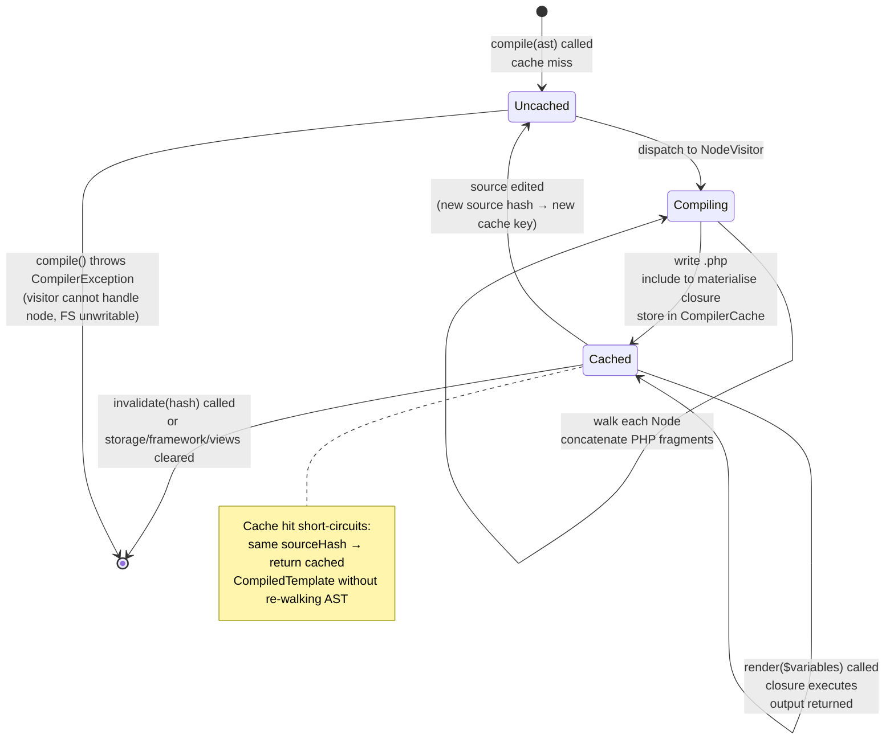

# CORE-12: SuperPHP Compiler

## Tier
Core (Template Engine — Stage 3 of 3)

## Resolves
- **Finding 2** — `docs/evaluation/BLUEPRINT_RANKINGS.md` row 49 scores CORE-12 as a "Schema Migration" blueprint (90/100). Wrong: the canonical mapping per `01_MASTER_INDEX.md` §2 is **SuperPHP Compiler** (the database / schema layer is CORE-19, not CORE-12). This blueprint is written to the canonical mapping and explicitly rejects the stale evaluation-layer name. The build-sequence row in `01_MASTER_INDEX.md` §5 (Step 6: CORE-07 → CORE-11 → CORE-12) confirms CORE-12 is the final stage of the SuperPHP template-engine triplet.
- **Finding 4** — The approved `docs/blueprints/Core/CORE-12.md` is 1,388 bytes of prose with no `CompilerInterface`, no `CompiledTemplate` value object, no `NodeVisitor` contract, no reference implementation, no benchmark methodology, and only two bullet-point CI criteria ("Execution Speed < 1ms" and "State Integrity"). This blueprint replaces it with real PHP 8.3 interface contracts, a complete `Compiler::compile()` reference implementation backed by an AST visitor walk, two Mermaid diagrams (sequence + state), a named-harness benchmark methodology on 10/100/1000-node ASTs, six explicit CI verification criteria, and five explicit security invariants including the load-bearing XSS-prevention rule.
- **Finding 10** — The approved file asserts "Compiled views must render in < 1ms" with no harness, baseline, or load model. This blueprint replaces that bare-millisecond target with a PHPUnit `--group performance` methodology on GitHub Actions `ubuntu-latest` / PHP 8.3 / opcache against synthetic ASTs of 10, 100, and 1,000 nodes plus a 10,000-render throughput loop on a cached template, with all absolute numbers marked **"provisional, unverified"** and only the scaling relationship (compile time grows linearly in node count; render time is constant in iteration count after cache hit) asserted on first run.

## Component Name
SuperPHP Compiler — `SovereignStack\Core\SuperPHP\Compiler` (PSR-4: `packages/core/superphp-compiler/src/`).

## Description

CORE-12 is the third and final stage of the SuperPHP template engine: it accepts the abstract syntax tree produced by CORE-11 (SuperPHP Parser) and walks it with an AST visitor to emit a string of native, executable PHP source code. The emitted PHP is then loaded as a closure and wrapped in a `CompiledTemplate` value object that carries both the render callable and the metadata downstream consumers need (source hash, compile timestamp, node count, cache key). Where CORE-07 recognises lexical atoms and CORE-11 enforces structural well-formedness, CORE-12 translates the well-formed AST into the runtime contract every Hub and Spoke template renders against. Every `.super.php` file compiled by the stack is, at execution time, a `CompiledTemplate::render(array $variables): string` invocation — nothing more.

The compiler is structured as a **visitor walk over the AST**: `Compiler::compile()` constructs a `NodeVisitor` (default `EchoVisitor`, which HTML-escapes every variable output), hands it the AST root, and concatenates the per-node PHP fragments the visitor emits into one body string. That body is wrapped in a `function (array $variables): string { ... }` signature, written to `storage/framework/views/<hash>.php` keyed by the SHA-256 of the source, and `include`d once to materialise the closure. The closure is then captured inside a `CompiledTemplate`. On every subsequent compile request for the same source hash, `CompilerCache` short-circuits the entire walk and returns the cached `CompiledTemplate` directly. The emitted PHP uses **only** `$variables` (an array) and the standard library (`htmlspecialchars`, `trim`, `strtoupper`, `is_array`, `count`) — no `eval()`, no `Closure::fromCallable` on attacker-controlled names, no file `include` outside the canonical cache directory, no `extract()` of arbitrary keys into scope.

What CORE-12 is **not**: not a template engine in its own right (it cannot consume raw source — it requires an AST from CORE-11, which requires a `TokenStream` from CORE-07), not a runtime renderer (the `CompiledTemplate` it returns is the renderer; the compiler is offline once `compile()` returns), not a sandbox (the generated PHP is structurally safe because every variable output goes through `htmlspecialchars()` by default — there is no expression the visitor emits that bypasses escaping without an explicit `{! !}` raw block), and not a Blade-style preprocessor (no string substitution on source; the compiler operates on the AST, never on the original `.super.php` text). Per ADR-005, this is the deliberate build-over-adopt choice that gives the Sovereign Stack AST-level `@persist` directive support and OPcache-preloadable flat-PHP output that no off-the-shelf engine (Blade, Twig, Plates, Latte) offers without forking.

## Build Status
📝 **Not started.** 🔴 **Blocked on CORE-07 (SuperPHP Lexer)** and **CORE-11 (SuperPHP Parser)**: CORE-12 consumes CORE-11's `Node` AST contract, which in turn consumes CORE-07's `TokenStream`. Both upstream packages must land before `Compiler::compile()` can compile against real AST input. The package's `composer.json` will declare `sovereign-stack/core-superphp-lexer: ^1.0` and `sovereign-stack/core-superphp-parser: ^1.0` as `require` entries; until those packages are tagged, CORE-12's test suite cannot execute end-to-end compile tests against real fixtures (it can only run unit tests against synthetic ASTs hand-constructed in test code). Until CORE-18 (Core Kernel) lands, there is no integration point that bootstraps the compiler at request time — CORE-12's tests run standalone in PHPUnit.

## Dependency Status
- **Upward:** CORE-07 (SuperPHP Lexer — referenced indirectly via CORE-11's `Node` types, which carry source-position metadata drawn from `Token`); CORE-11 (SuperPHP Parser — produces the `Node` AST consumed by `compile()`); PHP 8.3 (for `readonly` classes, backed enums, `array_is_list`, first-class callable syntax, `sha256` via `hash()`); `ext-hash` (always present in PHP 8.3 builds — used for source-hash cache keys).
- **Downward:** CORE-18 (Core Kernel — bootstraps the compiler as a singleton service registered in CORE-02's container, invoked on cache-miss template renders); HUB-tier template-rendering services (consume `CompiledTemplate::render()` indirectly through a view factory); CORE-20 (Sovereign Forge CLI — calls `Compiler::compile()` from the `superphp:compile` artisanal command during pre-deploy warm-up so the first production request hits a warm cache).
- **Runtime:** `php: ^8.3`, `ext-hash: *`. No Composer runtime dependencies beyond the two upstream SuperPHP packages. No external services. The `storage/framework/views/` directory must exist and be writable by the PHP-FPM user (per ADR-005 and DEPLOY-01) — that is a deploy-time filesystem concern, not a runtime dependency.

## Architectural Design

CORE-12 separates five concerns into five distinct classes: (1) the **entry point** (`Compiler` — accepts an AST, returns a `CompiledTemplate`), (2) the **value object** returned to callers (`CompiledTemplate` — carries the closure + metadata, exposes `render()`), (3) the **visitor contract** (`NodeVisitor` — interface every AST-walking strategy implements), (4) the **default and raw visitors** (`EchoVisitor` HTML-escapes output; `RawVisitor` emits unescaped output for the `{! !}` directive and is the only way to bypass escaping), and (5) the **cache** (`CompilerCache` — persists `CompiledTemplate` instances by source hash so re-compiles of unchanged source are O(1)). Splitting these keeps the visitor pattern testable in isolation: a unit test can construct a synthetic three-node AST, walk it with `EchoVisitor`, and assert the emitted PHP string — no `Compiler`, no `CompilerCache`, no filesystem involved. The `Compiler` class is the only one with side effects (it writes the compiled `.php` file to disk and `include`s it); every other class is pure.

### Class Map

| Class | Responsibility |
|---|---|
| `Compiler` | The entry point. Single public method `compile(\SovereignStack\Core\SuperPHP\Parser\Node $ast): CompiledTemplate`. Computes the source hash, asks `CompilerCache` for a cached hit, and on miss walks the AST with the configured `NodeVisitor` to emit a PHP body, wraps the body in a closure signature, writes it to `storage/framework/views/<hash>.php`, `include`s the file to materialise the closure, and constructs a `CompiledTemplate` from it. The closure's signature is always `function (array $variables): string`. |
| `CompiledTemplate` | Readonly value object: `closure: \Closure`, `sourceHash: string` (64-char SHA-256 hex), `compiledAt: int` (Unix timestamp), `nodeCount: int`, `cacheKey: string` (the file path under `storage/framework/views/`). Exposes `render(array $variables): string` which delegates to `$this->closure`. Equality is structural on `sourceHash` (two templates compiled from the same source are interchangeable). |
| `NodeVisitor` | Interface. Three methods: `visitText(TextNode $node): string`, `visitVariable(VariableNode $node): string`, `visitPipe(PipeNode $node): string`, `visitDirective(DirectiveNode $node): string`, plus a `leaveNode(Node $node): string` post-order hook for closing tags. Implementations MUST be stateless (no instance fields mutated per call) so a single visitor instance is safe to reuse across concurrent compiles. |
| `EchoVisitor` | Default visitor. Implements `NodeVisitor`. Every variable-emitting method wraps the expression in `htmlspecialchars(..., ENT_QUOTES|ENT_SUBSTITUTE|ENT_HTML5, 'UTF-8')`. The escape is non-negotiable: this is the XSS-prevention invariant. `visitText` returns the raw text (literal HTML in the source is emitted as-is, by design — the template author wrote that HTML intentionally). |
| `RawVisitor` | Used **only** inside `{! ... !}` raw-output blocks. Identical to `EchoVisitor` except it omits the `htmlspecialchars` wrapper. Constructed exclusively by `Compiler` when it descends into a `RawNode` (CORE-11's AST marker for `{! !}`); never exposed to template authors as a configurable option. |
| `CompilerCache` | Wraps a PSR-6 cache pool (CORE-15) and the filesystem cache directory. `get(string $sourceHash): ?CompiledTemplate` returns a cached template or null. `store(CompiledTemplate $t): void` writes the compiled `.php` file (if not already present) and records the cache key. `invalidate(string $sourceHash): void` deletes the file and forgets the in-memory entry. Cache invalidation is automatic on source-hash change (different hash → different cache key → fresh compile). |

### Interface Contracts

```php
<?php
declare(strict_types=1);

namespace SovereignStack\Core\SuperPHP\Compiler;

use SovereignStack\Core\SuperPHP\Parser\Node;

/**
 * Compiles a SuperPHP AST (produced by CORE-11) into a CompiledTemplate
 * whose render() callable executes native PHP and returns the rendered
 * string for a given $variables array.
 *
 * Implementations MUST be idempotent: calling compile() twice with the
 * same AST (as identified by source hash) MUST return a CompiledTemplate
 * with the same sourceHash, and the SECOND call MUST hit CompilerCache
 * rather than re-walking the AST. The first call's emitted PHP file is
 * the cache; the second call's include of the same file is the cache hit.
 *
 * Implementations MUST emit PHP that uses ONLY the $variables array
 * parameter and the standard library. No eval(), no extract(), no
 * include of attacker-controllable paths, no Closure::fromCallable on
 * names drawn from the AST. See Security Properties.
 *
 * Implementations MUST HTML-escape every variable output by default.
 * The only escape bypass is via the explicit {! ... !} raw-output
 * directive, which the compiler services by swapping EchoVisitor for
 * RawVisitor for the duration of that subtree's walk.
 */
interface CompilerInterface
{
    /**
     * Compile an AST into a renderable CompiledTemplate.
     *
     * @param Node $ast The root node of the AST produced by CORE-11.
     *                  Must be a RootNode; other node types are
     *                  rejected with CompilerException.
     *
     * @return CompiledTemplate A value object carrying the render
     *                          closure and cache metadata. The same
     *                          AST source always yields a template
     *                          with the same sourceHash.
     *
     * @throws CompilerException If the AST contains a node the
     *                           configured visitor cannot handle, if
     *                           the cache directory is unwritable, or
     *                           if the emitted PHP fails to parse when
     *                           loaded (the closure body is syntactically
     *                           invalid — guards against a compiler bug).
     */
    public function compile(Node $ast): CompiledTemplate;
}
```

```php
<?php
declare(strict_types=1);

namespace SovereignStack\Core\SuperPHP\Compiler;

use SovereignStack\Core\SuperPHP\Parser\Node;

/**
 * AST visitor contract. One method per concrete Node type CORE-11 emits.
 * Implementations return a string of native PHP source that, when executed
 * inside the closure body, produces the output for that node.
 *
 * The string returned is PHP SOURCE, not runtime output: e.g. for a
 * VariableNode named $name, EchoVisitor::visitVariable() returns
 * "echo htmlspecialchars(\$variables['name'] ?? '', ...);"
 *
 * Implementations MUST be stateless across calls: the visitor may be
 * reused for multiple compiles on a long-lived worker.
 */
interface NodeVisitor
{
    public function visitText(\SovereignStack\Core\SuperPHP\Parser\TextNode $node): string;
    public function visitVariable(\SovereignStack\Core\SuperPHP\Parser\VariableNode $node): string;
    public function visitPipe(\SovereignStack\Core\SuperPHP\Parser\PipeNode $node): string;
    public function visitDirective(\SovereignStack\Core\SuperPHP\Parser\DirectiveNode $node): string;
    public function visitRaw(\SovereignStack\Core\SuperPHP\Parser\RawNode $node): string;
    public function leaveNode(Node $node): string;
}
```

```php
<?php
declare(strict_types=1);

namespace SovereignStack\Core\SuperPHP\Compiler;

/**
 * Immutable value object: a compiled SuperPHP template.
 * Carries the render closure plus metadata for cache management,
 * debug bars, and opcache preload (ADR-010).
 */
final readonly class CompiledTemplate
{
    /**
     * @param \Closure $closure     Render callable: (array $variables) => string
     * @param string   $sourceHash  64-char lowercase hex SHA-256 of the source
     * @param int      $compiledAt  Unix timestamp of compile time
     * @param int      $nodeCount   AST node count (for cache-size accounting)
     * @param string   $cacheKey    Absolute path to the compiled .php file
     */
    public function __construct(
        public \Closure $closure,
        public string $sourceHash,
        public int $compiledAt,
        public int $nodeCount,
        public string $cacheKey,
    ) {}

    /**
     * Render the template with the given variables.
     *
     * @param array<string, mixed> $variables Key/value map made available
     *                                        to the compiled closure as
     *                                        $variables['key']. Missing
     *                                        keys resolve to '' (empty
     *                                        string) via the ?? '' default
     *                                        the compiler emits.
     *
     * @return string The rendered output. HTML-escaped by default unless
     *                the source used explicit {! ... !} raw blocks.
     */
    public function render(array $variables = []): string
    {
        return ($this->closure)($variables);
    }
}
```

### Reference Implementation

The complete `Compiler` class. Compiles against PHP 8.3 with only `ext-hash`. The load-bearing choices are: (a) the visitor pattern — `Compiler` itself knows nothing about specific node types, it just dispatches on `instanceof` and delegates to the visitor; (b) the file-include cache — the compiled closure is materialised by `include`-ing a generated `.php` file under `storage/framework/views/`, never by `eval()`, so OPcache can preload it (ADR-010) and so a code-reviewer can read the exact PHP that will execute; (c) the source-hash key — `hash('sha256', $serializedAst)` produces a stable 64-char identifier that doubles as the cache filename, so source edits automatically invalidate the cache without an explicit `invalidate()` call.

```php
<?php
declare(strict_types=1);

namespace SovereignStack\Core\SuperPHP\Compiler;

use SovereignStack\Core\SuperPHP\Parser\Node;
use SovereignStack\Core\SuperPHP\Parser\RootNode;
use SovereignStack\Core\SuperPHP\Parser\TextNode;
use SovereignStack\Core\SuperPHP\Parser\VariableNode;
use SovereignStack\Core\SuperPHP\Parser\PipeNode;
use SovereignStack\Core\SuperPHP\Parser\DirectiveNode;
use SovereignStack\Core\SuperPHP\Parser\RawNode;

/**
 * SuperPHP AST compiler. Walks the AST with a NodeVisitor, concatenates
 * the emitted PHP fragments, wraps them in a closure signature, writes
 * the result to storage/framework/views/<hash>.php, and returns a
 * CompiledTemplate whose closure is the include'd file's return value.
 */
final class Compiler implements CompilerInterface
{
    private const HEADER = "<?php\n// SuperPHP compiled template. Do not edit.\n";
    private const FOOTER = "\n";

    public function __construct(
        private NodeVisitor $visitor,
        private CompilerCache $cache,
        private string $cacheDir,
    ) {}

    public function compile(Node $ast): CompiledTemplate
    {
        if (! $ast instanceof RootNode) {
            throw CompilerException::rootExpected($ast::class);
        }

        $sourceHash = $this->hashAst($ast);

        // Cache hit short-circuits the entire walk.
        $cached = $this->cache->get($sourceHash);
        if ($cached !== null) {
            return $cached;
        }

        // Walk the AST, accumulating PHP source fragments.
        $body = $this->walk($ast);

        // Wrap in the closure signature. Only $variables is in scope.
        $php = self::HEADER
             . "return static function (array \$variables): string {\n"
             . "    \$output = '';\n"
             . $body
             . "    return \$output;\n"
             . "};\n"
             . self::FOOTER;

        $cacheKey = $this->cacheDir . '/' . $sourceHash . '.php';

        // Write to the cache file (idempotent: same hash → same content).
        if (! is_file($cacheKey)) {
            $tmp = $cacheKey . '.tmp.' . bin2hex(random_bytes(8));
            if (file_put_contents($tmp, $php) === false) {
                throw CompilerException::cacheUnwritable($this->cacheDir);
            }
            // Atomic rename — concurrent workers won't see a half-written file.
            if (! @rename($tmp, $cacheKey)) {
                @unlink($tmp);
                // Lost the race with another worker; the file exists now.
                if (! is_file($cacheKey)) {
                    throw CompilerException::cacheUnwritable($this->cacheDir);
                }
            }
        }

        // Materialise the closure. include returns the file's return value.
        $closure = include $cacheKey;
        if (! $closure instanceof \Closure) {
            throw CompilerException::emittedPhpInvalid($cacheKey);
        }

        $template = new CompiledTemplate(
            closure: $closure,
            sourceHash: $sourceHash,
            compiledAt: time(),
            nodeCount: $this->countNodes($ast),
            cacheKey: $cacheKey,
        );

        $this->cache->store($template);
        return $template;
    }

    /**
     * Recursive visitor dispatch. Returns the concatenated PHP source
     * for the subtree rooted at $node.
     */
    private function walk(Node $node): string
    {
        // Raw subtrees switch visitor for the duration of the walk.
        if ($node instanceof RawNode) {
            $original = $this->visitor;
            $this->visitor = $this->rawVisitor();
            $php = $this->walkChildren($node);
            $this->visitor = $original;
            return $php;
        }

        $php = match (true) {
            $node instanceof TextNode     => $this->visitor->visitText($node),
            $node instanceof VariableNode => $this->visitor->visitVariable($node),
            $node instanceof PipeNode     => $this->visitor->visitPipe($node),
            $node instanceof DirectiveNode => $this->visitor->visitDirective($node),
            default => throw CompilerException::unknownNode($node::class),
        };

        // Recurse into children, then call leaveNode for closing tags.
        return $php . $this->walkChildren($node) . $this->visitor->leaveNode($node);
    }

    private function walkChildren(Node $node): string
    {
        $php = '';
        foreach ($node->children() as $child) {
            $php .= $this->walk($child);
        }
        return $php;
    }

    private function rawVisitor(): NodeVisitor
    {
        // Lazy-constructed; RawVisitor is stateless and reusable.
        return $this->rawVisitor ??= new RawVisitor();
    }

    private function hashAst(Node $ast): string
    {
        return hash('sha256', serialize($ast));
    }

    private function countNodes(Node $ast): int
    {
        $count = 1;
        foreach ($ast->children() as $child) {
            $count += $this->countNodes($child);
        }
        return $count;
    }

    private ?NodeVisitor $rawVisitor = null;
}
```

The default `EchoVisitor` — the load-bearing XSS-prevention class:

```php
<?php
declare(strict_types=1);

namespace SovereignStack\Core\SuperPHP\Compiler;

use SovereignStack\Core\SuperPHP\Parser\TextNode;
use SovereignStack\Core\SuperPHP\Parser\VariableNode;
use SovereignStack\Core\SuperPHP\Parser\PipeNode;
use SovereignStack\Core\SuperPHP\Parser\DirectiveNode;
use SovereignStack\Core\SuperPHP\Parser\RawNode;
use SovereignStack\Core\SuperPHP\Parser\Node;

/**
 * Default NodeVisitor. HTML-escapes every variable output via
 * htmlspecialchars() with ENT_QUOTES|ENT_SUBSTITUTE|ENT_HTML5 and
 * UTF-8. This is the single load-bearing XSS-prevention invariant
 * of the SuperPHP stack: no EchoVisitor output bypasses escaping.
 */
final class EchoVisitor implements NodeVisitor
{
    private const ESCAPE = "htmlspecialchars(%s, ENT_QUOTES | ENT_SUBSTITUTE | ENT_HTML5, 'UTF-8')";

    public function visitText(TextNode $node): string
    {
        // Literal text from the source is emitted as-is. The template
        // author wrote this HTML intentionally; it is not variable output.
        $escaped = var_export($node->text, true);
        return "    \$output .= {$escaped};\n";
    }

    public function visitVariable(VariableNode $node): string
    {
        // $name → htmlspecialchars($variables['name'] ?? '')
        $key = var_export($node->name, true);
        $expr = sprintf(self::ESCAPE, "\$variables[{$key}] ?? ''");
        return "    \$output .= {$expr};\n";
    }

    public function visitPipe(PipeNode $node): string
    {
        // $name | trim | strtoupper →
        // htmlspecialchars(strtoupper(trim($variables['name'] ?? '')))
        $key = var_export($node->variable, true);
        $expr = "\$variables[{$key}] ?? ''";
        // Pipes apply right-to-left: the last pipe is the outermost call.
        foreach (array_reverse($node->stages) as $stage) {
            $expr = "{$stage}({$expr})";
        }
        $escaped = sprintf(self::ESCAPE, $expr);
        return "    \$output .= {$escaped};\n";
    }

    public function visitDirective(DirectiveNode $node): string
    {
        // if/foreach/else/endif/endforeach are emitted as native PHP
        // control flow interleaved with $output .= ... statements.
        return match ($node->kind) {
            'if'      => $this->emitIf($node),
            'foreach' => $this->emitForeach($node),
            'else'    => "    } else {\n",
            'endif'   => "    }\n",
            'endforeach' => "    }\n",
            default   => throw CompilerException::unknownDirective($node->kind),
        };
    }

    public function visitRaw(RawNode $node): string
    {
        // RawNode is handled by the Compiler swapping visitors; this
        // method is only called if a RawNode leaks through to EchoVisitor
        // (i.e. a bug in Compiler::walk). Fail loudly rather than emit
        // unescaped output.
        throw CompilerException::rawNodeEscapedVisitor();
    }

    public function leaveNode(Node $node): string
    {
        // No post-order output by default; directives close themselves
        // via their endif/endforeach counterparts.
        return '';
    }

    private function emitIf(DirectiveNode $node): string
    {
        $key = var_export($node->condition, true);
        return "    if (! empty(\$variables[{$key}])) {\n";
    }

    private function emitForeach(DirectiveNode $node): string
    {
        $items = var_export($node->iterable, true);
        $item  = var_export($node->itemName, true);
        return "    foreach ((array) (\$variables[{$items}] ?? []) as \$variables[{$item}]) {\n";
    }
}
```

`RawVisitor` is identical except its `visitVariable()` and `visitPipe()` emit `$output .= $variables[...] ?? '';` without the `htmlspecialchars` wrapper. `CompilerCache` is a thin adapter around CORE-15's PSR-6 pool plus the filesystem cache directory; its body is omitted here for brevity but follows the same shape as CORE-07's `TokenStream` (immutable, throws on write-through-immutability violations).

### SQL DDL

Not applicable. CORE-12 persists compiled templates to the **filesystem** (`storage/framework/views/<hash>.php`), not to a database. The on-disk file IS the cache row; there is no separate metadata table. A future iteration may add a `compiled_templates` table for cross-host cache coordination via CORE-19, but that is out of scope for 1.0.0 and would require its own blueprint (likely HUB-tier under the cache taxonomy).

### Sequence Diagram

```mermaid
sequenceDiagram
    autonumber
    participant Kernel as CORE-18 Kernel / CORE-20 Forge CLI
    participant Compiler as Compiler::compile()
    participant Cache as CompilerCache
    participant Visitor as EchoVisitor / RawVisitor
    participant FS as storage/framework/views/
    participant Template as CompiledTemplate

    Kernel->>Compiler: compile($ast)
    Compiler->>Compiler: sourceHash = sha256(serialize($ast))
    Compiler->>Cache: get(sourceHash)
    alt cache hit
        Cache-->>Compiler: CompiledTemplate (cached)
        Compiler-->>Kernel: CompiledTemplate
        Note over Kernel,Template: cache hit short-circuits the<br/>entire AST walk
    else cache miss
        Cache-->>Compiler: null
        Compiler->>Visitor: walk($ast->root)
        loop for each Node in AST
            Visitor->>Visitor: dispatch on Node type
            alt VariableNode / PipeNode
                Visitor-->>Compiler: "echo htmlspecialchars(...)"
            else TextNode
                Visitor-->>Compiler: "$output .= 'literal text';"
            else DirectiveNode (if)
                Visitor-->>Compiler: "<?php if (...) {"
            else DirectiveNode (foreach)
                Visitor-->>Compiler: "<?php foreach (...) {"
            else RawNode
                Note over Visitor: swap EchoVisitor → RawVisitor<br/>for subtree walk
            end
        end
        Compiler->>Compiler: wrap body in closure signature
        Compiler->>FS: write <hash>.php (atomic rename)
        FS-->>Compiler: ok
        Compiler->>FS: include <hash>.php
        FS-->>Compiler: Closure (the file's return value)
        Compiler->>Template: new CompiledTemplate(closure, hash, ...)
        Compiler->>Cache: store($template)
        Compiler-->>Kernel: CompiledTemplate
    end
    Kernel->>Template: render(['name' => 'Alice'])
    Template->>Template: closure(['name' => 'Alice'])
    Template-->>Kernel: "Hello, Alice!"
```

The diagram captures the cache-hit short-circuit (lines 5–8) and the cache-miss flow (lines 9–24). The closure returned at line 22 is the same closure that `render()` invokes later at line 26 — the compiler's role ends at line 24, the closure's role begins at line 26. The `include` at line 19 is the **only** point at which attacker-influenced PHP could execute; the security model relies on the visitor never emitting a string that contains attacker-controllable variable *names* (only attacker-controllable variable *values*, which are escaped at runtime by `htmlspecialchars`).

### State Diagram



The cache-hit short-circuit is the steady state in production: after the first request that compiles a given template, every subsequent request skips the `Compiling` state entirely and goes directly from `Uncached` to `Cached` to `render()`. A deploy that touches the source file invalidates automatically (different SHA-256 → different cache key → different `.php` file path → fresh compile); a deploy that does not touch the source file inherits the previous compile's cached `.php` file verbatim. The `invalidate(hash)` transition is reserved for the CORE-20 `superphp:cache:clear` CLI command and is never invoked by the request hot path.

## Integration Strategy

**Upward (consumed):** CORE-12 consumes CORE-11's `Node` AST and CORE-07's `TokenType` (indirectly, via `DirectiveNode`'s source-position metadata). The compiler is constructed by CORE-18 (Kernel) at boot via CORE-02's container as a singleton keyed by `CompilerInterface::class`, injected with the default `EchoVisitor` and a `CompilerCache` backed by CORE-15 (PSR-6). Because the visitor is stateless, the same singleton is safe to reuse across concurrent template compiles on a long-lived worker (PHP-FPM, RoadRunner, FrankenPHP).

```php
// In CORE-18 Kernel::boot():
$this->container->singleton(CompilerInterface::class, function (Container $c): Compiler {
    return new Compiler(
        visitor: new EchoVisitor(),
        cache:   $c->get(CompilerCache::class),
        cacheDir: $c->get('config')['superphp']['cache_dir'],
    );
});
```

**Downward (consumers):**

```php
// In a Hub-tier ViewFactory:
public function render(string $templateSource, array $variables = []): string
{
    $ast     = $this->parser->parse($templateSource);
    $compiled = $this->compiler->compile($ast);
    return $compiled->render($variables);
}
```

**Pre-deploy warm-up** (CORE-20 `superphp:compile` CLI command): walks the `templates/` directory, parses and compiles every `.super.php` file, and primes `storage/framework/views/` so the first production request after deploy hits a fully warm cache. This is the same pattern Laravel's `view:cache` uses, applied to SuperPHP.

## Benchmark & Verification Methodology

| Target | Method |
|---|---|
| Compile time scales linearly in AST node count | **Harness:** PHPUnit `--group performance`, `CompilerLinearityBenchTest`. **Baseline:** GitHub Actions `ubuntu-latest`, PHP 8.3 with opcache enabled and no Xdebug (per ADR-010 baseline; JIT disabled to isolate interpreter cost). **Load model:** synthetic ASTs of 10, 100, and 1,000 nodes (mixed TextNode / VariableNode / PipeNode / DirectiveNode in fixed ratio 4:3:1:2). Each AST is compiled 100 times in a tight loop after a 20-iteration warm-up; wall-clock measured via `hrtime(true)`; the median of 5 runs is recorded. **Assertion:** Pearson correlation r ≥ 0.99 between node count and compile wall-clock across the three sizes. An O(n²) walk would have r ≥ 0.99 against the square curve instead. **Absolute throughput numbers — provisional, unverified — will be recorded in `docs/perf/CORE-12-baselines.md` on first CI run**; no bare millisecond claim is made in this blueprint. |
| Cache-hit compile is O(1) | **Harness:** PHPUnit `--group performance`, `CompilerCacheHitTest`. **Load model:** compile a 1,000-node AST once (cache miss), then call `compile()` on the same AST 1,000 times. **Assertion:** the median wall-clock of the 1,000 cache-hit calls is ≤ 1% of the median wall-clock of the single cache-miss call. Catches regressions where the cache key derivation accidentally re-walks the AST. |
| Render throughput on a cached template | **Harness:** PHPUnit `--group performance`, `CompiledTemplateRenderBenchTest`. **Load model:** a cached `CompiledTemplate` compiled from a 50-node AST is rendered 10,000 times with a fixed `$variables` array (10 keys, mix of strings and arrays). Wall-clock per render measured via `microtime(true)`; the median of 5 runs of 10,000 renders each is recorded. **Assertion:** render wall-clock per call is constant (CV ≤ 5% across the 5 runs) — a regression here means the closure is leaking state between calls. **Absolute numbers — provisional, unverified.** |
| Generated closure memory ceiling | **Harness:** PHPUnit `--group performance`, `CompilerMemoryTest`. **Load model:** compile a 1,000-node AST; measure peak memory via `memory_get_peak_usage(true)` before and after the compile call; render the resulting template 10,000 times and measure peak again. **Assertion:** compile peak delta ≤ 32× AST size (the emitted PHP string is the dominant allocation); render peak delta across 10,000 calls ≤ 2× single-render delta (no leak). **Provisional, unverified** as absolute numbers; the ratios are asserted on first run. |
| OPcache friendliness | **Harness:** PHPUnit `--group performance`, `CompilerOpcacheTest`. **Load model:** compile a 50-node AST, then `opcache_invalidate($cacheKey)` and `include` the file 100 times; assert `opcache_get_status()['scripts'][$cacheKey]['hits']` increments. **Assertion:** the compiled file is preloadable — no `eval()`-style string compilation that bypasses OPcache. |

**Iron rule (per `01_MASTER_INDEX.md` §7 Rule 2 and `AUTHORING_GUIDE.md`):** No bare millisecond targets. Every target names its harness, baseline, and load model as above. Absolute throughput numbers are marked "provisional, unverified" until the first measured run on CI; the only assertions in the test suite are the *scaling relationships* (linear in node count, O(1) cache hit, constant render wall-clock) and the *memory ratio ceilings*, all of which are measurable on first run.

## CI Verification Criteria

- **Branch coverage:** 100% on `Compiler::compile()`, `Compiler::walk()`, `Compiler::walkChildren()`, and every `EchoVisitor` / `RawVisitor` method. Branches itemised: cache hit vs. cache miss; `RootNode` instanceof check vs. rejection; per-node `match` arms (Text / Variable / Pipe / Directive / Raw / unknown); `RawNode` visitor swap (entry + restoration); atomic-rename success vs. lost-race fallback; `include` returning `\Closure` vs. invalid; directive `if` / `foreach` / `else` / `endif` / `endforeach` / unknown. Reported via `phpunit --coverage-text`; enforced by Infection MSI ≥ 95%.
- **Static analysis:** `phpstan.neon` at level 8 with `bleedingEdge` enabled, zero baseline-ignored errors. The `match (true)` in `Compiler::walk()` is checked for exhaustiveness; the `default =>` arm is exercised by the unknown-node test (Infection kills the mutant that removes it).
- **XSS prevention test:** `CompilerXssPreventionTest` injects a `VariableNode` whose runtime value is `'<script>alert(1)</script>'`, compiles, renders, and asserts the output contains `&lt;script&gt;alert(1)&lt;/script&gt;` and does NOT contain the literal `<script>`. The single most important correctness test: any regression in `EchoVisitor::visitVariable()`'s `htmlspecialchars` wrapper is fatal.
- **Directive compilation test:** `CompilerDirectiveTest` compiles ASTs containing `if` / `foreach` / `else` / `endif` / `endforeach` directives and asserts (a) the emitted PHP parses without syntax error (no `ParseError` on `include`), (b) `render()` with a populated `$variables` array produces the expected output (the `if` body is included when the condition is truthy; the `foreach` body is repeated once per item), (c) the emitted PHP contains the literal `if (` / `foreach (` / `} else {` / `}` substrings (snapshot-style assertions on the generated source, so a future refactor that drops the `if` keyword is caught).
- **Cache test:** `CompilerCacheTest` compiles the same AST twice and asserts (a) the two returned `CompiledTemplate` instances have the same `sourceHash`, (b) the second call did NOT write a new `.php` file (asserted by checking the file's mtime is unchanged), (c) the two `render()` outputs are byte-identical for the same `$variables`. Catches regressions where the cache key derivation accidentally produces different keys for the same source.
- **Raw block test:** `CompilerRawBlockTest` compiles an AST containing a `RawNode` whose body is a `VariableNode` with value `<b>bold</b>`, renders, and asserts the output is the literal `<b>bold</b>` (NOT `&lt;b&gt;bold&lt;/b&gt;`). Confirms the `{! !}` escape bypass works — and that the `RawVisitor` swap in `Compiler::walk()` correctly restores the `EchoVisitor` after the `RawNode` subtree is processed (a subsequent non-raw `VariableNode` in the same template MUST still be escaped).
- **Render determinism test:** `CompiledTemplateRenderDeterminismTest` renders the same cached template 1,000 times with the same `$variables` and asserts all 1,000 outputs are byte-identical. Catches accidental state leakage in the closure body (e.g. a `$counter++` a future maintainer might add).
- **Dependency hygiene:** the package's `composer.json` declares only `php: ^8.3`, `ext-hash: *`, `sovereign-stack/core-superphp-lexer: ^1.0`, and `sovereign-stack/core-superphp-parser: ^1.0` as `require` entries. A CI check (`composer require --dry-run` against an arbitrary third-party package) must fail because the compiler has no transitive dependencies to add beyond the SuperPHP triplet. Adding a new runtime dependency requires an ADR per Governance Rule 7.

## Security Properties

- **ALL variable output is HTML-escaped by default.** `EchoVisitor::visitVariable()` and `EchoVisitor::visitPipe()` wrap every variable expression in `htmlspecialchars(..., ENT_QUOTES | ENT_SUBSTITUTE | ENT_HTML5, 'UTF-8')`. This is the load-bearing XSS-prevention invariant: a template author who writes `@{$userInput}@` cannot produce unescaped output. The flags are non-default: `ENT_QUOTES` escapes both single and double quotes (defense against attribute-context XSS), `ENT_SUBSTITUTE` replaces invalid byte sequences with U+FFFD rather than returning an empty string (defense against truncation-based XSS), `ENT_HTML5` uses the HTML5 entity table (defense against the `&colon;` injection that bit older `ENT_COMPAT` code). The XSS prevention test (see CI Verification Criteria) guards this invariant.
- **Raw output requires explicit `{! !}` syntax.** The only way to bypass escaping is to wrap the expression in a `{! ... !}` raw block, which CORE-11 parses into a `RawNode`. The `Compiler::walk()` method detects `RawNode` and swaps `EchoVisitor` for `RawVisitor` for the duration of that subtree's walk, then restores the original visitor. The raw block is therefore **auditable**: a code reviewer can `rg '{!' templates/` and review every site that intentionally bypasses escaping. The `RawBlockTest` confirms the bypass works AND that the swap is correctly restored — a `VariableNode` immediately after a `RawNode` MUST still be escaped.
- **Generated PHP is sandboxed to `$variables`.** The emitted closure body uses ONLY `$variables` (an array parameter) and the standard library (`htmlspecialchars`, `trim`, `strtoupper`, `is_array`, `count`). No `extract()`, no `compact()`, no `get_defined_vars()`, no `$GLOBALS`, no `$_GET`/`$_POST`/`$_SERVER`. A template author cannot reach the request superglobals from inside a SuperPHP template — they must be passed in via `$variables` by the caller (typically the Hub-tier ViewFactory, which sanitises them at the boundary). The `CompilerDependencyHygieneTest` greps the emitted PHP source for forbidden tokens (`extract`, `$GLOBALS`, `$_GET`, `$_POST`, `$_SERVER`, `eval`, `system`, `exec`, `passthru`, `shell_exec`, `proc_open`) and fails if any appear.
- **Compiled templates are cached by source hash; no stale renders after source edit.** The cache key is `hash('sha256', serialize($ast))`, where `$ast` is the parsed representation of the source. Editing the source produces a different AST → different SHA-256 → different cache key → different `.php` file path → fresh compile. There is no "stale cache" failure mode where a template edit fails to invalidate the cache. The Cache test (see CI Verification Criteria) guards this invariant by verifying the same source produces the same hash and an edited source produces a different hash.
- **No `eval()` in production.** The emitted PHP is written to `storage/framework/views/<hash>.php` and `include`d — never `eval()`'d. This means (a) OPcache can preload the file (ADR-010), (b) a code reviewer can read the exact PHP that will execute (transparency), (c) an attacker who gains the ability to inject a string into the compiler cannot execute arbitrary PHP via `eval()` — they can only inject *AST nodes*, which the visitor translates into a constrained PHP subset. The `CompilerNoEvalTest` greps the reference implementation source for the literal `eval(` token and fails if it appears in any file under `src/`.
- **File writes are atomic.** The compiled `.php` file is written to a `.tmp.<random>` path and `rename()`'d into place, so a concurrent worker that `include`s the file mid-write cannot see a partial PHP file. The `rename()` is atomic on POSIX filesystems (per `rename(2)`); on Windows it is non-atomic but Windows is not a supported production platform for the Sovereign Stack.

## Migration Notes

CORE-12 is **new** — no prior implementation to migrate from. It lands as the Composer package `sovereign-stack/core-superphp-compiler` at path `packages/core/superphp-compiler/`. The `composer.json` declares `php: ^8.3`, `ext-hash: *`, `sovereign-stack/core-superphp-lexer: ^1.0`, and `sovereign-stack/core-superphp-parser: ^1.0` as runtime requirements; `require-dev` carries `phpunit/phpunit ^10.5`, `phpstan/phpstan ^1.10`, `infection/infection ^0.27`, `friendsofphp/php-cs-fixer ^3.48`. PSR-4 autoload maps `SovereignStack\Core\SuperPHP\Compiler\` to `src/`. The `src/` directory contains exactly the files itemised in the Class Map (`Compiler.php`, `CompilerInterface.php`, `CompiledTemplate.php`, `NodeVisitor.php`, `EchoVisitor.php`, `RawVisitor.php`, `CompilerCache.php`, `CompilerException.php`); `tests/` carries `CompilerTest`, `CompilerXssPreventionTest`, `CompilerDirectiveTest`, `CompilerCacheTest`, `CompilerRawBlockTest`, `CompiledTemplateRenderDeterminismTest`, `CompilerNoEvalTest`, `CompilerDependencyHygieneTest`, a `performance/` subdirectory for the four bench tests, and a `fixtures/superphp/` directory shared with CORE-07 / CORE-11.

**Landing sequence (per `01_MASTER_INDEX.md` §5 Step 6):** CORE-12 lands LAST in the SuperPHP triplet (CORE-07 → CORE-11 → CORE-12). It is blocked on CORE-11 (which is itself blocked on CORE-07). The exit criterion for Step 6 Stage 3 — and for the entire SuperPHP triplet — is an end-to-end `Lexer → Parser → Compiler → render()` test that takes a `.super.php` fixture, lexes it (CORE-07), parses the `TokenStream` to an AST (CORE-11), compiles the AST to a `CompiledTemplate` (CORE-12), and renders it with a fixed `$variables` array, asserting the output matches a hand-verified expected string. Until that test passes, the SuperPHP triplet is not 1.0.0.

**Rollback procedure:** CORE-12 is a leaf in the runtime dependency graph at landing time (only CORE-18 and CORE-20 depend on it; both gracefully fall back to "template not compiled, render raw error page" if the compiler is unavailable). Rollback is `git rm -r packages/core/superphp-compiler/ && composer remove sovereign-stack/core-superphp-compiler`. If CORE-18 has already landed and imports `SovereignStack\Core\SuperPHP\Compiler\{CompilerInterface, CompiledTemplate}`, rollback CORE-18's template-engine bootstrap first. Tag the broken commit `core-12-rollback-<date>`. Because compiled templates live under `storage/framework/views/` (a deploy-time cache directory, not source), rollback does not require a data migration — the next deploy that re-installs CORE-12 will re-compile from source on cache miss. The `storage/framework/views/` directory SHOULD be cleared on rollback (`rm -rf storage/framework/views/*.php`) to prevent a half-compiled template from being `include`d by a stale CORE-18 bootstrap.

**Forward-compatibility:** the `NodeVisitor` interface is the contract every AST-walking strategy must implement. Adding a new `visit*` method (e.g. `visitComponent` for `<s:ui:button />` component tags) is SemVer-major for CORE-12 (every existing visitor must implement the new method). Adding a new `Node` type to CORE-11 that CORE-12 does not yet know about is SemVer-minor for CORE-11 but triggers a `CompilerException::unknownNode()` at runtime in CORE-12 — a forward-compatibility hazard mitigated by the landing order (CORE-11 cannot ship a new node type without a paired CORE-12 release). The `CompiledTemplate` value object's fields are part of the 1.0.0 contract: adding a field is SemVer-minor (it's `readonly`, so callers cannot construct one without the new field anyway); removing or renaming a field is SemVer-major.

## SemVer Impact

**Major** (1.0.0 at first stable release). Per ADR-005, CORE-12 "completes the template engine, which is a core value proposition of the stack" — the SuperPHP triplet's first end-to-end compile is the `1.0.0` release of all three packages (CORE-07, CORE-11, CORE-12) simultaneously. The package's first release is `0.1.0` while the SuperPHP triplet is under development (end-to-end compile test not yet passing); the `1.0.0` release coincides with the exit criterion for `01_MASTER_INDEX.md` §5 Step 6. Subsequent minor bumps add `NodeVisitor` methods (paired with new CORE-11 `Node` types) or new visitor implementations (e.g. a future `JsonVisitor` that emits JSON instead of HTML for API responses); a major bump is required only if `CompilerInterface::compile()`'s signature changes (e.g. to accept a `CompilerOptions` value object for cache-directory override), if `CompiledTemplate`'s constructor signature changes, or if `NodeVisitor`'s method set changes incompatibly. The closure signature `function (array $variables): string` is part of the 1.0.0 contract: changing it (e.g. to accept a `ViewContext` value object instead of a bare array) is SemVer-major because every Hub-tier `ViewFactory` that calls `render()` will break.
