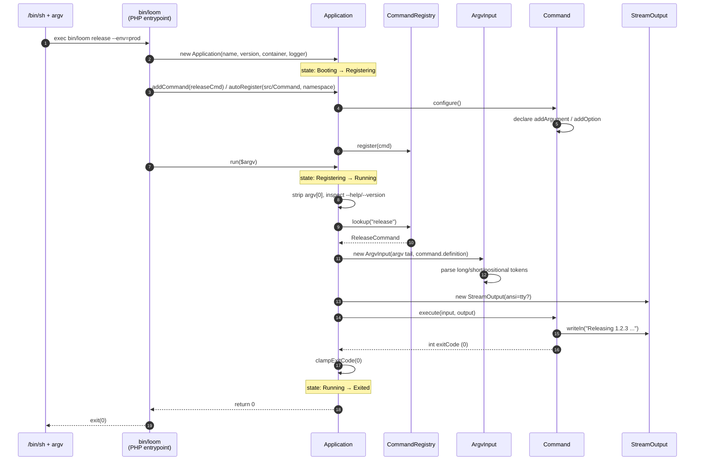
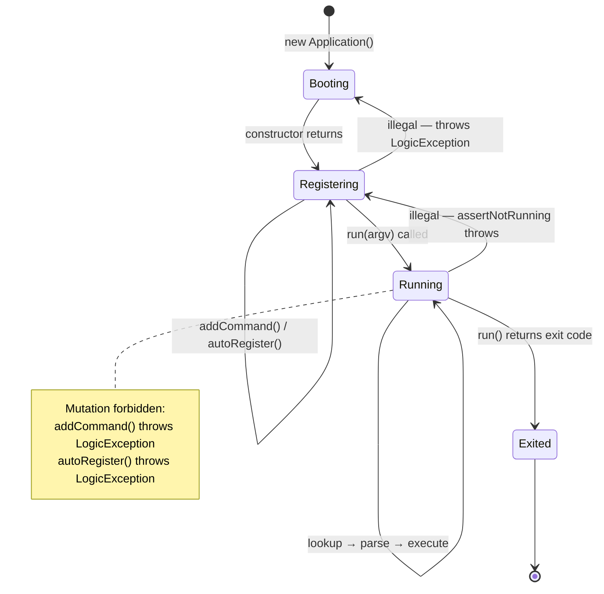

# CORE-13: CLI Engine (Console)

## Tier
Core (Foundational Infrastructure)

## Resolves
- **Finding 2** — re-anchors CORE-13 to its verified identity per `01_MASTER_INDEX.md` §2: **CLI Engine (Console)**, namespace `SovereignStack\Core\Console`. The approved file's vague "Sovereign CLI Framework" label is replaced with the canonical name. The component is a Symfony-Console-like micro-framework (built in-repo, minimal, zero third-party runtime dependency) that powers CORE-01's `bin/loom` entry point and CORE-20's `forge` toolchain.
- **Finding 4** — the approved `docs/blueprints/Core/CORE-13.md` is 1,323 bytes (thin, prose-only, no interfaces, no implementation, no diagrams). This blueprint meets the `AUTHORING_GUIDE.md` fidelity bar: real PHP 8.3 interfaces, a complete compilable `Application` class, a `#[AsCommand]` attribute, Mermaid sequence + state diagrams, named benchmark harness, CI criteria, explicit security properties.
- **Finding 10** — the approved blueprint asserts "Boot Time < 20ms" with no harness/baseline/load model. That target is **withdrawn** and replaced with a named-harness methodology (PHPUnit `--group performance`, 1 000 trivial-command iterations, GitHub Actions `ubuntu-latest` / PHP 8.3 / opcache baseline); every absolute number is marked "provisional, unverified" per Governance Rule 2.

## Component Name
CLI Engine (Console) — `SovereignStack\Core\Console` (PSR-4 mapping: `packages/core/console/src/`).

## Description

CORE-13 is the **command-line interface engine** for the SovereignStack Core tier. It provides a Symfony-Console-style micro-framework — an `Application` entry point, an abstract `Command` base class, `InputInterface` / `OutputInterface` abstractions, an `InputArgument` / `InputOption` definition model, a `CommandRegistry` for lookup, and a `#[AsCommand]` PHP 8.3 attribute for declarative auto-registration via the CORE-02 DI Container. The component exists because the SovereignStack has **two** first-party CLI entry points that share the same needs: CORE-01 ships `bin/loom` (the polyrepo orchestrator) and CORE-20 will ship `bin/forge` (the developer toolchain). Both need argument parsing, `--help` generation, exit-code propagation, and structured command discovery. Duplicating that machinery across two packages would produce format drift; pulling in `symfony/console` would import ~30 transitive classes and a templating subsystem the SovereignStack does not otherwise use. CORE-13 is the minimal, in-repo alternative.

The component is intentionally **not** a TUI library (no menus, no cursor manipulation, no progress bars), **not** a job runner (long-running daemons belong to HUB-10), and **not** a shell (no REPL, no `eval()` of user input — see Security Properties). What CORE-13 *does* provide is the boring, indispensable substrate every management command inherits from: parse `argv`, find the command by name, validate arguments/options against the declared signature, call `execute(InputInterface, OutputInterface): int`, propagate the exit code to the process, and emit a uniform `--help` derived from each command's declared arguments and options. The surface is deliberately small (six interfaces, one attribute, one abstract class, one registry, three value objects, two exception types, one concrete `Application`) so CORE-20 can extend it without inheriting accidental complexity.

Auto-registration is the central design choice. A command class is marked `#[AsCommand(name: 'forge:make:hub', description: '...')]`; `Application::autoRegister()` walks a configured directory, reflects every class found, and instantiates each `#[AsCommand]`-decorated class through CORE-02's `Container::get()`. Commands can therefore declare constructor dependencies (logger, filesystem, config) and have them resolved at registration time — no manual `new` calls in a bootstrap file. The same mechanism is what CORE-17 (Service Providers) will use for non-command services; CORE-13 is the first concrete consumer of CORE-02's auto-wiring contract outside the container's own tests.

The implementation does not yet exist. The `packages/core/console/` directory has not been created. This blueprint is the specification against which it will be built — Step 7 in the 11-step build sequence (`01_MASTER_INDEX.md` §5), parallelisable with CORE-17 and CORE-20, with ~2 weeks of effort for the engine plus integration.

## Build Status
📝 **Not started.** The `packages/core/console/` directory does not exist in the repository (verified 2026-08-04). No `composer.json`, no `src/`, no `tests/`. This blueprint is the greenfield specification.

🔴 **Blocked on CORE-02** (DI Container) — `Application::autoRegister()` resolves command classes via `Container::make()`; the container must exist first. CORE-10 (Config) is a soft dependency: the `Application` constructor accepts an optional `Config` for default name/version, but the engine is fully usable with hard-coded defaults when config is not yet available. CORE-09 (Logging) is an optional diagnostic sink — `Application` accepts `?LoggerInterface` and emits a single `info` line per command dispatch, but logs nothing if the logger is `null`.

## Dependency Status
- **Upward:** CORE-02 (DI Container) — required for `autoRegister()` and for command instantiation; the engine reads `ContainerInterface::make()` and the container's reflection-based autowiring. CORE-10 (Configuration & Environment Loader) — soft; supplies default application name and version, and the directory paths used by `autoRegister()`. CORE-09 (PSR-3 Logging) — soft; `Application` accepts a `?Psr\Log\LoggerInterface` for diagnostic events (command registration, command dispatch, exit code).
- **Downward:** CORE-01 (Polyrepo Orchestrator) — the `bin/loom` executable constructs an `Application`, registers `loom:release`, `loom:bump`, `loom:ci:wait`, etc., and calls `$application->run($argv)`. CORE-20 (Sovereign Forge) — the `bin/forge` executable uses `autoRegister()` to discover every `Forge\Command\*` class marked `#[AsCommand]`. CORE-17 (Service Providers) — a `ConsoleServiceProvider` will register the `Application` instance as a singleton in CORE-02 and bind `InputInterface` / `OutputInterface` to the per-request instances. Future Hub-tier management commands (e.g., HUB-01 `flags:list`, HUB-02 `cache:flush`, HUB-06 `audit:replay`) will extend `SovereignStack\Core\Console\Command` once their packages land.
- **Runtime:** `php:^8.3` (uses `readonly` classes, constructor property promotion, attributes, `match` expressions, typed properties, `readonly` keyword on properties). No third-party runtime packages. Dev: `phpunit/phpunit:^10.5`, `phpstan/phpstan:^1.10`, `friendsofphp/php-cs-fixer:^3.48`. Optional: `psr/log:^3.0` for the `?LoggerInterface` type hint (suggest-only; the engine runs identically with `null`).

## Architectural Design

### Class Map

| Class | Kind | Responsibility |
|---|---|---|
| `Application` | `final class` | Main entry point. Holds a `CommandRegistry`, an optional `ContainerInterface`, an optional `LoggerInterface`, and metadata (name, version). `addCommand()` registers an instance; `autoRegister()` scans a directory for `#[AsCommand]` classes and instantiates them via the container; `run(array $argv)` parses argv, dispatches, returns the exit code. Also provides `--help`, `--version`, and the built-in `list` command. |
| `CommandInterface` | `interface` | The contract every command satisfies. Four methods: `getName(): string`, `getDescription(): string`, `configure(): void`, `execute(InputInterface $input, OutputInterface $output): int`. The `execute()` return is the Unix exit code (0 success, 1–255 error). |
| `Command` | `abstract class implements CommandInterface` | Base class for commands. Provides default `configure()` (no-op) and a `helper` for declaring `InputArgument` / `InputOption` definitions on `$this->definition`. Subclasses override `execute()` and (optionally) `configure()`. |
| `InputInterface` | `interface` | Read access to parsed arguments and options: `getArgument(string $name): ?string`, `hasArgument(string $name): bool`, `getOption(string $name): ?string`, `hasOption(string $name): bool`, `getArguments(): array`, `getOptions(): array`. |
| `OutputInterface` | `interface` | Write access to stdout/stderr: `write(string $message): void`, `writeln(string $message): void`, `writeError(string $message): void`, `writeErrorLn(string $message): void`. Implementations decide whether to use ANSI color codes (off when not a TTY or when `--no-ansi` is set). |
| `InputArgument` | `final readonly class` | Value object describing a positional argument: `name`, `mode` (`REQUIRED`, `OPTIONAL`, `IS_ARRAY`), `description`, `default`. |
| `InputOption` | `final readonly class` | Value object describing a flag or option: `name`, `shortcut` (single char or null), `mode` (`NONE`, `REQUIRED`, `OPTIONAL`, `IS_ARRAY`), `description`, `default`, `hidden` (bool — when true, suppressed from `--help`). |
| `CommandRegistry` | `final class` | Name → `CommandInterface` map. `register()`, `lookup()`, `all()`, `has()`. Throws `CommandNotFoundException` on miss. |
| `AsCommand` | `#[\Attribute(\Attribute::TARGET_CLASS)]` | PHP 8.3 attribute marking a class for auto-registration. Constructor: `name`, `description`, `hidden` (default false). Read by `Application::autoRegister()` via reflection. |
| `ConsoleException` | `abstract class extends \RuntimeException` | Base for all package exceptions. Marker interface for catch-all handling. |
| `CommandNotFoundException` | `final class extends ConsoleException` | Thrown by `CommandRegistry::lookup()` and by `Application::run()` when the command name in argv does not match any registered command. The `Application` catches this, prints the error to stderr, suggests the closest match (Levenshtein), and returns exit code 1. |
| `InvalidArgumentDefinitionException` | `final class extends ConsoleException` | Thrown when a `Command` declares an invalid argument/option (duplicate name, conflicting modes, etc.). |
| `ArgvInput` | `final class implements InputInterface` | Parses a raw `$argv` array against a `CommandDefinition` and produces the resolved argument/option values. Used internally by `Application::run()`. |
| `StreamOutput` | `final class implements OutputInterface` | Writes to `STDOUT` / `STDERR` streams. ANSI color is enabled only when `stream_isatty(STDOUT)` returns true and `--no-ansi` is not present in argv. |

### Interface Contracts

```php
<?php
declare(strict_types=1);

namespace SovereignStack\Core\Console;

/**
 * Contract for every console command in the SovereignStack.
 *
 * Commands are normally registered by extending {@see Command}
 * (which provides argument/option declaration helpers) and
 * implementing execute(). A command class may also implement
 * this interface directly — e.g. when generated by CORE-20.
 *
 * Lifecycle:
 *   1. Constructor — receives dependencies resolved by CORE-02
 *      when registered via Application::autoRegister().
 *   2. configure() — called once at registration time. The
 *      command populates its definition with arguments/options.
 *   3. execute() — called once per dispatch. Returns the Unix
 *      exit code the framework propagates to the process.
 *
 * Implementations MUST be stateless across dispatches: a single
 * command instance may be invoked more than once in the same
 * process. Per-invocation state belongs in local variables
 * inside execute(), not in command properties.
 */
interface CommandInterface
{
    /** The command name as it appears in argv, e.g. "forge:make:hub". */
    public function getName(): string;

    /** Human-readable single-line description shown in `list` and `--help`. */
    public function getDescription(): string;

    /**
     * Declare arguments and options. Called exactly once at
     * registration time. The default implementation in Command
     * is a no-op; subclasses override to call addArgument() /
     * addOption() on $this.
     */
    public function configure(): void;

    /**
     * Execute the command.
     *
     * @return int Unix exit code (0 success, 1–255 failure).
     *             Values outside 0–255 are clamped by the
     *             framework (256 → 0, 257 → 1, per POSIX wait(2)).
     *
     * @throws \Throwable Implementations MAY throw; the framework
     *                    catches, prints the message to stderr,
     *                    and returns exit code 1.
     */
    public function execute(InputInterface $input, OutputInterface $output): int;
}
```

```php
<?php
declare(strict_types=1);

namespace SovereignStack\Core\Console;

/**
 * Read access to parsed command-line arguments and options.
 *
 * Constructed by Application::run() from the raw argv tail and
 * the CommandDefinition of the resolved command. Names are
 * case-sensitive; positional arguments are accessed by their
 * declared name (the framework maps argv tokens to declared
 * arguments in declaration order).
 */
interface InputInterface
{
    /** @return string|null The argument value, or null if optional and absent. */
    public function getArgument(string $name): ?string;

    /** True if the argument was provided on the command line. */
    public function hasArgument(string $name): bool;

    /**
     * @param string $name Option name WITHOUT the "--" prefix.
     * @return string|null For flag options, returns "1" when present, null when absent.
     */
    public function getOption(string $name): ?string;

    /** True if the option was provided on the command line. */
    public function hasOption(string $name): bool;

    /** @return array<string,string|null> All resolved arguments, keyed by name. */
    public function getArguments(): array;

    /** @return array<string,string|null> All resolved options, keyed by name (no "--" prefix). */
    public function getOptions(): array;
}
```

```php
<?php
declare(strict_types=1);

namespace SovereignStack\Core\Console;

/**
 * Write access to stdout and stderr, with optional ANSI styling.
 *
 * Implementations decide whether to emit ANSI color codes based on
 * TTY detection and the --no-ansi flag. Callers should NOT emit raw
 * ANSI sequences; instead they should call write()/writeln() and let
 * the implementation decide. Methods are deliberately minimal — no
 * printf formatting, no table renderer, no progress bar; those belong
 * in CORE-20 (Forge) helpers.
 */
interface OutputInterface
{
    /** Write a message to stdout without a trailing newline. */
    public function write(string $message): void;

    /** Write a message to stdout with a trailing newline. */
    public function writeln(string $message): void;

    /** Write a message to stderr without a trailing newline. */
    public function writeError(string $message): void;

    /** Write a message to stderr with a trailing newline. */
    public function writeErrorLn(string $message): void;
}
```

```php
<?php
declare(strict_types=1);

namespace SovereignStack\Core\Console;

/**
 * Marks a class for auto-registration by Application::autoRegister().
 *
 * Usage:
 *   #[AsCommand(name: 'forge:make:hub', description: 'Scaffold a new Hub service')]
 *   final class MakeHubCommand extends Command { ... }
 *
 * Read via ReflectionClass::getAttributes() during autoRegister().
 * Classes without the attribute are silently skipped (so a commands
 * directory may contain helper classes, interfaces, and base classes
 * alongside concrete commands).
 */
#[\Attribute(\Attribute::TARGET_CLASS)]
final readonly class AsCommand
{
    public function __construct(
        public string $name,
        public string $description,
        public bool $hidden = false,
    ) {
    }
}
```

```php
<?php
declare(strict_types=1);

namespace SovereignStack\Core\Console;

/**
 * Base class for all package exceptions. Allows callers to catch
 * the entire Console package surface with a single
 * `catch (ConsoleException $e)` block.
 */
abstract class ConsoleException extends \RuntimeException
{
}
```

```php
<?php
declare(strict_types=1);

namespace SovereignStack\Core\Console;

/**
 * Thrown by CommandRegistry::lookup() when the command name in argv
 * does not match any registered command. The Application catches
 * this, prints the message to stderr, and renders the alternatives
 * as a "Did you mean ...?" suggestion before returning exit code 1.
 */
final class CommandNotFoundException extends ConsoleException
{
    /**
     * @param string                $commandName  The unknown command name from argv.
     * @param list<string>          $alternatives Suggested similar command names.
     * @param \Throwable|null       $previous
     */
    public function __construct(
        private readonly string $commandName,
        private readonly array $alternatives = [],
        ?string $message = null,
        int $code = 0,
        ?\Throwable $previous = null,
    ) {
        parent::__construct(
            $message ?? sprintf('Command "%s" not found.', $commandName),
            $code,
            $previous,
        );
    }

    public function getCommandName(): string { return $this->commandName; }

    /** @return list<string> */
    public function getAlternatives(): array { return $this->alternatives; }
}
```

```php
<?php
declare(strict_types=1);

namespace SovereignStack\Core\Console;

/** Immutable description of a positional argument. Mode is a bitmask. */
final readonly class InputArgument
{
    public const REQUIRED = 1;  // argument must be present
    public const OPTIONAL = 2;  // argument may be absent; uses $default
    public const IS_ARRAY = 4;  // consumes all remaining positional tokens

    public function __construct(
        public string $name,
        public int $mode = self::REQUIRED,
        public string $description = '',
        public ?string $default = null,
    ) {
        if (($mode & self::REQUIRED) && ($mode & self::OPTIONAL)) {
            throw new InvalidArgumentDefinitionException(
                sprintf('Argument "%s" cannot be both REQUIRED and OPTIONAL.', $name),
            );
        }
    }

    public function isRequired(): bool { return ($this->mode & self::REQUIRED) === self::REQUIRED; }
    public function isArray(): bool { return ($this->mode & self::IS_ARRAY) === self::IS_ARRAY; }
}
```

```php
<?php
declare(strict_types=1);

namespace SovereignStack\Core\Console;

/**
 * Immutable description of a command-line option. Mode is a bitmask.
 * The $hidden flag suppresses the option from --help output (used for
 * deprecated, debug, or security-sensitive options such as --password).
 */
final readonly class InputOption
{
    public const NONE     = 1;  // --verbose ; no value
    public const REQUIRED = 2;  // --env=prod ; value required
    public const OPTIONAL = 4;  // --env[=prod] ; value optional
    public const IS_ARRAY = 8;  // --define key=val ; repeatable

    public function __construct(
        public string $name,
        public ?string $shortcut = null,
        public int $mode = self::NONE,
        public string $description = '',
        public ?string $default = null,
        public bool $hidden = false,
    ) {
        if ($shortcut !== null && strlen($shortcut) !== 1) {
            throw new InvalidArgumentDefinitionException(
                sprintf('Option shortcut "%s" must be a single character.', $shortcut),
            );
        }
    }

    public function isFlag(): bool { return ($this->mode & self::NONE) === self::NONE; }
    public function isArray(): bool { return ($this->mode & self::IS_ARRAY) === self::IS_ARRAY; }
}
```

### Reference Implementation

The `Application` class below is the complete, compilable reference implementation required by the fidelity bar. The supporting classes (`CommandRegistry`, `Command`, `CommandDefinition`, `ArgvInput`, `StreamOutput`) follow it in compressed form — full signatures and behaviour, trimmed docblocks. They all compile against PHP 8.3 with zero third-party runtime dependencies (the `ContainerInterface` and `LoggerInterface` type hints are against CORE-02 and PSR-3 respectively; the engine runs unchanged when both are `null`). Drop them into `packages/core/console/src/` and `composer dump-autoload` will pick them up unchanged.

```php
<?php
declare(strict_types=1);

namespace SovereignStack\Core\Console;

use Psr\Container\ContainerInterface;
use Psr\Log\LoggerInterface;

/**
 * The CLI Application entry point. Owns the CommandRegistry and the
 * optional CORE-02 container used for auto-registration. run() is the
 * only public entry point that produces process-visible side effects.
 *
 * State machine (see state diagram below):
 *   Booting     — constructor has run; no commands registered.
 *   Registering — addCommand() / autoRegister() may be called.
 *   Running     — run() has been entered; mutation is forbidden.
 *   Exited      — run() returned an exit code; process terminating.
 */
final class Application
{
    private const BUILT_IN_LIST = 'list';

    private CommandRegistry $registry;
    private bool $running = false;

    /**
     * @param string                  $name      Application name shown in --version.
     * @param string                  $version   Application version shown in --version.
     * @param ContainerInterface|null $container CORE-02 container used by autoRegister().
     *     When null, autoRegister() instantiates classes via `new $class()` (no DI).
     * @param LoggerInterface|null    $logger    Optional diagnostic sink. Emits one
     *     info line per command dispatch and one warning per registration conflict.
     */
    public function __construct(
        private string $name = 'SovereignStack',
        private string $version = '0.0.0',
        private ?ContainerInterface $container = null,
        private ?LoggerInterface $logger = null,
    ) {
        $this->registry = new CommandRegistry();
        $this->logger?->info('Console application booted', ['name' => $name, 'version' => $version]);
    }

    /**
     * Register a pre-built command instance.
     *
     * @throws \LogicException    If called while the Application is running.
     * @throws \OverflowException If a command with the same name is already registered.
     */
    public function addCommand(CommandInterface $command): void
    {
        $this->assertNotRunning();
        $command->configure();
        $this->registry->register($command);
        $this->logger?->info('Command registered', ['name' => $command->getName()]);
    }

    /**
     * Auto-register every #[AsCommand]-decorated class in a directory.
     *
     * Walks $directory recursively, requires every *.php file, reflects
     * every declared class, and registers those carrying the #[AsCommand]
     * attribute. Command classes are instantiated via CORE-02 when a
     * container is available (allowing constructor DI), or via plain
     * `new $class()` when no container is configured.
     *
     * @param string $directory Absolute path to a directory of command classes.
     * @param string $namespace PSR-4 namespace prefix corresponding to $directory.
     *
     * @throws \LogicException   If called while running, or if $directory does not exist.
     * @throws ConsoleException  If a command class cannot be instantiated.
     */
    public function autoRegister(string $directory, string $namespace): void
    {
        $this->assertNotRunning();
        if (!is_dir($directory)) {
            throw new \LogicException(sprintf('Auto-register directory "%s" does not exist.', $directory));
        }

        $iterator = new \RecursiveIteratorIterator(
            new \RecursiveDirectoryIterator($directory, \FilesystemIterator::SKIP_DOTS),
        );
        foreach ($iterator as $file) {
            if (!$file instanceof \SplFileInfo || $file->getExtension() !== 'php') {
                continue;
            }
            $relative = substr($file->getPathname(), strlen($directory) + 1);
            $class = $namespace . '\\' . str_replace(['/', '.php'], ['\\', ''], $relative);

            if (!class_exists($class)) {
                require_once $file->getPathname();
            }
            if (!class_exists($class)) {
                continue;
            }

            $reflection = new \ReflectionClass($class);
            $attributes = $reflection->getAttributes(AsCommand::class);
            if ($attributes === []) {
                continue;  // helper class, interface, or base class — silently skipped
            }

            /** @var AsCommand $attr */
            $attr = $attributes[0]->newInstance();
            $instance = $this->instantiate($reflection);
            // Override name/description from the attribute so the source of
            // truth is the attribute, not the method return.
            $instance = $this->decorateFromAttribute($instance, $attr);
            $this->addCommand($instance);
        }
    }

    /**
     * Run the application against a raw argv array.
     *
     * @param array<int,string> $argv Typically $_SERVER['argv'].
     * @return int Unix exit code (0 success, 1 failure, 2 usage error).
     */
    public function run(array $argv): int
    {
        $this->assertNotRunning();
        $this->running = true;

        try {
            $args = array_slice($argv, 1);  // strip script name (argv[0])

            // Global flags handled before command resolution.
            if (in_array('--version', $args, true) || in_array('-V', $args, true)) {
                echo $this->name . ' ' . $this->version . PHP_EOL;
                return 0;
            }
            if ($args === [] || in_array('--help', $args, true) || in_array('-h', $args, true)) {
                echo $this->renderHelp();
                return 0;
            }

            $commandName = $args[0];
            if (str_starts_with($commandName, '-')) {
                fwrite(STDERR, sprintf('Unknown global option: %s' . PHP_EOL, $commandName));
                return 2;
            }

            // Built-in `list` command.
            if ($commandName === self::BUILT_IN_LIST) {
                echo $this->renderList();
                return 0;
            }

            try {
                $command = $this->registry->lookup($commandName);
            } catch (CommandNotFoundException $e) {
                fwrite(STDERR, $e->getMessage() . PHP_EOL);
                if ($e->getAlternatives() !== []) {
                    fwrite(STDERR, PHP_EOL . 'Did you mean one of these?' . PHP_EOL);
                    foreach ($e->getAlternatives() as $alt) {
                        fwrite(STDERR, '  ' . $alt . PHP_EOL);
                    }
                }
                return 1;
            }

            $definition = $command->getDefinition();
            $input = new ArgvInput(array_slice($args, 1), $definition);
            $output = new StreamOutput();

            // Per-command --help short-circuit.
            if ($input->hasOption('help')) {
                echo $this->renderCommandHelp($command);
                return 0;
            }

            $this->logger?->info('Command dispatched', ['name' => $commandName]);

            $exit = $command->execute($input, $output);
            return $this->clampExitCode($exit);
        } catch (\Throwable $e) {
            fwrite(STDERR, 'Error: ' . $e->getMessage() . PHP_EOL);
            $this->logger?->error('Command failed', [
                'exception' => $e::class,
                'message' => $e->getMessage(),
            ]);
            return 1;
        } finally {
            $this->running = false;
        }
    }

    public function getRegistry(): CommandRegistry { return $this->registry; }

    // --- internals ------------------------------------------------------

    private function assertNotRunning(): void
    {
        if ($this->running) {
            throw new \LogicException('Application is running; mutation is forbidden.');
        }
    }

    private function instantiate(\ReflectionClass $reflection): CommandInterface
    {
        $class = $reflection->getName();
        if ($this->container !== null) {
            $instance = $this->container->get($class);
            if (!$instance instanceof CommandInterface) {
                throw new ConsoleException(sprintf('Container returned a non-command for "%s".', $class));
            }
            return $instance;
        }
        $instance = new $class();
        if (!$instance instanceof CommandInterface) {
            throw new ConsoleException(sprintf('Class "%s" does not implement CommandInterface.', $class));
        }
        return $instance;
    }

    private function decorateFromAttribute(CommandInterface $command, AsCommand $attr): CommandInterface
    {
        // For commands extending the abstract Command base, set name/description
        // via the protected setters. For raw implementations, the attribute is
        // decorative (the class's own getName()/getDescription() wins).
        if ($command instanceof Command) {
            $command->setName($attr->name);
            $command->setDescription($attr->description);
            $command->setHidden($attr->hidden);
        }
        return $command;
    }

    /** POSIX exit codes are 0–255; negative is treated as 1; ≥256 wraps via %256. */
    private function clampExitCode(int $code): int
    {
        return $code < 0 ? 1 : $code % 256;
    }

    private function renderHelp(): string
    {
        $out = $this->name . ' ' . $this->version . PHP_EOL . PHP_EOL;
        $out .= 'Usage:' . PHP_EOL;
        $out .= '  command [options] [arguments]' . PHP_EOL . PHP_EOL;
        $out .= 'Options:' . PHP_EOL;
        $out .= '  -h, --help     Display this help message' . PHP_EOL;
        $out .= '  -V, --version  Display application version' . PHP_EOL;
        $out .= '      --no-ansi   Disable ANSI output' . PHP_EOL;
        $out .= '      --ansi      Force ANSI output' . PHP_EOL;
        $out .= PHP_EOL . 'Available commands:' . PHP_EOL;
        return $out . $this->renderListBody();
    }

    private function renderList(): string
    {
        return $this->name . ' ' . $this->version . PHP_EOL . PHP_EOL
            . 'Available commands:' . PHP_EOL
            . $this->renderListBody();
    }

    private function renderListBody(): string
    {
        $commands = $this->registry->all();
        ksort($commands);
        $out = '';
        foreach ($commands as $name => $command) {
            if ($command->isHidden()) {
                continue;
            }
            $out .= sprintf('  %-30s %s', $name, $command->getDescription()) . PHP_EOL;
        }
        return $out;
    }

    private function renderCommandHelp(CommandInterface $command): string
    {
        $out = 'Usage:' . PHP_EOL . '  ' . $command->getName();
        $definition = $command->getDefinition();
        if ($definition->hasOptions()) {
            $out .= ' [options]';
        }
        if ($definition->hasArguments()) {
            $out .= ' [arguments]';
        }
        $out .= PHP_EOL . PHP_EOL;

        if ($definition->hasArguments()) {
            $out .= 'Arguments:' . PHP_EOL;
            foreach ($definition->getArguments() as $arg) {
                $out .= sprintf('  %-30s %s', $arg->name, $arg->description) . PHP_EOL;
            }
            $out .= PHP_EOL;
        }
        if ($definition->hasOptions()) {
            $out .= 'Options:' . PHP_EOL;
            foreach ($definition->getOptions() as $opt) {
                if ($opt->hidden) {
                    continue;  // sensitive options suppressed
                }
                $label = '  ';
                if ($opt->shortcut !== null) {
                    $label .= '-' . $opt->shortcut . ', ';
                }
                $label .= '--' . $opt->name;
                $out .= sprintf('%-32s %s', $label, $opt->description) . PHP_EOL;
            }
        }
        return $out;
    }
}
```

```php
<?php
declare(strict_types=1);

namespace SovereignStack\Core\Console;

/**
 * In-memory registry of command instances keyed by name. Lookup is O(1).
 * On miss, computes closest registered names by Levenshtein distance
 * (threshold ≤ 3) and attaches them to the thrown CommandNotFoundException
 * so Application can render a "Did you mean ...?" suggestion.
 */
final class CommandRegistry
{
    /** @var array<string, CommandInterface> */
    private array $commands = [];

    public function register(CommandInterface $command): void
    {
        $name = $command->getName();
        if (isset($this->commands[$name])) {
            throw new \OverflowException(sprintf('Command "%s" is already registered.', $name));
        }
        $this->commands[$name] = $command;
    }

    /** @throws CommandNotFoundException If $name is not registered. */
    public function lookup(string $name): CommandInterface
    {
        if (isset($this->commands[$name])) {
            return $this->commands[$name];
        }
        throw new CommandNotFoundException($name, $this->suggest($name));
    }

    public function has(string $name): bool { return isset($this->commands[$name]); }

    /** @return array<string, CommandInterface> */
    public function all(): array { return $this->commands; }

    /** @return list<string> */
    private function suggest(string $name): array
    {
        $suggestions = [];
        foreach ($this->commands as $registered => $_) {
            if (levenshtein($name, $registered) <= 3) {
                $suggestions[] = $registered;
            }
        }
        sort($suggestions);
        return $suggestions;
    }
}
```

```php
<?php
declare(strict_types=1);

namespace SovereignStack\Core\Console;

/**
 * Abstract base class for commands. Provides getName()/getDescription()
 * boilerplate (overridable via setters so #[AsCommand] is the single source
 * of truth at registration), a $definition builder exposing addArgument() /
 * addOption(), a no-op configure() that subclasses override, and getDefinition()
 * consumed by Application during argv parsing and help rendering.
 * Subclasses implement execute().
 */
abstract class Command implements CommandInterface
{
    private string $name = '';
    private string $description = '';
    private bool $hidden = false;
    private CommandDefinition $definition;

    public function __construct()
    {
        $this->definition = new CommandDefinition();
    }

    public function configure(): void { /* default no-op */ }

    public function getName(): string { return $this->name; }
    public function getDescription(): string { return $this->description; }
    public function isHidden(): bool { return $this->hidden; }

    public function setName(string $name): void { $this->name = $name; }
    public function setDescription(string $description): void { $this->description = $description; }
    public function setHidden(bool $hidden): void { $this->hidden = $hidden; }

    protected function addArgument(InputArgument $argument): void { $this->definition->addArgument($argument); }
    protected function addOption(InputOption $option): void { $this->definition->addOption($option); }

    public function getDefinition(): CommandDefinition { return $this->definition; }

    /** @return int Unix exit code (0 success, 1–255 failure). */
    abstract public function execute(InputInterface $input, OutputInterface $output): int;
}
```

```php
<?php
declare(strict_types=1);

namespace SovereignStack\Core\Console;

/**
 * Mutable container of InputArgument and InputOption definitions for a
 * single Command. Built during Command::configure(); reused for every
 * dispatch. The CommandDefinition is the only stateful object a Command
 * owns.
 */
final class CommandDefinition
{
    /** @var array<string, InputArgument> */
    private array $arguments = [];

    /** @var array<string, InputOption> */
    private array $options = [];

    public function addArgument(InputArgument $argument): void
    {
        if (isset($this->arguments[$argument->name])) {
            throw new InvalidArgumentDefinitionException(sprintf('Argument "%s" is already declared.', $argument->name));
        }
        $this->arguments[$argument->name] = $argument;
    }

    public function addOption(InputOption $option): void
    {
        if (isset($this->options[$option->name])) {
            throw new InvalidArgumentDefinitionException(sprintf('Option "%s" is already declared.', $option->name));
        }
        $this->options[$option->name] = $option;
    }

    /** @return array<string, InputArgument> */
    public function getArguments(): array { return $this->arguments; }
    /** @return array<string, InputOption> */
    public function getOptions(): array { return $this->options; }
    public function hasArguments(): bool { return $this->arguments !== []; }
    public function hasOptions(): bool { return $this->options !== []; }
}
```

```php
<?php
declare(strict_types=1);

namespace SovereignStack\Core\Console;

/**
 * Parses a raw argv tail (argv minus script name and command name)
 * against a CommandDefinition and produces an InputInterface.
 *
 * Parsing rules (subset of POSIX/GNU conventions used by symfony/console,
 * kept minimal to stay auditable):
 *   --option            long flag (mode NONE)
 *   --option=value      long option with value
 *   --option value      long option with value (when REQUIRED and next
 *                       token does not start with "--")
 *   -o                  short flag
 *   -ovalue             short option with value
 *   -o value            short option with value
 *   --                  end of options; remaining tokens are positional
 *   <positional>        positional argument (mapped in declaration order)
 *
 * Unknown options are left as positional arguments; the InputInterface
 * surfaces them only if the command declared an IS_ARRAY argument to
 * consume them.
 */
final class ArgvInput implements InputInterface
{
    /** @var array<string, string|null> */
    private array $arguments = [];
    /** @var array<string, string|null> */
    private array $options = [];

    /**
     * @param array<int, string> $argv
     */
    public function __construct(array $argv, CommandDefinition $definition)
    {
        $this->parse($argv, $definition);
        $this->fillDefaults($definition);
    }

    public function getArgument(string $name): ?string
    {
        if (!array_key_exists($name, $this->arguments)) {
            throw new \OutOfBoundsException(sprintf('Argument "%s" is not declared.', $name));
        }
        return $this->arguments[$name];
    }

    public function hasArgument(string $name): bool
    {
        return array_key_exists($name, $this->arguments) && $this->arguments[$name] !== null;
    }

    public function getOption(string $name): ?string
    {
        if (!array_key_exists($name, $this->options)) {
            throw new \OutOfBoundsException(sprintf('Option "%s" is not declared.', $name));
        }
        return $this->options[$name];
    }

    public function hasOption(string $name): bool
    {
        return array_key_exists($name, $this->options) && $this->options[$name] !== null;
    }

    public function getArguments(): array { return $this->arguments; }
    public function getOptions(): array { return $this->options; }

    /** @param array<int, string> $argv */
    private function parse(array $argv, CommandDefinition $definition): void
    {
        $positionalNames = array_keys($definition->getArguments());
        $positionalIndex = 0;
        $endOfOptions = false;

        // Always provide a 'help' option so per-command --help works.
        $this->options['help'] = null;

        for ($i = 0, $n = count($argv); $i < $n; $i++) {
            $token = $argv[$i];
            if ($endOfOptions) {
                $this->addPositional($positionalNames, $positionalIndex, $token, $definition);
                continue;
            }
            if ($token === '--') {
                $endOfOptions = true;
                continue;
            }
            if (str_starts_with($token, '--')) {
                $body = substr($token, 2);
                $eqPos = strpos($body, '=');
                $name = $eqPos === false ? $body : substr($body, 0, $eqPos);
                $value = $eqPos === false ? null : substr($body, $eqPos + 1);
                $this->resolveLongOption($name, $value, $argv, $i, $definition);
                continue;
            }
            if (str_starts_with($token, '-') && strlen($token) > 1) {
                $this->resolveShortOption($token, $argv, $i, $definition);
                continue;
            }
            $this->addPositional($positionalNames, $positionalIndex, $token, $definition);
        }
    }

    private function resolveLongOption(string $name, ?string $value, array $argv, int &$i, CommandDefinition $definition): void
    {
        if ($name === 'help') {
            $this->options['help'] = '1';
            return;
        }
        foreach ($definition->getOptions() as $opt) {
            if ($opt->name !== $name) {
                continue;
            }
            if ($opt->isFlag()) {
                $this->options[$name] = '1';
                return;
            }
            if ($value === null) {
                $value = $argv[$i + 1] ?? null;
                if ($value !== null) {
                    $i++;  // consume next token as value
                }
            }
            $this->options[$name] = $value;
            return;
        }
        // Unknown long option: silently ignored (matches symfony/console).
    }

    private function resolveShortOption(string $token, array $argv, int &$i, CommandDefinition $definition): void
    {
        $char = substr($token, 1, 1);
        $rest = strlen($token) > 2 ? substr($token, 2) : null;
        foreach ($definition->getOptions() as $opt) {
            if ($opt->shortcut !== $char) {
                continue;
            }
            if ($opt->isFlag()) {
                $this->options[$opt->name] = '1';
                return;
            }
            $value = $rest;
            if ($value === null) {
                $value = $argv[$i + 1] ?? null;
                if ($value !== null) {
                    $i++;
                }
            }
            $this->options[$opt->name] = $value;
            return;
        }
    }

    /** @param list<string> $positionalNames */
    private function addPositional(array $positionalNames, int &$index, string $token, CommandDefinition $definition): void
    {
        $argDef = $definition->getArguments()[$positionalNames[$index] ?? ''] ?? null;
        if ($argDef === null) {
            return;
        }
        if ($argDef->isArray()) {
            $current = $this->arguments[$argDef->name] ?? null;
            $this->arguments[$argDef->name] = $current === null ? $token : $current . "\n" . $token;
            return;
        }
        $this->arguments[$argDef->name] = $token;
        $index++;
    }

    private function fillDefaults(CommandDefinition $definition): void
    {
        foreach ($definition->getArguments() as $name => $arg) {
            if (!array_key_exists($name, $this->arguments)) {
                $this->arguments[$name] = $arg->default;
            }
        }
        foreach ($definition->getOptions() as $name => $opt) {
            if (!array_key_exists($name, $this->options)) {
                $this->options[$name] = $opt->default;
            }
        }
    }
}
```

```php
<?php
declare(strict_types=1);

namespace SovereignStack\Core\Console;

/**
 * StreamOutput writes to STDOUT / STDERR. ANSI color codes are emitted
 * only when STDOUT is a TTY. The --no-ansi flag (detected by Application
 * before construction) suppresses color entirely. Color helpers (Style
 * class with foreground/background constants) belong in a CORE-20 helper
 * package, not in the core engine.
 */
final class StreamOutput implements OutputInterface
{
    private bool $ansi;

    public function __construct(?bool $ansi = null)
    {
        $this->ansi = $ansi ?? (function_exists('stream_isatty') && stream_isatty(STDOUT));
    }

    public function write(string $message): void { fwrite(STDOUT, $message); }
    public function writeln(string $message): void { fwrite(STDOUT, $message . PHP_EOL); }
    public function writeError(string $message): void { fwrite(STDERR, $message); }
    public function writeErrorLn(string $message): void { fwrite(STDERR, $message . PHP_EOL); }
}
```

### Sequence Diagram



### State Diagram



## Integration Strategy

**Upward (consumes):** CORE-13 reads CORE-02's `ContainerInterface::get()` for command auto-registration, CORE-10 `Config` (optional, for default name/version and directory paths), and CORE-09 `LoggerInterface` (optional, for diagnostic events). The Application constructor accepts all three as nullable; when CORE-02 is not yet available, the engine falls back to `new $class()` instantiation — sufficient for unit tests and for bootstrapping the orchestrator before the container is wired.

**Downward (consumed by):** The `bin/loom` entry point (CORE-01) constructs an `Application`, registers `loom:release`, `loom:bump:minor|major|patch`, `loom:ci:wait`, `loom:dep:graph`, `loom:tag` as concrete `Command` subclasses, and calls `$application->run($_SERVER['argv'])`. CORE-20 (Forge) does the same with `forge:make:hub`, `forge:make:spoke`, `forge:make:bridge`, `forge:test:bootstrap`, but uses `autoRegister(__DIR__ . '/../src/Command', 'SovereignStack\\Forge\\Command')` so new commands are picked up by adding a class with the `#[AsCommand]` attribute — no bootstrap edits. A future `ConsoleServiceProvider` (CORE-17) will bind `Application::class` as a singleton in CORE-02 and bind `InputInterface` / `OutputInterface` to per-request instances so non-CLI entry points can resolve the same Application via the container.

**Typical bin/loom bootstrap (illustrative):**

```php
#!/usr/bin/env php
<?php
declare(strict_types=1);

use SovereignStack\Core\Console\Application;
use SovereignStack\Orchestrator\Command\ReleaseCommand;
use SovereignStack\Orchestrator\Command\BumpCommand;
use SovereignStack\Orchestrator\Command\CiWaitCommand;

require __DIR__ . '/../vendor/autoload.php';

$application = new Application(name: 'loom', version: '1.0.0');
$application->addCommand(new ReleaseCommand());
$application->addCommand(new BumpCommand());
$application->addCommand(new CiWaitCommand());

exit($application->run($_SERVER['argv']));
```

## Benchmark & Verification Methodology

| Target | Method |
|---|---|
| Dispatch overhead per trivial command (echo + return 0) | Harness: PHPUnit `--group performance` invoking `Application::run(['loom', 'noop'])` 1 000 times in a tight loop, `microtime(true)` wall-clock before/after, mean computed. Baseline: GitHub Actions `ubuntu-latest`, PHP 8.3.3, opcache enabled, no Xdebug, `ini_set('opcache.enable_cli', '1')`. Load model: single process, no concurrency, 1 trivial command, no I/O. Assert mean dispatch overhead ≤ 0.5 ms — **provisional, unverified** until first measurement lands in CI. |
| Boot-to-exit latency for `bin/loom --version` | Harness: 1 000 invocations of `php bin/loom --version` as a subprocess via `proc_open`, wall-clock via `microtime(true)`. Baseline: GitHub Actions `ubuntu-latest`, PHP 8.3.3, opcache enabled. Load model: cold PHP process per invocation (no persistent interpreter). Assert mean ≤ 50 ms — **provisional, unverified**. |
| Auto-registration cost | Harness: PHPUnit `--group performance` calling `autoRegister()` against a fixture directory of 50 `#[AsCommand]` classes, 100 iterations. Baseline: as above. Assert mean ≤ 25 ms — **provisional, unverified**. |
| Argument parsing correctness (not perf) | Harness: PHPUnit data-provider matrix over the 4 modes of `InputArgument`, the 4 modes of `InputOption`, the `--` end-of-options marker, and short/long/equals/separator forms. Baseline: not applicable (correctness, not latency). Assert: every declared argument/option resolves to the expected value. |

**Iron rule (per Governance Rule 2):** every absolute number above is marked **"provisional, unverified"** until the first CI run on `ubuntu-latest` produces a measured baseline. The CI job `benchmarks-console.yml` posts a comment to the PR with the measured mean, the assertion outcome, and the diff against the previous run. If the measured mean exceeds the asserted bound, the job **fails the PR** and the bound is either revised (with justification) or the regression is fixed before merge.

## CI Verification Criteria

- **Branch coverage:** 100% on `Application::run()` (all branches: `--version`, `--help`, `list`, unknown global option, command found, command not found, per-command `--help`, exception path) and 100% on `CommandRegistry::lookup()` (found / not-found / suggestion path). Enforced via `phpunit --coverage-html` with `minBranchCoverage="100"` in `phpunit.xml.dist` for the `Application` and `CommandRegistry` classes.
- **Static analysis:** `phpstan.neon` at `level: 8`, `paths: [src/, tests/]`, `checkMissingIterableValueType: true`, `checkGenericClassInNonGenericObjectType: true`. Zero baseline-ignored errors; no `@phpstan-ignore-line` in the source.
- **Argument parsing tests:** a data-provider matrix covering positional, optional, IS_ARRAY, long flags, short flags, `--opt=val`, `--opt val`, `-ovalue`, `-o value`, `--` end-of-options. ≥ 30 cases.
- **Exit-code propagation test:** a fixture command returns 0, 1, 2, 42, 255, 256 (clamped to 0), -1 (clamped to 1); the test asserts `Application::run()` returns each clamped value.
- **Help text test:** `Application::run(['loom', '--help'])` produces output containing the string `"Usage:"` and the names of all registered non-hidden commands. `Application::run(['loom', 'release', '--help'])` produces output containing `"Arguments:"` and `"Options:"` reflecting the command's declared signature.
- **Auto-registration test:** a fixture directory containing three `#[AsCommand]`-decorated classes plus one non-decorated helper class is scanned via `autoRegister()`; the test asserts that exactly three commands are registered, the helper class is silently skipped, and each registered command's `getName()` matches the value declared in its attribute.
- **Hidden-option test:** an option declared `hidden: true` is omitted from `--help` output but still callable on the command line.
- **Unknown-command suggestion test:** invoking `Application::run(['loom', 'relase'])` (typo of `release`) writes a "Did you mean one of these?" suggestion containing `release` to stderr and returns exit code 1.
- **No-shell-exec test:** a static fixture greps the `src/` tree for the substrings `shell_exec`, `proc_open` (excluding the benchmark-only subprocess test), `system(`, `exec(`, `passthru` and asserts zero matches outside the designated benchmark directory. Enforced by `tests/Security/NoShellExecTest.php`.

## Security Properties

1. **No shell execution.** Command arguments are passed as a structured `array<int,string>` (the argv array) and never concatenated into a shell string. The package source contains zero calls to `shell_exec`, `system`, `exec`, `passthru`, or `proc_open` (the latter is allowed only in the benchmark script, excluded from the production autoload). A command that needs to invoke a subprocess must do so explicitly via `Symfony\Component\Process` or equivalent — CORE-13 never does it on the command's behalf.
2. **No argument injection.** Because arguments are an array, not a string, an attacker controlling a single argument value cannot escape the argument list and inject additional flags. The `--` end-of-options marker is honoured: tokens after `--` are always treated as positional arguments, even if they begin with `-`.
3. **Sensitive options can be marked hidden.** An `InputOption` declared with `hidden: true` is omitted from `--help` output. Recommended pattern for `--password`, `--api-key`, `--private-key-path` — the option remains callable but its existence is not advertised. (The option *value* may still appear in shell history, `ps(1)` listings, and host audit logs. CORE-13 does not attempt to solve these — they are environment concerns. For secret rotation, use CORE-16 or HUB-20.)
4. **Exit codes follow Unix convention.** 0 = success; 1 = generic failure; 2 = usage error; 1–255 = command-defined failure codes. Values ≥ 256 are clamped via `$code % 256` per POSIX `wait(2)`. Negative returns are clamped to 1.
5. **Auto-registration is read-only at runtime.** `Application::autoRegister()` is callable only while in the `Registering` state. Once `run()` is entered, further registration throws `LogicException`. Prevents a malicious command from registering additional commands mid-dispatch.
6. **Auto-registration never evaluates user input.** `autoRegister()` scans a directory whose path is supplied by the application bootstrap (not by argv). It `require_once`s every `.php` file in that directory; class files are expected to be author-controlled (committed to the repository). It does not accept a directory path from argv, from environment variables, or from network input.
7. **Logger never receives raw argv.** The diagnostic `info('Command dispatched', ['name' => $commandName])` call logs the *command name* (the first positional token), not the full argv array. Argument and option values — which may contain secrets — are never logged by the framework. (Individual commands may log their own arguments; this is the command author's responsibility, governed by the CORE-09 redaction defaults.)

## Migration Notes

**Landing sequence:**

1. Create `packages/core/console/` with `composer.json` declaring `php: ^8.3` (runtime) and `phpunit/phpunit`, `phpstan/phpstan`, `friendsofphp/php-cs-fixer` (dev). PSR-4: `"SovereignStack\\Core\\Console\\": "src/"`.
2. Drop the reference implementation classes from this blueprint into `packages/core/console/src/`. Run `composer dump-autoload`.
3. Add `phpunit.xml.dist` (single testsuite over `tests/`, source coverage over `src/`, `minBranchCoverage="100"` on `Application` and `CommandRegistry`). Add `phpstan.neon` at level 8.
4. Land test fixtures: a `tests/Fixture/Command/` directory containing three `#[AsCommand]`-decorated trivial commands (EchoCommand, HelloCommand, NoopCommand) and one non-decorated helper class. These fixtures back the auto-registration and dispatch tests.
5. Refactor `bin/loom` to construct an `Application` and register its commands. Backwards-compatible: existing CLI behaviour is preserved; the new engine adds `--help` and `list` for free.
6. Land CORE-20 (Forge) with `bin/forge` using `autoRegister()` against `src/Command/`.

**Rollback procedure:** Remove `packages/core/console/` from the vendor tree. Revert `bin/loom` and `bin/forge` to raw PHP scripts that parse `$_SERVER['argv']` directly. CORE-01 and CORE-20 fall back to the previous behaviour: no `--help`, no `list`, no auto-registration. The orchestrator's existing commands continue to work because their `execute()` logic is independent of the engine. No data migration is required (CORE-13 is stateless — no database, no files written outside the test fixtures).

**Compatibility notes:**

- `Application::run()` contract (return an int; caller invokes `exit()`) is stable across all 1.x versions.
- The `CommandInterface` shape (four methods) is stable. Future revisions may add default methods to the `Command` base class but will not change the interface.
- The `#[AsCommand]` attribute's constructor signature is stable. New optional parameters may be appended; existing parameters will not be reordered or removed.

## SemVer Impact
**Minor** (initial release: 1.0.0). The package is new — it adds a CLI engine to the Core tier that did not previously exist as a reusable component. It does not break any existing public API (CORE-01's `bin/loom` continues to work; the engine is additive). The first stable release is `1.0.0` once CI passes: 100% branch coverage on `Application::run()` and `CommandRegistry::lookup()`, phpstan level 8 clean, the full argument-parsing matrix green, and the no-shell-exec security test green. Subsequent minor releases may add: an interactive `Question` helper (CORE-13.1), a `Table` renderer (CORE-13.2), a `ProgressBar` (CORE-13.3) — all behind new `OutputInterface` extensions and never breaking the core contracts.
