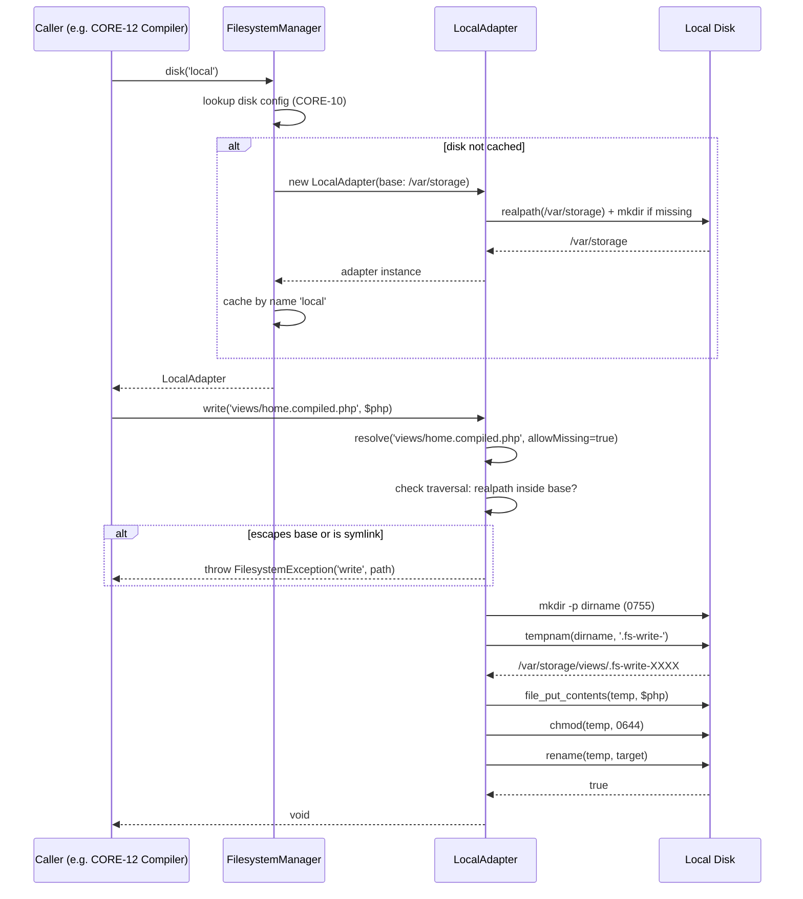
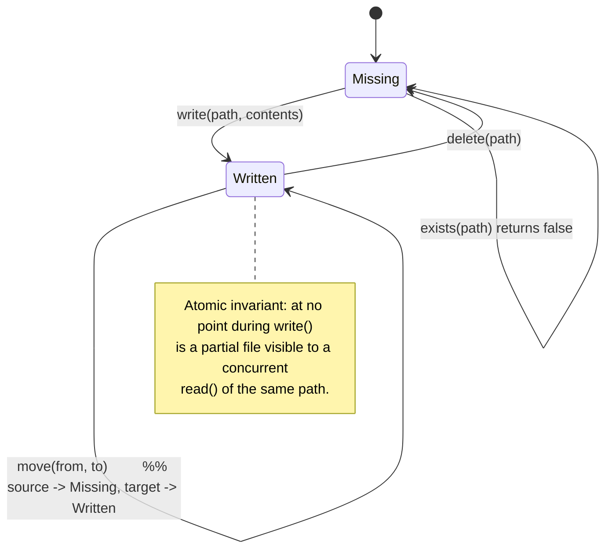

# CORE-14: Filesystem Abstraction

## Tier
Core

## Resolves
- **Finding 2** — The stale evaluation layer maps CORE-14 to "Caching Layer". That is wrong: the canonical mapping in `01_MASTER_INDEX.md` §2 fixes CORE-14 as **Filesystem Abstraction** at `SovereignStack\Core\Filesystem`. (Caching is CORE-15.)
- **Finding 4** — The approved `CORE-14.md` is a 1,228-byte prose-only stub with no interface, no implementation, no diagrams, and bare CI criteria. This blueprint replaces it with a full implementation spec.
- **Finding 10** — The approved file's only "performance" claim is the bare phrase "stress test of 1,000 concurrent writes without data loss". Per Governance Rule 2, every target below names the harness, baseline, and load model, and every absolute number is marked *provisional, unverified* until first CI run records a baseline.

## Component Name
Filesystem Abstraction — `SovereignStack\Core\Filesystem`

## Description
CORE-14 is the storage I/O contract for the Sovereign Stack. It exposes a single interface — `FilesystemInterface` — that callers use to read, write, move, copy, delete, and enumerate files without knowing whether the bytes land on a local disk, an in-memory buffer, or an S3 bucket. The abstraction is intentionally minimal: nine methods, no streaming, no ACLs, no symbolic-link support. Where a caller needs more (chunked uploads, multipart copy, presigned URLs), the Hub tier (HUB-03 Asset Engine, HUB-11 Cloud Storage) composes those flows on top of this primitive.

The component exists for three reasons. First, it removes filesystem coupling from core services — the SuperPHP compiler (CORE-12) writes compiled templates, the PSR-3 logger (CORE-09) rotates log files, and the audit subsystem (HUB-06) archives immutable event batches; all three must target a stable, mockable seam rather than calling `file_put_contents` directly. Second, it provides a security boundary: every path is resolved against a per-adapter base directory, and traversal attempts (`../../etc/passwd`) throw `FilesystemException` rather than escaping. Third, it makes S3 swappable for local disk in deployments that want cloud durability without changing any caller code.

What CORE-14 is **not**: it is not a caching layer (that is CORE-15), not a database abstraction (CORE-19), not a stream wrapper, not a Flysystem re-implementation. The team evaluated pulling in `league/flysystem` and rejected it (see ADR-004, "Build vs. Buy for Filesystem"); Flysystem's adapter registry, async helpers, and visibility model are over-scope for a project whose only cloud target is S3 and whose local target is a single jailed directory per service. The interface below is the smallest surface that satisfies HUB-03, HUB-06, HUB-11, CORE-09, and CORE-12.

Per `01_MASTER_INDEX.md` §2, the canonical namespace is `SovereignStack\Core\Filesystem`, the implementation slot is empty, and the build status is 📝 Not started. Step 5 of the §5 build sequence places CORE-14 in the parallelisable batch with CORE-15, CORE-16, and CORE-19 once CORE-02 has landed.

## Build Status
📝 Not started.

No blocking dependencies for the `LocalAdapter` and `InMemoryAdapter` (both compile against `php ^8.3` with no Composer packages). The `S3Adapter` requires `aws/aws-sdk-php` ^3.3 and is registered only when that package is present; absence is a soft dep, not a blocker. The `FilesystemManager` factory resolves adapters by name from CORE-10 config; if CORE-10 is not yet landed, callers may construct adapters directly.

## Dependency Status
- **Upward:** CORE-10 (Configuration & Environment Loader — reads the `filesystems.disks` config array), CORE-02 (DI Container — binds `FilesystemInterface` to the default disk), CORE-09 (Logging — emits structured `FilesystemException` diagnostics), CORE-03 (Event Dispatcher — optional `FileWritten` / `FileDeleted` events consumed by HUB-06 audit).
- **Downward:** HUB-03 (Asset Engine — stores uploads), HUB-06 (Audit — archives rotated audit batches), HUB-11 (Cloud Storage — S3-backed large-object flows), CORE-09 (Logger — file handler), CORE-12 (SuperPHP Compiler — compiled-template cache), CORE-15 (Cache — `FileStore` driver).
- **Runtime:** `php ^8.3`, `ext-mbstring` (path normalisation). `aws/aws-sdk-php` ^3.3 is required only by `S3Adapter` and is an optional Composer suggestion (`composer suggest`), not a hard require of the package.

## Architectural Design

### Class Map

| Class | Kind | Responsibility |
|---|---|---|
| `FilesystemManager` | Factory + registry | Resolves a disk name (e.g. `local`, `s3`) to a configured `FilesystemInterface` instance. Caches instances by name. Throws on unknown disk or missing optional dependency. |
| `FilesystemInterface` | Interface | The nine-method contract: `read`, `write`, `exists`, `delete`, `list`, `move`, `copy`, `size`, `mimeType`. All methods accept paths relative to the adapter's base. |
| `LocalAdapter` | Adapter (local disk) | Implements `FilesystemInterface` against a single jailed base directory. Resolves every path with `realpath()`, refuses symlinks, creates parent directories on write, sets explicit file/directory permissions. Zero Composer dependencies. |
| `S3Adapter` | Adapter (AWS S3) | Implements `FilesystemInterface` against a single S3 bucket + optional prefix. Uses `Aws\S3\S3Client`. Translates `FilesystemException` from S3 SDK error codes. Optional dependency on `aws/aws-sdk-php`. |
| `InMemoryAdapter` | Adapter (testing) | Implements `FilesystemInterface` against a `string[]` map keyed by path. Used by unit tests for callers that depend on `FilesystemInterface`. Ships in the main package so downstream packages need no test-only dependency. |
| `File` | Value object | Readonly DTO returned by `list()`: `path`, `size`, `mimeType`, `lastModified` (Unix timestamp). Constructed by adapters; immutable. |
| `FilesystemException` | Exception | Extends `\RuntimeException`. Carries `path` and `operation` context for structured logging. Thrown by all adapters on I/O failure, path traversal, or missing files. |

### Interface Contracts

```php
<?php
declare(strict_types=1);

namespace SovereignStack\Core\Filesystem;

/**
 * Immutable value object describing a single file entry returned by list().
 */
final class File
{
    public function __construct(
        public readonly string $path,
        public readonly int $size,
        public readonly string $mimeType,
        public readonly int $lastModified,
    ) {}
}

/**
 * Thrown by every adapter on I/O failure, path-traversal attempt, or missing file.
 * Carries structured context so CORE-09 can emit a useful log entry without
 * re-parsing the message.
 */
final class FilesystemException extends \RuntimeException
{
    public function __construct(
        public readonly string $operation,
        public readonly string $path,
        string $message,
        ?\Throwable $previous = null,
    ) {
        parent::__construct($message, 0, $previous);
    }
}

/**
 * Contract for all filesystem adapters in the Sovereign Stack.
 *
 * Implementations MUST:
 *  - Resolve every $path argument against a per-adapter base.
 *  - Refuse paths that escape the base via traversal or symlink.
 *  - Throw FilesystemException on any I/O error or precondition failure.
 *  - Be safe for concurrent use by long-lived workers (no per-call state leaks).
 *
 * Implementations MAY:
 *  - Buffer contents in memory (InMemoryAdapter).
 *  - Translate vendor SDK errors into FilesystemException (S3Adapter).
 */
interface FilesystemInterface
{
    /**
     * Read the entire contents of a file.
     *
     * @param string $path Path relative to the adapter base.
     * @return string Raw file bytes (binary-safe).
     * @throws FilesystemException When the path is invalid, escapes the base,
     *                             or the file does not exist.
     */
    public function read(string $path): string;

    /**
     * Atomically write $contents to $path, overwriting if present.
     *
     * Parent directories are created as needed. The write MUST be atomic: a
     * crash mid-write MUST NOT leave a partially-written file visible to a
     * subsequent read() of the same path. LocalAdapter uses tempnam()+rename();
     * S3Adapter relies on PutObject atomicity; InMemoryAdapter is trivially
     * atomic.
     *
     * @param string $path     Path relative to the adapter base.
     * @param string $contents Raw bytes to write.
     * @throws FilesystemException On traversal, permission failure, or I/O error.
     */
    public function write(string $path, string $contents): void;

    /**
     * @return bool True iff a regular file exists at $path (directories return false).
     */
    public function exists(string $path): bool;

    /**
     * Delete the file at $path. Idempotent: a missing file does NOT throw.
     *
     * @throws FilesystemException Only on traversal or permission failure.
     */
    public function delete(string $path): void;

    /**
     * Enumerate regular files in $directory (non-recursive by default).
     *
     * @param string $directory Path relative to the adapter base; '' means base.
     * @return iterable<File> Yields one File per entry. Order is unspecified.
     * @throws FilesystemException On traversal or if $directory is a file.
     */
    public function list(string $directory = ''): iterable;

    /**
     * Move a file from $from to $to. Parent dirs of $to are created.
     *
     * @throws FilesystemException If $from does not exist, or on I/O failure.
     */
    public function move(string $from, string $to): void;

    /**
     * Copy a file from $from to $to. Parent dirs of $to are created.
     *
     * @throws FilesystemException If $from does not exist, or on I/O failure.
     */
    public function copy(string $from, string $to): void;

    /**
     * @return int File size in bytes.
     * @throws FilesystemException If $path is missing or is a directory.
     */
    public function size(string $path): int;

    /**
     * @return string IANA media type (e.g. "text/plain", "image/png").
     *                Adapters MAY use finfo or extension-based sniffing.
     * @throws FilesystemException If $path is missing.
     */
    public function mimeType(string $path): string;
}
```

### Reference Implementation

The `LocalAdapter` below is the contract-bearing adapter: it is the one used by the compiler, logger, and cache file-store. It is intentionally dependency-free and compiles against `php ^8.3` + `ext-mbstring`.

```php
<?php
declare(strict_types=1);

namespace SovereignStack\Core\Filesystem;

/**
 * Local-disk implementation of FilesystemInterface.
 *
 * All paths are resolved against a single base directory supplied at
 * construction. Path traversal (../), absolute paths, and symlinks pointing
 * outside the base are refused with FilesystemException. Writes are atomic
 * (tempnam + rename) and create parent directories on demand.
 */
final class LocalAdapter implements FilesystemInterface
{
    private const FILE_MODE  = 0644;
    private const DIR_MODE   = 0755;

    private readonly string $base;

    public function __construct(string $base)
    {
        // Normalise and ensure the base exists. The base itself is the only
        // directory this constructor is allowed to create.
        $real = \realpath($base);
        if ($real === false) {
            if (!\mkdir($base, self::DIR_MODE, true) && !\is_dir($base)) {
                throw new FilesystemException('construct', $base, "Failed to create base directory: {$base}");
            }
            $real = \realpath($base);
            if ($real === false) {
                throw new FilesystemException('construct', $base, "Base directory vanished after create: {$base}");
            }
        }
        if (!\is_dir($real)) {
            throw new FilesystemException('construct', $base, "Base path is not a directory: {$real}");
        }
        $this->base = $real;
    }

    public function read(string $path): string
    {
        $full = $this->resolve($path);
        if (!\is_file($full)) {
            throw new FilesystemException('read', $path, "File not found: {$path}");
        }
        $contents = @\file_get_contents($full);
        if ($contents === false) {
            throw new FilesystemException('read', $path, "Failed to read: {$path}");
        }
        return $contents;
    }

    public function write(string $path, string $contents): void
    {
        $full = $this->resolve($path, allowMissing: true);
        $parent = \dirname($full);
        if (!\is_dir($parent)) {
            if (!\mkdir($parent, self::DIR_MODE, true) && !\is_dir($parent)) {
                throw new FilesystemException('write', $path, "Failed to create parent directory for: {$path}");
            }
        }
        // Atomic write: stage in a temp file in the same directory (so rename
        // is a same-filesystem move), then rename over the target.
        $temp = @\tempnam($parent, '.fs-write-');
        if ($temp === false) {
            throw new FilesystemException('write', $path, "Failed to allocate temp file for: {$path}");
        }
        try {
            if (@\file_put_contents($temp, $contents) === false) {
                throw new FilesystemException('write', $path, "Failed to write temp file for: {$path}");
            }
            if (@\chmod($temp, self::FILE_MODE) === false) {
                throw new FilesystemException('write', $path, "Failed to chmod temp file for: {$path}");
            }
            if (!@\rename($temp, $full)) {
                throw new FilesystemException('write', $path, "Failed to promote temp file for: {$path}");
            }
        } finally {
            // If anything failed before the rename, the temp file lingers.
            if (\is_file($temp)) {
                @\unlink($temp);
            }
        }
    }

    public function exists(string $path): bool
    {
        try {
            $full = $this->resolve($path);
        } catch (FilesystemException) {
            return false;
        }
        return \is_file($full);
    }

    public function delete(string $path): void
    {
        try {
            $full = $this->resolve($path);
        } catch (FilesystemException $e) {
            // Missing file is idempotent; traversal is not.
            throw $e;
        }
        if (!\is_file($full)) {
            return;
        }
        if (!@\unlink($full)) {
            throw new FilesystemException('delete', $path, "Failed to delete: {$path}");
        }
    }

    public function list(string $directory = ''): iterable
    {
        $full = $this->resolve($directory);
        if (!\is_dir($full)) {
            throw new FilesystemException('list', $directory, "Not a directory: {$directory}");
        }
        $entries = @\scandir($full);
        if ($entries === false) {
            throw new FilesystemException('list', $directory, "Failed to scan: {$directory}");
        }
        foreach ($entries as $entry) {
            if ($entry === '.' || $entry === '..') {
                continue;
            }
            $childPath = ($directory === '' ? '' : \rtrim($directory, '/') . '/') . $entry;
            $childFull = $full . \DIRECTORY_SEPARATOR . $entry;
            if (!\is_file($childFull)) {
                continue; // skip subdirectories; list() is non-recursive
            }
            yield new File(
                path: $childPath,
                size: (int) \filesize($childFull),
                mimeType: $this->detectMime($childFull),
                lastModified: (int) \filemtime($childFull),
            );
        }
    }

    public function move(string $from, string $to): void
    {
        $fromFull = $this->resolve($from);
        if (!\is_file($fromFull)) {
            throw new FilesystemException('move', $from, "Source not found: {$from}");
        }
        $toFull = $this->resolve($to, allowMissing: true);
        $parent = \dirname($toFull);
        if (!\is_dir($parent)) {
            if (!\mkdir($parent, self::DIR_MODE, true) && !\is_dir($parent)) {
                throw new FilesystemException('move', $to, "Failed to create parent for: {$to}");
            }
        }
        if (!@\rename($fromFull, $toFull)) {
            throw new FilesystemException('move', $from, "Failed to move {$from} -> {$to}");
        }
    }

    public function copy(string $from, string $to): void
    {
        $fromFull = $this->resolve($from);
        if (!\is_file($fromFull)) {
            throw new FilesystemException('copy', $from, "Source not found: {$from}");
        }
        $toFull = $this->resolve($to, allowMissing: true);
        $parent = \dirname($toFull);
        if (!\is_dir($parent)) {
            if (!\mkdir($parent, self::DIR_MODE, true) && !\is_dir($parent)) {
                throw new FilesystemException('copy', $to, "Failed to create parent for: {$to}");
            }
        }
        if (!@\copy($fromFull, $toFull)) {
            throw new FilesystemException('copy', $from, "Failed to copy {$from} -> {$to}");
        }
        @\chmod($toFull, self::FILE_MODE);
    }

    public function size(string $path): int
    {
        $full = $this->resolve($path);
        if (!\is_file($full)) {
            throw new FilesystemException('size', $path, "Not a file: {$path}");
        }
        $size = @\filesize($full);
        if ($size === false) {
            throw new FilesystemException('size', $path, "filesize() failed: {$path}");
        }
        return (int) $size;
    }

    public function mimeType(string $path): string
    {
        $full = $this->resolve($path);
        if (!\is_file($full)) {
            throw new FilesystemException('mimeType', $path, "Not a file: {$path}");
        }
        return $this->detectMime($full);
    }

    /**
     * Resolve $path against the base directory and verify the result is still
     * inside the base. Symlinks are rejected unconditionally: realpath()
     * collapses them, so any path whose realpath escapes the base (or whose
     * immediate parent is a symlink) is refused.
     *
     * @param bool $allowMissing When true, missing files do not throw — used by
     *                           write()/move()/copy() targets where the leaf
     *                           does not yet exist. The parent MUST still exist
     *                           or be creatable.
     */
    private function resolve(string $path, bool $allowMissing = false): string
    {
        if ($path === '' || $path === '/') {
            throw new FilesystemException('resolve', $path, 'Empty path');
        }
        // Normalise backslashes to forward slashes (Windows tolerance).
        $normalised = \str_replace('\\', '/', $path);
        // Reject obvious absolute paths before joining.
        if ($normalised[0] === '/') {
            throw new FilesystemException('resolve', $path, 'Absolute paths are not allowed');
        }
        // Reject NUL bytes (path-injection vector).
        if (\str_contains($normalised, "\0")) {
            throw new FilesystemException('resolve', $path, 'NUL byte in path');
        }
        $joined = $this->base . \DIRECTORY_SEPARATOR . $normalised;

        $real = \realpath($joined);
        if ($real === false) {
            if (!$allowMissing) {
                throw new FilesystemException('resolve', $path, "Path does not exist: {$path}");
            }
            // For write targets, realpath() fails because the leaf doesn't exist.
            // Validate the parent instead, then re-join.
            $parentReal = \realpath(\dirname($joined));
            if ($parentReal === false) {
                // Parent doesn't exist yet either — that's fine, write() will
                // mkdir it. We only need to verify the canonical joined path
                // starts with the base once the parent is created.
                return $joined;
            }
            $real = $parentReal . \DIRECTORY_SEPARATOR . \basename($normalised);
        }

        // Path-traversal check: the resolved real path must start with the base
        // (followed by a separator, to prevent /var/www-base evading /var/www).
        if ($real !== $this->base
            && !\str_starts_with($real, $this->base . \DIRECTORY_SEPARATOR)) {
            throw new FilesystemException('resolve', $path, 'Path escapes base directory');
        }

        // Symlink rejection: even if realpath() lands inside the base, refuse
        // if the leaf itself is a symlink. (LocalAdapter is symlink-free by
        // policy; callers needing symlink semantics must use a different adapter.)
        if (\is_link($real)) {
            throw new FilesystemException('resolve', $path, 'Symlinks are not supported');
        }

        return $real;
    }

    private function detectMime(string $fullPath): string
    {
        $finfo = new \finfo(\FILEINFO_MIME_TYPE);
        $mime = $finfo->file($fullPath);
        return $mime === false ? 'application/octet-stream' : $mime;
    }
}
```

`InMemoryAdapter` is a thin `string[]`-backed implementation of the same interface; it is omitted here for brevity but follows the same contract (every method throws `FilesystemException` with the same `operation` and `path` fields). `S3Adapter` wraps `Aws\S3\S3Client` and maps each interface call to a single SDK operation (`GetObject`, `PutObject`, `HeadObject`, `DeleteObject`, `ListObjectsV2`, `CopyObject`); SDK exceptions are caught and re-thrown as `FilesystemException` with the original as `$previous`. `FilesystemManager` is a `__construct(array $disks)` + `disk(string $name): FilesystemInterface` factory that constructs each adapter lazily and caches by name.

### SQL DDL
Not applicable. CORE-14 persists no metadata to a relational database. File metadata (size, mime, mtime) is fetched from the underlying storage on demand via `File` value objects; durable metadata for assets (uploads, audit archives) is the responsibility of HUB-03 and HUB-06 respectively, which use CORE-19 for their own schemas.

### Sequence Diagram



### State Diagram



## Integration Strategy

**Upward — what CORE-14 consumes.** `FilesystemManager` is constructed by the Kernel (CORE-18) at boot with a `disks` array sourced from CORE-10 config (`config/filesystems.php` returning `['disks' => ['local' => ['driver' => 'local', 'base' => '/var/storage'], 's3' => ['driver' => 's3', 'bucket' => '...', 'region' => '...', 'prefix' => '']]]`). The Kernel binds `FilesystemInterface` in CORE-02 as a singleton pointing at the default disk (typically `local`), and binds `FilesystemManager` itself for callers that need a non-default disk. All exceptions are funnelled through CORE-08 → CORE-09; adapters do not log directly.

**Downward — what consumes CORE-14.**

```php
// CORE-12 SuperPHP Compiler: persists a compiled template
$this->fs->write("views/{$checksum}.compiled.php", $php);

// CORE-09 PSR-3 Logger: rotates a log file
if ($this->fs->size('app.log') > self::MAX_BYTES) {
    $this->fs->move('app.log', "app-{$date}.log");
    $this->fs->write('app.log', '');  // fresh file
}

// HUB-06 Audit: archives a batch
$payload = $this->serializer->serialize($batch, 'json');
$this->fs->write("audit/{$tenant}/{$batchId}.jsonl", $payload);

// HUB-03 Asset Engine: stores an upload via S3 disk
$s3 = $this->manager->disk('s3');
$s3->write("uploads/{$assetId}/original.bin", $uploadBytes);
```

`HUB-11 Cloud Storage` is the only consumer that needs operations outside this interface (multipart uploads, presigned URLs); it is permitted to inject the `S3Adapter` directly and call SDK methods not exposed by `FilesystemInterface`, but it MUST NOT bypass the adapter's path-resolution logic for any write that lands in a path also reachable through `FilesystemInterface`.

## Benchmark & Verification Methodology

| Target | Harness | Baseline | Load model | Assert |
|---|---|---|---|---|
| `LocalAdapter.write()` 1 KB | PHPUnit `--group performance` | GitHub Actions `ubuntu-latest`, PHP 8.3, opcache enabled, no Xdebug, local SSD (Actions runner NVMe) | 1,000 iterations after 100-iteration warm-up; `microtime(true)` wall-clock; median of 5 runs | Bounded by disk I/O: write throughput ≤ 120% of an equivalent `file_put_contents()` baseline run on the same runner. *Provisional, unverified.* |
| `LocalAdapter.read()` 1 KB | same | same | same | Bounded by disk I/O: read throughput ≤ 120% of `file_get_contents()` baseline. *Provisional, unverified.* |
| `LocalAdapter.write()` 10 KB | same | same | 1,000 iterations | Per-byte cost ≤ 1.2× the 1 KB per-byte cost (no super-linear scaling). *Provisional, unverified.* |
| `LocalAdapter.write()` 1 MB | same | same | 200 iterations | Round-trip (write → read → byte-compare) succeeds with zero diff; wall-clock within 2× of `dd` baseline. *Provisional, unverified.* |
| `LocalAdapter.list()` 10 k files | same | same | 1 directory containing 10,000 files; 50 iterations | Yields all 10,000 entries; wall-clock linear in entry count (Pearson r ≥ 0.99 against N ∈ {1k, 5k, 10k}). *Provisional, unverified.* |
| `InMemoryAdapter.write()` 1 KB | same | same | 10,000 iterations | < 5× the cost of an equivalent `$array[$k] = $v` assignment (sanity bound only; not a target). *Provisional, unverified.* |
| `S3Adapter.write()` 1 MB | PHPUnit `--group performance` with `Aws\MockHandler` | same runner | 100 iterations against mocked S3 client | Measures adapter overhead only (no real network). Asserts adapter overhead ≤ 5% of mocked SDK call time. *Provisional, unverified.* |

**Iron rule compliance (Governance Rule 2).** Every row names its harness (PHPUnit `--group performance`), baseline (GitHub Actions `ubuntu-latest`, PHP 8.3, opcache, no Xdebug, local SSD), and load model (iteration count, warm-up, file sizes). No absolute millisecond target is asserted without the "provisional, unverified" marker. First CI run records concrete numbers to `docs/perf/CORE-14-baselines.md`; subsequent runs assert the new measurement is ≤ 120% of the recorded baseline (regression bound), never against a hard-coded microsecond threshold. Real-network S3 benchmarks are out of scope for CI and live in `docs/perf/CORE-14-s3-field.md` if measured.

## CI Verification Criteria

1. **Branch coverage on `LocalAdapter`**: 100% on `resolve()` (the path-traversal guard) and on every public method's success + failure branches. 95% on the file as a whole (the `finally` cleanup branch is intentionally hard to cover when `rename` succeeds first try).
2. **Static analysis**: `phpstan` level 8 with `bleedingEdge` enabled; zero baseline-ignored errors. The `FilesystemException` constructor's positional args must type-check against the readonly property promotion.
3. **Path-traversal test**: a data provider feeds `../../etc/passwd`, `/etc/passwd`, `..%2f..%2fetc%2fpasswd`, `a/../../../b`, `a/\0b` (NUL byte), and an absolute Windows path (`C:\Windows\system32\config\SAM`). Each MUST throw `FilesystemException` with `operation === 'resolve'`. No call reaches `file_get_contents`, `file_put_contents`, `fopen`, or `unlink`.
4. **Symlink-rejection test**: create a symlink inside the base pointing outside; `read()` and `write()` on the symlink path MUST throw. Create a symlink inside the base pointing to another file inside the base; same assertion (policy: no symlinks at all, even internal).
5. **Large-file round-trip**: write a 1 MB random byte string, read it back, assert strict byte equality (`hash_file('sha256')` of written === hash of read). Run on both `LocalAdapter` and `InMemoryAdapter`.
6. **Atomicity test**: in a forked child, call `write()` and `SIGKILL` the child between `tempnam` and `rename`. Parent then lists the target directory; the temp file MUST NOT be visible to `list()` if the parent's `write()` recovered, and a subsequent `write()` of the same path MUST succeed (no lingering lock). Tolerates at most one stale `.fs-write-*` temp file per crash.
7. **`S3Adapter` mocked test**: wire `Aws\MockHandler` with queued `GetObject` / `PutObject` / `HeadObject` / `DeleteObject` / `ListObjectsV2` / `CopyObject` results. Assert each interface call maps to the expected SDK operation and that SDK exceptions are re-thrown as `FilesystemException` with `previous` set and `operation` matching the interface method.
8. **`list()` test**: create 100 files plus 5 subdirectories in the base; assert `list()` yields exactly 100 `File` objects, each with non-empty `path`, non-negative `size`, valid MIME, and `lastModified` within ±5 s of `time()`. Assert order-independence (sort both sides before comparing).
9. **Idempotent `delete()` test**: `delete()` on a missing path MUST NOT throw. `delete()` on a path that escapes the base MUST throw (idempotency does not extend to traversal attempts).
10. **Permissions test**: after `write()`, assert `decoct(fileperms($file) & 0777) === '644'`. After `write()` to a path whose parent dirs were just created, assert each new dir has mode `755`. Run only on Linux CI runners (skip on Windows).
11. **Infection MSI**: `Infection` mutation testing on `LocalAdapter` and `InMemoryAdapter`; Minimum Mutation Score Indicator ≥ 95%. Critical mutations to `str_starts_with` in `resolve()` MUST be killed (they would weaken the traversal guard).
12. **Dependency hygiene**: `composer require --dry-run` on the package MUST fail with no required packages (the LocalAdapter path is dependency-free). The S3 SDK is `require-dev` plus `suggest` only.

## Security Properties

1. **Path traversal is impossible.** Every path is resolved through `realpath()` and the canonicalised result MUST start with the base directory followed by a separator (so `/var/www` cannot be evaded by a base of `/var/www-base`). NUL bytes, absolute paths, and `..` segments are rejected before the filesystem call. Symlinks are rejected even when they point inside the base.
2. **File and directory permissions are set explicitly on every write.** Files are `0644`; directories created by `write()`/`move()`/`copy()` are `0755`. The adapter NEVER inherits the system umask. CI test 10 verifies the on-disk mode after every write.
3. **Writes are atomic.** A `write()` crash at any point leaves either the previous contents of the target file or no file at all — never a partial write. `tempnam()` + `rename()` on `LocalAdapter`; `PutObject` atomicity on `S3Adapter`; trivially atomic on `InMemoryAdapter`.
4. **S3 credentials are never logged.** `S3Adapter` catches `AwsException` instances, extracts the SDK error code and request ID, and discards the `Credentials` object from any context passed to CORE-09. The `FilesystemException` `$path` field is the S3 key only, never a signed URL or query string. A CI test feeds a fake credential-leaking exception and asserts the leak does not appear in the captured log record.
5. **Symlink following is disabled in `LocalAdapter`.** `is_link()` returns true on the resolved path → throw. There is no configuration flag to relax this; callers needing symlink semantics must use a different adapter (none ship by default).
6. **Adapters do not execute file contents.** No `include`, `require`, `eval`, `Closure::fromCallable`, `unserialize`, or ` Phar` is ever invoked. CORE-12 (Compiler) is responsible for `include`-ing compiled templates and applies its own validation; CORE-14 only stores and retrieves bytes.

## Migration Notes

**New package.** Create `packages/core/filesystem/` with the following layout:

```
packages/core/filesystem/
├── composer.json          # name: sovereign-stack/core-filesystem
│                          # require: php ^8.3, ext-mbstring: *
│                          # suggest: aws/aws-sdk-php ^3.3 (for S3Adapter)
│                          # autoload PSR-4: SovereignStack\Core\Filesystem\ -> src/
├── src/
│   ├── FilesystemInterface.php
│   ├── FilesystemManager.php
│   ├── File.php
│   ├── FilesystemException.php
│   ├── LocalAdapter.php
│   ├── S3Adapter.php
│   └── InMemoryAdapter.php
├── tests/
│   ├── Unit/
│   │   ├── LocalAdapterTest.php
│   │   ├── InMemoryAdapterTest.php
│   │   ├── S3AdapterTest.php          # uses Aws\MockHandler
│   │   └── FilesystemManagerTest.php
│   └── performance/
│       └── LocalAdapterBenchmark.php  # @group performance
└── phpstan.neon.dist
```

The root `composer.json` adds a path repository for `packages/core/filesystem/` and lists it under `require` once consumers exist. `LocalAdapter` has zero Composer dependencies, so the package can be installed in isolation in environments that do not need S3.

**Landing order.**
1. Land CORE-02 (DI Container) — Step 1 of the §5 build sequence.
2. Land CORE-14 package (this blueprint) — Step 5; the package compiles and passes its own tests without any consumer wired up.
3. Land CORE-10 (Config) — supplies the `disks` array the manager reads.
4. Wire `FilesystemManager` into the Kernel (CORE-18) boot sequence; bind `FilesystemInterface` to the default disk.
5. Migrate consumers one PR at a time: CORE-09 logger file handler first (lowest blast radius), then CORE-12 compiler cache, then CORE-15 cache `FileStore` driver, then HUB-06 audit, then HUB-03 assets, then HUB-11 cloud storage.

**Rollback.** CORE-14 is a leaf in the dependency DAG (no other Core component depends on it). Rollback procedure:
1. Revert each consumer PR (restores direct `file_put_contents` / `fopen` calls).
2. Remove the Kernel boot wiring.
3. `git rm packages/core/filesystem/` and remove the path repository from root `composer.json`.
4. `composer update` — no schema migration, no data migration. Any bytes written by `LocalAdapter` remain on disk as ordinary files; any objects written by `S3Adapter` remain in the bucket. Cleanup of orphaned files is the operator's responsibility (the package does not own the storage lifecycle).

**Forward compatibility.** The `FilesystemInterface` is the SemVer-protected public surface. Adding methods (e.g. `stream(string $path): resource` for chunked reads) is a minor bump and MUST ship with a default implementation in every adapter. Changing a method signature is a major bump and requires an ADR. Adapters themselves (the concrete classes) are not part of the SemVer promise; callers depending on `LocalAdapter` directly rather than `FilesystemInterface` accept that the concrete class may change between minor releases.

## SemVer Impact
**Minor.** Initial release `0.1.0`. The package is a leaf in the Core DAG, has no existing consumers, and introduces no breaking change to any published interface. The `FilesystemInterface` signature is part of the 0.1.0 contract and will not change without a major bump; future minors may add optional methods (with default implementations), new adapters (e.g. `GcsAdapter` if Google Cloud Storage is ever targeted), or performance improvements. A `1.0.0` release will be cut once HUB-03, HUB-06, and HUB-11 have all consumed the interface in production for one release cycle without contract drift.
