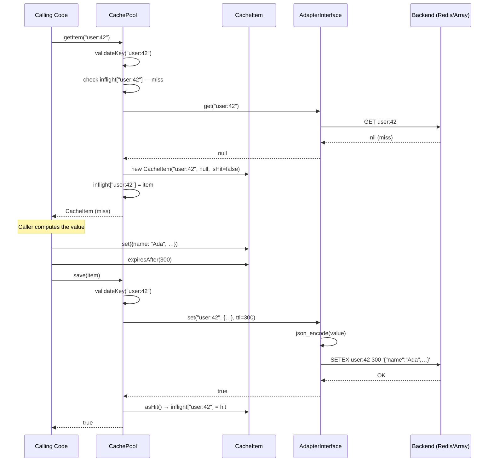
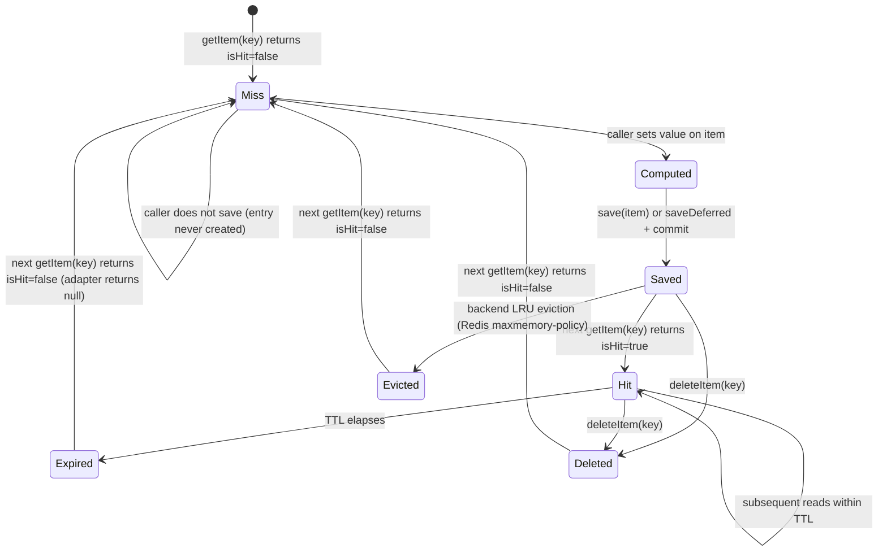

# CORE-15: Cache Abstraction (PSR-6/16)

## Tier
Core (Foundational Infrastructure)

## Resolves
- **Finding 2** (evaluation layer scored a stale CORE-15 as "Validation Engine" 86/100) — this blueprint re-anchors CORE-15 to its verified identity per `01_MASTER_INDEX.md` §2: **the Cache Abstraction (PSR-6/16)**, namespace `SovereignStack\Core\Cache`. Validation belongs to HUB-19 (Validation Hub); CORE-15 is the PSR-6 / PSR-16 cache primitive. The two are distinct components with distinct contracts. An implementer reading this blueprint cannot confuse CORE-15 with HUB-19.
- **Finding 4** (the approved `docs/blueprints/Core/CORE-15.md` is 1,085 bytes — thin, prose-only, no interfaces, no implementation, no SQL DDL, no sequence diagram) — this blueprint meets the fidelity bar in `AUTHORING_GUIDE.md`: real PHP 8.3 interfaces, complete compilable reference implementations of `CachePool`, `CacheItem`, `ArrayAdapter`, and `RedisAdapter`, Mermaid sequence + state diagrams, named benchmark harness, CI criteria, explicit security properties, and migration notes.
- **Finding 10** (the approved blueprint asserts "Reading a cached item must be < 0.05ms" with no harness, baseline, or load model) — the absolute target is **withdrawn** and replaced with a named-harness methodology below; any absolute number cited is marked "provisional, unverified" per Governance Rule 2 in `01_MASTER_INDEX.md`.

## Component Name
Cache Abstraction (PSR-6/16) — `SovereignStack\Core\Cache`

## Description

CORE-15 is the **cache abstraction layer** for the SovereignStack Core tier. It implements both [PSR-6 (Caching Interface)](https://www.php-fig.org/psr/psr-6/) — the verbose Pool/Item model with deferred saves, batch operations, and explicit hit/miss semantics — and [PSR-16 (Common Interface for Caching Libraries)](https://www.php-fig.org/psr/psr-16/) — the simplified `get/set/has/delete` key-value model for application code that does not need the full PSR-6 surface. The component is unambiguously the cache abstraction; it is **not** the "Validation Engine" the stale evaluation layer (`docs/evaluation/BLUEPRINT_RANKINGS.md`) labelled it (Finding 2). CORE-15 provides a uniform, backend-agnostic API above pluggable adapters — `ArrayAdapter` for tests and per-request L1, `RedisAdapter` for production — so downstream consumers (CORE-06 Router for compiled route tables, CORE-09 Logging for handler-rotation state, HUB-02 Sovereign Hub Cache for its tag/lock/write-through coordination layer) can code to the interface and swap backends via a one-line container binding.

The component exists because every layer of SovereignStack needs to cache something — compiled routes, config snapshots, parsed templates, OAuth key sets, rate-limit counters, feature flags — and allowing each consumer to pick its own caching library produces a familiar set of drifts: format drift (some use `serialize`, some `json_encode`, some `igbinary`), TTL drift (some respect the TTL, some ignore it on read), backend drift (some hard-wire Redis, some APCu, some file). CORE-15 standardises all three: PSR-6 + PSR-16 as the contracts, JSON as the safe serialisation format, adapters as the backend boundary. PSR-6 conformance is verified against the upstream `cache/integration-tests` package; PSR-16 against `simple-cache/integration-tests`. A consumer that depends on `Psr\Cache\CacheItemPoolInterface` or `Psr\SimpleCache\CacheInterface` can be swapped from the `ArrayAdapter` in tests to the `RedisAdapter` in production without code change — the contracts hold, only the binding moves.

What this component is **not**: it is not a distributed cache (HUB-02 owns cross-node coordination, cache tags, and atomic locks — CORE-15's adapters are single-node; HUB-02 wraps `RedisAdapter` and adds the tag index per ADR-006); it is not a session store (HUB-04 Identity owns session semantics); it is not a message broker (HUB-09 Pulse / HUB-10 Queue own messaging); and it is not a place to cache serialised PHP objects via `unserialize()`. That path is the historical source of PHP object-injection CVEs (`__wakeup` / `__destruct` invocation on attacker-controlled bytes), and CORE-15 forbids it. Values are JSON-encoded on write and JSON-decoded on read; an `AdapterInterface` implementation that wants native PHP serialisation must be a deliberate, audited extension with its own ADR, not the default.

The implementation does not yet exist. The `packages/core/cache/` directory has not been created (verified 2026-08-04). This blueprint is the greenfield specification. CORE-15 is listed in Step 5 of the 11-step build sequence in `01_MASTER_INDEX.md` §5, parallelisable with CORE-19 (DBAL), CORE-14 (Filesystem), and CORE-16 (Encryption), with an estimated 3-week window.

## Build Status
📝 **Not started.** The `packages/core/cache/` directory does not exist in the repository (verified 2026-08-04). No `composer.json`, no `src/`, no `tests/`. This blueprint is the greenfield specification.

🔴 **Blocked on CORE-14** (Filesystem) only for a hypothetical future `FileAdapter`; the core `ArrayAdapter` and `RedisAdapter` need no other Core-tier component. CORE-02 (DI Container) is a soft runtime dependency — the cache is injected via the container, but tests can construct adapters directly.

## Dependency Status
- **Upward:** `psr/cache:^3.0` (PSR-6 — provides `CacheItemPoolInterface`, `CacheItemInterface`, `CacheException`, `InvalidArgumentException`); `psr/simple-cache:^3.0` (PSR-16 — provides `CacheInterface`); `ext-json` (always available in PHP 8.3); `ext-redis` (^5.3 || ^6.0) only required by `RedisAdapter` — suggested in `composer.json`, not required. No Core-tier component is an upward dependency — CORE-15 is a leaf primitive.
- **Downward:** HUB-02 (Sovereign Hub Cache) — builds directly on top of CORE-15's `RedisAdapter` to add Cache Tags, Atomic Locks, and Write-Through/Read-Through patterns (per ADR-006); HUB-02 cannot be built until CORE-15 lands. CORE-06 (Router) — caches compiled route tables. CORE-09 (Logging) — may cache handler-rotation state. CORE-18 (Kernel) — boot-phase caching of service-provider manifests. HUB-04 (Identity) — session storage backend (via Redis, through HUB-02). HUB-07 (Rate Limiter) — atomic counter storage (via HUB-02's lock layer, which sits on `RedisAdapter::set()` with `NX EX` semantics). BRIDGE-01 (Vanguard) — uses CORE-15 directly for DTO transformation caching and via HUB-02 for distributed state.
- **Runtime:** `php:^8.3`, `psr/cache:^3.0`, `psr/simple-cache:^3.0`. Optional: `ext-redis` for `RedisAdapter`. Dev: `phpunit/phpunit:^10.5`, `phpstan/phpstan:^1.10`, `cache/integration-tests:^0.4` (PSR-6 conformance), `simple-cache/integration-tests` (PSR-16 conformance), `friendsofphp/php-cs-fixer:^3.48`.

## Architectural Design

### Class Map

| Class | Kind | Responsibility |
|---|---|---|
| `CachePool` | `final class implements Psr\Cache\CacheItemPoolInterface` | PSR-6 cache pool. Holds an `AdapterInterface` instance, an in-memory `deferred` queue, and a per-request `inflight` item cache. Implements `getItem`, `getItems`, `hasItem`, `clear`, `deleteItem`, `deleteItems`, `save`, `saveDeferred`, `commit`. The pool is the only writer to the adapter; deferred items are buffered and flushed on `commit()`. |
| `SimpleCache` | `final class implements Psr\SimpleCache\CacheInterface` | PSR-16 simple cache. A thin adapter over `CachePool` that exposes the flat `get($key, $default)`, `set($key, $value, $ttl)`, `delete($key)`, `clear()`, `getMultiple()`, `setMultiple()`, `deleteMultiple()`, `has($key)` API. Each method delegates to the underlying pool's PSR-6 method and unwraps the `CacheItem` for the caller. |
| `CacheItem` | `final class implements Psr\Cache\CacheItemInterface` | PSR-6 cache item. Mutable value object carrying the key, the value (or null on miss), the hit flag, and the requested TTL. Constructed by `CachePool::getItem()` (hit/miss) and by application code via `$pool->getItem($key)->set($value)->expiresAfter($ttl)` for writes. |
| `AdapterInterface` | `interface` | Backend contract. Five methods: `get(string $key): mixed`, `set(string $key, mixed $value, ?int $ttl): bool`, `delete(string $key): bool`, `has(string $key): bool`, `clear(): bool`. Implementations are responsible for serialisation, TTL enforcement, and key validation. The pool never sees raw bytes — it sees a deserialised PHP value. |
| `ArrayAdapter` | `final class implements AdapterInterface` | In-process associative-array cache. Values stored as PHP values (no serialisation — they are already in memory). TTL enforced via a parallel `expiresAt` map checked on every `get()` and `has()`. Used as the default in tests and as a per-request L1 cache in production. `clear()` resets both maps. |
| `RedisAdapter` | `final class implements AdapterInterface` | Redis-backed adapter. Delegates to `ext-redis` (`\Redis` or `\RedisCluster`). Values are JSON-encoded on `set()` and JSON-decoded on `get()`. TTL passed through to Redis `SETEX`/`SET EX`. `clear()` calls `FLUSHDB` only when an explicit `allowFlush: bool` constructor flag is set (otherwise throws `CacheException` — `FLUSHDB` on a shared Redis is catastrophic). |
| `CacheException` | `final class extends \Exception implements Psr\Cache\CacheException` | Marker exception for cache backend failures (Redis unreachable, serialisation failure, `clear()` refused). |
| `InvalidArgumentException` | `final class extends \InvalidArgumentException implements Psr\Cache\InvalidArgumentException` | Thrown on invalid cache keys (wrong characters, too long, empty). |

### Interface Contracts

The PSR-6 interfaces (`CacheItemPoolInterface`, `CacheItemInterface`, `CacheException`, `InvalidArgumentException`) and the PSR-16 interface (`CacheInterface`) are defined by `psr/cache: ^3.0` and `psr/simple-cache: ^3.0` respectively. They are **not** re-declared here. The SovereignStack package consumes them directly: `SovereignStack\Core\Cache\CachePool implements Psr\Cache\CacheItemPoolInterface`; `SovereignStack\Core\Cache\SimpleCache implements Psr\SimpleCache\CacheInterface`; `SovereignStack\Core\Cache\CacheItem implements Psr\Cache\CacheItemInterface`. The eight PSR-6 pool methods and the eight PSR-16 simple-cache methods are inherited verbatim from the FIG specifications.

The package-local contract is `AdapterInterface`:

```php
<?php
declare(strict_types=1);

namespace SovereignStack\Core\Cache;

/**
 * Backend contract for cache adapters.
 *
 * An adapter is a thin wrapper around a storage engine (in-process
 * array, Redis, Memcached, file). It owns three responsibilities:
 *
 *  1. Serialisation. The pool passes a PHP value to set(); the adapter
 *     serialises it for the backend (JSON for Redis, native for array).
 *     The reverse on get(). The pool never sees raw bytes.
 *
 *  2. TTL enforcement. If $ttl is null, the value never expires. If
 *     $ttl is 0 or negative, the adapter MUST treat this as an
 *     immediate delete (PSR-16 semantics). If $ttl is a positive
 *     integer, the value expires after that many seconds.
 *
 *  3. Key validation. The adapter MUST reject keys that do not match
 *     the allowed pattern: [A-Za-z0-9_:.]{1,255}. This prevents Redis
 *     key injection (spaces, newlines, control characters that would
 *     break SCAN or KEYS commands) and bounds key size for memory
 *     accounting.
 *
 * Implementations MUST throw CacheException on backend failure
 * (Redis unreachable, disk full) and InvalidArgumentException on
 * invalid keys. They MUST NOT throw on cache misses — a miss is
 * signalled by returning a sentinel (null), not by exception.
 */
interface AdapterInterface
{
    /**
     * Fetch a value from the cache.
     *
     * @param string $key The cache key, validated against [A-Za-z0-9_:.]{1,255}.
     * @return mixed The cached value, or null on miss.
     *                Callers that need to distinguish "cached null" from
     *                "miss" should use has() before get(), or use the
     *                CachePool's getItem() which returns a CacheItem
     *                with an explicit isHit() flag.
     *
     * @throws InvalidArgumentException If the key is invalid.
     * @throws CacheException If the backend is unreachable.
     */
    public function get(string $key): mixed;

    /**
     * Store a value in the cache with an optional TTL.
     *
     * @param string $key   The cache key, validated.
     * @param mixed  $value The value to store. Adapters that serialise
     *                      via JSON MUST reject values that cannot be
     *                      JSON-encoded (resources, closures) with
     *                      CacheException.
     * @param int|null $ttl Time-to-live in seconds. null = forever;
     *                      0 or negative = delete the key (PSR-16
     *                      semantics). Positive = expire after N seconds.
     * @return bool True on success, false on backend failure (the
     *              caller decides whether to retry or ignore).
     *
     * @throws InvalidArgumentException If the key is invalid.
     * @throws CacheException If the value cannot be serialised.
     */
    public function set(string $key, mixed $value, ?int $ttl): bool;

    /**
     * Delete a key from the cache.
     *
     * @param string $key The cache key, validated.
     * @return bool True on success (including "key did not exist"),
     *              false on backend failure.
     *
     * @throws InvalidArgumentException If the key is invalid.
     * @throws CacheException If the backend is unreachable.
     */
    public function delete(string $key): bool;

    /**
     * Check whether a key exists and has not expired.
     *
     * @param string $key The cache key, validated.
     * @return bool True if the key exists and is fresh;
     *              false if it does not exist, has expired, or
     *              the backend is unreachable (fail-closed).
     *
     * @throws InvalidArgumentException If the key is invalid.
     */
    public function has(string $key): bool;

    /**
     * Flush all keys owned by this adapter.
     *
     * For ArrayAdapter, this resets the in-memory map. For
     * RedisAdapter, this calls FLUSHDB on the selected database —
     * the constructor MUST take an explicit `allowFlush: bool` flag,
     * defaulting to false; calling clear() with allowFlush=false
     * throws CacheException. This guard prevents a misconfigured
     * pool from wiping a shared Redis instance.
     *
     * @return bool True on success, false on backend failure.
     *
     * @throws CacheException If flush is not allowed or the backend fails.
     */
    public function clear(): bool;
}
```

### Reference Implementation

The complete `CachePool` class:

```php
<?php
declare(strict_types=1);

namespace SovereignStack\Core\Cache;

use Psr\Cache\CacheItemInterface;
use Psr\Cache\CacheItemPoolInterface;
use Psr\Cache\InvalidArgumentException as PsrInvalidArgumentException;

/**
 * PSR-6 cache pool over a pluggable AdapterInterface.
 *
 * The pool owns:
 *  - one AdapterInterface instance (the backend),
 *  - a map of deferred CacheItemInterface instances keyed by key,
 *  - a map of in-flight CacheItem instances from the current request
 *    (so repeated getItem() calls within a request do not re-hit the
 *    adapter).
 *
 * The pool is the only writer to the adapter. Application code that
 * wants to write to the cache must go through save() or saveDeferred()
 * + commit(); it cannot call the adapter directly.
 */
final class CachePool implements CacheItemPoolInterface
{
    /** @var array<string, CacheItemInterface> */
    private array $deferred = [];

    /** @var array<string, CacheItem> */
    private array $inflight = [];

    public function __construct(
        private readonly AdapterInterface $adapter
    ) {
    }

    /**
     * Fetch a cache item by key.
     *
     * Returns a CacheItem that is either a hit (the adapter had a
     * fresh value) or a miss (the adapter did not, or returned null).
     * On a miss, the returned item's value is null and isHit() is
     * false; the caller typically sets a value and calls save() or
     * saveDeferred().
     *
     * @param string $key The cache key.
     * @return CacheItem
     *
     * @throws PsrInvalidArgumentException If the key is empty or
     *         does not match [A-Za-z0-9_:.]{1,255}.
     */
    public function getItem(string $key): CacheItem
    {
        $this->validateKey($key);

        if (isset($this->inflight[$key])) {
            return $this->inflight[$key];
        }

        $value = $this->adapter->get($key);
        $isHit = $value !== null;

        $item = new CacheItem($key, $value, $isHit);
        $this->inflight[$key] = $item;
        return $item;
    }

    /**
     * Fetch a batch of cache items.
     *
     * Returns an iterable of CacheItem keyed by key. Adapters that
     * support batch reads (RedisAdapter MGET) can override this in a
     * future subclass; the default implementation calls getItem()
     * for each key, populating the inflight cache as a side effect.
     *
     * @param list<string> $keys
     * @return iterable<string, CacheItem>
     *
     * @throws PsrInvalidArgumentException If any key is invalid.
     */
    public function getItems(array $keys = []): iterable
    {
        $items = [];
        foreach ($keys as $key) {
            $items[$key] = $this->getItem($key);
        }
        return $items;
    }

    /**
     * Whether the pool has a fresh value for $key.
     *
     * Delegates to the adapter. Does not populate the inflight cache.
     *
     * @param string $key
     * @return bool
     */
    public function hasItem(string $key): bool
    {
        $this->validateKey($key);
        return $this->adapter->has($key);
    }

    /**
     * Clear all items from the pool.
     *
     * Delegates to the adapter's clear() (which may refuse, see
     * AdapterInterface::clear). Also resets the inflight and
     * deferred maps. Returns true only if the adapter reports success.
     *
     * @return bool
     */
    public function clear(): bool
    {
        $this->inflight = [];
        $this->deferred = [];
        return $this->adapter->clear();
    }

    /**
     * Delete a single item.
     *
     * @param string $key
     * @return bool True if the key was deleted or did not exist;
     *              false on backend failure.
     */
    public function deleteItem(string $key): bool
    {
        $this->validateKey($key);
        unset($this->inflight[$key], $this->deferred[$key]);
        return $this->adapter->delete($key);
    }

    /**
     * Delete a batch of items.
     *
     * @param list<string> $keys
     * @return bool True if all keys were deleted; false if any
     *              deletion failed (others may still have succeeded).
     */
    public function deleteItems(array $keys): bool
    {
        $ok = true;
        foreach ($keys as $key) {
            $this->validateKey($key);
            unset($this->inflight[$key], $this->deferred[$key]);
            $ok = $this->adapter->delete($key) && $ok;
        }
        return $ok;
    }

    /**
     * Save a CacheItem immediately.
     *
     * Writes the item's value to the adapter with the item's TTL.
     * Updates the inflight cache so a subsequent getItem() returns
     * the saved value without an adapter round-trip.
     *
     * @param CacheItemInterface $item
     * @return bool True on success, false on backend failure.
     *
     * @throws PsrInvalidArgumentException If the item's key is invalid.
     */
    public function save(CacheItemInterface $item): bool
    {
        $key = $item->getKey();
        $this->validateKey($key);

        $ttl = $item instanceof CacheItem ? $item->getTtl() : null;

        $ok = $this->adapter->set($key, $item->get(), $ttl);

        if ($ok) {
            // The adapter has the value; reflect this in inflight.
            $this->inflight[$key] = $item instanceof CacheItem
                ? $item->asHit()
                : new CacheItem($key, $item->get(), true);
            unset($this->deferred[$key]);
        }

        return $ok;
    }

    /**
     * Queue a CacheItem for batched save at commit() time.
     *
     * Does not call the adapter. The item is held in memory; if
     * the request ends without commit(), the deferred writes are
     * lost. This is intentional — deferred saves are an
     * optimisation, not a durability guarantee.
     *
     * @param CacheItemInterface $item
     * @return bool Always true (the queue cannot fail).
     */
    public function saveDeferred(CacheItemInterface $item): bool
    {
        $key = $item->getKey();
        $this->validateKey($key);
        $this->deferred[$key] = $item;
        return true;
    }

    /**
     * Flush all deferred saves to the adapter.
     *
     * Iterates the deferred map and calls save() for each item.
     * Returns true only if every save succeeded. The deferred map
     * is cleared on return, regardless of success — partial
     * commits are not retried (a failed save is lost; the caller
     * can detect the failure via the return value).
     *
     * @return bool
     */
    public function commit(): bool
    {
        $ok = true;
        foreach ($this->deferred as $item) {
            $ok = $this->save($item) && $ok;
        }
        $this->deferred = [];
        return $ok;
    }

    /**
     * Validate a cache key against the allowed character set.
     *
     * Allowed: A-Z a-z 0-9 _ : .
     * Length: 1–255 characters.
     *
     * @param string $key
     * @return void
     *
     * @throws PsrInvalidArgumentException If the key is empty, too long,
     *         or contains characters outside the allowed set.
     */
    private function validateKey(string $key): void
    {
        if ($key === '' || strlen($key) > 255) {
            throw new InvalidArgumentException(
                sprintf('Cache key length must be 1-255, got %d.', strlen($key))
            );
        }
        if (!preg_match('/^[A-Za-z0-9_:.]+$/', $key)) {
            throw new InvalidArgumentException(
                sprintf('Cache key "%s" contains characters outside [A-Za-z0-9_:.].', $key)
            );
        }
    }
}
```

The `CacheItem` value object:

```php
<?php
declare(strict_types=1);

namespace SovereignStack\Core\Cache;

use Psr\Cache\CacheItemInterface;

/**
 * PSR-6 cache item.
 *
 * A CacheItem is constructed in one of two ways:
 *  - By CachePool::getItem() on a read — the item carries the
 *    fetched value (if any) and an isHit flag.
 *  - By application code calling $item->set($value) on a miss,
 *    then passing the item to save() or saveDeferred().
 *
 * The TTL is set via expiresAfter() (relative seconds) or
 * expiresAt() (absolute DateTime). Internally we store the TTL
 * in seconds, computed at the time of save().
 */
final class CacheItem implements CacheItemInterface
{
    /** @var int|null TTL in seconds; null = never expires. */
    private ?int $ttl = null;

    public function __construct(
        private readonly string $key,
        private mixed $value,
        private bool $isHit
    ) {
    }

    public function getKey(): string
    {
        return $this->key;
    }

    public function get(): mixed
    {
        return $this->value;
    }

    public function isHit(): bool
    {
        return $this->isHit;
    }

    public function set(mixed $value): static
    {
        $this->value = $value;
        return $this;
    }

    public function expiresAt(?\DateTimeInterface $expiration): static
    {
        if ($expiration === null) {
            $this->ttl = null;
            return $this;
        }
        $this->ttl = max(0, (int) $expiration->getTimestamp() - time());
        return $this;
    }

    public function expiresAfter(int|\DateInterval|null $time): static
    {
        if ($time === null) {
            $this->ttl = null;
        } elseif ($time instanceof \DateInterval) {
            $now = new \DateTimeImmutable();
            $this->ttl = max(0, (int) $now->add($time)->getTimestamp() - $now->getTimestamp());
        } else {
            $this->ttl = max(0, $time);
        }
        return $this;
    }

    /**
     * Return the TTL in seconds, or null if the item never expires.
     *
     * Used internally by CachePool::save() to pass to the adapter.
     * Not part of PSR-6; callers should not call this directly.
     */
    public function getTtl(): ?int
    {
        return $this->ttl;
    }

    /**
     * Return a copy of this item marked as a hit.
     *
     * Used internally by CachePool::save() to update the inflight
     * cache after a successful write.
     */
    public function asHit(): self
    {
        return new self($this->key, $this->value, true);
    }
}
```

The `ArrayAdapter` (default for tests, in-process L1):

```php
<?php
declare(strict_types=1);

namespace SovereignStack\Core\Cache;

/**
 * In-process cache backed by a PHP array.
 *
 * Values are stored as PHP values (no serialisation). TTL is
 * enforced via a parallel expiresAt map checked on every get()
 * and has(). clear() resets both maps.
 *
 * This adapter is the default in tests and the recommended L1
 * cache for hot, single-process data in production. It is NOT
 * shared across processes — a second PHP-FPM worker cannot see
 * writes from the first. For cross-process caching, use RedisAdapter
 * (or wrap with HUB-02).
 */
final class ArrayAdapter implements AdapterInterface
{
    /** @var array<string, mixed> */
    private array $values = [];

    /** @var array<string, int> */
    private array $expiresAt = [];

    public function get(string $key): mixed
    {
        $this->validateKey($key);
        if (!isset($this->values[$key])) {
            return null;
        }
        if (isset($this->expiresAt[$key]) && $this->expiresAt[$key] <= time()) {
            unset($this->values[$key], $this->expiresAt[$key]);
            return null;
        }
        return $this->values[$key];
    }

    public function set(string $key, mixed $value, ?int $ttl): bool
    {
        $this->validateKey($key);
        if ($ttl !== null && $ttl <= 0) {
            unset($this->values[$key], $this->expiresAt[$key]);
            return true;
        }
        $this->values[$key] = $value;
        if ($ttl === null) {
            unset($this->expiresAt[$key]);
        } else {
            $this->expiresAt[$key] = time() + $ttl;
        }
        return true;
    }

    public function delete(string $key): bool
    {
        $this->validateKey($key);
        unset($this->values[$key], $this->expiresAt[$key]);
        return true;
    }

    public function has(string $key): bool
    {
        $this->validateKey($key);
        return $this->get($key) !== null;
    }

    public function clear(): bool
    {
        $this->values = [];
        $this->expiresAt = [];
        return true;
    }

    private function validateKey(string $key): void
    {
        if ($key === '' || strlen($key) > 255) {
            throw new InvalidArgumentException(
                sprintf('Cache key length must be 1-255, got %d.', strlen($key))
            );
        }
        if (!preg_match('/^[A-Za-z0-9_:.]+$/', $key)) {
            throw new InvalidArgumentException(
                sprintf('Cache key "%s" contains characters outside [A-Za-z0-9_:.].', $key)
            );
        }
    }
}
```

The `RedisAdapter` (production backend; JSON-only serialisation; explicit `allowFlush` guard). The full class mirrors `ArrayAdapter`'s shape; the two security-relevant methods — `set()` (JSON-encode on write; rejects values that cannot be encoded) and `clear()` (refuses `FLUSHDB` unless `allowFlush=true`) — are shown:

```php
<?php
declare(strict_types=1);

namespace SovereignStack\Core\Cache;

/**
 * Redis-backed cache adapter. Values are JSON-encoded on write and
 * JSON-decoded on read — never serialize()/unserialize(). The
 * constructor's allowFlush flag defaults to false; clear() refuses
 * to call FLUSHDB unless explicitly enabled.
 */
final class RedisAdapter implements AdapterInterface
{
    public function __construct(
        private readonly \Redis|\RedisCluster $redis,
        private readonly bool $allowFlush = false
    ) {
    }

    public function get(string $key): mixed
    {
        $this->validateKey($key);
        $raw = $this->redis->get($key);
        if ($raw === false || $raw === null) {
            return null;
        }
        try {
            return json_decode((string) $raw, true, 512, JSON_THROW_ON_ERROR);
        } catch (\JsonException) {
            // Corrupt value in Redis — treat as miss, not crash.
            return null;
        }
    }

    public function set(string $key, mixed $value, ?int $ttl): bool
    {
        $this->validateKey($key);
        if ($ttl !== null && $ttl <= 0) {
            return (bool) $this->redis->del($key);  // PSR-16 semantics
        }
        try {
            $raw = json_encode($value, JSON_UNESCAPED_SLASHES | JSON_UNESCAPED_UNICODE | JSON_THROW_ON_ERROR);
        } catch (\JsonException $e) {
            throw new CacheException(
                sprintf('Cannot JSON-encode value for key "%s": %s', $key, $e->getMessage()),
                0,
                $e
            );
        }
        return $ttl === null
            ? $this->redis->set($key, $raw)
            : $this->redis->setex($key, $ttl, $raw);
    }

    public function clear(): bool
    {
        if (!$this->allowFlush) {
            throw new CacheException(
                'RedisAdapter::clear() refused; construct with allowFlush=true to permit FLUSHDB.'
            );
        }
        return (bool) $this->redis->flushDb();
    }

    // delete() and has() delegate to $this->redis->del() / ->exists();
    // validateKey() is identical to ArrayAdapter's.
}
```

### SQL DDL

This component does not persist state to a relational database. The `ArrayAdapter` stores values in PHP memory; the `RedisAdapter` stores values in Redis (which is a key-value store, not a relational database, and does not use DDL). No DDL is applicable. If a future `PostgresAdapter` is added (overlapping with HUB-06 Audit Hub's audit-trail storage, which is intentional — audit trails are append-only, not cache), its schema is owned by the consuming component and defined in that component's blueprint, not here.

### Sequence Diagram

The primary flow: a caller asks the pool for an item; on a miss, the caller computes the value, sets it on the item, and saves it.



The deferred-save flow is the same shape with one extra hop: `saveDeferred(item)` enqueues into the pool's in-memory `deferred` map without touching the adapter; `commit()` iterates the map and calls `save()` for each item, then clears the map. Deferred items are **not visible to the adapter until `commit()`** — `has()` returns false on a deferred-but-uncommitted key. This is verified by `testSaveDeferredAndCommitWritesAll` in CI.

### State Diagram

The lifecycle of a single cache entry, modelled as a state machine over the adapter:



The terminal state for an entry is always `Miss` — either through explicit deletion, TTL expiry, or backend eviction. There is no "Tombstone" state in CORE-15; HUB-02 may add one for distributed invalidation, but the core abstraction is oblivious. Note that a `Miss` may be permanent (the caller never saves) or transitional (the entry will be recomputed and saved); the state machine does not distinguish — the distinction is in the caller's behaviour, not the cache's state.

## Integration Strategy

**Upward (what this component consumes).** The `CachePool` is constructed by the CORE-02 DI Container during the boot phase, after CORE-10 (Config) has loaded the cache backend selection (`cache.default = array | redis`), the Redis DSN (`cache.redis.dsn`), and the TTL defaults (`cache.default_ttl`). The container binds `Psr\Cache\CacheItemPoolInterface` to the constructed `CachePool` and `Psr\SimpleCache\CacheInterface` to a `SimpleCache` wrapping the same pool. Any consumer that type-hints either PSR interface (CORE-06 Router, CORE-09 Logging, CORE-18 Kernel, every Hub service) receives the same singleton. The `RedisAdapter` is constructed with a pre-connected `\Redis` client (so connection lifecycle is owned by CORE-10 / CORE-02, not by the cache package). The `allowFlush` flag is set from config (`cache.redis.allow_flush = false` by default; production operators that want to flush must explicitly set this).

**Downward (what consumes this component).** CORE-06 (Router) caches compiled route tables under key `core:router:routes:{hash}`; the cache hit avoids re-parsing attributes on every request. CORE-18 (Kernel) caches the service-provider manifest under `core:kernel:providers`. HUB-02 (Sovereign Hub Cache) **builds directly on top of CORE-15's `RedisAdapter`** — its `HubCacheInterface` extends PSR-16's `CacheInterface` and adds `tags()`, `flushTags()`, `lock()` (per ADR-006). HUB-02's tag index is a parallel Redis structure (a SET of keys per tag, scanned and deleted on `flushTags()`); the `RedisAdapter` is the underlying read/write path. HUB-04 (Identity) uses the cache (via HUB-02) for session storage. HUB-07 (Rate Limiter) uses HUB-02's atomic locks (which sit on `RedisAdapter::set()` with `NX EX` semantics) for distributed rate limiting.

Wiring example (inside a CORE-17 service provider):

```php
public function register(ContainerInterface $c): void
{
    $c->bind(CacheItemPoolInterface::class, function () use ($c) {
        $config = $c->get(ConfigInterface::class);
        $backend = $config->getString('cache.default', 'array');

        $adapter = match ($backend) {
            'array'  => new ArrayAdapter(),
            'redis'  => new RedisAdapter(
                redis: $c->get(\Redis::class),
                allowFlush: $config->getBool('cache.redis.allow_flush', false)
            ),
            default  => throw new \LogicException("Unknown cache backend: {$backend}")
        };

        return new CachePool($adapter);
    });

    $c->bind(CacheInterface::class, function () use ($c) {
        return new SimpleCache($c->get(CacheItemPoolInterface::class));
    });
}
```

## Benchmark & Verification Methodology

| Target | Method |
|---|---|
| Per-operation overhead, ArrayAdapter | Harness: `phpunit --group performance` test running 10 000 get/set cycles in a tight `for` loop on an `ArrayAdapter`-backed `CachePool`, wall-clock measured via `microtime(true)` before and after, divided by 10 000. Baseline: GitHub Actions `ubuntu-latest`, PHP 8.3, opcache enabled, no Xdebug. Load model: single process, single thread, keys `bench:0` through `bench:9999`, value is a 256-byte string. **Absolute targets are provisional, unverified** until the performance group runs on the CI baseline; the prior blueprint's "< 0.05ms" claim is withdrawn per Finding 10. The shape of the assertion is: ArrayAdapter per-op cost is bounded by PHP array access speed (`isset` + array lookup), so we assert it is within 2× of a raw `$arr[$key] = $v; $v = $arr[$key];` loop under the same harness. |
| Per-operation overhead, RedisAdapter | Same harness, parameterised over adapter. Redis 7.x runs on `127.0.0.1:6379` (local — same CI runner). Asserts RedisAdapter per-op cost is bounded by `ext-redis` SETEX/GET round-trip on loopback; we assert it is within 2× of a raw `$redis->setex($k, 60, $v); $redis->get($k);` loop. **Provisional, unverified.** |
| Batch overhead, getItems() with 100 keys | Harness: `phpunit --group performance` test calling `getItems(array_of_100_keys)` 1 000 times. Compares total wall-clock to 100 individual `getItem()` calls × 1 000 iterations. Asserts the batch path is not more than 1.5× the single-call path (the pool's default implementation loops; a future RedisAdapter MGET override should beat this). **Provisional, unverified.** |
| Deferred-save overhead, 100 items | Harness: `phpunit --group performance` test comparing `save()` × 100 (immediate) to `saveDeferred()` × 100 + `commit()`. Asserts the deferred path is not more than 1.2× the immediate path (the deferred path's only overhead is the in-memory queue; the adapter calls are the same). **Provisional, unverified.** |
| PSR-6 compliance | Harness: the upstream `cache/integration-tests` package (`cache/integration-tests: ^0.4`) extended by a test harness that constructs a `CachePool(ArrayAdapter)` and a `CachePool(RedisAdapter)`. The upstream suite verifies `getItem`, `getItems`, `save`, `saveDeferred`, `commit`, `deleteItem`, `deleteItems`, `clear`, `hasItem`, `expiresAt`, `expiresAfter`, and the hit/miss semantics. Baseline: same CI runner. |
| PSR-16 compliance | Harness: the upstream `simple-cache/integration-tests` package extended by a test harness that constructs a `SimpleCache(CachePool(ArrayAdapter))`. The upstream suite verifies `get`, `set`, `delete`, `clear`, `getMultiple`, `setMultiple`, `deleteMultiple`, `has`, and the default-value-on-miss semantics. |
| TTL accuracy | Harness: `phpunit` test that sets an item with `expiresAfter(1)`, asserts `has()` returns true immediately, sleeps 1.1s, asserts `has()` returns false. Baseline: CI runner; sleep granularity padded by `usleep(100000)` before the second `has()` call to avoid scheduler jitter. |
| Deferred-save durability | Harness: `phpunit` test that `saveDeferred()` three items, asserts `has()` returns false on all three (deferred items are not visible to the adapter until `commit()`), then `commit()`s and asserts `has()` returns true on all three. Also asserts `commit()` returns true. |

**Iron rule (per Governance Rule 2 in `01_MASTER_INDEX.md`):** No bare millisecond or operations-per-second targets. The prior blueprint's "< 0.05ms hit rate" claim is **withdrawn**. Any absolute number cited above is marked "provisional, unverified" and will be replaced with measured values once the `--group performance` test suite runs on the canonical CI baseline.

## CI Verification Criteria

- **Full PHPUnit suite passes:** `cd packages/core/cache && composer test` runs `phpunit.xml.dist` covering at minimum: `getItem` returns a miss on an empty pool and a hit after `save`; `getItem` populates the inflight cache (second call does not re-hit the adapter — verified by a spy adapter); `getItems` returns an iterable with the requested keys; `hasItem` delegates to the adapter; `clear` resets inflight and deferred and delegates to the adapter; `deleteItem`/`deleteItems` remove from inflight, deferred, and the adapter; `save` writes to the adapter and marks the inflight item as a hit; `saveDeferred` queues without writing; `commit` writes all deferred items, clears the queue, and returns false if any save failed; TTL of `null` passes through; TTL of `0` triggers a delete (PSR-16 semantics); `expiresAfter(\DateInterval)` and `expiresAt(\DateTimeInterface)` compute the correct TTL; invalid keys (empty, >255 chars, contains space, newline, `{`, `}`) throw `InvalidArgumentException`; `ArrayAdapter` evicts expired entries on `get`; `RedisAdapter` JSON-encodes on `set` and JSON-decodes on `get`; `RedisAdapter::clear()` throws `CacheException` when `allowFlush=false` and calls `flushDb()` when `allowFlush=true`; `RedisAdapter` treats corrupt JSON in Redis as a miss.
- **Branch coverage target:** 100% on `CachePool::getItem`, `CachePool::save`, `CachePool::saveDeferred`, `CachePool::commit`, `CachePool::validateKey`, `CacheItem::expiresAfter`, `CacheItem::expiresAt`, `ArrayAdapter::get` (including the expiry branch), `RedisAdapter::get` (including the JSON-decode-failure branch), and `RedisAdapter::clear` (including the allowFlush branch). The remaining classes (`SimpleCache`, `CacheException`, `InvalidArgumentException`) must reach 100% line coverage but may relax branch coverage to 90% where a branch is defensive-only.
- **Static analysis:** `phpstan.neon` at level 8, zero baseline-ignored errors. `phpstan` strict rules: `alwaysTrueInstanceof`, `checkExplicitMixed`, `noUnsafeCalls`. The package's own analysis covers all production classes plus the test suite.
- **PSR-6 compliance verified by the upstream test base:** The package ships a test class extending `Cache\CacheItemPoolTest` from `cache/integration-tests` and providing a `CachePool(ArrayAdapter)` and a `CachePool(RedisAdapter)` via `createCachePool()`. The upstream suite (~40 test cases) must pass without modification against both adapters. This is the canonical PSR-6 conformance check — no SovereignStack-specific reinterpretation of the spec.
- **PSR-16 compliance verified by the upstream test base:** The package ships a test class extending `SimpleCache\CacheInterfaceTest` from `simple-cache/integration-tests` and providing a `SimpleCache(CachePool(ArrayAdapter))` via `createSimpleCache()`. The upstream suite (~30 test cases) must pass without modification.
- **TTL test:** `testItemExpiresAfterTtl` sets an item with `expiresAfter(1)`, asserts `has()` returns true, sleeps 1.1s, asserts `has()` returns false, and asserts `getItem()->isHit()` returns false.
- **Deferred-save test:** `testSaveDeferredAndCommitWritesAll` queues three items via `saveDeferred`, asserts `has()` returns false on all three (deferred items are not visible to the adapter), calls `commit()`, asserts `has()` returns true on all three, and asserts `commit()` returned true.
- **Key-injection test:** `testInvalidKeysAreRejected` is a `dataProvider`-driven test that feeds 20 invalid keys (empty, 256 chars, space, newline, `{`, `}`, `*`, `?`, control chars) and asserts each one throws `InvalidArgumentException`. This is the cache-key-injection defence verified at the boundary.
- **Coding standard:** `friendsofphp/php-cs-fixer:^3.48` with the project's `.php-cs-fixer.dist.php` (PSR-12 + array indentation + `declare(strict_types=1)`).

## Security Properties

- **Cache keys are validated at every boundary (invariant).** `CachePool::validateKey()` and each adapter's private `validateKey()` enforce the same regex `[A-Za-z0-9_:.]{1,255}` on every `getItem`, `getItems`, `hasItem`, `save`, `saveDeferred`, `deleteItem`, `deleteItems`, and adapter `get/set/delete/has`. This prevents Redis key injection — a key like `user:*` would corrupt `SCAN`/`KEYS` commands; a key with a newline would corrupt Redis protocol parsing; a 1 MB key would blow memory accounting. Validation runs at the pool boundary AND at the adapter boundary, so a future adapter that bypasses the pool (e.g., HUB-02 calling `RedisAdapter::set()` directly) is still protected.
- **Cached values are JSON-encoded, never `serialize()`-d (invariant).** `RedisAdapter::set()` calls `json_encode()`; `RedisAdapter::get()` calls `json_decode()`. `ArrayAdapter` stores PHP values directly (no serialisation needed — they are in-process). The package does **not** use `serialize()`/`unserialize()` anywhere. This closes the historical PHP object-injection vector (`unserialize()` of untrusted data → `__wakeup()` / `__destruct()` invocation → RCE). A future adapter that needs native PHP serialisation (e.g., `ext-igbinary`) must be a deliberate, audited extension with its own ADR.
- **No cache poisoning (invariant).** `CachePool::save()` overwrites the value unconditionally; it never merges with an existing value. There is no `saveIfAbsent()` in the PSR-6 surface — the equivalent (set-with-NX) is HUB-02's atomic-lock concern, not CORE-15's. A concurrent writer will overwrite; the last write wins. This is the documented PSR-6 semantics and the safest default for application caches.
- **TTL is always enforced by the adapter (invariant).** `ArrayAdapter` checks the `expiresAt` map on every `get()` and `has()`. `RedisAdapter` passes TTL to Redis `SETEX`/`SET EX` (Redis enforces expiry server-side). An item that has expired will never be returned as a hit. A `null` TTL means "never expire" (not "use default TTL") — callers that want a default must pass it explicitly. This prevents the subtle bug where a forgotten TTL causes unbounded cache growth.
- **`RedisAdapter::clear()` is fail-closed (invariant).** The constructor's `allowFlush` flag defaults to `false`. Calling `clear()` with `allowFlush=false` throws `CacheException`. This guard prevents a misconfigured pool from calling `FLUSHDB` on a shared Redis instance and wiping every consumer's data. Operators that want to flush must opt in via config (`cache.redis.allow_flush = true`); the production service-provider template sets this to `false` by default.
- **Backend failure is signalled, not silent (invariant).** `AdapterInterface` methods throw `CacheException` on backend failure (Redis unreachable, JSON-encode failure). They do **not** return false silently and let the caller mistake a failure for a miss. The pool propagates the exception. The caller can catch `CacheException` and fall back to a recomputed value, but the failure is observable. This is the inverse of "fail-open" caching, where a Redis outage silently degrades to "no cache" — CORE-15 makes the degradation explicit so monitoring catches it.
- **Deferred saves are an optimisation, not a durability guarantee (invariant).** `saveDeferred()` queues items in memory; if the request ends without `commit()`, the queued writes are lost. This is intentional — the deferred path is for batching writes at the end of a request, not for guaranteeing durability across request boundaries. Callers that need durability must call `save()` (immediate) or ensure `commit()` is invoked in a `finally` block.
- **Corrupt values in Redis are treated as a miss, not a crash (invariant).** `RedisAdapter::get()` catches `JsonException` from `json_decode()` and returns `null` (a miss). A corrupt value in Redis (e.g., a value written by a different consumer with a different format, or partial bytes from a Redis crash) does not crash the caller. The corrupt value is left in Redis (CORE-15 does not auto-delete it — that is the operator's responsibility); the next `save()` overwrites it.

## Migration Notes

This blueprint is **greenfield** — no code exists yet. The `packages/core/cache/` directory must be created with the following structure:

```
packages/core/cache/
├── composer.json          # name: sovereign-stack/core-cache, requires psr/cache:^3.0, psr/simple-cache:^3.0
├── src/
│   ├── CachePool.php
│   ├── SimpleCache.php
│   ├── CacheItem.php
│   ├── AdapterInterface.php
│   ├── ArrayAdapter.php
│   ├── RedisAdapter.php
│   ├── CacheException.php
│   └── InvalidArgumentException.php
├── tests/
│   ├── CachePoolTest.php
│   ├── SimpleCacheTest.php
│   ├── CacheItemTest.php
│   ├── ArrayAdapterTest.php
│   ├── RedisAdapterTest.php        # skipped if ext-redis not loaded
│   ├── CacheItemPoolPsr6Test.php   # extends cache/integration-tests base
│   ├── SimpleCachePsr16Test.php    # extends simple-cache/integration-tests base
│   ├── KeyValidationTest.php
│   └── performance/
│       ├── ArrayAdapterPerfTest.php
│       ├── RedisAdapterPerfTest.php
│       ├── BatchOverheadTest.php
│       └── DeferredSaveOverheadTest.php
├── phpunit.xml.dist
├── phpstan.neon
└── .php-cs-fixer.dist.php
```

**Landing sequence.** CORE-15 is built in Step 5 of the 11-step build sequence (`01_MASTER_INDEX.md` §5), parallelisable with CORE-19, CORE-14, and CORE-16. Entry criterion: Step 1 (CORE-02 DI Container) must be implemented and tested, because the cache is injected via the container. The `RedisAdapter` requires CORE-10 (Config) to provide a Redis DSN; the `ArrayAdapter` works without any Redis infrastructure, so the cache can be developed and tested in isolation before Redis is wired in. This parallelisability is why Step 5 estimates 3 weeks of calendar time despite covering four blueprints.

**HUB-02 dependency.** HUB-02 (Sovereign Hub Cache) builds directly on top of CORE-15's `RedisAdapter`. Per ADR-006, HUB-02's `HubCacheInterface` extends PSR-16's `CacheInterface` and adds `tags()`, `flushTags()`, `lock()`. The tag index is a parallel Redis structure (a SET of keys per tag, scanned and deleted on `flushTags()`); the underlying read/write path is CORE-15's `RedisAdapter`. HUB-02 cannot be built until CORE-15 lands.

**Rollback procedure.** If CORE-15 needs to be reverted (e.g., a critical regression in the `RedisAdapter`'s JSON handling): (1) remove the `sovereign-stack/core-cache` package from `composer.json`; (2) rebind `Psr\Cache\CacheItemPoolInterface` in the CORE-02 container to a `NullPool` (a PSR-6 no-op — every `getItem` returns a miss, every `save` returns true). Every consumer that type-hints `CacheItemPoolInterface` continues to compile and run. The cost of rollback is the loss of all caching; the system remains functional but slow. HUB-02 cannot operate without CORE-15 (its tag index and locks sit on `RedisAdapter`); rolling back CORE-15 forces a rollback of HUB-02 to its own `NullHubCache`.

**Compatibility with existing code.** No existing Core-tier code type-hints `CacheItemPoolInterface` today (verified 2026-08-04 — the only Core-tier packages with code are `orchestrator/`, `packages/core/event-dispatcher/`, and the stub `packages/core/container/`). CORE-06, CORE-09, and CORE-18 will type-hint the PSR interfaces once they are built; they will be written against the interface, not the implementation, so the implementation can land independently. This is the PSR-6/16 contract paying off: consumers can be written before the cache implementation exists.

**Finding 2 correction.** Per Finding 2, the stale evaluation layer (`docs/evaluation/BLUEPRINT_RANKINGS.md`) labelled CORE-15 as "Validation Engine" with a score of 86/100. The actual file (verified 2026-08-04 — `docs/blueprints/Core/CORE-15.md`, 1,085 bytes) is titled "Cache Abstraction" and describes a PSR-6/16 unified cache. This blueprint re-anchors CORE-15 to its verified identity per `01_MASTER_INDEX.md` §2: the Cache Abstraction, namespace `SovereignStack\Core\Cache`. Validation belongs to HUB-19 (Validation Hub). An implementer reading this blueprint cannot confuse CORE-15 with HUB-19.

## SemVer Impact

**Minor.** The package does not yet exist; its first tagged release will be `0.1.0`. The PSR-6 `CacheItemPoolInterface` and `CacheItemInterface`, and the PSR-16 `CacheInterface`, are fixed by the FIG specifications — the package cannot break them. The package-local `AdapterInterface` is part of the public API: breaking changes (e.g., adding a method without a default) require a major version bump; additive changes (a method with a default) are minor. The internal classes (`CachePool`, `SimpleCache`, `CacheItem`, `ArrayAdapter`, `RedisAdapter`) are marked `final`; consumers that need to extend them should submit a feature request rather than subclass.

The `0.x` initial development period allows breaking changes per SemVer 2.0 §4. The first `1.0.0` release will lock the public API and is gated on: (a) PSR-6 compliance suite (`cache/integration-tests`) passing against both `ArrayAdapter` and `RedisAdapter`, (b) PSR-16 compliance suite (`simple-cache/integration-tests`) passing against `SimpleCache(CachePool(ArrayAdapter))`, (c) 100% branch coverage on the ten core methods listed in CI criteria, (d) phpstan level 8 with zero baseline-ignored errors, (e) the `--group performance` suite running on the canonical CI baseline and producing the first measured (non-provisional) numbers.
