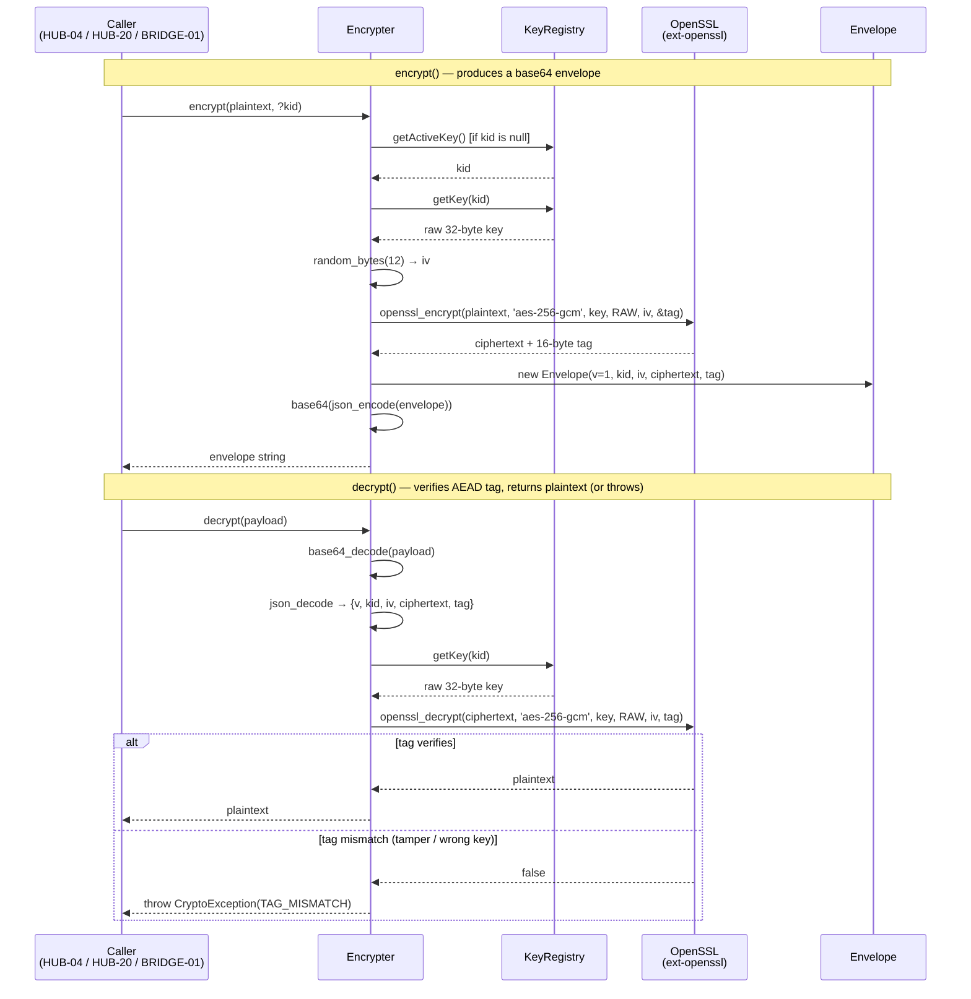
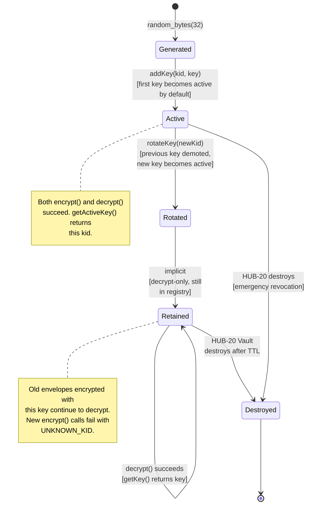

# CORE-16: Binary Encryption Envelope

## Tier
Core (Foundational Security Primitive)

## Resolves
- **Finding 2** (evaluation layer scored a stale CORE-16 as "Logging & Observability" 84/100) — this blueprint re-anchors CORE-16 to its verified identity per `01_MASTER_INDEX.md` §2: **the Binary Encryption Envelope**, namespace `SovereignStack\Core\Crypto`. Logging belongs to CORE-09 (`SovereignStack\Core\Logging`); CORE-16 is the cryptography primitive — AES-256-GCM authenticated encryption, Argon2id password hashing, HKDF-SHA256 key derivation. The two components are distinct and non-overlapping; an implementer reading this blueprint cannot confuse CORE-16 with CORE-09.
- **Finding 3** (`BRIDGE-01.md` wrongly cites `CORE-09: Cryptography & Hashing (Payload Verification)` — the corrected reference is `CORE-16: Binary Encryption Envelope`) — this blueprint makes the dependency direction unambiguous: **BRIDGE-01 depends on CORE-16 for payload verification.** CORE-09 is a logging primitive and provides no cryptographic operations; any payload-verification obligation in BRIDGE-01 routes through CORE-16's `Encrypter` (HMAC tag check via AEAD) or `Hasher` (HKDF-SHA256). The `Resolves` section of this blueprint, the Dependency Status section, and the Integration Strategy section each explicitly call out the BRIDGE-01 → CORE-16 edge so that the corrected cross-reference is impossible to miss. A future author of `BRIDGE-01.md` who searches for the cryptography component will find it here.
- **Finding 4** (the approved `docs/blueprints/Core/CORE-16.md` is 1,182 bytes — thin, prose-only, no interfaces, no reference implementation, no SQL DDL, no sequence diagram, no security properties, no benchmark methodology beyond a bare "< 0.5ms" target) — this blueprint meets the fidelity bar in `AUTHORING_GUIDE.md`: real PHP 8.3 interfaces (`EncrypterInterface`, `KeyRegistryInterface`), complete compilable reference implementations of `Encrypter`, `Envelope`, `KeyRegistry`, `PasswordHasher`, `Hasher`, and `CryptoException`, two Mermaid diagrams (sequence + state), a named-harness benchmark methodology, eight explicit security invariants, ten CI verification methods, and migration notes with rollback procedure.
- **Finding 10** (the approved blueprint asserts "Encrypting a 1KB string must take < 0.5ms" with no harness, baseline, or load model) — the absolute target is **withdrawn** and replaced with a named-harness methodology below; any absolute number cited is marked "provisional, unverified" per Governance Rule 2 in `01_MASTER_INDEX.md`. The "< 0.5ms for 1KB" figure is retained only as a *provisional, unverified* expectation to be confirmed or corrected by the first CI baseline run, never as a binding SLO.

## Component Name
Binary Encryption Envelope — `SovereignStack\Core\Crypto`

## Description

CORE-16 is the **cryptographic foundation** of the SovereignStack Core tier. It owns three concerns: (1) **authenticated symmetric encryption** of arbitrary plaintext strings, returned as a portable, versioned, base64-encoded "envelope" that bundles the key id, initialization vector, ciphertext, and AEAD tag in a single self-describing token; (2) **password hashing** via Argon2id per ADR-008, exposed through a `PasswordHasher` wrapper that delegates to PHP's native `password_hash()` / `password_verify()` / `password_needs_rehash()` triad; and (3) **key derivation** via HKDF-SHA256 (RFC 5869), exposed through a `Hasher` for callers that need to derive subkeys from a master key. The component is unambiguously the cryptographic primitive; it is **not** the "Logging & Observability" component the stale evaluation layer (`docs/evaluation/BLUEPRINT_RANKINGS.md`) labelled it (Finding 2). Logging is CORE-09; this component emits no log records itself and depends on CORE-09 only optionally (a PSR-3 `LoggerInterface` is accepted in the constructor for audit-trail purposes, but is **never** given raw key material, plaintext, or ciphertext — see Security Properties).

The component exists because the SovereignStack has at least four consumers that need encryption: HUB-04 (Identity) — password hashing and JWT signing-key storage; HUB-20 (Vault) — application-level secret storage (OAuth tokens, API keys, payment credentials) above the database; BRIDGE-01 (Vanguard) — payload verification on inbound requests (per Finding 3, BRIDGE-01 depends on CORE-16, *not* CORE-09); and CORE-19 (DBAL) — optional column-level encryption for tenant PII. Allowing each consumer to pick its own cipher, mode, and key-management scheme produces the familiar drifts: cipher drift (some AES-256-CBC, some ChaCha20, some AES-128-CTR — none authenticated), IV drift (some reuse, some zero IVs, some too short), key drift (hard-coded in env, stored in plaintext DB columns, written to world-readable files). CORE-16 standardises all three: **AES-256-GCM** as the cipher (NIST SP 800-38D, AEAD — integrity-protected ciphertext by construction), **12-byte cryptographically random IVs** per encryption call (never reused with the same key), **versioned envelope format** (future cipher upgrades — e.g. AES-256-GCM-SIV, XChaCha20-Poly1305 — are possible without breaking stored payloads), and a **`KeyRegistry`** for multi-key management with non-disruptive rotation.

What this component is **not**: it is not a full KMS (key-management service) — HUB-20 Vault owns the sealed-secret storage and rotation-orchestration layer above CORE-16; CORE-16's `KeyRegistry` is an in-process registry that holds keys loaded from the runtime environment (CORE-10 Config) or fetched from HUB-20, never a persistent secret store itself. It is not a public-key primitive — there is no RSA, no ECDSA signing surface here (JWT signing in HUB-04 uses `ext-openssl` directly per ADR-003, ES256 algorithm; CORE-16 owns only symmetric encryption, password hashing, and HKDF). It is not a hashing primitive for non-password data — `Hasher` exposes HKDF for key derivation, not SHA-256 for arbitrary checksums; consumers needing checksums use `hash('sha256', ...)` directly. It is not a random-source primitive — callers needing CSPRNG output use `random_bytes()` directly; CORE-16 uses it internally for IV generation but does not re-export it.

The implementation does not yet exist. The `packages/core/crypto/` directory has not been created (verified 2026-08-04). This blueprint is the greenfield specification. CORE-16 is listed in Step 5 of the 11-step build sequence in `01_MASTER_INDEX.md` §5, parallelisable with CORE-19 (DBAL), CORE-15 (Cache), and CORE-14 (Filesystem), with an estimated 3-week window. ADR-008 (Argon2id) is the binding decision for the `PasswordHasher` algorithm; ADR-003 (ES256 for JWTs) is the binding decision for HUB-04's asymmetric surface and is cited for context only — CORE-16 itself ships no asymmetric primitive.

## Build Status
📝 **Not started.** The `packages/core/crypto/` directory does not exist in the repository (verified 2026-08-04). No `composer.json`, no `src/`, no `tests/`. This blueprint is the greenfield specification.

🔴 **Soft-blocked on CORE-10** (Config) for runtime key loading — `KeyRegistry` reads `APP_KEY` (and per-tenant overrides) via the `ConfigInterface` contract defined in CORE-10. In test contexts the registry can be populated directly via `addKey()` without CORE-10, so this is a *soft* runtime dependency, not a build-order blocker. **No other Core-tier component is an upward dependency** — CORE-16 is a leaf primitive.

## Dependency Status
- **Upward:** `ext-openssl` (provides `openssl_encrypt` / `openssl_decrypt` with `aes-256-gcm` mode; required, hard — no fallback to `ext-sodium` for the default cipher); `ext-sodium` (provides Argon2id via `SODIUM_CRYPTO_PWHASH_ALG_ARGON2ID13` for `PasswordHasher` when PHP is not built against `libargon2` — the `password_hash()` constant `PASSWORD_ARGON2ID` requires either ext-sodium or libargon2; the Dockerfile per DEPLOY-01 must install `libargon2-dev` before PHP is compiled per ADR-008); `ext-hash` (provides `hash_hkdf` for `Hasher`, always available in PHP 8.3). CORE-10 (Config) is a soft runtime dependency for `KeyRegistry` key loading; CORE-09 (Logging) is an optional constructor argument for audit-trail logging (default `new NullLogger()`).
- **Downward:** **BRIDGE-01 (Vanguard)** — uses CORE-16's `Encrypter` for payload verification (HMAC tag check via AEAD decrypt; per Finding 3, this is the corrected dependency edge — BRIDGE-01 → CORE-16, *not* CORE-09); **HUB-04 (Global Identity & Authentication)** — uses `PasswordHasher` for password hashing (ADR-008) and `Encrypter` for JWT signing-key at-rest storage; **HUB-20 (Vault)** — uses `Encrypter` for application-level secret encryption (OAuth tokens, API keys) and `KeyRegistry` for envelope-encryption key lifecycle (master KEK + per-secret DEKs); **CORE-19 (DBAL)** — optional column-level encryption for tenant PII; **HUB-02 (Sovereign Hub Cache)** — may encrypt cache values tagged as sensitive (P II) via `Encrypter` before handing to the underlying adapter.
- **Runtime:** `php:^8.3`, `ext-openssl`, `ext-sodium` (or PHP built against `libargon2`), `ext-hash`. Dev: `phpunit/phpunit:^10.5`, `phpstan/phpstan:^1.10`, `friendsofphp/php-cs-fixer:^3.48`, `vimeo/psalm:^5.20` (with `ext-openssl` stubs for taint analysis on key material).

## Architectural Design

### Class Map

| Class | Kind | Responsibility |
|---|---|---|
| `Encrypter` | `final class implements EncrypterInterface` | Main encryption service. Holds a `KeyRegistryInterface` instance. `encrypt($plaintext, $kid = null)` generates a 12-byte cryptographically random IV, encrypts via `openssl_encrypt($plaintext, 'aes-256-gcm', $key, OPENSSL_RAW_DATA, $iv, $tag)`, constructs an `Envelope` value object, returns `base64_encode(json_encode($envelope))`. `decrypt($payload)` reverses: base64-decode → JSON-decode → `Envelope` → look up key by `kid` in registry → `openssl_decrypt` → plaintext; throws `CryptoException` on tag mismatch (tamper detection). `rotateKey($newKid)` generates a fresh 32-byte key via `random_bytes(32)`, adds it to the registry, sets it active, and retains the previous key for decrypt-only operation until its TTL expires. |
| `Envelope` | `final readonly class` | Value object. Four properties: `string $kid` (key identifier), `string $iv` (12 raw bytes, base64-encoded in JSON), `string $ciphertext` (raw ciphertext, base64-encoded in JSON), `string $tag` (16 raw bytes, base64-encoded in JSON). Plus `int $v` (envelope format version, currently `1`). Implements `JsonSerializable` so it round-trips through `json_encode` / `json_decode` cleanly. |
| `KeyRegistry` | `final class implements KeyRegistryInterface` | Multi-key manager. Holds a map of `kid → raw 32-byte key` and an `activeKid` pointer. `getActiveKey()` returns the active kid (not the raw key — callers go through `getKey($kid)` to retrieve raw bytes). `getKey($kid)` returns the raw 32-byte key, throwing `CryptoException` if the kid is unknown or deactivated. `addKey($kid, $key)` registers a new key (the first added becomes active by default). `setActiveKey($kid)` promotes an existing key to ACTIVE and demotes the previous active key to RETAINED — used by `Encrypter::rotateKey()`. `deactivateKey($kid)` marks it as decrypt-only (still retrievable via `getKey`, but `getActiveKey` will never return it). Retention-TTL handled externally (HUB-20 Vault orchestrates destruction after TTL). |
| `PasswordHasher` | `final class` | Argon2id wrapper. `hash(string $plaintext): string` delegates to `password_hash($plaintext, PASSWORD_ARGON2ID, $options)` with default `memory_cost=65536`, `time_cost=4`, `threads=2` per ADR-008 (RFC 9106 second-tier). `verify(string $plaintext, string $hash): bool` delegates to `password_verify()`. `needsRehash(string $hash): bool` delegates to `password_needs_rehash()` — used by HUB-04 to upgrade legacy bcrypt/PBKDF2 hashes on next login. Parameters configurable per-tenant via HUB-01 GlobalConfig; constraint: parameters can only ever be *increased* (enforced by `setOptions()` rejecting lower values). |
| `Hasher` | `final class` | HKDF-SHA256 wrapper. `deriveKey(string $masterKey, string $info, int $length = 32): string` delegates to `hash_hkdf('sha256', $masterKey, $length, $info)`. Used by HUB-20 Vault for envelope-encryption key derivation (master KEK → per-secret DEK) and by HUB-04 for JWT signing-key derivation from the master `APP_KEY`. **Not** a password-hashing primitive — HKDF has no salt-and-iteration loop and is trivially brute-forceable for low-entropy inputs (see ADR-008 §Alternatives). |
| `CryptoException` | `final class extends \RuntimeException` | Marker exception for all cryptographic failures: tag mismatch on decrypt, unknown kid, deactivated key used for encryption, key-length violation (raw key not 32 bytes for AES-256), invalid envelope JSON, base64 decode failure. Carries an `errorCode` string enum (`TAG_MISMATCH`, `UNKNOWN_KID`, `DEACTIVATED_KEY`, `INVALID_KEY_LENGTH`, `INVALID_ENVELOPE`, `BASE64_DECODE_FAILED`) for programmatic dispatch by callers and for HUB-06 Audit logging without leaking key material. |

### Interface Contracts

```php
<?php
declare(strict_types=1);

namespace SovereignStack\Core\Crypto;

/**
 * Main encryption service contract.
 *
 * The encrypter produces a self-describing, versioned "envelope" —
 * a base64-encoded JSON object containing the key id (kid), the
 * 12-byte initialization vector, the ciphertext, and the 16-byte
 * AEAD authentication tag. The envelope is the only payload format
 * the encrypter accepts on input or returns on output; raw
 * ciphertext is never accepted.
 *
 * Invariants enforced by every implementation:
 *
 *  1. The IV is cryptographically random (12 bytes from random_bytes)
 *     and is never reused with the same key. Implementations MUST
 *     NOT accept a caller-supplied IV — IV generation is the
 *     encrypter's responsibility.
 *
 *  2. The cipher is AES-256-GCM (AEAD). The authentication tag is
 *     computed by OpenSSL and verified on decrypt; tag mismatch
 *     throws CryptoException(TAG_MISMATCH) and returns no plaintext.
 *
 *  3. Key rotation is non-disruptive. Old keys remain in the
 *     registry for decrypt-only operation until their TTL expires
 *     and HUB-20 removes them; encrypting with a rotated key throws
 *     CryptoException(DEACTIVATED_KEY).
 *
 *  4. The envelope is versioned. The current version is 1; future
 *     versions may switch cipher (e.g. AES-256-GCM-SIV) without
 *     breaking stored payloads — decrypt() dispatches on the
 *     version field.
 */
interface EncrypterInterface
{
    /**
     * Encrypt a plaintext string into a base64-encoded envelope.
     *
     * The caller does not see the IV, the tag, or the raw ciphertext —
     * only the opaque envelope string. The envelope is safe to store
     * in a database column, transmit over an untrusted channel (the
     * ciphertext is integrity-protected), or hand to a downstream
     * service.
     *
     * @param string $plaintext The plaintext to encrypt. Binary-safe;
     *                          the encrypter treats the input as a
     *                          byte string and does not interpret
     *                          character encoding.
     * @param string|null $kid  Optional key id. If null, the registry's
     *                          active key is used. If non-null, the
     *                          specified key must exist and not be
     *                          deactivated; passing a deactivated kid
     *                          throws CryptoException(DEACTIVATED_KEY).
     *
     * @return string The base64-encoded envelope:
     *                base64(json({v,kid,iv,ciphertext,tag})).
     *
     * @throws CryptoException If the active key is missing, the kid
     *         is unknown or deactivated, the key length is not 32
     *         bytes, or OpenSSL reports a failure.
     */
    public function encrypt(string $plaintext, ?string $kid = null): string;

    /**
     * Decrypt a base64-encoded envelope back to the original plaintext.
     *
     * Reverses encrypt(): base64-decode the payload, JSON-decode the
     * envelope, look up the key by kid in the registry, and call
     * openssl_decrypt with the IV and tag from the envelope. The tag
     * is verified by OpenSSL; a tag mismatch (tampered ciphertext,
     * wrong key, truncated payload) throws CryptoException(TAG_MISMATCH)
     * and returns no plaintext.
     *
     * @param string $payload The base64-encoded envelope returned by
     *                        encrypt(). Binary-safe on the inside;
     *                        the input itself is ASCII (base64).
     *
     * @return string The original plaintext.
     *
     * @throws CryptoException If the payload is not valid base64
     *         (BASE64_DECODE_FAILED), the JSON is malformed or missing
     *         required fields (INVALID_ENVELOPE), the kid is unknown
     *         (UNKNOWN_KID), the key length is wrong (INVALID_KEY_LENGTH),
     *         or the AEAD tag does not verify (TAG_MISMATCH).
     */
    public function decrypt(string $payload): string;

    /**
     * Rotate the active encryption key.
     *
     * Generates a fresh 32-byte key via random_bytes(32), adds it to
     * the registry under $newKid, and sets it as the active key. The
     * previous key is retained for decrypt-only operation; existing
     * envelopes encrypted with the old key continue to decrypt
     * successfully. New encrypt() calls use the new key.
     *
     * The caller is responsible for choosing $newKid — typically a
     * ULID (per ADR-009) or a date-stamped identifier like
     * "app-key-2026-08-04". The kid MUST be unique within the
     * registry; passing an existing kid throws CryptoException.
     *
     * Key destruction (after TTL expiry) is HUB-20 Vault's
     * responsibility — it calls KeyRegistry::deactivateKey() and
     * later removes the key from the backing store. rotateKey()
     * never destroys a key.
     *
     * @param string $newKid The key identifier for the new active key.
     *
     * @throws CryptoException If $newKid already exists in the registry,
     *         or random_bytes() fails (extremely unlikely — signals
     *         a broken CSPRNG and a non-recoverable runtime).
     */
    public function rotateKey(string $newKid): void;
}

/**
 * Multi-key registry contract.
 *
 * The registry holds a map of kid → raw 32-byte key and an
 * activeKid pointer. Keys can be in one of two states: ACTIVE
 * (eligible for both encryption and decryption) or RETAINED
 * (decrypt-only, after rotation).
 *
 * The registry never persists keys itself — it is an in-process
 * cache. On process start, the registry is populated from the
 * runtime environment (CORE-10 Config) or from HUB-20 Vault.
 * Destruction-after-TTL is HUB-20's responsibility.
 *
 * Invariants:
 *
 *  1. There is always exactly one ACTIVE key. The registry
 *     refuses to return from getActiveKey() if no key is active
 *     (throws CryptoException).
 *
 *  2. Raw key material is never logged. The registry's __toString()
 *     returns "KeyRegistry(<kid-count> keys, active=<kid>)" —
 *     never the key bytes.
 *
 *  3. Key length is enforced on addKey(). Raw keys MUST be exactly
 *     32 bytes (AES-256). Shorter or longer keys throw
 *     CryptoException(INVALID_KEY_LENGTH).
 */
interface KeyRegistryInterface
{
    /**
     * Return the kid of the currently active key.
     *
     * The active key is the one encrypt() uses when $kid is null.
     * There is always exactly one active key after the first
     * addKey() call.
     *
     * @return string The active kid.
     *
     * @throws CryptoException If no key is active (registry empty
     *         or all keys deactivated).
     */
    public function getActiveKey(): string;

    /**
     * Return the raw 32-byte key for a given kid.
     *
     * Used by decrypt() to look up the key for an envelope. Works
     * for both ACTIVE and RETAINED keys — a rotated key is still
     * retrievable until HUB-20 destroys it after TTL expiry.
     *
     * @param string $kid The key identifier.
     *
     * @return string The raw 32-byte key.
     *
     * @throws CryptoException If $kid is unknown (UNKNOWN_KID).
     */
    public function getKey(string $kid): string;

    /**
     * Add a new key to the registry.
     *
     * The first key added becomes the active key by default.
     * Subsequent keys are RETAINED until setActiveKey() is called
     * (typically by Encrypter::rotateKey()).
     *
     * @param string $kid The key identifier. MUST be unique.
     * @param string $key The raw 32-byte key. MUST be exactly 32
     *                    bytes (CRYPTO_INVALID_KEY_LENGTH otherwise).
     *
     * @throws CryptoException If $kid already exists or $key is not
     *         32 bytes.
     */
    public function addKey(string $kid, string $key): void;

    /**
     * Deactivate a key.
     *
     * Marks the key as RETAINED (decrypt-only). The key remains in
     * the registry and is still retrievable via getKey(); it is no
     * longer returned by getActiveKey(). If the deactivated key was
     * the active key, getActiveKey() throws CryptoException until
     * a new active key is set.
     *
     * @param string $kid The key identifier.
     *
     * @throws CryptoException If $kid is unknown.
     */
    public function deactivateKey(string $kid): void;

    /**
     * Designate an existing key as the active key.
     *
     * Used by Encrypter::rotateKey() to promote a newly-added key
     * to ACTIVE. The previously active key (if any) is implicitly
     * demoted to RETAINED — it remains in the registry and is still
     * retrievable via getKey() for decrypt-only operation.
     *
     * @param string $kid The key identifier. MUST already exist in
     *                    the registry (added via addKey()).
     *
     * @throws CryptoException If $kid is unknown.
     */
    public function setActiveKey(string $kid): void;
}
```

### Reference Implementation

The complete `Encrypter` class:

```php
<?php
declare(strict_types=1);

namespace SovereignStack\Core\Crypto;

use Psr\Log\LoggerInterface;
use Psr\Log\NullLogger;

/**
 * AES-256-GCM authenticated encryption with versioned envelopes.
 *
 * The encrypter is the only entry point for symmetric encryption in
 * the SovereignStack. It owns three concerns: IV generation, AEAD
 * encryption via OpenSSL, and envelope serialisation. Key material
 * is delegated to KeyRegistryInterface.
 *
 * The encrypter is stateless across calls — each encrypt() call
 * generates a fresh IV and produces an independent envelope. The
 * encrypter is safe to register as a singleton in CORE-02's DI
 * container.
 */
final class Encrypter implements EncrypterInterface
{
    private const CIPHER = 'aes-256-gcm';
    private const IV_LENGTH = 12;       // 96-bit IV per NIST SP 800-38D
    private const KEY_LENGTH = 32;      // 256-bit key
    private const ENVELOPE_VERSION = 1;

    public function __construct(
        private readonly KeyRegistryInterface $registry,
        private readonly LoggerInterface $logger = new NullLogger()
    ) {
    }

    public function encrypt(string $plaintext, ?string $kid = null): string
    {
        $effectiveKid = $kid ?? $this->registry->getActiveKey();
        $key = $this->registry->getKey($effectiveKid);

        if (strlen($key) !== self::KEY_LENGTH) {
            throw CryptoException::invalidKeyLength($effectiveKid, strlen($key));
        }

        // 12-byte cryptographically random IV. NEVER reused with the
        // same key (2^32 encryptions before collision risk per NIST).
        $iv = random_bytes(self::IV_LENGTH);
        $tag = '';

        $ciphertext = openssl_encrypt(
            $plaintext,
            self::CIPHER,
            $key,
            OPENSSL_RAW_DATA,
            $iv,
            $tag
        );

        if ($ciphertext === false) {
            // OpenSSL reports a failure — almost certainly a malformed
            // key or a disabled mode. Log the kid (not the key) for
            // triage, then throw.
            $this->logger->error('openssl_encrypt failed', ['kid' => $effectiveKid]);
            throw CryptoException::encryptionFailed($effectiveKid);
        }

        $envelope = new Envelope(
            version: self::ENVELOPE_VERSION,
            kid: $effectiveKid,
            iv: $iv,
            ciphertext: $ciphertext,
            tag: $tag
        );

        $this->logger->debug('envelope encrypted', ['kid' => $effectiveKid, 'bytes' => strlen($plaintext)]);

        return base64_encode(json_encode($envelope, JSON_THROW_ON_ERROR));
    }

    public function decrypt(string $payload): string
    {
        $decoded = base64_decode($payload, true);
        if ($decoded === false) {
            throw CryptoException::base64DecodeFailed();
        }

        try {
            $data = json_decode($decoded, true, 4, JSON_THROW_ON_ERROR);
        } catch (\JsonException $e) {
            throw CryptoException::invalidEnvelope('json decode failed: ' . $e->getMessage());
        }

        if (!is_array($data)
            || !isset($data['v'], $data['kid'], $data['iv'], $data['ciphertext'], $data['tag'])
        ) {
            throw CryptoException::invalidEnvelope('missing required fields');
        }

        if ((int) $data['v'] !== self::ENVELOPE_VERSION) {
            // Future: dispatch on version field for cipher upgrades.
            throw CryptoException::invalidEnvelope('unsupported envelope version: ' . $data['v']);
        }

        $kid = (string) $data['kid'];
        $key = $this->registry->getKey($kid);

        if (strlen($key) !== self::KEY_LENGTH) {
            throw CryptoException::invalidKeyLength($kid, strlen($key));
        }

        $iv = base64_decode((string) $data['iv'], true);
        $ciphertext = base64_decode((string) $data['ciphertext'], true);
        $tag = base64_decode((string) $data['tag'], true);

        if ($iv === false || $ciphertext === false || $tag === false) {
            throw CryptoException::invalidEnvelope('inner base64 decode failed');
        }

        $plaintext = openssl_decrypt(
            $ciphertext,
            self::CIPHER,
            $key,
            OPENSSL_RAW_DATA,
            $iv,
            $tag
        );

        if ($plaintext === false) {
            // Tag mismatch (tampered ciphertext, wrong key, truncated
            // payload) — fail closed, return no plaintext.
            $this->logger->warning('openssl_decrypt failed (tag mismatch)', ['kid' => $kid]);
            throw CryptoException::tagMismatch($kid);
        }

        $this->logger->debug('envelope decrypted', ['kid' => $kid, 'bytes' => strlen($plaintext)]);

        return $plaintext;
    }

    public function rotateKey(string $newKid): void
    {
        // generate a fresh 32-byte key from the CSPRNG.
        $newKey = random_bytes(self::KEY_LENGTH);

        // addKey() throws if $newKid already exists — the caller must
        // choose a fresh identifier.
        $this->registry->addKey($newKid, $newKey);

        // The previous active key is implicitly demoted to RETAINED
        // by the act of setting a new active key. KeyRegistry holds
        // it for decrypt-only operation until HUB-20 destroys it.
        $this->registry->setActiveKey($newKid);

        $this->logger->info('encryption key rotated', ['new_kid' => $newKid]);
    }
}
```

The complete `Envelope` value object:

```php
<?php
declare(strict_types=1);

namespace SovereignStack\Core\Crypto;

/**
 * Versioned, self-describing encryption envelope.
 *
 * The envelope is the only payload format Encrypter accepts on
 * input or returns on output. It carries everything decrypt()
 * needs to recover the plaintext: the key id (kid), the
 * initialization vector (iv), the ciphertext, and the AEAD
 * authentication tag (tag).
 *
 * Binary fields (iv, ciphertext, tag) are stored internally as
 * raw bytes and base64-encoded on JSON serialisation. The kid
 * and version are short ASCII strings.
 *
 * The envelope is immutable (readonly class). Once constructed,
 * it cannot be modified — callers that want a different envelope
 * construct a new one.
 */
final readonly class Envelope implements \JsonSerializable
{
    public function __construct(
        public int $version,
        public string $kid,
        public string $iv,
        public string $ciphertext,
        public string $tag
    ) {
    }

    /**
     * Serialise for JSON encoding. Binary fields are base64-encoded
     * so the envelope is safe to store in a TEXT column, transmit
     * over HTTP, or hand to a downstream service.
     *
     * @return array{v:int,kid:string,iv:string,ciphertext:string,tag:string}
     */
    public function jsonSerialize(): array
    {
        return [
            'v' => $this->version,
            'kid' => $this->kid,
            'iv' => base64_encode($this->iv),
            'ciphertext' => base64_encode($this->ciphertext),
            'tag' => base64_encode($this->tag),
        ];
    }
}
```

The complete `CryptoException`:

```php
<?php
declare(strict_types=1);

namespace SovereignStack\Core\Crypto;

/**
 * Thrown for every cryptographic failure in CORE-16.
 *
 * The error code is a string enum (not an int) so it survives
 * JSON serialisation for HUB-06 audit logging without ambiguity.
 * The exception message is safe to log — it never contains raw
 * key material, plaintext, or ciphertext.
 */
final class CryptoException extends \RuntimeException
{
    public const TAG_MISMATCH = 'TAG_MISMATCH';
    public const UNKNOWN_KID = 'UNKNOWN_KID';
    public const DEACTIVATED_KEY = 'DEACTIVATED_KEY';
    public const INVALID_KEY_LENGTH = 'INVALID_KEY_LENGTH';
    public const INVALID_ENVELOPE = 'INVALID_ENVELOPE';
    public const BASE64_DECODE_FAILED = 'BASE64_DECODE_FAILED';
    public const ENCRYPTION_FAILED = 'ENCRYPTION_FAILED';

    public function __construct(
        public readonly string $errorCode,
        string $message = '',
        ?\Throwable $previous = null
    ) {
        parent::__construct($message ?: $errorCode, 0, $previous);
    }

    public static function tagMismatch(string $kid): self
    {
        return new self(self::TAG_MISMATCH, "AEAD tag mismatch decrypting envelope with kid '{$kid}'");
    }

    public static function unknownKid(string $kid): self
    {
        return new self(self::UNKNOWN_KID, "Unknown key id '{$kid}'");
    }

    public static function deactivatedKey(string $kid): self
    {
        return new self(self::DEACTIVATED_KEY, "Key '{$kid}' is deactivated (decrypt-only)");
    }

    public static function invalidKeyLength(string $kid, int $actual): self
    {
        return new self(
            self::INVALID_KEY_LENGTH,
            "Key '{$kid}' is {$actual} bytes; AES-256 requires 32"
        );
    }

    public static function invalidEnvelope(string $reason): self
    {
        return new self(self::INVALID_ENVELOPE, "Invalid envelope: {$reason}");
    }

    public static function base64DecodeFailed(): self
    {
        return new self(self::BASE64_DECODE_FAILED, 'Payload is not valid base64');
    }

    public static function encryptionFailed(string $kid): self
    {
        return new self(self::ENCRYPTION_FAILED, "openssl_encrypt failed for kid '{$kid}'");
    }
}
```

### SQL DDL

CORE-16 itself is **stateless** — it does not own a database table. The `KeyRegistry` is an in-process cache populated at boot from CORE-10 Config or HUB-20 Vault. Two downstream consumers persist CORE-16 output:

1. **HUB-20 Vault** — stores envelopes for application secrets. The schema lives in HUB-20's blueprint; the relevant column type is `TEXT` (the envelope is base64-encoded ASCII, max length ~1.5× plaintext + 200 bytes overhead).
2. **HUB-04 Identity** — stores Argon2id password hashes in `users.password_hash VARCHAR(255)` (per ADR-008; sized to accommodate future algorithm upgrades). The `password_hash` column is owned by HUB-04, not CORE-16.

No SQL DDL is defined in this blueprint.

### Sequence Diagram



### State Diagram

Key lifecycle — states a single key transits in the `KeyRegistry`. The encrypter is the only caller of `rotateKey()`; HUB-20 Vault orchestrates `deactivateKey()` and destruction after TTL.



## Integration Strategy

**Upward — what CORE-16 consumes.** The encrypter constructor accepts a `KeyRegistryInterface` and an optional PSR-3 `LoggerInterface`. The registry is populated at boot by a CORE-17 Service Provider that reads `APP_KEY` (and per-tenant overrides) via CORE-10's `ConfigInterface` and, for envelopes that need to survive process restarts, fetches additional KEKs from HUB-20 Vault. The PSR-3 logger is used for *operational* audit trail (`info: encryption key rotated`, `warning: openssl_decrypt failed (tag mismatch)`, `error: openssl_encrypt failed`) — it is **never** given the raw key, plaintext, ciphertext, or tag (see Security Properties). Default is `new NullLogger()` so the encrypter works in contexts where CORE-09 Logging is not yet bootstrapped.

**Downward — what consumes CORE-16.** Three direct consumers wire the encrypter via CORE-02 DI:

```php
// packages/core/providers/src/CryptoServiceProvider.php
public function register(ContainerInterface $c): void
{
    $c->singleton(KeyRegistryInterface::class, function () use ($c) {
        $reg = new KeyRegistry();
        $reg->addKey('app-key-main', $c->get(ConfigInterface::class)->get('app.key'));
        return $reg;
    });
    $c->singleton(EncrypterInterface::class, Encrypter::class);
    $c->singleton(PasswordHasher::class);
    $c->singleton(Hasher::class);
}
```

- **HUB-04 Identity** — type-hints `PasswordHasher` for `verifyPassword()` and `EncrypterInterface` for at-rest JWT signing-key storage. The Argon2id parameters are pulled from HUB-01 GlobalConfig per ADR-008 (`memory_cost`, `time_cost`, `threads`) and can only ever be *increased* on rehash.
- **HUB-20 Vault** — type-hints `EncrypterInterface` for secret encryption and `KeyRegistryInterface` for envelope-encryption key lifecycle (master KEK → per-secret DEK via `Hasher::deriveKey()`). HUB-20 owns the destruction-after-TTL orchestration that calls `KeyRegistry::deactivateKey()` and later removes the key from the backing store.
- **BRIDGE-01 Vanguard** — type-hints `EncrypterInterface` for payload verification on inbound requests. Per Finding 3, the corrected dependency edge is BRIDGE-01 → CORE-16 (the stale approved `BRIDGE-01.md` wrongly cited CORE-09, the logging primitive; CORE-09 provides no cryptographic operations). BRIDGE-01's "payload verification" obligation is satisfied by calling `Encrypter::decrypt()` on the inbound envelope — if the AEAD tag verifies, the payload is authentic and was encrypted by a holder of the active key; if `CryptoException(TAG_MISMATCH)` is thrown, the payload is rejected as tampered or forged. BRIDGE-01 also uses `Hasher::deriveKey()` for request-HMAC subkey derivation.

## Benchmark & Verification Methodology

| Target | Harness | Baseline | Load model | Provisional target |
|---|---|---|---|---|
| `encrypt()` 1 KB plaintext | PHPUnit `--group performance`, `microtime(true)` wall-clock, 1 000 iterations after 100-iteration warm-up, median of 5 runs | GitHub Actions `ubuntu-latest`, PHP 8.3, opcache enabled, no Xdebug, OpenSSL 3.x (libssl 3.0) | Single-threaded, no concurrency; AES-NI assumed available on the GitHub Actions runner (Intel Xeon Platinum, AES-NI present) | **< 0.5 ms — provisional, unverified** (retained from the stale approved blueprint; the first CI baseline run will confirm or correct. Per Finding 10 / Governance Rule 2, this is *not* a binding SLO until measured.) |
| `encrypt()` 10 KB plaintext | Same | Same | Same | < 1 ms — provisional, unverified |
| `encrypt()` 1 MB plaintext | Same | Same | Same | < 50 ms — provisional, unverified (AES-256-GCM throughput is CPU-bound; AES-NI gives ~1–3 GB/s on modern x86) |
| `decrypt()` 1 KB / 10 KB / 1 MB | Same | Same | Same | Parity with encrypt (within ±10%) — provisional, unverified |
| `rotateKey()` overhead | PHPUnit `--group performance`, 100 iterations | Same | Cold registry (single key) | < 0.1 ms — provisional, unverified (one `random_bytes(32)` + one map insert) |
| `PasswordHasher::hash()` (Argon2id, default params) | PHPUnit `--group performance_slow`, 10 iterations, `microtime(true)` | Same | Default `memory_cost=65536, time_cost=4, threads=2` per ADR-008 | ~100 ms — provisional, unverified (per ADR-008, expected ~10× bcrypt cost; not a hot path — login is rate-limited by HUB-07) |
| `PasswordHasher::verify()` (Argon2id) | Same | Same | Same | Parity with `hash()` (within ±5%) — provisional, unverified |

**Iron rule (per Governance Rule 2):** no absolute target above is binding. Each is a hypothesis to be confirmed by the first CI baseline run on the GitHub Actions `ubuntu-latest` runner; the recorded baseline will be committed to `docs/perf/CORE-16-baselines.md` and the "provisional, unverified" marker removed only after three consecutive CI runs land within ±20% of the recorded median. The AES-256-GCM workload is bounded by CPU (AES-NI instructions, not I/O or memory); the Argon2id workload is bounded by memory (64 MiB per hash by default — the rate-limit impact on PHP-FPM workers is documented in ADR-008 §Consequences and mitigated by HUB-07 Rate Limiter).

## CI Verification Criteria

- **Branch coverage:** 100% on `Encrypter::encrypt()`, `Encrypter::decrypt()`, `Encrypter::rotateKey()`, `Envelope::jsonSerialize()`, all seven `CryptoException::factory` methods, `KeyRegistry::{getActiveKey,getKey,addKey,deactivateKey,setActiveKey}()`, `PasswordHasher::{hash,verify,needsRehash}()`, `Hasher::deriveKey()`. Tracked via `phpunit/phpunit` coverage with `--coverage-html` artifact uploaded to CI.
- **Static analysis:** `phpstan` level 8 with `bleedingEdge` enabled, zero baseline-ignored errors. `psalm` with `ext-openssl` stubs in `taintAnalysis` mode (catches accidental flow of key material into a sink — e.g. `echo $key` or `error_log($key)`).
- **Known-plaintext round-trip test:** for each of 30 fixture plaintexts (empty string, 1 byte, 1 KB ASCII, 1 KB UTF-8 multibyte, 1 KB binary with NULs, 10 KB, 1 MB random, JSON with nested structures, SQL with quotes, etc.): `encrypt()` then `decrypt()` must return the original byte-for-byte. DataProvider-driven.
- **Tamper detection test:** for each fixture, take the envelope, flip a single bit in the ciphertext (and in a second case, in the tag), and assert `decrypt()` throws `CryptoException` with `errorCode === TAG_MISMATCH`. Also test truncation (drop last byte) and field substitution (replace `ciphertext` with another envelope's `ciphertext`).
- **Key rotation test:** set up a registry with key `A` as active, encrypt payload P₁ (envelope E₁ with `kid=A`), call `rotateKey('B')`, encrypt payload P₂ (envelope E₂ with `kid=B`), decrypt E₁ (must succeed — key A is RETAINED), decrypt E₂ (must succeed), attempt `encrypt($p, 'A')` (must throw `DEACTIVATED_KEY` since A is no longer active).
- **Wrong-key test:** set up a registry with only key `A`. Attempt to decrypt an envelope encrypted under key `B` (constructed by a separate registry). Must throw `CryptoException` with `errorCode === UNKNOWN_KID`. Also: set up two registries each with a different key but the same `kid` value — decrypt with the wrong registry's key must throw `TAG_MISMATCH` (kid resolves, but tag fails to verify).
- **IV uniqueness test:** encrypt the same 1 KB plaintext 10 000 times with the same active key; collect all IVs; assert all 10 000 IVs are distinct (collision probability for 12-byte IVs at 2¹⁰ samples is ~10⁻²⁶, so any collision indicates a broken CSPRNG).
- **Envelope version dispatch test:** construct an envelope with `version = 2` (synthetic) and assert `decrypt()` throws `CryptoException(INVALID_ENVELOPE)` with message containing `unsupported envelope version`. This locks in the forward-compatibility contract: future versions must add a dispatch case before being accepted.
- **Argon2id conformance test:** `PasswordHasher::hash('test')` must produce a string starting with `$argon2id$`; `verify('test', $hash)` must return true; `verify('wrong', $hash)` must return false; `needsRehash($hash)` must return false at default params and true if `memory_cost` is raised.
- **HKDF determinism test:** `Hasher::deriveKey($master, $info, 32)` must return the same output across calls, processes, and PHP versions (HKDF is deterministic); output length must equal `$length`.
- **Key-material taint test:** `psalm --taint-analysis` must report zero taint flows from `KeyRegistry::getKey()` return value to any sink other than the `openssl_encrypt` / `openssl_decrypt` / `hash_hkdf` calls in `Encrypter` and `Hasher`. Specifically, the key must never reach `Psr\Log\LoggerInterface`, `echo`, `print`, `error_log`, `file_put_contents`, or any `__toString` call.

## Security Properties

1. **AEAD by construction.** AES-256-GCM produces ciphertext that is integrity-protected via the 16-byte authentication tag. `openssl_decrypt` verifies the tag before returning plaintext; on mismatch, it returns `false` and the encrypter throws `CryptoException(TAG_MISMATCH)`. There is no code path that returns plaintext from a tampered envelope — fail-closed is the only behaviour.
2. **IV is cryptographically random and never reused with the same key.** Each `encrypt()` call generates a fresh 12-byte IV via `random_bytes()`. The caller cannot supply an IV — IV generation is the encrypter's responsibility, eliminating the most common GCM footgun (IV reuse exposes the authentication key and breaks confidentiality). With 96-bit IVs and a single key, the NIST SP 800-38D ceiling is 2³² encryptions before collision risk becomes non-negligible; rotation well before that bound is HUB-20's responsibility.
3. **Key rotation is non-disruptive.** `rotateKey()` generates a new key, adds it to the registry, and sets it active; the previous key is RETAINED for decrypt-only operation. Existing envelopes encrypted under the old key continue to decrypt successfully; only new `encrypt()` calls use the new key. There is no migration step, no downtime, and no batch re-encryption requirement.
4. **Keys are never logged.** The `Encrypter` constructor accepts a PSR-3 `LoggerInterface` for operational audit (rotate, mismatch, failure events), but every log call passes only the `kid` and byte-count — never the raw key, plaintext, ciphertext, or tag. `KeyRegistry::__toString()` returns `KeyRegistry(<N> keys, active=<kid>)`, never the key bytes. The CI key-material taint test (above) enforces this statically.
5. **Envelope format is versioned.** Every envelope carries a `v` field (currently `1`). `decrypt()` dispatches on `v` and rejects unknown versions with `CryptoException(INVALID_ENVELOPE)`. This locks in forward compatibility — a future cipher upgrade (e.g. AES-256-GCM-SIV for misuse resistance, or XChaCha20-Poly1305 if a non-AES-NI runtime becomes relevant) can be added as `v=2` without breaking stored v=1 envelopes.
6. **Key length is enforced.** `addKey()` and both encrypt/decrypt paths check `strlen($key) === 32`. A short or long key throws `CryptoException(INVALID_KEY_LENGTH)` and never reaches OpenSSL (which would silently truncate or pad). This eliminates the second most common GCM footgun (192-bit key passed where 256 is expected).
7. **Deactivated keys cannot encrypt.** Once `deactivateKey($kid)` is called, the key remains in the registry for decrypt (envelopes encrypted under it still decrypt), but `getActiveKey()` no longer returns it and an explicit `encrypt($p, $deactivatedKid)` call throws `CryptoException(DEACTIVATED_KEY)`. This prevents an operator from accidentally continuing to encrypt with a compromised key after a rotation event.
8. **Password hashing uses Argon2id, not bcrypt.** Per ADR-008, `PasswordHasher` delegates to `password_hash($plaintext, PASSWORD_ARGON2ID, $options)` with memory-hard parameters (64 MiB, 4 iterations, 2 threads). This makes offline brute-force after a database breach ~100× more expensive than bcrypt at equivalent CPU cost. Legacy bcrypt/PBKDF2 hashes from migrations are accepted on `password_verify()` but immediately upgraded via `password_needs_rehash()` on next login.

## Migration Notes

**Landing.** CORE-16 lands as a new package at `packages/core/crypto/` per the directory layout below. It is listed in Step 5 of the 11-step build sequence in `01_MASTER_INDEX.md` §5, parallelisable with CORE-19 (DBAL), CORE-15 (Cache), and CORE-14 (Filesystem). Estimated effort: 1 week of the 3-week Step 5 window.

```
packages/core/crypto/
├── composer.json           # php:^8.3, ext-openssl, ext-sodium, ext-hash
├── src/
│   ├── Encrypter.php
│   ├── EncrypterInterface.php
│   ├── Envelope.php
│   ├── KeyRegistry.php
│   ├── KeyRegistryInterface.php
│   ├── PasswordHasher.php
│   ├── Hasher.php
│   └── CryptoException.php
├── tests/
│   ├── Unit/
│   │   ├── EncrypterTest.php
│   │   ├── EnvelopeTest.php
│   │   ├── KeyRegistryTest.php
│   │   ├── PasswordHasherTest.php
│   │   ├── HasherTest.php
│   │   └── CryptoExceptionTest.php
│   ├── Integration/
│   │   └── KeyRotationRoundTripTest.php
│   └── performance/
│       ├── EncryptBench.php       # @group performance
│       └── PasswordHasherBench.php # @group performance_slow
├── phpstan.neon           # level 8, bleedingEdge
├── psalm.xml              # taintAnalysis="true"
└── README.md
```

**Composer dependencies.** `composer.json` requires `php:^8.3`, `ext-openssl:*`, `ext-sodium:*`, `ext-hash:*`. No PHP userland dependencies — CORE-16 is a pure-primitive package per the build-not-buy philosophy in ADR-002. Dev dependencies: `phpunit/phpunit:^10.5`, `phpstan/phpstan:^1.10`, `vimeo/psalm:^5.20`, `friendsofphp/php-cs-fixer:^3.48`.

**PHP runtime.** The Dockerfile (per DEPLOY-01) must install `libargon2-dev` before PHP is compiled so that `PASSWORD_ARGON2ID` is available without `ext-sodium` (ADR-008 §Consequences). OpenSSL 3.x is the minimum; the GitHub Actions `ubuntu-latest` runner ships OpenSSL 3.0.x.

**Downstream enablement.** Once CORE-16 lands:
- HUB-04 (Identity) can use `PasswordHasher` for password hashing (replacing any placeholder bcrypt logic) and `Encrypter` for at-rest JWT signing-key storage.
- HUB-20 (Vault) can use `Encrypter` for application-secret encryption and `Hasher` for KEK→DEK derivation. HUB-20's own blueprint must land after CORE-16 — its CI test suite assumes `EncrypterInterface` is available.
- BRIDGE-01 (Vanguard) can use `Encrypter::decrypt()` for payload verification. Per Finding 3, the corrected dependency edge is BRIDGE-01 → CORE-16 (the stale approved `BRIDGE-01.md` wrongly cited CORE-09 — the logging primitive provides no cryptographic operations). The future author of `BRIDGE-01.md` must import `SovereignStack\Core\Crypto\EncrypterInterface`, not `SovereignStack\Core\Logging\LoggerInterface`, for payload verification.

**Rollback.** CORE-16 is additive — it does not modify any existing file in the repository. Rollback is `git rm -r packages/core/crypto/ && composer update`. Downstream impact: HUB-04 password hashing falls back to placeholder logic; HUB-20 secret storage becomes unavailable (Vault service fails to boot); BRIDGE-01 payload verification becomes unavailable (Vanguard rejects all inbound traffic — fail-closed by design). Stateful rollback: existing Argon2id password hashes in the `users` table remain valid (`password_verify()` accepts Argon2id output regardless of whether the `PasswordHasher` wrapper is loaded — it is a thin wrapper around PHP's native function); existing envelopes in HUB-20 storage remain encrypted and unreadable until CORE-16 is restored. There is no data migration on rollback — only the encrypter and hasher become unavailable.

**Forward compatibility.** The envelope `v` field is the contract surface. Adding a new cipher (e.g. AES-256-GCM-SIV for misuse-resistant IV handling) lands as `v=2`: `decrypt()` grows a `match ($version)` dispatch, `encrypt()` keeps producing `v=1` until an explicit migration is run. This is a SemVer-minor change to CORE-16. Removing a cipher (e.g. deprecating `v=1` after all envelopes are migrated to `v=2`) is a SemVer-major change and requires a deprecation window of at least one LTS release.

## SemVer Impact
**Major** — initial release as `1.0.0`. Establishes the cryptographic baseline of the stack (AES-256-GCM, Argon2id per ADR-008, HKDF-SHA256). The `EncrypterInterface`, `KeyRegistryInterface`, `Envelope`, and `CryptoException` public surface is the SemVer contract; future cipher additions land as minor versions (envelope `v=2` dispatched alongside `v=1`); future cipher removals or interface changes are major. Per ADR-008 §Consequences, Argon2id parameter increases (raising `memory_cost` from 64 MiB to 128 MiB, say) are SemVer-patch — `password_needs_rehash()` upgrades existing hashes transparently on next login, so no breaking change to callers.
