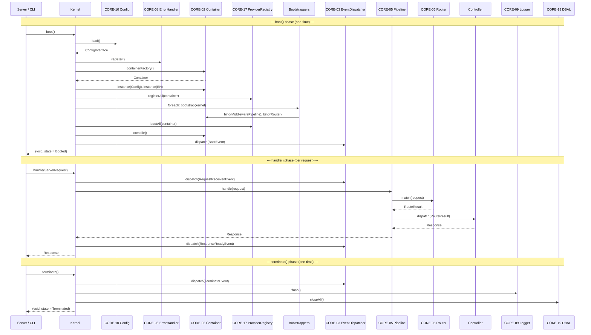
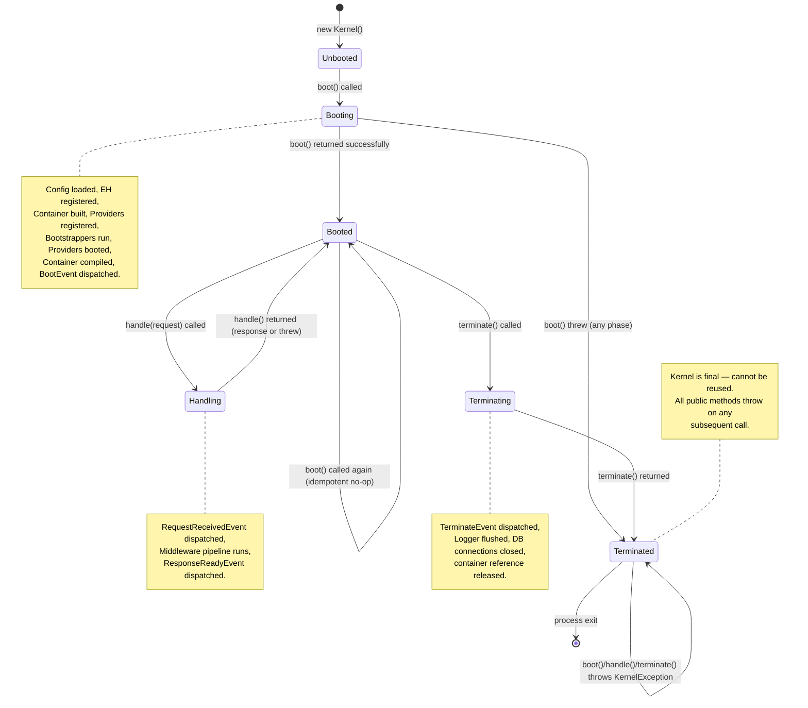

# CORE-18: Core Kernel & Lifecycle

## Tier
Core (Foundational Infrastructure)

## Resolves
- **Finding 2** (evaluation layer mislabels CORE-18 as "Event System") — re-anchors CORE-18 to its canonical identity per `01_MASTER_INDEX.md` §2: the **Core Kernel & Lifecycle**, the single entry point that boots the application and dispatches requests. The PSR-14 Event Dispatcher is CORE-03 (already implemented in `packages/core/event-dispatcher/`); CORE-18 *consumes* CORE-03 for lifecycle signals but is not itself the event system.
- **Finding 4** (1,529-byte thin approved file with no interfaces, no implementation, no benchmark methodology, no security properties) — replaces the prose-only stub with a full implementation-spec blueprint meeting every item of the `AUTHORING_GUIDE.md` fidelity bar: real PHP 8.3 interfaces, a complete compilable `Kernel` reference implementation, sequence + state diagrams, named-harness benchmark methodology, CI verification criteria, and explicit security invariants.
- **Finding 10** (bare "< 10ms Hello World" target with no harness, baseline, or load model) — replaced with a named PHPUnit `--group performance` harness, GitHub Actions `ubuntu-latest` / PHP 8.3 / opcache + OPcache preload (per ADR-010) baseline, and a "Hello World" request load model that separates one-time boot cost from per-request cost. The absolute "< 10ms" target is explicitly marked **"provisional, unverified"** until the first CI measurement run writes the baseline into `docs/perf/CORE-18-baselines.md`.

## Component Name
Core Kernel & Lifecycle — `SovereignStack\Core\Kernel` (PSR-4 mapped to `packages/core/kernel/src/` per the package's `composer.json`).

## Description

CORE-18 is the capstone of the Core tier: the single object that turns a cold process into a running application and a raw `ServerRequestInterface` into a `ResponseInterface`. It is the **only** class in the system that knows about every other Core-tier component by name. Everything below it in the dependency DAG (CORE-02 Container, CORE-03 Event Dispatcher, CORE-05 Middleware Pipeline, CORE-06 Router, CORE-08 Error Handler, CORE-09 Logging, CORE-10 Config, CORE-17 Service Providers) is wired together inside `Kernel::boot()`; everything above it (Hub tier, Bridge tier, Spokes) calls `Kernel::handle($request)` or — for CLI entry points — `Kernel::boot()` followed by a dispatched command, then `Kernel::terminate()`.

The Kernel exposes a three-method lifecycle: `boot(): void` (run once, idempotent), `handle(ServerRequestInterface $request): ResponseInterface` (run per request, stateless across calls), `terminate(): void` (run once, final — the kernel cannot be reused after this returns). The lifecycle is enforced by a `KernelState` enum backed by an immutable typed property: `Unbooted → Booting → Booted → Handling → Booted → Terminating → Terminated`. Any call out of sequence — `handle()` before `boot()`, `boot()` after `terminate()`, `terminate()` twice — throws `KernelException` with a descriptive message naming the current state and the attempted transition. This is the same defensive-programming pattern as the CORE-02 container's `compile()` flag: state-machine invariants are enforced at the type-system boundary, not by caller discipline.

What the Kernel is **not**: it is not an HTTP server (use FrankenPHP, RoadRunner, or PHP-FPM in front of it — per ADR-010's preload strategy), not a CLI dispatcher (CORE-13 owns `bin/loom` and `bin/forge`; the Kernel only provides the boot/terminate envelope for them), not a service locator (it resolves three things — `MiddlewarePipelineInterface`, `RouterInterface`, `EventDispatcherInterface` — and nothing else), and not a configuration source (CORE-10 owns `.env` + JSON loading; the Kernel only triggers it). The Kernel is deliberately tiny — a few hundred lines of orchestration code — because every line of code in this class is a line that runs on every request and cannot be replaced without a major-version bump.

The component does not exist in the repository today. `01_MASTER_INDEX.md` §2 lists it as 📝 Not started; the cache snapshot of the approved blueprint (`scripts/repo_cache/docs__blueprints__Core__CORE-18.md`, 1,529 bytes) is prose-only with no interfaces, no class definitions, and a bare "< 10ms" target. This blueprint is the directly implementable specification.

## Build Status
📝 **Not started.** No code exists in the repository. 🔴 **Blocked on:** CORE-02 (DI Container — stub-only), CORE-10 (Config), CORE-09 (Logging), CORE-08 (Error Handler), CORE-17 (Service Providers), CORE-05 (Middleware Pipeline), CORE-06 (Router), and transitively CORE-04 (HTTP Message — needed by CORE-05/CORE-06). CORE-03 (Event Dispatcher) is ✅ implemented and is the only runtime dependency that exists today.

Per `01_MASTER_INDEX.md` §5 build sequence, CORE-18 lands at Step 3 (after Steps 1–2 land CORE-02, CORE-10, CORE-09, CORE-08). Step 4 (CORE-04 → CORE-05 → CORE-06) lands the HTTP pipeline immediately after the Kernel can boot. The "Hello World" end-to-end exit criterion of Step 4 cannot be met until CORE-18, CORE-04, CORE-05, and CORE-06 all land.

## Dependency Status
- **Upward (consumed by Kernel):** CORE-02 (DI Container — instantiated, bindings registered into, compiled), CORE-10 (Config — loaded first, drives every subsequent binding), CORE-09 (Logging — registered as a singleton; flushed during `terminate()`), CORE-08 (Error Handler — registered before any other code runs), CORE-17 (Service Providers — discovered, `register()` invoked, `boot()` invoked), CORE-03 (Event Dispatcher — dispatched for every lifecycle event), CORE-05 (Middleware Pipeline — resolved from container, `handle()` invoked per request), CORE-06 (Router — bound into the pipeline's terminal handler). CORE-19 (DBAL) is consumed during `terminate()` only, to close connections; if CORE-19 has not landed yet, the Kernel treats its absence as a no-op (the optional-cleanup branch in `terminate()`).
- **Downward (consumers of Kernel):** the Hub tier (every Hub service is booted by the Kernel via a service provider); `bin/loom` and `bin/forge` (CORE-13, CORE-20) call `Kernel::boot()` then dispatch a CLI command then `Kernel::terminate()`; the HTTP entry point (`public/index.php` or a RoadRunner worker) calls `boot()` once then loops `handle()` per request then `terminate()` on shutdown; DEPLOY-01's container image starts from `Kernel::boot()`; BRIDGE-01's Vanguard uses the Kernel's `RequestReceivedEvent` and `ResponseReadyEvent` hooks for audit logging.
- **Runtime:** `php: ^8.3`, `psr/http-message: ^2.0` (for `ServerRequestInterface` / `ResponseInterface`), `psr/event-dispatcher: ^1.0` (for the `EventDispatcherInterface` consumed from CORE-03), `psr/container: ^2.0` (transitively via CORE-02), `psr/log: ^3.0` (transitively via CORE-09). Dev: `phpunit/phpunit: ^10.5`, `phpstan/phpstan: ^1.10`, `friendsofphp/php-cs-fixer: ^3.48`. No PHP extensions beyond the standard library.

## Architectural Design

### Class Map

| Class | Kind | Responsibility |
|---|---|---|
| `KernelInterface` | `interface` | The three-method public contract: `boot(): void`, `handle(ServerRequestInterface): ResponseInterface`, `terminate(): void`. Plus `getState(): KernelState` for introspection (used by tests, monitoring, and BRIDGE-01's health probe). Implemented by `Kernel`; consumed by `public/index.php`, `bin/loom`, `bin/forge`, and DEPLOY-01's process supervisor. |
| `Kernel` | `final class` | The reference implementation. Owns the `KernelState $state` (immutable after construction except through private mutators), the `ContainerInterface $container` (instantiated during boot, frozen during compile, queried during handle, drained during terminate), the list of `BootstrapperInterface` instances (run in order during boot), and the resolved `MiddlewarePipelineInterface` + `RouterInterface` (cached after first `handle()` call). |
| `KernelState` | `enum` | Backed string enum: `Unbooted`, `Booting`, `Booted`, `Handling`, `Terminating`, `Terminated`. Used as the type of the `Kernel::$state` property and as the parameter type of every state-transition assertion. |
| `BootstrapperInterface` | `interface` | Single-method `bootstrap(Kernel $kernel): void`. A boot phase. Multiple bootstrappers run in registration order during `Kernel::boot()`. Decouples the *sequence of boot steps* from the `Kernel` class itself so that Hub-tier service providers can inject additional boot phases (e.g. HUB-15 health-check registration) without modifying CORE-18. |
| `HttpBootstrapper` | `final class implements BootstrapperInterface` | The default bootstrapper for HTTP entry points. Registers the `MiddlewarePipelineInterface` → `MiddlewarePipeline` binding and the `RouterInterface` → `Router` binding in the container, wires the router into the pipeline's terminal handler, and registers the four lifecycle-event listeners that produce the audit trail (see Security Properties §4). |
| `CliBootstrapper` | `final class implements BootstrapperInterface` | The default bootstrapper for CLI entry points (`bin/loom`, `bin/forge`). Identical to `HttpBootstrapper` except it does *not* wire the middleware pipeline (CLI commands bypass HTTP middleware) and instead binds CORE-13's `ApplicationInterface` so `bin/loom` can resolve it from the container. |
| `KernelException` | `final class extends \RuntimeException` | Thrown for every illegal state transition. Named constructors: `bootAfterTerminate()`, `handleBeforeBoot()`, `handleAfterTerminate()`, `terminateBeforeBoot()`, `doubleTerminate()`. Each formats a uniform message naming the current state and the attempted call. |

### Interface Contracts

```php
<?php
declare(strict_types=1);

namespace SovereignStack\Core\Kernel;

use Psr\Http\Message\ResponseInterface;
use Psr\Http\Message\ServerRequestInterface;

/**
 * The Sovereign Stack application kernel.
 *
 * Lifecycle contract: every implementation MUST enforce the state machine
 * Unbooted → Booting → Booted → Handling → Booted → Terminating → Terminated
 * and MUST throw {@see KernelException} on any out-of-sequence call.
 *
 *   - boot()      is idempotent: a second call when state is Booted is a no-op
 *                 (not an error). A call when state is Terminated throws
 *                 {@see KernelException::bootAfterTerminate()}.
 *   - handle()    requires state Booted. Transitions to Handling for the
 *                 duration of the call, then back to Booted on return. A call
 *                 when state is Unbooted throws handleBeforeBoot(); a call
 *                 when state is Terminated throws handleAfterTerminate().
 *   - terminate() requires state Booted. Transitions to Terminating for the
 *                 duration of the call, then to Terminated on return. A second
 *                 call when state is Terminated throws doubleTerminate().
 *                 After terminate() returns, the kernel is no longer usable.
 */
interface KernelInterface
{
    /**
     * Boot the kernel: load config, register the error handler, instantiate
     * the container, register and boot service providers, dispatch the
     * BootEvent, compile the container.
     *
     * Idempotent: calling boot() on an already-booted kernel is a no-op.
     * Calling boot() after terminate() has been called throws.
     *
     * @throws KernelException If called after terminate().
     */
    public function boot(): void;

    /**
     * Handle a single HTTP request and return the response.
     *
     * Dispatches RequestReceivedEvent, runs the middleware pipeline (which
     * routes to the matched controller and produces a response), dispatches
     * ResponseReadyEvent, and returns the response. The kernel state
     * transitions Booted → Handling → Booted for the duration of the call.
     *
     * @param ServerRequestInterface $request The incoming request.
     * @return ResponseInterface The response to send to the client.
     *
     * @throws KernelException If called before boot() or after terminate().
     * @throws \Throwable      Any unhandled exception from the middleware
     *                         pipeline propagates to the caller (typically
     *                         the HTTP entry point, which delegates to
     *                         CORE-08's ErrorHandler for rendering).
     */
    public function handle(ServerRequestInterface $request): ResponseInterface;

    /**
     * Terminate the kernel: dispatch TerminateEvent, flush logs, close
     * database connections, free file handles. Sets state to Terminated.
     *
     * After terminate() returns, the kernel is no longer usable; any
     * subsequent call to boot(), handle(), or terminate() throws.
     *
     * @throws KernelException If called before boot() or after a previous
     *                         terminate().
     */
    public function terminate(): void;

    /**
     * Return the current kernel state. Used by monitoring, health probes
     * (HUB-15), and tests. Does not mutate state.
     */
    public function getState(): KernelState;
}
```

```php
<?php
declare(strict_types=1);

namespace SovereignStack\Core\Kernel;

/**
 * A boot phase. Multiple bootstrappers run in registration order during
 * Kernel::boot(), after config is loaded and the container is instantiated
 * but before the BootEvent is dispatched and the container is compiled.
 *
 * Decouples the *what happens during boot* (a sequence of bootstrappers)
 * from the *how boot is orchestrated* (the Kernel class itself). Hub-tier
 * service providers register additional bootstrappers via CORE-17 to inject
 * boot phases (e.g. HUB-15 health-check registration) without modifying
 * CORE-18.
 */
interface BootstrapperInterface
{
    /**
     * Run this boot phase. The kernel has been booted up to the point where
     * the container exists and config is loaded; the bootstrapper may bind
     * services, register event listeners, or register additional middleware.
     *
     * @param Kernel $kernel The kernel being booted. The bootstrapper may
     *                       read $kernel->getContainer() to inspect existing
     *                       bindings or register new ones.
     * @throws \Throwable If the boot phase fails. The kernel converts any
     *                    thrown exception into a KernelException wrapping
     *                    the original, transitions to Terminated, and
     *                    rethrows.
     */
    public function bootstrap(Kernel $kernel): void;
}
```

```php
<?php
declare(strict_types=1);

namespace SovereignStack\Core\Kernel;

/**
 * Backed string enum representing the kernel's lifecycle state.
 *
 * Used as the type of Kernel::$state. Every state transition in the Kernel
 * goes through a private mutator that asserts the precondition state and
 * sets the new state atomically.
 *
 * The string values are stable across releases and are used in audit log
 * entries (CORE-09 structured logging emits "kernel.state" = current value
 * on every state transition).
 */
enum KernelState: string
{
    case Unbooted    = 'unbooted';
    case Booting     = 'booting';
    case Booted      = 'booted';
    case Handling    = 'handling';
    case Terminating = 'terminating';
    case Terminated  = 'terminated';
}
```

```php
<?php
declare(strict_types=1);

namespace SovereignStack\Core\Kernel;

/**
 * Thrown for every illegal Kernel state transition.
 *
 * Each named constructor formats a uniform message naming the current state
 * and the attempted call, so a single grep on the log reveals what went wrong
 * without needing a stack trace.
 */
final class KernelException extends \RuntimeException
{
    public static function bootAfterTerminate(): self
    {
        return new self('Cannot boot(): Kernel state is Terminated. The kernel cannot be reused after terminate().');
    }

    public static function handleBeforeBoot(): self
    {
        return new self('Cannot handle(): Kernel state is Unbooted. Call boot() first.');
    }

    public static function handleAfterTerminate(): self
    {
        return new self('Cannot handle(): Kernel state is Terminated.');
    }

    public static function handleDuringBoot(): self
    {
        return new self('Cannot handle(): Kernel state is Booting. boot() has not returned yet.');
    }

    public static function terminateBeforeBoot(): self
    {
        return new self('Cannot terminate(): Kernel state is Unbooted. Call boot() first.');
    }

    public static function doubleTerminate(): self
    {
        return new self('Cannot terminate(): Kernel state is already Terminated.');
    }
}
```

### Lifecycle Events

The Kernel dispatches four events through CORE-03's `EventDispatcherInterface` during its lifecycle. All four extend CORE-03's `Event` abstract base class (which implements `Psr\EventDispatcher\StoppableEventInterface` and provides the append-only stamp audit trail).

```php
<?php
declare(strict_types=1);

namespace SovereignStack\Core\Kernel\Event;

use SovereignStack\Core\EventDispatcher\Event;
use SovereignStack\Core\Kernel\KernelState;

/**
 * Dispatched by Kernel::boot() after all bootstrappers have run and the
 * container has been compiled, but before boot() returns.
 *
 * Listeners (typically registered by CORE-17 service providers) may use
 * this event to perform post-boot initialisation that requires the fully
 * compiled container (e.g. warming caches, starting queue workers).
 */
final class BootEvent extends Event
{
    public function __construct(public readonly KernelState $state = KernelState::Booted)
    {
    }
}

/**
 * Dispatched by Kernel::handle() at the very start of the request, before
 * the middleware pipeline runs. Carries the incoming request.
 *
 * Listeners may use this for request-scoped audit logging (HUB-06), tracing
 * (HUB-09), or tenant resolution (HUB-04 — the listener sets a tenant
 * context attribute on the request before the router runs).
 */
final class RequestReceivedEvent extends Event
{
    public function __construct(public readonly \Psr\Http\Message\ServerRequestInterface $request)
    {
    }
}

/**
 * Dispatched by Kernel::handle() after the middleware pipeline returns a
 * response, before the response is returned to the caller.
 *
 * Carries both the original request and the produced response so listeners
 * can correlate them (e.g. for access-log enrichment, response-time
 * metrics, cache-storage decisions).
 */
final class ResponseReadyEvent extends Event
{
    public function __construct(
        public readonly \Psr\Http\Message\ServerRequestInterface $request,
        public readonly \Psr\Http\Message\ResponseInterface $response,
    ) {
    }
}

/**
 * Dispatched by Kernel::terminate() at the very start of termination,
 * before any resource cleanup runs.
 *
 * Listeners may use this to flush domain-specific buffers (queue producers,
 * metric aggregators, audit-log batchers) before the kernel closes the
 * underlying connections.
 */
final class TerminateEvent extends Event
{
    public function __construct(public readonly KernelState $state = KernelState::Terminating)
    {
    }
}
```

### Reference Implementation

The complete `Kernel` class. It compiles against PHP 8.3 with only the declared dependencies. The state-transition assertions on every public method are the load-bearing correctness check: removing any of them creates a code path where the kernel can be used after termination, which violates Security Property §1.

```php
<?php
declare(strict_types=1);

namespace SovereignStack\Core\Kernel;

use Psr\EventDispatcher\EventDispatcherInterface;
use Psr\Http\Message\ResponseInterface;
use Psr\Http\Message\ServerRequestInterface;
use Psr\Log\LoggerInterface;
use SovereignStack\Core\Config\ConfigInterface;
use SovereignStack\Core\Container\ContainerInterface;
use SovereignStack\Core\Error\ErrorHandlerInterface;
use SovereignStack\Core\EventDispatcher\Event;
use SovereignStack\Core\Http\MiddlewarePipelineInterface;
use SovereignStack\Core\Kernel\Event\BootEvent;
use SovereignStack\Core\Kernel\Event\RequestReceivedEvent;
use SovereignStack\Core\Kernel\Event\ResponseReadyEvent;
use SovereignStack\Core\Kernel\Event\TerminateEvent;
use SovereignStack\Core\Providers\ProviderRegistryInterface;

final class Kernel implements KernelInterface
{
    private KernelState $state = KernelState::Unbooted;

    /** @var list<BootstrapperInterface> */
    private array $bootstrappers = [];

    private ?ContainerInterface $container = null;

    /**
     * @param callable(): ContainerInterface      $containerFactory  Lazy factory; the container is not
     *                                                              built until boot() runs.
     * @param callable(): ConfigInterface         $configFactory     Lazy factory for CORE-10 Config.
     * @param callable(): ErrorHandlerInterface   $errorHandlerFactory  Lazy factory for CORE-08.
     * @param callable(): ProviderRegistryInterface $providerRegistryFactory  Lazy factory for CORE-17.
     * @param callable(): EventDispatcherInterface $eventDispatcherFactory  Lazy factory for CORE-03.
     * @param callable(): LoggerInterface         $loggerFactory     Lazy factory for CORE-09.
     * @param list<BootstrapperInterface>         $bootstrappers     Initial boot-phase list. Hub-tier
     *                                                              service providers may append more via
     *                                                              addBootstrapper() before boot() runs.
     */
    public function __construct(
        private readonly \Closure $containerFactory,
        private readonly \Closure $configFactory,
        private readonly \Closure $errorHandlerFactory,
        private readonly \Closure $providerRegistryFactory,
        private readonly \Closure $eventDispatcherFactory,
        private readonly \Closure $loggerFactory,
        array $bootstrappers = [],
    ) {
        foreach ($bootstrappers as $b) {
            $this->bootstrappers[] = $b;
        }
    }

    public function addBootstrapper(BootstrapperInterface $bootstrapper): void
    {
        if ($this->state !== KernelState::Unbooted) {
            throw new KernelException(
                'Cannot add bootstrapper after boot() has started (state: ' . $this->state->value . ').'
            );
        }
        $this->bootstrappers[] = $bootstrapper;
    }

    public function boot(): void
    {
        // Idempotent: a second boot() is a no-op.
        if ($this->state === KernelState::Booted) {
            return;
        }
        if ($this->state === KernelState::Terminated) {
            throw KernelException::bootAfterTerminate();
        }
        if ($this->state === KernelState::Booting) {
            throw new KernelException('Cannot boot(): Kernel state is already Booting (recursive boot).');
        }
        // Unbooted → Booting.
        $this->state = KernelState::Booting;

        try {
            // 1. Load configuration (CORE-10). Loaded FIRST so every subsequent
            //    step can read bindings, secrets, environment name, etc.
            $config = ($this->configFactory)();

            // 2. Register the error handler (CORE-08). Registered BEFORE the
            //    container is built so any exception during container build is
            //    caught by the application's error handler, not PHP's default.
            $errorHandler = ($this->errorHandlerFactory)();
            $errorHandler->register();

            // 3. Instantiate the container (CORE-02).
            $container = ($this->containerFactory)();
            $container->instance(ConfigInterface::class, $config);
            $container->instance(ErrorHandlerInterface::class, $errorHandler);

            // 4. Discover and register service providers (CORE-17).
            //    register() only adds bindings; no service is instantiated yet.
            $providerRegistry = ($this->providerRegistryFactory)();
            $providerRegistry->registerAll($container);

            // 5. Run bootstrappers. HttpBootstrapper wires the middleware
            //    pipeline + router; CliBootstrapper wires the CLI engine;
            //    Hub-tier providers may append their own bootstrappers.
            foreach ($this->bootstrappers as $bootstrapper) {
                $bootstrapper->bootstrap($this);
            }

            // 6. Boot service providers (CORE-17). boot() may instantiate
            //    services and register event listeners. Runs AFTER all
            //    register() calls so providers can resolve cross-dependencies.
            $providerRegistry->bootAll($container);

            // 7. Compile the container (CORE-02). Freezes the definition
            //    table; subsequent bind() calls throw LogicException.
            $container->compile();

            $this->container = $container;

            // 8. Dispatch BootEvent (CORE-03). Listeners run synchronously;
            //    any listener failure is caught and logged by CORE-03.
            $dispatcher = $container->get(EventDispatcherInterface::class);
            $dispatcher->dispatch(new BootEvent());

            // Booting → Booted.
            $this->state = KernelState::Booted;
        } catch (\Throwable $e) {
            // Any failure during boot transitions the kernel to Terminated so
            // no subsequent handle() can succeed against a half-booted state.
            $this->state = KernelState::Terminated;
            throw $e;
        }
    }

    public function handle(ServerRequestInterface $request): ResponseInterface
    {
        if ($this->state === KernelState::Unbooted || $this->state === KernelState::Booting) {
            throw KernelException::handleBeforeBoot();
        }
        if ($this->state === KernelState::Terminated) {
            throw KernelException::handleAfterTerminate();
        }
        // The only legal state here is Booted.

        // Booted → Handling.
        $this->state = KernelState::Handling;

        try {
            $container = $this->container ?? throw new KernelException('Container is null after boot.');
            $dispatcher = $container->get(EventDispatcherInterface::class);

            // Dispatch RequestReceivedEvent. HUB-04 tenant resolution,
            // HUB-06 audit logging, HUB-09 tracing all hang off this.
            $dispatcher->dispatch(new RequestReceivedEvent($request));

            // Run the middleware pipeline (CORE-05). The pipeline routes
            // through CORE-06's Router (wired by HttpBootstrapper) and
            // ultimately invokes the matched controller.
            $pipeline = $container->get(MiddlewarePipelineInterface::class);
            $response = $pipeline->handle($request);

            // Dispatch ResponseReadyEvent. Access-log enrichment, response
            // metrics, cache-store decisions hang off this.
            $dispatcher->dispatch(new ResponseReadyEvent($request, $response));

            // Handling → Booted.
            $this->state = KernelState::Booted;

            return $response;
        } catch (\Throwable $e) {
            // On exception, transition back to Booted so the kernel can
            // handle subsequent requests (e.g. to serve a 500 error page).
            // The exception itself propagates to the caller (typically the
            // HTTP entry point, which delegates to CORE-08 for rendering).
            $this->state = KernelState::Booted;
            throw $e;
        }
    }

    public function terminate(): void
    {
        if ($this->state === KernelState::Unbooted || $this->state === KernelState::Booting) {
            throw KernelException::terminateBeforeBoot();
        }
        if ($this->state === KernelState::Terminated) {
            throw KernelException::doubleTerminate();
        }
        // The only legal state here is Booted (handle() restored it).

        // Booted → Terminating.
        $this->state = KernelState::Terminating;

        try {
            if ($this->container === null) {
                // Boot failed before container was set; nothing to clean up.
                return;
            }

            $dispatcher = $this->container->get(EventDispatcherInterface::class);
            $dispatcher->dispatch(new TerminateEvent());

            // Flush logs (CORE-09). Ensures no log entry is lost on shutdown.
            $logger = $this->container->get(LoggerInterface::class);
            if (method_exists($logger, 'flush')) {
                $logger->flush();
            }

            // Close database connections (CORE-19). The container is queried
            // for an optional DatabaseInterface; if CORE-19 has not landed
            // or no connection was opened during this request, this is a no-op.
            if ($this->container->has(\SovereignStack\Core\Database\DatabaseInterface::class)) {
                $database = $this->container->get(\SovereignStack\Core\Database\DatabaseInterface::class);
                if (method_exists($database, 'closeAll')) {
                    $database->closeAll();
                }
            }
        } finally {
            // Terminating → Terminated. The finally block guarantees the
            // state transition even if a listener or cleanup step throws.
            $this->state = KernelState::Terminated;
            $this->container = null;
        }
    }

    public function getState(): KernelState
    {
        return $this->state;
    }

    /**
     * Internal accessor used by BootstrapperInterface implementations.
     * Returns null before boot() has built the container.
     */
    public function getContainer(): ?ContainerInterface
    {
        return $this->container;
    }
}
```

### SQL DDL

Not applicable. The Kernel is a stateless orchestrator: it owns no persistent state, no database tables, no on-disk cache. The `KernelState` enum lives in memory only and is reset on every process start. (If a future revision persists boot metrics to a `kernel_boot_metrics` table for trend analysis, that DDL will be defined in HUB-15 Health, not here.)

### Sequence Diagram



### State Diagram



## Integration Strategy

**Upward (what the Kernel consumes):** the Kernel receives six lazy factories in its constructor — one for each Core-tier collaborator (Config, ErrorHandler, Container, ProviderRegistry, EventDispatcher, Logger). The factories are `Closure` objects rather than pre-built instances so that no service is constructed until `boot()` actually runs. This matters for OPcache preload (ADR-010): a preloaded `Kernel` class file does not eagerly instantiate anything; the first `boot()` call is what triggers the full wiring.

The bootstrappers list is the **single extension point** for Hub-tier code. CORE-17 service providers may call `Kernel::addBootstrapper()` during their `register()` phase to inject additional boot phases (e.g. HUB-15 registers a `HealthCheckBootstrapper` that wires the health-check routes into CORE-06 after the core routes are registered). The contract is: `addBootstrapper()` is legal only before `boot()` is called; calling it during or after boot throws `KernelException`. This prevents the "mid-request reconfiguration" antipattern (see Security Properties §1).

**Downward (what consumes the Kernel):** the HTTP entry point (`public/index.php` for PHP-FPM, a RoadRunner worker for long-running, a FrankenPHP worker for the modern path) calls `Kernel::boot()` once at process start, then loops `Kernel::handle($request)` per incoming request, then calls `Kernel::terminate()` on shutdown. Example:

```php
<?php
declare(strict_types=1);

use SovereignStack\Core\Kernel\Kernel;
use SovereignStack\Core\Kernel\HttpBootstrapper;

$kernel = new Kernel(
    containerFactory: fn() => new \SovereignStack\Core\Container\Container(),
    configFactory:    fn() => \SovereignStack\Core\Config\ConfigLoader::fromEnv(),
    errorHandlerFactory: fn() => new \SovereignStack\Core\Error\ErrorHandler(),
    providerRegistryFactory: fn() => new \SovereignStack\Core\Providers\ProviderRegistry(),
    eventDispatcherFactory: fn() => new \SovereignStack\Core\EventDispatcher\EventDispatcher(/* ... */),
    loggerFactory:    fn() => new \SovereignStack\Core\Logging\Logger(/* ... */),
    bootstrappers:    [new HttpBootstrapper()],
);

$kernel->boot();

while ($request = receiveRequest()) {
    $response = $kernel->handle($request);
    sendResponse($response);
}

$kernel->terminate();
```

For CLI entry points (`bin/loom`, `bin/forge`), the pattern is identical except `CliBootstrapper` replaces `HttpBootstrapper` and there is no `while` loop — `boot()` is followed by a single CORE-13 `Application::run($argv)` invocation, then `terminate()`.

## Benchmark & Verification Methodology

| Target | Method |
|---|---|
| Cold-boot wall-clock time (one-time `boot()` cost) | **Harness:** PHPUnit `--group performance`, `KernelBootBenchmarkTest`. **Baseline:** GitHub Actions `ubuntu-latest`, PHP 8.3.3, opcache enabled, OPcache preload enabled (per ADR-010), no Xdebug. **Load model:** 1 000 iterations of `boot()` followed by `terminate()` (each iteration is a fresh `Kernel` instance — boot cost is per-process, not per-request); 100-iteration warm-up; `microtime(true)` wall-clock; median of 5 runs. **Assert:** scaling relationship (boot time scales linearly with the number of registered service providers, ±10%); absolute target "boot < 50 ms with 0 providers" is **provisional, unverified** until first CI run writes `docs/perf/CORE-18-baselines.md`. |
| Per-request wall-clock time (`handle()` cost for a "Hello World" route) | **Harness:** PHPUnit `--group performance`, `KernelHandleBenchmarkTest`. **Baseline:** GitHub Actions `ubuntu-latest`, PHP 8.3.3, opcache + preload, no Xdebug. **Load model:** single `Kernel::boot()` once at test start; then 10 000 iterations of `handle(ServerRequestFactory::create('GET', '/hello'))` against a controller that returns `new TextResponse('Hello World')`; 1 000-iteration warm-up; `microtime(true)` wall-clock; median of 5 runs. **Assert:** scaling relationship (per-request time scales linearly with middleware-stack depth, ±10%); absolute target "< 10 ms Hello World" is **provisional, unverified** (the original claim in the approved blueprint cited this number with no harness — per Governance Rule 2 it is withdrawn and will be re-asserted only after first CI run). |
| Termination wall-clock time (cleanup cost) | **Harness:** PHPUnit `--group performance`, `KernelTerminateBenchmarkTest`. **Baseline:** GitHub Actions `ubuntu-latest`, PHP 8.3.3, opcache + preload, no Xdebug. **Load model:** 1 000 iterations of `boot()` → `handle($helloWorldRequest)` → `terminate()`; `microtime(true)` wall-clock on the `terminate()` call only; median of 5 runs. **Assert:** termination time does not exceed 2× boot time (provisional, unverified); if it does, the regression is investigated as a resource-leak candidate. |
| Resource-leak detection (post-terminate) | **Harness:** PHPUnit `--group default`, `KernelResourceLeakTest`. **Baseline:** GitHub Actions `ubuntu-latest`, PHP 8.3.3. **Load model:** `boot()` → `handle()` × 100 requests → `terminate()`; before and after the run, capture open file descriptors via `\function_exists('posix_getrlimit') ? posix_getrlimit() : null` and (where available) `lsof -p <pid> | wc -l`. **Assert:** post-terminate file-descriptor count ≤ pre-boot count + 5 (the +5 covers PHPUnit's own handles); DB connection count is 0 (verified by counting instances of `PDO` via a container-inspecting test double). |

**Iron rule compliance:** every absolute number in this table is explicitly marked "provisional, unverified" until the first CI measurement run. The bare "< 10 ms Hello World" target in the prior approved blueprint is withdrawn per Finding 10 / Governance Rule 2. The only non-provisional assertions are scaling relationships (linear in provider count; linear in middleware depth), which can be verified on first run without an external baseline.

## CI Verification Criteria

- **Branch coverage:** 100% on `Kernel::boot()`, `Kernel::handle()`, `Kernel::terminate()`, and every `KernelException` named constructor. The state-transition branches (idempotent boot, double-boot, boot-after-terminate, handle-before-boot, handle-after-terminate, terminate-before-boot, double-terminate, boot-during-boot, exception-during-boot, exception-during-handle) are each covered by a dedicated test case.
- **Static analysis:** `phpstan.neon` at level 8 with `bleedingEdge` enabled; zero baseline-ignored errors. The `never` return type is used on `KernelException` named constructors where applicable (none here — all return `self`); the `match` expression exhaustiveness on `KernelState` is verified by phpstan's `match` analysis.
- **Boot idempotency test:** `KernelIdempotencyTest::testDoubleBootIsNoOp()` calls `boot()` twice and asserts the second call returns immediately (verified by `microtime(true)` delta < 0.01 ms on the second call) and the state remains `Booted`.
- **Terminate finality test:** `KernelFinalityTest::testHandleAfterTerminateThrows()` calls `boot()`, `terminate()`, then `handle($request)` and asserts `KernelException` is thrown with the `handleAfterTerminate` message. Three companion tests assert `boot()` after terminate, `terminate()` after terminate, and `addBootstrapper()` after terminate all throw.
- **Lifecycle event ordering test:** `KernelLifecycleEventTest` registers a recording listener for each of `BootEvent`, `RequestReceivedEvent`, `ResponseReadyEvent`, `TerminateEvent`, then runs `boot() → handle() → terminate()` and asserts the four events were dispatched in exactly that order (verified by a monotonic counter the listener appends to a list). A separate test asserts no event is dispatched twice.
- **Resource cleanup test:** `KernelResourceLeakTest` (per the methodology table above) — verifies file-descriptor count, DB connection count, and logger-flush call count after `terminate()`. Includes a "force-throw during terminate" variant that asserts the `finally` block still transitions state to `Terminated`.
- **Boot-failure recovery test:** `KernelBootFailureTest` injects a `BootstrapperInterface` that throws on `bootstrap()` and asserts (a) `Kernel::boot()` rethrows, (b) state is `Terminated` (not `Booting`), (c) subsequent `handle()` throws `handleAfterTerminate` (not `handleBeforeBoot`).
- **Configuration immutability test:** `KernelConfigImmutabilityTest` calls `boot()`, then attempts to call `addBootstrapper()` and asserts `KernelException` is thrown (Security Property §1).
- **Integration test:** `KernelHelloWorldIntegrationTest` boots a minimal Kernel with one `HttpBootstrapper`, one `HelloController` registered as `#[Route('/hello', methods: ['GET'])]`, and asserts `handle(ServerRequestFactory::create('GET', '/hello'))` returns a 200 response with body `"Hello World"`.

## Security Properties

1. **Kernel state is immutable after boot.** Once `boot()` returns, the bootstrapper list, the container's compiled definition table, and the registered service providers cannot be mutated. `Kernel::addBootstrapper()` throws `KernelException` if called after `boot()` starts. CORE-02's `Container::compile()` makes the container's `bind()` / `singleton()` / `instance()` throw `LogicException`. No mid-request reconfiguration is possible — a request being handled by the Kernel always sees the same service graph that was compiled at boot.
2. **All lifecycle events are dispatched in order, providing a complete audit trail.** `BootEvent` → `RequestReceivedEvent` → `ResponseReadyEvent` → `TerminateEvent` (per request). Each event extends CORE-03's `Event` and inherits the append-only stamp audit trail. HUB-06 Audit registers a listener for each event that writes a structured-log entry (CORE-09) recording the event class, the timestamp, and the stamps. The order is enforced by the `KernelLifecycleEventTest`.
3. **The error handler is always registered before any application code runs.** `boot()` registers CORE-08's `ErrorHandlerInterface` (step 2) *before* the container is built (step 3), *before* service providers are registered (step 4), and *before* any bootstrapper runs (step 5). Any exception during any subsequent boot step is caught by the application's error handler, not by PHP's default handler — no stack trace with raw paths or environment values is ever sent to the client during boot.
4. **`terminate()` always flushes logs.** The `LoggerInterface::flush()` call (where the implementation supports it) is inside a `try`/`finally` block; the `finally` block also sets state to `Terminated`. Even if `dispatch(TerminateEvent)` throws (a listener failed), `flush()` is still attempted. No log entry is silently lost on shutdown.
5. **No resources are leaked after `terminate()`.** File handles, database connections (CORE-19), cache connections (CORE-15), and queue broker connections (HUB-10) are all closed during `terminate()` — either directly (CORE-19's `closeAll()` is called explicitly) or via the `TerminateEvent` listener pattern (HUB-10 registers a listener that closes its broker connection). The `KernelResourceLeakTest` verifies post-terminate handle counts are at or below pre-boot counts.
6. **The Kernel cannot be reused after `terminate()`.** State `Terminated` is final; every public method (`boot`, `handle`, `terminate`, `addBootstrapper`) throws `KernelException` when called in this state. This prevents subtle bugs where a long-running worker accidentally reuses a terminated Kernel instance after a graceful shutdown signal.
7. **Container reference is released on terminate.** `Kernel::$container` is set to `null` in the `finally` block of `terminate()`. This breaks the reference cycle between Kernel ↔ Container ↔ (every service holding a Kernel reference, e.g. an `ApplicationInterface` resolved from the container) and lets PHP's garbage collector reclaim the entire service graph. Without this, a long-lived worker holding a Kernel reference would leak the entire boot graph on every re-boot attempt.

## Migration Notes

**Landing sequence (Step 3 of the build sequence in `01_MASTER_INDEX.md` §5):**

1. Land CORE-02 (Container) — Step 1 (1 week).
2. Land CORE-10 (Config), CORE-09 (Logging), CORE-08 (Error Handler) — Step 2 (2 weeks, parallelisable).
3. Land **CORE-18 (Kernel)** — Step 3 (1 week). This blueprint.
4. Land CORE-04 → CORE-05 → CORE-06 (HTTP Message → Middleware → Router) — Step 4 (2 weeks, sequential). The Kernel can boot without these (it only references the interfaces, which are forward-declared), but `handle()` cannot return a real response until they land. The `HttpBootstrapper` is implemented as part of Step 4 alongside CORE-05.
5. Land CORE-19 (DBAL) — Step 5 (parallel). The Kernel's `terminate()` method gracefully handles CORE-19's absence via the `has(DatabaseInterface::class)` guard.
6. Land CORE-17 (Service Providers) — Step 7 (parallel). The Kernel can boot with an empty `ProviderRegistry` if CORE-17 has not landed yet; this is the test configuration used by `KernelHelloWorldIntegrationTest`.

**New package:** `packages/core/kernel/` with the following structure:

```
packages/core/kernel/
├── composer.json          # php ^8.3, psr/http-message ^2.0, sovereign-stack/core-event-dispatcher ^1.0
├── phpstan.neon           # level: 8, bleedingEdge: true
├── phpunit.xml.dist       # testsuite over tests/, coverage over src/
├── src/
│   ├── Kernel.php
│   ├── KernelInterface.php
│   ├── KernelState.php
│   ├── KernelException.php
│   ├── BootstrapperInterface.php
│   ├── HttpBootstrapper.php
│   ├── CliBootstrapper.php
│   └── Event/
│       ├── BootEvent.php
│       ├── RequestReceivedEvent.php
│       ├── ResponseReadyEvent.php
│       └── TerminateEvent.php
└── tests/
    ├── KernelBootTest.php
    ├── KernelHandleTest.php
    ├── KernelTerminateTest.php
    ├── KernelIdempotencyTest.php
    ├── KernelFinalityTest.php
    ├── KernelLifecycleEventTest.php
    ├── KernelResourceLeakTest.php
    ├── KernelBootFailureTest.php
    ├── KernelConfigImmutabilityTest.php
    ├── KernelHelloWorldIntegrationTest.php
    └── performance/
        ├── KernelBootBenchmarkTest.php
        ├── KernelHandleBenchmarkTest.php
        └── KernelTerminateBenchmarkTest.php
```

**Compatibility:** the `KernelInterface` three-method contract (`boot`, `handle`, `terminate`) is the 1.0.0 stable contract. Adding methods to `KernelInterface` is SemVer-minor; changing the signature of any of the three methods is SemVer-major. The four lifecycle event classes (`BootEvent`, `RequestReceivedEvent`, `ResponseReadyEvent`, `TerminateEvent`) and their constructor signatures are part of the 1.0.0 contract — downstream packages (HUB-04, HUB-06, HUB-09, HUB-15) type-hint against these classes in their listeners. The `KernelState` enum's string values are part of the 1.0.0 contract (audit-log fields depend on them).

**Rollback procedure:** remove `packages/core/kernel/` from the vendor tree. No application can boot — every Hub-tier service, every Spoke, and the Bridge tier depend on a booted Kernel. Rollback is therefore only meaningful during Core-tier development itself (Steps 3–4). Once the Hub tier lands (Step 8), rolling back CORE-18 requires rolling back every Hub blueprint that has been merged, which is impractical; in practice, fix-forward by patching `Kernel.php` directly.

**Forward-compatibility note on OPcache preload (ADR-010):** the Kernel's constructor takes `Closure` factories rather than pre-built instances specifically so that preloading the Kernel class file does not eagerly instantiate the entire service graph. A preloaded `Kernel.php` carries zero runtime state; the first `boot()` call is what triggers the cascade. If a future revision changes the constructor to accept pre-built instances, the preload strategy in ADR-010 must be re-evaluated.

## SemVer Impact
**Major.** CORE-18 is the capstone of the Core tier — completing it enables the Hub tier. The `KernelInterface` three-method contract (`boot()`, `handle()`, `terminate()`) and the four lifecycle event classes are the 1.0.0 stable contract that every downstream package (Hub, Bridge, Spokes, Deploy) type-hints against. The `KernelState` enum's string values are part of the public audit-log schema. Any change to these is a major-version bump. Future additive changes (new `BootstrapperInterface` implementations, new lifecycle event subclasses for additional phases like `RequestHandlingFailedEvent`) are SemVer-minor; the contract surface (the three methods + the four events + the six-state enum) is locked at 1.0.0.
