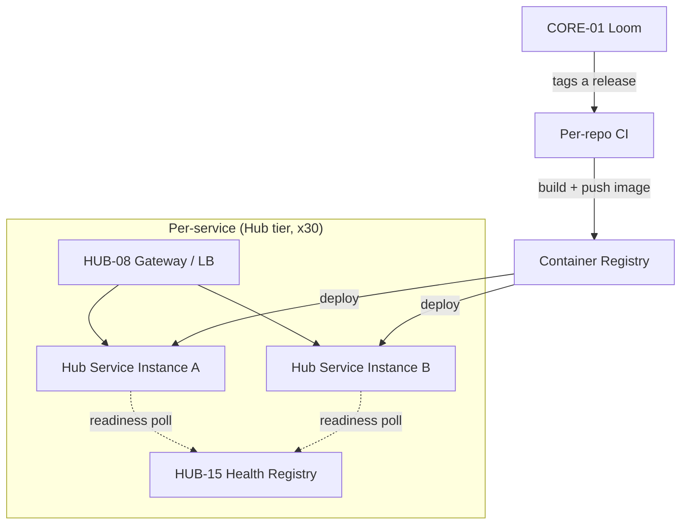

# PHASE DEPLOY-01: Core & Hub Service Deployment

## Tier
Infrastructure (Deployment & Hosting)

## Resolves
`00_CRITIQUE.md` Finding 9 — the only previously-existing Deploy blueprint (now renamed `DEPLOY-00:
Documentation Site`, kept as-is; see `01_MASTER_INDEX.md` §6) deploys the Markdown documentation over
Render's free tier via PHP's built-in dev server. It says nothing about deploying the Core services,
the ~30 Hub services, the Spokes, or any datastore. This blueprint is that missing piece for the
Core/Hub tier specifically; `DEPLOY-02` (datastores), `DEPLOY-03` (Bridge/External), and `DEPLOY-04`
(promotion pipeline) are sequenced separately per `01_MASTER_INDEX.md` §6 and are not duplicated here.

## Component Name
Sovereign Core/Hub Runtime Deployment

## Description
Containerized deployment strategy for the Core and Hub tiers: one deployable image family (PHP 8.3-FPM
+ Nginx) per Hub service, wired to `HUB-15` for health checks, with an explicit non-goal of covering
the documentation site (`DEPLOY-00`), the public-facing Bridge/External tier (`DEPLOY-03`), or
datastore provisioning (`DEPLOY-02`) — those are separately scoped so this blueprint doesn't repeat the
original scope-collapse mistake in the other direction (one blueprint quietly trying to cover
everything).

## Build Status
🔴 **Blocked** on the Core tier being real (nothing to containerize yet — see
`01_MASTER_INDEX.md` §2) and on `HUB-15` (Health Check & Service Discovery) existing, since the health
check contract this blueprint specifies depends on it. This document specifies the target shape now so
it's ready the moment those land, rather than being designed reactively after the fact.

## Dependency Status
- **Upward:** `CORE-01` (Polyrepo Orchestrator — release tagging/gating drives what gets deployed),
  `CORE-18` (Kernel — defines the app's actual boot/shutdown signals that the container entrypoint
  must respect), `HUB-15` (Health Check contract), `HUB-01` (Config — environment-specific settings
  injected at deploy time, not baked into the image).
- **Downward:** every Hub service; every Internal Spoke (which, per the Hub-and-Spoke tier model,
  should share this same deployment pattern rather than invent its own).

## Architectural Design

### One image family, many services
A single base image (`php:8.3-fpm-alpine` + Nginx sidecar or a compiled FrankenPHP-style single
binary — decision deferred to an ADR, not baked into this blueprint) parameterized by which service's
`composer.json`/entrypoint it boots, rather than a bespoke Dockerfile per Hub service. This keeps 30+
Hub services from becoming 30+ independently-drifting deployment configurations.

```dockerfile
# Illustrative shape, not a final artifact — the actual Dockerfile belongs in
# each package's repo (per the polyrepo model CORE-01 enforces), inheriting
# from a shared base published by this blueprint's implementation.
FROM sovereignstack/php-runtime-base:8.3 AS runtime
ARG SERVICE_NAME
COPY --from=build /app/${SERVICE_NAME} /app
WORKDIR /app
ENTRYPOINT ["/app/entrypoint.sh"]
```

### Health check contract (drives readiness/liveness probes)

```php
namespace SovereignStack\Deploy\Contracts;

interface HealthCheckInterface
{
    /**
     * Liveness: is the process fundamentally able to serve traffic at all?
     * Must not check downstream dependencies — a slow DB should fail
     * readiness, not liveness (which would trigger an unnecessary restart).
     */
    public function liveness(): bool;

    /**
     * Readiness: can this instance serve traffic right now?
     * Checks its own direct dependencies (DB connection pool, cache
     * connection) — this is what HUB-15 polls.
     *
     * @return array{ready: bool, checks: array<string, bool>}
     */
    public function readiness(): array;
}
```

Every Hub service and Spoke deployed under this blueprint must implement `HealthCheckInterface` and
expose it at a standard path (`/healthz/live`, `/healthz/ready`) — this is the concrete mechanism that
makes `HUB-15`'s "service discovery" meaningful rather than aspirational.

### Deployment topology



- **Minimum N+1 per service**, matching the Bridge's own availability requirement (`BRIDGE-01` §5) —
  no Hub service should be a single point of failure any more than the Bridge should be.
- **Config injected at deploy time** via `HUB-01`, never baked into the image — the same image artifact
  should be promotable from staging to production unchanged (this is the property `DEPLOY-04`'s
  promotion pipeline depends on).

## Integration Strategy
- `CORE-01` (Loom) is the trigger: a green, tagged release in a given repo is what this blueprint's
  pipeline deploys — deployment is not a manual, separate step from the release process it's built on
  top of.
- `HUB-15` polls `readiness()` on a defined interval and removes unready instances from `HUB-08`'s
  routing pool — this closes the loop between "the Bridge/Gateway assumes it can discover healthy
  Internal endpoints" (stated in `BRIDGE-01`) and an actual mechanism that keeps that assumption true.

## Benchmark & Verification Methodology
| Target | Method |
|---|---|
| A service with a failing readiness check is removed from the routing pool within a bounded window | Integration test: force a fixture service's `readiness()` to return `ready: false`; assert `HUB-08` stops routing to it within N polling intervals (N and the interval length must be stated together — a bare "removed quickly" claim repeats Finding 10). |
| Image is environment-portable (same artifact, staging → production) | CI check: build once, deploy the identical image digest to a staging environment, run the full integration suite, then promote the same digest (not a rebuild) to production. |
| N+1 minimum enforced | Deployment manifest lint rule rejecting any service definition with `replicas: 1` outside of an explicitly documented single-instance exception (e.g., `DEPLOY-00`'s doc site, which has no such requirement). |

## CI Verification Criteria
- Every deployable service implements `HealthCheckInterface` — enforced via a static check in the
  shared base image's build step (fails the image build if the interface isn't implemented, rather
  than failing at runtime).
- No service manifest may hardcode environment-specific config values (scanned against a denylist
  pattern for common secrets/hostnames) — config must come from `HUB-01` at deploy time.
- Deployment pipeline itself is gated by `CORE-01`'s tier-ordering (Core tier's own deploy must succeed
  before any Hub service redeploys against it in the same release train).

## SemVer Impact
**Major**, for the deployment tooling/manifests themselves. Does not change any Hub/Spoke service's own
SemVer — deployment topology is orthogonal to a service's API contract.
