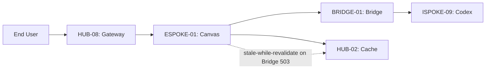

# PHASE ESPOKE-01: Public CMS and Content Delivery Layer

## Tier
External Spoke (Public-facing Application)

## Resolves
Merges the self-identified weakness from `docs/evaluation/SOLUTIONS_TO_WEAKNESSES.md`
("SEO Optimization Relies on Perfect Markup") into this file per Governance Rule 5, and aligns this
Spoke's Bridge-dependency behavior with `BRIDGE-01`'s corrected fail-closed contract.

## Component Name
Sovereign Canvas (CMS)

## Description
The public-facing CMS and delivery engine. Renders high-performance, SEO-optimized pages for
end-users, consuming content from the Internal Knowledge Base (`ISPOKE-09`) exclusively via the
`BRIDGE-01` transformation layer — never directly.

## Build Status
🔴 **Blocked** on `HUB-03`, `HUB-02`, `HUB-26`, `HUB-08`, `HUB-15` (Hub-tier, none implemented),
`BRIDGE-01` (design-complete per this delivery, implementation blocked on its own dependencies), and
`ISPOKE-09` (Internal Spoke, not yet documented at all — outside the 15 currently detailed and outside
the 10 placeholder stubs in `docs/internal-spokes/placeholder-blueprints.md`; this is itself a gap
worth flagging: `ISPOKE-09` is referenced as a live dependency by `ESPOKE-01` but has no blueprint file
and no placeholder entry under the current `ISPOKE-01..25` numbering — confirm during Hub/Spoke
consolidation whether it was renumbered along with the Core tier's drift in Finding 2, or whether it's
a genuine, undocumented gap).

## Dependency Status

### Direct Hub Dependencies
- `HUB-03`: Unified Asset Pipeline & Bundler
- `HUB-02`: Distributed Cache (Redis)
- `HUB-26`: Shared UI Component Library (Public Theme)
- `HUB-08`: API Gateway & Public Surface
- `HUB-15`: Health Check & Service Discovery

### Transitive Core Dependencies
- `CORE-11`: SuperPHP Parser
- `CORE-12`: SuperPHP Compiler
- `CORE-18`: Core Kernel & Lifecycle
- `CORE-06`: Router
- `CORE-14`: Filesystem Abstraction

## Architectural Design
- **PageRenderer** — SuperPHP engine rendering public pages via `HUB-26` (Public Theme).
- **ContentConsumer** — talks to `BRIDGE-01` for public-safe content DTOs. Must implement the
  fail-closed contract from `BRIDGE-01` §5: if the Bridge returns `503`, `ContentConsumer` serves a
  cached last-known-good page (via `HUB-02`) with a `stale` marker, rather than a raw 5xx to the end
  user, wherever a cached copy exists — and a proper error page only when it doesn't.
- **EdgeCacheManager** — integrates with `HUB-02` for sub-5ms-target response times on cached content
  (target, not yet measured — see Benchmark table).
- **SEOEngine** — generates sitemaps, meta tags, and Schema.org markup.

### SEOEngine — scoping correction
The original CI criterion ("every page must score > 90 on Lighthouse SEO/Performance") is a good
target but, as `SOLUTIONS_TO_WEAKNESSES.md` correctly notes, depends on every content author producing
well-formed markup — a single fact this blueprint didn't previously account for. Concrete mitigation:

- `SEOEngine` validates generated markup against required fields (title length, meta description
  presence/length, canonical URL, structured-data schema validity) **at publish time**, in
  `ISPOKE-09`'s content-authoring workflow — not only at render time in `ESPOKE-01`. A content author
  should see a validation failure before publishing, not discover a Lighthouse regression after.
- `ESPOKE-01`'s render path additionally defends against missing/malformed data from upstream (Bridge
  payload) with explicit fallbacks (e.g., a missing meta description falls back to a truncated content
  excerpt, never an empty tag), so a single bad content record can't silently drop the whole page's
  Lighthouse SEO score.

### Content Delivery Diagram


## Interface Contracts

```php
namespace SovereignStack\External\Canvas\Contracts;

interface ContentDeliveryInterface
{
    /** Render a page by its public slug. */
    public function renderPage(string $slug): ResponseInterface;

    /** Clear the public cache for a specific content item. */
    public function purgeCache(string $slug): void;
}

interface SeoValidationInterface
{
    /**
     * Validate content metadata at publish time, before it reaches ESPOKE-01's render path.
     * Called from ISPOKE-09's content workflow, not from ESPOKE-01 itself.
     *
     * @return array<int, string> Validation errors; empty array means valid.
     */
    public function validate(ContentMetadata $metadata): array;
}
```

## Integration Strategy
- **Bridge Compliance:** never queries the internal content database directly; all requests route
  through `BRIDGE-01`'s DTO transformation layer, including the fail-closed/stale-cache fallback above.
- **UI Rendering:** "Public Theme" variants of `HUB-26` components, compiled via `HUB-03`.
- **Caching:** stale-while-revalidate via `HUB-02`, now explicitly also the fallback path for Bridge
  unavailability, not just normal cache expiry.
- **Health:** reports page load times and cache hit/miss ratios to `HUB-15`.

## Benchmark & Verification Methodology
| Target | Method |
|---|---|
| Lighthouse SEO/Performance > 90 | Run against a fixture set that includes at least one deliberately minimal/edge-case content record (short title, no meta description) to verify the fallback behavior above actually holds the score, not just well-authored happy-path content. |
| Bridge Enforcement — internal-only content returns 404 externally | Automated test requesting a fixture "draft SOP" slug through `ESPOKE-01`; assert `404`, and assert (via a spy/mock on the Bridge client) that no unregistered contract was attempted. |
| 100% of public assets served via `HUB-03` CDN layer | Static scan of rendered page output for any asset URL not matching the `HUB-03` CDN host pattern. |
| Cache hit response time | State reference environment and measurement tool (e.g., `k6`) before citing "sub-5ms" — this is currently a target, not a measured result (Finding 10 in `00_CRITIQUE.md`). |

## CI Verification Criteria
- SEO/Performance Lighthouse gate, including the edge-case fixture above.
- Bridge Enforcement test, blocking.
- Asset-origin scan, blocking.
- Stale-while-revalidate-on-503 path has explicit test coverage (new — closes the gap where Bridge
  unavailability previously had no defined `ESPOKE-01`-side behavior at all).

## SemVer Impact
**Major.** Establishes the public web presence and the pattern for Bridge-based consumption.
