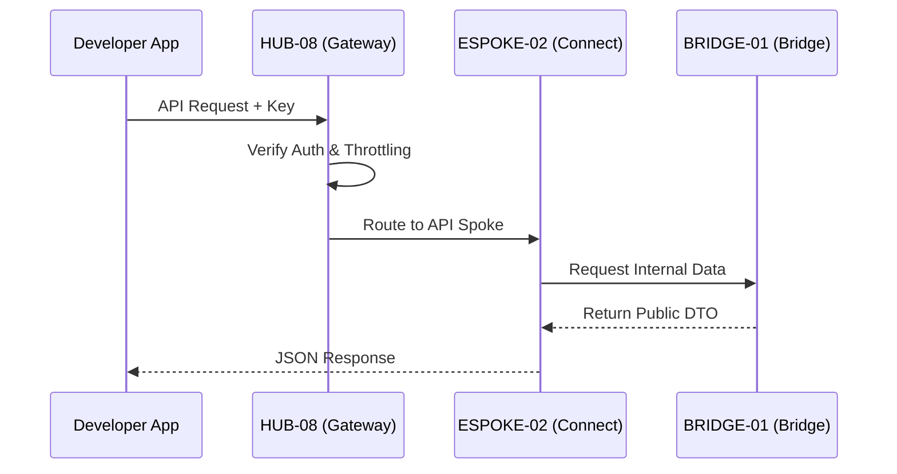

# PHASE ESPOKE-02: Public-Facing REST API Surface

## Tier
External Spoke (Public-facing Service)

## Resolves
Corrects Pattern A, F, and G (`01_MASTER_INDEX.md` §3): `CORE-09: Cryptography & Hashing` → `CORE-16`.
`CORE-07: HTTP Request/Response (PSR-7)` → real `CORE-07` is SuperPHP Lexer; the real PSR-7 component
is `CORE-04`. `CORE-08: HTTP Client (PSR-18)` → dropped; no PSR-18 client phase exists anywhere in the
real 20-item Core tier (`CORE-08` is actually the Error Handler), and this Spoke — a server receiving
requests, not a client making them — doesn't have a genuine need for one anyway.

## Component Name
Sovereign Connect (API)

## Description
The official public REST API: secure programmatic access to the platform's capabilities. Sits on top
of `HUB-08`, enforcing rate limits, versioning, and developer-specific auth contexts.

## Sequencing Rationale
Follows the CMS (`ESPOKE-01`) to provide programmatic access to the same content/services available
via the web UI.

## Build Status
🔴 **Blocked** on `HUB-08`, `HUB-24`, `HUB-04`, `HUB-06` — none implemented.

## Dependency Status — corrected
- **Direct Hub:** `HUB-08`, `HUB-24`, `HUB-04`, `HUB-06`, `HUB-15`, and **`HUB-28`** (added — real
  `HUB-28` is API Versioning, and `VersionController` genuinely needs it; the original omitted the one
  Hub ID this Spoke actually should reference, while citing the wrong one elsewhere).
- **Transitive Core:** ~~`CORE-07: HTTP Request/Response (PSR-7)`~~ → **`CORE-04: PSR-7 HTTP Message &
  Factory`**; ~~`CORE-08: HTTP Client (PSR-18)`~~ → **dropped**; `CORE-18`; ~~`CORE-09: Cryptography &
  Hashing`~~ → **`CORE-16: Binary Encryption Envelope`** (API key hashing).

## Architectural Design
- **VersionController** — manages API versioning (`/v1/`, `/v2/`) and deprecation headers, delegating
  to `HUB-28`'s `VersioningInterface` rather than implementing its own scheme.
- **Throttler** — granular rate limits per API key/endpoint via `HUB-02` (through `HUB-07`, corrected
  from an implicit direct-`HUB-02` reference — rate limiting is `HUB-07`'s job, using `HUB-02` as its
  backing store).
- **ResponseTransformer** — consistent JSON:API/Hal+JSON formatting.
- **DocGenerator** — updates public API documentation based on `HUB-24` schemas.

### API Request Flow Diagram


## Interface Contracts

```php
namespace SovereignStack\External\Connect\Contracts;

interface PublicApiInterface
{
    public function handle(\Psr\Http\Message\ServerRequestInterface $request): \Psr\Http\Message\ResponseInterface;
    public function registerVersion(string $version, string $handlerClass): void;
}
```

## Integration Strategy
- **Bridge Compliance:** consumes only `BRIDGE-01` permitted contracts for external data access.
- **Gateway:** integrated with `HUB-08` for SSL termination and global request filtering.
- **Auditing:** every public API call logged in `HUB-06` with developer attribution.
- **Health:** API uptime, average response time, error rates reported to `HUB-15`.

## Benchmark & Verification Methodology
| Target | Method |
|---|---|
| Version isolation | Integration test: modify `v2` behavior; run the full `v1` test suite against it; assert zero `v1` regressions. |
| Throttling | Load test hitting the per-minute limit; assert correct blocking at the exact boundary, matching `HUB-07.md`'s exact-boundary test. |
| Schema compliance | Automated test validating 100% of a fixture response set against the published `HUB-24` manifest. |

## CI Verification Criteria
- Version-isolation regression test, blocking.
- Exact-boundary throttling test (shared methodology with `HUB-07`), blocking.
- Schema-compliance validation test, blocking.

## SemVer Impact
**Major.** Establishes the public programmatic interface for the platform.
