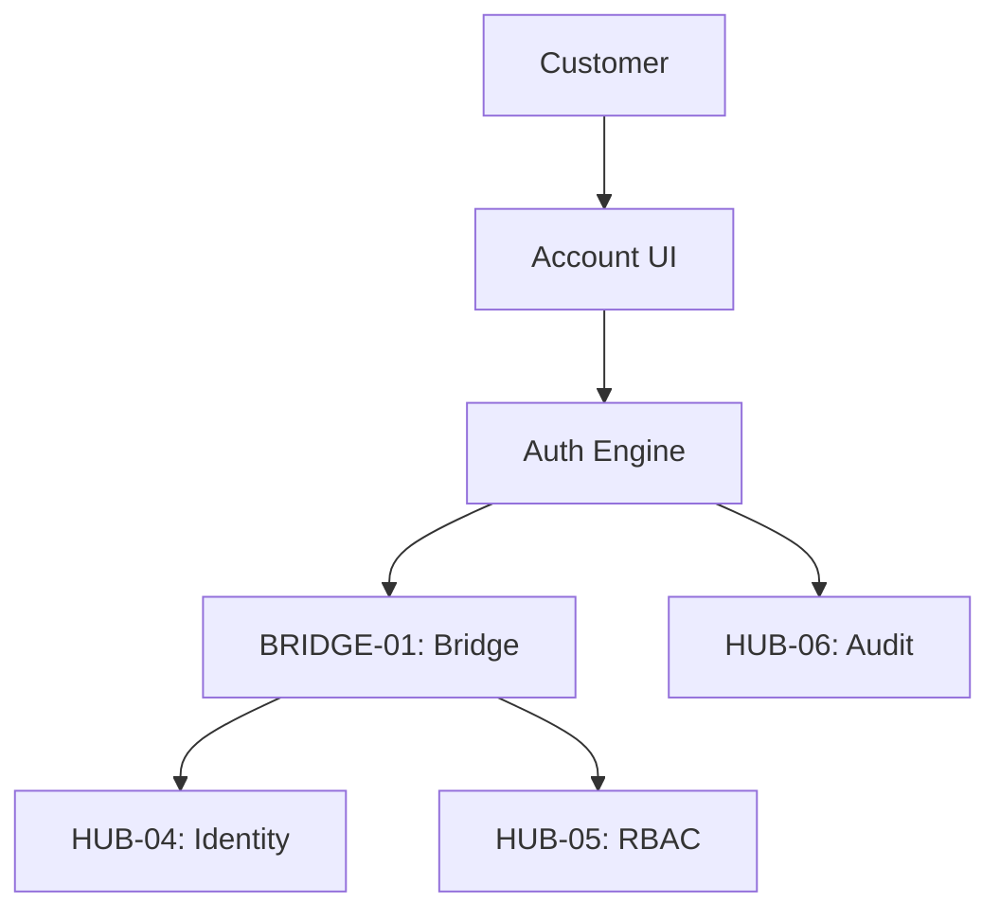

# PHASE ESPOKE-03: Customer Authentication and Account Portal

## Tier
External Spoke (Public-facing Application)

## Resolves
Corrects Pattern A (`01_MASTER_INDEX.md` §3) — and this is one of the cases where the bug isn't
cosmetic: the original CI criterion literally reads "Passwords must be hashed using `CORE-09`
(Argon2id)." The real `CORE-09` is a logging service; it cannot hash anything. Taken at face value,
this criterion was unimplementable. Corrected to `CORE-16`.

## Component Name
Sovereign Account (Auth)

## Description
Public-facing authentication and account-management portal: customer registration, login, password
resets, profile management. Interfaces with `HUB-04` through `BRIDGE-01` to manage customer identities
without exposing staff identity systems.

## Sequencing Rationale
Critical for Search (`ESPOKE-04`) and Notification (`ESPOKE-06`), which require verified customer
identity.

## Build Status
🔴 **Blocked** on `HUB-04`, `HUB-05`, `HUB-06`, `HUB-26` — none implemented.

## Dependency Status — corrected
- **Direct Hub:** `HUB-04`, `HUB-05`, `HUB-26`, `HUB-06`, `HUB-08`, `HUB-15`. *(Verified — correct.)*
- **Transitive Core:** ~~`CORE-09: Cryptography & Hashing`~~ → **`CORE-16: Binary Encryption
  Envelope`**, `CORE-18`, `CORE-19`, `CORE-11`, `CORE-12`.

## Architectural Design
- **AccountManager** — customer profile updates and account settings.
- **AuthFlowEngine** — OAuth2/OIDC flows, MFA enrollment, session persistence.
- **SecurityCenter** — UI for customers to view active sessions and security logs.
- **IdentityBridge** — a specialized `BRIDGE-01` contract mapping public customers to Hub identities.

### Customer Auth Diagram


## Interface Contracts

```php
namespace SovereignStack\External\Account\Contracts;

interface CustomerAccountInterface
{
    public function login(string $email, string $password): AuthResult;
    public function updateProfile(string $customerId, array $data): bool;
}
```

## Integration Strategy
- **Bridge Compliance:** customer identities strictly isolated from staff identities at the Bridge
  level — no customer can ever authenticate against an internal staff service.
- **UI:** `HUB-26` components styled for customer-facing simplicity and security.
- **Auditing:** all login attempts, failed or successful, logged in `HUB-06`.
- **Health:** auth success/failure rates and MFA latency reported to `HUB-15`.

## Benchmark & Verification Methodology
| Target | Method |
|---|---|
| Credential safety | Unit test: hash a fixture password via `CORE-16`, assert Argon2id is the algorithm used (parse the hash prefix), and assert the hash never appears in plaintext logs. |
| Session isolation | Integration test: authenticate as a customer, attempt to access any `internal/`/`staff/`-prefixed route; assert `403`/`404`, never success. |
| GDPR erasure | Integration test: trigger "Delete My Account," poll all fixture Hub services storing that customer's data; assert zero remaining references after the cascade completes. |

## CI Verification Criteria
- Credential-hashing test against the corrected `CORE-16` dependency, blocking — this is what makes
  the Pattern A fix load-bearing, since the original criterion was literally unimplementable as
  written.
- Session-isolation test, blocking — same severity class as `BRIDGE-01`'s boundary tests.
- GDPR cascading-erasure test, blocking.

## SemVer Impact
**Major.** Provides the primary identity layer for the external ecosystem.
