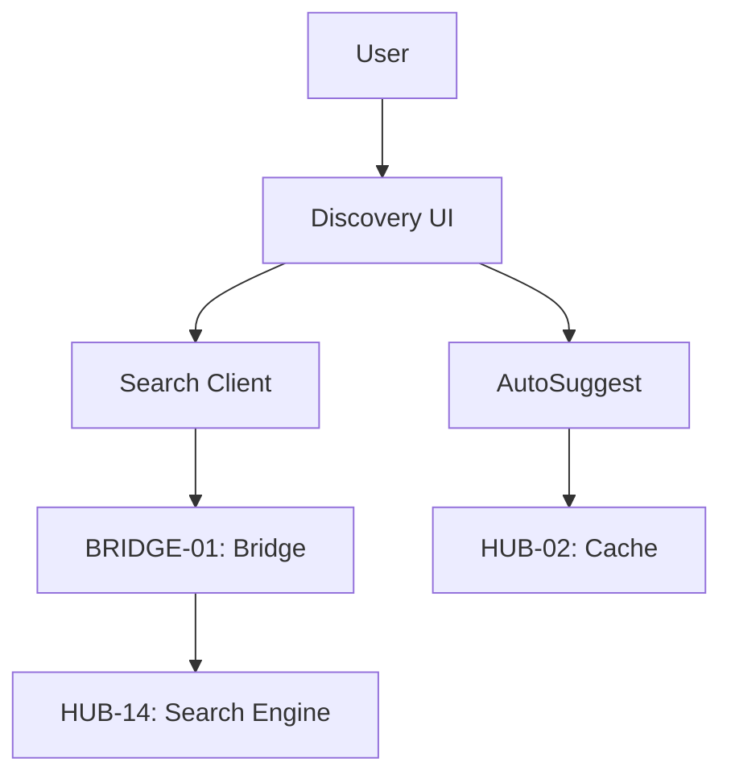

# PHASE ESPOKE-04: Public Search and Discovery Interface

## Tier
External Spoke (Public-facing Application)

## Resolves
Corrects Pattern E (`01_MASTER_INDEX.md` §3): `HUB-13: Full-text Search & Indexing` → real `HUB-13` is
I18n; the actual search component is `HUB-14`.

## Component Name
Sovereign Discovery (Search)

## Description
High-performance search/discovery interface: search across the Public CMS, Products, and
Documentation. Uses `HUB-14` through `BRIDGE-01` for filtered, public-safe search results.

## Sequencing Rationale
Relies on `ESPOKE-03` for personalized search results ("My Orders," "My Documents").

## Build Status
🔴 **Blocked** on `HUB-14`, `HUB-02`, `HUB-26`, `HUB-08` — none implemented.

## Dependency Status — corrected
- **Direct Hub:** ~~`HUB-13: Full-text Search & Indexing`~~ → **`HUB-14: Search Abstraction Layer`**,
  `HUB-26`, `HUB-08`, `HUB-02`, `HUB-15`.
- **Transitive Core:** `CORE-06`, `CORE-18`, `CORE-11`, `CORE-12`.

## Architectural Design
- **SearchClient** — executes public-safe search queries against `HUB-14` via the Bridge.
- **FacetManager** — dynamic search filters (Category, Date, Author).
- **AutoSuggest** — real-time type-ahead for the search bar, backed by `HUB-02`.
- **ResultStyler** — renders result snippets using `HUB-26` templates.

### Search Interaction Diagram


## Interface Contracts

```php
namespace SovereignStack\External\Discovery\Contracts;

interface PublicSearchInterface
{
    public function search(string $query, array $filters, int $page): SearchResult;
    public function suggest(string $partial): array;
}
```

## Integration Strategy
- **Bridge Compliance:** search queries restricted to "Public" indices only via `HUB-14`'s degraded-
  mode-aware bridge contract — no internal-only document can ever appear in results, and this must
  hold even when `HUB-14`'s circuit breaker (see `HUB-14.md`) has fallen back to the database driver.
- **UI:** reactive search interfaces via SuperPHP and `HUB-26` list components.
- **Caching:** result pages and auto-suggest cached in `HUB-02` for 5 minutes.
- **Health:** search latency and "No Results Found" frequency reported to `HUB-15`.

## Benchmark & Verification Methodology
| Target | Method |
|---|---|
| Search performance | State environment before citing "< 150ms" — measure once `HUB-14` exists, against a realistic fixture index size (Finding 10). |
| Security | Integration test: query `*` (match-all); assert zero documents with `internal_only: true` appear, checked against a fixture set that deliberately includes some. |
| Degraded-mode security | Integration test: force `HUB-14`'s circuit breaker open (per `HUB-14.md`); repeat the internal-document leak test above against the database-fallback path — the security property must hold in both modes, not just the primary engine. |
| Load | Load test: 500 concurrent search requests; report actual measured latency delta, don't restate "< 500ms" unmeasured (Finding 10). |

## CI Verification Criteria
- Internal-document-leak test against both search modes (primary and degraded), blocking — this is
  stricter than the original, which only implied the primary engine.
- Load test measured and reported with environment stated.

## SemVer Impact
**Minor.** Enhances user experience and content discoverability.
