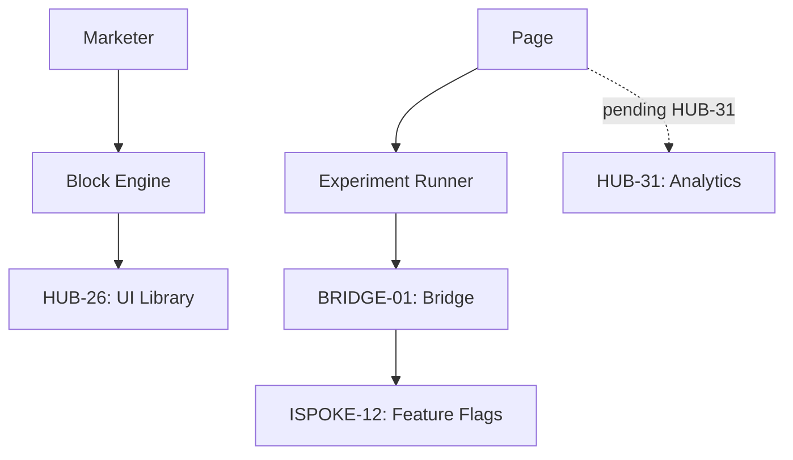

# PHASE ESPOKE-05: Marketing and Landing Page Engine

## Tier
External Spoke (Public-facing Application)

## Resolves
Corrects Pattern B (`01_MASTER_INDEX.md` §3/§4): "pushes real-time conversion and engagement data to
`HUB-28`" is a genuine `HUB-31` (pending) case — same category as `ISPOKE-05`/`12`/`13`, not a
mislabeled pointer to something that already exists.

## Component Name
Sovereign Growth (Marketing)

## Description
Engine for building, deploying, and optimizing marketing landing pages: block-based editor (via
`HUB-26`), A/B testing (via `ISPOKE-12`), marketing analytics integration.

## Sequencing Rationale
Built after CMS and Search Spokes to provide a flexible, conversion-oriented layer atop standard
content delivery.

## Build Status
🔴 **Blocked** on `HUB-03`, `HUB-01`, `HUB-26`, `HUB-08` — none implemented. `CampaignManager`'s
conversion-tracking dashboard additionally blocked on `HUB-31` (pending), independent of the rest of
this Spoke.

## Dependency Status — corrected
- **Direct Hub:** `HUB-03`, `HUB-01`, ~~`HUB-28: Distributed Ledger & Analytics Engine`~~ → **`HUB-31`
  (pending)**, `HUB-26`, `HUB-08`, `HUB-15`.
- **Transitive Core:** `CORE-11`, `CORE-12`, `CORE-18`, `CORE-14`.

## Architectural Design
- **BlockEngine** — conversion-optimized UI blocks (Hero, Features, Pricing, Testimonials).
- **CampaignManager** — page variations, UTM tracking, conversion goals; the live conversion dashboard
  specifically depends on `HUB-31` and degrades gracefully (per the same pattern as `ISPOKE-12`'s
  `ImpactMonitor`) if unavailable.
- **LandingPageRenderer** — lightweight SuperPHP renderer optimized for sub-100ms LCP.
- **ExperimentBridge** — fetches A/B test configurations defined in `ISPOKE-12` via `BRIDGE-01`.

### Marketing Page Diagram


## Interface Contracts

```php
namespace SovereignStack\External\Growth\Contracts;

interface MarketingPageInterface
{
    public function render(string $pageId, array $campaignData): \Psr\Http\Message\ResponseInterface;

    /** Recorded regardless of HUB-31's availability — see Integration Strategy. */
    public function trackConversion(string $pageId, string $goalId): void;
}
```

## Integration Strategy
- **Bridge Compliance:** A/B test variations served via `BRIDGE-01` so marketing users can't
  accidentally expose internal feature flags.
- **Asset Pipeline:** page-specific JS/CSS bundles via `HUB-03`.
- **Analytics:** `trackConversion()` always writes to `HUB-06` (durable, guaranteed) regardless of
  `HUB-31`'s availability; the *dashboard* reading that data back is what's blocked on `HUB-31` —
  conversion events themselves are never lost even if real-time analytics is down.
- **Health:** page conversion rates and loading performance reported to `HUB-15`.

## Benchmark & Verification Methodology
| Target | Method |
|---|---|
| Lighthouse Performance = 100 | Run against the actual `LandingPageRenderer` output for a representative fixture page, not a stripped-down test page. |
| Experiment consistency | Integration test: same fixture user, repeated page loads; assert identical A/B variation served every time within the session. |
| Asset weight | Static check: total JS/CSS payload for a fixture standard landing page ≤ 50KB gzipped — measured, not estimated. |
| Conversion durability | Integration test: call `trackConversion()` with `HUB-31` unavailable; assert the `HUB-06` write still succeeds. |

## CI Verification Criteria
- Lighthouse Performance = 100 test, blocking.
- Experiment-consistency test, blocking.
- Asset-weight static check, blocking.
- Conversion-durability test (above), blocking — this is what makes "conversion events are never
  lost" an enforced property rather than an assumption.

## SemVer Impact
**Minor.** Provides growth and optimization tools for the platform.
