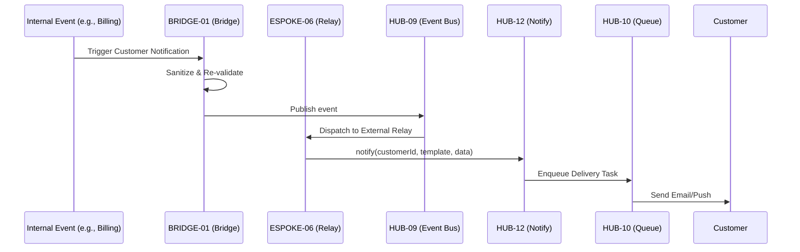

# PHASE ESPOKE-06: Customer Notification and Communication Hub

## Tier
External Spoke (Public-facing Application)

## Resolves
Corrects Pattern C and D (`01_MASTER_INDEX.md` §3): `HUB-12: Event-driven Messaging & Pub/Sub` → real
pub/sub is `HUB-09`; `HUB-11: Job Queue & Background Processing` → real Queue is `HUB-10` (`HUB-11` is
Cloud Storage). Same pattern as `ISPOKE-07`, applied here for the external-facing counterpart.

## Component Name
Sovereign Relay (External)

## Description
Manages all communications with end-customers: transactional emails, push notifications, in-app
alerts. Consumes the `ISPOKE-07` messaging infrastructure through a strict `BRIDGE-01` policy.

## Sequencing Rationale
Follows the Account Portal (`ESPOKE-03`) — requires customer identity and preference data to deliver
messages.

## Build Status
🔴 **Blocked** on `HUB-09`, `HUB-10`, `HUB-26`, `HUB-08`, `HUB-06` — none implemented.

## Dependency Status — corrected
- **Direct Hub:** ~~`HUB-12: Event-driven Messaging & Pub/Sub`~~ → **`HUB-09: Event Bus / Message
  Broker`** (for real-time delivery triggers), **`HUB-12: Notification Service`** (kept, but as the
  actual Notify component this Spoke's `PublicRelay` delegates *to*, not the pub/sub layer it listens
  *on* — both were needed, the original just mislabeled which was which), ~~`HUB-11: Job Queue &
  Background Processing`~~ → **`HUB-10: Queue & Job Dispatcher`**, `HUB-26`, `HUB-08`, `HUB-06`,
  `HUB-15`.
- **Transitive Core:** `CORE-18`, `CORE-14`, `CORE-02`, `CORE-11`, `CORE-12`.

## Architectural Design
- **CustomerPreferences** — communication settings (opt-in/opt-out).
- **PublicRelay** — Bridge-compliant interface triggering customer notifications from internal events
  received via `HUB-09`, delegating actual multi-channel delivery to `HUB-12`.
- **ChannelManager** — integrates with public providers (SendGrid, Twilio, Firebase) *through*
  `HUB-12`'s channel abstraction, not a second, competing integration.
- **NotificationArchive** — customer-viewable notification history within the Account Portal.

### External Notification Flow Diagram


## Interface Contracts

```php
namespace SovereignStack\External\Relay\Contracts;

interface ExternalRelayInterface
{
    public function notifyCustomer(string $customerId, string $template, array $data): void;
    public function updatePreferences(string $customerId, array $preferences): bool;
}
```

## Integration Strategy
- **Bridge Compliance:** all requests from the Internal tier pass through `BRIDGE-01`; no internal
  staff data or sensitive system details leak into customer-facing templates.
- **UI:** "Notification Center" integrated into `ESPOKE-03`'s Account Portal via `HUB-26`.
- **Auditing:** every customer-facing message logged in `HUB-06`.
- **Health:** delivery success rates and channel latency reported to `HUB-15`.

## Benchmark & Verification Methodology
| Target | Method |
|---|---|
| Template safety | Test with deliberately malformed template data; assert no raw PHP or internal DTO field ever renders in output, checked against a fixture set of adversarial template inputs. |
| Spam control | Integration test: attempt to exceed the global/per-user rate limit on non-transactional notifications; assert `HUB-07`-backed rejection. |
| Preference honoring | Integration test: opt a fixture customer out of "Marketing"; assert zero marketing-tagged messages are ever dispatched to them, verified against the actual `HUB-09`→`HUB-12` delivery path, not just a UI setting. |
| Delegation correctness | Integration test asserting `PublicRelay` actually calls `HUB-09` for events and `HUB-12` for delivery (verifies the Pattern C/D fix is load-bearing). |

## CI Verification Criteria
- Template-safety adversarial test, blocking.
- Spam-control rate-limit test, blocking.
- Preference-honoring test against the real delivery path, blocking.
- Delegation-correctness test (above), blocking.

## SemVer Impact
**Minor.** Completes the communication loop between the system and its users.
