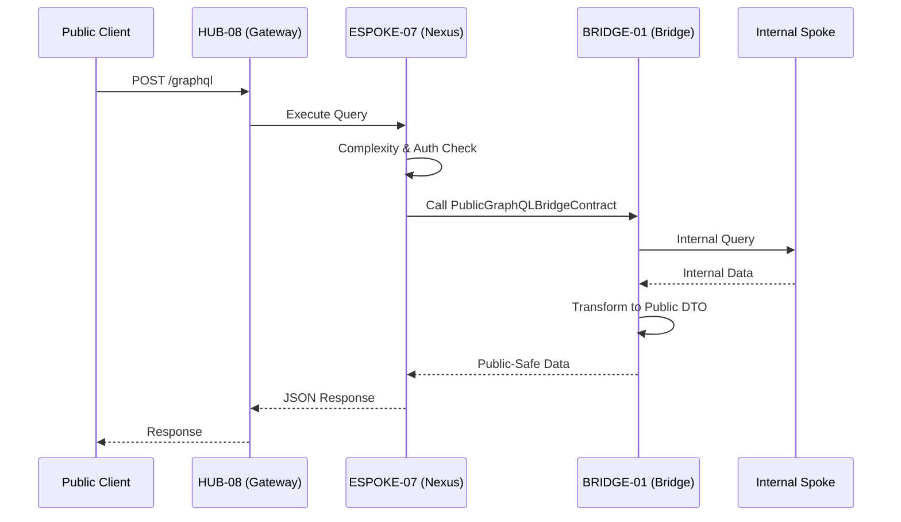

# PHASE ESPOKE-07: Public-Facing GraphQL API Surface

## Tier
External Spoke (Public-facing Application)

## Resolves
Corrects Pattern A (`01_MASTER_INDEX.md` §3): `CORE-09: Cryptography & Hashing (Query Hashing/Signing)`
→ `CORE-16`.

## Component Name
Sovereign Nexus (GraphQL API) — **External Spoke**; distinct from `HUB-21`'s and `ISPOKE-14`'s
"Sovereign Nexus" naming — see the naming-collision notes in `ISPOKE-13.md`/`ISPOKE-14.md`. Three
different components now share variations of "Nexus" across tiers; disambiguate by tier when discussing
any of them.

## Description
Performant, unified GraphQL API surface for public consumption: a consumer-facing projection of the
Sovereign Stack data model, exposing only "Public-Safe" types and fields via `HUB-24`, enforcing
`BRIDGE-01`'s boundary rules.

## Sequencing Rationale
Must exist before `ESPOKE-12` (Developer Portal), which consumes this surface's schema. Follows basic
public web presence (`ESPOKE-01`) and REST APIs (`ESPOKE-02`).

## Build Status
🔴 **Blocked** on `HUB-24`, `HUB-08`, `HUB-04`, `HUB-05` — none implemented.

## Dependency Status — corrected
- **Direct Hub:** `HUB-24`, `HUB-08`, `HUB-04`, `HUB-05`, `HUB-15`. *(Verified — correct.)*
- **Transitive Core:** `CORE-02`, `CORE-06`, `CORE-04`, `CORE-18`, ~~`CORE-09: Cryptography &
  Hashing`~~ → **`CORE-16: Binary Encryption Envelope`** (query hashing/signing for persisted-query
  security).

## Architectural Design
- **NexusSchemaManager** — defines the public GraphQL schema by aggregating types exposed through the
  Bridge.
- **PublicResolverEngine** — executes resolvers calling `BRIDGE-01` to fetch data from the Internal
  tier.
- **ComplexityController** — cost-based query depth/complexity limiting to prevent DoS.
- **TypeProjectionLayer** — maps internal DTOs from the Bridge to the public GraphQL type system.

### Public GraphQL Flow


## Interface Contracts

```php
namespace SovereignStack\External\Nexus\Contracts;

use SovereignStack\Bridge\Contracts\BoundaryContractInterface;

interface PublicGraphQLBridgeContract extends BoundaryContractInterface
{
    public function fetchProjection(string $type, string $id, array $requestedFields): array;
    public function search(string $query, array $filters): array;
}
```

## Integration Strategy
- **Bridge Enforcement:** every resolver interacts with the Internal tier exclusively via
  `PublicGraphQLBridgeContract`; direct access to Internal Spokes or Hub-tier databases is prohibited.
- **Boundary Rules:** any resolver requesting a field not explicitly "Public-Safe" triggers a
  `ViolationException` and a GraphQL error.
- **Gateway Integration:** mounted at `/graphql` via `HUB-08` middleware, inheriting rate limiting and
  WAF protections.
- **Authentication:** `HUB-04` validates public API keys/JWTs; context passed to `HUB-24` for
  field-level authorization.

## Benchmark & Verification Methodology
| Target | Method |
|---|---|
| Schema validation | Static scan: unified schema must never expose an "Internal" suffix on any type name. |
| Complexity limit | Integration test: submit a query exceeding complexity 1000 or depth 10; assert `400 Bad Request` before any resolver executes (not after partial execution). |
| Bridge isolation | Static analysis: no file in `SovereignStack\External\Nexus` may `use` any `SovereignStack\Internal` class — same mechanism as `BRIDGE-01`'s Zero-Exposure Test. |
| Response time | State environment before citing "< 50ms p95" — measure once `HUB-24` exists (Finding 10). |

## CI Verification Criteria
- Schema-validation scan, blocking.
- Complexity-limit-before-execution test, blocking.
- Bridge-isolation static analysis, blocking.
- Response time measured and reported with environment stated.

## SemVer Impact
**Major.** Establishes the primary typed data interface for the public ecosystem.
