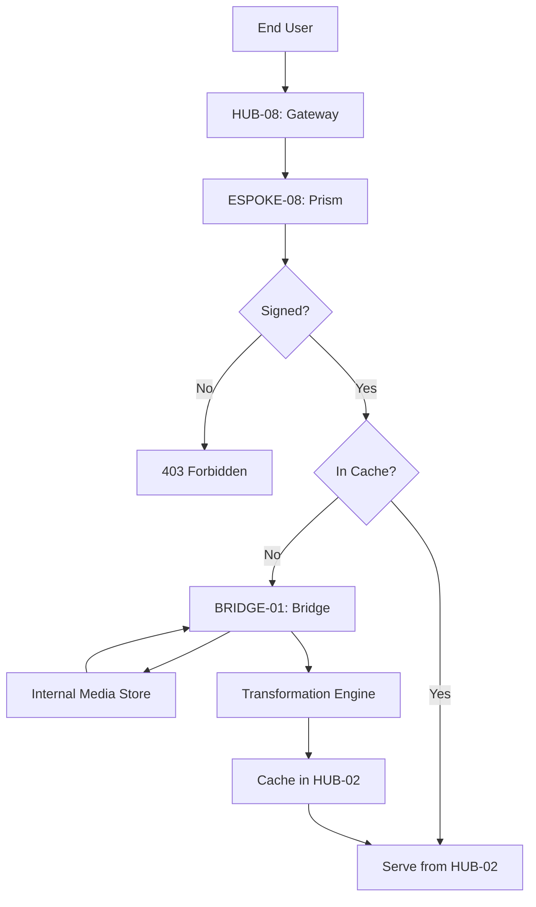

# PHASE ESPOKE-08: Public Media and Asset Delivery Service

## Tier
External Spoke (Public-facing Application)

## Resolves
Corrects Pattern A (`01_MASTER_INDEX.md` §3): signed-URL secrets sourced from `CORE-09` → `CORE-16`.

## Component Name
Sovereign Prism (Media Delivery)

## Description
Delivery service for public media/static assets: image transformation, video streaming metadata, asset
optimization. Public entry point for media stored in the Internal sub-tier, enforcing privacy/delivery
rules via the Bridge.

## Sequencing Rationale
Follows `ESPOKE-07`. Media assets are required by nearly all subsequent public-facing portals.

## Build Status
🔴 **Blocked** on `HUB-03`, `HUB-02`, `HUB-08` — none implemented.

## Dependency Status — corrected
- **Direct Hub:** `HUB-03`, `HUB-02`, `HUB-08`, `HUB-15`. *(Verified — correct.)*
- **Transitive Core:** `CORE-14`, `CORE-18`, `CORE-06`, `CORE-11`, and ~~signed via `CORE-09`~~ →
  **`CORE-16: Binary Encryption Envelope`** (added as an explicit transitive dependency — the original
  referenced it only in prose, not the formal dependency list).

## Architectural Design
- **TransformationEngine** — PHP wrapper around GD/Imagick for on-the-fly resizing/optimization.
- **CacheLayer** — high-performance edge-caching via `HUB-02`.
- **SecurityProxy** — validates request signatures (via `CORE-16`) to prevent image-resizing DoS.
- **PrismRouter** — maps public URLs to Bridge-requested internal media IDs.

### Asset Delivery Flow


## Interface Contracts

```php
namespace SovereignStack\External\Prism\Contracts;

use SovereignStack\Bridge\Contracts\BoundaryContractInterface;

interface MediaDeliveryBridgeContract extends BoundaryContractInterface
{
    public function getPublicAsset(string $assetId): array;
    public function isPubliclyAccessible(string $assetId): bool;
}
```

## Integration Strategy
- **Bridge Compliance:** interacts with internal storage only through `MediaDeliveryBridgeContract` —
  no direct filesystem access to internal directories.
- **Signed URLs:** all transformation parameters signed via `CORE-16` to prevent abuse.
- **Format Negotiation:** auto-detects browser support (WebP, AVIF), serves the most efficient format.
- **SuperPHP Integration:** `<s:ui:image />` component in `HUB-26` generates optimized Prism URLs.

## Benchmark & Verification Methodology
| Target | Method |
|---|---|
| Optimization ratio | Test against a real fixture image set (not a single best-case image); assert average ≥ 30% size reduction. |
| Signature security | Integration test: request a transformation with an invalid `CORE-16` signature; assert `403 Forbidden`. State environment before citing "< 2ms" for the rejection itself (Finding 10). |
| Cache efficiency | Load test with a realistic repeated-request pattern; report actual measured hit rate, don't restate "> 90%" unmeasured. |
| Bridge leak | Integration test: request an "Internal-only" asset ID via Prism; assert `404 Not Found`. |

## CI Verification Criteria
- Signature-validation test, blocking.
- Bridge-leak test, blocking — same severity class as `BRIDGE-01`'s own tests.
- Optimization-ratio test against the real fixture set, blocking.
- Cache-hit-rate measured and reported with environment/pattern stated.

## SemVer Impact
**Minor.** Enhances delivery performance and security for the public web surface.
