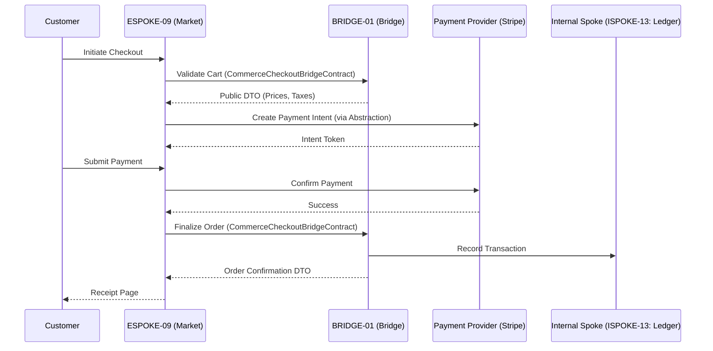

# PHASE ESPOKE-09: E-Commerce and Checkout Portal

## Tier
External Spoke (Public-facing Application)

## Resolves
Corrects Pattern A and Pattern H (`01_MASTER_INDEX.md` §3, Finding 15): `CORE-09: Cryptography &
Hashing` → `CORE-16`. The Checkout Flow diagram labeled its internal counterpart `ISPOKE-05: Ledger` —
the real `ISPOKE-05` is "Sovereign Insight" (analytics), not billing. The actual Billing/Ledger Internal
Spoke is `ISPOKE-13`.

## Component Name
Sovereign Market (Checkout)

## Description
Secure, high-conversion e-commerce/checkout application: shopping carts, tax/shipping calculation via
the Bridge, payment processing coordination through an abstraction layer. Consumes exclusively from
`HUB-26` for UI, honors `BRIDGE-01` for all transaction processing.

## Sequencing Rationale
Depends on `ESPOKE-08` (Prism) for product imagery and `ESPOKE-01` (Canvas) for shopping-experience
integration. Precedes `ESPOKE-10` (Subscription) — base checkout logic established here.

## Build Status
🔴 **Blocked** on `HUB-26`, `HUB-04`, `HUB-08`, `HUB-06`, `HUB-02` — none implemented.

## Dependency Status — corrected
- **Direct Hub:** `HUB-26`, `HUB-04`, `HUB-08`, `HUB-06`, `HUB-02`. *(Verified — correct.)*
- **Transitive Core:** ~~`CORE-09: Cryptography & Hashing`~~ → **`CORE-16: Binary Encryption
  Envelope`**, `CORE-18`, `CORE-11`, `CORE-02`.

## Architectural Design
- **CartManager** — reactive, cache-backed shopping-session state manager.
- **PaymentAbstractionLayer** — unified interface for external providers (Stripe, PayPal); no direct
  SDK coupling.
- **OrderWorkflowEngine** — orchestrates Cart → Pending → Complete state transitions.
- **CheckoutPresenter** — multi-step checkout UI using `HUB-26` components.

### Checkout Flow Diagram


## Interface Contracts

```php
namespace SovereignStack\External\Market\Contracts;

use SovereignStack\Bridge\Contracts\BoundaryContractInterface;

interface CommerceCheckoutBridgeContract extends BoundaryContractInterface
{
    public function validateCart(array $items, ?string $promoCode = null): array;
    public function finalizeOrder(string $paymentToken, array $customerDetails): array;
}

interface PaymentProviderInterface
{
    public function createIntent(float $amount, string $currency): string;
    public function capturePayment(string $intentId): bool;
}
```

## Integration Strategy
- **Bridge Compliance:** never touches internal order/inventory tables directly; uses
  `CommerceCheckoutBridgeContract` for all logic verification, which records transactions through
  `ISPOKE-13` (corrected from the original's `ISPOKE-05`).
- **UI Consistency:** strictly `HUB-26` checkout components.
- **Security:** no raw credit-card data ever touches the Sovereign Stack — provider-issued tokens
  only, same PCI-scope discipline as `HUB-22.md`'s static-analysis rule, applied here too.
- **Audit:** every checkout attempt and payment response logged to `HUB-06`.

## Benchmark & Verification Methodology
| Target | Method |
|---|---|
| Zero-coupling | Static analysis: no Stripe/PayPal namespace used outside `SovereignStack\External\Market\Drivers`. |
| Transaction integrity | Integration test: simulate a network timeout after payment capture but before order finalization; assert the system lands in a well-defined "Recoverable" state (not lost, not double-charged) in the Bridge. |
| Performance | State device/environment before citing "60FPS" — measure on a defined reference device profile (Finding 10). |
| Ledger routing | Integration test asserting `finalizeOrder()` actually records against `ISPOKE-13`, not the mislabeled `ISPOKE-05` — verifies the Pattern H fix is load-bearing. |

## CI Verification Criteria
- Zero-coupling static scan, blocking.
- Transaction-integrity recoverable-state test, blocking.
- Ledger-routing test (above), blocking.
- Performance measured against a stated reference device profile.

## SemVer Impact
**Major.** Establishes the revenue-generating engine of the platform.
