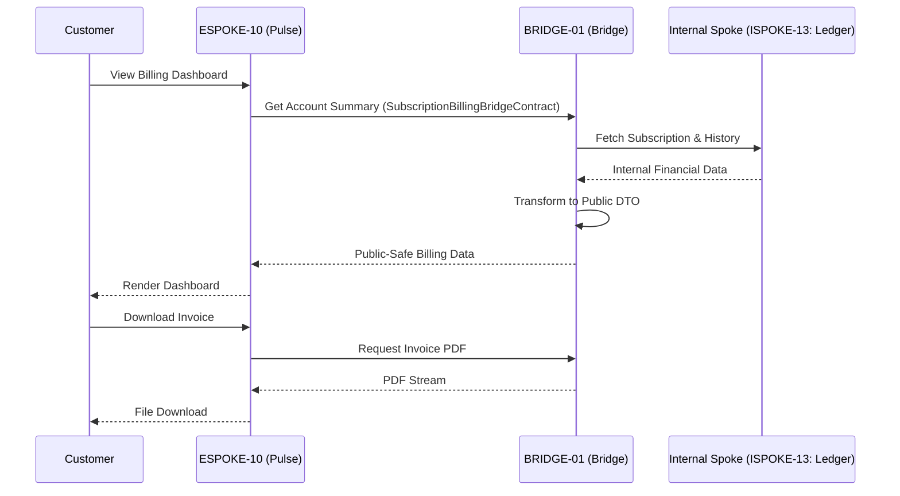

# PHASE ESPOKE-10: Public Subscription and Billing Portal

## Tier
External Spoke (Public-facing Application)

## Resolves
Corrects Pattern A and Pattern H (`01_MASTER_INDEX.md` §3, Finding 15) — the same two corrections as
`ESPOKE-09`: `CORE-09` → `CORE-16`, and the internal counterpart in the Subscription Management Flow
diagram corrected from `ISPOKE-05: Ledger` to `ISPOKE-13: Ledger` (the real `ISPOKE-05` is Insight/
Analytics).

## Component Name
Sovereign Pulse (Billing) — **External Spoke**; distinct from `HUB-25`'s "Sovereign Chronos" and any
other "Pulse"-named component — check tier before assuming which "Pulse" is meant (this one is
customer-facing billing self-service, not the Hub-tier `HUB-15` health-monitoring "Sovereign Pulse").

## Description
Portal for customers to manage subscriptions, view invoices, update billing methods — "Self-Service
Billing," interacting with the Internal Spoke sub-tier via the Bridge to keep sensitive financial/plan
data protected.

## Sequencing Rationale
Depends on `ESPOKE-09` for shared payment abstraction logic and `ESPOKE-03` (Account Portal) for user
context.

## Build Status
🔴 **Blocked** on `HUB-04`, `HUB-26`, `HUB-08` — none implemented.

## Dependency Status — corrected
- **Direct Hub:** `HUB-04`, `HUB-26`, `HUB-08`, `HUB-15`. *(Verified — correct.)*
- **Transitive Core:** ~~`CORE-09: Cryptography & Hashing`~~ → **`CORE-16: Binary Encryption
  Envelope`**, `CORE-18`, `CORE-04`, `CORE-12`.

## Architectural Design
- **SubscriptionManager** — plan transitions (upgrades/downgrades), lifecycle states.
- **InvoiceEngine** — public-safe invoice data, downloadable PDFs via the Bridge.
- **PaymentMethodVault** — secure interface for saved payment tokens (never raw cards).
- **PulseUI** — customer-facing dashboard via `HUB-26`.

### Subscription Management Flow


## Interface Contracts

```php
namespace SovereignStack\External\Pulse\Contracts;

use SovereignStack\Bridge\Contracts\BoundaryContractInterface;

interface SubscriptionBillingBridgeContract extends BoundaryContractInterface
{
    public function getSubscriptionSummary(string $customerId): array;
    public function getInvoices(string $customerId): array;
    public function changePlan(string $customerId, string $newPlanId): array;
}
```

## Integration Strategy
- **Bridge Compliance:** sensitive financial records never exposed — the Bridge only passes DTOs with
  "safe" metadata (last 4 digits, expiry, plan names, amounts), fetched from `ISPOKE-13` (corrected
  from the original's `ISPOKE-05`).
- **Auth Guard:** every request verified against `HUB-04`/`HUB-05` — users only access their own
  billing data.
- **Payment Abstraction:** shares `PaymentProviderInterface` from `ESPOKE-09`.
- **PDF Delivery:** invoices streamed via the Bridge — never stored in a publicly accessible bucket.

## Benchmark & Verification Methodology
| Target | Method |
|---|---|
| Privacy enforcement | Integration test: fetch an invoice for "Customer A" using "Customer B's" session; assert `403 Forbidden`. |
| Plan transition integrity | Integration test: downgrade a fixture subscription; assert the correct "Entitlement Change" event fires in the Bridge, verified against `ISPOKE-13`'s actual entitlement state, not just an event being emitted. |
| UI performance | State the actual 4G throttle profile used before citing "< 1.5s" — measure on a defined test harness (Finding 10). |
| Ledger routing | Integration test asserting all three Bridge contract methods actually query `ISPOKE-13`, not `ISPOKE-05` — verifies the Pattern H fix. |

## CI Verification Criteria
- Privacy-enforcement cross-customer test, blocking — same severity class as `BRIDGE-01`'s tests.
- Plan-transition entitlement test against real `ISPOKE-13` state, blocking.
- Ledger-routing test (above), blocking.
- UI performance measured against a defined throttle profile and reported.

## SemVer Impact
**Major.** Completes customer lifecycle management for the platform.
