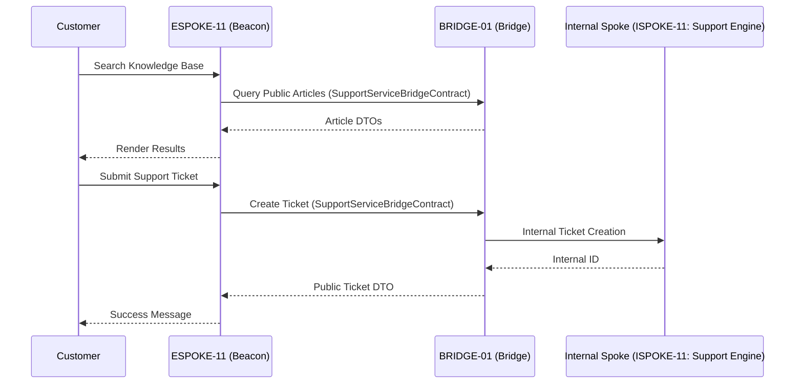

# PHASE ESPOKE-11: Customer Self-Service and Support Centre

## Tier
External Spoke (Public-facing Application)

## Resolves
Cross-references checked against `01_MASTER_INDEX.md` §3 — clean, no correction needed. Adds stated
benchmark methodology (Finding 10).

## Component Name
Sovereign Beacon (Support)

## Description
Unified self-service portal and support-ticket system: customers find answers via the public knowledge
base and interact with support staff via tickets, without direct access to internal staff-only support
tools.

## Sequencing Rationale
Depends on `ESPOKE-01` for page-rendering patterns and `ESPOKE-03` for customer context. Consumes
"Public-Safe" articles from the knowledge base established in `ISPOKE-09`.

## Build Status
🔴 **Blocked** on `HUB-26`, `HUB-08`, `HUB-04` — none implemented.

## Dependency Status
- **Direct Hub:** `HUB-26`, `HUB-08`, `HUB-04`, `HUB-15`. *(Verified — correct.)*
- **Transitive Core:** `CORE-11`, `CORE-18`, `CORE-06`, `CORE-14`.

## Architectural Design
- **KnowledgeBaseConsumer** — fetches/renders public-safe articles via the Bridge, reading
  `ISPOKE-09`'s `isPublic()` flag (see `ISPOKE-09.md`) — the same mechanism `ESPOKE-01` uses.
- **TicketWorkflowEngine** — public lifecycle of a support ticket (Open, Replied, Resolved).
- **AttachmentProxy** — secure file uploads, piped through the Bridge to internal storage.
- **BeaconPresenter** — support dashboard, search interface, ticket forms via `HUB-26`.

### Support Interaction Flow


**Note on the diagram's `ISPOKE-11: Support Engine` reference:** `ISPOKE-11` in this delivery's
corrected Internal Spoke tier is actually "Sovereign Forge (Sandbox)" — an API testing tool, not a
support-ticketing engine. Neither the original 15 documented Internal Spokes nor the 10 placeholder
`ISPOKE-16`–`25` entries include a dedicated staff-facing ticket-management system. This is flagged
here rather than silently corrected to a specific number, since — unlike the `ISPOKE-05`/`13`/`14`
mixups in Finding 15, which had a clear right answer — there may genuinely be no Internal Spoke
covering this yet. Treat the internal ticketing counterpart as unspecified pending a decision, similar
to `HUB-31`.

## Interface Contracts

```php
namespace SovereignStack\External\Beacon\Contracts;

use SovereignStack\Bridge\Contracts\BoundaryContractInterface;

interface SupportServiceBridgeContract extends BoundaryContractInterface
{
    public function findArticles(string $query): array;
    public function createTicket(string $customerId, array $data): array;
    public function getTicketHistory(string $customerId, string $ticketId): array;
}
```

## Integration Strategy
- **Bridge Compliance:** never communicates with internal staff-only ticketing systems directly; all
  updates DTO-transformed at the Bridge.
- **Content Filtering:** only `ISPOKE-09` articles with `isPublic() === true` are accessible.
- **Attachment Security:** uploaded files scanned/sanitized at the Bridge before reaching internal
  storage.
- **UI Consistency:** "Support" component variants from `HUB-26`.

## Benchmark & Verification Methodology
| Target | Method |
|---|---|
| Article isolation | Integration test matching `ISPOKE-09.md`'s boundary test: assert "Draft"/internal-only articles never appear in search results, from this Spoke's side of the boundary. |
| Ticket ownership | Integration test: attempt to view/reply to another customer's ticket ID; assert denial. |
| Upload integrity | Integration test: submit `.php`/`.exe` file types; assert `400 Bad Request` at the Bridge, before any internal storage write. |

## CI Verification Criteria
- Article-isolation test, blocking.
- Ticket-ownership cross-customer test, blocking.
- Upload-type rejection test, blocking.

## SemVer Impact
**Minor.** Extends customer service capabilities of the platform.
