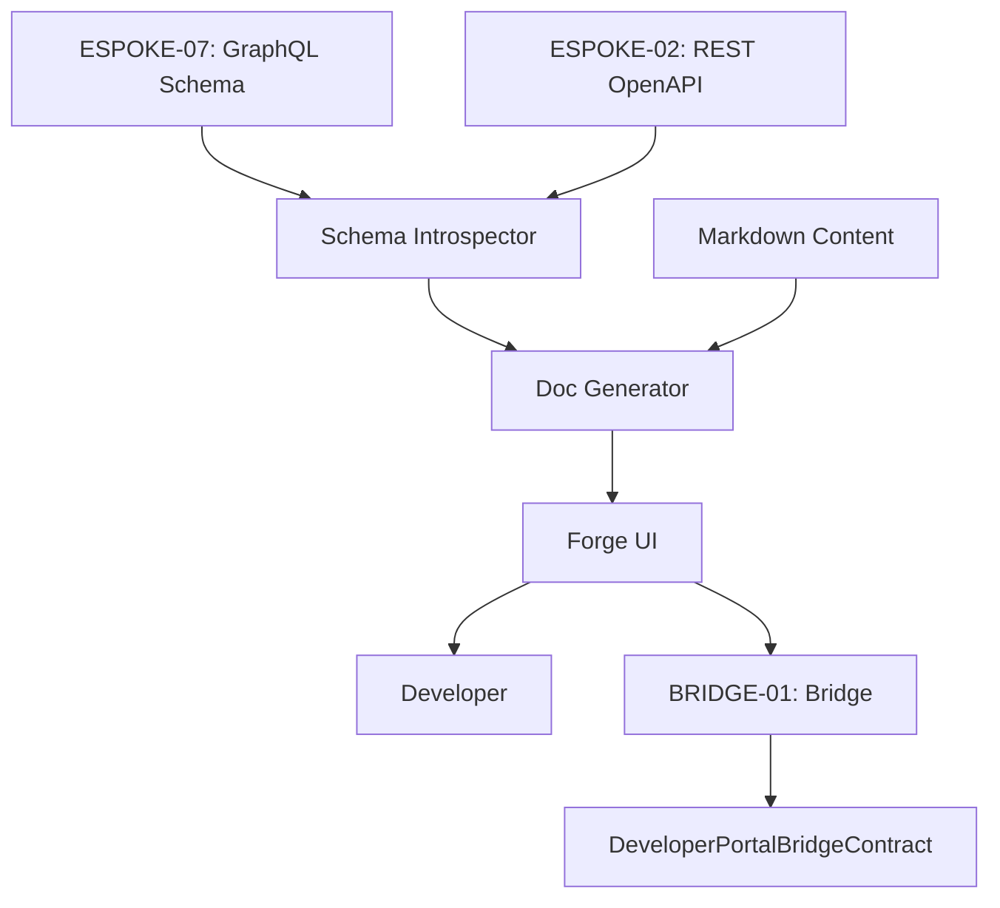

# PHASE ESPOKE-12: Developer-Facing Public API Documentation Portal

## Tier
External Spoke (Public-facing Application)

## Resolves
Cross-references checked against `01_MASTER_INDEX.md` §3 — clean, no correction needed. Adds stated
benchmark methodology (Finding 10).

## Component Name
Sovereign Forge (Dev Portal) — **External Spoke**; distinct from `ISPOKE-11`'s "Sovereign Forge
(Sandbox)" — two different components share the "Forge" name across tiers, same disambiguation note as
`ISPOKE-13`/`14`/`ESPOKE-07`/`10`.

## Description
Primary destination for developers building on the Sovereign Stack: hosts documentation for both the
Public REST API (`ESPOKE-02`) and GraphQL API (`ESPOKE-07`), interactive "Try it now" environments, SDK
links, API key management.

## Sequencing Rationale
Must follow `ESPOKE-02` (REST) and `ESPOKE-07` (GraphQL) — consumes their schemas and metadata.

## Build Status
🔴 **Blocked** on `HUB-24`, `HUB-08`, `HUB-26`, `HUB-04` — none implemented.

## Dependency Status
- **Direct Hub:** `HUB-24`, `HUB-08`, `HUB-26`, `HUB-04`, `HUB-15`. *(Verified — correct.)*
- **Transitive Core:** `CORE-11`, `CORE-12`, `CORE-18`, `CORE-14`.

## Architectural Design
- **SchemaIntrospector** — fetches the unified GraphQL schema from `ESPOKE-07` and OpenAPI spec from
  `ESPOKE-02`.
- **DocGenerator** — transforms schemas/Markdown into a searchable documentation site.
- **SandboxManager** — interactive UI for executing authenticated requests against the public APIs.
- **DeveloperConsole** — dashboard for managing public API keys/webhooks.

### Documentation Generation Flow


## Interface Contracts

```php
namespace SovereignStack\External\Forge\Contracts;

use SovereignStack\Bridge\Contracts\BoundaryContractInterface;

interface DeveloperPortalBridgeContract extends BoundaryContractInterface
{
    public function manageApiKey(string $developerId, string $action): array;
    public function getApiUsage(string $developerId): array;
}
```

## Integration Strategy
- **Dynamic Discovery:** uses `HUB-15` service discovery to find active GraphQL/REST endpoints for
  fresh schema pulls.
- **Bridge Compliance:** developer API keys/quotas managed via `DeveloperPortalBridgeContract`.
- **UI Consistency:** "Developer" theme of `HUB-26` (high-contrast code blocks, sidebar navigation).
- **Security:** "Sandbox" uses the developer's actual API keys (via `HUB-04` session) for real Gateway
  calls, tagged distinctly from production traffic.

## Benchmark & Verification Methodology
| Target | Method |
|---|---|
| Doc synchronization | Integration test: register a schema change in `ESPOKE-02`/`ESPOKE-07`; measure and report actual propagation time to the doc site, don't restate "within 60 seconds" unmeasured (Finding 10). |
| Sandbox isolation | Integration test: execute a sandbox request; assert the corresponding `HUB-06` audit entry is tagged "Portal Sandbox," distinguishable from real developer traffic in the same audit query. |
| Performance | State environment before citing "< 500ms for >100 types" — measure against a real large-schema fixture. |

## CI Verification Criteria
- Sandbox-tagging test (above), blocking — this is what makes sandbox traffic auditable separately
  from production, a requirement the original stated but didn't specify how to verify.
- Doc-sync propagation measured and reported with environment stated.
- Large-schema render time measured against a real fixture and reported.

## SemVer Impact
**Minor.** Improves developer experience and platform adoption.
