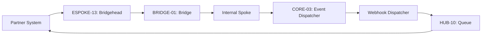

# PHASE ESPOKE-13: Partner and Third-Party Integration Gateway

## Tier
External Spoke (Public-facing Application)

## Resolves
Corrects three patterns in one file (`01_MASTER_INDEX.md` §3): `CORE-09: Cryptography & Hashing` →
`CORE-16` (Pattern A). `HUB-14: Distributed Task Queue` → real `HUB-14` is Search; the actual Queue is
`HUB-10` (Pattern C — note this file used yet a *third* wrong ID for "Queue," after `HUB-11` elsewhere,
confirming the underlying confusion isn't anchored to one specific wrong number). `CORE-07: Event
Dispatcher` → real `CORE-07` is SuperPHP Lexer; Event Dispatcher is `CORE-03` (Pattern F).

## Component Name
Sovereign Bridgehead (Partner Gateway)

## Description
Specialized gateway for high-priority partner integrations and third-party webhooks: dedicated
endpoints, custom auth for legacy partner systems, outbound webhook dispatch for Sovereign Stack
events.

## Sequencing Rationale
Depends on `ESPOKE-12` (Developer Portal) for API key management and `ESPOKE-02` (REST API) for base
routing patterns.

## Build Status
🔴 **Blocked** on `HUB-08`, `HUB-06`, `HUB-10`, `HUB-04` — none implemented.

## Dependency Status — corrected
- **Direct Hub:** `HUB-08`, `HUB-06`, ~~`HUB-14: Distributed Task Queue`~~ → **`HUB-10: Queue & Job
  Dispatcher`**, `HUB-04`, `HUB-15`.
- **Transitive Core:** ~~`CORE-09: Cryptography & Hashing`~~ → **`CORE-16: Binary Encryption
  Envelope`**, `CORE-18`, `CORE-04`, ~~`CORE-07: Event Dispatcher`~~ → **`CORE-03: PSR-14 Event
  Dispatcher`**.

## Architectural Design
- **PartnerAuthManager** — specialized auth strategies (mTLS, custom header signatures) for specific
  partner contracts.
- **WebhookDispatcher** — consumes internal events (via `CORE-03`), pushes them to registered external
  partner URLs via `HUB-10`.
- **PayloadTransformer** — normalizes incoming partner data into Sovereign-safe DTOs before the Bridge.
- **CircuitBreaker** — protects the Stack from slow/failing partner endpoints during delivery, same
  pattern as `HUB-08.md`'s shared circuit-breaker design.

### Partner Integration Diagram


## Interface Contracts

```php
namespace SovereignStack\External\Bridgehead\Contracts;

use SovereignStack\Bridge\Contracts\BoundaryContractInterface;

interface PartnerIntegrationBridgeContract extends BoundaryContractInterface
{
    public function ingestPartnerData(string $partnerId, array $payload): array;
    public function registerWebhook(string $partnerId, string $url, array $events): void;
}
```

## Integration Strategy
- **Bridge Compliance:** all partner data ingestion passes through `PartnerIntegrationBridgeContract`.
- **Webhook Security:** outbound webhooks signed with HMAC-SHA256 using a partner-specific secret
  managed via `CORE-16`.
- **Isolation:** partner traffic isolated from standard public API traffic via dedicated `HUB-08`
  route groups.
- **Retry Logic:** exponential backoff for failed deliveries using `HUB-10`'s dead-letter pattern (see
  `HUB-10.md` → `docs/queue-patterns/dead-letter-handling.md`), not a bespoke retry mechanism.

## Benchmark & Verification Methodology
| Target | Method |
|---|---|
| Signature verification | Integration test: every outbound webhook fixture asserted to carry a valid `X-Sovereign-Signature` header verifiable against the `CORE-16` key. |
| Circuit breaking | Integration test: simulate 5 consecutive partner-endpoint failures; assert the breaker opens and the 6th attempt fails fast without a network call. |
| Payload sanitization | Integration test: submit a partner payload with extra, non-contract fields; assert they're stripped at the Bridge, verified by inspecting what actually reaches the Internal tier. |
| Queue routing | Integration test asserting `WebhookDispatcher` actually enqueues via `HUB-10`, not the mislabeled `HUB-14` — verifies the Pattern C fix. |

## CI Verification Criteria
- Signature-verification test, blocking.
- Circuit-breaking 5-failure test, blocking.
- Payload-sanitization test, blocking.
- Queue-routing test (above), blocking.

## SemVer Impact
**Minor.** Enables deep integration with the external business ecosystem.
