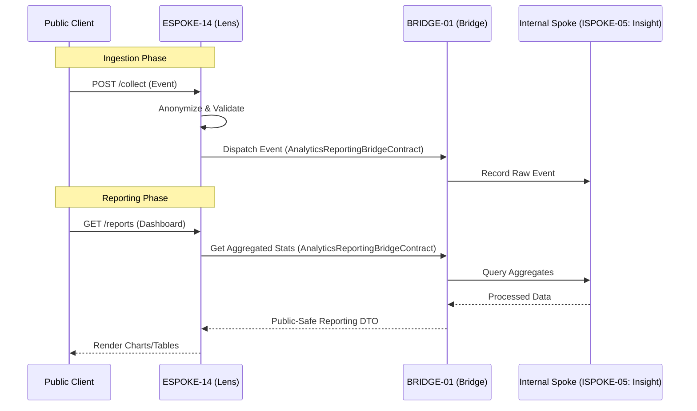

# PHASE ESPOKE-14: Public Analytics and Reporting Endpoint

## Tier
External Spoke (Public-facing Application)

## Resolves
Corrects Pattern A and Pattern H (`01_MASTER_INDEX.md` §3, Finding 15): `CORE-09: Cryptography &
Hashing` → `CORE-16`. This file's "uses the reporting patterns established in `ISPOKE-14` (Internal
Analytics)" and its diagram's `ISPOKE-14: Insight` participant are both wrong — the real `ISPOKE-14` is
"Sovereign Nexus (Tenancy)," a multi-tenancy admin console with no analytics function. The actual
internal analytics counterpart is `ISPOKE-05` ("Sovereign Insight"). This is the mirror image of
`ESPOKE-09`/`10`'s bug (which pointed at `ISPOKE-05` when meaning Billing) — between the three files,
every plausible wrong pairing of `{05, 13, 14}` × `{Insight, Ledger, Nexus}` was used somewhere except
the correct one.

## Component Name
Sovereign Lens (Analytics)

## Description
Dual-purpose analytics engine: an ingestion endpoint for public client events (clicks, views,
conversions) and a reporting interface for authenticated customers to view their own performance
metrics. Bridges raw public activity and processed internal reporting data.

## Sequencing Rationale
Depends on almost all other External Spokes — it collects data from them. Uses reporting patterns
established in `ISPOKE-05` (corrected from `ISPOKE-14`).

## Build Status
🔴 **Blocked** on `HUB-08`, `HUB-02`, `HUB-26`, `HUB-06` — none implemented. Also implicitly depends on
`ISPOKE-05`'s own `HUB-31` (pending) dependency for the deepest reporting features, though this Spoke's
own ingestion endpoint does not.

## Dependency Status — corrected
- **Direct Hub:** `HUB-08`, `HUB-02`, `HUB-26`, `HUB-06`, `HUB-15`.
- **Transitive Core:** ~~`CORE-09: Cryptography & Hashing`~~ → **`CORE-16: Binary Encryption
  Envelope`** (anonymization/salting), `CORE-18`, `CORE-14`, `CORE-11`.

## Architectural Design
- **EventIngestor** — high-throughput, low-latency endpoint for JSON analytics payloads.
- **AnonymizationLayer** — strips PII, salts identifiers using `CORE-16` before internal storage.
- **MetricAggregator** — consumes raw events, updates real-time counters in `HUB-02`.
- **ReportingPresenter** — customer-facing dashboard via `HUB-26` visualization components.

### Analytics Ingestion & Reporting Flow


## Interface Contracts

```php
namespace SovereignStack\External\Lens\Contracts;

use SovereignStack\Bridge\Contracts\BoundaryContractInterface;

interface AnalyticsReportingBridgeContract extends BoundaryContractInterface
{
    public function dispatchEvent(array $anonymizedData): void;
    public function getCustomerReport(string $customerId, string $reportType, array $params): array;
}
```

## Integration Strategy
- **Bridge Compliance:** raw event ingestion and reporting queries strictly mediated by
  `AnalyticsReportingBridgeContract`, backed by `ISPOKE-05` (corrected from `ISPOKE-14`).
- **Privacy First:** no raw IP addresses or user-agent strings cross the Bridge — anonymized within
  `ESPOKE-14` first.
- **Visualization:** `HUB-26` primitives for SVG charts/data tables.
- **Buffering:** high-volume ingestion buffered in `HUB-02` before flushing to the Bridge in batches.

## Benchmark & Verification Methodology
| Target | Method |
|---|---|
| Anonymization | Test payload containing email, name, raw IP; assert none present in the `anonymizedData` sent to the Bridge. |
| Ingestion latency | Integration test measuring actual `/collect` response time on a stated environment, don't restate "< 10ms" unmeasured (Finding 10). |
| Data isolation | Integration test: fetch Customer A's aggregated report using Customer B's session; assert denial. |
| Routing correction | Integration test asserting `getCustomerReport()` actually queries `ISPOKE-05`, not the mislabeled `ISPOKE-14` — verifies the Pattern H fix. |

## CI Verification Criteria
- Anonymization test, blocking.
- Cross-customer data-isolation test, blocking.
- Routing-correction test (above), blocking.
- Ingestion latency measured and reported with environment stated.

## SemVer Impact
**Minor.** Provides transparency and data-driven insights to the public ecosystem.
