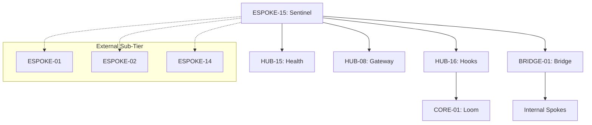

# PHASE ESPOKE-15: External Spoke Orchestration and Health Reporting Layer

## Tier
External Spoke (Management & Orchestration)

## Resolves
Corrects Pattern F and Pattern G (`01_MASTER_INDEX.md` §3), completing the External Spoke tier's
ID-correction pass: `CORE-07: Event Dispatcher` → real `CORE-07` is SuperPHP Lexer; Event Dispatcher is
`CORE-03`. `CORE-15: Process Management` → dropped; no such phase exists anywhere in the real 20-item
Core tier (`CORE-15` is actually Cache Abstraction), and this Spoke's described need (worker/health
monitoring) is already covered by `HUB-15`, which it already correctly depends on — the reference
wasn't pointing at a real gap, just a redundant, fictional dependency.

## Component Name
Sovereign Sentinel (External Orchestrator)

## Description
Final phase of the External Spoke sub-tier: an internal orchestration and health-reporting layer
governing the entire public-facing sub-tier — monitors lifecycle, deployment state, and operational
health of all External Spokes (`ESPOKE-01`–`14`), reporting to `CORE-01` and `HUB-16`.

## Sequencing Rationale
The final phase — must be last, since its purpose is to oversee the completed External sub-tier.

## Build Status
🔴 **Blocked** on `HUB-16`, `HUB-15`, `HUB-08`, `HUB-06` — none implemented. `CORE-01` (Loom) is
already real, per `02_EXEMPLARS/CORE-01.md` — this Spoke's upward-reporting integration can be designed
against real code today, same situation as `HUB-16`.

## Dependency Status — corrected
- **Direct Hub:** `HUB-16`, `HUB-15`, `HUB-08`, `HUB-06`. *(Verified — correct.)*
- **Transitive Core:** `CORE-01` (real, implemented), `CORE-18`, `CORE-02`, ~~`CORE-07: Event
  Dispatcher`~~ → **`CORE-03: PSR-14 Event Dispatcher`** (also real, implemented — see
  `packages/core/event-dispatcher/`), ~~`CORE-15: Process Management`~~ → **dropped**.

## Architectural Design
- **SubTierController** — coordinates deployment/rollout strategies (Blue/Green, Canary) for all
  External Spokes.
- **HealthAggregator** — consumes `HUB-15` metrics specific to the External sub-tier, calculates
  "Fleet Health."
- **TrafficGovernor** — interacts with `HUB-08` to shed load or redirect traffic during sub-tier
  maintenance/failure.
- **SentinelBridgeAgent** — monitors health of cross-tier contracts via the Bridge.

### External Orchestration Diagram


## Interface Contracts

```php
namespace SovereignStack\External\Sentinel\Contracts;

use SovereignStack\Bridge\Contracts\BoundaryContractInterface;

interface ExternalOrchestrationBridgeContract extends BoundaryContractInterface
{
    public function notifyDeployment(string $spokeId, string $version, string $status): void;
    public function syncMaintenanceMode(bool $active): void;
}
```

## Integration Strategy
- **Bridge Compliance:** reports sub-tier health/deployment status via
  `ExternalOrchestrationBridgeContract` — never directly manipulates internal service states.
- **Upward Reporting:** acts as a "Sub-tier Delegate" for `CORE-01` — when Loom asks for External-tier
  status, Sentinel provides the aggregated response, using `CORE-01`'s real
  `CIMonitor::registerRepo()`/status-reporting contract from `CORE-01.md`, not a placeholder API.
- **Gateway Control:** on critical ESPOKE failure, signals `HUB-08` to disable affected routes or
  serve a graceful "Service Unavailable" page.
- **Automation:** integrated with `HUB-16` to automate stale cache/asset cleanup during deployment.

## Benchmark & Verification Methodology
| Target | Method |
|---|---|
| Aggregation logic | Integration test: force a "CRITICAL" status in one fixture ESPOKE; assert `HealthAggregator`'s overall Fleet Health degrades accordingly, not just the individual Spoke's own status. |
| Traffic interception | Integration test: trigger `TrafficGovernor`; assert `HUB-08` actually blocks traffic to the specified Spoke, verified by a subsequent request assertion, not just the signal being sent. |
| Zero-Node check | Static scan of the entire orchestration codebase: no `package.json`, no `node_modules`, no `shell_exec` referencing `node`/`npm`. |
| Upward reporting | Integration test asserting Sentinel's status report actually flows through the real `CORE-01` `CIMonitor` contract — this can be tested today since `CORE-01` is implemented, unlike most of this Spoke's other dependencies. |

## CI Verification Criteria
- Aggregation-degradation test, blocking.
- Traffic-interception-actually-blocks test, blocking.
- Zero-Node static scan, blocking.
- Upward-reporting test against the real `CORE-01`, blocking — buildable now.

## SemVer Impact
**Major.** Completes the Sovereign Stack and provides the final operational guardrail for the public
interface.
