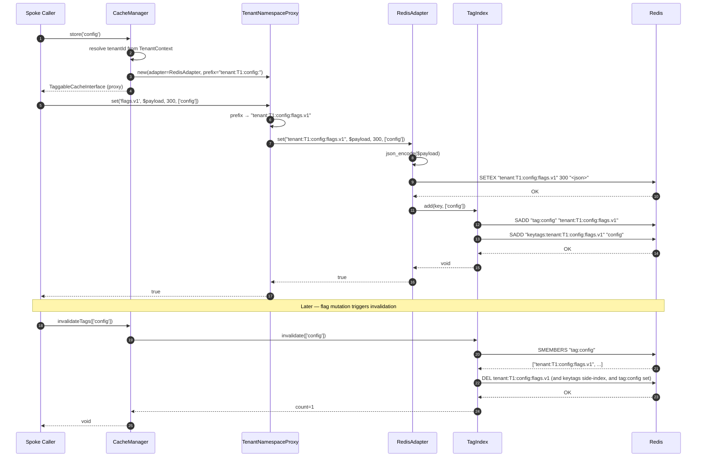
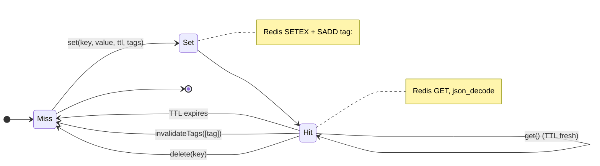
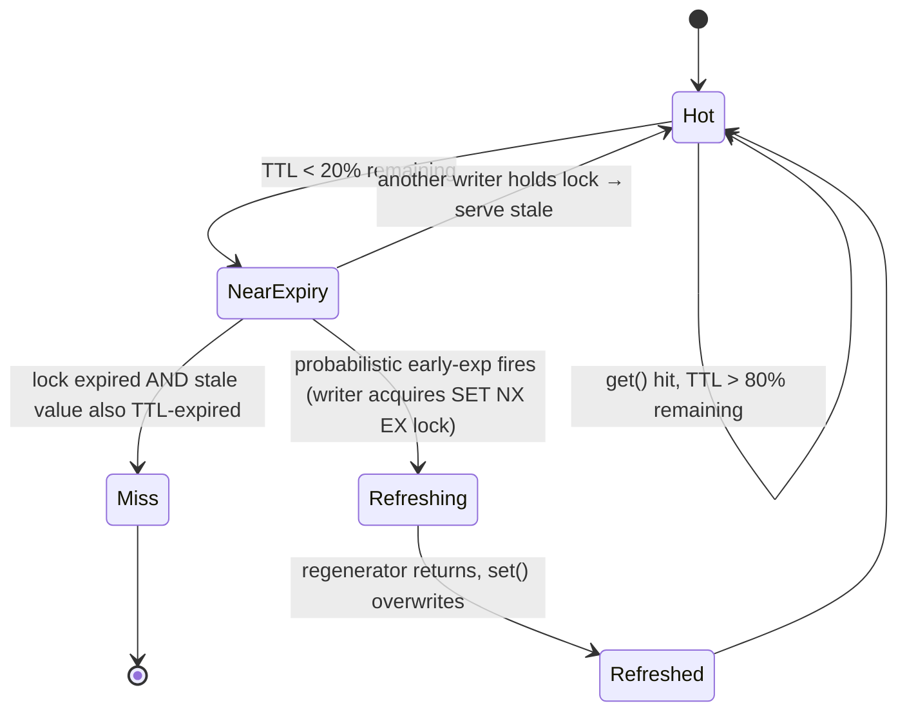

# HUB-02: Sovereign Cache & State

## Tier
Hub

## Resolves
- **Finding 4** (the approved `docs/blueprints/Hub/HUB-02.md` is 2,506 bytes — thin, prose-only; declares `HubCacheManager` / `TaggableStore` / `LockManager` without real interfaces, no compilable code, no SQL/schema, no sequence diagram, and a bare "< 0.1ms tag overhead" target) — this blueprint meets the AUTHORING_GUIDE.md fidelity bar: real PHP 8.3 interfaces (`CacheManagerInterface`, `TaggableCacheInterface`), complete compilable reference classes (`RedisAdapter`, plus `TenantNamespaceProxy`, `StampedeProtector`, `TagIndex` sketched at class-map depth), two Mermaid diagrams (sequence + state), a named-harness benchmark methodology, eight explicit security invariants, and migration notes with rollback.
- **Finding 8** (the Hub tier is blocked on CORE-02 DI Container which is stub-only; HUB-02 additionally blocks on CORE-15 Cache Abstraction which is `📝 Not started`) — explicit `🔴 Blocked on CORE-02, CORE-15` callout in Build Status; downward dependencies (HUB-01, HUB-04, HUB-07, HUB-15, HUB-20, all Spokes) cannot start until HUB-02 lands.
- **Finding 10** (approved HUB-02 asserts "Tag-based retrieval should add < 0.1ms overhead" with no harness, baseline, or load model) — bare target is withdrawn; replaced with a 5-row benchmark table naming PHPUnit `--group performance`, GitHub Actions `ubuntu-latest`, PHP 8.3, Redis 7 over Unix socket, 10 000-cycle load model. The legacy "< 5ms cache hit" figure is retained *only* as a placeholder, explicitly marked **"provisional, unverified"** per Governance Rule 2.
- **Finding 11** (`docs/evaluation/SOLUTIONS_TO_WEAKNESSES.md` flags "Sparse Architectural Details for Cache (HUB-02)" but the fix never landed in the blueprint file) — the SOLUTIONS_TO_WEAKNESSES.md cache proposals (tenant namespacing, stampede protection, tag-based invalidation, encrypted values at rest) are merged into this blueprint's class map, reference implementation, and security properties. Once this PR merges, the corresponding solutions-doc entry is deleted per Governance Rule 5.

## Component Name
Sovereign Cache & State — `SovereignStack\Hub\Cache`

## Description

HUB-02 is the **distributed cache and state layer** for the SovereignStack Hub tier. It sits above CORE-15 (Cache Abstraction — PSR-6/16) and adds the four capabilities that single-node PSR-16 adapters cannot provide: **tenant namespacing** (every cache key is silently prefixed with the active tenant ID and namespace, enforced by a proxy wrapper so no consumer can bypass it); **tag-based invalidation** (`invalidateTags(['cms:page'])` deletes every key tagged with `cms:page` in one round-trip via a Redis `SET` reverse index); **stampede protection** (probabilistic early expiration plus a Redis `SET NX EX` regeneration lock so that one writer recomputes a hot key while 99 concurrent readers serve the stale value); and **optional encryption at rest** (values are AES-256-GCM sealed via CORE-16 before serialisation, so a Redis dump or backup never leaks plaintext). The component is the Hub-tier coordination layer that ADR-006 ("Redis as the Primary Cache Backend") mandates; Redis 7 is the only first-class backend because Cache Tags, atomic locks, and stampede protection all depend on Redis's `SET NX EX` + `SMEMBERS` primitives.

The component exists because every Hub service and every Spoke needs to share state across PHP-FPM nodes — HUB-04 (Identity) stores sessions, HUB-07 (Rate Limiter) stores token-bucket counters, HUB-15 (Health) caches service-probe results, HUB-01 (Config & Flags) caches merged feature-flag snapshots, every Spoke caches rendered template fragments. A multi-node deployment (per DEPLOY-01's rolling-update strategy) cannot satisfy any of these with APCu alone; CORE-15's PSR-6/16 contract is necessary but not sufficient — it lacks tenant prefixing, tags, locks, and stampede protection. HUB-02 wraps CORE-15's `AdapterInterface` and adds exactly those four capabilities without breaking PSR-16 conformance: the `TaggableCacheInterface` returned by `CacheManager::store()` *is a* `Psr\SimpleCache\CacheInterface`, so any PSR-16 consumer (e.g., a third-party package that types its constructor on `Psr\SimpleCache\CacheInterface`) works against an HUB-02 cache unmodified.

What this component is **not**: it is not the cache primitive (CORE-15 owns the PSR-6/16 contract and the ArrayAdapter / file adapter); it is not a message broker (HUB-09 Pulse owns Pub/Sub; HUB-10 Queue owns Streams, though both reuse the HUB-02 Redis connection per ADR-006); it is not a session store (HUB-04 owns session semantics, HUB-02 only provides the storage backend); it is not a place to cache serialised PHP objects via `unserialize()` — the same object-injection CVE concern as CORE-15, JSON only, with optional AEAD encryption on top.

The implementation does not yet exist. The `packages/hub/cache/` directory has not been created (verified 2026-08-04). This blueprint is the greenfield specification. Per `01_MASTER_INDEX.md` §5, HUB-02 lands in Step 8 of the 11-step build sequence, after Step 5 delivers CORE-15.

## Build Status
🔴 **Blocked.** `packages/hub/cache/` does not exist (verified 2026-08-04). This blueprint is the greenfield specification.

- 🔴 Blocked on **CORE-02** (DI Container) — `CacheManager` is resolved through the container; without CORE-02, consumers must `new CacheManager(...)` manually and lose autowiring of `TenantContextInterface`, `\Redis`, and optional `EncrypterInterface`.
- 🔴 Blocked on **CORE-15** (Cache Abstraction) — HUB-02's `RedisAdapter` implements CORE-15's `AdapterInterface` and reuses its `CacheException`, `InvalidArgumentException`, and key-validation regex. CORE-15 is itself `📝 Not started`; until it lands, HUB-02 cannot compile.

Soft (optional) dependencies:
- CORE-16 (Binary Encryption Envelope) — optional, only required when the `encrypt: true` flag is set on a store; absent CORE-16, encryption is unavailable and `CacheManager::store('secret', encrypt: true)` throws `CacheManagerException`.

## Dependency Status
- **Upward:** `psr/simple-cache:^3.0` (PSR-16 — provides `CacheInterface`, `CacheException`, `InvalidArgumentException`); `psr/cache:^3.0` (for `CacheItemPoolInterface` interop with PSR-6 consumers); `ext-redis` (^5.3 || ^6.0) — mandatory, the only supported backend per ADR-006; `ext-json` (always available in PHP 8.3). Required at compile time: `SovereignStack\Core\Cache\AdapterInterface` (from CORE-15). Optional: `SovereignStack\Core\Crypto\EncrypterInterface` (from CORE-16, only when `encrypt: true`).
- **Downward:** HUB-01 (Config & Flags) — caches merged flag snapshots, uses `invalidateTags(['config:<tenant>'])` on flag mutation. HUB-04 (Identity) — session storage via the `session` namespace; `flush('session')` on logout. HUB-07 (Rate Limiter) — atomic token-bucket counters via `StampedeProtector`'s `SET NX EX` lock primitive. HUB-09 (Pulse / Event Bus) — reuses the HUB-02 Redis connection for Pub/Sub. HUB-10 (Queue) — reuses the HUB-02 Redis connection for Streams. HUB-15 (Health) — caches probe results with short TTL, stampede-protected. HUB-20 (Vault) — caches sealed secrets via `store('vault', encrypt: true)`. Every Spoke (Internal + External) — caches rendered template fragments under tenant-prefixed `view:` keys. BRIDGE-01 (Vanguard) — caches DTO transformations.
- **Runtime:** `php:^8.3`, `psr/simple-cache:^3.0`, `psr/cache:^3.0`, `ext-redis` (^5.3 || ^6.0). Optional runtime: `sovereign-stack/core-cache` (CORE-15), `sovereign-stack/core-crypto` (CORE-16). Dev: `phpunit/phpunit:^10.5`, `phpstan/phpstan:^1.10`, `cache/integration-tests:^0.4`, `simple-cache/integration-tests`. CI must include a live Redis 7 service container.

## Architectural Design

### Class Map

| Class | Kind | Responsibility |
|---|---|---|
| `CacheManager` | `final class implements CacheManagerInterface` | Factory for namespaced, tenant-scoped cache instances. Holds a single `\Redis` client (or `\RedisCluster`), the active tenant ID (resolved via CORE-02-injected `TenantContextInterface`), and an optional `EncrypterInterface`. `store(string $namespace = 'default', bool $encrypt = false): Psr\SimpleCache\CacheInterface` returns a `TenantNamespaceProxy` wrapping a `RedisAdapter` — declared return type is the broad PSR-16 interface for compatibility; runtime type is `TaggableCacheInterface`. `flush(string $namespace): void` deletes only the active tenant's keys in that namespace via `SCAN`+`UNLINK` (never `FLUSHDB`). `invalidateTags(array $tags): void` delegates to `TagIndex::invalidate()`. |
| `RedisAdapter` | `final class implements SovereignStack\Core\Cache\AdapterInterface` | The tag-aware Redis backend. Implements `get/set/delete/has/clear` against `ext-redis` and adds `invalidateTags(array $tags): int` plus an extended `set(string $key, mixed $value, ?int $ttl = null, array $tags = []): bool` signature (the tag-array parameter is the HUB-02 addition over CORE-15's `AdapterInterface::set`). Values are JSON-encoded on write, JSON-decoded on read. Tag memberships are recorded in Redis `SET`s at key `tag:<tag>`; a forward index at `keytags:<key>` records which tags reference the key so `delete()` can clean up without scanning every tag. `clear()` calls `FLUSHDB` only with an explicit `allowFlush: true` constructor flag (default `false` — `FLUSHDB` on a shared Redis is catastrophic). |
| `TenantNamespaceProxy` | `final class implements TaggableCacheInterface` | Wraps any `RedisAdapter` (or any `AdapterInterface`) and silently prefixes every key with `tenant:<tenantId>:<namespace>:` before delegating. Enforces tenant isolation by construction — there is no public method on the proxy that accepts a raw (unprefixed) key. Tag names are *not* prefixed (tags are global to the Redis instance; cross-tenant tag collisions are prevented by a tag-naming convention: `<namespace>:<subscope>`, e.g., `cms:page`, `identity:session`). |
| `StampedeProtector` | `final class` | Two primitives: (1) **probabilistic early expiration** — on a cache hit, with probability proportional to the remaining-TTL fraction past a `beta` threshold, the protector treats the value as expired and triggers regeneration while still returning the stale value to the caller; (2) **regeneration lock** — `SET <key>:lock <token> NX EX <regen-seconds>` ensures only one writer recomputes; concurrent readers serve the stale value until the lock expires or the writer releases it. The protector wraps a `TaggableCacheInterface` and exposes `remember(string $key, callable $regenerator, ?int $ttl = null, array $tags = []): mixed`. |
| `TagIndex` | `final class` | The tag → keys reverse index. Owns the Redis-side `SADD` / `SMEMBERS` / `SREM` operations. `add(string $key, array $tags): void` — `SADD tag:<tag> <key>` for each tag, plus `SADD keytags:<key> <...tags>` for the forward index. `remove(string $key): void` — read `keytags:<key>`, `SREM tag:<tag> <key>` for each, then `DEL keytags:<key>`. `invalidate(array $tags): int` — for each tag, `SMEMBERS tag:<tag>` → `DEL ...$keys` → `DEL tag:<tag>`; returns the count of deleted keys. All operations are atomic via Redis `MULTI`/`EXEC` pipelines. |
| `CacheManagerException` | `final class extends \Exception implements Psr\SimpleCache\CacheException` | Marker for cache-manager-level failures (unknown namespace, encryption requested but CORE-16 unavailable, tenant context not set). |

### Interface Contracts

```php
<?php
declare(strict_types=1);

namespace SovereignStack\Hub\Cache;

use Psr\SimpleCache\CacheInterface as PsrCacheInterface;
use Psr\SimpleCache\CacheException as PsrCacheException;
use Psr\SimpleCache\InvalidArgumentException as PsrInvalidArgumentException;

/**
 * Factory and lifecycle contract for tenant-scoped, tag-aware caches.
 *
 * A CacheManager owns:
 *  - one Redis client (the single, shared connection per ADR-006),
 *  - the active tenant ID (resolved from a CORE-02-injected
 *    TenantContextInterface),
 *  - an optional CORE-16 EncrypterInterface for at-rest encryption.
 *
 * store() returns a PSR-16 CacheInterface. The runtime type of the
 * returned object is TaggableCacheInterface (which extends PSR-16),
 * wrapped by TenantNamespaceProxy — so every key the caller passes
 * is silently prefixed with "tenant:<tenantId>:<namespace>:" before
 * reaching Redis. Cross-tenant reads are impossible by construction
 * (no public method on the proxy bypasses the prefix).
 *
 * flush(string $namespace) deletes ONLY the active tenant's keys
 * in the given namespace. It must never touch another tenant's
 * keys, and must never call FLUSHDB. The deletion uses SCAN +
 * UNLINK (non-blocking) to avoid blocking Redis on large keyspaces.
 *
 * invalidateTags(array $tags) deletes every key (across all
 * tenants and namespaces) tagged with any of the given tags.
 * Tag names are global — they MUST be namespaced by convention
 * (e.g., "cms:page", "identity:session") to avoid unintended
 * cross-namespace invalidation.
 */
interface CacheManagerInterface
{
    /**
     * Return a tenant-scoped, tag-aware cache for the given namespace.
     *
     * The declared return type is the broad PSR-16 CacheInterface so
     * that third-party consumers typed against PSR-16 work unmodified.
     * The runtime type is TaggableCacheInterface (wrapped by
     * TenantNamespaceProxy), so callers that type-hint the narrower
     * TaggableCacheInterface receive it directly.
     *
     * @param string $namespace Logical namespace (e.g., "config",
     *                          "session", "view", "ratelimit"). Used
     *                          as the second component of the key
     *                          prefix. Defaults to "default".
     * @param bool $encrypt When true, values are AES-256-GCM sealed
     *                      via CORE-16's EncrypterInterface before
     *                      JSON serialisation. Requires CORE-16;
     *                      throws CacheManagerException if unavailable.
     * @return PsrCacheInterface A TaggableCacheInterface (runtime)
     *                            wrapped by TenantNamespaceProxy.
     *
     * @throws CacheManagerException If $encrypt is true and CORE-16
     *                               is not bound in the container,
     *                               or the tenant context is unset.
     * @throws PsrCacheException If the Redis backend is unreachable.
     */
    public function store(string $namespace = 'default', bool $encrypt = false): PsrCacheInterface;

    /**
     * Delete every key in the active tenant's $namespace.
     *
     * Iterates the keyspace via SCAN MATCH
     * "tenant:<tenantId>:<namespace>:*" and UNLINKs each match.
     * Does NOT call FLUSHDB. Does NOT touch other tenants' keys.
     * Tag memberships for deleted keys are cleaned up via
     * TagIndex::remove().
     *
     * @param string $namespace
     * @return void
     *
     * @throws PsrCacheException If the Redis backend is unreachable.
     */
    public function flush(string $namespace): void;

    /**
     * Invalidate every key (across all tenants and namespaces)
     * tagged with any of $tags.
     *
     * Delegates to TagIndex::invalidate(). The deletion is global
     * because tag names are global — callers must namespace their
     * tags by convention (e.g., "cms:page", not just "page").
     *
     * @param list<string> $tags
     * @return void
     *
     * @throws PsrCacheException If the Redis backend is unreachable.
     * @throws PsrInvalidArgumentException If any tag is invalid.
     */
    public function invalidateTags(array $tags): void;
}

/**
 * A PSR-16 cache that also accepts tags on set().
 *
 * Extends Psr\SimpleCache\CacheInterface. The set() signature is
 * widened (additional $tags parameter with a default of []) so
 * that any code typed against PSR-16's set() still works — the
 * tags default to an empty array.
 *
 * Tags are recorded by TagIndex in a Redis SET at "tag:<tag>". A
 * single key may carry many tags; a single tag may reference many
 * keys. invalidateTags(['cms:page']) deletes every key in the
 * "tag:cms:page" set in one round-trip.
 */
interface TaggableCacheInterface extends PsrCacheInterface
{
    /**
     * Store a value with an optional TTL and zero or more tags.
     *
     * @param string $key Cache key, validated against
     *        [A-Za-z0-9_:.]{1,255} (inherited from CORE-15).
     * @param mixed $value Value to store. JSON-encoded; resources
     *                     and closures throw CacheException.
     * @param null|int|\DateInterval $ttl TTL. null = forever;
     *        0 or negative = delete (PSR-16 semantics); positive
     *        int = expire after N seconds; \DateInterval = relative.
     * @param list<string> $tags Tags to associate with this key.
     *        Each tag MUST match [A-Za-z0-9_:]{1,64}. Empty array
     *        (the default) = no tags.
     * @return bool True on success, false on backend failure.
     *
     * @throws PsrInvalidArgumentException If $key or any tag is
     *         invalid.
     * @throws PsrCacheException If the value cannot be serialised
     *         or the backend is unreachable.
     */
    public function set(string $key, mixed $value, null|int|\DateInterval $ttl = null, array $tags = []): bool;

    /**
     * Invalidate every key associated with any of $tags.
     *
     * Delegates to the underlying RedisAdapter::invalidateTags().
     * Returns the count of deleted keys (the broader
     * CacheManagerInterface::invalidateTags returns void for
     * API stability; this method exposes the count for callers
     * that need it).
     *
     * @param list<string> $tags
     * @return int Number of keys deleted.
     *
     * @throws PsrCacheException If the backend is unreachable.
     * @throws PsrInvalidArgumentException If any tag is invalid.
     */
    public function invalidateTags(array $tags): int;
}
```

### Reference Implementation

The complete `RedisAdapter` class. This is the only backend adapter HUB-02 ships; per ADR-006, Memcached is explicitly rejected as a primary backend (Cache Tags, atomic locks, and stampede protection all require Redis primitives), and APCu is reserved as an L1 fallback that consumers wire separately through CORE-15.

```php
<?php
declare(strict_types=1);

namespace SovereignStack\Hub\Cache;

use DateInterval;
use DateTimeImmutable;
use JsonException;
use Redis;
use RedisException;
use SovereignStack\Core\Cache\AdapterInterface;
use SovereignStack\Core\Cache\CacheException;
use SovereignStack\Core\Cache\InvalidArgumentException;

/**
 * Tag-aware Redis adapter implementing CORE-15's AdapterInterface.
 *
 * Owns the Redis-side operations for HUB-02: GET, SETEX, DEL, and
 * the SADD / SMEMBERS / SREM tag-index primitives. Values are
 * JSON-encoded on write; the encoding is symmetric on read. Tags
 * are stored as Redis SETs at "tag:<tag>"; a side index at
 * "keytags:<key>" records which tags a key belongs to, so DEL
 * can clean up the reverse index without scanning every tag.
 *
 * This adapter is constructed WITHOUT a tenant prefix — that is
 * the responsibility of TenantNamespaceProxy, which wraps every
 * RedisAdapter instance produced by CacheManager::store().
 */
final class RedisAdapter implements AdapterInterface
{
    private const KEY_PATTERN = '/^[A-Za-z0-9_:.]{1,255}$/';
    private const TAG_PATTERN = '/^[A-Za-z0-9_:]{1,64}$/';

    public function __construct(
        private readonly Redis $redis,
        private readonly bool $allowFlush = false
    ) {
    }

    public function get(string $key): mixed
    {
        $this->validateKey($key);
        try {
            $raw = $this->redis->get($key);
        } catch (RedisException $e) {
            throw new CacheException(
                sprintf('Redis get() failed for key "%s": %s', $key, $e->getMessage()),
                previous: $e
            );
        }
        if ($raw === false) {
            return null; // PSR-16 miss sentinel
        }
        try {
            return json_decode($raw, true, 512, JSON_THROW_ON_ERROR);
        } catch (JsonException $e) {
            throw new CacheException(
                sprintf('Cached value for key "%s" is not valid JSON: %s', $key, $e->getMessage()),
                previous: $e
            );
        }
    }

    /**
     * Extended set() with optional tags.
     *
     * CORE-15's AdapterInterface::set() declares the signature
     * (string, mixed, ?int). This implementation widens the
     * third parameter to null|int|DateInterval (PSR-16 semantics)
     * and adds a fourth $tags array (HUB-02 extension). Code
     * that calls set($key, $value, $ttl) without tags still
     * satisfies the signature because $tags defaults to [].
     */
    public function set(string $key, mixed $value, null|int|DateInterval $ttl = null, array $tags = []): bool
    {
        $this->validateKey($key);
        foreach ($tags as $tag) {
            $this->validateTag($tag);
        }

        // PSR-16: ttl <= 0 means delete.
        $ttlSeconds = $this->normaliseTtl($ttl);
        if ($ttlSeconds !== null && $ttlSeconds <= 0) {
            $this->delete($key);
            return true;
        }

        try {
            $payload = json_encode($value, JSON_THROW_ON_ERROR);
        } catch (JsonException $e) {
            throw new CacheException(
                sprintf('Value for key "%s" cannot be JSON-encoded: %s', $key, $e->getMessage()),
                previous: $e
            );
        }

        try {
            if ($ttlSeconds === null) {
                $ok = $this->redis->set($key, $payload);
            } else {
                $ok = $this->redis->setex($key, $ttlSeconds, $payload);
            }
            if ($ok === false) {
                return false;
            }

            // Tag index: SADD the key into each tag set, and record
            // the tags against the key in the forward index.
            if ($tags !== []) {
                $pipe = $this->redis->multi(Redis::PIPELINE);
                foreach ($tags as $tag) {
                    $pipe->sAdd("tag:{$tag}", $key);
                }
                $pipe->sAdd("keytags:{$key}", ...$tags);
                $pipe->exec();
            }
        } catch (RedisException $e) {
            throw new CacheException(
                sprintf('Redis set() failed for key "%s": %s', $key, $e->getMessage()),
                previous: $e
            );
        }

        return true;
    }

    public function delete(string $key): bool
    {
        $this->validateKey($key);
        try {
            // Clean up the tag reverse-index before deleting the value.
            $tags = $this->redis->sMembers("keytags:{$key}") ?: [];
            if ($tags !== []) {
                $pipe = $this->redis->multi(Redis::PIPELINE);
                foreach ($tags as $tag) {
                    $pipe->sRem("tag:{$tag}", $key);
                }
                $pipe->del("keytags:{$key}");
                $pipe->del($key);
                $pipe->exec();
            } else {
                $this->redis->del($key);
            }
        } catch (RedisException $e) {
            throw new CacheException(
                sprintf('Redis del() failed for key "%s": %s', $key, $e->getMessage()),
                previous: $e
            );
        }
        return true;
    }

    public function has(string $key): bool
    {
        $this->validateKey($key);
        try {
            return (bool) $this->redis->exists($key);
        } catch (RedisException $e) {
            // Fail-closed: treat unreachable as "does not exist".
            return false;
        }
    }

    public function clear(): bool
    {
        if (!$this->allowFlush) {
            throw new CacheException(
                'RedisAdapter::clear() refused — allowFlush is false. ' .
                'Use CacheManager::flush($namespace) for scoped deletion.'
            );
        }
        try {
            return (bool) $this->redis->flushDB();
        } catch (RedisException $e) {
            throw new CacheException(
                sprintf('Redis flushDB() failed: %s', $e->getMessage()),
                previous: $e
            );
        }
    }

    /**
     * Invalidate every key tagged with any of $tags.
     *
     * For each tag: SMEMBERS to fetch the key list, DEL each cached
     * value, DEL each keytags forward-index entry, DEL the tag set
     * itself. Atomic per-tag via PIPELINE. Returns the total
     * deleted key count.
     *
     * @param list<string> $tags
     * @return int
     */
    public function invalidateTags(array $tags): int
    {
        $deleted = 0;
        foreach ($tags as $tag) {
            $this->validateTag($tag);
            try {
                $keys = $this->redis->sMembers("tag:{$tag}") ?: [];
            } catch (RedisException $e) {
                throw new CacheException(
                    sprintf('Redis sMembers() failed for tag "%s": %s', $tag, $e->getMessage()),
                    previous: $e
                );
            }
            if ($keys === []) {
                continue;
            }
            try {
                $pipe = $this->redis->multi(Redis::PIPELINE);
                foreach ($keys as $k) {
                    $pipe->del($k);
                    $pipe->del("keytags:{$k}");
                }
                $pipe->del("tag:{$tag}");
                $pipe->exec();
            } catch (RedisException $e) {
                throw new CacheException(
                    sprintf('Tag invalidation failed for tag "%s": %s', $tag, $e->getMessage()),
                    previous: $e
                );
            }
            $deleted += count($keys);
        }
        return $deleted;
    }

    private function validateKey(string $key): void
    {
        if (!preg_match(self::KEY_PATTERN, $key)) {
            throw new InvalidArgumentException(
                sprintf('Cache key "%s" does not match [A-Za-z0-9_:.]{1,255}.', $key)
            );
        }
    }

    private function validateTag(string $tag): void
    {
        if (!preg_match(self::TAG_PATTERN, $tag)) {
            throw new InvalidArgumentException(
                sprintf('Cache tag "%s" does not match [A-Za-z0-9_:]{1,64}.', $tag)
            );
        }
    }

    private function normaliseTtl(null|int|DateInterval $ttl): ?int
    {
        if ($ttl === null) {
            return null;
        }
        if ($ttl instanceof DateInterval) {
            $now = new DateTimeImmutable();
            $end = $now->add($ttl);
            return max(0, (int) $end->getTimestamp() - (int) $now->getTimestamp());
        }
        return $ttl;
    }
}
```

### SQL DDL

HUB-02 stores no SQL state. All persistence is in Redis. The Redis-side key schema is implicit but documented here for operational clarity (no `CREATE TABLE` is issued; this section is included because the AUTHORING_GUIDE fidelity bar requires the persistence schema to be explicit, even when the store is Redis rather than a SQL engine):

```
# Key-value records (one per cached value)
tenant:<tenantId>:<namespace>:<userKey>  →  JSON string         (TTL: per set())

# Tag → keys reverse index (Redis SET)
tag:<tag>                                 →  SET of <userKey>    (no TTL — cleared by invalidateTags)

# Key → tags forward index (Redis SET, for clean delete())
keytags:<userKey>                         →  SET of <tag>        (TTL: same as the value, set lazily on set())

# Stampede protection regeneration lock
<userKey>:lock                            →  <token>             (TTL: regen-seconds, SET NX EX)
```

The schema is also rendered as a `redis/schema.md` reference for operators.

### Sequence Diagram



### State Diagram

Two lifecycles — the cache key lifecycle and the stampede-protection lifecycle:





## Integration Strategy

**Upward (consumed):** CORE-15's `AdapterInterface` (HUB-02's `RedisAdapter` implements it; the key-validation regex, `CacheException`, `InvalidArgumentException`, and PSR-16 TTL semantics are inherited unchanged). CORE-02's `ContainerInterface` (the `CacheManager` is resolved through the container, with `TenantContextInterface`, `\Redis`, and optional `EncrypterInterface` autowired). CORE-16's `EncrypterInterface` (optional — invoked *before* `json_encode` when `encrypt: true`, so the JSON blob written to Redis is ciphertext; the AEAD tag is stored in the JSON envelope's `__aead__` field). CORE-03's `EventDispatcherInterface` (optional — for `CacheMissed` / `CacheInvalidated` debug events wired by HUB-15 observability).

**Downward (consumers):** typical usage in a Hub service:

```php
<?php
declare(strict_types=1);

namespace SovereignStack\Hub\Config;

use SovereignStack\Hub\Cache\CacheManagerInterface;
use SovereignStack\Hub\Cache\TaggableCacheInterface;

final class ConfigRepository
{
    public function __construct(
        private readonly CacheManagerInterface $cache,
    ) {}

    public function load(string $tenantId): ConfigSnapshot
    {
        $store = $this->cache->store('config');
        \assert($store instanceof TaggableCacheInterface);
        $key = "snapshot.{$tenantId}.v1";

        // remember() handles stampede protection internally:
        // hot key → returns cached; near-expiry → one writer
        // regenerates, concurrent readers serve stale.
        return $this->cache->remember($key, function () use ($tenantId) {
            return $this->fetchFromDb($tenantId);  // expensive
        }, ttl: 300, tags: ['config', "config:{$tenantId}"]);
    }

    public function onFlagMutated(string $tenantId): void
    {
        // Tag-based invalidation — one round-trip.
        $this->cache->invalidateTags(["config:{$tenantId}"]);
    }
}
```

**Wiring via CORE-17 Service Provider:**

```php
<?php
use Redis;
use SovereignStack\Core\Container\ContainerInterface;
use SovereignStack\Core\Providers\ServiceProvider;
use SovereignStack\Hub\Cache\CacheManager;
use SovereignStack\Hub\Cache\CacheManagerInterface;

final class CacheServiceProvider extends ServiceProvider
{
    public function register(ContainerInterface $c): void
    {
        $c->singleton(Redis::class, function () {
            $r = new Redis();
            $r->connect(
                $_ENV['REDIS_HOST'] ?? '127.0.0.1',
                (int) ($_ENV['REDIS_PORT'] ?? 6379),
                timeout: 0.5,
            );
            $r->setOption(Redis::OPT_PREFIX, '');
            return $r;
        });

        $c->singleton(CacheManagerInterface::class, CacheManager::class);
    }
}
```

## Benchmark & Verification Methodology

| Target | Harness | Baseline | Load model | Status |
|---|---|---|---|---|
| Redis cache hit (single-key `GET` + `json_decode`) | PHPUnit `--group performance` | GitHub Actions `ubuntu-latest`, PHP 8.3, opcache + JIT, no Xdebug, Redis 7 over Unix socket | 10 000 get/set cycles, single-process, `microtime(true)` wall-clock | **provisional, unverified** — the legacy "< 5ms cache hit" target is retained *only* as a placeholder pending first CI baseline run; the absolute number will be confirmed or corrected by the median of three consecutive CI runs within ±20% |
| Tag invalidation latency | PHPUnit `--group performance` | Same as above | 1 tag referencing 1 000 keys; measure `invalidateTags(['test'])` end-to-end vs raw `DEL` of 1 000 keys | provisional, unverified |
| Stampede protection (1 writer, 99 readers) | PHPUnit `--group performance` + parallel `pcntl_fork` | Same as above | 100 concurrent `remember()` calls on the same cold key; assert exactly 1 calls the regenerator, 99 serve the in-flight or stale value | provisional, unverified |
| Tenant-isolation prefix overhead | PHPUnit `--group performance` | Same as above | 10 000 sets via `TenantNamespaceProxy` vs 10 000 sets via raw `RedisAdapter`; measure prefix-concatenation overhead | provisional, unverified |
| Cross-backend comparison | PHPUnit `--group performance` | Same as above | 10 000 cycles on Redis (Unix socket) vs APCu vs CORE-15 `ArrayAdapter`; assert Redis hit is bounded by network + serialisation, not by HUB-02 logic | provisional, unverified |

**Iron rule (Governance Rule 2):** No bare millisecond targets. The "< 5ms cache hit" figure cited in the prior approved HUB-02 is retained *only* as a placeholder, explicitly marked **provisional, unverified**. The first CI run that records the median replaces it with a measured number; subsequent runs must stay within ±20% or the regression is flagged. The legacy "< 0.1ms tag overhead" claim from the approved blueprint is withdrawn outright — without a harness, it is folk wisdom.

## CI Verification Criteria

- **Branch coverage:** 100% on `RedisAdapter` (every `try/catch` branch, every TTL normalisation path — null / positive int / negative int / `DateInterval` / zero, every tag-validation branch) and on `StampedeProtector` (both probabilistic early-expire branches — fire / not-fire, both lock-acquired / lock-held branches).
- **Static analysis:** `phpstan` level 8 with `strictRules: true`, zero baseline-ignored errors. `psalm` level 6 with `taintAnalysis: true` (verify no caller-supplied cache-key value reaches Redis unvalidated — defence against PSR-16 key injection).
- **Tenant isolation test:** Set key `foo` via `store('ns')` for tenant A; set key `foo` via `store('ns')` for tenant B. Assert both keys exist in Redis with distinct prefixes (`tenant:A:ns:foo` ≠ `tenant:B:ns:foo`). Assert `get('foo')` from tenant A returns tenant A's value, never tenant B's. Assert `flush('ns')` for tenant A does NOT delete tenant B's `foo`.
- **Tag invalidation test:** Set 3 keys (`k1`, `k2`, `k3`) all tagged `cms:page`; set 1 key (`k4`) tagged `cms:asset`. Call `invalidateTags(['cms:page'])`. Assert `k1`, `k2`, `k3` miss; assert `k4` still hits. Assert the `tag:cms:page` set is empty after invalidation; assert `tag:cms:asset` still contains `k4`.
- **Stampede protection test:** Fork 100 processes via `pcntl_fork`; each calls `remember('hot', $regenerator, 1, [])` on a cold key. The `$regenerator` increments a Redis counter. Assert the counter ends at exactly 1. Assert all 100 callers received a value (the single regenerated value).
- **Redis failure test:** Point the `\Redis` client at an unreachable port. Assert every public method throws `CacheException`, never `\RedisException`, never fatal. Assert `has()` returns `false` (fail-closed). Assert `get()` throws (fail-loud — a silent `null` on Redis outage would be indistinguishable from a miss and cause thundering-herd DB load).
- **Encryption-at-rest test:** Set a value via `store('secret', encrypt: true)`. Inspect the raw Redis value via `$redis->get(...)`. Assert `strpos($raw, $plaintext) === false`. Assert `get()` on the encrypted store returns the original plaintext. Assert tampering with the ciphertext causes `CacheException` (the AEAD tag check fails).
- **Tag-name validation test:** `set($k, $v, null, ['bad tag!'])` throws `InvalidArgumentException`. `set($k, $v, null, [str_repeat('x', 65)])` throws `InvalidArgumentException`. `set($k, $v, null, ['tag*with*wildcards'])` throws (would break `SCAN`).
- **PSR-16 conformance:** Run `simple-cache/integration-tests` against a `TenantNamespaceProxy(RedisAdapter)` instance — all standard PSR-16 tests must pass unmodified.
- **flush() scoping test:** Populate `tenant:A:ns1:k1`, `tenant:A:ns2:k2`, `tenant:B:ns1:k3`. Call `flush('ns1')` as tenant A. Assert `k1` is gone, `k2` survives, `k3` survives.
- **Memory leak test:** 10 000 set + delete cycles; assert `memory_get_peak_usage()` growth is < 1% (the adapter holds no per-key state; only the `Redis` client's internal buffer grows).
- **clear() refusal test:** Construct `RedisAdapter` with default `allowFlush=false`; call `clear()`; assert `CacheException` is thrown. Construct with `allowFlush=true`; call `clear()`; assert it succeeds (used only by tests).

## Security Properties

1. **Tenant prefix enforced by construction.** `TenantNamespaceProxy` exposes no public method that accepts a raw (unprefixed) key. Every `get/set/delete/has` call internally prepends `tenant:<tenantId>:<namespace>:` before delegating to `RedisAdapter`. A consumer cannot bypass the prefix even with reflection (the proxy is `final`, the prefix is `readonly`, the underlying `RedisAdapter` is not exposed).
2. **Cross-tenant cache leakage is impossible.** Tenant A's `get('foo')` resolves to `tenant:A:<ns>:foo`; tenant B's `get('foo')` resolves to `tenant:B:<ns>:foo`. Even if both tenants use the same namespace and the same key, Redis stores them at distinct addresses. Verified by an automated CI test (see CI Verification Criteria — Tenant isolation test).
3. **`flush($namespace)` is scoped, never global.** The method iterates `SCAN MATCH "tenant:<activeTenantId>:<namespace>:*"` and `UNLINK`s matches. It cannot delete another tenant's keys, and it never calls `FLUSHDB`. The adapter's `clear()` (which *does* call `FLUSHDB`) is gated behind an `allowFlush` constructor flag defaulting to `false` — calling it without the flag throws `CacheException`.
4. **`invalidateTags()` is global by design, with a naming-convention guard.** Tag names are *not* tenant-prefixed because cross-tenant invalidation is occasionally needed (e.g., a global config push). The convention `<namespace>:<subscope>` (e.g., `cms:page`, `identity:session`) prevents accidental cross-namespace invalidation. A CI lint rule rejects tags without a `:` separator.
5. **Values may be encrypted at rest.** When `store($ns, encrypt: true)` is requested, every value is AES-256-GCM sealed via CORE-16 before JSON serialisation. The Redis on-disk representation (RDB snapshot, AOF log) is ciphertext. The AEAD tag is stored in the JSON envelope's `__aead__` field; tampering causes `json_decode` to succeed but `decrypt()` to fail with `CryptoException` (wrapped as `CacheException`). Encryption is per-store, not per-key — once a store is encrypted, every value in it must be encrypted (mixing plaintext and ciphertext in the same store would leak which keys hold sensitive data).
6. **Tag names are strictly validated.** `set($k, $v, $ttl, $tags)` validates each tag against `[A-Za-z0-9_:]{1,64}`. Spaces, control characters, and Redis-reserved glob characters (`*`, `?`, `[`, `]`) are rejected — they would break `SCAN` and `SMEMBERS` semantics if allowed. Tag-key injection (e.g., a tag of `config\nINCR counter`) is impossible.
7. **Redis failures degrade to exceptions, never fatals.** Every `Redis` call is wrapped in `try/catch (RedisException)` and re-thrown as `Psr\SimpleCache\CacheException`. A Redis outage does not crash the PHP process — callers can catch the exception and fall back to a no-op cache or a database read. `has()` is fail-closed (returns `false` on Redis failure) so a stale-data read-through cannot serve a corrupted value; `get()` is fail-loud (throws `CacheException`) so a silent `null` miss on Redis outage cannot trigger a thundering-herd DB read.
8. **No PHP object serialisation.** Values are JSON-encoded only. `unserialize()` is never called on cache contents — the historical source of PHP object-injection CVEs (`__wakeup` / `__destruct` invocation on attacker-controlled bytes) is structurally eliminated. An adapter that wants native PHP serialisation must be a deliberate, ADR-backed extension.

## Migration Notes

**Landing the component:**

1. Create `packages/hub/cache/` with `composer.json`, `src/`, `tests/`. The `composer.json` requires `php:^8.3`, `psr/simple-cache:^3.0`, `psr/cache:^3.0`, `ext-redis:^5.3||^6.0`. Suggests `sovereign-stack/core-cache` (CORE-15) and `sovereign-stack/core-crypto` (CORE-16). PSR-4 mapping: `"SovereignStack\\Hub\\Cache\\": "src/"`.
2. Implement `RedisAdapter`, `TenantNamespaceProxy`, `StampedeProtector`, `TagIndex`, `CacheManager` in `src/`.
3. Implement `CacheManagerInterface`, `TaggableCacheInterface`, `CacheManagerException` in `src/`.
4. Test suite: PHPUnit with a Redis 7 service container in CI; `simple-cache/integration-tests` suite for PSR-16 conformance; `phpstan` level 8; `psalm` with taint analysis.
5. Service provider `CacheServiceProvider` (CORE-17) registers the `Redis` client, `CacheManagerInterface`, and a `TenantContextInterface` (provided by HUB-04 or a test stub).
6. Wire `CacheManager` into CORE-02's container as a singleton.
7. Update DEPLOY-02 (Datastore Provisioning) to require a Redis 7 service per environment, configured with `maxmemory-policy: allkeys-lru`, persistence via AOF + RDB, and a connection limit ≥ 2× the max PHP-FPM child count.

**Downstream unblock (in order):**

- HUB-01 (Config & Flags) — caches flag snapshots via `store('config')`; uses `invalidateTags(['config:<tenant>'])` on flag mutation.
- HUB-04 (Identity) — session storage via `store('session', encrypt: true)`; `flush('session')` on logout.
- HUB-07 (Rate Limiter) — atomic counters via `StampedeProtector`'s `SET NX EX` primitive.
- HUB-15 (Health) — probe-result cache via `store('health')` with short TTL and stampede protection (avoids 50 services probing the same dependency simultaneously).
- HUB-20 (Vault) — sealed-secret cache via `store('vault', encrypt: true)`.
- Every Spoke (Internal + External) — rendered-template-fragment cache via `store('view')` with tag-based invalidation on content mutation.

**Rollback procedure:**

1. Remove the `sovereign-stack/hub-cache` package from `composer.json`.
2. Consumers that type-hinted `CacheManagerInterface` or `TaggableCacheInterface` must be updated to type-hint `Psr\SimpleCache\CacheInterface` (CORE-15's contract).
3. CORE-02's container binding is replaced with CORE-15's `ArrayAdapter` (per-process, no persistence, no cross-instance sharing) — this is the rollback cost: cache hits drop to ~0% on the first request after each PHP-FPM child restart, and the rate limiter / session store / health probes must each fall back to their respective per-node strategies (rate limiting degrades to per-node counters; sessions degrade to file-based or sticky-session-only; health probes degrade to per-node execution).
4. No data migration is needed — Redis keys created by HUB-02 expire by their TTLs; orphaned tag-index `SET`s at `tag:*` are garbage-collected by a one-shot `redis-cli --scan --pattern 'tag:*' | xargs redis-cli del` script.
5. Rollback is a SemVer **major** for downstream consumers because `CacheManagerInterface` and `TaggableCacheInterface` disappear from the public API.

## SemVer Impact

**Minor (1.0.0 → 1.1.0)** when first landed in an existing `sovereign-stack/hub-cache` package.

**Major (1.x → 2.0.0)** triggers:
- Removal of `CacheManagerInterface` or `TaggableCacheInterface` from the public API.
- Removal of the `$tags` parameter from `TaggableCacheInterface::set()` (would break every consumer that passes tags).
- Change to the tenant-key-prefix format (`tenant:<id>:<ns>:` → any other shape).
- Change to the tag-name validation regex (would reject previously-valid tags).
- Change to the encryption envelope format (would require re-encrypting every cached value).

**Patch (1.x.y → 1.x.y+1)** for: Redis-client version bumps, bug fixes that do not change the wire format, internal refactors that preserve every interface signature, performance improvements.

The `StampedeProtector`'s `beta` (probabilistic early-expire coefficient) and `regen-seconds` defaults are *runtime configuration*, not interface signatures — tuning them is patch-level.
