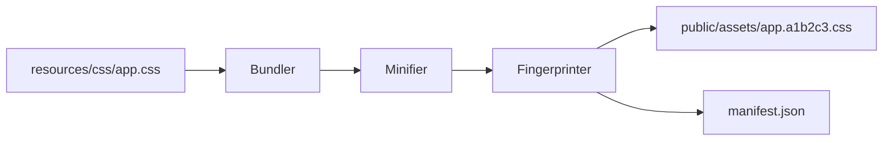

# PHASE HUB-03: Shared Asset Pipeline

## Tier
Hub (Shared Services)

## Resolves
Adds a stated benchmark method (`00_CRITIQUE.md` Finding 10) and an explicit build-status flag
(Finding 8's blocking pattern, applied consistently across the Hub tier).

## Component Name
Sovereign Asset Engine

## Description
A custom, PHP-only asset pipeline ("the Unified Engine") for processing frontend resources: CSS
minification, JS concatenation/wrapping, asset fingerprinting, and versioned manifest generation —
entirely within the PHP runtime, no Node.js/npm/Webpack.

## Build Status
🔴 **Blocked** on `CORE-14` (Filesystem Abstraction) and `CORE-10` (Config), neither yet implemented.

## Dependency Status
- **Upward:** `CORE-14` (Filesystem), `CORE-10` (Config). *(Verified against current Core-tier titles
  per `01_MASTER_INDEX.md` §2 — matches.)*
- **Downward:** `HUB-11` (Cloud Storage — deploys compiled assets to a CDN-backed bucket), `HUB-26`
  (UI Component Library — consumes the `@asset()` directive this engine resolves).

## Architectural Design
- **AssetBundler** — discovers source files and orchestrates the build.
- **ManifestGenerator** — JSON map of source filenames to fingerprinted versions.
- **Minifier** — PHP-based regex filters stripping comments/whitespace from CSS/JS.
- **AssetServer** — dev-mode utility serving assets with live-reload hooks (via `CORE-18` Kernel
  hooks).



```php
namespace SovereignStack\Hub\Contracts;

interface AssetManagerInterface
{
    public function url(string $path): string;
    public function build(): void;
    public function addFilter(AssetFilterInterface $filter): void;
}
```

## Integration Strategy
- **Upward:** uses `CORE-14` for I/O.
- **Downward:** Spoke applications use an `@asset('css/app.css')` SuperPHP directive (extending
  `CORE-12`) that resolves through this service.
- **Non-Node requirement:** all logic must be pure PHP — no `shell_exec('npm ...')`, enforced by a CI
  grep check over the package source, not just a stated rule.

## Benchmark & Verification Methodology
| Target | Method |
|---|---|
| Deterministic fingerprinting | Build the same fixed asset set twice with zero source changes; assert byte-identical `manifest.json` output both times. |
| Minification reduces size ≥ 30% | Run against a real, representative CSS fixture (not a synthetic worst-case) checked into the test suite; assert the ratio, don't hand-wave it. |
| Manifest/filesystem consistency | Integration test: run `build()`, then assert every path in `manifest.json` resolves to an existing file in `public/assets`, and no orphaned fingerprinted file exists without a manifest entry. |

## CI Verification Criteria
- Determinism test (above), blocking.
- Minification ratio test against the checked-in fixture (above).
- Manifest integrity test (above).
- Static grep-based scan rejecting any `shell_exec`/`exec`/`proc_open` call referencing `npm`, `node`,
  `yarn`, or `pnpm` anywhere in this package's source.

## SemVer Impact
**Major.** Establishes the frontend build strategy for the entire ecosystem.
