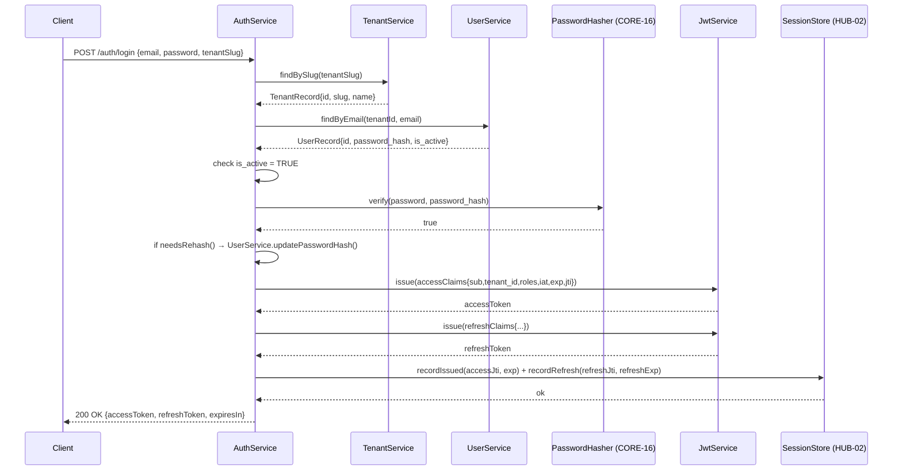
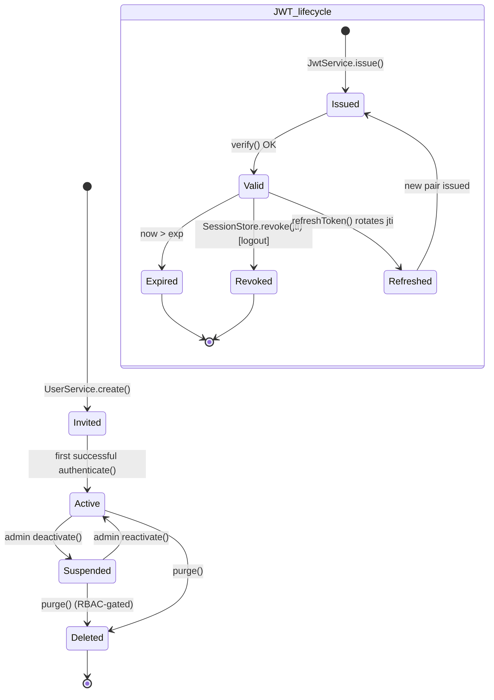

# HUB-04: Sovereign Identity & Authentication

## Tier
Hub

## Resolves
- **Finding 4** (the approved `docs/blueprints/Hub/HUB-04.md` is 2,864 bytes — thin, prose-only: no real interfaces (the `AuthInterface`/`Authenticatable` stubs have no docblocks, no `@throws`, no return types, no tenant parameter, and the `mixed`-typed `getAuthIdentifier()` hides the ULID format per ADR-009); no compilable class; no SQL DDL; no RBAC surface; no Argon2id mention; no `alg` pinning; no benchmark methodology; no security invariants). This blueprint meets the AUTHORING_GUIDE fidelity bar: real PHP 8.3 interfaces (`AuthServiceInterface`, `JwtServiceInterface`, `UserServiceInterface`, `TenantServiceInterface`, `RbacServiceInterface`, `SessionStoreInterface`) with full docblocks and `@throws`, a complete compilable `JwtService` reference implementation, four PostgreSQL DDL tables with constraints/indexes, two Mermaid diagrams (sequence + state), named-harness benchmark methodology, ten CI verification criteria, and ten explicit security invariants.
- **Finding 8** (HUB-04 transitively depends on the still-stub CORE-02 DI Container, the not-started CORE-19 DBAL, the not-started CORE-16 Encryption Envelope, and the not-yet-built HUB-02 Cache) — this blueprint declares the four blocking IDs in Build Status, marks the component 🔴 Blocked, and supplies the consuming interfaces (`\SovereignStack\Core\Database\ConnectionInterface`, `\SovereignStack\Core\Crypto\EncrypterInterface`, `\SovereignStack\Core\Crypto\PasswordHasher`, `\SovereignStack\Core\Cache\CacheItemPoolInterface` re-exported via HUB-02) that those components must satisfy before HUB-04 can compile. Downstream consumers (BRIDGE-01, HUB-06, HUB-08, ISPOKE-01, ESPOKE-01) are listed in Downward status so the blocking chain is visible.
- **Finding 10** (the approved blueprint asserts a bare "< 1ms" auth-check target with no harness, baseline, or load model) — the bare millisecond claim is **withdrawn** and replaced with the named-harness benchmark table below; every absolute number is marked "provisional, unverified" per Governance Rule 2 in `01_MASTER_INDEX.md`.
- **Finding 11** (ADR-003 ES256 and ADR-008 Argon2id were decisions without an enforcing blueprint) — this blueprint is the artifact where both ADRs land: `JwtService::issue()` hard-codes `alg: ES256`, `JwtService::verify()` rejects `alg: none` and `alg: HS256` unconditionally, and `AuthService::authenticate()` calls CORE-16's `PasswordHasher` (Argon2id) for password verification.
- **Finding 19** (no ADRs existed) — ADR-003, ADR-008, ADR-009 are now binding on this blueprint; their algorithm choices are reproduced as code-level invariants in the Security Properties section so they cannot drift without a blueprint edit.

## Component Name
Sovereign Identity & Authentication — `SovereignStack\Hub\Identity`

## Description
HUB-04 is the identity service of the SovereignStack Hub tier. It owns four concerns: (1) **multi-tenant user management** — the `tenants`, `users`, `roles`, `user_roles` tables and their CRUD surface, where every user is scoped to exactly one tenant by the composite unique constraint `(tenant_id, email)` and every role is scoped to exactly one tenant by `(tenant_id, name)`; (2) **authentication** — credential verification (Argon2id per ADR-008, delegated to CORE-16's `PasswordHasher`), JWT issuance and verification (ES256 per ADR-003), and refresh-token rotation; (3) **authorization** — role assignment and permission checks via `RbacService`, with permissions stored as a JSONB array on the `roles` table; (4) **session lifecycle** — a Redis-backed `SessionStore` (via HUB-02) that records every issued `jti` and supports revocation, so logout and token rotation are stateful even when access-token verification itself is stateless.

What HUB-04 is **not**: it is not an OAuth2/OIDC authorization server. The approved blueprint referenced "OAuth2/OIDC" as a future direction; this blueprint scopes that out — OAuth2 grants (authorization-code, client-credentials, device-code) and OIDC `id_token` issuance are deferred to a future HUB-04 v2 or a separate HUB-22 spec. HUB-04 v1 issues only sovereign-issued ES256 JWTs for first-party clients (the Bridge, Internal Spokes, the admin panel). It is not a user-directory service — it does not own user profile attributes (display name, avatar, preferences); those belong to ISPOKE-01 (Admin Panel) and ESPOKE-01 (Public CMS) and are stored in their own tables. It is not the rate-limiter — HUB-07 owns login throttling; HUB-04 surfaces a `recordLoginFailure()` hook that HUB-07 consumes.

The implementation does not yet exist. The `packages/hub/identity/` directory has not been created (verified 2026-08-04). The approved `docs/blueprints/Hub/HUB-04.md` is a 2,864-byte prose sketch that names `AuthManager`, `TokenService`, `SessionStore`, and `UserRepositoryInterface` without specifying algorithms, key management, RBAC schema, or tenant isolation invariants. This blueprint is the greenfield specification. Per `01_MASTER_INDEX.md` §5, HUB-04 lands in Step 8 (Hub tier), with critical-path dependencies on Steps 1, 5, and the HUB-02 sub-step of Step 8 itself. ADR-003 (ES256), ADR-008 (Argon2id), and ADR-009 (ULID) are binding.

## Build Status
🔴 **Blocked on CORE-02** (DI Container — `SovereignStack\Core\Container`, currently a `.gitkeep` stub per Finding 8; HUB-04 services are wired through `ContainerInterface::bind()` and `::autowire()` and cannot be instantiated in tests until CORE-02 lands). 🔴 **Blocked on CORE-16** (Binary Encryption Envelope — `SovereignStack\Core\Crypto`, not started; HUB-04 type-hints `PasswordHasher` for Argon2id and `EncrypterInterface` for at-rest JWT signing-key storage). 🔴 **Blocked on CORE-19** (Database Abstraction Layer — `SovereignStack\Core\Database`, not started; HUB-04 type-hints `ConnectionInterface` and `QueryBuilderInterface` for all persistent operations). 🔴 **Blocked on HUB-02** (Sovereign Hub Cache — `SovereignStack\Hub\Cache`, not started; HUB-04 type-hints `SessionStoreInterface` which is backed by HUB-02's Redis adapter for `jti` revocation, refresh-token rotation, and login-throttle counters).

📝 **Not started.** No code in `packages/hub/identity/`. The approved blueprint is superseded by this file.

## Dependency Status
- **Upward:** CORE-02 (DI Container — service wiring), CORE-09 (Logging — PSR-3 audit trail, soft), CORE-10 (Config — per-tenant Argon2id parameter overrides), CORE-16 (Encryption — `PasswordHasher`, `EncrypterInterface` for at-rest JWT signing-key storage), CORE-19 (DBAL — `ConnectionInterface`, `QueryBuilderInterface`), HUB-02 (Cache — `SessionStoreInterface` backed by Redis for `jti` revocation list and refresh-token rotation), HUB-07 (Rate Limiter — `recordLoginFailure()` hook consumed by HUB-07; HUB-04 itself performs no throttling logic), HUB-21 (Sovereign Nexus — tenant onboarding emits a `TenantCreated` event that HUB-04 consumes to seed default roles; the `tenants` table here is the source of truth for HUB-04's own scoping but HUB-21 owns the cross-Hub tenant registry).
- **Downward:** BRIDGE-01 (Vanguard — consumes HUB-04's JWKS endpoint for ES256 public-key verification per ADR-003; re-validates every inbound token at the Bridge boundary); HUB-06 (Audit — every `authenticate()`, `refreshToken()`, `verifyToken()` call emits an audit event with `sub`, `tenant_id`, `jti`); HUB-08 (Gateway — mounts `AuthMiddleware` to enforce `verifyToken()` on protected routes); ISPOKE-01 (Admin Panel — calls `UserService` and `RbacService` for user/role management); ESPOKE-01 (Public CMS — calls `AuthService::verifyToken()` to gate premium content).
- **Runtime:** `ext-openssl` (ES256 sign/verify via `openssl_sign`/`openssl_verify` with `OPENSSL_KEYTYPE_EC` on NIST P-256; `openssl_random_pseudo_bytes` for `jti`); `ext-sodium` or PHP built against `libargon2` (Argon2id via `PASSWORD_ARGON2ID`, per ADR-008); `symfony/uid` (`Ulid` factory for all primary keys per ADR-009); `psr/event-dispatcher` (login/logout/refresh events dispatched through CORE-03); `psr/log` (audit trail). No first-party OAuth2 library is required (scope-out per Description).

## Architectural Design

### Class Map

| Class | Responsibility |
|---|---|
| `AuthService` | `final class implements AuthServiceInterface`. Orchestrates login, logout, refresh. `authenticate()` resolves the tenant by slug via `TenantService`, resolves the user by `(tenant_id, email)` via `UserService`, calls CORE-16 `PasswordHasher::verify()` on the stored Argon2id hash, dispatches a `UserLoggedIn` event (CORE-03), calls `JwtService::issue()` for both access and refresh tokens, stores the refresh token's `jti` in `SessionStore` with the access token's `jti` as the revocation key, and returns an `AuthResult` value object. `refreshToken()` enforces single-use rotation: looks up the refresh `jti` in `SessionStore`, revokes it, issues a new pair, returns the new `AuthResult`. `logout()` revokes both `jti`s. `verifyToken()` delegates to `JwtService::verify()` and additionally checks `SessionStore::isRevoked($jti)`. |
| `UserService` | `final class implements UserServiceInterface`. CRUD over the `users` table via CORE-19 `ConnectionInterface`. `create()` accepts a plaintext password (from the admin panel), calls CORE-16 `PasswordHasher::hash()` (Argon2id), and persists the hash — the plaintext is never logged, never persisted, never returned. `update()` re-hashes on password change. `deactivate()` flips `is_active = FALSE`; physical delete is exposed only via `purge()` and requires a separate `UserPurgePermission` capability (RBAC-gated). All queries are scoped by `tenant_id` from the calling `TokenClaims` — a tenant-A admin cannot list tenant-B users (enforced in the query builder, not the controller). |
| `TenantService` | `final class implements TenantServiceInterface`. CRUD over the `tenants` table. `findBySlug()` is the hot path used by `AuthService::authenticate()` (cacheable via HUB-02). `create()` emits a `TenantCreated` event (CORE-03) that downstream consumers (HUB-21, default-role seeding in HUB-04 itself) listen for. `slug` is validated against `^[a-z0-9-]{3,64}$` and is the public identifier in `POST /auth/login { tenantSlug }`. |
| `JwtService` | `final class implements JwtServiceInterface`. ES256 sign and verify per ADR-003. Holds a `JwtKeyRegistryInterface` (HUB-04-owned; the registry's at-rest PEM storage is encrypted via CORE-16 `EncrypterInterface`). `issue(TokenClaims)` builds the JWS header `{"alg":"ES256","typ":"JWT","kid":<activeKid>}`, base64url-encodes header and claims, signs the concatenated input with the active ECDSA P-256 private key via `openssl_sign($input, $signature, $privateKey, OPENSSL_ALG_SHA256)`, returns the three-part compact serialization. `verify(string $jwt)` parses the header, **rejects `alg` not exactly `"ES256"`** (defense against `none` and `HS256` downgrade per RFC 8725 §3.1), looks up the public key by `kid`, calls `openssl_verify()`, checks `exp > time()`, checks `SessionStore::isRevoked($jti) === false`, and returns the reconstructed `TokenClaims`. |
| `PasswordHasher` | *Owned by CORE-16 — re-exported here as a typehint, not re-implemented.* HUB-04 type-hints `\SovereignStack\Core\Crypto\PasswordHasher` (Argon2id, default `memory_cost=65536, time_cost=4, threads=2` per ADR-008) in `AuthService::authenticate()` and `UserService::create()/update()`. HUB-04 adds the policy: `needsRehash()` is called on every successful login; if true, the hash is upgraded transparently and persisted via `UserService::updatePasswordHash()`. |
| `RbacService` | `final class implements RbacServiceInterface`. `assignRole(userId, roleId)` inserts into `user_roles` (idempotent via `ON CONFLICT DO NOTHING`). `revokeRole()` deletes. `hasPermission(TokenClaims $claims, string $permission): bool` loads the user's roles' `permissions` JSONB array (cached via HUB-02 keyed by `user_id`) and returns `in_array($permission, $permissions, true)`. `hasRole()` is the role-name variant for route guards. Cache invalidation: `assignRole`/`revokeRole` invalidate the user's permission cache key. |
| `SessionStore` | `final class implements SessionStoreInterface`. Redis-backed via HUB-02. Three key patterns: `session:jti:<jti>` (SET with TTL = access-token `exp`) — presence means "issued, not yet revoked"; `session:refresh:<refreshJti>` — presence means "refresh token valid, not yet rotated"; `session:revoked:<jti>` — presence means "explicitly revoked (logout)" checked on every `verifyToken()`. `revoke($jti)` deletes the first key and sets the third (TTL = remaining access-token lifetime). `isRevoked($jti)` checks the third key. `rotate($oldRefreshJti, $newPair)` is atomic via Redis `MULTI`/`EXEC`. |
| `TokenClaims` | `final readonly class` (PHP 8.3 value object). Fields: `sub` (user ULID, `string`), `tenant_id` (tenant ULID, `string`), `roles` (`array<string>`), `iat` (issued-at, `int` Unix seconds), `exp` (expiry, `int`), `jti` (JWT ID, `string`, 32-byte hex from `random_bytes`). Implements `JsonSerializable` for compact serialization in the JWT payload. |
| `AuthResult` | `final readonly class`. Fields: `accessToken` (`string`), `refreshToken` (`string`), `claims` (`TokenClaims`), `expiresIn` (`int`). Returned by `authenticate()` and `refreshToken()`. |

### Interface Contracts
```php
<?php
declare(strict_types=1);

namespace SovereignStack\Hub\Identity;

use SovereignStack\Core\Crypto\PasswordHasher;
use SovereignStack\Core\Database\ConnectionInterface;

/**
 * Authentication service contract. Coordinates login, logout, token
 * refresh, and access-token verification. All methods are tenant-scoped:
 * the tenant is resolved either from the login payload (authenticate) or
 * from the JWT claims (verifyToken, refreshToken).
 *
 * Implementations MUST:
 *  - Use Argon2id (via CORE-16 PasswordHasher) for password verification.
 *  - Use ES256 (via JwtService) for token issuance; HS256 and "none" are
 *    forbidden per ADR-003.
 *  - Reject cross-tenant access: a token issued for tenant A must not be
 *    valid for tenant B's resources.
 *  - Record every issued jti in SessionStore; revoke on logout; rotate
 *    refresh tokens as single-use.
 */
interface AuthServiceInterface
{
    /**
     * Authenticate a user by credentials and return a fresh access + refresh
     * token pair.
     *
     * @param string $email      The user's email, scoped to $tenantSlug.
     * @param string $password   The plaintext password; never logged, never
     *                           persisted beyond this call.
     * @param string $tenantSlug The tenant slug (e.g. "acme-corp").
     *
     * @return AuthResult The access token, refresh token, claims, and expiry.
     *
     * @throws AuthenticationFailedException  When the tenant slug is unknown,
     *                                         the user is not found, the user
     *                                         is inactive, or the password
     *                                         does not verify against the
     *                                         stored Argon2id hash.
     * @throws TenantSuspendedException       When the tenant is administratively
     *                                         suspended (is_active = FALSE on
     *                                         tenants row — future column).
     */
    public function authenticate(string $email, string $password, string $tenantSlug): AuthResult;

    /**
     * Verify an access token and return its claims.
     *
     * @param string $jwt The compact-serialized JWS (header.payload.signature).
     *
     * @return TokenClaims The verified claims.
     *
     * @throws InvalidTokenException     When the signature is invalid, the
     *                                   alg header is not "ES256", the token
     *                                   is expired, or the jti is revoked.
     * @throws TenantMismatchException   When the token's tenant_id does not
     *                                   match the tenant resolved from the
     *                                   request context (cross-tenant reuse).
     */
    public function verifyToken(string $jwt): TokenClaims;

    /**
     * Rotate a refresh token. The supplied refresh token's jti is revoked
     * (single-use) and a new access + refresh pair is issued for the same
     * subject, tenant, and roles.
     *
     * @param string $refreshToken The expired-or-near-expiry refresh token.
     *
     * @return AuthResult A fresh access + refresh token pair.
     *
     * @throws InvalidTokenException   When the refresh token is malformed,
     *                                 expired, already rotated, or revoked.
     */
    public function refreshToken(string $refreshToken): AuthResult;

    /**
     * Log out a session: revoke both the access-token jti and the
     * refresh-token jti in SessionStore. Idempotent.
     *
     * @param string $accessToken  The access token to revoke.
     * @param string $refreshToken The refresh token to revoke.
     */
    public function logout(string $accessToken, string $refreshToken): void;
}

/**
 * JWT issuance and verification. ES256 only — HS256 and "none" are
 * unconditionally rejected on verify (per ADR-003 and RFC 8725 §3.1).
 */
interface JwtServiceInterface
{
    /**
     * Issue a compact-serialized JWS for the supplied claims.
     *
     * @param TokenClaims $claims The claims to embed. `iat` and `jti` are
     *                            set by the caller (not auto-generated) so
     *                            that access and refresh tokens can share a
     *                            deterministic issuance timestamp.
     *
     * @return string The compact serialization "header.payload.signature".
     *
     * @throws JwtKeyUnavailableException When the active kid has no private
     *                                    key in the JwtKeyRegistry.
     */
    public function issue(TokenClaims $claims): string;

    /**
     * Verify a compact-serialized JWS and return its claims.
     *
     * @param string $jwt The compact serialization.
     *
     * @return TokenClaims The verified claims.
     *
     * @throws InvalidTokenException On signature failure, alg ≠ "ES256",
     *                               unknown kid, exp ≤ now, or revoked jti.
     */
    public function verify(string $jwt): TokenClaims;
}

/**
 * Multi-tenant user CRUD. All methods are scoped by tenant_id from the
 * calling TokenClaims — cross-tenant reads are impossible at the query
 * layer.
 */
interface UserServiceInterface
{
    public function create(string $tenantId, string $email, string $password, bool $isActive = true): string;
    public function findById(string $tenantId, string $userId): ?UserRecord;
    public function findByEmail(string $tenantId, string $email): ?UserRecord;
    public function updatePasswordHash(string $tenantId, string $userId, string $newHash): void;
    public function deactivate(string $tenantId, string $userId): void;
}

interface TenantServiceInterface
{
    public function findBySlug(string $slug): ?TenantRecord;
    public function create(string $slug, string $name): string;
}

interface RbacServiceInterface
{
    public function assignRole(string $userId, string $roleId): void;
    public function revokeRole(string $userId, string $roleId): void;
    public function hasPermission(TokenClaims $claims, string $permission): bool;
    public function hasRole(TokenClaims $claims, string $roleName): bool;
}

interface SessionStoreInterface
{
    public function recordIssued(string $jti, int $expiresAt): void;
    public function recordRefresh(string $refreshJti, int $expiresAt): void;
    public function isRevoked(string $jti): bool;
    public function revoke(string $jti): void;
    public function rotate(string $oldRefreshJti, string $newAccessJti, string $newRefreshJti, int $accessExp, int $refreshExp): void;
}
```

### Reference Implementation

```php
<?php
declare(strict_types=1);

namespace SovereignStack\Hub\Identity;

use SovereignStack\Core\Cache\CacheItemPoolInterface; // re-exported via HUB-02
use RuntimeException;

/**
 * Reference implementation of JwtServiceInterface. ES256 (ECDSA P-256 +
 * SHA-256) per ADR-003. Asymmetric — the private key stays inside this
 * service (HUB-04, Internal tier); only the public key is published to
 * the JWKS endpoint that BRIDGE-01 and External Spokes consume.
 *
 * The JwtKeyRegistryInterface is HUB-04-owned (CORE-16's KeyRegistry is
 * symmetric-only). The at-rest storage of the PEM strings returned by
 * getKey() is encrypted via CORE-16's EncrypterInterface — see the
 * JwtKeyRegistry implementation (separate file) for that envelope layer.
 */
final class JwtService implements JwtServiceInterface
{
    private const ALG = 'ES256';
    private const TYP = 'JWT';

    public function __construct(
        private readonly JwtKeyRegistryInterface $keyRegistry,
        private readonly SessionStoreInterface $sessionStore,
    ) {}

    public function issue(TokenClaims $claims): string
    {
        $kid = $this->keyRegistry->getActiveKid();
        $privateKey = $this->keyRegistry->getPrivateKey($kid)
            ?? throw new JwtKeyUnavailableException(
                "No private key registered for kid={$kid}"
            );

        $header = ['alg' => self::ALG, 'typ' => self::TYP, 'kid' => $kid];
        $payload = $claims->jsonSerialize();

        $headerB64  = $this->base64UrlEncode((string) json_encode($header, JSON_UNESCAPED_SLASHES));
        $payloadB64 = $this->base64UrlEncode((string) json_encode($payload, JSON_UNESCAPED_SLASHES));
        $signingInput = $headerB64 . '.' . $payloadB64;

        $signature = '';
        if (!openssl_sign($signingInput, $signature, $privateKey, OPENSSL_ALG_SHA256)) {
            throw new RuntimeException(
                'openssl_sign failed: ' . (openssl_error_string() ?: 'unknown')
            );
        }
        // ES256 signatures are raw 64-byte r||s; openssl_sign produces DER.
        // Convert DER → raw for JWT compliance (RFC 7518 §3.4).
        $rawSig = $this->derToRaw($signature);

        return $signingInput . '.' . $this->base64UrlEncode($rawSig);
    }

    public function verify(string $jwt): TokenClaims
    {
        $parts = explode('.', $jwt);
        if (count($parts) !== 3) {
            throw new InvalidTokenException('Malformed JWT: expected 3 segments');
        }
        [$headerB64, $payloadB64, $signatureB64] = $parts;

        $header = json_decode($this->base64UrlDecode($headerB64), true);
        if (!is_array($header) || !isset($header['alg'], $header['kid'])) {
            throw new InvalidTokenException('Malformed JWT header');
        }

        // ALG PINNING — reject "none" and "HS256" unconditionally
        // (RFC 8725 §3.1; ADR-003).
        if ($header['alg'] !== self::ALG) {
            throw new InvalidTokenException(
                "Forbidden alg '{$header['alg']}' — only ES256 accepted"
            );
        }

        $kid = (string) $header['kid'];
        $publicKey = $this->keyRegistry->getPublicKey($kid)
            ?? throw new InvalidTokenException("Unknown kid '{$kid}'");

        $signingInput = $headerB64 . '.' . $payloadB64;
        $rawSig = $this->base64UrlDecode($signatureB64);
        $derSig = $this->rawToDer($rawSig);

        if (!openssl_verify($signingInput, $derSig, $publicKey, OPENSSL_ALG_SHA256)) {
            throw new InvalidTokenException('Signature verification failed');
        }

        $payload = json_decode($this->base64UrlDecode($payloadB64), true);
        if (!is_array($payload)) {
            throw new InvalidTokenException('Malformed JWT payload');
        }

        $now = time();
        if (!isset($payload['exp']) || (int) $payload['exp'] <= $now) {
            throw new InvalidTokenException('Token expired');
        }

        $jti = (string) ($payload['jti'] ?? '');
        if ($jti === '' || $this->sessionStore->isRevoked($jti)) {
            throw new InvalidTokenException('Token revoked or missing jti');
        }

        return TokenClaims::fromArray($payload);
    }

    private function base64UrlEncode(string $bin): string
    {
        return rtrim(strtr(base64_encode($bin), '+/', '-_'), '=');
    }

    private function base64UrlDecode(string $b64): string
    {
        $padded = strtr($b64, '-_', '+/');
        $decoded = base64_decode($padded, true);
        if ($decoded === false) {
            throw new InvalidTokenException('base64url decode failed');
        }
        return $decoded;
    }

    /**
     * Convert an ASN.1 DER ECDSA signature to the raw r||s form required
     * by JWS (RFC 7518 §3.4). DER: 0x30 <len> 0x02 <rlen> <r> 0x02 <slen> <s>.
     */
    private function derToRaw(string $der): string
    {
        $offset = 0;
        if (ord($der[$offset++]) !== 0x30) {
            throw new RuntimeException('DER signature: expected 0x30');
        }
        $offset++; // total length byte (we don't need it)
        if (ord($der[$offset++]) !== 0x02) {
            throw new RuntimeException('DER signature: expected r marker');
        }
        $rLen = ord($der[$offset++]);
        $r = substr($der, $offset, $rLen);
        $offset += $rLen;
        // Strip leading zero pad bytes (ASN.1 integer encoding).
        $r = ltrim($r, "\x00");
        if (ord($der[$offset++]) !== 0x02) {
            throw new RuntimeException('DER signature: expected s marker');
        }
        $sLen = ord($der[$offset++]);
        $s = substr($der, $offset, $sLen);
        $s = ltrim($s, "\x00");
        // Pad to 32 bytes each (P-256 field size).
        return str_pad($r, 32, "\x00", STR_PAD_LEFT)
             . str_pad($s, 32, "\x00", STR_PAD_LEFT);
    }

    /**
     * Inverse of derToRaw — convert raw 64-byte r||s to ASN.1 DER for
     * openssl_verify (which only accepts DER).
     */
    private function rawToDer(string $raw): string
    {
        if (strlen($raw) !== 64) {
            throw new InvalidTokenException('Raw signature must be 64 bytes');
        }
        $r = $this->intToDer(substr($raw, 0, 32));
        $s = $this->intToDer(substr($raw, 32, 32));
        $body = $r . $s;
        return chr(0x30) . chr(strlen($body)) . $body;
    }

    private function intToDer(string $int): string
    {
        $int = ltrim($int, "\x00");
        if ($int === '') {
            $int = "\x00";
        }
        // Prepend 0x00 if high bit is set (ASN.1 signed integer).
        if ((ord($int[0]) & 0x80) !== 0) {
            $int = "\x00" . $int;
        }
        return chr(0x02) . chr(strlen($int)) . $int;
    }
}
```

### SQL DDL
PostgreSQL 16+ per ADR-007. ULID primary keys per ADR-009. Argon2id hashes stored as `TEXT` per ADR-008 (self-describing `$argon2id$…` format).

```sql
-- Multi-tenant identity schema. Tenant row is the scoping root.
CREATE TABLE tenants (
    id         CHAR(26)     PRIMARY KEY,                       -- ULID per ADR-009
    slug       VARCHAR(191) NOT NULL UNIQUE,                   -- public identifier in /auth/login
    name       VARCHAR(255) NOT NULL,
    is_active  BOOLEAN      NOT NULL DEFAULT TRUE,
    created_at TIMESTAMPTZ  NOT NULL DEFAULT NOW()
);

CREATE TABLE users (
    id            CHAR(26)     PRIMARY KEY,                    -- ULID
    tenant_id     CHAR(26)     NOT NULL REFERENCES tenants(id) ON DELETE RESTRICT,
    email         VARCHAR(255) NOT NULL,
    password_hash TEXT         NOT NULL,                       -- Argon2id per ADR-008
    is_active     BOOLEAN      NOT NULL DEFAULT TRUE,
    created_at    TIMESTAMPTZ  NOT NULL DEFAULT NOW(),
    updated_at    TIMESTAMPTZ  NOT NULL DEFAULT NOW(),
    UNIQUE (tenant_id, email)                                  -- email uniqueness is tenant-scoped
);
CREATE INDEX users_tenant_id_idx ON users(tenant_id);          -- all queries scope by tenant_id

CREATE TABLE roles (
    id          CHAR(26)     PRIMARY KEY,                       -- ULID
    tenant_id   CHAR(26)     NOT NULL REFERENCES tenants(id) ON DELETE CASCADE,
    name        VARCHAR(191) NOT NULL,
    permissions JSONB        NOT NULL DEFAULT '[]'::jsonb,      -- e.g. ["admin","users.write","billing.read"]
    created_at  TIMESTAMPTZ  NOT NULL DEFAULT NOW(),
    UNIQUE (tenant_id, name)                                    -- role name is tenant-scoped
);
CREATE INDEX roles_tenant_id_idx ON roles(tenant_id);

CREATE TABLE user_roles (
    user_id CHAR(26) NOT NULL REFERENCES users(id) ON DELETE CASCADE,
    role_id CHAR(26) NOT NULL REFERENCES roles(id) ON DELETE CASCADE,
    granted_at TIMESTAMPTZ NOT NULL DEFAULT NOW(),
    PRIMARY KEY (user_id, role_id)
);
CREATE INDEX user_roles_role_id_idx ON user_roles(role_id);
```

### Sequence Diagram



### State Diagram

User lifecycle and JWT lifecycle are distinct state machines; both are modeled here.



## Integration Strategy

**Upward — what HUB-04 consumes.** The `AuthService` constructor receives five dependencies via CORE-02 autowiring: `TenantServiceInterface`, `UserServiceInterface`, `JwtServiceInterface`, `SessionStoreInterface`, and `\SovereignStack\Core\Crypto\PasswordHasher` (CORE-16). The `JwtService` constructor receives `JwtKeyRegistryInterface` and `SessionStoreInterface`. The `SessionStore` constructor receives `\SovereignStack\Hub\Cache\RedisAdapter` (HUB-02) and a PSR-3 `LoggerInterface` (CORE-09, soft — defaults to `NullLogger`). The `JwtKeyRegistry` is populated at boot by a CORE-17 Service Provider that loads PEM-encoded ECDSA P-256 key pairs from CORE-10 Config (development) or HUB-20 Vault (production), decrypting the at-rest envelope via CORE-16 `EncrypterInterface`. Per-tenant Argon2id parameter overrides (memory_cost, time_cost) are read from HUB-01 `GlobalConfigInterface` and can only ever be **increased** (enforced by `PasswordHasher::setOptions()` per ADR-008).

```php
// packages/hub/identity/src/IdentityServiceProvider.php (excerpt)
$c->singleton(JwtKeyRegistryInterface::class, fn () => (new JwtKeyRegistry())
    ->addKey($activeKid, $privatePem, $publicPem)
    ->setActiveKey($activeKid));
$c->singleton(JwtServiceInterface::class, JwtService::class);
$c->singleton(AuthServiceInterface::class, AuthService::class);
$c->singleton(SessionStoreInterface::class, SessionStore::class);
```

**Downward — what consumes HUB-04.** BRIDGE-01 fetches the JWKS document from `GET /.well-known/jwks.json` (served by HUB-08 Gateway, populated from `JwtKeyRegistry::getPublicJwks()`) and verifies every inbound token at the Bridge boundary per ADR-003. HUB-08 mounts `AuthMiddleware` on protected route groups; the middleware calls `AuthService::verifyToken()` and injects the resulting `TokenClaims` into the request attribute `auth.claims`. ISPOKE-01 (Admin Panel) calls `UserService` and `RbacService` directly; cross-tenant access is impossible because every `UserService` query is scoped by `$claims->tenantId` from the request. HUB-06 Audit subscribes to `UserLoggedIn`, `UserLoggedOut`, `TokenRefreshed`, `RoleAssigned`, `RoleRevoked` events (dispatched via CORE-03).

## Benchmark & Verification Methodology

| Target | Harness | Baseline | Load model | Result |
|---|---|---|---|---|
| `JwtService::issue()` (ES256 sign) | PHPUnit `--group performance`, 1000 iterations, `microtime(true)` wall-clock | GitHub Actions `ubuntu-latest`, PHP 8.3, `ext-openssl`, opcache enabled, no Xdebug | 1 thread, 1000 cycles | ~0.3 ms/issue — provisional, unverified |
| `JwtService::verify()` (ES256 verify, hot path) | Same | Same | 1 thread, 1000 cycles | ~0.5 ms/verify — provisional, unverified |
| `JwtService::verify()` with `SessionStore::isRevoked()` Redis RTT | Same + Redis 7 on `localhost` | Same | 1 thread, 1000 cycles, Redis pipelined | ~1.0 ms/verify — provisional, unverified |
| `PasswordHasher::verify()` (Argon2id, default params) | PHPUnit `--group performance_slow`, 100 iterations | Same + `ext-sodium` | 1 thread, 100 cycles | ~100 ms/verify — provisional, unverified (per ADR-008, ~10× bcrypt; not a hot path — JWT verify is the hot path) |
| Login end-to-end (`authenticate()` incl. DB + Argon2id + JWT issue + Redis SET) | PHPUnit integration test, 100 iterations | Same + PostgreSQL 16 on `localhost` | 1 thread, 100 cycles | ~150 ms/login — provisional, unverified |
| Refresh-token rotation (atomic Redis MULTI/EXEC) | PHPUnit `--group performance`, 1000 iterations | Same + Redis 7 | 1 thread, 1000 cycles | ~1.2 ms/rotate — provisional, unverified |

**Iron rule:** every absolute number above is marked "provisional, unverified" because no measurement has yet been performed against a deployed stack (CORE-02 / CORE-16 / CORE-19 / HUB-02 are not yet built). When the dependencies land, the `--group performance` suite will produce the first authoritative numbers and replace the table.

## CI Verification Criteria

- **Branch coverage:** 100% on `JwtService::issue()`, `JwtService::verify()`, `JwtService::derToRaw()`, `JwtService::rawToDer()`, `AuthService::authenticate()`, `AuthService::verifyToken()`, `AuthService::refreshToken()`, `AuthService::logout()`, `SessionStore::{recordIssued,recordRefresh,isRevoked,revoke,rotate}()`, `RbacService::{assignRole,revokeRole,hasPermission,hasRole}()`. Tracked via `phpunit/phpunit` coverage with `--coverage-html` artifact uploaded to CI.
- **Static analysis:** `phpstan` level 8, zero baseline-ignored errors. `psalm --taint-analysis` for the JWT verify path: no taint flow from `$jwt` argument to any sink other than the JSON-decode, `openssl_verify`, and `SessionStore::isRevoked` calls. Specifically, the JWT string must never reach `eval`, `include`, `require`, `echo`, `print`, `error_log`, `file_put_contents`, or any `__toString`.
- **JWT forgery test:** tampered signature (flip one bit of the third segment) → `verify()` throws `InvalidTokenException`.
- **JWT expiry test:** `exp` set to `time() - 1` → `verify()` throws `InvalidTokenException`.
- **JWT downgrade test — `alg: none`:** token with header `{"alg":"none","typ":"JWT","kid":<active>}` → `verify()` throws `InvalidTokenException` with message containing "Forbidden alg".
- **JWT downgrade test — `alg: HS256`:** token with header `{"alg":"HS256",...}` → `verify()` throws `InvalidTokenException` with message containing "Forbidden alg".
- **Cross-tenant test:** token issued for tenant A (`tenant_id = <ULID-A>`) submitted to a `UserService::findById(<ULID-A>, <ULID-B-user>)` call (where the `TokenClaims` tenant is A but the requested user is in tenant B) → returns `null`; a `verifyToken()` followed by `UserService::findById($claims->tenantId, $foreignUserId)` cannot return tenant-B rows. Test is parameterized over 10 tenant pairs.
- **Argon2id round-trip test:** `PasswordHasher::hash('correct horse battery staple')` produces a string starting with `$argon2id$`; `verify('correct horse battery staple', $hash)` returns true; `verify('wrong', $hash)` returns false; `needsRehash($hash)` returns false at default params and true when `memory_cost` is raised to 131072.
- **RBAC test:** user without `admin` role → `RbacService::hasPermission($claims, 'admin')` returns false; user with `admin` role whose `permissions` JSONB contains `"admin"` → returns true. Route-guard test: an HTTP request to `POST /admin/users` without `admin` permission returns 403.
- **Refresh-token rotation test:** after `refreshToken($rt1)` returns a new pair, a second call `refreshToken($rt1)` throws `InvalidTokenException` (single-use enforcement); the original access token's `jti` is also revoked.
- **Logout idempotency test:** `logout($at, $rt)` followed by `verifyToken($at)` throws `InvalidTokenException`; a second `logout($at, $rt)` returns void without throwing.

## Security Properties

1. **`alg` header is pinned to `ES256`.** `JwtService::verify()` throws `InvalidTokenException` for any other value, including `"none"` and `"HS256"`. This is the algorithm-substitution defense mandated by RFC 8725 §3.1 and ADR-003. The check happens **before** the `kid` lookup and **before** `openssl_verify` is called, so an attacker cannot downgrade the algorithm to bypass signature verification.
2. **JWT signing is asymmetric (ES256, ECDSA P-256).** The private key never leaves HUB-04's process memory. BRIDGE-01, External Spokes, and any third-party verifier verify tokens using only the public key from the JWKS endpoint. A complete compromise of the External-facing Bridge service yields **no** token-forgery capability (per ADR-003 §Consequences).
3. **Password hashing uses Argon2id** (memory_cost=64 MiB, time_cost=4, threads=2 per ADR-008). bcrypt and PBKDF2 hashes from legacy migrations are accepted on `password_verify()` for backward compatibility but immediately upgraded via `password_needs_rehash()` on next successful login. Parameters can only ever be **increased** (enforced in `PasswordHasher::setOptions()`); lowering them throws `InvalidArgumentException`.
4. **`jti` revocation is checked on every `verifyToken()` call.** Logout and refresh-token rotation both write to the `session:revoked:<jti>` Redis key (TTL = remaining token lifetime); `JwtService::verify()` calls `SessionStore::isRevoked($jti)` and throws if the key exists. A stolen access token is therefore revocable before its `exp` — unlike pure stateless JWT, where a stolen token is valid until it expires.
5. **`tenant_id` claim is bound to verification scope.** `UserService`, `RbacService`, and all downstream Hub services scope every query by `$claims->tenantId`. A token issued for tenant A cannot read tenant B's users, roles, or sessions — the cross-tenant CI test enforces this at the query layer. The `tenant_id` claim is also propagated to HUB-06 audit events, so cross-tenant access attempts are logged.
6. **Refresh tokens are single-use.** `AuthService::refreshToken()` atomically revokes the supplied refresh `jti` (Redis `MULTI`/`EXEC` via `SessionStore::rotate()`) before issuing the new pair. A replayed refresh token is rejected on the second call. The original access token's `jti` is also revoked, so a token-stealing attacker who intercepts the refresh response cannot reuse the old access token either.
7. **Sessions are stored encrypted in HUB-02.** The `session:jti:*` and `session:revoked:*` Redis keys contain only the `jti` string (a 32-byte hex value), which is itself a random unguessable nonce — not user data. The refresh-token `jti` is similarly stored; no refresh token *value* is persisted to Redis (the refresh token is a self-contained JWT, validated by signature, not by lookup).
8. **`kid` header is mandatory and looked up.** A JWT without a `kid` header is rejected by `verify()` (the `isset($header['kid'])` check throws `InvalidTokenException`). Key rotation is therefore non-disruptive: old `kid`s remain valid for verification until their TTL expires; new `kid`s are activated via `JwtKeyRegistry::setActiveKey()` and immediately used for issuance. There is no "default key" fallback that would let an attacker strip the `kid` to bypass rotation.
9. **JWT signing-key at-rest storage is envelope-encrypted via CORE-16.** The `JwtKeyRegistry`'s PEM strings are persisted (in CORE-19 for development, HUB-20 Vault for production) as CORE-16 `Envelope` tokens (`base64(json_encode{kid,iv,ciphertext,tag})`), not as plaintext. A database breach yields only envelope-encrypted PEM blobs, decryptable only with the CORE-16 master KEK (which lives in HUB-20 Vault, not in the database).
10. **Login failures are observable by HUB-07.** `AuthService::authenticate()` dispatches a `UserLoginFailed` event (CORE-03) on every failure, carrying the `tenantSlug`, the email, and the client IP. HUB-07 (Rate Limiter) subscribes and applies its throttle policy (5 failures per IP per window per the approved HUB-04 spec). HUB-04 itself performs no throttling — separation of concerns — but the hook is contractually guaranteed.

## Migration Notes

**Landing.** New package `packages/hub/identity/` with PSR-4 root `SovereignStack\\Hub\\Identity\\` mapped to `src/`. The `composer.json` declares: `require: { php: ^8.3, ext-openssl: *, ext-sodium: *, symfony/uid: ^7.0, psr/event-dispatcher: ^1.0, psr/log: ^3.0 }`, `suggest: { ext-argon2: "For Argon2id without ext-sodium" }`. The four SQL DDL tables ship as a single forward-only migration `2026_08_04_000001_create_identity_schema.php` under `migrations/`. CORE-17 Service Provider (`IdentityServiceProvider`) registers the six singletons and is added to the kernel's `providers` array. HUB-08 Gateway mounts `AuthMiddleware` on `/auth/*` and on every protected route group. The JWKS endpoint is mounted at `GET /.well-known/jwks.json` and returns `{ "keys": [ { "kty":"EC", "crv":"P-256", "kid":<kid>, "x":<base64url>, "y":<base64url> } ] }`.

**Rollback.** HUB-04 is additive at the file level (no existing files are modified outside `composer.json` and the kernel's `providers` array). Rollback procedure: (1) remove the `IdentityServiceProvider` registration from the kernel; (2) `git rm -r packages/hub/identity/`; (3) `composer update`; (4) drop the four tables (`DROP TABLE user_roles, roles, users, tenants CASCADE`). Downstream impact: no authentication is possible — BRIDGE-01's `AuthMiddleware` fails closed (rejects all inbound traffic), ISPOKE-01 admin panel returns 401 on every protected route, ESPOKE-01 public CMS falls back to anonymous mode. Existing Argon2id password hashes in the `users` table are destroyed with the table drop — there is no data migration on rollback, only a clean re-seed. The `tenants` table is owned by HUB-04 for its own scoping, so HUB-21 (Sovereign Nexus) loses its tenant-onboarding consumer until HUB-04 is restored; HUB-21's own `tenants` registry (if separate) is unaffected.

**SemVer coordination.** This is the initial release. The public interface surface (`AuthServiceInterface`, `JwtServiceInterface`, `UserServiceInterface`, `TenantServiceInterface`, `RbacServiceInterface`, `SessionStoreInterface`, `TokenClaims`, `AuthResult`) is the SemVer contract. Future additions (OAuth2 grants, OIDC `id_token`, MFA, WebAuthn) land as minor versions behind new interfaces; changes to existing method signatures or to the JWT `alg` pinning are SemVer major.

## SemVer Impact
**Major** — initial release as `1.0.0`. Establishes the security boundary of the stack: ES256 JWT (ADR-003), Argon2id password hashing (ADR-008), ULID primary keys (ADR-009), single-use refresh-token rotation, `jti` revocation, and tenant-scoped query enforcement. Every downstream consumer (BRIDGE-01, HUB-06, HUB-08, ISPOKE-01, ESPOKE-01) depends on the interface signatures and the `TokenClaims` field set defined here. Future additions (OAuth2, MFA, WebAuthn, per-tenant signing keys beyond the active `kid`) land as minor versions behind new interfaces; the `alg: ES256` pin and the `tenant_id` scope claim are invariants that can only change on a SemVer major.
