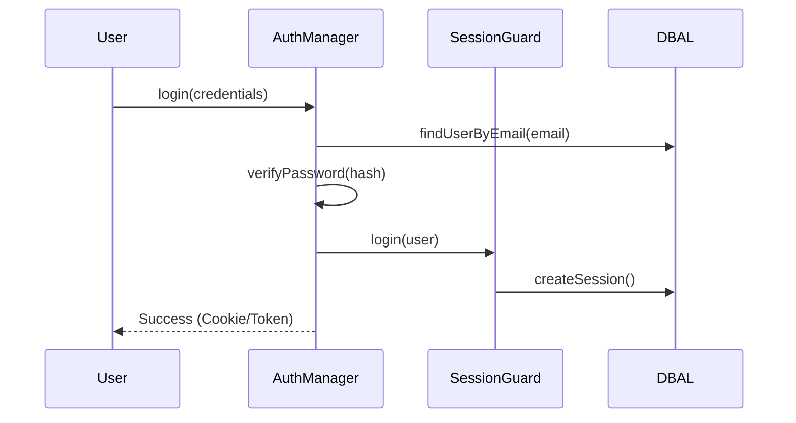

# PHASE HUB-04: Global Identity & Authentication

## Tier
Hub (Shared Services)

## Resolves
Adds a stated benchmark method (Finding 10) for the "< 1ms hot-cache auth check" claim and makes the
brute-force/session-isolation criteria testable rather than asserted.

## Component Name
Sovereign Identity

## Description
Comprehensive identity management and authentication: user lifecycle, session handling, secure
password hashing, and an OAuth2/OIDC foundation. Centralizes auth so Spoke applications verify identity
through one Hub contract instead of each rolling their own.

## Build Status
🔴 **Blocked** on `CORE-19` (DBAL), `CORE-16` (Encryption), and `HUB-02` (Cache) — none implemented.
This is one of the highest-priority Hub components once Core lands: `HUB-05` (RBAC), `ISPOKE-01`
(Admin Panel), and `BRIDGE-01`'s re-validation step all depend directly on it.

## Dependency Status
- **Upward:** `CORE-19` (DBAL), `CORE-16` (Encryption), `HUB-02` (Cache). *(Matches
  `hub-blueprint-taxonomy.md` — no drift.)*
- **Downward:** `HUB-05`, `HUB-08` (Gateway middleware), `HUB-21` (Tenancy), `BRIDGE-01`,
  every Internal and External Spoke.

## Architectural Design
- **AuthManager** — coordinates authentication attempts across guards (Session, Token, API Key).
- **UserRepositoryInterface** — abstraction over user storage (database by default).
- **SessionStore** — backed by `HUB-02` for stateless horizontal scaling.
- **TokenService** — generates/validates signed JWTs or opaque tokens.



```php
namespace SovereignStack\Hub\Contracts;

interface AuthInterface
{
    public function attempt(array $credentials): bool;
    public function login(Authenticatable $user, bool $remember = false): void;
    public function logout(): void;
    public function check(): bool;
    public function user(): ?Authenticatable;
    public function id(): mixed;
}

abstract class Authenticatable
{
    abstract public function getAuthIdentifier(): mixed;
    abstract public function getAuthPassword(): string;
    abstract public function getRememberToken(): ?string;
}
```

## Integration Strategy
- **Upward:** `CORE-19` for persistence, `CORE-16` for sensitive-data encryption.
- **Downward:** Spoke applications use `AuthInterface` to protect routes and identify users. Provides
  a Hub-level `AuthMiddleware` (extending `CORE-05`) for `HUB-08`.

## Benchmark & Verification Methodology
| Target | Method |
|---|---|
| Brute-force throttling (5 failures/IP) | Integration test hitting `attempt()` 6 times with bad credentials from a fixed IP context; assert the 6th is rejected by `HUB-07` before reaching password verification (not just eventually failing) — this also verifies the `HUB-07` integration point actually exists, not just the throttle count. |
| Cross-tenant session isolation | Integration test: create a session under Tenant A's context (via `HUB-21` once implemented), assert `check()` returns false when the same session token is presented under Tenant B's context. |
| Hot-cache auth check latency | State the reference environment (opcache on/off, `HUB-02` backend — Redis vs. local) before citing "< 1ms" — this is a target pending measurement, not a verified number (Finding 10). |

## CI Verification Criteria
- Brute-force test (above), blocking.
- Session isolation test (above), blocking — this is a security property equivalent in seriousness to
  `BRIDGE-01`'s boundary tests and should be treated with the same CI weight.
- Latency measured and reported with its environment stated, once `HUB-02` exists to measure against.

## SemVer Impact
**Major.** Defines the security boundary of the stack.
