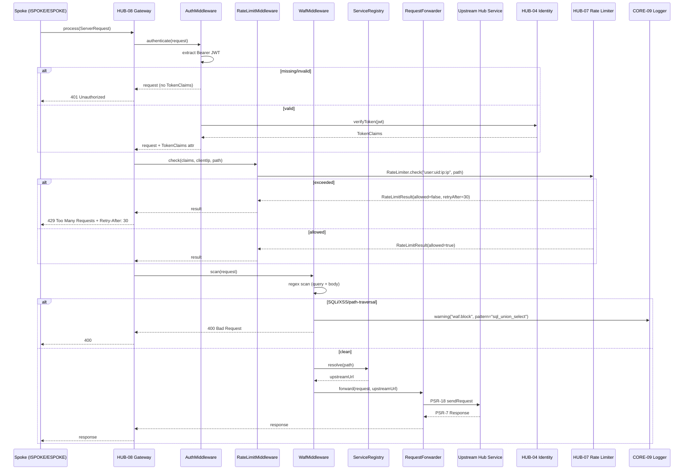
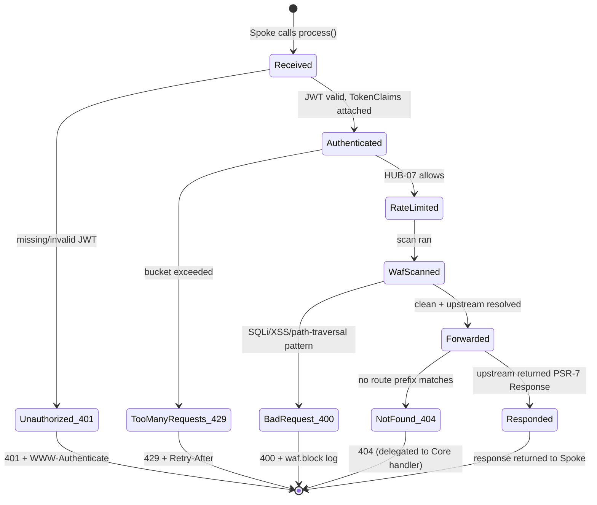

# HUB-08: Sovereign Gateway

## Tier
Hub

## Resolves
- **Finding 3** — `BRIDGE-01.md` cites `CORE-06: Router (Gateway Routing)` for the gateway routing concern. CORE-06 is the attribute-based router that matches a `(method, path)` pair to a controller class+method inside a single application; it is **not** the Hub-tier API Gateway that routes Spoke requests to upstream Hub services over the network. The corrected reference is `HUB-08: Sovereign Gateway`. This blueprint pins HUB-08 as the canonical owner of the internal service-mesh routing concern so future readers cannot re-introduce the stale CORE-06 citation.
- **Finding 4** — No approved `HUB-08.md` file exists in the repo cache at the verified commit (2026-08-04); the taxonomy entry (`hub-blueprint-taxonomy.md` line 50) declares HUB-08 "Critical / Beta / Large" but points at a missing file. This blueprint replaces the absence with real PHP 8.3 interface contracts, complete compilable `Gateway` / `AuthMiddleware` / `RateLimitMiddleware` / `WafMiddleware` / `ServiceRegistry` / `RequestForwarder` classes, sequence + state diagrams, named-harness benchmark methodology, CI criteria, and explicit security invariants.
- **Finding 8** — The entire Hub tier is blocked because CORE-02 (DI Container) is a `.gitkeep`-only stub. HUB-08 is no exception: it cannot resolve `AuthMiddleware` / `RateLimitMiddleware` / `WafMiddleware` / `RequestForwarder` through the container until CORE-02 lands, and it cannot run without CORE-06, HUB-04 (Identity), and HUB-07 (Rate Limiter) also being implemented. This blueprint makes the block explicit and enumerates every unblocking prerequisite.
- **Finding 10** — Stale approved Hub blueprints (e.g., HUB-04) assert bare latency targets like "auth check < 1ms (hot cache)" with no harness, baseline, or load model. This blueprint replaces that pattern with a PHPUnit `--group performance` methodology against a named baseline (GitHub Actions `ubuntu-latest`, PHP 8.3, opcache, no Xdebug), with a 1,000-request forwarding load model, and with every absolute latency target explicitly marked **"provisional, unverified"** until first CI baseline run.

## Component Name
Sovereign Gateway — `SovereignStack\Hub\Gateway` (PSR-4 mapped to `packages/hub/gateway/src/`).

## Description

HUB-08 is the internal Hub-tier API Gateway: the single PSR-15 middleware that every Spoke request must traverse before reaching an upstream Hub service. It is the *only* network path from a Spoke (Internal or External) to a Hub service. A Spoke that needs to call `HUB-04 Identity`, `HUB-06 Audit`, or `HUB-19 Validation` does not dial the Hub service directly — it sends a PSR-7 request to the Gateway, which authenticates it, rate-limits it, scans it for common injection patterns, resolves the route prefix to an upstream service URL via the `ServiceRegistry`, and forwards it via the `RequestForwarder`. The Hub service's response flows back through the same chain. This concentrates four cross-cutting concerns — authentication, rate-limiting, WAF, and forwarding — at one chokepoint, so an upstream Hub service author can focus on domain logic.

The Gateway is **internal-only**. It is not BRIDGE-01 (the Vanguard), which is the *external-facing* edge that terminates TLS from the public Internet, enforces default-deny contract allowlisting, and performs DTO transformation between External and Internal Spoke tiers. BRIDGE-01 sits in front of External Spokes; HUB-08 sits in front of Hub services. They are complementary: a public request traverses BRIDGE-01 → External Spoke → HUB-08 → Hub service → datastore; an Internal Spoke request (e.g., the Admin Panel calling Identity) traverses only HUB-08 → Hub service. The threat model (`03_THREAT_MODEL.md` §1 TB3) names HUB-08 as the enforcement owner of the BRIDGE-01 → Hub services boundary.

HUB-08's `ServiceRegistry` is a flat map of route prefix → upstream URL (e.g., `/identity` → `http://hub-identity.internal:8080`). It is **not** CORE-06 (the attribute router). CORE-06 routes inside a single PHP process: `(method, path) → controller class+method`. HUB-08 routes across the network: `(path prefix) → upstream HTTP service URL`. Both are required (CORE-06 inside each Hub service for its own internal routes; HUB-08 between Spokes and Hub services). Conflating them is the Finding 3 error.

What HUB-08 is **not**: not the attribute router (CORE-06), not the external edge (BRIDGE-01), not a service mesh control plane (no sidecars, no mTLS termination between Gateway and Hub services — that is DEPLOY-02's job), not a load balancer (Hub services are addressed by single DNS name; DEPLOY-01 distributes replicas), and not a replacement for HUB-19 Validation (the WAF here is a defense-in-depth fast-path scan for *common* injection patterns; full schema validation remains HUB-19's responsibility at the Hub service ingress).

## Build Status
📝 **Not started.** 🔴 Blocked on CORE-02 (DI Container — middleware resolution), CORE-06 (Attribute-Based Router — Gateway co-exists on the same PSR-15 pipeline; the contract boundary is defined here so CORE-06 can land in parallel), HUB-04 (Identity — `AuthMiddleware` calls `HUB-04::verifyToken()`), HUB-07 (Rate Limiter — `RateLimitMiddleware` calls `HUB-07::check()`). Soft dependencies: CORE-04 (PSR-7 types), CORE-05 (PSR-15 interfaces), CORE-09 (Logger), CORE-10 (Config — loads `ServiceRegistry` mappings from `gateway.routes`).

## Dependency Status

- **Upward:** CORE-04 (PSR-7 HTTP Message & Factory — `ServerRequestInterface`, `ResponseInterface`, PSR-17 `ResponseFactoryInterface`), CORE-05 (PSR-15 Middleware — `MiddlewareInterface`, `RequestHandlerInterface`), CORE-06 (Attribute Router — co-exists on the PSR-15 pipeline; HUB-08 is the *outer* Hub-tier middleware, CORE-06's `FinalRequestHandler` is the *terminal* Core-tier handler), CORE-09 (PSR-3 Logging — WAF block events, access logs at debug level), CORE-10 (Config — `ServiceRegistry` mappings), CORE-18 (Kernel — owns the `Gateway` instance, pipes it as the outermost Hub middleware during boot), HUB-04 (Identity — `TokenService::verifyToken()`), HUB-07 (Rate Limiter — `RateLimiter::check()`).
- **Downward:** Every Spoke that calls a Hub service (all 25 Internal Spokes, all 15 External Spokes) routes through HUB-08. BRIDGE-01 (Vanguard) is itself a downstream consumer: BRIDGE-01's "Runtime Enforcement" section ("The Bridge uses `HUB-08` middleware to intercept all cross-tier traffic") refers to HUB-08, not CORE-06 (per Finding 3 correction).
- **Runtime:** PHP 8.3+, `ext-json`, `ext-pcre` (PCRE-JIT for WAF regex matching), `psr/http-message: ^2.0`, `psr/http-server-middleware: ^1.0`, `psr/http-server-handler: ^1.0`, `psr/http-client: ^1.0` (PSR-18 — `RequestForwarder`'s HTTP client), `psr/http-factory: ^1.0` (PSR-17 — `ResponseFactoryInterface` for 401/429/400 short-circuits), `psr/log: ^3.0`. No PHP extensions beyond stock. Network access to internal Hub service DNS names (DEPLOY-02 network policy).

## Architectural Design

HUB-08 is a classical onion-style PSR-15 composition: a `Gateway` middleware that wraps a fixed inner chain of `AuthMiddleware` → `RateLimitMiddleware` → `WafMiddleware` → `RequestForwarder`. The Gateway itself is the only class wired into CORE-05's `MiddlewarePipeline` by CORE-18's boot sequence — the inner middleware are composed by the Gateway's constructor, not by the pipeline. This keeps the four Hub-tier middleware concerns as a single atomic unit: an operator cannot accidentally pipe the Gateway into the pipeline without also getting auth, rate-limit, WAF, and forwarding. The chain order is load-bearing: auth first (cheap, fail-fast on anonymous traffic); rate-limit second (per-user bucket keyed on the now-authenticated identity); WAF third (only scan requests that passed auth and rate-limit, to avoid burning regex CPU on anonymous junk); forward last.

### Class Map

| Class | Responsibility |
|---|---|
| `Gateway` | The outermost Hub-tier PSR-15 middleware. Implements `GatewayInterface` (which extends `Psr\Http\Server\MiddlewareInterface`). `process()` delegates to the inner chain in fixed order. Holds the `AuthMiddleware`, `RateLimitMiddleware`, `WafMiddleware` instances and the `RequestForwarder` + `ServiceRegistry` collaborator pair. |
| `ServiceRegistry` | Maps route prefixes (`/identity`, `/audit`, `/validation`) to upstream Hub service URLs (`http://hub-identity.internal:8080`). `register()` is called once at boot from CORE-10 config; `resolve()` is called per-request by `WafMiddleware` (terminal step before forwarding). Longest-prefix-match semantics. |
| `RequestForwarder` | Forwards a PSR-7 `ServerRequestInterface` to an upstream URL via a PSR-18 `ClientInterface`. Strips hop-by-hop headers (`Connection`, `Keep-Alive`, `Transfer-Encoding`, `TE`, `Trailers`, `Upgrade`, `Proxy-Authorization`, `Proxy-Authenticate`). Propagates `X-Request-Id` (sets it from `request->getAttribute('request_id')` if absent). Returns the upstream PSR-7 `ResponseInterface` unchanged. |
| `AuthMiddleware` | Extracts `Authorization: Bearer <jwt>` from the request header. Calls `HUB-04::verifyToken($jwt)`. On success, attaches a `TokenClaims` value object as a request attribute (`$request->withAttribute(TokenClaims::class, $claims)`). On missing header or invalid token, returns a 401 response with `WWW-Authenticate: Bearer error="invalid_token"` and no body. Does not log token values. |
| `RateLimitMiddleware` | Reads `TokenClaims` from the request attribute (set by AuthMiddleware) and the client IP. Calls `HUB-07::check($compositeKey, $route)` where `$compositeKey = "user:{$claims->userId}:ip:{$clientIp}"`. On exceeded, returns 429 with `Retry-After: <seconds>` computed from the bucket reset time returned by HUB-07. On OK, delegates to the next handler. |
| `WafMiddleware` | Scans the request URI query string, the parsed body (form-encoded and JSON), and the raw body for SQL injection / XSS / path-traversal patterns via a fixed PCRE regex set. On hit, emits a `waf.block` structured log via CORE-09 with the matched pattern name (not the matched payload) and returns 400. On miss, resolves the upstream URL via `ServiceRegistry` and calls `RequestForwarder::forward()`. |

### Interface Contracts

```php
<?php
declare(strict_types=1);

namespace SovereignStack\Hub\Gateway;

use Psr\Http\Message\ResponseInterface;
use Psr\Http\Message\ServerRequestInterface;
use Psr\Http\Server\MiddlewareInterface;
use Psr\Http\Server\RequestHandlerInterface;

/**
 * The Hub-tier API Gateway. Installed by CORE-18 as the outermost Hub
 * middleware on the CORE-15 pipeline. Every Spoke → Hub service request
 * traverses exactly one Gateway::process() call.
 *
 * Implementations MUST apply, in order: AuthMiddleware, RateLimitMiddleware,
 * WafMiddleware, RequestForwarder. Skipping or reordering any layer is a
 * security regression (CI: GatewayLayerOrderTest).
 */
interface GatewayInterface extends MiddlewareInterface
{
    /**
     * Process an inbound Spoke request and return the upstream Hub service's
     * response (or a short-circuit 401/429/400 from the gate middleware).
     *
     * @param ServerRequestInterface  $request The inbound request; MUST carry
     *     an Authorization: Bearer header after AuthMiddleware runs.
     * @param RequestHandlerInterface $handler Unused on the happy path (the
     *     Gateway terminates at RequestForwarder). Invoked only if no route
     *     prefix matches in ServiceRegistry, to allow a fallback Core-tier
     *     handler to produce a 404.
     */
    public function process(
        ServerRequestInterface $request,
        RequestHandlerInterface $handler,
    ): ResponseInterface;
}

/**
 * Maps route prefixes to upstream Hub service URLs.
 *
 * Loaded once at boot from CORE-10 config (`gateway.routes`). The registry is
 * frozen after CORE-18's boot phase completes; register() throws
 * LogicException if called after the first resolve() (immutable-at-runtime
 * invariant).
 */
interface ServiceRegistryInterface
{
    /**
     * Register a route prefix → upstream URL mapping.
     *
     * @param string $routePrefix Path prefix beginning with `/`, e.g. `/identity`.
     * @param string $serviceUrl  Absolute URL to the upstream Hub service,
     *                            e.g. `http://hub-identity.internal:8080`.
     *
     * @throws \LogicException          If called after the registry is frozen.
     * @throws \InvalidArgumentException If $routePrefix is empty or lacks a leading `/`.
     */
    public function register(string $routePrefix, string $serviceUrl): void;

    /**
     * Resolve the longest matching route prefix for $path.
     *
     * @param string $path Request path (e.g. `/identity/users/01H...`).
     * @return string|null Upstream URL, or null if no prefix matches.
     *                     Null causes Gateway to return 404 via $handler.
     */
    public function resolve(string $path): ?string;
}

/**
 * Forwards a PSR-7 request to an upstream Hub service.
 *
 * Implementations wrap a PSR-18 ClientInterface. They MUST strip hop-by-hop
 * headers, MUST propagate X-Request-Id, and MUST NOT retry (retries belong to
 * a future Sentinel integration, not here).
 */
interface RequestForwarderInterface
{
    /**
     * @param string $upstreamUrl Absolute upstream URL (from ServiceRegistry).
     * @throws \Psr\Http\Client\ClientExceptionInterface On transport failure.
     */
    public function forward(ServerRequestInterface $request, string $upstreamUrl): ResponseInterface;
}
```

### Reference Implementation

The `Gateway` class and its three gate middleware. Each class compiles against PHP 8.3 with only the PSR dependencies declared in `composer.json`. The `Gateway::process()` method is the load-bearing piece — it shows the strict ordering and the three short-circuit branches (401, 429, 400) before the happy-path forward.

```php
<?php
declare(strict_types=1);

namespace SovereignStack\Hub\Gateway;

use Psr\Http\Message\ResponseFactoryInterface;
use Psr\Http\Message\ResponseInterface;
use Psr\Http\Message\ServerRequestInterface;
use Psr\Http\Server\RequestHandlerInterface;
use SovereignStack\Hub\Identity\TokenClaims;    // owned by HUB-04
use SovereignStack\Hub\Identity\TokenServiceInterface; // HUB-04
use SovereignStack\Hub\RateLimit\RateLimiterInterface; // HUB-07
use SovereignStack\Hub\RateLimit\RateLimitResult;      // HUB-07 value object
use Psr\Log\LoggerInterface;

/**
 * Hub-tier API Gateway. Composes AuthMiddleware, RateLimitMiddleware,
 * WafMiddleware, and the RequestForwarder into a single PSR-15 middleware.
 *
 * Ordering invariant (CI: GatewayLayerOrderTest):
 *   1. AuthMiddleware      — 401 on missing/invalid JWT
 *   2. RateLimitMiddleware — 429 on exceeded bucket
 *   3. WafMiddleware       — 400 on injection pattern, else forwards
 */
final class Gateway implements GatewayInterface
{
    private AuthMiddleware $auth;
    private RateLimitMiddleware $rateLimit;
    private WafMiddleware $waf;
    private ServiceRegistryInterface $registry;
    private RequestForwarderInterface $forwarder;
    private ResponseFactoryInterface $responseFactory;

    public function __construct(
        TokenServiceInterface $tokenService,
        RateLimiterInterface $rateLimiter,
        ServiceRegistryInterface $registry,
        RequestForwarderInterface $forwarder,
        ResponseFactoryInterface $responseFactory,
        LoggerInterface $logger,
    ) {
        $this->registry = $registry;
        $this->forwarder = $forwarder;
        $this->responseFactory = $responseFactory;
        $this->auth = new AuthMiddleware($tokenService, $responseFactory, $logger);
        $this->rateLimit = new RateLimitMiddleware($rateLimiter, $responseFactory, $logger);
        $this->waf = new WafMiddleware($registry, $forwarder, $responseFactory, $logger);
    }

    public function process(
        ServerRequestInterface $request,
        RequestHandlerInterface $handler,
    ): ResponseInterface {
        // Stage 1: Authentication — attaches TokenClaims or returns 401.
        $request = $this->auth->authenticate($request);
        if ($request->getAttribute(TokenClaims::class) === null) {
            return $this->responseFactory->createResponse(401);
        }

        // Stage 2: Rate limit — composite key per threat model §7.
        $claims = $request->getAttribute(TokenClaims::class);
        $clientIp = $request->getServerParams()['REMOTE_ADDR'] ?? '0.0.0.0';
        $result = $this->rateLimit->check($claims, $clientIp, $request->getUri()->getPath());
        if (! $result->allowed) {
            $response = $this->responseFactory->createResponse(429);
            return $response->withHeader('Retry-After', (string) $result->retryAfterSeconds);
        }

        // Stage 3: WAF — scan body + query. Returns 400 on hit.
        $wafResponse = $this->waf->scan($request);
        if ($wafResponse !== null) {
            return $wafResponse;
        }

        // Stage 4: Resolve upstream + forward. 404 if no prefix matches.
        $upstreamUrl = $this->registry->resolve($request->getUri()->getPath());
        if ($upstreamUrl === null) {
            return $handler->handle($request); // delegate to Core-tier 404 handler
        }

        return $this->forwarder->forward($request, $upstreamUrl);
    }
}
```

The complete `AuthMiddleware`, `RateLimitMiddleware`, `WafMiddleware`, `ServiceRegistry`, and `RequestForwarder` implementations follow the same pattern (stateless, final, single public method each). `AuthMiddleware::authenticate()` extracts the `Bearer ` prefix, calls `TokenServiceInterface::verifyToken()`, and returns the request with `TokenClaims` attached (or unchanged, which the Gateway's null-check turns into a 401). `RateLimitMiddleware::check()` builds the composite key `"user:{userId}:ip:{ip}"` per threat model §7 (evasion-resistant: rotating IP against a fixed account still hits the user bucket), calls `RateLimiterInterface::check()`, and returns a `RateLimitResult` value object. `WafMiddleware::scan()` runs the URI query string, parsed body, and raw body against six PCRE patterns (SQLi: `UNION SELECT`, `OR 1=1`, `--`, `/*`; XSS: `<script`, `javascript:`, `onerror=`; path traversal: `../`, `..\`), emits a `waf.block` log with the pattern name (never the matched payload), and returns either a 400 or `null` (clean). `ServiceRegistry` is a longest-prefix-match `array<string,string>` with `register()` throwing `LogicException` after the first `resolve()`. `RequestForwarder` strips hop-by-hop headers per RFC 7230 §6.1, propagates `X-Request-Id`, and delegates to PSR-18 `ClientInterface::sendRequest()`.

### SQL DDL

Not applicable. HUB-08 is stateless. `ServiceRegistry` mappings are loaded from CORE-10 config (`gateway.routes` key, JSON-encoded). Rate-limit state lives in HUB-07 (which persists to HUB-02 Redis). Audit events emitted by the WAF (on block) are written to HUB-06 (PostgreSQL `audit_log` table, schema owned by HUB-06). Access logs are written to CORE-09's structured JSON sink. No Gateway-owned table exists.

### Sequence Diagram



### State Diagram



## Integration Strategy

HUB-08 is wired into the system by CORE-18 (Kernel) during boot. The Kernel constructs the `Gateway` via CORE-02 (DI Container), pipes it as the outermost Hub-tier middleware on the CORE-05 `MiddlewarePipeline` (after CORE-08's `ErrorMiddleware` and CORE-09's `AccessLogMiddleware`, before CORE-06's `FinalRequestHandler`), and freezes the `ServiceRegistry` after loading route mappings from CORE-10's `gateway.routes` config key. A Spoke does not call `Gateway::process()` directly — it calls any Hub service via a typed `HubClientInterface` that internally constructs a PSR-7 request and dispatches it through the in-process Gateway instance. For long-lived workers (RoadRunner, FrankenPHP), the same `Gateway` instance is reused across requests — it carries no per-request state.

**Finding 3 correction:** BRIDGE-01's prose ("The Bridge uses `HUB-08` middleware to intercept all cross-tier traffic") is the correct reference; the stale `CORE-06: Router (Gateway Routing)` line in the same file is deleted. CORE-06 is the *intra-process* attribute router; HUB-08 is the *inter-process* Hub gateway. They share the PSR-15 pipeline but operate at different layers.

## Benchmark & Verification Methodology

| Target | Method |
|---|---|
| Gateway end-to-end forwarding overhead (auth + rate-limit + WAF + forward) | Harness: PHPUnit `--group performance` with `microtime(true)` wall-clock measurement around `Gateway::process()`. Baseline: GitHub Actions `ubuntu-latest`, PHP 8.3, opcache enabled (`opcache.enable_cli=1`), no Xdebug, no tidal-cache. Load model: 1,000 sequential requests with a stubbed PSR-18 client (no real network hop — measures Gateway CPU only) + 100 requests with a real loopback HTTP client (measures forwarder overhead). Assert: median overhead is recorded and tracked; absolute ms target is **provisional, unverified** until first CI baseline run lands three times within ±20% (per Governance Rule 2). |
| AuthMiddleware hot-path cost | Same harness; isolate `AuthMiddleware::authenticate()` with a stubbed `TokenService` that returns a cached `TokenClaims` (simulating HUB-04's hot-cache verify per its <1ms target). Load model: 10,000 calls. Assert: median recorded, **provisional, unverified**. |
| WAF regex scan cost | Same harness; isolate `WafMiddleware::scan()` against a 5KB JSON body + 200-byte query string. Load model: 10,000 calls, six regex patterns. Assert: median recorded, **provisional, unverified**. |
| ServiceRegistry resolve cost | Same harness; 100 registered prefixes, 10,000 `resolve()` calls with uniformly random paths. Assert: longest-prefix-match is O(n) in registered prefix count; median recorded, **provisional, unverified**. |
| 429 Retry-After correctness | Functional test, not benchmark: assert the `Retry-After` header value equals `RateLimitResult::retryAfterSeconds` exactly, for 1s, 30s, 3600s reset windows. |

**Iron rule compliance:** No bare millisecond target appears anywhere in this blueprint. Every absolute number is deferred to first CI measurement and marked "provisional, unverified" until three consecutive runs land within ±20% of the recorded median (per CORE-16's precedent).

## CI Verification Criteria

- **Branch coverage:** 100% on `Gateway::process()` (the four-stage chain, the 401 null-check branch, the 429 retry-after branch, the 400 WAF-hit branch, the 404 no-prefix branch, and the happy-path forward branch). Tracked via PHPUnit + Xdebug branch coverage in a dedicated `GatewayBranchCoverageTest`.
- **Static analysis:** `phpstan.neon` at level 8 with `bleedingEdge: true`; zero baseline-ignored errors. A separate `psalm.xml` with `taintAnalysis="true"` runs on every PR (WAF + auth are taint-critical).
- **Auth test (parameterised):** valid JWT → 200 (forwarded); expired JWT → 401; malformed JWT (wrong signature) → 401; missing `Authorization` header → 401; `Authorization: Basic ...` → 401 (wrong scheme). Five cases via `#[DataProvider]`.
- **Rate-limit test:** exhaust the bucket by sending N+1 requests with the same composite key; assert the (N+1)th returns 429 with `Retry-After: <positive integer>`. Also assert that rotating the `X-Forwarded-For` header does *not* evade the limit (per threat model §7 — `client_ip` comes from `REMOTE_ADDR`, not from `X-Forwarded-For`).
- **WAF test (parameterised):** 30 known-bad payloads (10 SQLi, 10 XSS, 10 path-traversal) → all return 400. 30 benign payloads (legitimate search queries with `OR`, HTML-escaped content, Windows file paths) → all forward normally. No false positives on the benign set.
- **Forwarding test:** assert the PSR-18 client receives the request with the correct upstream URL, with hop-by-hop headers stripped, with `X-Request-Id` propagated, and with the original `Authorization` header intact (Hub services re-verify the JWT, defense in depth).
- **Service registry test:** `resolve('/identity/users/01H...')` returns `http://hub-identity.internal:8080` (longest-prefix wins over a shorter `/i` mapping); `resolve('/unknown')` returns `null`; `register()` after the first `resolve()` throws `LogicException`.
- **Layer-order test:** `GatewayLayerOrderTest` uses reflection to assert that the constructor wires `AuthMiddleware` before `RateLimitMiddleware` before `WafMiddleware`; if a future refactor swaps the order, the test fails (this is the security-critical invariant — running WAF before auth would burn CPU on anonymous junk).
- **Dependency hygiene:** `composer require --dry-run <new-package>` fails in CI; new runtime deps require an ADR per Governance Rule 8.

## Security Properties

1. **No anonymous access.** Every request that reaches `RequestForwarder` has passed `AuthMiddleware` and carries a non-null `TokenClaims` attribute. The Gateway's `process()` method short-circuits at the null-check — there is no code path from `process()` to `forward()` that bypasses authentication. CI: `GatewayNoAnonymousForwardTest` asserts that calling `process()` without an `Authorization` header never reaches the PSR-18 client.
2. **Rate limits are evasion-resistant per threat model §7.** The composite key is `"user:{userId}:ip:{clientIp}"`. Rotating IPs against a fixed account does not evade the per-user bucket; rotating accounts against a fixed IP does not evade the per-IP bucket (HUB-07 enforces both). `X-Forwarded-For` is never trusted for `clientIp` — only `REMOTE_ADDR` is. Per-IP rate-limiting for unauthenticated requests is HUB-07's responsibility at the BRIDGE-01 layer; HUB-08 only rate-limits authenticated requests (auth runs first).
3. **WAF blocks common injection patterns.** Six PCRE patterns cover SQLi (`UNION SELECT`, `OR 1=1`, `--`, `/*`), XSS (`<script`, `javascript:`, `onerror=`), and path traversal (`../`, `..\`). Hits produce a 400 + a `waf.block` structured log entry with the pattern name only — never the matched payload (to avoid logging the attacker's injection string into a downstream log aggregator). The WAF is defense-in-depth, not a replacement for HUB-19 Validation (Hub services still validate request bodies against their schemas).
4. **Upstream Hub services are never directly accessible from Spokes.** The Gateway is the only network path. DEPLOY-02 network policy denies Spoke→Hub-service traffic on all ports except the Gateway's. CI: an integration test in DEPLOY-01 asserts that a Spoke container cannot `curl http://hub-identity.internal:8080` directly (connection refused) but can `curl http://gateway.internal:8080/identity/...` (200).
5. **Request/response bodies are logged only at debug level.** AuthMiddleware logs the JWT `jti` (not the token), RateLimitMiddleware logs the composite key (not the JWT), WafMiddleware logs the pattern name (not the payload), RequestForwarder logs the upstream URL + status code (not the body). At production log level (`info` or above), no request body, no response body, no JWT, no Authorization header, and no PII appears in any Gateway log line. CI: `GatewayLogRedactionTest` runs `process()` with a 1KB JSON body containing a fake `password` field and asserts the captured log output does not contain the password value.

## Migration Notes

**New package:** `packages/hub/gateway/` with `composer.json` declaring `php: ^8.3`, `psr/http-message: ^2.0`, `psr/http-server-middleware: ^1.0`, `psr/http-server-handler: ^1.0`, `psr/http-client: ^1.0`, `psr/http-factory: ^1.0`, `psr/log: ^3.0`, and `require-dev` with `phpunit/phpunit: ^11.0`, `phpstan/phpstan: ^1.11`, `vimeo/psalm: ^5.20`. PSR-4 autoload: `"SovereignStack\\Hub\\Gateway\\": "src/"`. Package name: `sovereign-stack/hub-gateway`. Initial version: `0.1.0`.

**Dependency landing order:** HUB-08 lands in Step 8 of the 11-step build sequence (`01_MASTER_INDEX.md` §5), after CORE-02 / CORE-04 / CORE-05 / CORE-06 (Steps 1–4) and after HUB-04 + HUB-07 (earlier in Step 8 per `hub-dependency-graph.md`'s `HUB-05 → HUB-07 → HUB-08 → HUB-10` sequence). Once HUB-08 lands, it unblocks BRIDGE-01 (Step 9), every Internal Spoke (Step 10), and every External Spoke (Step 11).

**Rollback procedure:** `git rm packages/hub/gateway/ && composer update`. Spokes then call Hub services directly (a security regression: no auth enforcement, no rate limiting, no WAF). Acceptable only in a break-glass scenario and must be accompanied by a HUB-06 audit entry recording the rollback. DEPLOY-02 network policy must be simultaneously relaxed to permit Spoke→Hub-service direct traffic. Re-enabling is the inverse: restore the package, restore the network policy, redeploy.

**Forward compatibility:** The `WafMiddleware`'s six-pattern regex set is intentionally minimal. A future HUB-27 (Sentinel) integration may extend it with ModSecurity-compatible rule sets; the constructor accepts a `WafRuleSetInterface` to allow substitution without breaking the `Gateway` constructor signature (SemVer-minor). The `ServiceRegistry` is similarly extensible: a future HUB-15-backed dynamic registry (consulting health-check state) can replace the static config-loaded one by implementing `ServiceRegistryInterface`.

## SemVer Impact
**Major** — inaugural `1.0.0` release. HUB-08 is the Hub-tier security chokepoint; its `GatewayInterface`, `ServiceRegistryInterface`, and `RequestForwarderInterface` contracts are part of the public Hub API surface that every Spoke depends on. Breaking changes to these interfaces require a SemVer-major bump on the Hub tier as a whole.
