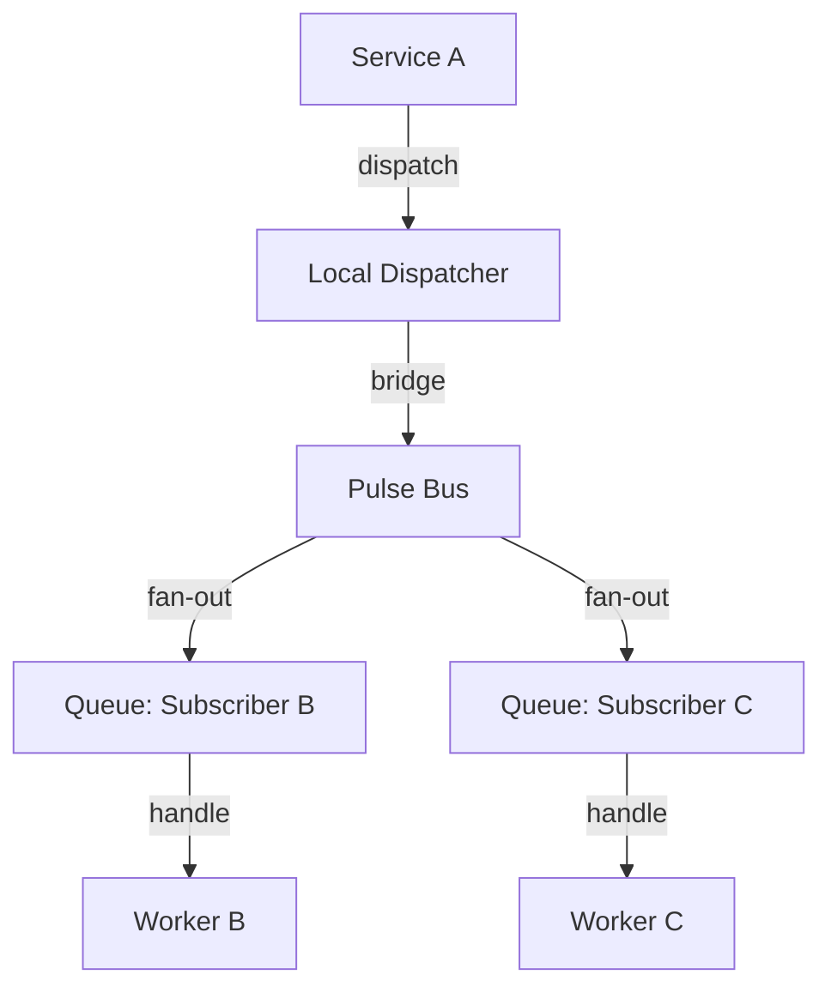

# PHASE HUB-09: Event Bus / Message Broker

## Tier
Hub (Shared Services)

## Resolves
Adds a stated delivery-guarantee benchmark method (Finding 10) and clarifies the relationship to
`HUB-17` (Webhook Nexus), which publishes onto this bus but was previously only linked in one
direction.

## Component Name
Sovereign Pulse (Event Bus)

## Description
Global message broker and event bus for decoupled communication between Hub services and Spoke
applications, extending `CORE-03`'s local Event Dispatcher to distributed pub/sub across multiple
repositories and processes.

## Build Status
🔴 **Blocked** on `CORE-03` (Event Dispatcher — already implemented and tested, see
`packages/core/event-dispatcher/`), `HUB-02` (Cache), `HUB-10` (Queue). Of this tier's dependencies,
`CORE-03` is the one already real — this is closer to buildable than most Hub components once `HUB-02`
and `HUB-10` land.

## Dependency Status
- **Upward:** `CORE-03`, `HUB-02`, `HUB-10`. *(Matches taxonomy.)*
- **Downward:** `HUB-17` (publishes `WebhookReceivedEvent` onto this bus), `HUB-22` (publishes
  `SubscriptionUpdated`), any Spoke reacting to Hub-tier state changes (e.g., clearing local cache when
  `HUB-01` config changes).

## Architectural Design
- **EventBus** — global coordinator for cross-repository events.
- **SubscriberRegistry** — map of "interests" per Spoke/service.
- **PulseBridge** — connects local `CORE-03` events to the global bus.
- **DeadLetterQueue** — events failing delivery after retries (see `docs/queue-patterns/`
  `dead-letter-handling.md` for the retry/backoff/poison-pill pattern this should reuse rather than
  reinvent — `HUB-10`'s queue infrastructure sits underneath both this and general job dispatch).



```php
namespace SovereignStack\Hub\Contracts;

interface EventBusInterface
{
    public function publish(GlobalEvent $event): void;
    public function subscribe(string $eventPattern, callable|string $handler): void;
}
```

## Integration Strategy
- **Upward:** wraps `CORE-03`.
- **Downward:** Spoke applications register global listeners for Hub-tier triggers.
- **Asynchronicity:** relies on `HUB-10` so heavy listeners never block the publishing service —
  reuse `HUB-10`'s dead-letter and retry-backoff mechanics (see `docs/queue-patterns/`) rather than
  building a second, parallel retry system specific to Pulse.

## Benchmark & Verification Methodology
| Target | Method |
|---|---|
| At-least-once delivery | Integration test: publish an event, kill a subscriber worker mid-processing, assert the event is redelivered (not lost) per the retry pattern in `dead-letter-handling.md`. |
| Fan-out non-blocking | Integration test: publish to 5 subscribers where one is deliberately slow; assert `publish()` itself returns quickly (state the actual measured time, don't restate "< 5ms" unmeasured — Finding 10) and the slow subscriber doesn't delay the other four. |
| Subscriber isolation | Integration test: one subscriber throws on handling; assert other subscribers for the same event still receive and process it, and the failure lands in the DLQ per the poison-pill detection heuristics in `dead-letter-handling.md`. |

## CI Verification Criteria
- At-least-once delivery test, blocking.
- Subscriber isolation / poison-pill routing test, blocking.
- Fan-out latency measured and reported with environment stated.

## SemVer Impact
**Minor.** Essential for scalable, decoupled communication within the polyrepo.
