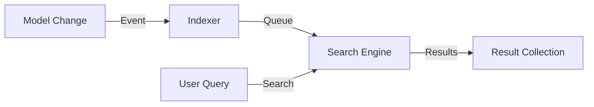

# PHASE HUB-14: Search Abstraction Layer

## Tier
Hub (Shared Services)

## Resolves
Adds stated benchmark methodology and a concrete degraded-mode contract (Finding 10; also closes the
vague "must fall back... without crashing" language into a testable behavior).

## Component Name
Sovereign Search

## Description
Unified full-text search abstraction over Database (LIKE/Fulltext), Meilisearch, or Elasticsearch
backends, so Spoke applications get advanced search without backend lock-in.

## Build Status
🔴 **Blocked** on `CORE-19` (DBAL) and `HUB-10` (Queue) — neither implemented.

## Dependency Status
- **Upward:** `CORE-19`, `HUB-10`. *(Matches taxonomy.)*
- **Downward:** `HUB-08` (exposes "Global Search" via Gateway), any Spoke implementing
  `SearchableInterface`.

## Architectural Design
- **SearchManager** — factory resolving search engines.
- **IndexableTrait** — auto-syncs model data to the index via `HUB-10` queues.
- **SearchQuery** — fluent builder for filters/facets/sorting.
- **EngineInterface** — contract search backends implement.



```php
namespace SovereignStack\Hub\Contracts;

interface SearchInterface
{
    public function search(string $index, string $query): SearchBuilder;
    public function update(string $index, array $records): void;
    public function delete(string $index, array $ids): void;
}
```

## Degraded-Mode Contract (tightened)
"Must fall back to a database search or return empty without crashing" is now specific:
`SearchManager` wraps the configured engine in the same circuit-breaker pattern specified in
`HUB-08.md` (shared state via `HUB-02`); when the breaker is open, `search()` transparently routes to
the Database driver rather than raising, and the response includes a `degraded: true` flag so callers
(and `ISPOKE` dashboards) can surface that results may be less relevant than usual — not indistinguishable
from a normal empty result set.

## Integration Strategy
- **Upward:** `HUB-10` for async indexing.
- **Downward:** Spoke applications implement `SearchableInterface`.
- **UI:** "Global Search" API via `HUB-08`.

## Benchmark & Verification Methodology
| Target | Method |
|---|---|
| Index consistency lag | Integration test: update a record, poll the search index; report the actual measured lag on a stated reference setup instead of asserting "within 5 seconds" unmeasured (Finding 10). |
| Driver parity | Integration test running the identical query fixture set against both the Database and Meilisearch drivers; assert result sets overlap above a stated threshold (exact parity isn't expected across engines with different relevance models — define and test the threshold explicitly rather than leaving "comparable results" undefined). |
| Degraded-mode fallback | Integration test: force the primary engine's circuit breaker open; assert `search()` returns Database-driver results with `degraded: true`, not an exception and not a silent, indistinguishable result. |

## CI Verification Criteria
- Degraded-mode fallback test, blocking.
- Driver-parity test with an explicit, stated overlap threshold.
- Index-lag measured and reported with environment stated.

## SemVer Impact
**Minor.** Adds advanced discovery capabilities to the stack.
