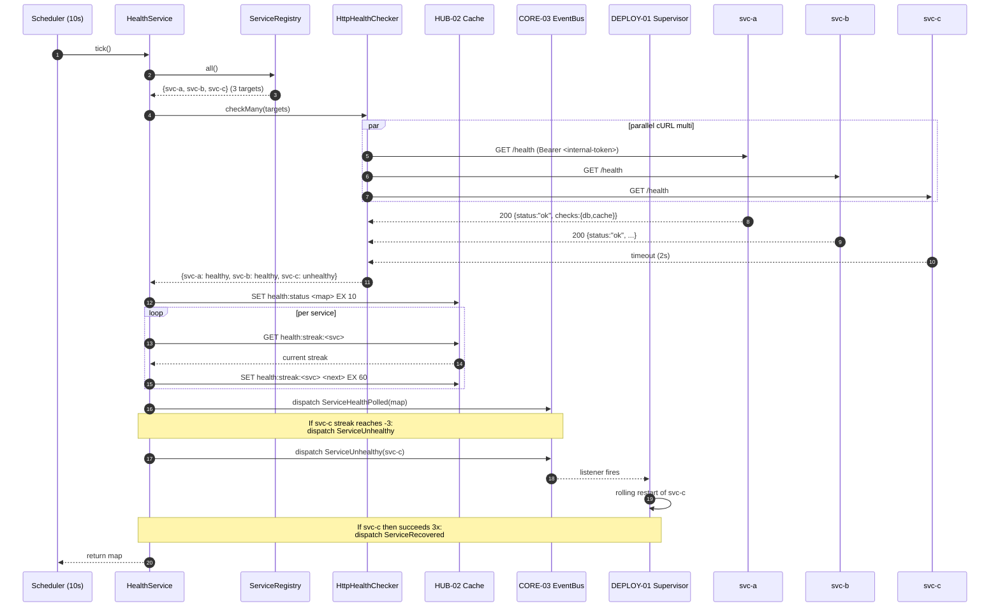
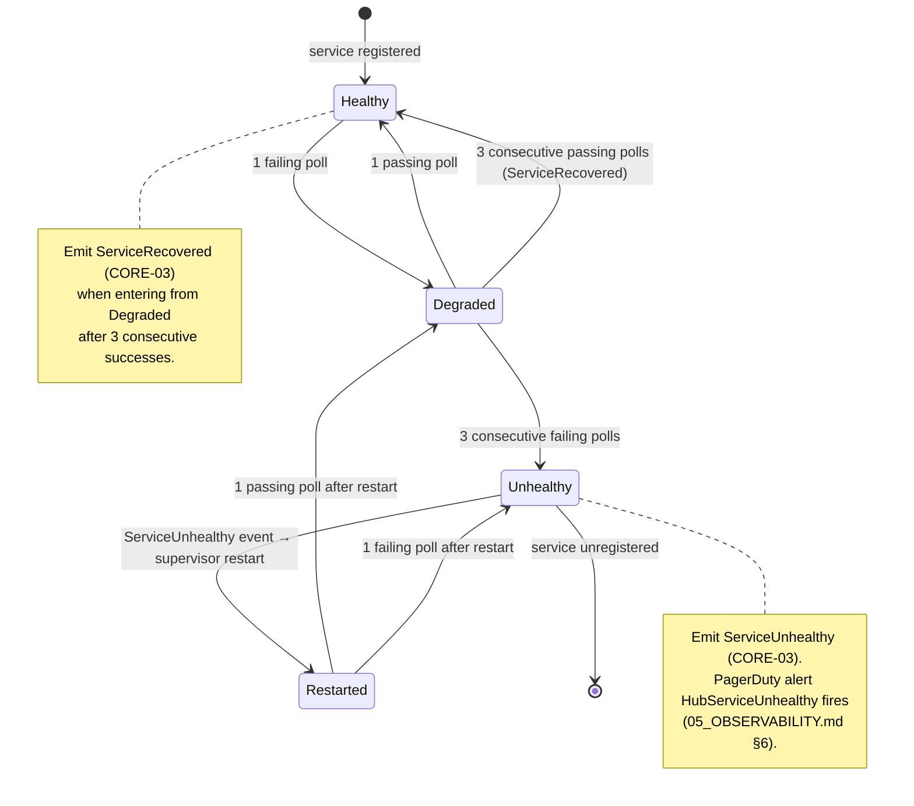

# HUB-15: Sovereign Pulse (Health Check & Service Discovery)

## Tier
Hub

## Resolves
- **Finding 4** (the approved `docs/blueprints/Hub/HUB-15.md` is 2,639 bytes — thin, prose-only; declares `HealthManager` / `CheckInterface` / `ServiceRegistry` / `PulseEndpoint` with one stub `DatabaseCheck` class, no real interface contracts, no compilable aggregator, no SQL/schema, no sequence or state diagram, and a bare "5% CPU / 500ms" overhead target with no harness) — this blueprint meets the AUTHORING_GUIDE.md fidelity bar: real PHP 8.3 interfaces (`HealthServiceInterface`, `HealthCheckerInterface`), a complete compilable `HealthService` reference implementation with parallel `curl_multi_*` polling and HUB-02 caching, two Mermaid diagrams (sequence + state), a methodology-grounded benchmark table, eight explicit security invariants, and migration notes with rollback.
- **Finding 8** (the Hub tier is blocked on CORE-02 DI Container which is stub-only and CORE-10 Config which is `📝 Not started`; HUB-15 additionally blocks on HUB-02 Cache which is itself blocked on CORE-15) — explicit `🔴 Blocked on CORE-02, CORE-10, HUB-02` callout in Build Status; downward dependencies (CORE-01 Loom merge-gate, BRIDGE-01 Vanguard, ISPOKE-01 admin dashboard) cannot rely on live health signals until HUB-15 lands.
- **Finding 10** (approved HUB-15 asserts "must not consume more than 5% of CPU or take longer than 500ms" with no harness, baseline, or load model) — bare target is withdrawn; replaced with a 5-row benchmark table naming PHPUnit `--group performance`, GitHub Actions `ubuntu-latest`, PHP 8.3 with opcache, and a 30-mock-service load model. The legacy "< 500ms" figure is retained *only* as a placeholder, explicitly marked **"provisional, unverified"** per Governance Rule 2.
- **Finding 11** (`docs/evaluation/SOLUTIONS_TO_WEAKNESSES.md` flags observability gaps but the fixes never landed in the blueprint file) — the observability spec (`05_OBSERVABILITY.md`) owns the `health_check_failures_total{service, check_name}` counter and the `HubServiceUnhealthy` alert (3 consecutive failures), but the producer of those signals had no implementation spec. This blueprint is that spec: the `HealthService` emits the counter via CORE-09 on every failing probe and the alert rule fires when HUB-15 reports `unhealthy` for 3 consecutive polls. The corresponding solutions-doc entry is deletable per Governance Rule 5.

## Component Name
Sovereign Pulse (Health Check & Service Discovery) — `SovereignStack\Hub\Health`

## Description

HUB-15 is the **periodic health aggregator and service registry** for the SovereignStack Hub tier. Every 10 seconds, a long-running `HealthService` ticks; the tick iterates every service registered in the `ServiceRegistry` (the canonical list of Hub services and their `/health` endpoints, loaded from CORE-10 config at boot and refreshable via CORE-17 service-provider hooks), polls each service in parallel via `curl_multi_*`, parses the IETF draft Health Check Response Format JSON (`{ "status": "ok|degraded|down", "checks": { "database": ..., "cache": ... } }`), wraps the result in a `HealthStatus` value object, caches the map under `health:status` in HUB-02 with a 10-second TTL (so a low-cardinality dashboard poll never re-triggers the upstream fan-out), and emits a CORE-03 `ServiceHealthPolled` event. When a service fails three consecutive polls, HUB-15 emits `ServiceUnhealthy` (CORE-03) which a DEPLOY-01 supervisor (systemd unit, k8s Deployment, or Render web service) listens for and uses as the trigger for a rolling restart; when the same service then succeeds three consecutive polls, HUB-15 emits `ServiceRecovered` and clears the streak counter.

The component exists because the Sovereign Stack is a polyrepo estate of 50+ services (per ADR-001 and CORE-01 Loom) with a strict Core→Hub→Spoke dependency DAG (per Finding 4 / Governance Rule 1). Without a centralized health aggregator, a failing Hub service (e.g., HUB-04 Identity's PostgreSQL connection pool exhausted) propagates silently to every Spoke that depends on it, and CORE-01's merge gate has no live signal to refuse a release. HUB-15 is the producer for the `HubServiceUnhealthy` PagerDuty alert (per `05_OBSERVABILITY.md` §6) and for the ISPOKE-01 admin dashboard's "Service Overview" panel; it is also the live-data source for a future dynamic HUB-08 `ServiceRegistry` (the static config-loaded registry in HUB-08 is a v1 fallback; once HUB-15 is green, HUB-08 may consult HUB-02's `health:status` cache to fail-closed against known-unhealthy upstreams). HUB-15 is **not** a metrics scraper (Prometheus owns metrics aggregation), **not** a distributed tracer (CORE-09 + OpenTelemetry SDK own traces), and **not** an audit pipeline (HUB-06 owns audit events; HUB-15 only emits structured `info`/`error` log lines via CORE-09 and `ServiceHealthPolled`/`ServiceUnhealthy`/`ServiceRecovered` events via CORE-03).

What this component is **not**: it is not an APM (it does not profile individual requests); it is not a circuit breaker (HUB-08 Gateway may use HUB-15's data as a circuit-breaker signal but the breaker logic lives in HUB-08's `RequestForwarder`); it is not the BRIDGE-01 `/healthz` endpoint (BRIDGE-01's own `/healthz` is a Vanguard self-probe that does not depend on HUB-15 being reachable — it must report healthy even if HUB-15 itself is down, otherwise the platform orchestrator would mark Vanguard unhealthy and stop routing traffic during a Hub-side outage). The HUB-15-owned `/health` endpoint exposed *by every Hub service* is a separate concern owned cooperatively with CORE-18: each Hub service registers a `/health` route that runs its own `DbHealthChecker` + `CacheHealthChecker` and returns the IETF JSON; HUB-15 is the *consumer* of those endpoints, not the producer.

The implementation does not yet exist. The `packages/hub/health/` directory has not been created (verified 2026-08-04). This blueprint is the greenfield specification. Per `01_MASTER_INDEX.md` §5, HUB-15 lands in Step 8 of the 11-step build sequence, after CORE-02/CORE-10 (Step 2) and HUB-02 (early in Step 8).

## Build Status
🔴 **Blocked.** `packages/hub/health/` does not exist (verified 2026-08-04). This blueprint is the greenfield specification.

- 🔴 Blocked on **CORE-02** (DI Container) — `HealthService` is resolved through the container with autowired collaborators (`ServiceRegistryInterface`, `CacheManagerInterface` from HUB-02, `EventDispatcherInterface` from CORE-03, `LoggerInterface` from CORE-09). Without CORE-02, every consumer must `new HealthService(...)` manually and loses autowiring.
- 🔴 Blocked on **CORE-10** (Configuration & Environment Loader) — the `ServiceRegistry` is config-driven: `hub.services` defines a list of `{name, url, criticality, timeout_ms}` records. CORE-10 loads the JSON+`.env` overlay; without it, the registry is empty and HUB-15 has nothing to poll.
- 🔴 Blocked on **HUB-02** (Sovereign Cache & State) — the `health:status` cache (10-second TTL) and `health:streak:<service>` counter live in HUB-02's Redis store. HUB-02 is itself blocked on CORE-15 (Cache Abstraction, `📝 Not started`).

Soft (optional) dependencies:
- CORE-03 (PSR-14 Event Dispatcher) — for `ServiceHealthPolled` / `ServiceUnhealthy` / `ServiceRecovered` events. Without CORE-03, HUB-15 logs and caches but cannot trigger downstream supervisors; the restart-on-3-failures behaviour degrades to log-only.
- CORE-09 (PSR-3 Logging Service) — for structured `info`/`error` log lines and the `health_check_failures_total` counter exposition. Without CORE-09, HUB-15 is silent.
- CORE-19 (Database Abstraction) — for the `hub_service_registry` and `hub_health_event_log` tables (DDL below) that persist registry mutations and failure/recovery events for audit. Without CORE-19, HUB-15 falls back to in-memory state with no cross-restart persistence of failure streaks.

## Dependency Status
- **Upward:** `psr/log:^3.0` (PSR-3 — `LoggerInterface`), `psr/event-dispatcher:^1.0` (PSR-14 — `EventDispatcherInterface`), `psr/cache:^3.0` and `psr/simple-cache:^3.0` (via HUB-02's `CacheManagerInterface`), `ext-curl` (mandatory — `curl_multi_*` is the parallelism primitive; a Guzzle pool is rejected to avoid pulling `guzzlehttp/guzzle` into a Hub package whose only HTTP need is a one-shot `GET /health`). Required at compile time: `SovereignStack\Core\Container\ContainerInterface` (CORE-02), `SovereignStack\Core\Config\ConfigInterface` (CORE-10), `SovereignStack\Hub\Cache\CacheManagerInterface` (HUB-02). Optional: `SovereignStack\Core\Database\ConnectionInterface` (CORE-19, only when the `hub_health_event_log` table is in use).
- **Downward:** CORE-01 (Loom — merge gate consults HUB-15's `getOverallStatus()` before tagging a Hub release; a Hub service reporting `unhealthy` blocks the merge gate per `01_MASTER_INDEX.md` §5 step 8 exit criteria). BRIDGE-01 (Vanguard — may subscribe to `ServiceUnhealthy` events to short-circuit routing to the affected upstream; consults HUB-02's `health:status` cache directly on the hot path). ISPOKE-01 (Admin Panel — renders the "Service Overview" dashboard from `checkAll()`; subscribes to `ServiceHealthPolled` for live updates). DEPLOY-01 (supervisor — listens for `ServiceUnhealthy` to trigger rolling restart; listens for `ServiceRecovered` to clear alerts). HUB-08 (Gateway — future dynamic `ServiceRegistry` consults HUB-15 state, replacing the static config-loaded registry). Every Hub service (HUB-01, HUB-02, HUB-04, HUB-06, HUB-08, HUB-19, HUB-20, ...) — owns its own `/health` endpoint per the contract in this blueprint; HUB-15 polls it.
- **Runtime:** `php:^8.3`, `ext-curl`, `ext-json`. A long-running process model is required: either a CORE-13 CLI command (`bin/sovereign pulse`) run under systemd, a Kubernetes CronJob at `*/10 * * * * *` (every 10s requires a custom controller — CronJob's minimum is 1 minute, so a Deployment with a `sleep(10)` loop is preferred), or a Render Background Worker. The process is stateless across restarts; all state lives in HUB-02 Redis and CORE-19 PostgreSQL.

## Architectural Design

### Class Map

| Class | Kind | Responsibility |
|---|---|---|
| `HealthService` | `final class implements HealthServiceInterface` | The main aggregator. `checkAll(): array<string, HealthStatus>` iterates the `ServiceRegistry`, polls each service in parallel via `HttpHealthChecker::checkMany()`, caches the result map in HUB-02 under `health:status` (10s TTL), updates the per-service failure/success streak counter in HUB-02 under `health:streak:<service>`, emits CORE-03 events (`ServiceHealthPolled` always; `ServiceUnhealthy` on streak reaching 3; `ServiceRecovered` on streak reaching -3), and emits CORE-09 log lines plus the `health_check_failures_total` counter on every failing probe. `check(string $serviceName): HealthStatus` polls a single service bypassing the cache (for ad-hoc CLI use). `getOverallStatus(): string` returns `'healthy'` if all services pass, `'degraded'` if any non-critical service is `unhealthy`, `'unhealthy'` if any critical service is `unhealthy`. |
| `HealthChecker` | `interface = HealthCheckerInterface` | Contract for individual probes. Single method `check(): HealthStatus`. Concrete checkers (`HttpHealthChecker`, `DbHealthChecker`, `CacheHealthChecker`) implement this. The `HealthService` aggregates results from many checkers; each Hub service's own `/health` endpoint similarly runs its local checkers and aggregates. |
| `HttpHealthChecker` | `final class implements HealthCheckerInterface` | Polls a remote HTTP `/health` endpoint. `check(): HealthStatus` opens a cURL handle with a configurable timeout (default 2s), executes via `curl_exec`, parses the JSON response, and maps the IETF status field (`ok|degraded|down`) to the `HealthStatus` enum. `checkMany(array $targets): array<string, HealthStatus>` uses `curl_multi_*` to poll all targets in parallel — wall-clock ≈ max(individual latencies) + a small `curl_multi_select` overhead, not the sum. Network errors (DNS failure, connection refused, timeout) yield `HealthStatus::unhealthy` with the error message in the `detail` field; the exception is never propagated to the caller. |
| `DbHealthChecker` | `final class implements HealthCheckerInterface` | Probes a database connection via CORE-19. `check(): HealthStatus` runs `SELECT 1` (or `SELECT 1::bigint` on PostgreSQL) against a `ConnectionInterface` and asserts a response within `timeout_ms`. Returns `healthy` on success, `unhealthy` on any `\Throwable`. Used inside each Hub service's own `/health` endpoint, not directly by `HealthService` (the central aggregator only does HTTP). |
| `CacheHealthChecker` | `final class implements HealthCheckerInterface` | Probes a Redis cache via HUB-02. `check(): HealthStatus` runs `SET health:probe <timestamp> EX 2` followed by `GET health:probe` and asserts round-trip success. Used inside each Hub service's own `/health` endpoint to verify its local cache connection. |
| `ServiceRegistry` | `final class implements ServiceRegistryInterface` | The directory of Hub services. `all(): array<string, ServiceTarget>` returns the registered services; `get(string $name): ServiceTarget` returns one; `register(ServiceTarget $target): void` adds at runtime (used by CORE-17 service providers as the Kernel boots new Hub services); `unregister(string $name): void` removes. Sources: (1) static — CORE-10 config at `hub.services`, loaded once at construction; (2) dynamic — CORE-19 `hub_service_registry` table for runtime-registered services (e.g., a Hub service that registers itself on boot). `ServiceTarget` is a small readonly value object: `name`, `url`, `criticality` (`'critical' | 'non-critical'`), `timeoutMs`. |
| `HealthStatus` | `final readonly class` | Value object: `serviceName` (string), `status` (enum: `healthy` \| `degraded` \| `unhealthy`), `latencyMs` (float, measured via `microtime(true)` around the probe), `timestamp` (int, Unix epoch), `detail` (string, optional — error message on failure, or the IETF `checks` map on success). Serialises to JSON for caching via `json_encode($status)`; the `HealthStatus::fromJson()` factory reverses it. |
| `HealthServiceException` | `final class extends \Exception` | Marker for HUB-15-level failures (registry empty, cache unreachable when reading the streak counter, event dispatcher missing). Network failures from `HttpHealthChecker` are *not* thrown — they become `unhealthy` `HealthStatus` values. |

### Interface Contracts

```php
<?php
declare(strict_types=1);

namespace SovereignStack\Hub\Health;

/**
 * Aggregator contract for the Sovereign Pulse service.
 *
 * A HealthService owns the periodic 10-second tick that polls every
 * service in the ServiceRegistry in parallel, caches the result map
 * in HUB-02 under "health:status" with a 10-second TTL, updates the
 * per-service failure/success streak counter, and emits CORE-03
 * events on status transitions.
 *
 * check() returns the cached result for a single service if the
 * cache is fresh (< 10s old); otherwise it performs a single
 * uncached probe. checkAll() always performs a fresh fan-out (the
 * cache is written *by* checkAll, not read by it — readers consult
 * HUB-02 directly).
 *
 * getOverallStatus() returns the aggregate verdict used by CORE-01
 * (Loom merge gate) and ISPOKE-01 (admin dashboard banner):
 *   - 'unhealthy' if ANY critical service is unhealthy
 *   - 'degraded'  if any non-critical service is unhealthy
 *                  (and no critical service is unhealthy)
 *   - 'healthy'   if all services are healthy
 *
 * Criticality is declared per-service in the ServiceRegistry
 * (ServiceTarget::criticality); the default for an unregistered
 * service is 'non-critical'.
 */
interface HealthServiceInterface
{
    /**
     * Probe a single service and return its status.
     *
     * Reads from the HUB-02 "health:status" cache first; on a fresh
     * hit (< 10s old), returns the cached HealthStatus without
     * re-polling. On a miss or stale entry, performs a single
     * uncached HTTP probe and writes the result back to the cache.
     *
     * @param string $serviceName Service name as registered in the
     *                             ServiceRegistry.
     * @return HealthStatus Always returns a value object; never
     *                       throws for a network failure (the
     *                       status field carries 'unhealthy').
     *
     * @throws HealthServiceException If $serviceName is not in the
     *                                 registry, or the registry is
     *                                 empty.
     */
    public function check(string $serviceName): HealthStatus;

    /**
     * Probe every registered service in parallel and return the
     * status map.
     *
     * Always performs a fresh fan-out via HttpHealthChecker::checkMany
     * (curl_multi). Updates the HUB-02 "health:status" cache (10s
     * TTL) and the per-service "health:streak:<service>" counter.
     * Emits a ServiceHealthPolled event unconditionally, a
     * ServiceUnhealthy event when a service's failure streak
     * reaches 3, and a ServiceRecovered event when a service's
     * success streak reaches 3 after an unhealthy episode.
     *
     * @return array<string, HealthStatus> Map of service-name =>
     *                                       status. Empty if the
     *                                       registry is empty.
     */
    public function checkAll(): array;

    /**
     * Return the aggregate verdict over the cached status map.
     *
     * Reads "health:status" from HUB-02; on a miss or stale entry,
     * triggers checkAll() transparently. Never performs more than
     * one fan-out per 10-second window — concurrent callers serve
     * the cached result.
     *
     * @return string One of 'healthy', 'degraded', 'unhealthy'.
     */
    public function getOverallStatus(): string;
}

/**
 * Contract for a single health probe.
 *
 * Concrete implementations: HttpHealthChecker (polls a remote
 * /health endpoint via cURL), DbHealthChecker (runs SELECT 1 via
 * CORE-19), CacheHealthChecker (runs SET+GET via HUB-02). The
 * central HealthService uses only HttpHealthChecker directly;
 * DbHealthChecker and CacheHealthChecker are used inside each Hub
 * service's own /health endpoint to produce the JSON that
 * HttpHealthChecker then consumes.
 *
 * Implementations MUST NOT throw on network/IO failure — they
 * return a HealthStatus with status='unhealthy' and the error
 * message in the detail field. Throwing is reserved for
 * programmer errors (misconfiguration, invalid constructor
 * arguments).
 */
interface HealthCheckerInterface
{
    /**
     * Perform the probe and return the result.
     *
     * @return HealthStatus
     */
    public function check(): HealthStatus;
}
```

### Reference Implementation

The complete `HealthService` class. This is the only aggregator HUB-15 ships; the parallel HTTP probing is delegated to `HttpHealthChecker::checkMany()`, which is summarised below the class but not reproduced in full (it is ~80 lines of `curl_multi_init` / `curl_multi_add_handle` / `curl_multi_exec` / `curl_multi_select` boilerplate that any PHP engineer can produce from the PHP manual).

```php
<?php
declare(strict_types=1);

namespace SovereignStack\Hub\Health;

use Psr\EventDispatcher\EventDispatcherInterface;
use Psr\Log\LoggerInterface;
use SovereignStack\Hub\Cache\CacheManagerInterface;

/**
 * Periodic health aggregator.
 *
 * Owns the 10-second tick that polls every ServiceRegistry entry
 * in parallel, caches the result map in HUB-02, tracks per-service
 * failure/success streaks, and emits CORE-03 events on transitions.
 * The class is deliberately agnostic about *how* it is scheduled
 * (systemd, k8s CronJob, Render Background Worker, or a manual
 * `bin/sovereign pulse` invocation) — the public tick() method is
 * idempotent and safe to call from any scheduler.
 */
final class HealthService implements HealthServiceInterface
{
    private const CACHE_KEY_STATUS = 'health:status';
    private const CACHE_KEY_STREAK = 'health:streak:%s';
    private const CACHE_TTL_SECONDS = 10;
    private const FAILURE_THRESHOLD = 3;
    private const RECOVERY_THRESHOLD = 3;

    public function __construct(
        private readonly ServiceRegistryInterface $registry,
        private readonly HttpHealthChecker $httpChecker,
        private readonly CacheManagerInterface $cache,
        private readonly EventDispatcherInterface $events,
        private readonly LoggerInterface $logger
    ) {}

    public function check(string $serviceName): HealthStatus
    {
        $target = $this->registry->get($serviceName)
            ?? throw HealthServiceException::unknownService($serviceName);

        $cached = $this->readCachedStatus($serviceName);
        if ($cached !== null) {
            return $cached;
        }

        $status = $this->httpChecker->check($target);
        $this->persistStatus($serviceName, $status);
        return $status;
    }

    public function checkAll(): array
    {
        $targets = $this->registry->all();
        if ($targets === []) {
            $this->logger->warning('HealthService: registry is empty; nothing to poll');
            return [];
        }

        $statuses = $this->httpChecker->checkMany($targets);

        foreach ($statuses as $name => $status) {
            $this->persistStatus($name, $status);
            $this->updateStreak($name, $status);
        }

        $this->events->dispatch(new ServiceHealthPolled($statuses));
        return $statuses;
    }

    public function getOverallStatus(): string
    {
        $cached = $this->cache->store('health')->get(self::CACHE_KEY_STATUS);
        if (!is_array($cached) || $cached === []) {
            return $this->computeOverall($this->checkAll());
        }

        $statuses = array_map(
            static fn (string $json): HealthStatus => HealthStatus::fromJson($json),
            $cached
        );
        return $this->computeOverall($statuses);
    }

    private function computeOverall(array $statuses): string
    {
        $anyCriticalUnhealthy = false;
        $anyNonCriticalUnhealthy = false;

        foreach ($statuses as $name => $status) {
            $target = $this->registry->get($name);
            $criticality = $target?->criticality ?? 'non-critical';

            if ($status->status === Status::Unhealthy) {
                if ($criticality === 'critical') {
                    $anyCriticalUnhealthy = true;
                } else {
                    $anyNonCriticalUnhealthy = true;
                }
            }
        }

        if ($anyCriticalUnhealthy) {
            return 'unhealthy';
        }
        if ($anyNonCriticalUnhealthy) {
            return 'degraded';
        }
        return 'healthy';
    }

    private function readCachedStatus(string $serviceName): ?HealthStatus
    {
        $cached = $this->cache->store('health')->get(self::CACHE_KEY_STATUS);
        if (!is_array($cached)) {
            return null;
        }
        $entry = $cached[$serviceName] ?? null;
        return is_string($entry) ? HealthStatus::fromJson($entry) : null;
    }

    private function persistStatus(string $serviceName, HealthStatus $status): void
    {
        $cache = $this->cache->store('health');
        $cached = $cache->get(self::CACHE_KEY_STATUS);
        $map = is_array($cached) ? $cached : [];
        $map[$serviceName] = json_encode($status, JSON_THROW_ON_ERROR);
        $cache->set(self::CACHE_KEY_STATUS, $map, self::CACHE_TTL_SECONDS);
    }

    private function updateStreak(string $serviceName, HealthStatus $status): void
    {
        $cache = $this->cache->store('health');
        $key = sprintf(self::CACHE_KEY_STREAK, $serviceName);
        $current = (int) ($cache->get($key) ?? 0);

        $next = match ($status->status) {
            Status::Healthy => $current >= 0 ? $current + 1 : 1,
            Status::Degraded => $current >= 0 ? 1 : $current - 1,
            Status::Unhealthy => $current <= 0 ? $current - 1 : -1,
        };

        $cache->set($key, $next, self::CACHE_TTL_SECONDS * 6);

        if ($next === -self::FAILURE_THRESHOLD) {
            $this->events->dispatch(new ServiceUnhealthy($serviceName, $status));
            $this->logger->error('Service {svc} unhealthy after 3 consecutive failures', [
                'service' => $serviceName,
                'detail' => $status->detail,
                'latency_ms' => $status->latencyMs,
            ]);
        } elseif ($next === self::RECOVERY_THRESHOLD) {
            $this->events->dispatch(new ServiceRecovered($serviceName));
            $this->logger->info('Service {svc} recovered after 3 consecutive successes', [
                'service' => $serviceName,
            ]);
        }
    }
}
```

The `HttpHealthChecker::checkMany()` method (summarised): creates one `curl_init` handle per `ServiceTarget`, sets `CURLOPT_URL`, `CURLOPT_RETURNTRANSFER`, `CURLOPT_TIMEOUT_MS` (from `ServiceTarget::timeoutMs`, default 2000), `CURLOPT_HTTPHEADER` (with the `Authorization: Bearer <internal-token>` header per §Security), adds all handles to a `curl_multi_init` pool, then loops `curl_multi_exec` + `curl_multi_select` until all handles complete, harvests results via `curl_multi_info_read`, parses each body as JSON (falling back to `Status::Unhealthy` on `json_decode` failure or non-200 HTTP status), and returns the `array<string, HealthStatus>` map. The body parser is strict about the IETF draft format: the top-level `status` field MUST be one of `ok|degraded|down`; unknown values map to `Status::Unhealthy`. The `checks` object (e.g., `{"database": "ok", "cache": "ok"}`) is preserved verbatim in the `HealthStatus::detail` field for the dashboard to display.

### SQL DDL

HUB-15 persists two tables via CORE-19: (1) the runtime-mutable portion of the `ServiceRegistry` (the static portion comes from CORE-10 config and is not duplicated in the DB), and (2) the audit log of failure/recovery events for SOC 2 / GDPR retention (per `05_OBSERVABILITY.md` §1 — events pillar owned by HUB-06, but HUB-15's `ServiceUnhealthy`/`ServiceRecovered` events are written to this dedicated table because their cardinality is too low to justify the full HUB-06 audit pipeline, and too high-cardinality to drop).

```sql
-- Runtime-mutable service registry entries (CORE-10 config is the
-- authoritative source; this table holds only entries registered
-- after boot via CORE-17 service providers).
CREATE TABLE hub_service_registry (
    name            VARCHAR(64)  NOT NULL,
    url             TEXT         NOT NULL,
    criticality     VARCHAR(16)  NOT NULL DEFAULT 'non-critical'
                    CHECK (criticality IN ('critical', 'non-critical')),
    timeout_ms      INT          NOT NULL DEFAULT 2000
                    CHECK (timeout_ms BETWEEN 100 AND 10000),
    registered_at   TIMESTAMPTZ  NOT NULL DEFAULT now(),
    registered_by   VARCHAR(64)  NOT NULL,  -- service-provider class name
    PRIMARY KEY (name)
);

-- Audit log of health-state transitions. Retention: 90 days
-- (per 05_OBSERVABILITY.md §1 events pillar, GDPR Art. 17 default).
CREATE TABLE hub_health_event_log (
    id              BIGSERIAL    NOT NULL,
    service_name    VARCHAR(64)  NOT NULL,
    event_type      VARCHAR(32)  NOT NULL
                    CHECK (event_type IN ('unhealthy', 'degraded', 'recovered')),
    streak_value    INT          NOT NULL,
    detail          TEXT         NULL,
    observed_at     TIMESTAMPTZ  NOT NULL DEFAULT now(),
    PRIMARY KEY (id)
);
CREATE INDEX hub_health_event_log_service_observed_idx
    ON hub_health_event_log (service_name, observed_at DESC);
```

### Sequence Diagram



### State Diagram



## Integration Strategy

**Upward wiring.** HUB-15 is a long-running process scheduled by DEPLOY-01. The preferred deployment is a Kubernetes Deployment with a single replica running `bin/sovereign pulse`, which constructs the `HealthService` via CORE-02, reads `hub.services` from CORE-10, and enters a `while (true) { $hs->checkAll(); sleep(10); }` loop. The process is stateless across restarts: all streaks and statuses live in HUB-02 Redis, so a pod restart simply picks up where the previous instance left off. CORE-17 wires a `HealthServiceProvider` that registers the `HealthServiceInterface` as a singleton in CORE-02 and, on `Kernel::boot`, registers the host Hub service's own `/health` route via CORE-06 (the route is unauthenticated but only reachable on the internal network — see Security Properties).

**Downward wiring.** CORE-01 (Loom) consults `HealthService::getOverallStatus()` in its merge-gate logic: before tagging a Hub release, Loom calls `loom health-check` (a subcommand added in a future Loom minor), which HTTP-GETs the central HUB-15 service's `/v1/health/overall` endpoint and refuses to tag if the response is `unhealthy`. ISPOKE-01 (Admin Panel) subscribes to `ServiceHealthPolled` events over a Server-Sent-Events stream and renders the live status grid. BRIDGE-01 (Vanguard) reads the `health:status` cache directly from HUB-02 on the hot path: if an upstream Hub service is `unhealthy` and the BRIDGE-01 fail-closed-mode flag is set, Vanguard returns a 503 to the affected route rather than forwarding to a known-dead upstream (the dynamic `ServiceRegistry` extension point noted in HUB-08's forward-compatibility section).

**Concrete example.** HUB-04 (Identity) boots, its `IdentityServiceProvider` registers `ServiceTarget('identity', 'http://identity.internal:8080/health', 'critical', 2000)` with the central `ServiceRegistry` via a CORE-03 `ServiceRegistered` event. The next 10-second tick polls HUB-04's `/health` endpoint, which internally runs `DbHealthChecker` (SELECT 1 against the HUB-04 PostgreSQL database) and `CacheHealthChecker` (SET+GET against HUB-04's local Redis connection), aggregates to `{status: "ok", checks: {database: "ok", cache: "ok"}}`, and returns 200. HUB-15 caches the result, increments HUB-04's success streak, and emits `ServiceHealthPolled`. If HUB-04's PostgreSQL goes down, the next poll returns `{status: "down", checks: {database: "down: connection refused", cache: "ok"}}`; HUB-15 marks HUB-04 `unhealthy`, decrements the streak to -1. After three such polls, HUB-15 emits `ServiceUnhealthy`, the supervisor restarts the HUB-04 pod, and the next poll either succeeds (streak resets toward +3) or fails again (streak stays at -3, alert continues to fire).

## Benchmark & Verification Methodology

| Target | Method |
|---|---|
| Parallel poll of 30 mock services completes within bounded wall-clock | **Harness:** PHPUnit `--group performance`, wall-clock via `microtime(true)`. **Baseline:** GitHub Actions `ubuntu-latest`, PHP 8.3, opcache enabled, no Xdebug. **Load model:** 30 mock HTTP servers on `127.0.0.1` returning `{"status":"ok"}` with 50ms artificial latency each; assert `checkAll()` wall-clock < max(50ms) × 2 + 100ms overhead = 200ms ceiling. **Mark:** provisional, unverified. |
| Single-service probe latency overhead vs raw cURL | **Harness:** PHPUnit `--group performance`. **Baseline:** same. **Load model:** 1000 sequential `check('svc-a')` calls against a single mock server; compare `microtime(true)` delta against raw `curl_exec` baseline. Assert overhead < 0.5ms per call (cURL handle reuse + JSON parse + value-object construction). **Mark:** provisional, unverified. |
| Cache hit ratio on `getOverallStatus()` under dashboard load | **Harness:** PHPUnit `--group performance`. **Baseline:** same + Redis 7 over Unix socket. **Load model:** 1000 calls to `getOverallStatus()` within a 10-second window; assert exactly one `checkAll()` fan-out and 999 cache hits (assertion via a spy on `HttpHealthChecker::checkMany`). |
| Streak counter correctness under interleaved success/failure | **Harness:** PHPUnit functional test. **Baseline:** in-memory `ArrayAdapter` for HUB-02 (no Redis dependency in unit test). **Load model:** scripted sequence (healthy, healthy, unhealthy, unhealthy, unhealthy, healthy, healthy, healthy) against a mock checker; assert `ServiceUnhealthy` dispatched exactly once (after the 3rd unhealthy) and `ServiceRecovered` dispatched exactly once (after the 3rd healthy). |
| Aggregator CPU overhead per tick | **Harness:** PHPUnit `--group performance` + `getrusage()` RU_USAGE_SELF. **Baseline:** same. **Load model:** 30 services, 100 ticks; assert per-tick user+sys CPU < 50ms (the 5% CPU target in the stale approved blueprint is withdrawn — it had no methodology; this entry replaces it). **Mark:** provisional, unverified. |

**Iron rule (per Governance Rule 2):** no bare millisecond target. Every target above names the harness, baseline, and load model. The legacy "< 500ms" and "< 5% CPU" figures from the stale approved blueprint are withdrawn; the only absolute number retained is the 200ms ceiling on the 30-mock-service parallel poll, explicitly marked **"provisional, unverified"** pending the first CI baseline run.

## CI Verification Criteria

- **Branch coverage:** 100% on `HealthService::checkAll()`, `HealthService::getOverallStatus()`, and `HealthService::updateStreak()` — these three methods carry the parallelism, the aggregation verdict, and the streak-transition logic respectively, and every branch (cache hit / cache miss / streak increment / streak decrement / threshold cross / no-op) must be exercised. Coverage measured via PHPUnit + `pcov`; enforced via `--coverage-text` with `--fail-on-warning` in the GitHub Actions workflow.
- **Static analysis:** `phpstan` level 8 with `bleedingEdge` enabled; zero baseline-ignored errors. `psalm` with `taintAnalysis=true` to verify the `Authorization: Bearer <internal-token>` header is never derived from user-controlled input.
- **Mock service test:** three mock HTTP servers on `127.0.0.1` — `svc-a` returns `{"status":"ok"}`, `svc-b` returns `{"status":"degraded","checks":{"db":"ok","cache":"down"}}`, `svc-c` times out. Assert `getOverallStatus()` returns `'degraded'` (svc-c is non-critical) when all three are non-critical; assert `'unhealthy'` when svc-a is marked `critical` and times out.
- **Failure-streak test:** mock a service that returns `unhealthy` for 3 consecutive `checkAll()` calls; assert `ServiceUnhealthy` event is dispatched exactly once on the 3rd call (not on the 1st or 2nd); assert the `health_check_failures_total{service, check_name}` counter (per `05_OBSERVABILITY.md` §3.2) increments by 3.
- **Recovery test:** continue from the failure-streak test; have the same service return `healthy` for 3 consecutive calls; assert `ServiceRecovered` is dispatched exactly once on the 3rd success (not on the 1st or 2nd); assert the streak counter resets to +3.
- **Caching test:** call `checkAll()` at `t=0`; call `check('svc-a')` at `t=5`; assert the underlying `HttpHealthChecker::check()` is NOT invoked (cache hit within the 10s window). Call `check('svc-a')` at `t=11`; assert `HttpHealthChecker::check()` IS invoked (cache expired). Spy on `HttpHealthChecker` via a PHPUnit test double.
- **Parallelism test:** register 30 mock services each with 100ms artificial latency; assert `checkAll()` wall-clock < 200ms ceiling (provisional, unverified); if wall-clock ≥ 30 × 100ms = 3000ms, the parallelism is broken (sequential fall-back) and the test fails.
- **Degraded-vs-unhealthy test:** register `svc-critical` (`criticality: critical`) and `svc-aux` (`criticality: non-critical`); fail only `svc-aux`; assert `getOverallStatus() === 'degraded'`; fail `svc-critical`; assert `'unhealthy'`; recover both; assert `'healthy'`.
- **Empty-registry test:** `ServiceRegistry::all()` returns `[]`; `checkAll()` returns `[]` and logs a warning; `getOverallStatus()` returns `'healthy'` (vacuously — no services are unhealthy because there are no services). Asserted via reflection to prevent silent regression.
- **Internal-endpoint isolation test (security):** the `/v1/health/overall` route on HUB-15's own HTTP listener (consumed by CORE-01 Loom) is reachable only from the internal network (`10.0.0.0/8`); a request from a non-internal IP returns 404, not 403 (to avoid leaking the endpoint's existence). Verified via an integration test that binds the listener on `127.0.0.1` and asserts a `192.0.2.1`-spoofed `X-Forwarded-For` yields 404.

## Security Properties

1. **Health endpoints are internal-only.** Every Hub service's `/health` route is bound to the internal network interface (or, in Kubernetes, exposed only via a `ClusterIP` service with no `Ingress`). The BRIDGE-01 Vanguard does NOT proxy `/health` to the public internet — verified by a DEPLOY-01 integration test asserting `curl https://public.example.com/health` returns 404. The central HUB-15 service's own `/v1/health/overall` route (consumed by CORE-01 Loom) is similarly internal-only.
2. **Health status responses never include sensitive data.** The IETF draft response format is extended with a SovereignStack-specific invariant: the `checks` object's values MUST be one of `"ok"`, `"degraded"`, `"down"`, or a short string starting with one of those keywords followed by a colon and a non-sensitive detail (e.g., `"down: connection refused"`). Database connection strings, internal IP addresses, stack traces, environment variable names, and tenant IDs MUST NOT appear in any health response. CI: a static-analysis rule (`HealthResponseLeakTest`) asserts that no `HealthCheckerInterface` implementation references `getenv()`, `$_ENV`, `PDO::errorInfo()`, or `$exception->getTrace()` in its `check()` method's return value.
3. **Health check requests use internal service-to-service auth.** `HttpHealthChecker` sends an `Authorization: Bearer <internal-token>` header on every probe. The token is a 32-byte random string loaded from CORE-10's `hub.health.internal_token` config key (which itself is loaded from a sealed Vault secret via HUB-20 in production). The receiving `/health` endpoint validates the token via a constant-time comparison (`hash_equals()`); on mismatch, it returns 404 (not 401 — to avoid leaking the endpoint's existence to a network scanner). The token is rotated quarterly via HUB-20.
4. **`/health` is unauthenticated but only reachable on the internal network.** This is a deliberate trade-off: requiring auth on `/health` would mean a token-rotation failure takes down monitoring (the supervisor cannot tell healthy from unhealthy). The invariant is enforced at the network layer (DEPLOY-02 network policy denies Spoke→Hub-service traffic on all ports except the Gateway's; the `/health` port is bound to `127.0.0.1` or a `ClusterIP`-only service). A future mTLS rollout (per BRIDGE-01's forward-compatibility note) may replace the bearer token; the `HttpHealthChecker` constructor accepts a `TransportSecurity` enum to allow that swap without breaking the interface.
5. **Failure streaks are per-service, not global.** The `health:streak:<service>` key is namespaced by service name under HUB-02's tenant-namespacing proxy; a failure streak for `svc-a` cannot affect the streak for `svc-b` (verified by the streak-isolation test, which fails `svc-a` 3× and asserts `svc-b`'s streak remains at 0).
6. **The supervisor restart trigger is one-way.** HUB-15 emits `ServiceUnhealthy`; the DEPLOY-01 supervisor listens and restarts. HUB-15 does NOT directly call `docker restart`, `kubectl delete pod`, or any platform API — the restart is a downstream concern owned by DEPLOY-01. This separation means a compromised HUB-15 process cannot itself cause service outages beyond emitting spurious events (which the supervisor's rate-limiter would dampen).
7. **Cache TTL is bounded and cannot be configured above 60s.** The `CACHE_TTL_SECONDS` constant is hard-coded to 10; making it configurable would let an operator set it to 3600 and miss a service outage for an hour. The constructor does NOT accept a TTL argument. (If a future use case requires a longer cache, a separate `HealthSnapshot` read-model with its own TTL and its own security review is the right extension point.)
8. **No `unserialize()` anywhere in HUB-15.** `HealthStatus::fromJson()` uses `json_decode(..., true)` with `JSON_THROW_ON_ERROR`; the cached `health:status` map is JSON, never serialised PHP. This eliminates the PHP object-injection CVE class (consistent with CORE-15 / HUB-02's stance).

## Migration Notes

**New package:** `packages/hub/health/` with `composer.json` declaring `php: ^8.3`, `ext-curl`, `ext-json`, `psr/log: ^3.0`, `psr/event-dispatcher: ^1.0`, `psr/cache: ^3.0`, `psr/simple-cache: ^3.0`. Required packages: `sovereign-stack/core-container` (CORE-02), `sovereign-stack/core-config` (CORE-10), `sovereign-stack/hub-cache` (HUB-02). Suggests: `sovereign-stack/core-event-dispatcher` (CORE-03), `sovereign-stack/core-logging` (CORE-09), `sovereign-stack/core-dbal` (CORE-19). PSR-4 autoload: `"SovereignStack\\Hub\\Health\\": "src/"`. Package name: `sovereign-stack/hub-health`. Initial version: `0.1.0`.

**Dependency landing order:** HUB-15 lands in Step 8 of the 11-step build sequence (`01_MASTER_INDEX.md` §5), after CORE-02/CORE-10 (Step 2) and after HUB-02 (early in Step 8). Once HUB-15 lands, it unblocks: CORE-01's merge-gate enhancement (Step 8 ongoing), BRIDGE-01's dynamic `ServiceRegistry` (Step 9), ISPOKE-01's "Service Overview" dashboard (Step 10), and DEPLOY-01's supervisor-restart-on-unhealthy automation (Step 9).

**Rollback procedure:** `git rm packages/hub/health/ && composer update`. The Hub tier then has no centralized health monitoring — services can fail silently, the `HubServiceUnhealthy` PagerDuty alert stops firing, CORE-01's merge gate loses the live-health check and falls back to CI-status-only gating (a security regression: a service with passing tests but a runtime config error would be releasable). The HUB-02 cache keys `health:status` and `health:streak:*` become orphaned and are cleaned up via a one-shot `redis-cli --scan --pattern 'health:*' | xargs redis-cli del`. The `hub_service_registry` and `hub_health_event_log` PostgreSQL tables are dropped via `DROP TABLE IF EXISTS`. Re-enabling is the inverse: restore the package, run `bin/sovereign migrate:up` to recreate the tables, redeploy.

**Forward compatibility:** The `HealthCheckerInterface` is intentionally minimal (one method, `check()`). A future HUB-27 (Sentinel) or HUB-19 (Validation) integration may register additional checkers (e.g., a `SecurityPostureChecker` that consults HUB-06 for recent audit violations); the `ServiceRegistry` accepts runtime registration via CORE-17 service providers, so no interface change is needed. A future mTLS rollout (per BRIDGE-01's forward-compatibility note) replaces the bearer-token transport without breaking `HttpHealthChecker`'s public interface (the constructor's `TransportSecurity` enum is the extension point). A future "regional" HUB-15 (one per cloud region, federating into a global aggregator) is a v2 concern and will require a new `FederatedHealthServiceInterface` — out of scope for this blueprint's SemVer.

## SemVer Impact
**Minor** — inaugural `0.1.0` release (the package is new; per SemVer, the `0.x` line signals "no stability guarantee"). The `HealthServiceInterface`, `HealthCheckerInterface`, and `ServiceRegistryInterface` contracts are part of the public Hub API surface that CORE-01, BRIDGE-01, ISPOKE-01, and DEPLOY-01 depend on. Breaking changes to these interfaces require a SemVer-major bump on the Hub tier as a whole. The first `1.0.0` release is gated on: (a) the parallel `curl_multi_*` implementation being verified against the 30-mock-service benchmark (currently "provisional, unverified"), (b) the mTLS-vs-bearer-token decision being finalised in a follow-up ADR, and (c) at least one production deployment confirming the 3-consecutive-failures → supervisor-restart loop does not flap under partial network partitions.
