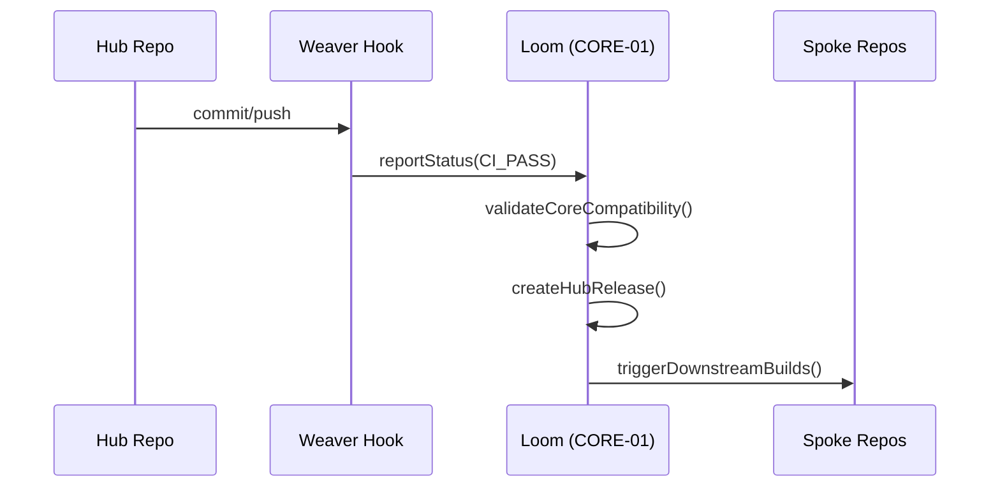

# PHASE HUB-16: Hub-level Orchestration Hooks

## Tier
Hub (Shared Services)

## Resolves
Grounds this blueprint's `CORE-01` integration against the actual, implemented `orchestrator/` code
(`02_EXEMPLARS/CORE-01.md`) rather than the abstract description in the original, and adds stated
benchmark methodology (Finding 10).

## Component Name
Sovereign Hub Weaver

## Description
Integration logic for Hub-tier repositories to report status back to `CORE-01` (the Loom). Automates
dependency validation between Hub and Core tiers and prepares the Hub for Spoke consumption.

## Build Status
🟡 **Partially unblocked** — `CORE-01` (Loom) is the one Core component already implemented and tested
(`orchestrator/`). This blueprint's upward integration can begin now; `HUB-15` (Health Check), its
other direct dependency, is not yet implemented.

## Dependency Status
- **Upward:** `CORE-01` (implemented), `HUB-15` (not implemented).
- **Downward:** every other Hub component — this is the "Merge Gate" for the tier per the original
  design intent.

## Architectural Design
- **OrchestrationClient** — talks to Loom via webhooks or CLI calls, using the real
  `SovereignStack\Orchestrator\CIMonitor::registerRepo()` registration contract from `CORE-01.md`, not
  a generic placeholder API.
- **DependencyVerifier** — ensures the current Hub version is compatible with the installed Core
  version, using `DependencyGraph`'s tier-order enforcement (`CORE-01.md`) directly rather than a
  separate compatibility-check mechanism.
- **ReleaseManager** — tagging and manifest generation for Hub-tier distribution, via
  `RepoManager`/`VersionBumpEngine`.
- **SpokeNotifier** — triggers Spoke CI pipelines on Hub publish.



```php
namespace SovereignStack\Hub\Contracts;

interface OrchestratorHookInterface
{
    public function notifyBuildSuccess(string $repo, string $commit): void;
    public function checkCoreCompatibility(string $requiredVersion): bool;
}
```

## Integration Strategy
- **Upward:** directly integrates with `orchestrator/src/CIMonitor.php` and `DependencyGraph.php`.
- **Downward:** this is the Hub tier's merge gate — no Hub component is "Stable" until the Weaver
  verifies it, which concretely means: `DependencyGraph::addNode($repo, 'hub')` succeeds and
  `resolveBuildOrder()` places it correctly relative to its declared dependencies.
- **CLI:** `s-cli hub:release` automates the Hub-to-Orchestrator handshake.

## Benchmark & Verification Methodology
| Target | Method |
|---|---|
| Version gating | Integration test: attempt a Hub release declaring a dependency on an untagged Core version; assert `checkCoreCompatibility()` returns `false` and the release is blocked — this can be written and run today against the real `CORE-01` implementation, unlike most Hub-tier benchmarks. |
| Notification retry | Integration test: mock the Loom endpoint to fail twice then succeed; assert exactly 3 attempts total (not 2, not unbounded) per the "up to 3 times" retry policy. |
| Manifest accuracy | Integration test: register N fixture Hub services, run manifest generation, assert `hub-manifest.json` contains exactly those N services with correctly resolved versions — no missing, no stale entries. |

## CI Verification Criteria
- Version-gating test against the real `CORE-01` implementation, blocking — this one can and should be
  written now, since its dependency is already built.
- Notification-retry-exactly-3 test, blocking.
- Manifest accuracy test, blocking.

## SemVer Impact
**Major.** Completes the automated polyrepo lifecycle for the Hub tier.
