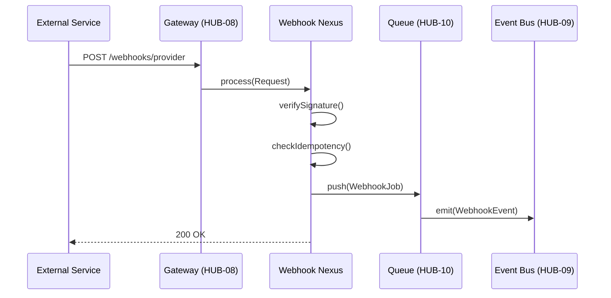

# PHASE HUB-17: Webhook Ingestion & Dispatch Engine

## Tier
Hub (Shared Services)

## Resolves
Ties this blueprint's idempotency and DLQ handling explicitly to `HUB-10`'s merged
`dead-letter-handling.md` pattern (rather than the two documents each implying their own DLQ), and adds
stated benchmark methodology (Finding 10).

## Component Name
Sovereign Webhook Nexus

## Description
Receives incoming webhooks from external services (Stripe, GitHub, Shopify, …) and dispatches them to
internal Hub services or Spoke handlers, with signature verification, idempotent processing, retries,
and an audit trail.

## Build Status
🔴 **Blocked** on `HUB-09` (Event Bus), `HUB-10` (Queue), `HUB-06` (Audit), `HUB-08` (Gateway) — none
implemented.

## Dependency Status
- **Direct Hub:** `HUB-09`, `HUB-10`, `HUB-06`, `HUB-08`. *(Matches taxonomy.)*
- **Transitive Core:** `CORE-06`, `CORE-04`, `CORE-19`, `CORE-03`.
- **Downward:** `HUB-22` (Billing webhooks route through this).

## Architectural Design
- **WebhookIngestor** — entry point for inbound POSTs.
- **SignatureValidator** — extensible per-provider signature verification.
- **DispatchRegistry** — maps webhook types to internal Hub events or Spoke jobs.
- **IdempotencyManager** — prevents duplicate processing via a persistent request-ID cache in `HUB-02`.



```php
namespace SovereignStack\Hub\Contracts;

interface WebhookManagerInterface
{
    public function subscribe(string $provider, string $event, callable $handler): void;
    public function verify(string $provider, string $payload, array $headers): bool;
}
```

## Integration Strategy
- **Upward:** registered as a route within `HUB-08`.
- **Downward:** Spoke applications register listeners via `HUB-09`.
- **Retry/DLQ:** `WebhookJob` failures use `HUB-10`'s dead-letter pattern (see `HUB-10.md` →
  `docs/queue-patterns/dead-letter-handling.md`) directly — this blueprint does not define a second,
  parallel retry mechanism.

## Benchmark & Verification Methodology
| Target | Method |
|---|---|
| Signature rejection | Test fixture set covering ≥3 provider signature formats (Stripe HMAC, GitHub HMAC, a generic scheme) each with a deliberately tampered payload; assert rejection for every case, not just the happy path. |
| Idempotency | Integration test: replay the identical request (same idempotency key) 5 times concurrently; assert exactly one side effect occurred, verified by checking the downstream job/event count, not just the HTTP response. |
| Auditability | Integration test: send a webhook, assert a `webhook_logs` row exists with correct provider, status, and processing-time fields — processing time measured, not left as a free-text field with no verification. |

## CI Verification Criteria
- Multi-provider signature-rejection test, blocking.
- Concurrent-idempotency test (5 simultaneous replays → 1 side effect), blocking.
- Audit-log-population test, blocking.

## SemVer Impact
**Minor.** Adds webhook handling capabilities to the Hub.
