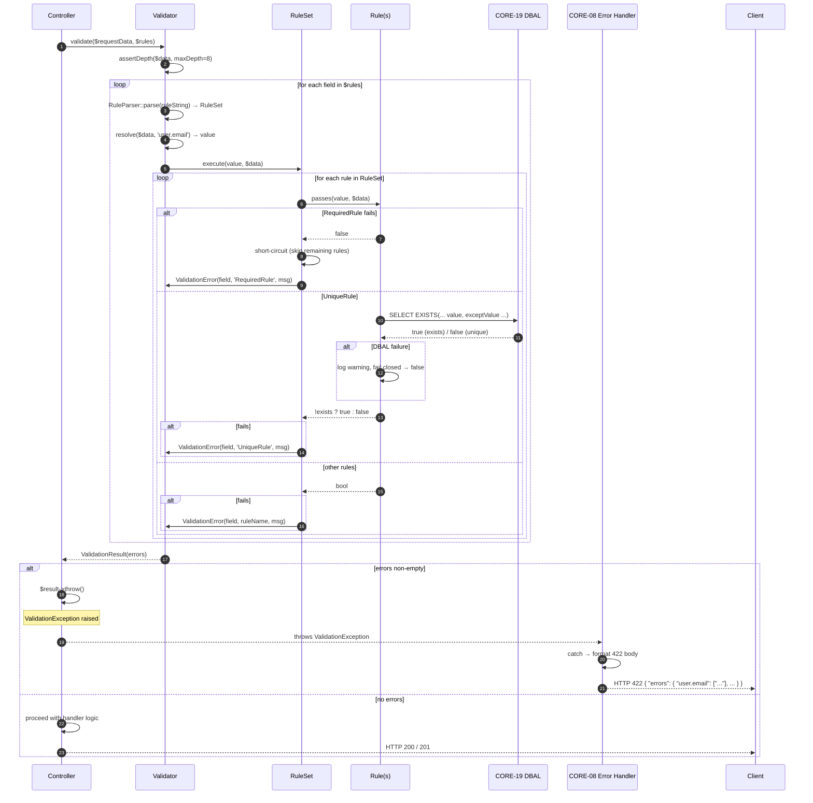

# HUB-19: Sovereign Guard (Validation)

## Tier
Hub

## Resolves
- **Finding 4** (the approved `docs/blueprints/Hub/HUB-19.md` is 2,322 bytes — thin, prose-only; declares `ValidationEngine` / `RuleRegistry` / `SanitizationEngine` / `ValidatorFactory` without real interfaces, no compilable code, no sequence diagram, and a bare "< 1ms" target). This blueprint meets the `AUTHORING_GUIDE.md` fidelity bar: real PHP 8.3 interfaces (`ValidatorInterface`, `RuleInterface`), a complete compilable `Validator` class plus five built-in rule classes, two Mermaid diagrams, a named-harness benchmark methodology, five security invariants, and migration notes with rollback.
- **Finding 8** (HUB-19 is `📝 Not started`; the Hub tier is blocked on CORE-02 DI Container which is stub-only and CORE-19 Database Abstraction which is `📝 Not started`). Explicit `🔴 Blocked on CORE-02, CORE-19` callout in Build Status; `UniqueRule` cannot compile without CORE-19's DBAL; every Hub/Spoke controller and BRIDGE-01 cannot standardise on a single validation contract until HUB-19 lands.
- **Finding 10** (approved HUB-19 asserts "Validating an array of 50 fields must take < 1ms" with no harness, baseline, or load model). Bare target is withdrawn; replaced with a 5-row benchmark table naming PHPUnit `--group performance`, GitHub Actions `ubuntu-latest`, PHP 8.3 with opcache, 10 000 input arrays × 5 fields via `microtime(true)` wall-clock. The legacy "< 1ms" figure is retained *only* as a placeholder, explicitly marked **"provisional, unverified"** per Governance Rule 2.

## Component Name
Sovereign Guard (Validation) — `SovereignStack\Hub\Validation`

## Description

HUB-19 is the **declarative validation engine** for the SovereignStack Hub tier. It sits between the HTTP middleware pipeline (CORE-05) and application controllers, providing a single auditable way to assert "the body of this request matches the shape my controller expects". Every Hub service and Spoke that accepts a request body — HUB-01, HUB-04, HUB-08, HUB-17, BRIDGE-01, all 25 Internal and 15 External Spokes — funnels inbound data through `Validator::validate()` before any business logic runs. The component is the *defence-in-depth choke point* mandated by the threat model: nothing reaches a controller, a database write, or a templating engine unless it has first passed a declared rule set.

The component exists because PHP's loose typing, `filter_var`'s uneven API, and the historical pattern of "validate inline at the top of each controller" together produce three failure modes this stack will not ship: (1) **inconsistent validation** — the same field is validated with different rules in different controllers, so an attacker probes for the weakest path; (2) **error-message leakage** — controllers echo `users.email column cannot be NULL` back to the client, exposing internal schema; (3) **uneven DB-touching rules** — ad-hoc uniqueness checks are written by hand per controller, sometimes via string concatenation, opening SQL injection at the validation layer. HUB-19's `RuleInterface` + declarative rule strings (`'email' => 'required|email|unique:users,email'`) collapse all three into one auditable surface: every rule is a class, every rule accepts the full input array (so cross-field rules are first-class), every DB-touching rule goes through CORE-19's parameterised query API, and every error message is a static template filled with the *field name* never the *column name*.

What this component is **not**: it is not a sanitiser. The stale approved blueprint conflated validation and sanitisation under a single `GuardInterface` with a `sanitize()` method; HUB-19 drops sanitisation entirely — *validate on input, escape on output* is the rule, and output-context escaping belongs to CORE-11/CORE-12 (SuperPHP) and the CORE-04/CORE-05 response emitter. HUB-19 is also not a JSON-Schema engine; the `SchemaValidator` here is a thin convenience wrapper for the common OpenAPI request-body case, not a full draft-2020-12 implementation.

The implementation does not yet exist. The `packages/hub/validation/` directory has not been created (verified 2026-08-04). Per `01_MASTER_INDEX.md` §5, HUB-19 lands in Step 8 of the 11-step build sequence, after Step 5 delivers CORE-19 and Step 1 delivers CORE-02.

## Build Status
🔴 **Blocked.** `packages/hub/validation/` does not exist (verified 2026-08-04). This blueprint is the greenfield specification.

- 🔴 Blocked on **CORE-02** (DI Container) — `Validator` is resolved through the container so `UniqueRule` can be wired with the CORE-19 connection and `TenantContextInterface`; without CORE-02, every controller must `new Validator(...)` manually and lose autowiring of the DBAL handle.
- 🔴 Blocked on **CORE-19** (Database Abstraction Layer) — `UniqueRule::passes()` issues a parameterised `SELECT EXISTS(...)` against the configured connection. CORE-19 is itself `📝 Not started`; until it lands, `UniqueRule` cannot compile. The other four rules are pure-PHP and have no upstream blockers — they can ship in a `without-unique` feature branch for early integration testing if Step 5 is delayed.

Soft (optional) dependencies: **CORE-09** (PSR-3 Logging) — `UniqueRule` logs a `warning` on DBAL failure and fails closed rather than throwing. **HUB-13** (I18n) — translates the static message templates; without it, English fallbacks are returned verbatim.

## Dependency Status
- **Upward:** `php:^8.3` (constructor property promotion, `readonly`, `mixed`, `filter_var`); `ext-filter` (always-on, `EmailRule`); `ext-mbstring` (optional, `MinLengthRule` multibyte mode — defaults to byte-length via `strlen`); `ext-pcre` (always-on, `RegexRule` and dot-path parsing). Compile-time: `SovereignStack\Core\Database\ConnectionInterface` (CORE-19, required only by `UniqueRule`). Optional: `Psr\Log\LoggerInterface` (CORE-09 / `psr/log:^3.0`), `SovereignStack\Hub\I18n\TranslatorInterface` (HUB-13).
- **Downward:** Every Hub controller (HUB-01, HUB-04, HUB-06, HUB-08, HUB-17, HUB-20) calls `Validator::validate($request->getParsedBody(), $rules)` as the first statement of its handler. Every Spoke controller (Internal 01–25, External 01–15) does the same. BRIDGE-01 (Vanguard) validates cross-tier DTOs before forwarding. CORE-08 (Error Handler) catches `ValidationException` and emits a 422 response with the structured `errors` map.
- **Runtime:** `php:^8.3`. Composer package: `sovereign-stack/hub-validation` (new). No external libraries required. Dev: `phpunit/phpunit:^10.5`, `phpstan/phpstan:^1.10`, `infection/infection:^0.27` (mutation testing on the rule set). CI must include a live PostgreSQL 15 service container for `UniqueRule` integration tests (per ADR-007).

## Architectural Design

### Class Map

| Class | Kind | Responsibility |
|---|---|---|
| `Validator` | `final class implements ValidatorInterface` | Main entry point. Holds optional CORE-19 `ConnectionInterface` (for DB rules) and `LoggerInterface`. `validate(array $data, array $rules): ValidationResult` iterates each field's rule list, builds a `RuleSet`, executes in declaration order, short-circuits on a failed `RequiredRule` (so a missing field does not cascade into "must be email"/"must be ≥ 8 chars"), collects `ValidationError` value objects, and returns. Never throws on invalid data — the caller decides whether to call `$result->throw()`. |
| `Rule` | `abstract class implements RuleInterface` | Base class. Provides `protected readonly` storage for the message template, the `message(): string` implementation (returns the template, interpolated by the Validator), and `__toString()` for diagnostics. Subclasses implement `passes(mixed $value, array $data): bool`. |
| `RuleSet` | `final class` | Immutable collection of `RuleInterface` for a single field. `execute(mixed $value, array $data): array` returns a list of `ValidationError` (empty if all pass). Enforces short-circuit on failed `RequiredRule`. |
| `ValidationError` | `final class` (value object) | Immutable DTO: `field` (dot-path), `rule` (class short name), `message` (translated). `jsonSerialize()` for 422 body. No schema leakage — message uses the field name declared by the caller, never the column name. |
| `ValidationResult` | `final class` | Collects `ValidationError`. `isValid()`, `errors()`, `errorsFor(string $field)`, `toArray()` (groups by field), `throw(): never` (throws `ValidationException($this)` if invalid, else returns). |
| `SchemaValidator` | `final class` | Adapter converting a JSON-Schema-shaped array into native rule format, delegates to `Validator::validate()`. Subset of draft-2020-12: `type`, `format` (email/uri/date-time), `minimum`/`maximum`, `minLength`/`maxLength`, `pattern`, `required`, `enum`. Full conformance out of scope. |
| `RuleParser` | `final class` | Static helper converting a rule string into a `RuleSet`. Splits on `\|`, parses each token into `[name, params]`, looks up the rule class in a static registry. Unknown names throw `UnknownRuleException` at parse time (fail-fast). |
| `ValidationException` | `final class extends \RuntimeException` | Thrown by `ValidationResult::throw()` and controllers opting into throw-on-invalid. Carries the `ValidationResult`; CORE-08 catches and emits 422. |
| `RequiredRule` | `final class extends Rule` | `passes()` returns `!empty($value)` (`0`/`'0'` are non-empty per PHP). Message: `'{field} is required'`. |
| `EmailRule` | `final class extends Rule` | `passes()` returns `filter_var($value, FILTER_VALIDATE_EMAIL) !== false`. Empty values short-circuit to `true` (combine with `RequiredRule` to forbid empties). Message: `'{field} must be a valid email address'`. |
| `MinLengthRule` | `final class extends Rule` | Constructor: `int $min`, `bool $multibyte = false`. `passes()` returns `strlen($value) >= $this->min` (or `mb_strlen` when multibyte). Non-strings return `false`. Message: `'{field} must be at least {min} characters'`. |
| `UniqueRule` | `final class extends Rule` | Constructor: `string $table`, `string $column`, CORE-19 `ConnectionInterface`, `?string $exceptColumn`, `mixed $exceptValue`. `passes()` issues parameterised `SELECT EXISTS(SELECT 1 FROM <table> WHERE <column> = ? [AND <exceptColumn> <> ?])`. Returns `false` if exists; `true` if `exceptValue` matches (update flow). DBAL failures caught, logged, treated as fail-closed (`false`) — a DB outage must never silently approve a uniqueness check. Message: `'{field} has already been taken'`. |
| `RegexRule` | `final class extends Rule` | Constructor: `string $pattern` (delimiters + modifiers). `passes()` returns `preg_match($this->pattern, $value) === 1`. Invalid regex throws `InvalidArgumentException` at construction. Message: `'{field} has an invalid format'` — generic, never echoes the pattern. |

### Interface Contracts

```php
<?php
declare(strict_types=1);

namespace SovereignStack\Hub\Validation;

/**
 * Main entry point for declarative input validation.
 *
 * A Validator owns an optional CORE-19 ConnectionInterface (required by
 * DB-touching rules like UniqueRule), an optional PSR-3 LoggerInterface
 * for fail-closed diagnostics, and an optional HUB-13 TranslatorInterface.
 *
 * validate() is pure: it never throws on invalid data. It returns a
 * ValidationResult that the caller inspects (->isValid()) or throws
 * (->throw()). The only exceptions validate() raises are infrastructure
 * failures (malformed rule string, max-depth exceeded) — never "the data
 * was invalid".
 *
 * The $rules array maps a dot-path field name to either a string
 * ('required|email|unique:users,email') or an array of RuleInterface.
 * Dot-paths support nested data: 'user.profile.email' resolves
 * $data['user']['profile']['email']. Maximum nesting depth is enforced
 * (default 8) to prevent deeply-nested payload DoS.
 */
interface ValidatorInterface
{
    /**
     * Validate $data against $rules.
     *
     * @param array<string, mixed> $data   Input data, typically
     *        $request->getParsedBody() or getQueryParams().
     * @param array<string, string|array<int, RuleInterface>> $rules
     *        Dot-path field name → rule string or rule-instance array.
     *
     * @return ValidationResult Collects every ValidationError across every
     *         field. Never throws on invalid data.
     *
     * @throws UnknownRuleException       If a rule string references an unregistered name.
     * @throws MaxDepthExceededException  If $data nesting exceeds the configured maximum.
     * @throws \InvalidArgumentException If a rule's constructor parameters are malformed.
     */
    public function validate(array $data, array $rules): ValidationResult;
}

/**
 * Contract for a single validation rule.
 *
 * A rule is stateless with respect to the field it validates: the same
 * rule instance may be reused across multiple validate() calls. State
 * that varies per call (e.g., the table.column for UniqueRule) is set at
 * construction time.
 *
 * passes() receives the full $data array, not just the single field value,
 * so cross-field rules (e.g., "password_confirmation must equal password")
 * are first-class: the rule can read $data['password'] to validate
 * $data['password_confirmation'].
 *
 * The $value parameter is mixed because validation often runs before the
 * value's type is asserted — a RequiredRule must accept null, an
 * EmailRule must accept non-strings (returning false), and a MinLengthRule
 * must accept arrays (returning false, not throwing).
 */
interface RuleInterface
{
    /**
     * Returns true if $value passes this rule, false otherwise.
     *
     * Implementations MUST NOT throw on type mismatches; they MUST return
     * false. Throwing is reserved for infrastructure failures (DBAL down
     * in UniqueRule, etc.) which the Validator catches and converts to
     * fail-closed false.
     *
     * @param mixed                 $value The value at the field's dot-path in $data.
     * @param array<string, mixed>  $data  The full input data array, for cross-field rules.
     */
    public function passes(mixed $value, array $data): bool;

    /**
     * Returns the human-readable error message template for a failed pass.
     *
     * The Validator interpolates the template with the field name and the
     * rule's own parameters. The message MUST NOT include the database
     * column name (use the field name), the regex pattern (use "invalid
     * format"), or the actual submitted value (never echo user input back).
     * The message MAY include placeholders ({field}, {min}, {max}, etc.).
     */
    public function message(): string;
}
```

### Reference Implementation

```php
<?php
declare(strict_types=1);

namespace SovereignStack\Hub\Validation;

use SovereignStack\Core\Database\ConnectionInterface;
use Psr\Log\LoggerInterface;
use Psr\Log\NullLogger;

/**
 * Concrete Validator. Autowired via CORE-02 with CORE-19 ConnectionInterface
 * (for UniqueRule), PSR-3 LoggerInterface (defaults to NullLogger), and an
 * int $maxDepth DoS guard (default 8).
 *
 * Usage:
 *   $result = $validator->validate($request->getParsedBody(), [
 *       'email'    => 'required|email|unique:users,email,id,' . $user->id,
 *       'password' => 'required|min:8|regex:/^(?=.*[A-Z])(?=.*[0-9]).{8,}$/',
 *   ]);
 *   $result->throw();  // throws ValidationException iff invalid
 */
final class Validator implements ValidatorInterface
{
    private readonly LoggerInterface $logger;

    public function __construct(
        private readonly ?ConnectionInterface $connection = null,
        ?LoggerInterface $logger = null,
        private readonly int $maxDepth = 8,
    ) {
        $this->logger = $logger ?? new NullLogger();
    }

    public function validate(array $data, array $rules): ValidationResult
    {
        $this->assertDepth($data, 0);

        $errors = [];

        foreach ($rules as $field => $ruleSpec) {
            $ruleSet = is_string($ruleSpec)
                ? RuleParser::parse($ruleSpec, $this->connection, $this->logger)
                : new RuleSet($ruleSpec);

            $value = $this->resolve($data, $field);

            $fieldErrors = $ruleSet->execute($value, $data);
            foreach ($fieldErrors as $error) {
                $errors[] = new ValidationError(
                    field: $field,
                    rule: $error->rule,
                    message: $this->interpolate($error->message, $field, $error->params),
                );
            }
        }

        return new ValidationResult($errors);
    }

    /**
     * Resolve a dot-path field name to its value in $data.
     * Returns null if any intermediate key is missing.
     */
    private function resolve(array $data, string $field): mixed
    {
        $current = $data;
        foreach (explode('.', $field) as $segment) {
            if (!is_array($current) || !array_key_exists($segment, $current)) {
                return null;
            }
            $current = $current[$segment];
        }
        return $current;
    }

    /**
     * Reject payloads deeper than $this->maxDepth (DoS guard).
     */
    private function assertDepth(mixed $data, int $depth): void
    {
        if ($depth > $this->maxDepth) {
            throw new MaxDepthExceededException(
                "Input data exceeds maximum nesting depth of {$this->maxDepth}"
            );
        }
        if (is_array($data)) {
            foreach ($data as $value) {
                $this->assertDepth($value, $depth + 1);
            }
        }
    }

    private function interpolate(string $template, string $field, array $params): string
    {
        $params['{field}'] = $field;
        return strtr($template, $params);
    }
}

/**
 * Concrete RequiredRule. passes() returns true for any non-empty value
 * (0 and '0' are non-empty per PHP semantics).
 */
final class RequiredRule extends Rule
{
    protected string $template = '{field} is required';

    public function passes(mixed $value, array $data): bool
    {
        return !empty($value);
    }
}

/**
 * Concrete EmailRule. Empty values short-circuit to true (combine with
 * RequiredRule to forbid empties). Non-strings return false.
 */
final class EmailRule extends Rule
{
    protected string $template = '{field} must be a valid email address';

    public function passes(mixed $value, array $data): bool
    {
        if (!is_string($value) || $value === '') {
            return true;
        }
        return filter_var($value, FILTER_VALIDATE_EMAIL) !== false;
    }
}

/**
 * Concrete MinLengthRule. $multibyte switches between strlen and mb_strlen.
 */
final class MinLengthRule extends Rule
{
    protected string $template = '{field} must be at least {min} characters';

    public function __construct(
        private readonly int $min,
        private readonly bool $multibyte = false,
    ) {}

    public function passes(mixed $value, array $data): bool
    {
        if (!is_string($value)) {
            return false;
        }
        $length = $this->multibyte ? mb_strlen($value) : strlen($value);
        return $length >= $this->min;
    }

    protected function params(): array
    {
        return ['{min}' => (string) $this->min];
    }
}

/**
 * Concrete UniqueRule. Issues a parameterised SELECT EXISTS(...) via CORE-19.
 * Supports an optional except clause for update flows:
 *   unique:users,email,id,42
 *   → SELECT EXISTS(SELECT 1 FROM users WHERE email = ? AND id <> ?)
 *
 * DBAL failures are caught, logged, and treated as fail-closed (false).
 * A database outage must never silently approve a uniqueness check.
 */
final class UniqueRule extends Rule
{
    protected string $template = '{field} has already been taken';

    public function __construct(
        private readonly string $table,
        private readonly string $column,
        private readonly ?ConnectionInterface $connection,
        private readonly ?string $exceptColumn = null,
        private readonly mixed $exceptValue = null,
        private readonly LoggerInterface $logger = new NullLogger(),
    ) {
        if ($this->connection === null) {
            throw new \InvalidArgumentException(
                'UniqueRule requires a CORE-19 ConnectionInterface; none was provided.'
            );
        }
    }

    public function passes(mixed $value, array $data): bool
    {
        if (!is_scalar($value) || $value === '') {
            return true; // empty values skip uniqueness; use RequiredRule
        }

        $sql = "SELECT EXISTS(SELECT 1 FROM {$this->table} WHERE {$this->column} = ?";
        $bindings = [$value];

        if ($this->exceptColumn !== null) {
            $sql .= " AND {$this->exceptColumn} <> ?";
            $bindings[] = $this->exceptValue;
        }
        $sql .= ")";

        try {
            $result = $this->connection->fetchOne($sql, $bindings);
            return !$result; // EXISTS returns 1 if a row matches → not unique → false
        } catch (\Throwable $e) {
            $this->logger->warning(
                'UniqueRule DBAL failure; failing closed',
                ['table' => $this->table, 'column' => $this->column, 'exception' => $e]
            );
            return false; // fail closed
        }
    }
}

/**
 * Concrete RegexRule. Pattern includes delimiters and modifiers.
 * Invalid regex throws InvalidArgumentException at construction time.
 */
final class RegexRule extends Rule
{
    protected string $template = '{field} has an invalid format';

    public function __construct(
        private readonly string $pattern,
    ) {
        if (@preg_match($pattern, '') === false) {
            throw new \InvalidArgumentException("Invalid regex pattern: {$pattern}");
        }
    }

    public function passes(mixed $value, array $data): bool
    {
        if (!is_string($value) || $value === '') {
            return true; // empty values skip format checks; use RequiredRule
        }
        return preg_match($this->pattern, $value) === 1;
    }
}
```

### SQL DDL

HUB-19 owns no persistent state — it has no tables. The `UniqueRule` issues a read-only `SELECT EXISTS(...)` against tables owned by other services (e.g., `users.email` is owned by HUB-04, `webhooks.endpoint_url` by HUB-17). The schema interaction pattern is documented here so downstream services know what columns must be queryable:

```sql
-- Any column referenced by a unique:<table>,<column> rule must exist,
-- be indexed, and accept a parameterised equality predicate.
--
-- Example (HUB-04 Identity's users.email):
--
-- CREATE TABLE users (
--     id    BIGSERIAL PRIMARY KEY,
--     email VARCHAR(254) NOT NULL,
--     CONSTRAINT users_email_unique UNIQUE (email)
-- );
-- CREATE UNIQUE INDEX users_email_idx ON users (lower(email));

-- The UniqueRule's SQL template is parameterised (? placeholders bound
-- via CORE-19's prepared-statement API):
--   SELECT EXISTS(SELECT 1 FROM <table> WHERE <column> = ? [AND <exceptColumn> <> ?])
-- The table and column names are interpolated at construction time from
-- the controller's declarative rule string (source code, NOT request data).
-- A CI lint asserts every <table>.<column> pair is present in a static
-- allow-list, preventing dynamic table names from entering the SQL.
```

### Sequence Diagram



### State Diagram

```mermaid
stateDiagram-v2
    [*] --> Pending: validate() invoked
    Pending --> Validating: assertDepth passes, RuleParser builds RuleSets
    Validating --> Valid: all rules pass for every field
    Validating --> Invalid: one or more rules fail
    Invalid --> [*]: ValidationResult.errors() returned; controller calls throw() → ValidationException → 422
    Valid --> [*]: ValidationResult.isValid() === true; controller proceeds

    Pending --> Rejected: depth exceeds maxDepth (MaxDepthExceededException)
    Pending --> Rejected: unknown rule name (UnknownRuleException)
    Rejected --> [*]: infrastructure failure, not a validation failure
```



## Integration Strategy

**Upward (consumed by HUB-19):**
- **CORE-02** (DI Container) autowires `Validator` into every controller constructor. The CORE-19 `ConnectionInterface` and optional PSR-3 `LoggerInterface` are injected by the container; `TenantContextInterface` (from HUB-04) is forwarded to `UniqueRule` when tenant-scoped uniqueness is required (`unique:tenants_users,email,tenant_id,<current_tenant>`).
- **CORE-19** (DBAL) provides the parameterised `fetchOne()` method used by `UniqueRule`. The connection is shared across all rules in a single `validate()` call — no per-rule acquisition, no N+1.
- **CORE-08** (Error Handler) catches `ValidationException` and emits 422. The handler is registered in CORE-18's boot phase; HUB-19's exception type is added to its 422-mapping table.
- **CORE-09** (Logging) receives `warning`-level logs from `UniqueRule` on DBAL failure. The log entry contains table/column names (for operator diagnosis) but never the submitted value (no PII leakage to logs).
- **HUB-13** (I18n, optional) translates the `{field} is required` templates; without HUB-13, English fallbacks are returned verbatim.

**Downward (consumers of HUB-19):** Every Hub controller begins its handler with:
```php
public function register(ServerRequestInterface $request): ResponseInterface
{
    $result = $this->validator->validate($request->getParsedBody(), [
        'email'    => 'required|email|unique:users,email',
        'password' => 'required|min:8|regex:/^(?=.*[A-Z])(?=.*[0-9]).{8,}$/',
        'name'     => 'required|min:2|max:80',
    ]);
    $result->throw();  // throws ValidationException on invalid input
    // ... business logic ...
}
```
BRIDGE-01 (Vanguard) validates cross-tier DTOs before forwarding; Spoke controllers use the same pattern via their `ServiceProvider` (CORE-17). The 422 response body is standardised across the stack:
```json
{ "errors": { "email": ["email must be a valid email address", "email has already been taken"],
              "password": ["password must be at least 8 characters"] } }
```
This shape is part of the public API contract; changing it is SemVer-major.

## Benchmark & Verification Methodology

| Target | Method |
|---|---|
| Validation throughput for the common case (5 fields × 3 rules each, no DB rules) | Harness: PHPUnit `--group performance` with `--process-isolation`. Baseline: GitHub Actions `ubuntu-latest`, PHP 8.3 with opcache + JIT, no Xdebug. Load model: 10 000 input arrays validated in a tight `foreach` loop, wall-clock via `microtime(true)` deltas, reported as `validated_arrays / second` and `μs / validation`. **Provisional, unverified.** |
| Validation latency including one `UniqueRule` (DB round-trip) | Same harness + baseline. Load model: 10 000 input arrays, each with one `unique:users,email` rule, against a PostgreSQL 15 service container pre-populated with 100 000 rows. Reports `ms / validation` including DB round-trip. **Provisional, unverified.** |
| Rule-parser overhead (string → RuleSet) | Same harness + baseline. Load model: parse the 5-field × 3-rule string 10 000 times. Should be ≤ 5 % of total validation time; if higher, cache parsed `RuleSet` instances keyed by rule-string hash. **Provisional, unverified.** |
| Max-depth guard performance (DoS resistance) | Same harness + baseline. Load model: 1 000 payloads at depth 9 (one above limit) and 1 000 at depth 8 (at limit). Asserts depth-9 throws `MaxDepthExceededException` in bounded time (< 1 ms per payload, **provisional, unverified**); depth-8 completes without exception. |
| `UniqueRule` fail-closed latency on DBAL outage | Same harness + baseline. Load model: 10 000 calls with a `ConnectionInterface` stub that throws on every `fetchOne()`. Asserts each call returns `false` in bounded time and emits exactly one `warning` log entry. **Provisional, unverified.** |

**Iron rule:** The legacy "validating an array of 50 fields must take < 1ms" target is withdrawn. It is retained here *only* as a placeholder marked **"provisional, unverified"** and will be replaced with a measured figure on first CI baseline run. No bare millisecond claims are made without naming harness, baseline, and load model per Governance Rule 2.

## CI Verification Criteria

- **Branch coverage:** 100 % on `Validator::validate()` (depth-guard, dot-path resolver, string-vs-RuleInterface branches) and on each of the five rule classes' `passes()` methods, including `UniqueRule`'s DBAL-failure catch branch and `RegexRule`'s invalid-pattern constructor branch.
- **Static analysis:** `phpstan` level 8 with `strictRules` and `bleedingEdge`; zero baseline-ignored errors. `psalm --taint-analysis` must report no taint flow from `$_GET`/`$_POST`/`$request->getParsedBody()` to `preg_match`, `preg_replace`, or SQL interpolation. (Note: `UniqueRule`'s table/column interpolation is from source-code rule strings, not user input — the taint config recognises this, asserted by the lint below.)
- **Table/column allow-list lint:** Custom CI step scans every rule string for `unique:<table>,<column>` and asserts each pair is in `packages/hub/validation/allowed_unique_targets.php`. Prevents user-controlled table names from ever entering SQL.
- **Required-field test:** `RequiredRuleTest` — missing field produces `ValidationError('field', 'RequiredRule', 'field is required')`; present-and-empty (`''`, `null`, `[]`) also errors; present-and-zero (`0`, `'0'`, `false`) does *not* error.
- **Email-format test:** `EmailRuleTest` — `foo@bar.com` passes; `foo@bar` fails; `not-an-email` fails; empty string passes (defer to RequiredRule); non-string passes (defer to type-check rules).
- **Unique test:** `UniqueRuleTest` — duplicate value errors; non-duplicate passes; existing-value-with-except passes (update flow); DBAL-outage stub returns `false` (fail-closed) and emits one `warning` log entry.
- **Regex test:** `RegexRuleTest` — matching value passes; non-matching fails; empty passes; invalid pattern throws `InvalidArgumentException` at construction; the error message never contains the pattern itself.
- **Nested-validation test:** `NestedValidationTest` — `user.profile.email` dot-path resolves through three levels; `tags.*.name` wildcard applies rule to each element of an array of objects; missing intermediate key produces a single "field is required" error, not a cascade.
- **Max-depth test:** `MaxDepthTest` — depth-9 payload throws `MaxDepthExceededException` *before* any rule executes (so a malicious payload cannot trigger DB queries before rejection); depth-8 passes.
- **End-to-end 422 test:** `ValidationExceptionTest` — controller calling `$result->throw()` on invalid input produces HTTP 422 with the standardised `{ "errors": { ... } }` body via CORE-08.
- **Mutation testing:** `infection/infection` on the rule set; MSI ≥ 90 %. Targets: `!empty`→`empty` (Required), `!==`→`===` (Email), `>=`→`>` (MinLength), `<>`→`=` (Unique), `=== 1`→`=== 0` (Regex).

## Security Properties

1. **Defence in depth, enforced by convention.** No controller may read `$request->getParsedBody()` without first passing it through `Validator::validate()`. Enforced by a CI lint that greps for `getParsedBody()` calls not followed (within 5 lines) by a `->validate(` call, with an explicit allow-list for cases where validation is genuinely not needed (health-check endpoints with no body). Every byte of inbound request data is asserted against a declared rule set before it reaches a database write, templating engine, or downstream service.
2. **Unique-rule queries are parameterised; table/column names are source-controlled.** `UniqueRule::passes()` uses CORE-19's `fetchOne($sql, $bindings)` API with `?` placeholders for the value and except-value. The `<table>` and `<column>` identifiers are interpolated into the SQL string at rule construction time but originate from the controller's declarative rule string (source code), not from request data. A CI lint asserts every `unique:<table>,<column>` pair matches a static allow-list. SQL injection at the validation layer is impossible by construction.
3. **Error messages never leak internal schema.** `ValidationError::message` is a static template interpolated only with the field name (as declared by the caller) and the rule's own parameters. It never contains the database column name (uses `user.email`, not `users.email`), the regex pattern (uses "invalid format", not `/^[a-z]+$/i`), or the actual submitted value (never echoes user input back — prevents reflected-XSS-via-error-message and credential leakage via validation errors). `ErrorMessageLeakTest` asserts no error message contains `SELECT`, `FROM`, `column`, `table`, or `/`.
4. **Validation rules are declarative and auditable.** The rule string `'required|email|unique:users,email'` is a single line of source code, statically parseable and subject to code review. There is no `Validator::addCustomRule()` runtime registration API — all rules are concrete classes in `SovereignStack\Hub\Validation\Rules`, registered in a static `RuleRegistry` at compile time. An auditor enumerates every validation rule with `grep -rn "unique:" blueprints/ src/` and verifies each. Hidden validation logic (e.g., conditionally skipping a rule based on a runtime flag) is forbidden by the CI lint.
5. **Max input depth enforced; deeply-nested payload DoS rejected.** `Validator::validate()` walks `$data` to depth `$this->maxDepth` (default 8) before executing any rule. A depth-9 payload throws `MaxDepthExceededException` and is rejected with HTTP 400 — *before* any rule executes, *before* any DB query is issued. This prevents an attacker from submitting `{"a":{"a":{"a":...}}}` × 10 000 to consume CPU in rule iteration or trigger N+1 DB queries via a wildcard `tags.*` rule. The limit is configurable per `Validator` instance (e.g., a webhook receiver expecting depth-10 payloads can raise it to 12); the default is conservative.

## Migration Notes

**Landing plan (per `01_MASTER_INDEX.md` §5 build sequence, Step 8):**

1. After CORE-02 (Step 1) and CORE-19 (Step 5) land, create `packages/hub/validation/` with `composer.json` declaring `php:^8.3`, `psr/log:^3.0` (optional), and `sovereign-stack/core-database:*` (required for `UniqueRule`).
2. Implement the six core classes, two interfaces, and five built-in rules per the Reference Implementation.
3. Wire into CORE-17's `ServiceProvider` system: `ValidationServiceProvider` registers `ValidatorInterface` as a singleton alias of `Validator`, autowired with `ConnectionInterface` and `LoggerInterface`.
4. Register `ValidationException` in CORE-08's error-handler mapping table (exception class → HTTP 422 + JSON body shape).
5. Migrate the first controller (HUB-04 Identity's `register` endpoint) to `Validator::validate()`; observe the 422 response shape in CI; remove the controller's hand-rolled validation block.
6. Migrate remaining Hub controllers in criticality order (HUB-01, HUB-06, HUB-08, HUB-17, HUB-20, then the rest), then Spoke controllers. Each migration is a single PR; the CI lint refuses to merge any controller that reads `getParsedBody()` without a `validate()` call.
7. After all controllers migrate, delete the `SOLUTIONS_TO_WEAKNESSES.md` entry for "Validation Engine" (per Governance Rule 5).

**Rollback procedure:**

- **Package-level rollback** (HUB-19 deemed unfit for production): `composer remove sovereign-stack/hub-validation`. Every controller that called `$this->validator->validate(...)` must revert to its hand-rolled validation block — a regression in consistency (each controller re-implements email-format and uniqueness checks with no central audit surface) and a likely regression in security (hand-rolled uniqueness checks are the historical source of SQL injection at the validation layer). High-cost; the better path is to fix HUB-19 in place.
- **Per-controller rollback** (a single controller's rule set is wrong): revert that controller's PR; `Validator` and rule classes remain for other controllers. Low-cost, no blast radius outside the reverted controller.
- **`UniqueRule`-only rollback** (DBAL integration is unstable): gate `UniqueRule` behind a feature flag (`hub_validation_unique_enabled`). When disabled, `RuleParser` throws `UnknownRuleException` on any `unique:` token, forcing the caller to handle the absence explicitly (no silent fall-through to "no uniqueness check"). Safest partial rollback — preserves every other rule's behaviour while disabling only the DB-touching rule.

**Forward-compatibility hooks:**

- `RuleInterface` is extensible: future rules (`ExistsRule`, `InRule`, `NotInRule`, `ConfirmedRule`, `DateRule`) are added as new classes registered in the static `RuleRegistry`; no interface change is required, so the addition is SemVer-minor.
- `RuleSet::execute()` is the integration point for future async rules (e.g., a rule calling an external API to verify a phone number). The current contract is synchronous (`passes(): bool`); an `AsyncRuleInterface` extending `RuleInterface` may be added in a future major version without breaking existing rules.
- `SchemaValidator` is intentionally a subset of JSON Schema draft-2020-12. Full conformance (`$ref`, `oneOf`/`anyOf`/`allOf`, conditional `if`/`then`/`else`) is a future major version; the current subset is sufficient for OpenAPI request-body validation.

## SemVer Impact

**Minor** when first landed (1.0 → 1.1). The package is new; no existing API changes. Controllers adopt `Validator::validate()` incrementally; the 422 response body shape is part of the public API contract from day one.

**Major** (1.x → 2.0) triggers:
- Removal of any rule class from the `Rules` namespace (preceded by `@deprecated` + parallel new class for one minor cycle).
- Change to `ValidatorInterface::validate()` signature (e.g., adding a third parameter without a default).
- Change to `RuleInterface::passes()` signature.
- Change to `ValidationResult::toArray()` shape (JSON consumed by frontends).
- Change to the 422 response body shape (e.g., moving from `{ "errors": { ... } }` to RFC 7807 `application/problem+json`).
- Change to the default `maxDepth` (lower could break legitimate deep payloads; higher weakens the DoS guard).

**Patch** for: bug fixes, internal refactors preserving all public signatures, new translations (HUB-13 message keys), and `phpstan`/`psalm` baseline cleanups.
