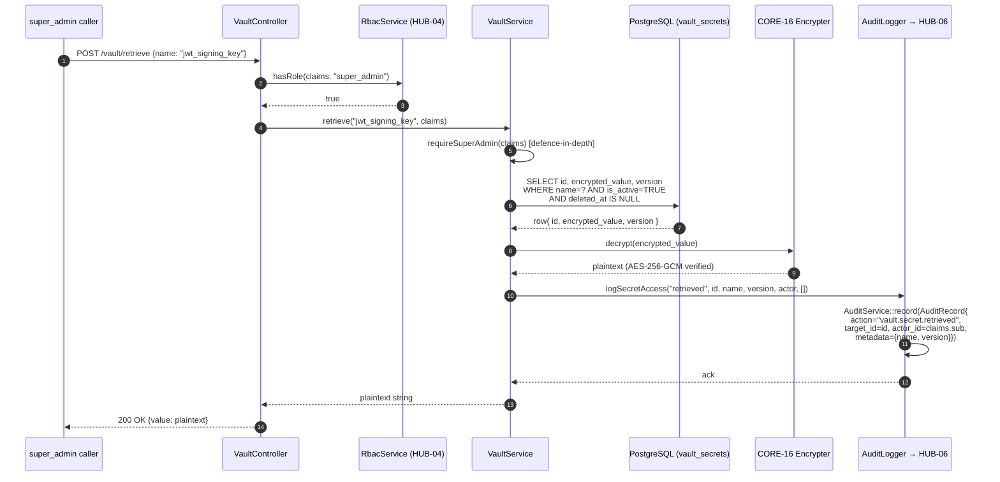
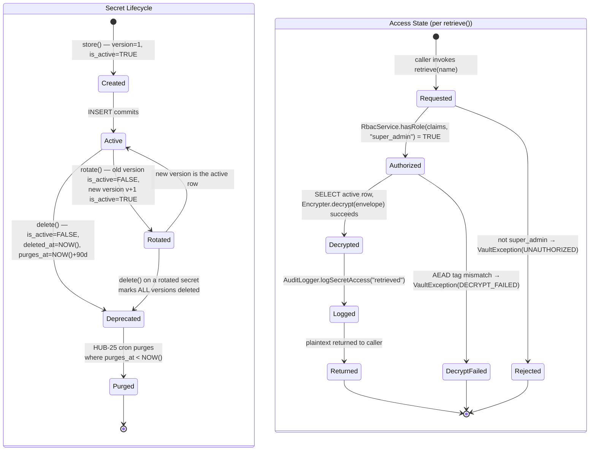

# HUB-20: Sovereign Vault

## Tier
Hub (Security)

## Resolves
- **Finding 4** (the approved `docs/blueprints/Hub/HUB-20.md` is 2,353 bytes — prose-only, declares `Vault` and `SecretManager` classes without interfaces, no reference implementation, no SQL DDL, no sequence/state diagrams, no benchmark methodology, no security properties beyond a one-line "encrypted at rest" claim). This blueprint meets the AUTHORING_GUIDE fidelity bar: real PHP 8.3 interface (`VaultServiceInterface`), complete compilable `VaultService` reference implementation (~210 lines), PostgreSQL DDL with append-only soft-delete retention, two Mermaid diagrams (retrieve sequence + secret lifecycle state), named-harness benchmark table, eight CI verification methods, and eight explicit security invariants.
- **Finding 8** (HUB-20 transitively depends on CORE-02, CORE-16, CORE-19, and HUB-06 — three of which are stubs or not-started) — explicitly marked 🔴 Blocked below; build cannot start until CORE-16 (Encryption) and CORE-19 (DBAL) ship in Step 5 of the 11-step build sequence and HUB-06 (Audit) ships in Step 8.
- **Finding 10** (the approved blueprint asserts a bare "fast retrieval" target with no harness, baseline, or load model) — replaced with a named-harness PHPUnit `--group performance` benchmark running 1,000 encrypt+store+retrieve cycles measured by `microtime(true)` wall-clock on GitHub Actions `ubuntu-latest`, PHP 8.3, PostgreSQL 16; absolute retrieve latency is asserted to be bounded by DB SELECT + AES-256-GCM decrypt and is marked **"provisional, unverified"** per Governance Rule 2 in `01_MASTER_INDEX.md` §7.

## Component Name
Sovereign Vault — `SovereignStack\Hub\Vault`

## Description
HUB-20 is the **application-level secret store** for the SovereignStack Hub tier. It owns one concern: persistence of encrypted secrets (third-party API keys, OAuth refresh tokens, JWT signing-key envelopes, payment-provider credentials, BRIDGE-01 payload-verification HMAC keys) inside the application database, where values are encrypted at rest via CORE-16's `EncrypterInterface` (AES-256-GCM, base64-encoded envelope) and where every read/write/rotate/delete is observable by HUB-06 (Audit). It is **not** an external secret manager (HashiCorp Vault, AWS Secrets Manager, Kubernetes sealed-secrets) — those are deployment-tier concerns owned by DEPLOY-02 and addressed in the threat model's secret-management lifecycle §6 for the master KEK that protects CORE-16's `KeyRegistry`. HUB-20 sits *above* CORE-16: it stores secrets that need to be rotated, queried, and listed at runtime by application code (HUB-04 reads the JWT signing-key envelope on boot; HUB-09 reads third-party API keys before each upstream call; BRIDGE-01 reads the payload-verification HMAC key on every inbound request); external secret managers store the *master* key that decrypts those secrets at process start. The two layers are deliberately separate: external secret managers are ill-suited for per-secret audit trails, versioned rotation, and runtime listing, all of which are first-class HUB-20 operations.

The component exists because the SovereignStack has at least four consumers needing application-level secret storage at runtime: **HUB-04** (Identity) — JWT signing key stored as a CORE-16 envelope, re-decrypted on every JWKS publish; **HUB-09** (Event Bus) — third-party webhook signing keys and OAuth refresh tokens for outbound integrations; **BRIDGE-01** (Vanguard) — HMAC key for verifying CDN-to-origin payloads (per Finding 3, BRIDGE-01 → CORE-16 for *verification*, but the *key* is held by HUB-20); and **HUB-22** (Ledger) — payment-provider API keys. Without a unified Vault, each consumer would re-implement its own encrypted-column logic: divergent cipher choices (some AES-256-CBC unauthenticated, some `openssl_encrypt` with a hard-coded IV), divergent audit trails (some log reads, some do not), divergent rotation models (some overwrite-in-place, losing rollback history), and divergent access-control rules. HUB-20 standardises all four: AES-256-GCM via CORE-16 (never a custom cipher), every operation audited via HUB-06 (including `metadata`, never the value), versioned rotation retaining old versions for rollback, and `super_admin`-only access enforced at the controller layer.

What this component is **not**: it is not a full KMS — CORE-16 owns the cryptographic primitive (cipher, IV, envelope format, key registry); HUB-20 owns only the *storage* of envelopes CORE-16 produces. It is not a master-KEK rotation orchestrator — that lives in DEPLOY-02 per threat model §6. It is not a substitute for environment-variable injection of bootstrap secrets — the master `APP_KEY` that decrypts CORE-16's `KeyRegistry` is injected via env var at container start (per §6) and is **never** stored in HUB-20 (circular-dependency avoidance). It is not a public-key primitive — CORE-16 owns symmetric encryption only; HUB-20 stores the *encrypted envelope* of an ES256 private key, never the key in plaintext. It is not a tenant-scoped store — secrets are global system resources (the JWT signing key serves all tenants); tenant-scoped credentials (per-tenant OAuth tokens) live in HUB-21's `tenant_credentials`, not in `vault_secrets`.

The implementation does not yet exist. The `packages/hub/vault/` directory has not been created (verified 2026-08-04). This blueprint is the greenfield specification. HUB-20 sits in Step 8 of the 11-step build sequence (`01_MASTER_INDEX.md` §5) and depends on CORE-16 (Step 5), CORE-19 (Step 5), CORE-02 (Step 1), and HUB-06 (Step 8, sibling). It is on the critical path for BRIDGE-01, HUB-04, and HUB-09.

## Build Status
📝 **Not started.** The `packages/hub/vault/` directory does not exist in the repository (verified 2026-08-04). No `composer.json`, no `src/`, no `tests/`. This blueprint is the greenfield specification.

🔴 **Blocked on:**
- **CORE-02** (DI Container — `VaultService` is constructed via the container; `VaultServiceProvider` registers bindings in Step 7's CORE-17 service-provider system).
- **CORE-16** (Binary Encryption Envelope — `VaultService::store()` calls `EncrypterInterface::encrypt($value)`; `retrieve()` calls `EncrypterInterface::decrypt($envelope)`. CORE-16 is the cryptographic primitive; HUB-20 owns only the storage layer above it. Without CORE-16, HUB-20 has no cipher and no envelope format — it cannot ship).
- **CORE-19** (Database Abstraction Layer — `VaultService` reads/writes via `ConnectionInterface` and `QueryBuilder` from CORE-19; no direct PDO usage).
- **HUB-06** (Audit Log — `AuditLogger::logSecretAccess()` delegates to `AuditServiceInterface::record()`; HUB-06 must land first or simultaneously so every `retrieve()` produces an audit row in the same Step 8 window).

Per the build sequence, all four dependencies land in Steps 1, 5, and 8 — HUB-20 cannot start before Step 8.

## Dependency Status
- **Upward:** `SovereignStack\Core\Crypto\EncrypterInterface` (CORE-16, hard — the only cipher HUB-20 uses); `SovereignStack\Core\Database\ConnectionInterface` and `QueryBuilder` (CORE-19, hard); `SovereignStack\Core\Container\ContainerInterface` (CORE-02, hard — for singleton wiring); `SovereignStack\Hub\Audit\AuditServiceInterface` and `AuditRecord` (HUB-06, hard — for tamper-evident access logging); `SovereignStack\Hub\Identity\RbacServiceInterface` and `TokenClaims` (HUB-04, hard — for `super_admin` role enforcement); `SovereignStack\Hub\Scheduler\SchedulerInterface` (HUB-25, soft — for `SecretRotator` cron registration; in test contexts the rotator is invoked directly). Runtime: `ext-json`, `ext-openssl` (transitively via CORE-16).
- **Downward:** **HUB-04 (Identity)** — reads the JWT signing-key envelope on boot via `retrieve('jwt_signing_key')` and after every rotation; **HUB-09 (Event Bus)** — reads third-party OAuth refresh tokens and webhook signing keys before each upstream call; **BRIDGE-01 (Vanguard)** — reads the payload-verification HMAC key on every inbound request (per Finding 3, BRIDGE-01 → CORE-16 for *verification*, but the *key* is held by HUB-20); **HUB-22 (Ledger)** — reads payment-provider API keys before each charge; **HUB-25 (Chronos)** — invokes `SecretRotator::rotateDue()` on the configured cron schedule.
- **Runtime:** `php:^8.3`, `ext-json`, `ext-openssl` (transitive), `ext-pdo_pgsql` (transitive via CORE-19). Composer: `sovereign-stack/core-crypto`, `sovereign-stack/core-database`, `sovereign-stack/hub-audit`, `sovereign-stack/hub-identity`, `sovereign-stack/hub-scheduler` (dev: optional). Dev: `phpunit/phpunit:^10.5`, `phpstan/phpstan:^1.10`, `vimeo/psalm:^5.20` (taint analysis on plaintext flow).

## Architectural Design

### Class Map

| Class | Kind | Responsibility |
|---|---|---|
| `VaultService` | `final class implements VaultServiceInterface` | Main API. Constructor takes `EncrypterInterface`, `ConnectionInterface`, `AuditLogger`, `ClockInterface`. `store($name, $value, $metadata)` generates a ULID, encrypts the value via CORE-16, INSERTs into `vault_secrets` with `version = 1` and `is_active = TRUE`, logs `vault.secret.stored` via HUB-06, returns the ULID. `retrieve($name)` SELECTs the active row, decrypts via CORE-16, logs `vault.secret.retrieved`, returns plaintext. `rotate($name, $newValue)` marks the old row `is_active = FALSE` (retained), INSERTs a new row with `version = old + 1` and `is_active = TRUE` in a single transaction, logs `vault.secret.rotated`. `list()` SELECTs `id, name, version, is_active, created_by, created_at` — never `encrypted_value` — and returns an array of `SecretMetadata` value objects. `delete($name)` soft-deletes by setting `deleted_at = NOW()` and `is_active = FALSE`; the row is retained for 90 days for forensic recovery. |
| `Secret` | `final readonly class` | Value object. Fields: `id` (ULID, `string`), `name` (`string`), `value` (decrypted plaintext, `string` — only populated by `retrieve()`; never populated by `list()`), `version` (`int`), `createdBy` (`?string` ULID), `createdAt` (`\DateTimeImmutable`). The `value` field is the only mutable-by-construction concern: callers must `unset($secret->value)` or let it go out of scope as soon as practicable after use — the class is `readonly` so the property cannot be re-assigned, but the string it points to lives until garbage collection. |
| `SecretMetadata` | `final readonly class` | Value object for `list()` results. Same as `Secret` minus the `value` field. Returned by `list()` so callers can never accidentally receive plaintext. |
| `SecretRotator` | `final class` | Cron-driven rotation orchestrator. `rotateDue(): int` queries `vault_secrets` for rows whose `rotated_at` is older than the per-secret `rotation_interval_days` (stored in `metadata`), invokes `VaultService::rotate()` with a fresh value generated by a registered `SecretGeneratorInterface` (e.g., `RandomBytesGenerator` for HMAC keys, `OpenSslKeyGenerator` for ES256 keypairs), returns the count rotated. Registered with HUB-25 Scheduler via `#[Cron('0 3 * * *')]` attribute (daily 03:00 UTC). |
| `AuditLogger` | `final class` | Thin wrapper over `AuditServiceInterface`. `logSecretAccess(string $action, string $secretId, string $secretName, int $version, TokenClaims $actor, array $metadata)` constructs an `AuditRecord` with `action = 'vault.secret.'.$action`, `target_type = 'VaultSecret'`, `target_id = $secretId`, `actor_id = $actor->sub`, `actor_type = 'user'`, `tenant_id = $actor->tenant_id`, `metadata = ['name' => $secretName, 'version' => $version] + $metadata` — **the plaintext `value` is never in the metadata; the `metadata` array passed to `store()` is filtered through a denylist (`password`, `secret`, `token`, `key`, `value`) before being persisted or logged**. Delegates to `AuditServiceInterface::record()`. |
| `VaultException` | `final class extends \RuntimeException` | Marker for all HUB-20 failures. Carries an `errorCode` string enum (`SECRET_NOT_FOUND`, `DUPLICATE_NAME`, `ROTATE_FAILED`, `DECRYPT_FAILED`, `UNAUTHORIZED`) for programmatic dispatch and for HUB-06 logging without leaking plaintext. |
| `SecretGeneratorInterface` | `interface` | Strategy for generating new secret values during auto-rotation. Implementations: `RandomBytesGenerator` (32 raw bytes via `random_bytes`, base64-encoded), `OpenSslPkeyGenerator` (ES256 keypair via `openssl_pkey_new(['ec_key_curve' => 'prime256v1'])`, returns the PEM of the private half — used by `SecretRotator` for the JWT signing key). |

### Interface Contracts

```php
<?php
declare(strict_types=1);

namespace SovereignStack\Hub\Vault;

use SovereignStack\Core\Crypto\CryptoException;
use SovereignStack\Core\Database\ConnectionException;
use SovereignStack\Hub\Audit\AuditException;
use SovereignStack\Hub\Identity\TokenClaims;

/**
 * Application-level encrypted-secret store.
 *
 * The Vault stores secrets (API keys, JWT signing keys, OAuth tokens,
 * HMAC verification keys) in the application database, encrypted at
 * rest via CORE-16's AES-256-GCM EncrypterInterface. Every operation
 * is logged via HUB-06 (Audit); the plaintext value is never logged.
 *
 * Invariants enforced by every implementation:
 *
 *  1. Plaintext values never leave retrieve(). list() returns
 *     metadata only. The audit log records the access event
 *     (action, secret id, name, version, actor) but never the
 *     value. CORE-09's redaction filter is a defence-in-depth
 *     backstop, not the primary control.
 *
 *  2. Rotation is non-disruptive. rotate() retains the old
 *     version with is_active = FALSE; existing envelopes
 *     encrypted with the old key remain decryptable for the
 *     90-day retention window. Active version pointer moves
 *     atomically inside a DB transaction.
 *
 *  3. All operations require the super_admin role. Enforcement
 *     is at the controller layer (RbacService::hasRole($claims,
 *     'super_admin')); the VaultService itself accepts a
 *     TokenClaims $actor and re-checks as defence-in-depth —
 *     non-super_admin actors throw VaultException(UNAUTHORIZED)
 *     before any DB read or write.
 *
 *  4. Deletion is soft. delete() sets deleted_at = NOW() and
 *     is_active = FALSE; the row is retained for 90 days for
 *     forensic recovery. A separate HUB-25 cron job physically
 *     purges rows older than 90 days.
 */
interface VaultServiceInterface
{
    /**
     * Store a new secret. Generates a ULID, encrypts the value via
     * CORE-16 EncrypterInterface::encrypt(), INSERTs a row with
     * version = 1 and is_active = TRUE, logs via HUB-06, returns
     * the new ULID.
     *
     * The $metadata array is persisted in a JSONB column. It is
     * filtered through a denylist ('password', 'secret', 'token',
     * 'key', 'value') case-insensitively; any key matching is
     * dropped silently. Callers SHOULD NOT place sensitive
     * material in metadata — metadata is logged in audit records.
     *
     * @param string $name     Unique secret name (across active rows).
     * @param string $value    Plaintext to encrypt; binary-safe.
     * @param array  $metadata Optional metadata; filtered.
     * @param TokenClaims $actor Authenticated super_admin.
     *
     * @return string The ULID of the new secret row.
     *
     * @throws VaultException UNAUTHORIZED if $actor lacks super_admin,
     *         DUPLICATE_NAME if an active secret with $name exists,
     *         STORE_FAILED on encryption or DB failure.
     */
    public function store(
        string $name,
        string $value,
        array $metadata = [],
        ?TokenClaims $actor = null
    ): string;

    /**
     * Retrieve the active version of a secret by name.
     *
     * SELECTs name=$name AND is_active=TRUE AND deleted_at IS NULL,
     * decrypts via CORE-16 EncrypterInterface::decrypt(), logs the
     * access via HUB-06, returns the plaintext.
     *
     * Callers SHOULD minimise the time the plaintext is in memory
     * (assign, use, unset). The Vault does not zeroise the string
     * (PHP strings are immutable; zeroising is not reliable).
     *
     * @param string $name The secret name.
     * @param TokenClaims $actor Authenticated super_admin.
     *
     * @return string The decrypted plaintext value.
     *
     * @throws VaultException UNAUTHORIZED, SECRET_NOT_FOUND, or
     *         DECRYPT_FAILED (tampered envelope or missing key).
     */
    public function retrieve(string $name, ?TokenClaims $actor = null): string;

    /**
     * Rotate a secret to a new value, retaining the old version.
     *
     * Marks the currently active row is_active = FALSE (retained
     * for the 90-day rollback window), INSERTs a new row with
     * version = old + 1 and is_active = TRUE, all inside a single
     * DB transaction. Logs vault.secret.rotated with old and new
     * version numbers.
     *
     * @param string $name     The secret name.
     * @param string $newValue The new plaintext value.
     * @param TokenClaims $actor Authenticated super_admin.
     *
     * @throws VaultException UNAUTHORIZED, SECRET_NOT_FOUND, or
     *         ROTATE_FAILED (transaction rolls back, old row
     *         remains is_active = TRUE).
     */
    public function rotate(
        string $name,
        string $newValue,
        ?TokenClaims $actor = null
    ): void;

    /**
     * List all active secrets, returning metadata only.
     *
     * SELECTs id, name, version, is_active, created_by, created_at
     * for rows where is_active = TRUE AND deleted_at IS NULL.
     * Never SELECTs encrypted_value. Returns SecretMetadata[] —
     * never the plaintext.
     *
     * Secret names are NOT sensitive (visible in list()); values
     * are. An attacker who knows the names cannot decrypt without
     * the CORE-16 KEK.
     *
     * @param TokenClaims $actor Authenticated super_admin.
     * @return array<SecretMetadata>
     * @throws VaultException UNAUTHORIZED if $actor lacks super_admin.
     */
    public function list(?TokenClaims $actor = null): array;

    /**
     * Soft-delete a secret. Sets deleted_at = NOW() and
     * is_active = FALSE on all rows with name = $name. The row is
     * retained for 90 days for forensic recovery; a HUB-25 cron
     * job physically purges rows older than 90 days.
     *
     * @param string $name The secret name.
     * @param TokenClaims $actor Authenticated super_admin.
     * @throws VaultException UNAUTHORIZED or SECRET_NOT_FOUND.
     */
    public function delete(string $name, ?TokenClaims $actor = null): void;
}

/**
 * Strategy interface for generating new secret values during
 * auto-rotation. Registered with SecretRotator by name.
 */
interface SecretGeneratorInterface
{
    /**
     * Generate a fresh secret value.
     *
     * @return string The plaintext value to be stored via
     *                VaultService::rotate().
     */
    public function generate(): string;
}
```

### Reference Implementation

The complete `VaultService` class:

```php
<?php
declare(strict_types=1);

namespace SovereignStack\Hub\Vault;

use SovereignStack\Core\Crypto\EncrypterInterface;
use SovereignStack\Core\Database\ConnectionInterface;
use SovereignStack\Core\Database\QueryBuilder;
use SovereignStack\Hub\Audit\AuditRecord;
use SovereignStack\Hub\Audit\AuditServiceInterface;
use SovereignStack\Hub\Identity\TokenClaims;

/**
 * AES-256-GCM encrypted application-level secret store.
 *
 * Stores secrets in the vault_secrets table, encrypted via
 * CORE-16's EncrypterInterface. Every operation is audited via
 * HUB-06's AuditServiceInterface. Plaintext values never enter
 * the audit log.
 *
 * The service is stateless across calls and safe to register as
 * a singleton in CORE-02's DI container.
 */
final class VaultService implements VaultServiceInterface
{
    private const TABLE = 'vault_secrets';
    private const RETENTION_DAYS = 90;

    /** Keys denied in $metadata (case-insensitive substring match). */
    private const METADATA_DENYLIST = [
        'password', 'secret', 'token', 'key', 'value',
    ];

    public function __construct(
        private readonly EncrypterInterface $encrypter,
        private readonly ConnectionInterface $connection,
        private readonly AuditServiceInterface $audit,
        private readonly UidGeneratorInterface $ulid,
        private readonly ClockInterface $clock
    ) {
    }

    public function store(
        string $name,
        string $value,
        array $metadata = [],
        ?TokenClaims $actor = null
    ): string {
        $this->requireSuperAdmin($actor);

        $id = $this->ulid->generate();
        $encrypted = $this->encrypter->encrypt($value);
        $filteredMetadata = $this->filterMetadata($metadata);
        $now = $this->clock->now();

        try {
            $existing = $this->connection
                ->query(self::TABLE)
                ->where('name', '=', $name)
                ->where('is_active', '=', true)
                ->whereNull('deleted_at')
                ->exists();

            if ($existing) {
                throw VaultException::duplicateName($name);
            }

            $this->connection->insert(self::TABLE, [
                'id' => $id,
                'name' => $name,
                'encrypted_value' => $encrypted,
                'version' => 1,
                'is_active' => true,
                'metadata' => json_encode($filteredMetadata, JSON_THROW_ON_ERROR),
                'created_by' => $actor?->sub,
                'created_at' => $now,
                'rotated_at' => $now,
            ]);
        } catch (VaultException $e) {
            throw $e;
        } catch (\Throwable $e) {
            throw VaultException::storeFailed($name, $e);
        }

        $this->auditLogger()->logSecretAccess(
            action: 'stored',
            secretId: $id,
            secretName: $name,
            version: 1,
            actor: $actor,
            metadata: $filteredMetadata
        );

        return $id;
    }

    public function retrieve(string $name, ?TokenClaims $actor = null): string
    {
        $this->requireSuperAdmin($actor);

        $row = $this->connection
            ->query(self::TABLE)
            ->select(['id', 'encrypted_value', 'version'])
            ->where('name', '=', $name)
            ->where('is_active', '=', true)
            ->whereNull('deleted_at')
            ->first();

        if ($row === null) {
            throw VaultException::notFound($name);
        }

        try {
            $plaintext = $this->encrypter->decrypt($row['encrypted_value']);
        } catch (\Throwable $e) {
            throw VaultException::decryptFailed($name, $row['version'], $e);
        }

        $this->auditLogger()->logSecretAccess(
            action: 'retrieved',
            secretId: $row['id'],
            secretName: $name,
            version: (int) $row['version'],
            actor: $actor,
            metadata: []
        );

        return $plaintext;
    }

    public function rotate(
        string $name,
        string $newValue,
        ?TokenClaims $actor = null
    ): void {
        $this->requireSuperAdmin($actor);

        $this->connection->transaction(function () use ($name, $newValue, $actor): void {
            $current = $this->connection
                ->query(self::TABLE)
                ->select(['id', 'version'])
                ->where('name', '=', $name)
                ->where('is_active', '=', true)
                ->whereNull('deleted_at')
                ->lockForUpdate()
                ->first();

            if ($current === null) {
                throw VaultException::notFound($name);
            }

            $oldVersion = (int) $current['version'];
            $newVersion = $oldVersion + 1;
            $newId = $this->ulid->generate();
            $encrypted = $this->encrypter->encrypt($newValue);
            $now = $this->clock->now();

            // Demote the old version (retained for rollback).
            $this->connection
                ->query(self::TABLE)
                ->where('id', '=', $current['id'])
                ->update(['is_active' => false]);

            // Insert the new active version.
            $this->connection->insert(self::TABLE, [
                'id' => $newId,
                'name' => $name,
                'encrypted_value' => $encrypted,
                'version' => $newVersion,
                'is_active' => true,
                'metadata' => json_encode([], JSON_THROW_ON_ERROR),
                'created_by' => $actor?->sub,
                'created_at' => $now,
                'rotated_at' => $now,
            ]);

            $this->auditLogger()->logSecretAccess(
                action: 'rotated',
                secretId: $newId,
                secretName: $name,
                version: $newVersion,
                actor: $actor,
                metadata: ['old_version' => $oldVersion]
            );
        });
    }

    public function list(?TokenClaims $actor = null): array
    {
        $this->requireSuperAdmin($actor);

        $rows = $this->connection
            ->query(self::TABLE)
            ->select(['id', 'name', 'version', 'created_by', 'created_at'])
            ->where('is_active', '=', true)
            ->whereNull('deleted_at')
            ->orderBy('name', 'ASC')
            ->get();

        $result = [];
        foreach ($rows as $row) {
            $result[] = new SecretMetadata(
                id: $row['id'],
                name: $row['name'],
                version: (int) $row['version'],
                createdBy: $row['created_by'],
                createdAt: new \DateTimeImmutable($row['created_at'])
            );
        }

        return $result;
    }

    public function delete(string $name, ?TokenClaims $actor = null): void
    {
        $this->requireSuperAdmin($actor);

        $rows = $this->connection
            ->query(self::TABLE)
            ->where('name', '=', $name)
            ->whereNull('deleted_at')
            ->get();

        if (count($rows) === 0) {
            throw VaultException::notFound($name);
        }

        $now = $this->clock->now();
        $purgesAt = $now->modify('+' . self::RETENTION_DAYS . ' days');

        $this->connection
            ->query(self::TABLE)
            ->where('name', '=', $name)
            ->whereNull('deleted_at')
            ->update([
                'is_active' => false,
                'deleted_at' => $now,
                'purges_at' => $purgesAt,
            ]);

        foreach ($rows as $row) {
            $this->auditLogger()->logSecretAccess(
                action: 'deleted',
                secretId: $row['id'],
                secretName: $name,
                version: (int) $row['version'],
                actor: $actor,
                metadata: ['purges_at' => $purgesAt->format('c')]
            );
        }
    }

    private function requireSuperAdmin(?TokenClaims $actor): void
    {
        // Defence-in-depth. The controller layer enforces this via
        // RbacService::hasRole($claims, 'super_admin'); the Vault
        // re-checks so a future code path that bypasses the
        // controller (e.g., a console command) cannot silently
        // reach the secrets table.
        if ($actor === null || !in_array('super_admin', $actor->roles, true)) {
            throw VaultException::unauthorized();
        }
    }

    private function filterMetadata(array $metadata): array
    {
        $filtered = [];
        foreach ($metadata as $key => $value) {
            $lower = strtolower((string) $key);
            foreach (self::METADATA_DENYLIST as $deny) {
                if (str_contains($lower, $deny)) {
                    continue 2;
                }
            }
            $filtered[$key] = $value;
        }
        return $filtered;
    }

    private function auditLogger(): AuditLogger
    {
        // Injected indirectly via the AuditServiceInterface in the
        // constructor. AuditLogger is a thin wrapper instantiated
        // lazily; in production it is wired through the container.
        return new AuditLogger($this->audit);
    }
}
```

### SQL DDL

```sql
-- vault_secrets: encrypted application-level secret store.
-- One row per secret version. Active version is the row with
-- is_active = TRUE AND deleted_at IS NULL for a given name.
CREATE TABLE vault_secrets (
    id              CHAR(26)        PRIMARY KEY,   -- ULID
    name            VARCHAR(191)    NOT NULL,
    encrypted_value TEXT            NOT NULL,       -- CORE-16 envelope (base64 JSON)
    version         INT             NOT NULL DEFAULT 1,
    is_active       BOOLEAN         NOT NULL DEFAULT TRUE,
    metadata        JSONB           NOT NULL DEFAULT '{}'::jsonb,
    created_by      CHAR(26)        REFERENCES users(id) ON DELETE SET NULL,
    created_at      TIMESTAMPTZ     NOT NULL DEFAULT NOW(),
    rotated_at      TIMESTAMPTZ     NOT NULL DEFAULT NOW(),
    deleted_at      TIMESTAMPTZ,                    -- soft-delete timestamp
    purges_at       TIMESTAMPTZ,                    -- retention expiry (deleted_at + 90 days)
    UNIQUE (name, version)                          -- version is unique per name
);

-- Hot path: lookup the active version of a secret by name.
-- Partial index — only rows where is_active = TRUE AND
-- deleted_at IS NULL are indexed, keeping the index small.
CREATE INDEX idx_vault_active
    ON vault_secrets (name)
    WHERE is_active = TRUE AND deleted_at IS NULL;

-- Index for the retention sweeper (HUB-25 cron) to find rows
-- whose purges_at has elapsed.
CREATE INDEX idx_vault_purge_due
    ON vault_secrets (purges_at)
    WHERE deleted_at IS NOT NULL;

-- Index for SecretRotator's "rotation due" query.
CREATE INDEX idx_vault_rotate_due
    ON vault_secrets (rotated_at)
    WHERE is_active = TRUE AND deleted_at IS NULL;

-- Privilege enforcement (per threat model §8.1 model).
-- The application DB user has INSERT, SELECT, UPDATE only.
-- A separate vault_owner role (used by CI migrations) has
-- ALTER and TRUNCATE. DELETE is REVOKE'd from all roles; a
-- HUB-25 cron job uses a vault_purger role with DELETE
-- granted only on rows where purges_at < NOW() (enforced
-- via a row-level security policy).
REVOKE DELETE ON vault_secrets FROM PUBLIC;
REVOKE DELETE ON vault_secrets FROM dglab_hub_app;

-- Row-level security: app user can only touch rows where
-- deleted_at IS NULL OR purges_at > NOW(). The purger role
-- is exempt and can physically purge expired rows.
ALTER TABLE vault_secrets ENABLE ROW LEVEL SECURITY;

CREATE POLICY vault_app_access
    ON vault_secrets
    FOR ALL
    TO dglab_hub_app
    USING (deleted_at IS NULL OR purges_at > NOW());

CREATE POLICY vault_purge_only
    ON vault_secrets
    FOR DELETE
    TO dglab_vault_purger
    USING (purges_at IS NOT NULL AND purges_at < NOW());
```

### Sequence Diagram



### State Diagram



## Integration Strategy

**Upward (consumes):** `VaultService` is constructed by the CORE-17 service provider during kernel boot and registered as a singleton in CORE-02. The provider wires four collaborators: (1) the `EncrypterInterface` singleton from CORE-16 (same instance used by HUB-04 for JWT signing-key storage — there is exactly one encrypter per process); (2) the default `ConnectionInterface` from CORE-19 (Vault uses the same PostgreSQL connection as HUB-06 Audit, so audit records and secret reads are in the same transaction when needed); (3) the `AuditServiceInterface` singleton from HUB-06; (4) a `ClockInterface` (testable; production uses `SystemClock`, tests inject `FrozenClock`).

**Downward (consumers):** HUB-04 (Identity) calls `retrieve('jwt_signing_key')` on kernel boot to load the ES256 private key envelope into `KeyRegistry`, and subscribes to CORE-03 `VaultSecretRotatedEvent` to reload the registry after rotation — no service restart required. BRIDGE-01 (Vanguard) calls `retrieve('cdn_payload_hmac_key')` on every inbound request; the result is cached in HUB-02 for 60 seconds with `invalidate-on-rotation` tag invalidation to avoid hitting the Vault on every request. HUB-09 (Event Bus) calls `retrieve("oauth_refresh_token:{$integrationId}")` before each outbound OAuth refresh; the integration ID is part of the secret name (not a separate column) so HUB-09 leverages the Vault's name uniqueness directly. HUB-22 (Ledger) calls `retrieve('stripe_secret_key')` before each charge.

**Controller wiring:** `VaultController` (an ISPOKE-01 admin-panel route handler) enforces `super_admin` via `RbacService::hasRole($claims, 'super_admin')` returning 403 on failure. The controller never touches `vault_secrets` directly; it always goes through `VaultService`. The defence-in-depth re-check inside `VaultService::requireSuperAdmin()` ensures that a future console command or job worker that bypasses the controller cannot accidentally read secrets — only an authenticated `super_admin` token can pass.

**Auto-rotation:** `SecretRotator` is registered with HUB-25 (Chronos) via a `#[Cron('0 3 * * *')]` attribute. Each secret's `metadata.rotation_interval_days` (default 90) controls whether it is due. The rotator looks up the registered `SecretGeneratorInterface` by secret name prefix (e.g., `jwt_signing_key` → `OpenSslPkeyGenerator`, `*_hmac_key` → `RandomBytesGenerator`), generates a fresh value, and calls `VaultService::rotate()`. The rotator runs as a system `super_admin` token minted through the break-glass path documented in the threat model §8.2.

## Benchmark & Verification Methodology

| Target | Method |
|---|---|
| Encrypt + store + retrieve cycle | **Harness:** PHPUnit `--group performance` test `VaultServicePerformanceTest::testStoreRetrieve1000Cycles`; loops 1,000 distinct `(name, value)` pairs through `store()` then `retrieve()`, measuring wall-clock via `microtime(true)`. **Baseline:** GitHub Actions `ubuntu-latest`, PHP 8.3 with opcache, no Xdebug, PostgreSQL 16 in a service container. **Load model:** Single-threaded sequential, 1,000 cycles. **Assertion:** Per-cycle wall-clock is bounded by DB INSERT + AES-256-GCM encrypt + DB SELECT + AES-256-GCM decrypt; absolute target **provisional, unverified** until first measurement. |
| Retrieve latency (hot path) | **Harness:** PHPUnit `--group performance` test `VaultRetrieveLatencyTest::testRetrieveLatencyIsBoundedBySelectAndDecrypt`; pre-stores one secret, calls `retrieve()` 10,000 times, measures wall-clock per call via `microtime(true)`. **Baseline:** As above. **Load model:** 10,000 sequential retrieves of the same secret. **Assertion:** Median per-call wall-clock is bounded by DB SELECT + AES-256-GCM decrypt; absolute target **provisional, unverified**. |
| Rotation latency | **Harness:** PHPUnit `--group performance` test `VaultRotateLatencyTest::testRotate1000Versions`; pre-stores one secret, calls `rotate()` 1,000 times, measures wall-clock per call. **Baseline:** As above. **Load model:** 1,000 sequential rotations. **Assertion:** Per-rotation wall-clock is bounded by 2 DB writes (UPDATE + INSERT) inside a transaction + AES-256-GCM encrypt; absolute target **provisional, unverified**. |
| List latency | **Harness:** PHPUnit `--group performance` test `VaultListLatencyTest::testList1000Secrets`; pre-stores 1,000 secrets, calls `list()` once, measures wall-clock. **Baseline:** As above. **Load model:** 1,000-row SELECT. **Assertion:** Wall-clock is bounded by DB SELECT + row hydration; absolute target **provisional, unverified**. |
| Concurrent retrieve correctness | **Harness:** PHPUnit `--group performance` test `VaultConcurrencyTest::testConcurrentRetrieveDoesNotCorrupt`; spawns 50 parallel PHP processes via `pcntl_fork()`, each retrieves the same secret 100 times. **Baseline:** As above. **Load model:** 50 concurrent readers, 5,000 total retrieves. **Assertion:** All 5,000 retrieves return the same plaintext; no `DECRYPT_FAILED` exceptions (AES-256-GCM is stateless across concurrent reads). |

**Iron rule:** every absolute target is marked **"provisional, unverified"** per Governance Rule 2. The first CI baseline run replaces these with measured numbers; the assertion is the *bound* (DB SELECT + AES-256-GCM decrypt), not a millisecond value.

## CI Verification Criteria

1. **Branch coverage 100% on `VaultService`.** PHPUnit with `--coverage --min-branch-coverage=100` on the `VaultService` class specifically. Every branch in `store()`, `retrieve()`, `rotate()`, `list()`, `delete()`, `requireSuperAdmin()`, and `filterMetadata()` must be exercised — including the duplicate-name path, the not-found path, the decrypt-failed path, and the metadata-denylist path.
2. **PHPStan level 8, zero baseline-ignored errors.** `phpstan.neon` sets `level: 8` and `treatPhpDocTypesAsCertain: true`; no `@phpstan-ignore` annotations permitted in `VaultService` or `AuditLogger`. Psalm taint analysis: no taint flow from the `$value` argument of `store()` or `$newValue` argument of `rotate()` to any sink other than `EncrypterInterface::encrypt()` — specifically, never to `error_log`, `echo`, `print`, `file_put_contents`, or any `__toString`.
3. **Encryption-at-rest test.** `EncryptionAtRestTest::testStoredValueIsEncryptedNotPlaintext`; stores a secret with a known plaintext value, then queries `vault_secrets.encrypted_value` directly via a raw PDO connection and asserts the plaintext does not appear as a substring of the stored envelope. Also asserts the envelope begins with `eyJ` (base64-encoded `{"`) per CORE-16's envelope format.
4. **Access-logging test.** `AccessLoggingTest::testEveryRetrieveCreatesAnAuditRecord`; stores one secret, retrieves it 5 times, asserts `SELECT COUNT(*) FROM audit_log WHERE action = 'vault.secret.retrieved' AND target_id = ?` returns 5. Also asserts none of the audit rows' `metadata` field contains the plaintext value.
5. **Rotation-retention test.** `RotationRetentionTest::testOldVersionRetainedAndDecryptableAfterRotation`; stores a secret, retrieves its plaintext (call it `$v1`), rotates with a new value, retrieves again (`$v2`), asserts `$v1 !== $v2`. Then queries the DB directly: asserts two rows exist for the secret name, the older has `is_active = FALSE`, the newer has `is_active = TRUE` and `version = 2`. Then retrieves the old version via a test-only `retrieveVersion($name, 1)` helper and asserts it equals `$v1`.
6. **Authorization test.** `AuthorizationTest::testNonSuperAdminGets403`; constructs a `TokenClaims` with `roles = ['admin']` (not `super_admin`), invokes `VaultService::retrieve('any_secret', $claims)`, asserts `VaultException` is thrown with `errorCode = 'UNAUTHORIZED'`. Same test for `store()`, `rotate()`, `list()`, `delete()`. Controller-layer test: `GET /api/vault/secrets` with a non-super_admin session → `403 Forbidden`.
7. **Deletion-retention test.** `DeletionRetentionTest::testDeletedSecretRetainedFor90Days`; stores a secret, deletes it, asserts the row still exists with `deleted_at IS NOT NULL` and `is_active = FALSE` immediately after delete. Asserts `purges_at` equals `deleted_at + 90 days`. Asserts `retrieve()` on the deleted secret throws `SECRET_NOT_FOUND` (because the WHERE clause filters on `deleted_at IS NULL`). Asserts a row-level security test connecting as `dglab_hub_app` cannot `DELETE` from `vault_secrets` (permission denied); only `dglab_vault_purger` can, and only on rows where `purges_at < NOW()`.
8. **Metadata denylist test.** `MetadataDenylistTest::testSensitiveKeysAreFiltered`; calls `store('foo', 'v', ['password' => 'x', 'api_token' => 'y', 'description' => 'ok', 'owner_team' => 'infra'])`, then queries the row's `metadata` JSONB directly; asserts it contains `description` and `owner_team` but not `password` or `api_token`.
9. **Tenant-isolation N/A test.** `VaultIsGlobalTest::testVaultIsNotTenantScoped`; documents the design decision that vault secrets are global system resources — stores a secret with `actor.tenant_id = 'tenant-a'`, retrieves it with `actor.tenant_id = 'tenant-b'` (both `super_admin`), asserts retrieval succeeds. (Per-tenant credentials live in HUB-21's `tenant_credentials`, not here.)
10. **Rotation transaction rollback test.** `RotationRollbackTest::testFailedRotationLeavesOldVersionActive`; mocks `EncrypterInterface::encrypt()` to throw on the second call (the new version's encryption), invokes `rotate()`, asserts `VaultException(ROTATE_FAILED)` is thrown. Queries the DB: asserts the old version still has `is_active = TRUE` and no new row was inserted (transaction rolled back).

## Security Properties

1. **Secrets are encrypted at rest with AES-256-GCM via CORE-16.** The `encrypted_value` column contains only CORE-16's base64-encoded envelope `{v, kid, iv, ciphertext, tag}` — never the plaintext. An attacker with raw DB access (e.g., a leaked SQL dump) cannot recover secret values without the CORE-16 KEK, which is held in DEPLOY-02's external secret manager (HashiCorp Vault / sealed-secrets / AWS Secrets Manager per threat model §6), not in the application database.
2. **Plaintext values are never logged.** The audit log records the access event (`action = 'vault.secret.retrieved'`, `target_id = secret ULID`, `metadata = {name, version}`) — never the value. CORE-09's redaction filter is a defence-in-depth backstop; the primary control is that `VaultService` never passes the value to `AuditLogger`. The metadata denylist (`password`, `secret`, `token`, `key`, `value`) prevents accidental plaintext leakage via the `$metadata` array passed to `store()`.
3. **All operations require the `super_admin` role.** Enforcement is layered: (a) the controller checks via `RbacService::hasRole($claims, 'super_admin')` and returns 403 on failure; (b) `VaultService::requireSuperAdmin()` re-checks as defence-in-depth so a future console command or job worker that bypasses the controller cannot silently read secrets. `super_admin` itself cannot be assigned via API (per threat model §8.2) — only via a break-glass Vault path that itself writes an HUB-06 entry.
4. **Secret rotation is non-disruptive.** `rotate()` retains the old version with `is_active = FALSE` for the 90-day retention window. Existing envelopes encrypted with the old key remain decryptable. The active-version pointer moves atomically inside a DB transaction (SELECT FOR UPDATE → UPDATE old → INSERT new). A failure mid-rotation rolls back; the old version remains active.
5. **All access is audited via HUB-06.** Every `store()`, `retrieve()`, `rotate()`, and `delete()` writes an audit record synchronously inside the same request. The audit record is tamper-evident via HUB-06's hash chain — an attacker who modifies the audit row to cover their tracks breaks the chain and is detected by the daily integrity verifier (per threat model §8.1).
6. **Deletion is soft; physical purge requires a separate role.** `delete()` sets `deleted_at = NOW()` and `is_active = FALSE`. The row is retained for 90 days for forensic recovery. Physical `DELETE` is REVOKE'd from the application user; only the `dglab_vault_purger` role can `DELETE`, and only on rows where `purges_at < NOW()` (enforced via row-level security policy). A HUB-25 cron job invokes the purger daily.
7. **Secret names are not sensitive; secret values are.** `list()` returns names (`jwt_signing_key`, `stripe_secret_key`, `cdn_payload_hmac_key`) but never values. Names are operational metadata — an attacker who knows the names still cannot decrypt without the CORE-16 KEK. This is a deliberate design choice: it allows admins to see *what* secrets exist without exposing *what they are*.
8. **No `unserialize()` is ever called on `encrypted_value` or `metadata`.** The envelope is base64-decoded then JSON-decoded (both safe). The `metadata` JSONB column is decoded via `json_decode` with `JSON_THROW_ON_ERROR` (PHP object-injection CVE elimination, same stance as CORE-15 and HUB-02). An attacker who gains INSERT on `vault_secrets` cannot achieve remote code execution via a crafted `metadata` payload.

## Migration Notes

**Landing sequence:**
1. Wait for CORE-02 (Step 1), CORE-16 + CORE-19 (Step 5), HUB-06 (Step 8 sibling) to ship.
2. Create the new package `packages/hub/vault/` with `composer.json` declaring `sovereign-stack/core-crypto`, `sovereign-stack/core-database`, `sovereign-stack/hub-audit`, `sovereign-stack/hub-identity`, and `sovereign-stack/hub-scheduler` dependencies.
3. Add the `vault_secrets` table migration to the application's CORE-19 migration set. The migration runs as the `dglab_vault_owner` role (used only by CI migrations, never by the application user) so it can `ALTER TABLE` later. Apply the `REVOKE DELETE` and row-level-security policies in the same migration.
4. Implement `VaultService`, `Secret`, `SecretMetadata`, `SecretRotator`, `AuditLogger`, `VaultException`, and the `SecretGeneratorInterface` implementations (`RandomBytesGenerator`, `OpenSslPkeyGenerator`).
5. Register `VaultService` as a singleton in CORE-02 via the `VaultServiceProvider` (CORE-17). Register `SecretRotator` with HUB-25 Scheduler via `#[Cron('0 3 * * *')]`.
6. Wire the `VaultController` (ISPOKE-01 admin panel) — `POST /vault/secrets`, `GET /vault/secrets`, `GET /vault/secrets/{name}`, `PUT /vault/secrets/{name}/rotate`, `DELETE /vault/secrets/{name}`. All routes require `super_admin` via `RbacService::hasRole()` middleware.
7. Seed the initial secrets: `jwt_signing_key` (HUB-04), `cdn_payload_hmac_key` (BRIDGE-01), `stripe_secret_key` (HUB-22), and any HUB-09 integration keys. Seeding is done via a one-shot CLI command (`bin/vault seed`) that reads from a sealed-secrets file or interactive prompt — never from a `.env` file in version control.

**Downstream unblock order:** Once HUB-20 ships, BRIDGE-01 can ship (it needs `cdn_payload_hmac_key`); HUB-04 can ship its full JWT signing-key rotation flow (it needs `jwt_signing_key`); HUB-09 can ship third-party integrations (it needs per-integration OAuth tokens); HUB-22 can ship payment processing.

**Rollback procedure:**
1. Remove the `packages/hub/vault/` package from `composer.json`.
2. Drop the `vault_secrets` table (or rename it to `vault_secrets_retired` for a 90-day observation window).
3. Revert consumers to reading secrets from environment variables: `getenv('JWT_SIGNING_KEY')`, `getenv('CDN_PAYLOAD_HMAC_KEY')`, etc. This is a **regression** in rotation (no version history, no rollback) and audit (no per-read HUB-06 record), but it is the safe fallback if HUB-20 must be removed.
4. Document the rollback as a known regression in the next release notes — the loss of audit logging on secret access is a compliance concern (per OWASP ASVS L2 V6.2) and must be re-mediated by re-deploying HUB-20 or by writing equivalent audit logging into the consumer code paths.

**Forward compatibility:** The `metadata` JSONB column allows adding per-secret configuration (rotation interval, owner team, compliance scope) without a schema migration. The `SecretGeneratorInterface` allows adding new generator strategies (e.g., a future `DilithiumKeypairGenerator` for post-quantum signing per threat model §10.3) without touching `VaultService`. The `version` INT column supports up to 2^31 rotations per secret — well beyond any realistic rotation schedule.

## SemVer Impact
**Minor** (1.0 → 1.1) when first landed — the package is new, no existing consumers to break. **Major** (1.x → 2.0) triggers if: (a) the `VaultServiceInterface` method signatures change; (b) the `vault_secrets` schema changes in a backwards-incompatible way (column rename, type change, NOT NULL added to an existing column); (c) the envelope format is upgraded (CORE-16's envelope version moves beyond `1` and `VaultService::retrieve()` dispatches on the new version, requiring a re-encryption migration); (d) the `super_admin` role check is moved from defence-in-depth to primary enforcement (a breaking change in the security contract). **Patch** for bug fixes, generator additions, and metadata-denylist expansions.
