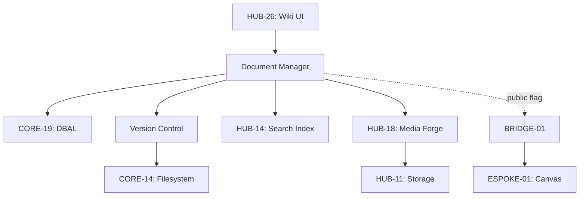

# PHASE ISPOKE-09: Internal Knowledge Base and Wiki

## Tier
Internal Spoke (Staff-only Application)

## Resolves
Corrects Pattern C and Pattern E (`01_MASTER_INDEX.md` §3): the original swapped `HUB-13`
("Full-text Search & Indexing" — real `HUB-13` is I18n) and `HUB-14` ("Media Library & Asset
Management" — real `HUB-14` is Search), and used `HUB-11` for a background indexing job (real `HUB-11`
is Cloud Storage; Queue is `HUB-10`). This is also the specific gap `02_EXEMPLARS/ESPOKE-01.md` flagged
as an undocumented dependency ("`ISPOKE-09` is referenced as a live dependency by `ESPOKE-01` but has
no blueprint file") — that gap is now closed; `ESPOKE-01.md`'s note about it can be considered
resolved.

## Component Name
Sovereign Codex

## Description
Collaborative documentation and knowledge-management platform for staff: the "Sovereign Manual"
containing SOPs, technical documentation, and organizational policies. Markdown editing, version
history, full-text search. This is the content source `ESPOKE-01` (Public CMS) consumes via
`BRIDGE-01` for any content marked public.

## Sequencing Rationale
Follows the Workflow system (`ISPOKE-08`) so documentation can link directly to specific tasks or
approval processes. Must exist before `ESPOKE-01` can be considered feature-complete, since it's the
public CMS's actual content source.

## Build Status
🔴 **Blocked** on `HUB-14` (Search), `HUB-06`, `HUB-18` (Media Forge), `HUB-10` (Queue), `HUB-04`,
`HUB-05` — none implemented.

## Dependency Status — corrected
- **Direct Hub:** ~~`HUB-13: Full-text Search & Indexing`~~ → **`HUB-14: Search Abstraction Layer`**;
  ~~`HUB-14: Media Library & Asset Management`~~ → **`HUB-18: Media Processing Coordination Service`**
  (backed by `HUB-11` Cloud Storage for the actual file bytes); `HUB-06`, `HUB-26`, `HUB-04`, `HUB-05`,
  `HUB-15`.
- **Transitive Core:** `CORE-14`, `CORE-18`, `CORE-19`, `CORE-11`, `CORE-12`, `CORE-06`.

## Architectural Design
- **DocumentManager** — CRUD for Markdown documents and metadata.
- **VersionControl** — revision tracking, side-by-side diffing, rollback.
- **SearchProvider** — integrates with `HUB-14` for instant search across all internal documentation.
- **AssetIncluder** — embeds media from `HUB-18` (which itself reads/writes through `HUB-11`).
- **PublicMarker** — flags a document (or a specific version) as public-eligible; this is the field
  `BRIDGE-01`'s `DTOTransformerInterface` reads when deciding whether `ESPOKE-01` may serve it — a
  document is never public by default.

### Document Architecture Diagram


## Interface Contracts

```php
namespace SovereignStack\Internal\Codex\Contracts;

interface KnowledgeBaseInterface
{
    public function getDocument(string $slug, ?int $version = null): array;
    public function saveDocument(string $slug, string $content, string $staffId, string $summary): bool;
    public function isPublic(string $slug): bool;
}
```

## Integration Strategy
- **Bootstrapping:** via `CORE-18`; verifies search availability via `HUB-15`.
- **Authoring:** reactive Markdown editor built with `HUB-26` components.
- **Indexing:** pushes document updates to `HUB-14` via a `HUB-10` background job (corrected from the
  original's mislabeled `HUB-11`).
- **Permissions:** respects "Departmental" access levels defined in `HUB-05`.
- **Bridge Contract:** only documents with `isPublic() === true` are ever offered to `BRIDGE-01`'s
  registered contract for `ESPOKE-01` — internal-only SOPs are structurally unreachable from the
  public tier, not just access-controlled.
- **Health:** search latency and indexing backlog reported to `HUB-15`.

## Benchmark & Verification Methodology
| Target | Method |
|---|---|
| Search freshness | Integration test: save a document, poll `HUB-14`; report actual measured indexing lag on a stated environment — don't restate "within 2 seconds" unmeasured (Finding 10). |
| Version integrity | Integration test: roll back to a prior version; assert byte-for-byte content match with what was originally saved at that version. |
| Media link validation | Integration test: reference a deleted `HUB-18` asset in a document; assert a validation error surfaces during editing/save, not a silent broken link. |
| Public/internal boundary | Integration test matching `ESPOKE-01.md`'s Bridge Enforcement test: attempt to fetch a non-public document's slug through `BRIDGE-01`; assert rejection, verified from this side of the boundary too (not just `ESPOKE-01`'s). |

## CI Verification Criteria
- Search-freshness measured and reported with environment stated.
- Version-integrity fidelity test, blocking.
- Media-link validation test, blocking.
- Public/internal boundary test (above), blocking — this is the test that makes `PublicMarker`
  load-bearing rather than a field nobody checks.

## SemVer Impact
**Minor.** Centralizes organizational knowledge and technical documentation; **treat as Major** for any
change to the `isPublic()` contract, since `BRIDGE-01`/`ESPOKE-01` depend on its correctness for the
public/internal security boundary.
