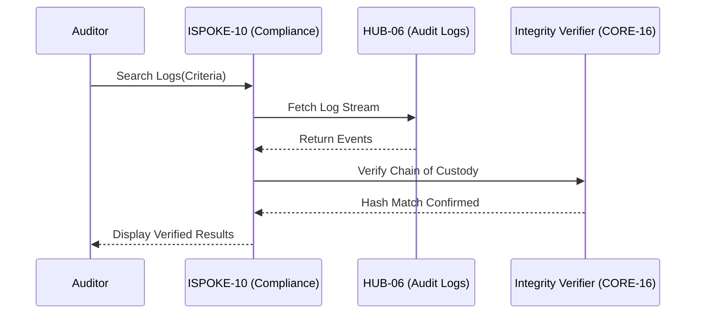

# PHASE ISPOKE-10: Audit and Compliance Review Portal

## Tier
Internal Spoke (Staff-only Application)

## Resolves
Corrects Pattern A and Pattern B (`01_MASTER_INDEX.md` §3): `CORE-09: Cryptography & Hashing` → real
`CORE-09` is PSR-3 Logging, crypto is `CORE-16`. `HUB-28: Distributed Ledger & Analytics Engine` →
**this file's actual described need (signed PDF report generation via a queue, stored in blob storage)
is exactly `HUB-23` (Reporter)'s job** — unlike `ISPOKE-05`/`12`/`13`, this is a mislabeled pointer to
an existing component, not evidence of a missing one (see `01_MASTER_INDEX.md` §4's breakdown). The
original's `HUB-11`/`HUB-14` references in Integration Strategy are also corrected (Pattern C/E).

## Component Name
Sovereign Compliance (Audit)

## Description
A specialized portal for compliance officers and auditors: reviews system activity, verifies policy
adherence, investigates security incidents. Advanced filtering of `HUB-06` audit logs, legal hold
management, compliance report generation.

## Sequencing Rationale
Placed after Workflow (`ISPOKE-08`) and Knowledge Base (`ISPOKE-09`) to enable auditing of both
automated processes and manual documentation changes.

## Build Status
🔴 **Blocked** on `HUB-06`, `HUB-23`, `HUB-05`, `HUB-08` — none implemented.

## Dependency Status — corrected
- **Direct Hub:** `HUB-06`, ~~`HUB-28: Distributed Ledger & Analytics Engine`~~ → **`HUB-23: Data
  Export & Reporting Service`**, `HUB-05`, `HUB-26`, `HUB-08`, `HUB-15`.
- **Transitive Core:** ~~`CORE-09: Cryptography & Hashing`~~ → **`CORE-16: Binary Encryption
  Envelope`** (for signed-report verification), `CORE-18`, `CORE-19`, `CORE-11`, `CORE-12`.

## Architectural Design
- **AuditExplorer** — high-performance log viewer with multi-dimensional filtering.
- **ComplianceReporter** — generates signed PDF reports (GDPR, SOC2) by delegating to `HUB-23`'s
  `ExportCoordinator` rather than implementing its own export pipeline.
- **IncidentInvestigator** — links multiple audit events into a single "Case."
- **IntegrityVerifier** — uses `CORE-16` cryptographic hashes to verify `HUB-06` logs haven't been
  tampered with (corrected from the original's `CORE-09`, which has no cryptographic capability).

### Compliance Review Flow Diagram


## Interface Contracts

```php
namespace SovereignStack\Internal\Compliance\Contracts;

interface ComplianceAuditInterface
{
    public function search(array $filters): array;
    public function generateReport(string $type, \DateTimeInterface $start, \DateTimeInterface $end): string;
}
```

## Integration Strategy
- **Bootstrapping:** via `CORE-18`; restricted to high-privileged staff via `HUB-05`.
- **Data Access:** reads exclusively from the read-only audit stream provided by `HUB-06`.
- **Visualization:** `HUB-26` data tables and timeline components.
- **Reporting:** `generateReport()` calls `HUB-23`'s `queueExport()` (corrected from the original's
  `HUB-11`/`HUB-14` — export generation is a `HUB-10`-queued job, and the finished file is stored via
  `HUB-11`, both already handled inside `HUB-23` rather than reimplemented here).
- **Health:** reports connectivity to immutable log storage to `HUB-15`.

## Benchmark & Verification Methodology
| Target | Method |
|---|---|
| Log immutability | Integration test: alter a single bit of a persisted log entry directly in the database; assert `IntegrityVerifier` (via `CORE-16`) detects the mismatch. |
| Access control | Integration test: non-auditor staff attempts portal access; assert denial and a corresponding "Critical Security Event" entry in `HUB-06`. |
| Search performance at scale | State environment before citing "< 1 second on 10M entries" — measure against a real 10M-row fixture once `CORE-19`/`HUB-06` exist (Finding 10). |
| Report delegation | Integration test asserting `generateReport()` actually calls `HUB-23`'s interface (verifies the Pattern B fix is load-bearing, not text-only). |

## CI Verification Criteria
- Log-immutability detection test, blocking.
- Access-control-logged-as-critical-event test, blocking.
- Report-delegation test (above), blocking.
- Search performance measured against the real fixture and reported with environment stated.

## SemVer Impact
**Major.** Provides the primary mechanism for system accountability and regulatory compliance.
