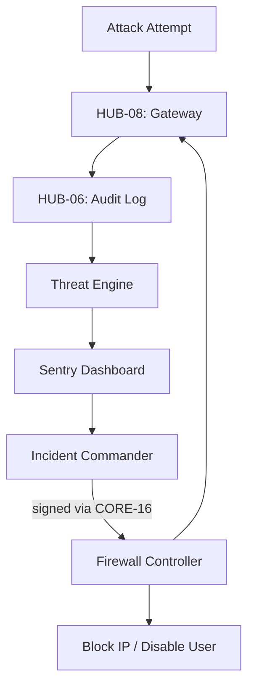

# PHASE ISPOKE-15: Internal Security and Threat Intelligence Dashboard

## Tier
Internal Spoke (Staff-only Application)

## Resolves
Corrects Pattern A, Pattern D, and Pattern B (`01_MASTER_INDEX.md` §3/§4): `CORE-09` → `CORE-16`;
`HUB-12` (used for "high-priority event listeners," which is an Event Bus job) → `HUB-09`; and
`HUB-28: Distributed Ledger & Analytics Engine` — **dropped rather than mapped to `HUB-31`**, since
unlike `ISPOKE-05`/`12`/`13`, this file never actually uses the reference anywhere in its own
Architectural Design section (`ThreatEngine` reads `HUB-06` directly). Completes the Internal Spoke
tier's ID-correction pass — this is the last of the five `HUB-28`-referencing files.

## Component Name
Sovereign Sentry (Security)

## Description
The final Internal Spoke: a Security Operations Center dashboard aggregating threat intelligence,
monitoring suspicious activity (brute-force, SQL injection attempts), and providing rapid incident
response and blocking tools.

## Sequencing Rationale
Final phase of the Internal Spoke sub-tier — monitors and protects all preceding spokes and Hub
services. The "Last Line of Defense" for the internal ecosystem.

## Build Status
🔴 **Blocked** on `HUB-06`, `HUB-04`, `HUB-08` — none implemented.

## Dependency Status — corrected
- **Direct Hub:** `HUB-06`, `HUB-04`, `HUB-08`, ~~`HUB-12` (used for event listeners)~~ → **`HUB-09:
  Event Bus / Message Broker`**, `HUB-26`, `HUB-15`. ~~`HUB-28: Distributed Ledger & Analytics
  Engine`~~ — **removed**, not redirected; see Resolves above. If a real-time security-analytics feed
  is wanted here later, it should be scoped explicitly against `HUB-31` once that's specified, not
  silently reinstated under a new name.
- **Transitive Core:** ~~`CORE-09: Cryptography & Hashing`~~ → **`CORE-16: Binary Encryption
  Envelope`** (used for signing/verifying lockdown commands), `CORE-18`, `CORE-06`, `CORE-19`,
  `CORE-11`, `CORE-12`.

## Architectural Design
- **ThreatEngine** — analyzes the `HUB-06` audit stream in real-time for known attack patterns.
- **FirewallController** — dynamically updates `HUB-08` WAF rules and IP blocklists.
- **AuthWatch** — monitors `HUB-04` for anomalous login patterns ("Impossible Travel").
- **IncidentCommander** — UI for declaring a security incident and triggering automated lockdown
  protocols; lockdown commands are signed via `CORE-16` so `HUB-08`/`HUB-04` can verify they
  originated from this Spoke before acting on them (closes an unstated trust gap in the original —
  "dynamically update WAF rules" had no stated mechanism preventing a compromised intermediate service
  from injecting fake lockdown commands).

### Threat Response Diagram


## Interface Contracts

```php
namespace SovereignStack\Internal\Sentry\Contracts;

interface SecurityOpsInterface
{
    public function blockIP(string $ip, string $reason, int $duration): bool;
    public function triggerTenantLockdown(string $tenantId): void;
}
```

## Integration Strategy
- **Bootstrapping:** via `CORE-18`; registers high-priority event listeners on `HUB-09` (corrected
  from `HUB-12`).
- **Data Stream:** consumes a low-latency "Security Feed" derived from `HUB-06` and `HUB-08`.
- **UI:** "Red Alert" notifications and real-time traffic-anomaly visualization via `HUB-26`.
- **Response:** integrates with `HUB-16` for system-wide maintenance modes during active breaches.
- **Health:** "Security Engine" uptime and "Time to Detect" metrics reported to `HUB-15`.

## Benchmark & Verification Methodology
| Target | Method |
|---|---|
| Detection accuracy | Test against a fixture set of simulated brute-force attack patterns (a stated, versioned fixture — not "simulated attacks" undefined); assert ≥ 99% detection rate against that specific fixture set, reproducibly. |
| Blocking speed | State environment before citing "< 100ms" — measure actual `HUB-08` propagation time on a stated environment (Finding 10). |
| Command authenticity | Integration test: submit a lockdown command with an invalid/missing `CORE-16` signature; assert `HUB-08`/`HUB-04` reject it — this is the test that makes the signed-command mechanism above load-bearing. |
| Fail-safe | Integration test: force the Sentry engine offline; assert `HUB-08` falls back to its last-known-good WAF configuration (per `HUB-08.md`'s circuit-breaker pattern) rather than an open or undefined state. |

## CI Verification Criteria
- Detection-accuracy test against the versioned fixture set, blocking.
- Command-authenticity (signature verification) test, blocking — new, closes the trust gap.
- Fail-safe test, blocking.
- Blocking speed measured and reported with environment stated.

## SemVer Impact
**Major.** Establishes the final security layer for the internal platform.
